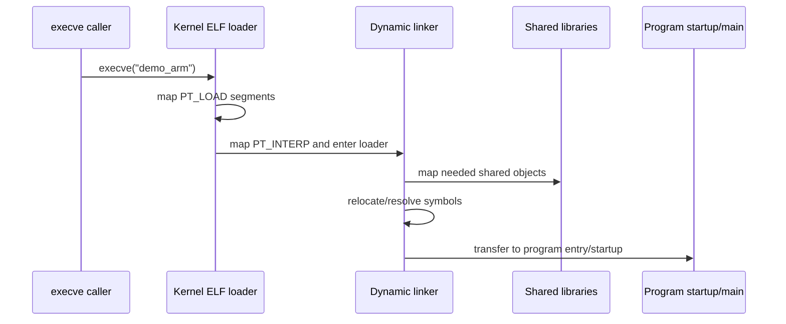

# Chapter 16 - How Linux Loads an Executable: ELF, Loader and Dynamic Linker

> Week 3 / Day 2 - 把 ELF 静态结构接到真正的进程加载路径。

[← Part README](README.md) · [← Previous](ch15_process_fork_exec_syscall.md) · [Next →](ch17_virtual_memory.md)

## 16.1 从 `execve()` 的问题继续：Kernel 面对 ELF 需要解决 4 件事

1. 这个文件是不是可执行格式；
2. 哪些 bytes 映射到哪些 virtual address；
3. 权限是 RX 还是 RW；
4. 如果是动态链接程序，真正第一步该进入谁。

Week 1 已经知道 Section/Segment。今天把它连到 runtime。

## 16.2 Program Header 是 loader 的施工图

```bash
readelf -l ./demo_arm
```

重点看 `LOAD`：

```text
Offset -> file bytes
VirtAddr -> process virtual address
FileSiz/MemSiz -> 文件内容和内存占用
Flags -> R/W/E
Align -> page/segment alignment
```

`.bss` 的本质由 `MemSiz > FileSiz` 体现：额外内存需要零初始化，但文件中不需要为每个 0 占空间。

## 16.3 Section-to-Segment mapping：linker 视角与 loader 视角在这里汇合

```bash
readelf -l ./demo_arm | sed -n '/Section to Segment mapping/,$p'
```

理解：`.text/.rodata` 等 section 被组织进可执行/只读 LOAD segment；`.data/.bss` 进入可写 segment。

这解释为什么“section 是链接器对象，segment 是加载器对象”。

## 16.4 动态链接程序为什么有 `PT_INTERP`

```bash
readelf -l ./demo_arm | grep -A1 INTERP
```

典型能看到类似 `/lib/ld-linux-armhf.so.3`。这意味着 Kernel 建立基础映像后，还把控制交给 dynamic loader。它负责装入依赖的 `.so`、relocation、symbol resolution，最后才进入程序启动代码/main。



## 16.5 `ldd` 不是“ELF 自己列出来的所有库”

Host x86 的 `ldd` 不一定能直接安全/正确分析 ARM binary。优先：

```bash
readelf -d demo_arm | grep NEEDED
```

在 Target 再用 `ldd`（若提供）。

你要区分：

- ELF `DT_NEEDED` 记录直接依赖名字；
- loader 根据 search path/ld cache 实际找到文件；
- library 自己又可能有依赖。

## 16.6 Worked Example：静态链接和动态链接做一次物理对比

若 toolchain 支持静态 libc：

```bash
arm-linux-gnueabihf-gcc -g -O0 demo.c -o demo_dyn
arm-linux-gnueabihf-gcc -static -g -O0 demo.c -o demo_static
ls -lh demo_dyn demo_static
readelf -l demo_dyn | grep INTERP
readelf -l demo_static | grep INTERP || true
```

静态 binary 往往显著增大，但减少 Target runtime shared library dependency。不要得出“静态永远更好”——升级、安全补丁、许可证、存储、插件等都有 trade-off。

## 16.7 Guided Lab：故意制造动态加载失败

在一个隔离目录/测试 rootfs 环境中让 loader 找不到某个自制 shared library，观察：

```text
error while loading shared libraries: ... cannot open shared object file
```

再用：

```bash
readelf -d
LD_DEBUG=libs ./program   # 在支持的 target/glibc 环境中
```

定位搜索过程。

## 16.8 从 MCU startup 迁移：为什么 Linux 的 main 前面也有“startup”

MCU：

```text
Reset_Handler -> data/bss init -> C runtime -> main
```

Linux dynamic app：

```text
Kernel ELF loader -> dynamic linker -> _start/C runtime -> libc init -> main
```

共同点：main 从来不是“宇宙起点”。差异在于 Linux 进程的地址空间、shared library、argv/env/auxv 等由 OS/runtime 协作准备。

## 16.9 Independent Challenge：画 `execve` 到 `main`，并标出 Kernel 与 User Space 边界

不看图自己画，再用 `readelf -h/-l/-d` 给图上三个结论找到证据。

## 16.10 下一章：Loader 一直在说 VirtAddr，但你还没有真正建立 Linux 虚拟地址心智模型

Chapter 17 从一个进程的 `maps` 开始，把 MCU 的“地址几乎就是物理内存”模型升级为 VA -> page table -> PA。

## References and manuals

### ALIENTEK Linux C Application Guide V1.1
- Local expected path: `../references/ALIENTEK_iMX6ULL_Linux_C_Application_Guide_V1.1.pdf`
- Online: [ALIENTEK Linux C Application Guide V1.1](https://github.com/alientek-openedv/imx6ull-document/blob/master/%E3%80%90%E6%AD%A3%E7%82%B9%E5%8E%9F%E5%AD%90%E3%80%91I.MX6U%E5%B5%8C%E5%85%A5%E5%BC%8FLinux%20C%E5%BA%94%E7%94%A8%E7%BC%96%E7%A8%8B%E6%8C%87%E5%8D%97V1.1.pdf)
- 本章阅读定位：找 ELF、库、动态/静态链接、程序启动相关内容。

### ELF manual page
- Online: [ELF manual page](https://man7.org/linux/man-pages/man5/elf.5.html)
- 本章阅读定位：重点 program header/segment/interpreter。

### ld.so(8)
- Online: [ld.so(8)](https://man7.org/linux/man-pages/man8/ld.so.8.html)
- 本章阅读定位：重点 dynamic linker 的搜索与加载职责。

- [Unified source index](../common/source_index.md)

[← Part README](README.md) · [← Previous](ch15_process_fork_exec_syscall.md) · [Next →](ch17_virtual_memory.md)
