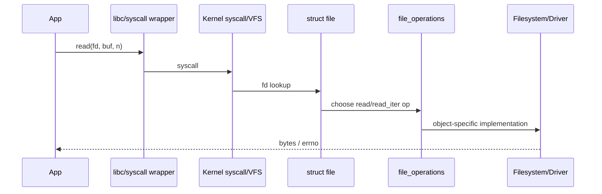

# Chapter 18 - Why Everything Looks Like a File: fd, struct file and UAPI

> Week 3 / Day 4 - 从用户态系统调用建立未来 Driver UAPI 的真实入口模型。

[← Part README](README.md) · [← Previous](ch17_virtual_memory.md) · [Next →](ch19_zephyr_led_key_devicetree.md)

## 18.1 为什么 Linux Driver 学习必须先理解 fd，而不是先背 `file_operations`

以后你会写：

```c
open("/dev/mydev", ...)
ioctl(fd, ...)
poll(...)
mmap(...)
```

如果不理解 fd 是什么，你会把这些 API 当成随机回调。正确模型是：**fd 是进程自己的整数句柄，内核用它找到一个打开实例 `struct file`，再通过该对象的操作表把动作路由到具体 subsystem/driver。**

## 18.2 `fd` 不是设备号，也不是全局对象编号

同一个数字 `3` 在两个 process 里可以指向完全不同对象。它属于 process 的 file descriptor table。

```text
Process
  fd table
   0 -> stdin struct file
   1 -> stdout struct file
   2 -> stderr struct file
   3 -> /dev/xxx struct file
```

这和你理解 VFS 的“延迟绑定/operations 路由”是一致的，但今天从实际 syscall 反过来验证。

## 18.3 Worked Example：打开普通文件并用 strace 看边界

```c
int fd = open("/tmp/demo.txt", O_CREAT|O_RDWR, 0644);
write(fd, "abc\n", 4);
lseek(fd, 0, SEEK_SET);
read(fd, buf, sizeof(buf));
close(fd);
```

```bash
strace -e openat,read,write,lseek,close ./fd_demo
```

注意 glibc `open()` 可能最终表现为 `openat()` syscall。用户 API 名字与 syscall 名字不是必须一一相同。

## 18.4 从 `read(fd)` 到 `file_operations` 的执行路径

简化而准确的模型：



实际新内核很多路径使用 `read_iter` 等更现代接口，教程的重点是对象路由模型，不要把某个版本函数名背死。

## 18.5 `struct file` 表示“打开实例”，不是磁盘文件本体

它包含：

- current position/state；
- flags；
- operations pointer；
- private data 等。

两次 open 同一设备，通常产生不同的 open instance，可拥有不同 `private_data`。以后 Driver 里 per-open context 就放在这里。

## 18.6 `ioctl` 为什么存在：read/write 不能自然表达所有设备控制

例如：

```text
read  -> 读数据
write -> 写数据
ioctl -> SET_MODE / GET_INFO / RESET 等控制语义
```

今天只写用户程序骨架，不设计 ABI：

```c
int fd = open("/dev/null", O_RDWR);
/* ioctl on real driver comes later */
```

观察任意系统程序：

```bash
strace -e ioctl stty -a
```

你会看到终端控制大量依赖 ioctl。

## 18.7 `poll` 的核心语义：等“状态变化/就绪”，而不是循环读

未来按键/IRQ Driver：

```text
User poll()
  sleeps
Driver IRQ happens
  wake_up()
poll returns readable/event
```

今天写一个 pipe/socket 的 `poll()` demo，感受“没有数据时 process sleep，有数据时被唤醒”。Driver 的 waitqueue 以后会复用这个模型。

## 18.8 Guided Lab：做一个未来驱动通用的 `user_tool.c`

先定义 CLI 骨架：

```text
user_tool read <dev>
user_tool write <dev> <value>
user_tool ioctl <dev> ...
user_tool poll <dev>
```

Week 6 真正有 `/dev/mydev` 时直接复用，而不是每个 driver 重写测试 app。

编译时开：

```bash
-Wall -Wextra -Werror -g -O0
```

## 18.9 Independent Challenge：用 `/proc/<pid>/fd` 证明 fd table 是进程视角

程序打开多个文件后 pause，另终端：

```bash
ls -l /proc/<pid>/fd
readlink /proc/<pid>/fd/3
```

再开第二个进程比较相同 fd number 指向。

## 18.10 下一章：Linux 的对象路由已经清楚，回到 Zephyr 看“硬件对象”如何从 DTS 进入编译结果

Chapter 19 给 F407 board 加 LED/KEY。重点不是 GPIO API，而是从原理图 -> board DTS -> binding -> generated data -> device API 的完整链。

## References and manuals

### ALIENTEK Linux C Application Guide V1.1
- Local expected path: `../references/ALIENTEK_iMX6ULL_Linux_C_Application_Guide_V1.1.pdf`
- Online: [ALIENTEK Linux C Application Guide V1.1](https://github.com/alientek-openedv/imx6ull-document/blob/master/%E3%80%90%E6%AD%A3%E7%82%B9%E5%8E%9F%E5%AD%90%E3%80%91I.MX6U%E5%B5%8C%E5%85%A5%E5%BC%8FLinux%20C%E5%BA%94%E7%94%A8%E7%BC%96%E7%A8%8B%E6%8C%87%E5%8D%97V1.1.pdf)
- 本章阅读定位：重点 open/read/write/ioctl/poll 与文件 IO/系统编程章节。

### open(2)
- Online: [open(2)](https://man7.org/linux/man-pages/man2/open.2.html)
- 本章阅读定位：重点 open file description 与 fd 基础。

### poll(2)
- Online: [poll(2)](https://man7.org/linux/man-pages/man2/poll.2.html)
- 本章阅读定位：理解 blocking wait/ready events。

- [Unified source index](../common/source_index.md)

[← Part README](README.md) · [← Previous](ch17_virtual_memory.md) · [Next →](ch19_zephyr_led_key_devicetree.md)
