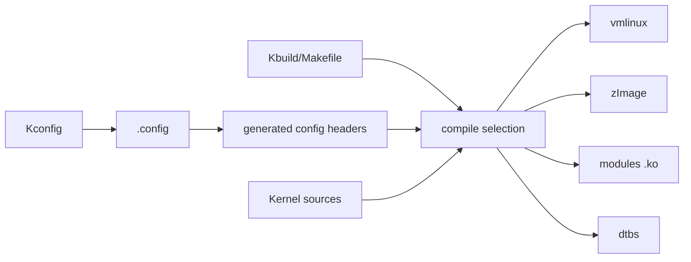

# Chapter 22 - How a Linux Kernel Is Built: Kconfig, Kbuild and Artifacts

> Week 4 / Day 1 - 把 Kernel 构建从“make 命令”还原为配置驱动的依赖图。

[← Part README](README.md) · [Next →](ch23_first_kernel_module.md)

## 22.1 为什么先学构建体系再写 `.ko`

很多驱动教程第一行就是 `obj-m += hello.o`，结果学习者会用模板，却不知道 Kernel 中某段代码为什么被编译、某个 config 为什么没有生效。你已经做过 Yocto、linker 和构建，所以本章把 Linux Kernel build system 当成一个“配置驱动的程序生成系统”来理解。



## 22.2 Kconfig 决定“有什么选择”，`.config` 记录“这次选了什么”

Kconfig 是菜单/依赖/默认值规则；`.config` 是某次构建的具体结果。

```bash
make menuconfig
```

不要只在 UI 里点。改一个安全选项后：

```bash
cp .config /tmp/config.after
scripts/diffconfig /tmp/config.before /tmp/config.after 2>/dev/null || diff -u /tmp/config.before /tmp/config.after
```

重点理解三态：

```text
CONFIG_FOO=y  built-in
CONFIG_FOO=m  module
# ... is not set  disabled
```

不是所有 symbol 都支持 `m`；依赖也会导致菜单项不可见。

## 22.3 Kbuild：它解决“哪些 C 文件组成哪个目标”

典型内核目录 Makefile：

```make
obj-$(CONFIG_FOO) += foo.o
foo-y := core.o helper.o
```

费曼解释：Kconfig 像订单，Kbuild 像装配清单。订单说“我要这个功能 built-in/module/off”，装配清单说“这个功能由哪些 object 组成”。

## 22.4 `vmlinux` 是所有路径汇合的核心链接产物

简化：

```text
many .o + built-in.a
 -> linker script
 -> vmlinux ELF
 -> architecture image packaging
 -> zImage
```

观察：

```bash
file vmlinux
readelf -h vmlinux | head -30
nm -n vmlinux | head
ls -lh vmlinux arch/arm/boot/zImage
```

`System.map` 是符号地址映射快照；后面 Oops 会用。

## 22.5 Modules 为什么可以在 Kernel 已运行时再装入

配置 `=m` 的功能生成 relocatable loadable module。运行时 Kernel module loader：

- 检查 module metadata/ABI；
- 解析需要的 symbols；
- 分配内核内存；
- relocation；
- 调用 module init。

Chapter 23/24 再实操。

## 22.6 Worked Example：跟踪一个 config 到源文件

选一个小功能：

```bash
grep -R "config <SYMBOL>" -n .
grep -R "CONFIG_<SYMBOL>" -n drivers/ | head
```

回答：

```text
Kconfig 定义在哪里？
Makefile/Kbuild 谁消费？
最终哪些 .o 被编译？
=y 和 =m 产物有什么不同？
```

这套方法以后比背菜单路径更可靠。

## 22.7 Guided Lab：只改一个 config 并验证产物差异

选择一个非核心、小型、可模块化配置，before/after 分别保存：

```text
.config
modules list
build log
```

不需要把它装到板上，本章目的是验证 Kconfig -> Kbuild 因果链。

## 22.8 Independent Challenge：解释为什么修改 `.config` 后还可能被 olddefconfig 调整

查 Kconfig dependency/default，写出“用户选择”与“依赖求解”不是完全等价的原因。

## 22.9 下一章：现在你知道 `.ko` 从哪里来，开始写第一个可装载对象

Chapter 23 的 Hello Module 不追求功能，而用最小代码观察 module lifecycle：build -> insmod -> init -> metadata -> rmmod -> exit。

## References and manuals

### ALIENTEK Linux Driver Guide V1.5.2
- Local expected path: `../references/ALIENTEK_iMX6ULL_Linux_Driver_Guide_V1.5.2.pdf`
- Online: [ALIENTEK Linux Driver Guide V1.5.2](https://github.com/alientek-openedv/imx6ull-document/blob/master/%E3%80%90%E6%AD%A3%E7%82%B9%E5%8E%9F%E5%AD%90%E3%80%91I.MX6U%E5%B5%8C%E5%85%A5%E5%BC%8FLinux%E9%A9%B1%E5%8A%A8%E5%BC%80%E5%8F%91%E6%8C%87%E5%8D%97V1.5.2.pdf)
- 本章阅读定位：找 Linux Kernel 编译、驱动模块编译、menuconfig/Kconfig 相关章节。

### Linux Kbuild
- Online: [Linux Kbuild](https://docs.kernel.org/kbuild/index.html)
- 本章阅读定位：本章主官方资料：Kconfig/Kbuild 构建结构。

- [Unified source index](../common/source_index.md)

[← Part README](README.md) · [Next →](ch23_first_kernel_module.md)
