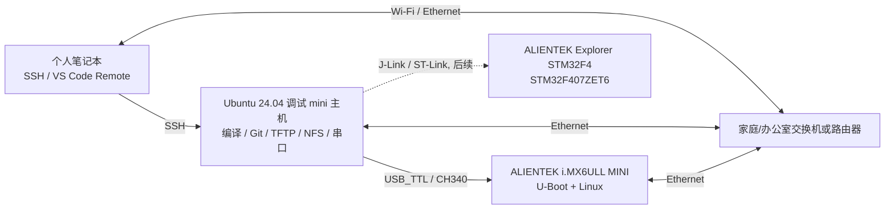

# Week 1 - Embedded Linux / Zephyr Development Environment Handbook

## 本周主题：建立一个真正可复现的 Host -> Target 开发闭环

### 你的真实开发环境

本教程**不使用 VMware**。你的工作方式按下面这个真实拓扑设计：



**核心原则：**个人笔记本是“人机界面”；Ubuntu mini 主机才是固定开发 Host。代码、工具链、Git 仓库、TFTP/NFS 服务、串口日志均留在 Ubuntu Host 上。这样换笔记本、重启 SSH 客户端都不会改变开发环境。

---

## 1. 为什么 Week 1 必须先做这些

后续 19 周会进入 DeviceTree、Driver Model、IRQ、DMA、PCIe、Yocto 和异构 IPC。如果 Host/Target 链路不稳定，你无法判断失败到底来自：
- 代码；
- 工具链；
- 网络；
- 串口；
- U-Boot 环境；
- 还是开发主机本身。

因此 Week 1 的目标不是“安装软件”，而是把环境变成**可观察、可复现、可排错**的工程基础设施。

---

## 2. 阅读顺序

| Day / Chapter | 解决的问题 | 完成后必须得到的产物 | 教程 |
|---|---|---|---|
| Day 1 / Ch.1 | 物理 Ubuntu Host 如何成为长期开发机？笔记本如何远程开发？ | `host_baseline.md`、SSH key、目录树 | [Chapter 1](chapters/ch01_physical_ubuntu_dev_host.md) |
| Day 2 / Ch.2 | x86 Ubuntu 为什么能生成 ARM 程序？ELF 到底是什么？ | x86/ARM 两套 ELF + `toolchain_baseline.md` | [Chapter 2](chapters/ch02_cross_compile_and_elf.md) |
| Day 3 / Ch.3 | 如何通过 USB 调试串口掌控 MINI，并打通基础网络？ | 完整 boot log、IP 表、双向 ping 证据 | [Chapter 3](chapters/ch03_imx6ull_mini_serial_and_network.md) |
| Day 4 / Ch.4 | 如何建立 U-Boot TFTP + Linux NFS 的快速闭环？ | TFTP/NFS 可用 + ARM 程序由 NFS 运行 | [Chapter 4](chapters/ch04_tftp_nfs_dev_loop.md) |
| Day 5 / Ch.5 | Zephyr 的 west/workspace/SDK 到底是什么？ | 固定版本 workspace + 官方 F4 build | [Chapter 5](chapters/ch05_zephyr_environment.md) |
| Day 6 / Ch.6 | 真实 Explorer F407 板到底有哪些资源？哪些能直接用于 Zephyr？ | `f407_board_audit.md` | [Chapter 6](chapters/ch06_f407_hardware_audit.md) |
| Day 7 / Ch.7 | 能否不看聊天记录恢复整个环境？ | Week 1 验收报告 + Git commit | [Chapter 7](chapters/ch07_reproducibility_gate.md) |

---

## 3. 配套实验文件

- [hello.c](labs/hello.c)：Day 2/Day 4 使用的最小 ARM C 程序。
- [F407 audit template](labs/f407_board_audit_template.md)：Day 6 使用。
- [capture_host_baseline.sh](tools/capture_host_baseline.sh)：采集 Host 基线。
- [check_week1.sh](tools/check_week1.sh)：Day 7 自检脚本。
- [Reference Manual Index](references/README.md)：所有手册、章节、版本和链接。
- [Week 1 -> 20 Week Plan Mapping](week01_plan_mapping.md)：说明真实环境修正，没有改变总路线。

---

## 4. 本周使用的原始资料

### 正点原子 I.MX6ULL
- [I.MX6U 用户快速体验 V1.8 - PDF Archive](https://github.com/alientek-openedv/imx6ull-document/blob/master/%E3%80%90%E6%AD%A3%E7%82%B9%E5%8E%9F%E5%AD%90%E3%80%91I.MX6U%E7%94%A8%E6%88%B7%E5%BF%AB%E9%80%9F%E4%BD%93%E9%AA%8CV1.8.pdf)
- [I.MX6U 快速体验 - 官方在线文档](https://wiki.alientek.com/docs/category/imx6u-%E5%BF%AB%E9%80%9F%E4%BD%93%E9%AA%8C%E6%89%8B%E5%86%8C/)
- [I.MX6U Linux 驱动开发指南 V1.5.2 - PDF Archive](https://github.com/alientek-openedv/imx6ull-document/blob/master/%E3%80%90%E6%AD%A3%E7%82%B9%E5%8E%9F%E5%AD%90%E3%80%91I.MX6U%E5%B5%8C%E5%85%A5%E5%BC%8FLinux%E9%A9%B1%E5%8A%A8%E5%BC%80%E5%8F%91%E6%8C%87%E5%8D%97V1.5.2.pdf)
- [I.MX6U 网络环境 TFTP&NFS 搭建手册 V1.3.1 - PDF Archive](https://github.com/alientek-openedv/imx6ull-document/blob/master/%E3%80%90%E6%AD%A3%E7%82%B9%E5%8E%9F%E5%AD%90%E3%80%91I.MX6U%E7%BD%91%E7%BB%9C%E7%8E%AF%E5%A2%83TFTP%26NFS%E6%90%AD%E5%BB%BA%E6%89%8B%E5%86%8CV1.3.1.pdf)
- [正点原子 i.MX6ULL 文档存档库](https://github.com/alientek-openedv/imx6ull-document)

### Zephyr
- [Getting Started - Ubuntu 24.04+](https://docs.zephyrproject.org/latest/develop/getting_started/index.html)
- [west Basics](https://docs.zephyrproject.org/latest/develop/west/basics.html)
- [STM32F4 Discovery reference board](https://docs.zephyrproject.org/latest/boards/st/stm32f4_disco/doc/index.html)

### STM32F4
- [Explorer STM32F4 V2.2 Schematic](references/Explorer_STM32F4_V2.2_SCH.pdf)

---

## 5. 每章的学习方法

每章不是“命令列表”，而按下面的人类学习顺序展开：

```text
先知道今天为什么学
    ->
建立最小心智模型
    ->
看一个完整 Worked Example
    ->
自己逐步 Guided Lab
    ->
观察真实输出
    ->
主动制造一个错误
    ->
按层级排错
    ->
脱离教程复述
    ->
留下可复现的工程产物
```

遇到教程中的示例 IP、用户名、网卡名时，不允许机械照抄。先执行识别命令，再把示例值替换成你的真实值。
