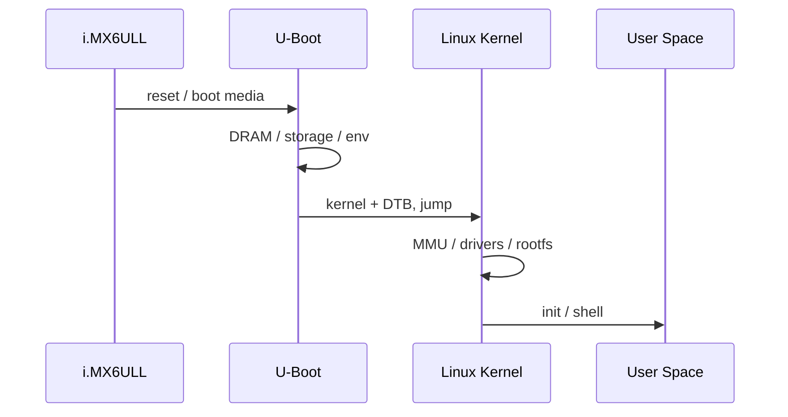
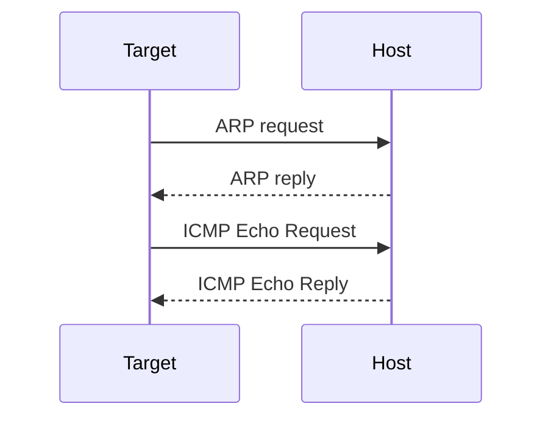

# Chapter 3 - 第一次完整控制 I.MX6ULL MINI：串口、U-Boot、Linux、网络

## 3.1 今天的完成态

今天结束时，链路必须是：


你需要留下：
- 一份完整 U-Boot + Linux boot log；
- 一张真实 IP 表；
- Ubuntu Host 和 I.MX6ULL MINI 双向 ping 结果；
- MINI `eth0`、CPU、内存、rootfs 基线。

---

## 3.2 先认清 MINI 的接口角色

正点原子官方资料确认：
- ALPHA/MINI 共用 I.MX6ULL Cortex-A7 平台；
- **MINI 只支持一路网口 `eth0`**；
- 出厂默认调试串口为 UART1；
- 快速体验 2.1.2 串口默认 **115200**，flow control **None**。

### 不要把三个 USB 概念混在一起

```text
USB_TTL / debug UART -> 看 U-Boot/Linux console
USB_OTG              -> 烧写/USB OTG
USB Host             -> U盘/外设
```

---

## 3.3 实物连接

推荐：

```text
Ubuntu Host USB --------> I.MX6ULL MINI USB_TTL
Ubuntu Host Ethernet ---> switch/router <--- I.MX6ULL MINI RJ45
I.MX6ULL power ---------> 独立电源
```

上电前检查：

1. USB 线连接 `USB_TTL`；
2. 网线插 MINI 唯一 RJ45；
3. 启动拨码保持当前可正常启动状态；
4. Week 1 不烧写系统，不为了实验乱改 boot switch。

正点原子 **2.2.3.1** 给出了 eMMC/NAND/SD/USB 启动拨码定义；若板子当前出厂系统能启动，本周先保持原样。

[2.2 official](https://wiki.alientek.com/docs/Boards/Linux/IMX6U/I.MX6U%20%E5%BF%AB%E9%80%9F%E4%BD%93%E9%AA%8C%E6%89%8B%E5%86%8C/preparation/curing_system/)

---

## 3.4 Ubuntu Host 识别 CH340

Host 开一个 SSH 窗口：

```bash
sudo dmesg -w
```

插入 USB_TTL。

典型：

```text
ch341-uart converter now attached to ttyUSB0
```

另一个窗口：

```bash
lsusb
ls -l /dev/ttyUSB*
```

若没有设备：

```bash
lsusb
lsmod | grep ch341
modinfo ch341
sudo modprobe ch341
dmesg | tail -50
```

`lsusb` 都看不到时，先查数据线/USB 口，不要先改权限。

---

## 3.5 普通用户串口权限

```bash
ls -l /dev/ttyUSB0
```

常见 group：

```text
dialout
```

加入：

```bash
sudo usermod -aG dialout "$USER"
```

退出 SSH、重新登录：

```bash
id
```

必须看到 `dialout`。

---

## 3.6 打开调试串口

```bash
picocom -b 115200 --flow n /dev/ttyUSB0
```

含义：
- `-b 115200`：baud；
- `--flow n`：no flow control；
- 默认按 8N1 理解。

退出：

```text
Ctrl+A
Ctrl+X
```

正点原子快速体验 **2.1.2** 的 Windows/MobaXterm 设置同样是 115200 + None；这里只是把串口客户端改成 Ubuntu `picocom`。

---

## 3.7 保存启动日志

```bash
mkdir -p ~/work/logs
script -f ~/work/logs/imx6ull_boot_$(date +%Y%m%d_%H%M%S).log \
    -c "picocom -b 115200 --flow n /dev/ttyUSB0"
```

然后重新上电。

以后：
- Kernel panic；
- Driver probe fail；
- U-Boot env；
都应留原始日志，而不是只拍一张截图。

---

## 3.8 区分 U-Boot 和 Linux



U-Boot 常见：

```text
U-Boot ...
DRAM:
MMC:
Net:
Hit any key to stop autoboot:
```

Linux 常见：

```text
Linux version ...
Kernel command line:
Memory:
...
```

---

## 3.9 停在 U-Boot，只观察不永久修改

在倒计时时按键。

执行：

```bash
version
bdinfo
printenv
```

保存 `printenv`。

今天**不要 `saveenv`**。

继续：

```bash
run bootcmd
```

如果当前环境有 `boot` 命令也可以使用，但以 `printenv bootcmd` 为准。

---

## 3.10 Linux Target 基线

```bash
uname -a
cat /proc/cpuinfo
cat /proc/meminfo | head -20
cat /proc/cmdline
mount
df -h
```

DeviceTree model：

```bash
tr -d '\0' < /proc/device-tree/model
echo
```

---

## 3.11 MINI 唯一网口 `eth0`

```bash
ip -br link 2>/dev/null || ifconfig -a
ip -br addr 2>/dev/null || ifconfig
```

若 DHCP 存在但 `eth0` 无地址，按正点原子 3.11：

```bash
udhcpc -i eth0
```

再：

```bash
ifconfig eth0
```

官方 3.11 明确：MINI 只支持一路 `eth0`。

[3.11 official](https://wiki.alientek.com/docs/Boards/Linux/IMX6U/I.MX6U%20%E5%BF%AB%E9%80%9F%E4%BD%93%E9%AA%8C%E6%89%8B%E5%86%8C/function%20test/eth0_test/)

---

## 3.12 建立真实 IP 表

课程示例：

| Node | Example |
|---|---|
| Router | `192.168.10.1/24` |
| Ubuntu Host | `192.168.10.10/24` |
| I.MX6ULL MINI | `192.168.10.20/24` |
| Laptop | DHCP |

必须替换成真实 LAN。

Target 临时静态 IP：

```bash
ifconfig eth0 192.168.10.20 netmask 255.255.255.0 up
```

或：

```bash
ip addr flush dev eth0
ip addr add 192.168.10.20/24 dev eth0
ip link set eth0 up
```

---

## 3.13 双向 ping

Target：

```bash
ping -c 4 192.168.10.10
```

Host：

```bash
ping -c 4 192.168.10.20
```

同网段仍要 ARP：



---

## 3.14 用 tcpdump 看真实包

Host 找真实 Ethernet：

```bash
ip -br link
```

然后：

```bash
sudo tcpdump -ni <host-ethernet-iface> 'arp or icmp'
```

Target：

```bash
ping -c 2 <host-ip>
```

判断：
- 只 ARP request 无 reply -> 二层/地址；
- ARP 正常但 ICMP 无 reply -> 更高层/firewall；
- 什么都没有 -> 抓错接口或包没到 Host。

---

## 3.15 网络排障树

```text
link LED?
 -> eth0 UP?
 -> Host/Target same subnet?
 -> route correct?
 -> ARP neighbor exists?
 -> tcpdump sees packets?
 -> firewall?
```

Host：

```bash
ip neigh
ip route get <target-ip>
sudo ethtool <host-ethernet-iface>
```

---

## 3.16 Target SSH/SCP 是可选项

原计划要求 SSH/SCP，但不同出厂 rootfs 不应假定一定有 sshd。

Target 先：

```bash
ss -lnt 2>/dev/null | grep ':22'
ps | grep -E 'sshd|dropbear'
```

有服务才：

```bash
ssh root@<target-ip>
scp file root@<target-ip>:/tmp/
```

没有就记录“factory rootfs has no SSH server”，不要为了打勾破坏 Day 3 主线。Day 4 NFS 才是主要开发通道。

---

## 3.17 本章验收

必须：
- `/dev/ttyUSBx` 稳定；
- 115200/8N1/no-flow；
- 保存完整 boot log；
- 能停 U-Boot、查看 `printenv`；
- Linux shell 正常；
- MINI `eth0` IP 明确；
- Host/Target 双向 ping；
- tcpdump 看到 ARP/ICMP。

口述：
1. U-Boot `printenv` 与 Linux 环境变量是不是同一层？
2. MINI 为什么只用 `eth0`？
3. 同网段为什么仍需 ARP？
4. 为什么今天不 `saveenv`？

---

## 3.18 原始资料

- `ALI-QUICK-1.8`
  - **2.1.1** CH340；
  - **2.1.2** 115200 / flow None；
  - **2.2.3** 登录/启动介质；
  - **3.11** MINI `eth0` / `udhcpc -i eth0`。
- [Serial official](https://wiki.alientek.com/docs/Boards/Linux/IMX6U/I.MX6U%20%E5%BF%AB%E9%80%9F%E4%BD%93%E9%AA%8C%E6%89%8B%E5%86%8C/preparation/installation/)
- [Boot official](https://wiki.alientek.com/docs/Boards/Linux/IMX6U/I.MX6U%20%E5%BF%AB%E9%80%9F%E4%BD%93%E9%AA%8C%E6%89%8B%E5%86%8C/preparation/curing_system/)
- [Ethernet official](https://wiki.alientek.com/docs/Boards/Linux/IMX6U/I.MX6U%20%E5%BF%AB%E9%80%9F%E4%BD%93%E9%AA%8C%E6%89%8B%E5%86%8C/function%20test/eth0_test/)
- [PDF archive](https://github.com/alientek-openedv/imx6ull-document/blob/master/%E3%80%90%E6%AD%A3%E7%82%B9%E5%8E%9F%E5%AD%90%E3%80%91I.MX6U%E7%94%A8%E6%88%B7%E5%BF%AB%E9%80%9F%E4%BD%93%E9%AA%8CV1.8.pdf)
