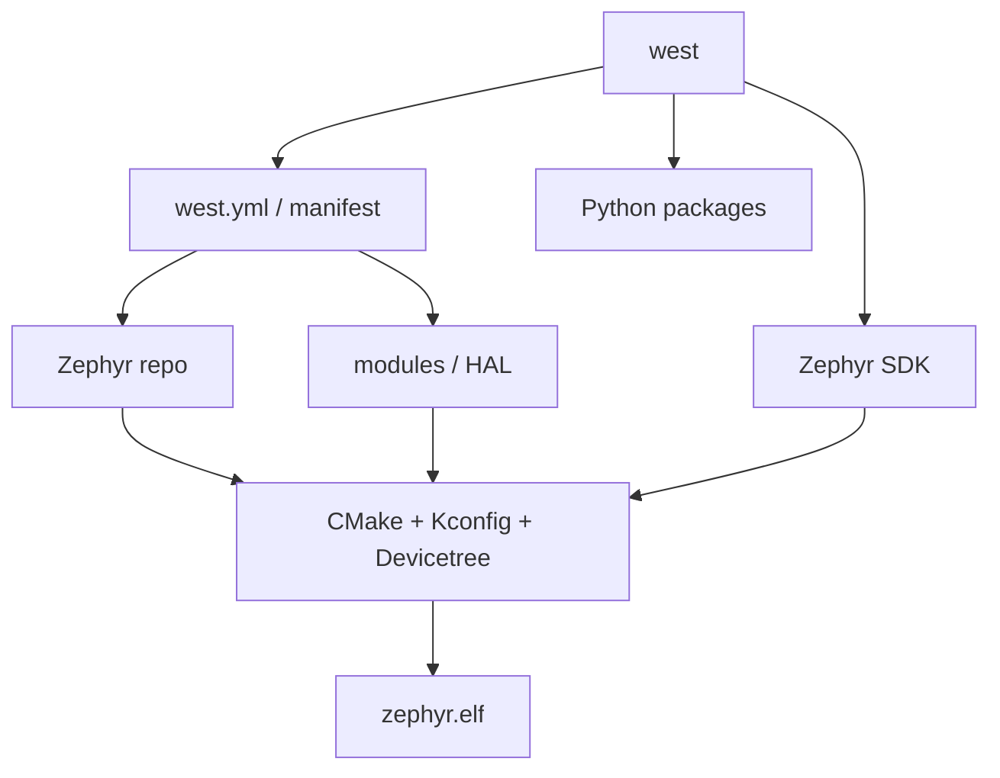

# Chapter 5 - 建立 Zephyr 4.4.1 官方环境：先理解 workspace，再谈板级移植

## 5.1 今天先不移植 Explorer

目标：

> 证明 Ubuntu 24.04 Host 可以用固定 Zephyr 版本、正确 Python 环境、west modules 和 ARM SDK，clean build 一个 upstream STM32F4 sample。

不做：
- Explorer DTS；
- MCUboot；
- W25Q128；
- 自定义 Driver。

upstream 都 build 不过时，自定义 board 只会混淆变量。

---

## 5.2 west 不是 GCC



费曼版：
- west：workspace/project manager；
- manifest：仓库清单和版本；
- SDK：真正的 compiler/assembler/linker/debug tools；
- Kconfig：软件 feature；
- Devicetree：硬件描述；
- CMake：把构建组织起来。

---

## 5.3 Ubuntu 24.04 dependencies

Zephyr 官方 Getting Started 当前明确覆盖 Ubuntu 24.04+。

```bash
sudo apt update
sudo apt install --no-install-recommends -y \
  git cmake ninja-build gperf ccache \
  dfu-util device-tree-compiler wget \
  python3-dev python3-venv python3-tk \
  xz-utils file make gcc gcc-multilib g++-multilib \
  libsdl2-dev libmagic1
```

检查：

```bash
cmake --version
python3 --version
dtc --version
ninja --version
```

官方当前主要最低版本：
- CMake 3.28；
- Python 3.12；
- DTC 1.4.6。

---

## 5.4 Python venv

```bash
mkdir -p ~/work/zephyr
python3 -m venv ~/work/zephyr/.venv
source ~/work/zephyr/.venv/bin/activate
```

验证：

```bash
which python
which pip
```

必须在：

```text
~/work/zephyr/.venv/
```

不要 `sudo pip install west`。

---

## 5.5 安装 west 并固定 v4.4.1

```bash
python -m pip install --upgrade pip
pip install west
west --version
```

创建 workspace：

```bash
west init \
  -m https://github.com/zephyrproject-rtos/zephyr \
  --mr v4.4.1 \
  ~/work/zephyr/workspace
```

`--mr v4.4.1` 把 manifest revision 固定下来，避免教程跟 `main` 漂移。

进入：

```bash
cd ~/work/zephyr/workspace
ls -la .west
```

---

## 5.6 `west update`

```bash
west update
```

这会根据 Zephyr `west.yml` 获取多个 project/module，不只是一个 git pull。

下载时间不计入主动学习 2h。

完成：

```bash
west topdir
west list | head -30
```

---

## 5.7 Python packages 和 CMake export

```bash
west packages pip --install
west zephyr-export
```

第一条根据当前 workspace 安装 Python dependencies。

第二条把当前 Zephyr checkout 注册给 CMake user package registry。

---

## 5.8 只安装 ARM SDK toolchain

```bash
cd ~/work/zephyr/workspace/zephyr
west sdk list
west sdk install --toolchains arm-zephyr-eabi
west sdk list
```

只装 ARM，避免 Week 1 下载不需要的架构。

---

## 5.9 upstream `stm32f4_disco` clean build

```bash
cd ~/work/zephyr/workspace/zephyr

west build -p always \
  -b stm32f4_disco \
  samples/hello_world
```

`-p always`
: pristine build，官方 Getting Started 推荐新手阶段使用，避免 stale cache。

`stm32f4_disco`
: **只做同系列 SoC 的环境 smoke test，不代表 Explorer。**

---

## 5.10 打开构建产物，而不是只看成功字符串

```bash
cd ~/work/zephyr/workspace/zephyr/build
find zephyr -maxdepth 2 -type f | sort | head -80
```

重点：

```text
zephyr/zephyr.elf
zephyr/zephyr.bin
zephyr/zephyr.hex
zephyr/zephyr.dts
zephyr/.config
```

看最终 DTS：

```bash
less zephyr/zephyr.dts
```

看配置：

```bash
grep -E '^CONFIG_(BOARD|SOC|SERIAL|CONSOLE)' zephyr/.config | head -40
```

看 ELF：

```bash
file zephyr/zephyr.elf
arm-zephyr-eabi-readelf -h zephyr/zephyr.elf
```

把 Day 2 ELF 知识迁移到 RTOS。

---

## 5.11 故障实验 A：venv 未激活

```bash
deactivate
which west
west --version
```

可能找不到 west 或找到另一个版本。

恢复：

```bash
source ~/work/zephyr/.venv/bin/activate
```

---

## 5.12 故障实验 B：board 名错误

```bash
west build -p always \
  -b definitely_not_a_board \
  samples/hello_world
```

再：

```bash
west boards | grep -i stm32f4
```

原则：board 名用工具/官方目录确认，不猜。

---

## 5.13 固化恢复动作

```bash
cat > ~/work/zephyr/activate.sh <<'EOF'
#!/usr/bin/env bash
set -e
source "$HOME/work/zephyr/.venv/bin/activate"
cd "$HOME/work/zephyr/workspace"
west topdir
EOF

chmod +x ~/work/zephyr/activate.sh
```

新 SSH：

```bash
source ~/work/zephyr/activate.sh
```

---


## 5.14 构建日志要学会看什么，而不是只看最后一行

第一次执行 `west build` 时，建议把完整输出保存下来：

```bash
mkdir -p ~/work/zephyr/logs

west build -p always \
  -b stm32f4_disco \
  samples/hello_world \
  2>&1 | tee ~/work/zephyr/logs/week1_stm32f4_disco_build.log
```

然后在日志中搜索：

```bash
grep -E \
  'BOARD:|ZEPHYR_BASE|toolchain|Found Python|Found Dtc|Generated zephyr.dts|Generated autoconf.h' \
  ~/work/zephyr/logs/week1_stm32f4_disco_build.log
```

不同 Zephyr 版本的具体提示文字可能略有差异，所以不要把某一行字符串当作 API。真正要确认的是五件事：

```text
1. board target 最终解析成了谁？
2. ZEPHYR_BASE 指向哪个源码树？
3. 使用了哪个 toolchain？
4. Devicetree 是否成功生成最终 zephyr.dts？
5. Kconfig 是否生成最终 .config/autoconf 配置？
```

### 为什么这一步很重要

以后自定义 Explorer board 时，如果 build 失败，你要判断错误属于：

```text
Python/west
    ↓
CMake
    ↓
board discovery
    ↓
Devicetree
    ↓
Kconfig
    ↓
compiler/linker
```

如果你只记得“west build 成功/失败”，就没有调试层次。

---

## 5.15 认识 workspace 中几个真正重要的位置

在 workspace 根目录：

```bash
cd ~/work/zephyr/workspace
pwd
find . -maxdepth 2 -type d | sort | head -80
```

然后分别看：

```bash
cat .west/config
git -C zephyr status --short
git -C zephyr describe --tags --always
west list zephyr
west list cmsis 2>/dev/null || true
west list hal_stm32 2>/dev/null || true
```

你需要形成这样的对象关系：

```text
workspace topdir
├── .west/
│   └── config
│       └── 指向 manifest repository
│
├── zephyr/
│   ├── west.yml
│   ├── boards/
│   ├── dts/
│   ├── drivers/
│   └── samples/
│
└── modules / bootloader / tools ...
    └── 由 manifest project 管理
```

### `west.yml` 为什么关键

执行：

```bash
cd ~/work/zephyr/workspace/zephyr
sed -n '1,160p' west.yml
```

不用读完整文件，只找：

```text
manifest:
projects:
revision:
path:
```

你要看到：

> Zephyr 不是“一个 Git 仓库 = 全部源码”。它通过 manifest 锁定很多依赖项目的路径与 revision。

这和 Yocto 后面管理 layer / source revision 的思想会产生迁移。

---

## 5.16 验证当前版本真的被固定住

执行：

```bash
cd ~/work/zephyr/workspace/zephyr
git rev-parse --short HEAD
git describe --tags --always
git status --short
```

课程目标是固定在 `v4.4.1` 对应代码基线上。

如果 `git status --short` 出现你没有预期的修改，先不要继续自定义 board。否则你以后很难分辨错误来自课程修改还是 workspace 污染。

把版本写入：

```bash
{
    date -Is
    git rev-parse HEAD
    git describe --tags --always
    west --version
    cmake --version | head -1
    python3 --version
} | tee ~/work/zephyr/logs/zephyr_environment_baseline.txt
```

---

## 5.17 Zephyr 下载/环境问题的分层排障

### 情况 A：`west: command not found`

检查：

```bash
echo "$VIRTUAL_ENV"
which python
which west
```

如果 `VIRTUAL_ENV` 为空，先激活：

```bash
source ~/work/zephyr/.venv/bin/activate
```

### 情况 B：`west update` Git 下载失败

先不要重建 workspace。

检查：

```bash
git ls-remote https://github.com/zephyrproject-rtos/zephyr.git HEAD
```

如果这条都失败，是 Host 的 Git/DNS/代理问题，不是 west 逻辑问题。

再检查：

```bash
env | grep -i proxy
git config --global --get-regexp 'http.*proxy' || true
```

### 情况 C：board 不存在

```bash
west boards | grep -i stm32
```

如果工具能列出 board，而你输入的名字不在列表中，就属于 board identifier 错误。

### 情况 D：SDK/toolchain 找不到

```bash
west sdk list
which arm-zephyr-eabi-gcc || true
```

不要先改 `PATH` 猜测。先确认 SDK 是否安装、west 是否能识别。

### 情况 E：上一次 build 缓存污染

```bash
west build -t pristine
```

或者直接：

```bash
west build -p always ...
```

这也是为什么 Week 1 全部用 pristine build。

---

## 5.18 本章实验记录应该长什么样

在：

```text
~/work/zephyr/logs/
```

至少留下：

```text
zephyr_environment_baseline.txt
week1_stm32f4_disco_build.log
```

同时在笔记中写：

```text
Zephyr revision:
west version:
SDK/toolchain:
upstream test board:
sample:
build result:
zephyr.elf machine:
final zephyr.dts location:
final .config location:
```

这些信息比“今天把 Zephyr 装好了”有用得多。


## 5.19 本章验收

```bash
source ~/work/zephyr/activate.sh
cd ~/work/zephyr/workspace/zephyr

git describe --tags --always
west topdir
west sdk list

west build -p always \
  -b stm32f4_disco \
  samples/hello_world
```

回答：
1. west vs GCC？
2. manifest 是什么？
3. `west update` 为什么操作多个 repo？
4. `zephyr.dts` 是什么阶段的文件？
5. 为什么不能把 `stm32f4_disco` 当 Explorer DTS 直接复制？

---

## 5.20 原始资料

- Zephyr Getting Started（Ubuntu 24.04+）：[Official](https://docs.zephyrproject.org/latest/develop/getting_started/index.html)
- west Basics：[Official](https://docs.zephyrproject.org/latest/develop/west/basics.html)
- STM32F4 Discovery reference：[Official](https://docs.zephyrproject.org/latest/boards/st/stm32f4_disco/doc/index.html)
