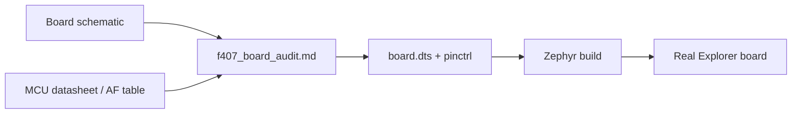

# Chapter 6 - 写 DTS 前先读原理图：Explorer STM32F407 Board Audit

## 6.1 今天只做硬件事实

目标：

> 把“手里一块 STM32F4 板”转换成一份可以直接支撑 Week 2 Zephyr Board Port 的硬件事实表。

不写 DTS，不跑 MCUboot，不启 Ethernet。

---

## 6.2 第一件事：纠正 MCU 型号

打开：

[Explorer schematic p.2](../references/Explorer_STM32F4_V2.2_SCH.pdf#page=2)

PDF p.2 / CORE：
- `STM32F407ZET6`；
- HSE `Y2 = 8MHz`；
- LSE `Y3 = 32.768K`；
- JTAG/SWD；
- `USART1_RX/USART1_TX`；
- P6 USART path。

因此课程硬件基线是：

```text
STM32F407ZET6
```

不是旧计划中的 `旧计划中的错误 1 MB 型号假设`。

型号后缀影响 Flash 容量，后面 linker/Zephyr flash/MCUboot 都依赖它。

---

## 6.3 读板子的四层模型

```text
1. SoC capability
   CPU / Flash / SRAM / peripheral instances

2. Board electrical
   clock / reset / boot / power

3. Peripheral wiring
   UART / LED / KEY / SPI NOR / Ethernet

4. Software description
   DTS / pinctrl / chosen / alias
```

DTS 是第 4 层，不是第一步。

---

## 6.4 Clock Audit

p.2：

```text
Y2 = 8 MHz
Y3 = 32.768 kHz
```

记录：

| Resource | Page | Fact | Later use |
|---|---:|---|---|
| HSE | p.2 | 8 MHz | RCC/clock DTS |
| LSE | p.2 | 32.768 kHz | RTC/low-speed clock |

另一个 F407 board 晶振不同，DTS 时钟就不能抄。

---

## 6.5 Debug Audit

p.2 JTAG header：

```text
TMS/SWDIO
TCK/SWCLK
TDO/SWO
TDI
RESET
GND
```

今天只确认可使用 SWD/JTAG，Week 2 再选择 J-Link/ST-Link + runner。

---

## 6.6 USART1 -> CH340G 路径

p.2：

```text
STM32 USART1
 -> USART1_TX / USART1_RX
 -> P6
 -> TXD / RXD
```

p.4：

[Explorer schematic p.4](../references/Explorer_STM32F4_V2.2_SCH.pdf#page=4)

确认：
- `U17 = CH340G`；
- CH340G 的 TXD/RXD；
- USB_232 connector；
- 12 MHz crystal。

因此：


Zephyr console 配的是 MCU USART1。CH340G 只是 USB bridge。

---

## 6.7 LED Audit

p.2 MCU net + p.3 peripheral circuit：

[Explorer schematic p.3](../references/Explorer_STM32F4_V2.2_SCH.pdf#page=3)

可追：
- `LED0` -> `PF9`；
- `LED1` -> `PF10`。

LED 经限流电阻接 3.3 V，MCU sink current 时亮，因此是典型 active-low。

后面 Zephyr：

```dts
GPIO_ACTIVE_LOW
```

不是“LED 反了再修”。

---

## 6.8 KEY Audit

p.3 可见：
- KEY0；
- KEY1；
- KEY2；
- WK_UP。

今天不能只写“有按键”。

必须沿 net 回 p.2：
1. 找 KEY net；
2. 找 MCU port/pin；
3. 看外部 pull-up/pull-down；
4. 判断按下 active level；
5. 写入表。

读不清就标 `needs trace`，不要猜。

---

## 6.9 W25Q128 Audit

p.3：

```text
U11 W25Q128
CS   -> F_CS
SO   -> SPI1_MISO
SI   -> SPI1_MOSI
CLK  -> SPI1_SCK
VCC  -> 3.3 V
```

从 p.2 可看到：

```text
PA5 -> SPI1_SCK
PA6 -> SPI1_MISO
PA7 -> SPI1_MOSI
```

外部 NOR 是后面升级 staging 的候选，但今天不写 partition。

---

## 6.10 Ethernet Audit

p.1：

[Explorer schematic p.1](../references/Explorer_STM32F4_V2.2_SCH.pdf#page=1)

确认：

```text
U1 = LAN8720A
RMII signals
RJ45
25 MHz crystal
```

Week 1 只记录，不启用。

最小 board bring-up 顺序应是：

```text
clock -> console -> LED -> KEY
```

Ethernet 同时引入 PHY/reset/MDIO/RMII/network stack，变量过多。

---

## 6.11 完成 Board Audit 表

把本包：

```text
labs/f407_board_audit_template.md
```

复制到你的工程：

```bash
mkdir -p ~/work/zephyr/boards/f407_explorer
cp <package>/labs/f407_board_audit_template.md    ~/work/zephyr/boards/f407_explorer/f407_board_audit.md
```

至少填：

```text
MCU            STM32F407ZET6
HSE            8 MHz
LSE            32.768 kHz
Debug          SWD/JTAG
Console        USART1
LED0           PF9 active-low
LED1           PF10 active-low
SPI NOR        W25Q128 / SPI1
Ethernet       LAN8720A / RMII
USB-UART       CH340G
```

---

## 6.12 与 `stm32f4_disco` 比较，只复用结构不复用板级值

```bash
cd ~/work/zephyr/workspace/zephyr
west boards | grep stm32f4
find boards -path '*stm32f4_disco*' -type f -print
```

比较：

| Item | Upstream Discovery | Explorer | Copy directly? |
|---|---|---|---|
| SoC family | STM32F407 family | F407 | 部分 |
| exact MCU | 查官方 board | F407ZET6 | 否 |
| HSE | 查 board | 8 MHz | 否 |
| LED pin | 查 board | PF9/PF10 | 否 |
| console | 查 board | USART1 | 否 |
| external flash | 查 board | W25Q128 | 否 |

---

## 6.13 独立练习：做一次原理图追线

任选 `F_CS`、`KEY0`、`USART1_TX`：

```text
peripheral page
 -> net name
 -> CORE page
 -> MCU pin
 -> alternate function
 -> software resource
```

这是以后“原理图 -> pinctrl/DTS”的标准动作。

---


## 6.14 手把手练习：从 `USART1_TX` 追到未来的 Zephyr console

这一节不要只看结论，实际打开 PDF 操作一次。

### Step 1：在 CORE 页找到 net

打开本包：

[Explorer schematic p.2](../references/Explorer_STM32F4_V2.2_SCH.pdf#page=2)

在 PDF p.2 搜索：

```text
USART1_TX
USART1_RX
```

记录证据：

```text
Document = Explorer STM32F4 V2.2
Page     = 2
Net      = USART1_TX / USART1_RX
Role     = MCU USART1
```

### Step 2：沿 P6 继续追，不凭 `TXD/RXD` 名字猜方向

p.2 同时存在：

```text
USART1_TX / USART1_RX
P6
TXD / RXD
```

UART 两端都有 TX/RX，真正连接关系必须看网线/net，而不是看到两个 `TX` 就认为相接。

你要建立的判断方式是：

```text
MCU USART1 TX
      ↓
board net / P6
      ↓
USB-UART RX side
```

### Step 3：跳到 p.4 找 USB bridge

打开：

[Explorer schematic p.4](../references/Explorer_STM32F4_V2.2_SCH.pdf#page=4)

搜索：

```text
CH340G
```

确认：
- `U17 = CH340G`；
- 存在 `TXD/RXD`；
- 连接 `USB_232`；
- CH340G 只是 bridge，不是 MCU UART controller。

记录：

```text
Evidence:
  p.2 -> STM32 USART1 + P6
  p.4 -> CH340G + USB_232
Conclusion:
  Explorer console candidate = MCU USART1 via CH340G
```

### Step 4：区分“硬件事实”和“软件策略”

原理图能证明：

```text
使用哪个 UART
UART 经什么 bridge 到 USB
哪些 GPIO 参与 UART
```

原理图不能证明：

```text
Zephyr 最终 console baud 一定是多少
zephyr,console chosen 一定怎么写
```

所以 Week 2 才会把硬件事实转换为：
- `&usart1`；
- pinctrl；
- `current-speed`；
- `zephyr,console`。

不要从原理图直接跳到最终 DTS，中间必须经过 Board Audit。

---

## 6.15 手把手练习：完整追一次 W25Q128

### Step 1：在 DEVICE 页定位器件

打开 p.3：

[Explorer schematic p.3](../references/Explorer_STM32F4_V2.2_SCH.pdf#page=3)

找到：

```text
U11
W25Q128
```

观察其关键 pin/net：

```text
CS   -> F_CS
SO   -> SPI1_MISO
SI   -> SPI1_MOSI
CLK  -> SPI1_SCK
VCC  -> 3.3 V
```

### Step 2：回 CORE 页找 SPI1

p.2 MCU pin 标注可以追到：

```text
PA5 -> SPI1_SCK
PA6 -> SPI1_MISO
PA7 -> SPI1_MOSI
```

片选 `F_CS` 仍要沿 net 找真实 GPIO。

特别注意：

> 不能因为 STM32 的 `SPI1_NSS` 常见可在 PA4 上，就直接认定 `F_CS=PA4`。外部 Flash 的 CS 是板级设计选择，必须以原理图 net 为准。

### Step 3：形成未来 DTS 的输入，而不是今天就写 DTS

今天输出：

```text
Controller = SPI1
SCK        = PA5
MISO       = PA6
MOSI       = PA7
CS         = continue tracing F_CS
Device     = W25Q128
Supply     = 3.3 V
```

Week 2 再把它转换成 `spi1` 节点、pinctrl、child `jedec,spi-nor`。

---

## 6.16 为什么 LED 的 active level 必须来自电路

p.3 的 LED 电路告诉你的不只是“有 LED0/LED1”。

电流路径大致为：

```text
3.3 V
  ↓
LED + resistor
  ↓
MCU GPIO
```

GPIO 输出低电平时 MCU sink current，LED 点亮，因此是 active-low。

这就是后续 Zephyr 描述应表达：

```text
GPIO_ACTIVE_LOW
```

而不是在 application 里写：

```c
gpio_set(..., !on);
```

费曼版：

> 板级描述应该把“这个板子电路接反了还是接正了”藏起来；应用只说“我要亮”。

---

## 6.17 创建可审计的 `f407_board_audit.md`

复制模板：

```bash
mkdir -p ~/work/zephyr/boards/f407_explorer

cp <week1-package>/labs/f407_board_audit_template.md \
   ~/work/zephyr/boards/f407_explorer/f407_board_audit.md
```

第一轮只填原理图能证明的事实：

```text
MCU        = STM32F407ZET6
HSE        = 8 MHz
LSE        = 32.768 kHz
USART      = USART1
USB-UART   = CH340G
LED0       = PF9 active-low
LED1       = PF10 active-low
SPI NOR    = W25Q128
SPI bus    = SPI1
Ethernet   = LAN8720A / RMII
```

第二轮给每条结论加 Evidence：

```text
LED0:
  value    = PF9
  evidence = schematic p.2 + p.3
  polarity = active-low
```

第三轮标出还需要 MCU datasheet/AF table 核实的内容：

```text
USART1_TX:
  schematic = verified
  GPIO pin  = verified
  AF number = verify from STM32F407 datasheet
```

当信息不是来自 board schematic 时，要在 audit 中明确换来源。

---

## 6.18 Board Audit 是 Week 2 的输入接口

后续流程必须固定：



如果 Week 2 发现某个 pin 错了：

1. 先修 Audit；
2. 记录新证据；
3. 再改 DTS；
4. 再 rebuild。

这样板级事实只有一个来源，不会在 DTS、README、代码里出现互相矛盾的复制品。

---

## 6.19 Day 6 最终检查清单

关闭原理图后回答：

```text
[ ] MCU 完整型号？
[ ] HSE/LSE 在哪一页？
[ ] USART1 -> P6 -> CH340G -> USB 的链路？
[ ] LED0/LED1 的 GPIO 和 active level？
[ ] W25Q128 为什么确定属于 SPI1？
[ ] 哪些信息仍必须查 MCU datasheet/AF table？
[ ] 为什么 stm32f4_disco 只能参考结构，不能复制 pin？
[ ] f407_board_audit.md 是否真实存在？
```

这里任何一项答不上来，都回 PDF 对应页重新追线，不靠记忆补答案。


## 6.20 本章验收

不看聊天记录说出：

> 我的板是 STM32F407ZET6；HSE 8 MHz，LSE 32.768 kHz；console 候选 USART1，经 P6 到 CH340G；LED0/1 是 PF9/PF10 active-low；W25Q128 使用 SPI1；LAN8720A 是 RMII PHY。

不能说清就不进入 Week 2 Board Port。

---

## 6.21 原始资料

本章全部板级结论来自本包实际包含的：

- `references/Explorer_STM32F4_V2.2_SCH.pdf`
  - p.1 Ethernet；
  - p.2 MCU/clock/JTAG/USART1；
  - p.3 LED/KEY/W25Q128；
  - p.4 CH340G；
  - p.5 board layout。
