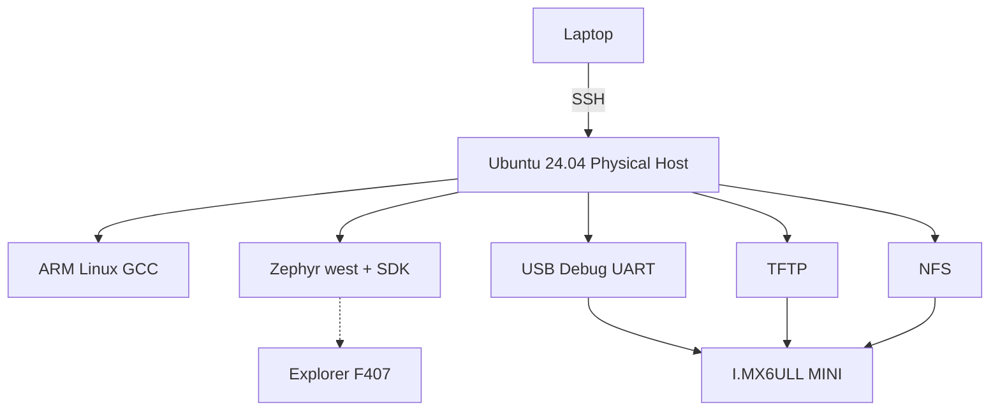

# Chapter 7 - Week 1 Gate：从新 SSH 会话恢复整个开发环境

## 7.1 本章目标：证明环境不依赖记忆

今天不是“复习 Day 1-Day 6”。

今天模拟真实工程场景：

> 周末回来，所有 terminal 都关闭，SSH 断开，开发板重新上电。你不能搜索聊天记录，也不能依赖 shell history 把命令一条条翻出来。

最终目标是：

```text
15 分钟内恢复 Host
30 分钟内恢复 i.MX6ULL 开发闭环
30 分钟内重新完成 Zephyr clean build
最后形成一份可交给其他工程师复现的 Week 1 证据包
```

下载等待、开发板重新上电等待不计入主动操作时间。

---

## 7.2 先准备“冷启动”状态

开始前：

1. 保存 VS Code 文件；
2. 正常退出 `picocom`；
3. `tmux detach`，不要杀掉 session；
4. 退出所有 SSH；
5. 开发板可以重新上电；
6. 关闭个人笔记本上的旧 terminal。

然后新开一个终端。

从现在开始，每遇到失败都先写：

```text
预期是什么？
实际是什么？
失败发生在哪一层？
下一条验证命令是什么？
```

不要先 Google 错误字符串。

---

## 7.3 第一阶段：恢复 Laptop -> Ubuntu Host

笔记本：

```bash
ssh imxdev
```

进入后：

```bash
hostname
uname -m
cat /etc/os-release | grep PRETTY_NAME
pwd
```

预期：
- `hostname` 是固定 Ubuntu mini Host；
- `uname -m` 为 Host 架构，例如 `x86_64`；
- Ubuntu 为 24.04 系列；
- 当前路径属于远程 Host，不是笔记本本地目录。

### 如果 `ssh imxdev` 失败

按顺序：

```bash
ssh -G imxdev | grep -E 'hostname|user|port'
ping <ubuntu-host-ip>
nc -vz <ubuntu-host-ip> 22
ssh -vvv imxdev
```

分别判断：
- SSH alias 配错；
- IP 不通；
- TCP/22 不通；
- 认证失败。

---

## 7.4 第二阶段：恢复 Host 目录和工具

```bash
cd ~/work
tree -L 2
```

你必须能解释：

```text
~/work/linux
    Linux 用户态/BSP/kernel/driver

~/work/zephyr
    venv/workspace/board port

~/work/logs
    boot/network/build evidence

/srv/tftp
    U-Boot 可见文件

/srv/nfs/imx6ull
    Linux Target 可挂载文件
```

采集一次最新 Host 基线：

```bash
mkdir -p ~/work/tools
# 如果脚本尚未复制，把本包 tools/capture_host_baseline.sh 放到此目录
chmod +x ~/work/tools/capture_host_baseline.sh
~/work/tools/capture_host_baseline.sh
```

查看最后生成文件：

```bash
ls -lt ~/work/logs/host_baseline_* | head
```

---

## 7.5 第三阶段：从源码重新生成两种 ELF

```bash
cd ~/work/linux/apps/week1_elf
```

确认源码：

```bash
sed -n '1,80p' hello.c
```

Host build：

```bash
gcc -Wall -Wextra -O0 -g hello.c -o hello_x86
```

Target build：

```bash
arm-linux-gnueabihf-gcc \
  -Wall -Wextra -O0 -g \
  hello.c -o hello_arm
```

再生成静态 Target：

```bash
arm-linux-gnueabihf-gcc \
  -static -Wall -Wextra -O0 -g \
  hello.c -o hello_arm_static
```

检查：

```bash
file hello_x86
file hello_arm
file hello_arm_static
```

再：

```bash
readelf -h hello_arm | grep -E 'Class:|Machine:|Entry'
readelf -l hello_arm | grep -A1 INTERP
```

### 这一阶段真正验收什么

不是“gcc 能执行”。

而是你能从输出解释：

```text
hello_x86:
    Host architecture

hello_arm:
    ARM ELF + dynamic interpreter

hello_arm_static:
    ARM ELF + 不依赖 Target dynamic loader
```

---

## 7.6 第四阶段：恢复串口控制

在 Ubuntu Host 插好 MINI USB_TTL。

不要直接假设 `ttyUSB0`：

```bash
dmesg | tail -40
ls -l /dev/ttyUSB*
```

如果只有一个：

```bash
picocom -b 115200 --flow n /dev/ttyUSB0
```

如果有多个 USB serial：

```bash
for d in /dev/ttyUSB*; do
    echo "=== $d ==="
    udevadm info --query=property --name="$d" | \
      grep -E 'ID_VENDOR_ID|ID_MODEL_ID|ID_SERIAL'
done
```

利用 VID/PID/serial 区分设备，而不是轮流猜。

---

## 7.7 第五阶段：恢复 MINI Linux 网络

Target：

```bash
ifconfig eth0
```

如果有 `ip`：

```bash
ip -br addr show eth0
ip route
```

Host：

```bash
ip -br addr
ip route
```

把真实地址写成：

```text
Ubuntu Host =
I.MX6ULL MINI =
Subnet =
Gateway =
Host NIC =
```

然后双向：

Target：

```bash
ping -c 2 <host-ip>
```

Host：

```bash
ping -c 2 <target-ip>
```

若失败，不能跳到 NFS。回 Chapter 3 按：

```text
link -> IP -> route -> ARP -> tcpdump
```

排查。

---

## 7.8 第六阶段：验证 TFTP 服务

Host：

```bash
systemctl is-active tftpd-hpa
sudo ss -lunp | grep ':69'
ls -l /srv/tftp/health.txt
```

如果是 `inactive`：

```bash
sudo systemctl start tftpd-hpa
journalctl -u tftpd-hpa -n 50 --no-pager
```

先做 Host loopback：

```bash
cd /tmp
rm -f health.txt
printf 'get health.txt\nquit\n' | tftp 127.0.0.1
cat health.txt
```

确认 server 自己正常后，再到 U-Boot。

---

## 7.9 第七阶段：验证 NFS 服务与 ARM 程序闭环

Host：

```bash
systemctl is-active nfs-kernel-server
showmount -e localhost
ls -l /srv/nfs/imx6ull
```

将静态 ARM 程序更新进去：

```bash
cp ~/work/linux/apps/week1_elf/hello_arm_static \
   /srv/nfs/imx6ull/
sync
```

Target：

```bash
mkdir -p /mnt/nfs
mount | grep /mnt/nfs || \
mount -t nfs -o nolock,vers=3 \
  <host-ip>:/srv/nfs/imx6ull \
  /mnt/nfs
```

运行：

```bash
/mnt/nfs/hello_arm_static
```

预期：

```text
hello from week1
```

如果程序运行失败，先：

```bash
ls -l /mnt/nfs/hello_arm_static
file /mnt/nfs/hello_arm_static 2>/dev/null || true
```

不要把“NFS 挂载问题”和“ELF 执行问题”混在一起。

---

## 7.10 第八阶段：恢复 Zephyr workspace

新 SSH shell 中：

```bash
source ~/work/zephyr/activate.sh
```

检查：

```bash
echo "$VIRTUAL_ENV"
west topdir
```

进入：

```bash
cd ~/work/zephyr/workspace/zephyr
```

确认版本：

```bash
git describe --tags --always
git status --short
west sdk list
```

然后做一次真正的 clean build：

```bash
west build -p always \
  -b stm32f4_disco \
  samples/hello_world \
  2>&1 | tee ~/work/zephyr/logs/week1_gate_build.log
```

成功后不要马上结束：

```bash
file build/zephyr/zephyr.elf
grep -E '^CONFIG_(BOARD|SOC)' build/zephyr/.config
grep -n 'model =' build/zephyr/zephyr.dts | head
```

这三步分别证明：
- ARM ELF 已生成；
- Kconfig board/SoC 被解析；
- Devicetree 最终产物存在。

---

## 7.11 第九阶段：闭卷恢复 Explorer 硬件事实

先不要打开原理图，创建：

```text
week1_f407_memory_test.md
```

填：

```text
MCU =
HSE =
LSE =
Console UART =
USB-UART bridge =
LED0 =
LED1 =
SPI NOR =
SPI bus =
Ethernet PHY =
```

然后再打开原理图逐项核对：
- p.1；
- p.2；
- p.3；
- p.4。

把错误项单独标红/记录。

你真正需要记住的是“如何查证”，不是强背全部管脚。

---

## 7.12 用脚本做机械检查，但不能代替理解

将本包：

```text
tools/check_week1.sh
```

复制到：

```text
~/work/tools/check_week1.sh
```

执行：

```bash
chmod +x ~/work/tools/check_week1.sh
~/work/tools/check_week1.sh
```

它只检查：
- 常用 command 是否存在；
- ssh/tftp/nfs 服务是否 active。

它**无法**证明：
- Target ping 是否通；
- U-Boot 是否能 TFTP；
- NFS 是否真正被 Target 挂载；
- Zephyr build 是否成功；
- 你是否理解 ELF。

所以脚本 PASS 只是环境机械基线，不是 Week 1 总验收。

---

## 7.13 本周证据包应该怎样组织

建议在你的课程/Git 仓库中形成：

```text
week01_evidence/
├── host/
│   └── host_baseline.txt
├── toolchain/
│   ├── toolchain_baseline.md
│   └── elf_notes.md
├── imx6ull/
│   ├── boot_log.txt
│   ├── network_topology.md
│   └── tftp_nfs_test.md
├── zephyr/
│   ├── zephyr_environment_baseline.txt
│   └── week1_gate_build.log
└── stm32f407/
    └── f407_board_audit.md
```

这样 Week 2 出问题时可以先问：

> Week 1 baseline 是否还成立？

而不是从头重装系统。

---

## 7.14 本章验收：Week 1 Pass / Fail Gate

下面每一项必须有**证据**，不是口头说“做过”。

```text
[ ] Laptop -> ssh imxdev
    evidence: ssh login / Host hostname

[ ] Ubuntu Host baseline
    evidence: host_baseline_*.txt

[ ] x86 + ARM ELF
    evidence: file/readelf output

[ ] MINI USB debug UART
    evidence: full boot log

[ ] MINI eth0 + Host 双向 ping
    evidence: IP table + ping output

[ ] TFTP
    evidence: Host loopback + U-Boot Bytes transferred

[ ] NFS
    evidence: Target mount + ARM static hello execution

[ ] Zephyr v4.4.1
    evidence: git revision + west/sdk info

[ ] upstream F4 clean build
    evidence: zephyr.elf + build log

[ ] Explorer hardware audit
    evidence: schematic page references
```

任何一项没有证据，都按 FAIL 处理。

---

## 7.15 闭卷问题

### Host
1. 为什么个人笔记本不是课程 Host？
2. SSH 与 tmux 分别解决什么问题？
3. 为什么 TFTP/NFS 服务必须固定在 Ubuntu Host？

### Toolchain
4. Host GCC 和 ARM cross GCC 的输出对象有何根本区别？
5. Section 和 Segment 分别服务什么阶段？
6. `Exec format error` 和 `Permission denied` 为什么属于不同层？

### MINI
7. U-Boot 和 Linux 为什么可以通过同一调试 UART 输出？
8. `ipaddr` 与 `serverip` 分别是谁？
9. 为什么 MINI 教程只围绕 `eth0`？
10. ping 成功后 TFTP 仍失败，下一步应该看什么？

### Zephyr
11. west 是否编译器？
12. manifest 为什么能管理多个 repository？
13. `.config` 与 `zephyr.dts` 分别表示什么？
14. 为什么 upstream Discovery 能作为 smoke test，但不能当 Explorer board config？

### Hardware
15. 实际 MCU 型号是什么？
16. console 候选 UART 是谁？
17. USART1 到 Host 之间是什么 bridge？
18. W25Q128 使用哪个 SPI？
19. LED active-low 的依据来自哪里？

---

## 7.16 Week 1 总心智模型



因果链：

```text
Host stable
 -> toolchain trustworthy
 -> serial controls boot
 -> network makes Target reachable
 -> TFTP/NFS shortens iteration
 -> Zephyr establishes second platform toolchain
 -> schematic audit becomes Board Port input
```

Week 2 不再从“安装工具”开始，而直接进入：
- i.MX6ULL BSP build loop；
- Explorer F407 out-of-tree Board Port。
