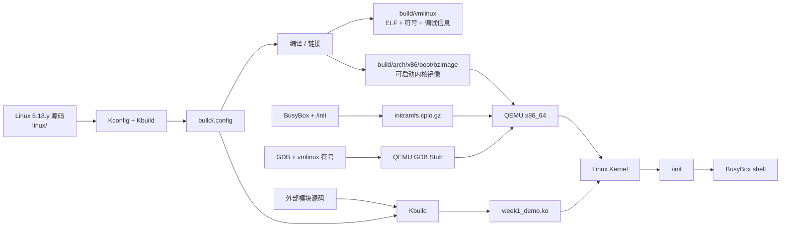
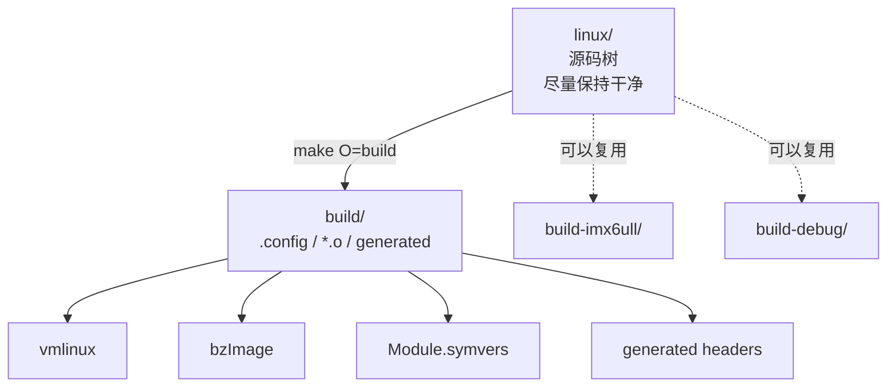
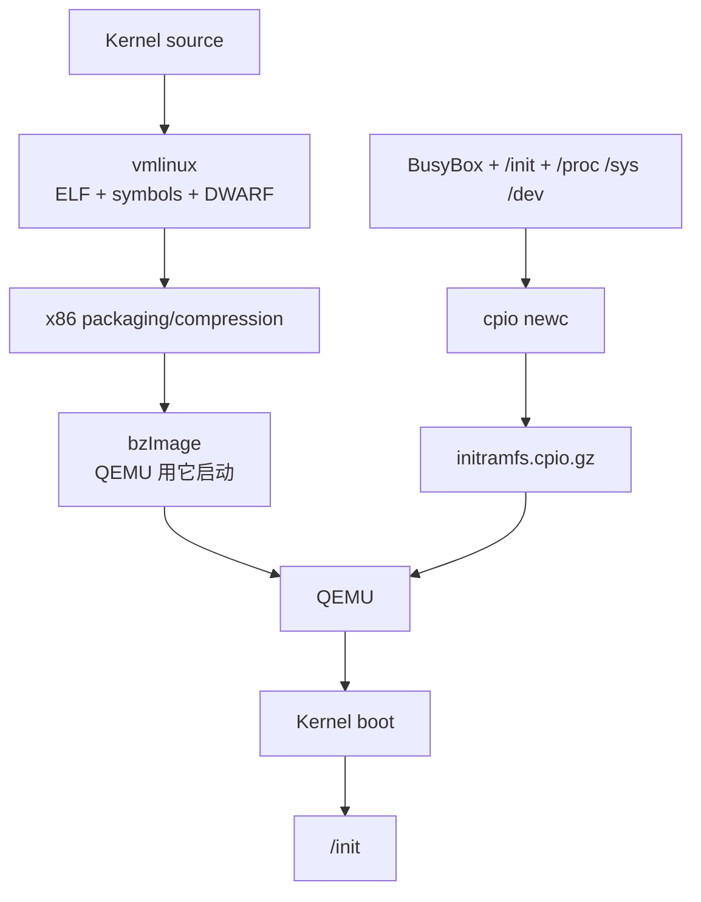
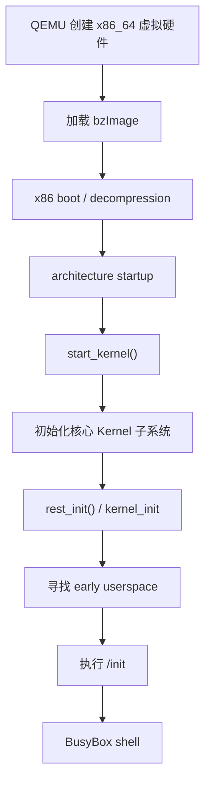
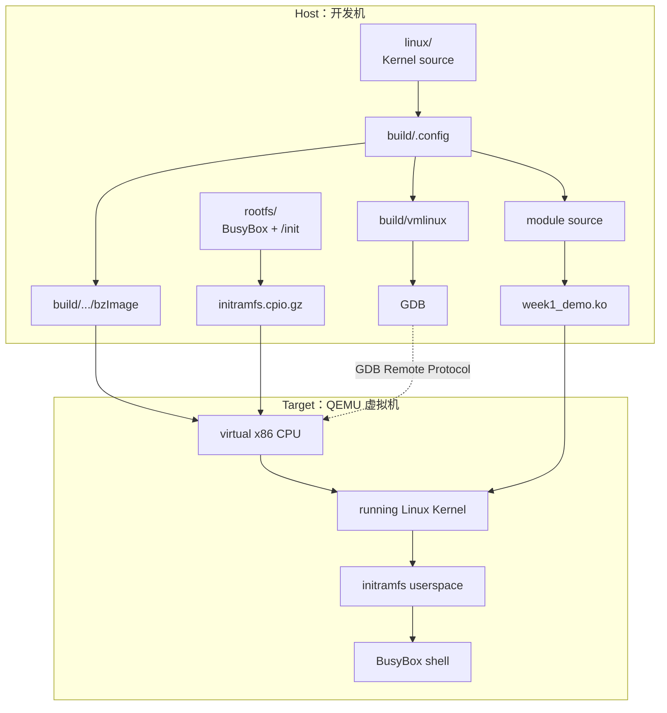

# Week 1：建立 Linux Kernel 开发闭环
## 从源码、构建、QEMU、initramfs、外部模块到 GDB

**课程定位**：Linux Kernel / Driver 6 个月学习计划 · Week 1  
**适用背景**：熟悉 MCU / RTOS / ARM IP / C / 硬件调试，已有少量 Linux driver 调试经验  
**建议投入**：7 天 × 2 h ≈ 14 h  
**主机环境**：Ubuntu 24.04 LTS x86_64（其他较新 Ubuntu/Debian 可类推）  
**目标内核**：Linux 6.18.y LTS  
**目标机**：QEMU x86_64  
**Week 1 原则**：不追求“学很多”，只建立一个低摩擦、可反复验证的 Kernel 开发闭环

---

# 1. 本周到底要学会什么

第一周不是为了学习某个 Linux 子系统，也不是为了写一个复杂驱动。

本周只解决一个根问题：

> **以后我看到任何 Linux Kernel / Driver 源码，能不能自己修改、编译、启动、观察、加载模块、断点调试，然后用实验验证自己的理解？**

如果这个闭环没有建立，后面学 Driver Model、DMA、PCIe 时会反复卡在环境问题上；如果闭环建立，Linux 内核就不再只是“网页里的源码”，而会变成一个你可以随意修改和验证的软件系统。

本周最终必须得到以下 6 个可验证产物：

```text
1. linux/                   Linux 6.18.y 源码树
2. build/                   独立的内核构建目录
3. initramfs.cpio.gz        最小用户空间
4. run-qemu.sh              一条命令启动自己编译的内核
5. week1_demo.ko            自己编译、加载、卸载的外部模块
6. QEMU + GDB               能在 start_kernel() 等函数断点
```

这 6 个对象构成后续 23 周课程的实验底座。

---

# 2. Week 1 总体心智模型

先不要执行命令，先看整个系统。



你可以把它直接类比为你熟悉的 MCU 开发：

| MCU / RTOS 开发 | Linux Kernel 学习环境 |
|---|---|
| IDE / Makefile | Kbuild / Make |
| MCU SDK 源码 | Linux kernel source |
| `.elf` | `vmlinux` |
| `.bin/.hex` | `bzImage`（概念上相似，但格式和启动机制不同） |
| Bootloader + firmware | QEMU 直接加载 kernel |
| 板上 Flash 文件 | initramfs 内的文件 |
| RTOS task / application | initramfs 的 `/init` / shell |
| 动态加载组件 | `.ko` kernel module |
| J-Link GDB Server | QEMU GDB Stub |
| arm-none-eabi-gdb | gdb + `vmlinux` |

这不是严格的一一对应关系，但它能帮助你快速建立第一层直觉。

---

# 3. 本周阶段划分

本周分为 7 个阶段，对应 Day 1–Day 7。

| Day | 阶段 | 主要问题 | 最终 Demo |
|---|---|---|---|
| Day 1 | 环境与目录模型 | Host、Target、Source、Build 到底是什么关系？ | 环境检查脚本 |
| Day 2 | 获取源码并编译 | Linux 内核从源码如何变成 `vmlinux/bzImage`？ | 成功编译 Linux 6.18.y |
| Day 3 | initramfs + QEMU | 一个没有磁盘的 Linux 为什么也能进入 shell？ | 自编内核启动到 BusyBox shell |
| Day 4 | 改内核 + 增量编译 + 源码导航 | 如何证明“我跑的是我改的内核”？ | 修改 `init/main.c` 并看到自定义日志 |
| Day 5 | 外部 Kernel Module | `.ko` 到底是什么，为什么必须匹配内核？ | `insmod/rmmod` 自己的模块 |
| Day 6 | QEMU + GDB | GDB 怎么调一个正在运行的内核？ | 在 `start_kernel()` 断下 |
| Day 7 | 综合验收 | 能否脱离教程独立完成闭环？ | 90 分钟综合挑战 + 心智模型复盘 |

---

# 4. 开发环境总览

## 4.1 建议硬件

推荐至少：

```text
CPU：4 核以上
RAM：8 GB 以上，16 GB 更舒适
磁盘：预留 25 GB
Host：x86_64 Linux
```

Linux 官方快速构建文档提示，构建测试内核需要较大的磁盘空间；启用完整 debug info 后 `vmlinux` 和中间文件会明显膨胀。因此本课程宁可多预留空间，也不要为了节省几 GB 频繁清理。

## 4.2 为什么 Week 1 不用 i.MX6ULL

i.MX6ULL 会在后续进入 Device Tree、platform driver、GPIO/I2C/SPI/IRQ 等真实 SoC 课程。

Week 1 的问题不是：

> “ARM Linux 怎么启动？”

而是：

> “Linux Kernel 的源码开发闭环怎么建立？”

QEMU x86_64 的优势：

- 无需烧录；
- 无需 U-Boot；
- 无需串口线；
- 不受板级 BSP 干扰；
- 内核编译后可以直接启动；
- GDB 调试极其方便；
- 出错可以无限重来。

因此这是一个**降低无关变量**的教学选择。

---

# 5. Day 1：开发环境搭建与目录模型

## 5.1 Day 1 技能目标

完成 Day 1 后，你必须能解释：

1. Host Linux 和 QEMU Target Linux 是两台逻辑机器；
2. 为什么源码目录和构建目录应该分离；
3. GCC、Make、Binutils、QEMU、GDB 各负责什么；
4. 为什么“能运行 Ubuntu”不代表“已经具备编译 Kernel 的环境”；
5. 后续所有实验文件放在哪里。

建议时间：

```text
20 min  概念
50 min  安装工具
30 min  建目录与环境脚本
20 min  检查与闭卷解释
```

---

## 5.2 费曼讲解：Host 和 Target 到底是什么

假设你在 PC 上给 STM32 编译固件：

```text
Windows/Linux PC
    │
    ├─ 编译器
    ├─ 源码
    └─ GDB
          │
          ▼
       STM32 板
```

PC 是 **Host**，STM32 是 **Target**。

现在把 STM32 换成 QEMU：

```text
Ubuntu Host
    │
    ├─ GCC / Make
    ├─ Kernel Source
    ├─ GDB
    └─ QEMU
          │
          ▼
    虚拟 x86_64 机器
          │
          ▼
    你编译的 Linux Kernel
```

QEMU 不是“在 Host 上启动一个 Linux 进程这么简单”。

更准确地说：

> QEMU 为 Target 提供了一套虚拟 CPU、RAM、串口、PCI 等硬件模型。我们编译的 Linux Kernel 认为自己正在一台真实机器上运行。

因此后面看到：

```bash
uname -a
```

要先问：

> 我是在 Host shell 里执行，还是在 QEMU Target shell 里执行？

这是第一周非常重要的习惯。

---

## 5.3 安装工具

Ubuntu 24.04 上执行：

```bash
sudo apt update

sudo apt install -y \
    build-essential \
    bc \
    bison \
    flex \
    libssl-dev \
    libelf-dev \
    libncurses-dev \
    dwarves \
    pkg-config \
    git \
    rsync \
    cpio \
    gzip \
    xz-utils \
    zstd \
    busybox-static \
    kmod \
    qemu-system-x86 \
    qemu-utils \
    gdb \
    file \
    python3
```

这些包不是随便堆出来的。

核心关系如下：

| 工具 | 本周作用 |
|---|---|
| GCC | 编译 Linux C 源码 |
| binutils | `ld/as/objdump/readelf/nm` 等 |
| GNU Make | 驱动 Kbuild |
| flex/bison | 构建过程中生成解析器 |
| OpenSSL/libcrypto | 证书、模块签名等构建功能 |
| libelf | ELF/BTF 等构建依赖 |
| pahole (`dwarves`) | BTF/debug info 相关 |
| ncurses | `menuconfig` |
| cpio/gzip | 生成 initramfs |
| BusyBox static | 最小用户空间 |
| QEMU | 虚拟 Target |
| GDB | 内核源码级调试 |
| Git | 内核版本与源码历史管理 |

Linux 当前文档列出的核心最低要求包括 GNU C 8.1、GNU make 4.0、binutils 2.30、flex 2.5.35、pahole 1.26、GDB 7.2 等。Ubuntu 24.04 的工具链明显高于这些最低线，但你仍应养成**先验证工具版本**的习惯。

---

## 5.4 检查工具链

执行：

```bash
gcc --version | head -n 1
ld -v
make --version | head -n 1
bison --version | head -n 1
flex --version | head -n 1
pahole --version
qemu-system-x86_64 --version | head -n 1
gdb --version | head -n 1
busybox | head -n 1
```

预期：所有命令都能正常执行。

检查磁盘：

```bash
df -h "$HOME"
```

检查 CPU/RAM：

```bash
nproc
free -h
uname -m
```

推荐看到：

```text
uname -m
x86_64
```

---

## 5.5 建立统一实验目录

执行：

```bash
mkdir -p ~/linux-learning/week1
cd ~/linux-learning/week1

mkdir -p \
    build \
    rootfs \
    modules \
    scripts \
    logs \
    notes
```

最终：

```text
~/linux-learning/week1/
├── linux/          # Day 2 clone
├── build/          # Kernel output
├── rootfs/         # initramfs 展开目录
├── modules/        # 自己写的 .ko
├── scripts/        # 启动/打包脚本
├── logs/           # 日志
└── notes/          # 学习笔记
```

---

## 5.6 创建 `env.sh`

```bash
cat > ~/linux-learning/week1/env.sh <<'EOF'
export LAB="$HOME/linux-learning/week1"
export SRC="$LAB/linux"
export BUILD="$LAB/build"
export ROOTFS="$LAB/rootfs"
export INITRAMFS="$LAB/initramfs.cpio.gz"

EOF
```

每次进入实验先：

```bash
source ~/linux-learning/week1/env.sh
```

检查：

```bash
printf 'LAB=%s\nSRC=%s\nBUILD=%s\nROOTFS=%s\n' \
    "$LAB" "$SRC" "$BUILD" "$ROOTFS"
```

---

## 5.7 费曼讲解：为什么 `linux/` 和 `build/` 要分开

初学者常直接：

```bash
cd linux
make
```

这样所有：

```text
.o
.a
.config
generated headers
vmlinux
modules
```

都会混入源码树。

这不是不能工作，但对长期 Kernel 开发非常不利。

把它类比成 MCU：

```text
SDK源码/
├── drivers/
├── middleware/
└── build产生的几万个.o文件
```

你当然可以这么干，但会让：

- `git status` 变乱；
- 清理困难；
- 多配置共存困难；
- x86 / ARM 多架构实验困难；
- debug/release build 不容易并存。

Linux Kbuild 原生支持：

```bash
make O=/path/to/build
```

因此我们固定：

```text
linux/ = 只放源码
build/ = .config + 中间文件 + 最终内核
```

以后做 ARM：

```text
build-x86/
build-imx6ull/
build-debug/
```

可以共享同一套 source。

### 插图：Source 与 Build 的职责



---

## 5.8 Day 1 Demo：环境自检

创建：

```bash
cat > "$LAB/scripts/check-env.sh" <<'EOF'
#!/bin/bash
set -e

echo "== Host =="
uname -a

echo
echo "== Toolchain =="
gcc --version | head -n1
ld -v
make --version | head -n1
pahole --version
gdb --version | head -n1
qemu-system-x86_64 --version | head -n1

echo
echo "== Resources =="
echo "CPU threads: $(nproc)"
free -h
df -h "$HOME" | tail -n1
EOF

chmod +x "$LAB/scripts/check-env.sh"
"$LAB/scripts/check-env.sh"
```

### Day 1 验收

不看本教程，用自己的话解释：

> **QEMU 为什么属于 Target 环境的一部分，而 GDB/GCC 属于 Host 开发工具？**

如果只能说“QEMU 是虚拟机”，还不够。

你应该能说出：

> GCC 在 Host 上把 Kernel source 生成 Target 可执行的内核镜像；QEMU 提供 Target 的虚拟硬件；GDB 在 Host 上通过 QEMU 暴露的调试接口观察 Target CPU 和内存。

达到这个程度，Day 1 通过。

---

# 6. Day 2：获取 Linux 6.18.y、配置并第一次编译

## 6.1 Day 2 技能目标

完成后必须知道：

- Linux stable branch 是什么；
- `.config` 是什么；
- Kconfig 和 Kbuild 的职责区别；
- `vmlinux` 与 `bzImage` 是什么；
- 一次完整内核 build 产生了什么。

---

## 6.2 获取 Linux 6.18.y stable 源码

加载环境：

```bash
source ~/linux-learning/week1/env.sh
```

Clone：

```bash
git clone \
    --branch linux-6.18.y \
    --depth 200 \
    https://git.kernel.org/pub/scm/linux/kernel/git/stable/linux.git \
    "$SRC"
```

为什么用：

```text
linux-6.18.y
```

而不是写死某个：

```text
v6.18.xx
```

因为课程目标是：

> 使用 6.18 LTS 当前维护线。

`linux-6.18.y` 会跟随该 LTS 的 stable 更新。

查看当前实际版本：

```bash
git -C "$SRC" branch --show-current
git -C "$SRC" log -1 --oneline
make -s -C "$SRC" kernelversion
```

再记录：

```bash
git -C "$SRC" rev-parse HEAD
```

把 commit ID 写入 `notes/day2.md`。

---

## 6.3 先看源码树，不要急着 make

```bash
cd "$SRC"
ls
```

当前只要求形成粗粒度地图：

```text
arch/       架构相关：x86/arm/arm64...
drivers/    设备驱动
fs/         VFS与文件系统
include/    头文件
init/       内核初始化
kernel/     调度/IRQ/核心机制等
lib/        内核通用库
mm/         内存管理
net/        网络栈
scripts/    Kbuild/工具/辅助脚本
tools/      perf/bpf等用户态开发工具
Documentation/
```

### 技能目标

给你一个问题：

> `start_kernel()` 在哪里？

你应该优先：

```bash
git -C "$SRC" grep -n "start_kernel"
```

而不是打开浏览器搜索。

---

# 7. 费曼讲解：Kconfig 与 Kbuild 到底是什么

很多初学者把：

```text
Kconfig
Makefile
.config
```

混在一起。

先用 MCU 项目类比。

假设产品允许选择：

```text
是否开启 UART
是否开启 SPI
是否编译某个 driver
```

### Kconfig 回答：

> **这个软件系统有哪些“可选项”？它们之间有什么依赖？**

例如概念上：

```text
CONFIG_MODULES=y
CONFIG_DEBUG_INFO=y
CONFIG_PCI=y
```

### `.config` 回答：

> **这一次构建，我最终选了什么？**

### Kbuild / Makefile 回答：

> **既然 CONFIG_X 已经选了，那具体编译哪些 `.c/.o`，最后怎么链接？**

因此最小模型：


一句话记忆：

> **Kconfig 管“选什么”，Kbuild 管“怎么编”。**

后面学 driver 时这个模型会反复出现。

---

# 8. 生成初始 `.config`

我们使用 x86_64 host 的默认配置：

```bash
make -C "$SRC" O="$BUILD" defconfig
```

检查：

```bash
ls -lh "$BUILD/.config"
```

然后为 Week 1 调试环境补充必要选项。

```bash
"$SRC/scripts/config" --file "$BUILD/.config" \
    -e DEBUG_KERNEL \
    -d DEBUG_INFO_NONE \
    -e DEBUG_INFO_DWARF_TOOLCHAIN_DEFAULT \
    -e GDB_SCRIPTS \
    -e FRAME_POINTER \
    -d RANDOMIZE_BASE \
    -e MODULES \
    -e BLK_DEV_INITRD \
    -e RD_GZIP \
    -e DEVTMPFS \
    -e DEVTMPFS_MOUNT \
    -e PROC_FS \
    -e SYSFS \
    -e TMPFS \
    -e TTY \
    -e SERIAL_8250 \
    -e SERIAL_8250_CONSOLE \
    -e BINFMT_ELF \
    -e BINFMT_SCRIPT
```

让 Kconfig 根据依赖重新收敛：

```bash
make -C "$SRC" O="$BUILD" olddefconfig
```

检查关键项：

```bash
grep -E \
'CONFIG_(DEBUG_KERNEL|DEBUG_INFO_DWARF_TOOLCHAIN_DEFAULT|GDB_SCRIPTS|RANDOMIZE_BASE|MODULES|BLK_DEV_INITRD|DEVTMPFS|PROC_FS|SYSFS)=' \
"$BUILD/.config"
```

关键期待：

```text
CONFIG_DEBUG_KERNEL=y
CONFIG_DEBUG_INFO_DWARF_TOOLCHAIN_DEFAULT=y
CONFIG_GDB_SCRIPTS=y
CONFIG_MODULES=y
CONFIG_BLK_DEV_INITRD=y
CONFIG_DEVTMPFS=y
```

而：

```bash
grep CONFIG_RANDOMIZE_BASE "$BUILD/.config"
```

期望类似：

```text
# CONFIG_RANDOMIZE_BASE is not set
```

如果某个 debug 配置因为当前 kernel 依赖没有生效：

```bash
make -C "$SRC" O="$BUILD" menuconfig
```

在 `menuconfig` 中按：

```text
/
```

搜索配置符号，例如：

```text
GDB_SCRIPTS
```

这是以后排查 Kconfig 依赖非常重要的方法。

---

# 9. 第一次编译

执行：

```bash
time make -C "$SRC" O="$BUILD" -j"$(nproc)"
```

不要 `sudo make`。

正常 Kernel build 不应该用 root。

编译成功后：

```bash
ls -lh \
    "$BUILD/vmlinux" \
    "$BUILD/arch/x86/boot/bzImage"
```

检查：

```bash
file "$BUILD/vmlinux"
file "$BUILD/arch/x86/boot/bzImage"
```

再看 ELF：

```bash
readelf -h "$BUILD/vmlinux" | head -n 30
```

查看符号：

```bash
nm -n "$BUILD/vmlinux" | grep ' start_kernel$'
```

你应该看到 `start_kernel` 的地址。

---

# 10. 费曼讲解：`vmlinux`、`bzImage`、initramfs 分别是什么

这是 Week 1 最容易混淆的知识之一。

## 10.1 `vmlinux`

`vmlinux` 是链接完成后的 **ELF Kernel image**。

它非常适合：

- GDB；
- `nm`；
- `readelf`；
- `objdump`；
- 符号解析；
- crash analysis。

因为它保留：

```text
ELF sections
symbols
DWARF debug information（如果启用）
```

可以把它类比为：

> MCU 工程里的带符号 `.elf`。

但注意只是类比。

---

## 10.2 `bzImage`

x86 启动时通常给 bootloader/QEMU 的是：

```text
arch/x86/boot/bzImage
```

它包含 x86 boot protocol 所需的启动代码以及压缩后的主体内核。

它的目标不是给 GDB 看，而是：

> **让机器把 Linux Kernel 启动起来。**

所以：

```text
GDB → vmlinux
QEMU -kernel → bzImage
```

这句必须记住。

---

## 10.3 initramfs

Kernel 启动以后必须找到第一个 userspace 程序。

我们的实验不准备硬盘，所以把一个极小的 root filesystem 打成：

```text
cpio.gz
```

交给 Kernel。

Kernel 启动时：

```text
解压 initramfs
→ 作为初始 root filesystem
→ 执行 /init
```

因此：

```text
bzImage
```

解决的是：

> **内核本身怎么起来？**

而：

```text
initramfs
```

解决的是：

> **内核起来以后，第一个用户空间从哪里来？**

### 插图：三个核心产物



### Day 2 验收

闭卷说清：

> 为什么 `gdb bzImage` 不是我们推荐的调试方式，而是 `gdb vmlinux`？

答案必须提到：

- ELF；
- symbols；
- DWARF/debug info；
- bzImage 是启动打包格式。

---

# 11. Day 3：制作最小 initramfs，并用 QEMU 启动自编内核

## 11.1 Day 3 技能目标

完成后必须理解：

- kernel 与 userspace 是两个不同组件；
- `/init` 为什么重要；
- BusyBox 在这里扮演什么角色；
- `console=ttyS0` 为什么能让日志出现在终端；
- QEMU `-kernel/-initrd/-append/-nographic` 分别做什么。

---

# 12. 制作 rootfs

先清空并创建目录：

```bash
source ~/linux-learning/week1/env.sh

rm -rf "$ROOTFS"

mkdir -p "$ROOTFS"/{bin,sbin,etc,proc,sys,dev,tmp,root,usr/bin,usr/sbin,modules}
```

复制静态 BusyBox：

```bash
cp "$(command -v busybox)" "$ROOTFS/bin/busybox"
chmod +x "$ROOTFS/bin/busybox"
```

检查它是否为静态链接：

```bash
file "$ROOTFS/bin/busybox"
```

理想情况下输出包含：

```text
statically linked
```

为什么这里喜欢 static BusyBox？

因为如果复制一个动态链接程序，还必须继续复制：

```text
ld.so
libc.so
其他动态库
```

而 static BusyBox 自己就能工作，非常适合最小 rootfs。

---

# 13. 创建 BusyBox applet 链接

```bash
for app in sh mount umount ls cat echo dmesg uname ps sleep mkdir pwd; do
    ln -sf busybox "$ROOTFS/bin/$app"
done

for app in insmod rmmod lsmod; do
    ln -sf ../bin/busybox "$ROOTFS/sbin/$app"
done
```

现在：

```text
/bin/sh
/bin/mount
/sbin/insmod
```

其实都由同一个：

```text
/bin/busybox
```

程序提供。

---

# 14. 创建设备节点

创建：

```bash
sudo mknod -m 600 "$ROOTFS/dev/console" c 5 1
sudo mknod -m 666 "$ROOTFS/dev/null" c 1 3
```

为什么要有 `/dev/console`？

它是 Linux 控制台设备。最小 early userspace 中没有完整的 udev/systemd 帮你创建设备，因此手动准备这个基础节点最稳妥。

---

# 15. 编写 `/init`

```bash
cat > "$ROOTFS/init" <<'EOF'
#!/bin/sh

echo "[initramfs] early userspace started"

/bin/mount -t devtmpfs devtmpfs /dev 2>/dev/null || true
/bin/mount -t proc proc /proc 2>/dev/null || true
/bin/mount -t sysfs sysfs /sys 2>/dev/null || true

echo
echo "=== Week 1 target information ==="
/bin/uname -a

echo
echo "=== /proc/cmdline ==="
/bin/cat /proc/cmdline

echo
echo "=== Entering BusyBox shell ==="
exec /bin/sh
EOF

chmod +x "$ROOTFS/init"
```

这里最重要的是最后：

```bash
exec /bin/sh
```

不是启动另一个临时 shell 然后 `/init` 退出，而是让 shell 取代 `/init` 当前进程。

对于 initramfs，`/init` 不应该随便退出。

---

# 16. 打包 initramfs

```bash
cd "$ROOTFS"

find . -print0 \
    | cpio --null -o --format=newc --owner=0:0 --quiet \
    | gzip -9 \
    > "$INITRAMFS"
```

检查：

```bash
ls -lh "$INITRAMFS"
file "$INITRAMFS"
```

查看内容：

```bash
gzip -dc "$INITRAMFS" | cpio -t | head -n 30
```

Linux 官方 initramfs 文档说明，initramfs 使用 `newc/crc` 风格的 CPIO archive，并可以使用 gzip 等算法压缩；Kernel 会将其展开到 rootfs，再运行 `/init`。

---

# 17. 费曼讲解：没有硬盘，Linux 为什么还能进入 shell

很多人潜意识里认为：

> “Linux 必须有 ext4 根文件系统。”

不对。

Linux Kernel 和 root filesystem 是两个层次。

我们的启动过程：

```text
QEMU
  │
  ├── bzImage
  │
  └── initramfs.cpio.gz
          │
          ▼
      RAM 中解压
          │
          ▼
       rootfs
          │
          ▼
        /init
          │
          ▼
     BusyBox shell
```

整个系统没有真正的磁盘 rootfs。

你可以把 initramfs 理解为：

> **Kernel 启动时随身携带的“急救工具箱/临时根文件系统”。**

真实发行版往往利用 initramfs：

```text
加载必要 driver
→ 找到磁盘
→ 解密
→ RAID/LVM
→ mount 真正 rootfs
→ switch_root
```

我们 Week 1 只是故意不切换真实磁盘，让它一直停留在这个最小 rootfs。

---

# 18. 创建 QEMU 启动脚本

```bash
cat > "$LAB/scripts/run-qemu.sh" <<'EOF'
#!/bin/bash
set -e

LAB="${LAB:-$HOME/linux-learning/week1}"
BUILD="${BUILD:-$LAB/build}"
INITRAMFS="${INITRAMFS:-$LAB/initramfs.cpio.gz}"

exec qemu-system-x86_64 \
    -m 1024 \
    -smp 2 \
    -kernel "$BUILD/arch/x86/boot/bzImage" \
    -initrd "$INITRAMFS" \
    -append "console=ttyS0 rdinit=/init nokaslr loglevel=7" \
    -nographic \
    -no-reboot
EOF

chmod +x "$LAB/scripts/run-qemu.sh"
```

运行：

```bash
"$LAB/scripts/run-qemu.sh"
```

正常会看到大量 kernel boot log，最后：

```text
[initramfs] early userspace started
...
=== Entering BusyBox shell ===
/ #
```

在 Target 中执行：

```sh
uname -a
cat /proc/cmdline
cat /proc/modules
ls /sys
```

退出 QEMU 推荐：

```text
Ctrl-a c
```

进入 QEMU monitor，再输入：

```text
quit
```

---

# 19. QEMU 参数逐个解释

命令：

```bash
qemu-system-x86_64
```

提供虚拟 x86_64 硬件。

### `-m 1024`

Target RAM：

```text
1 GiB
```

### `-smp 2`

模拟：

```text
2 个 vCPU
```

后面学 SMP/locking 时会用到。

### `-kernel bzImage`

让 QEMU 直接加载内核。

这是 Kernel 开发非常高效的 direct boot 方式。

### `-initrd initramfs.cpio.gz`

把初始 rootfs 传给 Kernel。

### `-append`

向 Linux Kernel 传 bootargs。

其中：

```text
console=ttyS0
```

告诉 Kernel 把 console 输出到第一路串口。

QEMU `-nographic` 把虚拟串口接到你的当前终端，因此日志直接显示。

```text
rdinit=/init
```

明确指定 initramfs 的第一个 userspace 程序。

```text
nokaslr
```

关闭地址随机化，便于后续 GDB。

### `-nographic`

不弹图形窗口，serial/monitor 走终端。

---

# 20. Day 3 故障排查

## 错误 A：`No working init found`

检查：

```bash
gzip -dc "$INITRAMFS" | cpio -t | grep init
```

确认：

```text
init
```

存在。

再看：

```bash
ls -l "$ROOTFS/init"
```

必须可执行。

---

## 错误 B：`Failed to execute /init`

常见原因：

- `/init` 没有 `+x`；
- shebang `/bin/sh` 不存在；
- BusyBox 是动态链接但缺 library；
- CPIO 打包有问题。

检查：

```bash
file "$ROOTFS/bin/busybox"
ls -l "$ROOTFS/bin/sh"
head -n 1 "$ROOTFS/init"
```

---

## 错误 C：屏幕没有 kernel log

优先检查 bootargs：

```text
console=ttyS0
```

以及：

```text
-nographic
```

---

## Day 3 Demo 技能验收

你必须能从空目录重新做出：

```text
rootfs/
→ initramfs.cpio.gz
→ QEMU
→ / #
```

并能解释：

> 这里的 `/bin/sh` 是 Host 的 shell，还是 Target 的 shell？

正确答案：

> Target 内 initramfs 的 BusyBox shell。

---

# 21. Day 4：修改 Kernel 源码、增量编译、验证执行路径

## 21.1 Day 4 技能目标

这一日非常关键。

目的不是“会改一行 printk”，而是建立：

```text
提出假设
→ 找源码
→ 修改
→ 增量 build
→ 启动
→ 找证据
```

这套内核学习方法。

---

# 22. 找到 `start_kernel()`

```bash
git -C "$SRC" grep -n "void __init start_kernel"
```

一般会定位到：

```text
init/main.c
```

查看上下文：

```bash
grep -n -A30 -B10 \
    "void __init start_kernel" \
    "$SRC/init/main.c"
```

用编辑器打开：

```bash
vim "$SRC/init/main.c"
```

或 VS Code / CLion / Emacs 均可。

---

# 23. 修改 Kernel

在 `start_kernel()` 中选择一个容易确认的位置，例如在 Linux banner 附近增加：

```c
pr_notice("WEEK1-DEMO: custom kernel reached start_kernel()\n");
```

不要删除原代码。

查看 diff：

```bash
git -C "$SRC" diff -- init/main.c
```

这是一个非常重要的习惯：

> **任何 kernel 修改，上板/启动前先看 diff。**

---

# 24. 增量编译

```bash
time make -C "$SRC" O="$BUILD" -j"$(nproc)"
```

这一次应该比第一次快很多。

为什么？

Kbuild 会根据 dependency 判断真正需要重新编译的目标。

大致：

```text
init/main.c
   ↓
init/main.o
   ↓
init/built-in.a
   ↓
vmlinux
   ↓
bzImage
```

而不是重新编译全世界。

---

# 25. 启动并验证

```bash
"$LAB/scripts/run-qemu.sh"
```

在启动日志里寻找：

```text
WEEK1-DEMO: custom kernel reached start_kernel()
```

如果看见它，就证明闭环成立：

```text
源码修改
→ build
→ 新 bzImage
→ QEMU
→ 新代码执行
→ console观察
```

这比“我觉得自己看懂 `start_kernel()`”重要得多。

---

# 26. 费曼讲解：为什么一定要亲自改一次内核

你可能已经能阅读：

```c
start_kernel()
```

甚至 AI 可以帮你解释其中每一行。

但：

> **“能解释源码”不等于“拥有该源码的实验控制权”。**

对于 Kernel/Driver 工程师，真正的能力是：

```text
我认为 A 会导致 B
↓
我能修改/插桩
↓
我能重现
↓
结果支持/否定我的模型
```

这与硬件调试非常像。

例如 MCU：

> 你怀疑 IRQ 没进入，就在 ISR 翻 GPIO，用示波器观察。

Linux：

> 你怀疑某函数没进入，就用 printk/trace/ftrace/GDB 观察。

方法论完全一致。

---

# 27. Day 4：源码导航基础技能

## 27.1 `git grep`

```bash
git -C "$SRC" grep -n "start_kernel"
```

适合：

- 查函数名；
- 查结构体；
- 查配置宏；
- 查调用点。

---

## 27.2 `rg`

```bash
rg "start_kernel\(" "$SRC"
```

`ripgrep` 不是必须工具，但非常快。

如果没有：

```bash
sudo apt install ripgrep
```

---

## 27.3 `git blame`

```bash
git -C "$SRC" blame -L :start_kernel init/main.c
```

用途：

> 这一行是谁、在哪个 commit 最后修改？

不是用来“找责任人”，而是找到历史入口。

---

## 27.4 `git log`

```bash
git -C "$SRC" log --oneline -- init/main.c | head
```

### `git log -S`

例如：

```bash
git -C "$SRC" log -S "start_kernel" -- init/main.c
```

`-S` 搜索某个字符串出现次数发生变化的 commit。

本课程为了降低 Day 1–Day 2 的下载成本使用了 `--depth 200`。因此如果某个历史变化早于当前 shallow history，`git log -S/-G` 可能搜不到。遇到这种情况先检查：

```bash
git -C "$SRC" rev-parse --is-shallow-repository
```

确实需要完整历史时再执行：

```bash
git -C "$SRC" fetch --unshallow
```

不要把“shallow clone 没有那段历史”误判成“这个 API 从来没有修改过”。

后面做 API porting 时，`git log -S/-G` 会非常重要。

---

# 28. Day 4 Demo：建立一条最小调用链笔记

创建：

```text
notes/start_kernel.md
```

只写：

```markdown
# start_kernel

## 入口
init/main.c:start_kernel()

## 我已经验证的事实
我在 start_kernel() 内添加 pr_notice，QEMU boot log 可以看到。

## 当前粗略阶段
arch startup
→ start_kernel
→ 核心子系统初始化
→ rest_init
→ kernel_init
→ userspace /init

## 尚未理解
- 谁直接跳到 start_kernel？
- rest_init 为什么创建线程？
- /init 最终在哪里 exec？
```

注意：

> 不要第一周为了回答后三个问题去读 5000 行源码。

把问题留下。

这就是控制学习深度。

---

# 29. Day 4 验收

不看教程完成：

1. 在 Kernel 找一个函数；
2. 改一行；
3. `git diff`；
4. 增量 build；
5. boot；
6. 用 log 证明代码执行；
7. 恢复修改。

恢复：

```bash
git -C "$SRC" restore init/main.c
```

重新确认：

```bash
git -C "$SRC" status
```

尽量回到干净状态。

---

# 30. Day 5：编写、编译、加载第一个外部 Kernel Module

## 30.1 Day 5 技能目标

完成后要理解：

- built-in code 和 module 的区别；
- `module_init()` / `module_exit()`；
- external module 为什么仍然使用 Kbuild；
- 为什么 `.ko` 必须和 target kernel 匹配；
- `insmod` 与 `modprobe` 的基本区别；
- module parameter 如何进入 sysfs。

---

# 31. 创建模块目录

```bash
mkdir -p "$LAB/modules/week1_demo"
cd "$LAB/modules/week1_demo"
```

创建 `week1_demo.c`：

```c
#include <linux/init.h>
#include <linux/module.h>
#include <linux/moduleparam.h>
#include <linux/printk.h>

static char *who = "kernel learner";
module_param(who, charp, 0444);
MODULE_PARM_DESC(who, "Name printed when the module is loaded");

static int __init week1_demo_init(void)
{
    pr_info("week1_demo: hello, %s\n", who);
    return 0;
}

static void __exit week1_demo_exit(void)
{
    pr_info("week1_demo: goodbye, %s\n", who);
}

module_init(week1_demo_init);
module_exit(week1_demo_exit);

MODULE_LICENSE("GPL");
MODULE_AUTHOR("Week 1 learner");
MODULE_DESCRIPTION("Week 1 external kernel module demo");
```

创建 `Makefile`：

```make
obj-m := week1_demo.o
```

---

# 32. 编译外部模块

```bash
cd "$LAB/modules/week1_demo"

make -C "$BUILD" M="$PWD" modules
```

成功后：

```bash
ls -lh
```

可以看到：

```text
week1_demo.ko
week1_demo.o
Module.symvers
modules.order
...
```

检查：

```bash
file week1_demo.ko
modinfo ./week1_demo.ko
```

查看 module vermagic：

```bash
modinfo -F vermagic ./week1_demo.ko
```

再看目标内核 release：

```bash
make -s -C "$SRC" O="$BUILD" kernelrelease
```

两者必须来自同一套 build/config。

Linux 官方 external module 文档明确要求：外部模块必须针对已经配置/构建好的 Kernel 构建；`M=<dir>` 告诉 Kbuild 当前构建的是 external module。

---

# 33. 费曼讲解：`.ko` 为什么不是普通 `.so`

很多 MCU/用户态工程师会自然类比：

```text
.ko ≈ .so
```

这个类比只有一点点帮助，但不能继续推太远。

`.so`：

```text
用户空间
→ 动态链接器
→ 某个进程的虚拟地址空间
```

`.ko`：

```text
Kernel module loader
→ relocation / symbol resolution
→ 进入 kernel address space
→ 可以直接调用导出的 kernel symbols
```

它与 Kernel：

- 使用同一套 kernel types；
- 依赖 kernel config；
- 依赖 symbol/version；
- 运行在内核态；
- 一旦错误可能直接把 Kernel 弄崩。

所以你不能认为：

> “Linux 6.18 编的模块，在任何 Linux 6.x 上都能直接 insmod。”

实际经常出现：

```text
invalid module format
```

这也是后续 vendor driver porting 的现实基础。

---

# 34. 把模块放入 initramfs

```bash
cp \
    "$LAB/modules/week1_demo/week1_demo.ko" \
    "$ROOTFS/modules/"
```

重新打包：

```bash
cd "$ROOTFS"

find . -print0 \
    | cpio --null -o --format=newc --owner=0:0 --quiet \
    | gzip -9 \
    > "$INITRAMFS"
```

启动：

```bash
"$LAB/scripts/run-qemu.sh"
```

Target shell：

```sh
insmod /modules/week1_demo.ko
```

看日志：

```sh
dmesg | tail
```

预期：

```text
week1_demo: hello, kernel learner
```

检查：

```sh
cat /proc/modules
```

再：

```sh
cat /sys/module/week1_demo/parameters/who
```

卸载：

```sh
rmmod week1_demo
dmesg | tail
```

预期：

```text
week1_demo: goodbye, kernel learner
```

---

# 35. Module parameter Demo

重新加载：

```sh
insmod /modules/week1_demo.ko who="MCU-engineer"
```

查看：

```sh
dmesg | tail
cat /sys/module/week1_demo/parameters/who
```

你已经第一次看到：

```text
C static variable
  ↓ module_param
kernel module parameter
  ↓
sysfs representation
```

后面学习 LDM/sysfs 时还会回来分析。

---

# 36. `insmod` 与 `modprobe` 先记到什么程度

Week 1 只需要：

### `insmod`

```text
给一个明确 .ko 文件路径
→ 直接请求 kernel 加载
```

### `modprobe`

更高层：

```text
模块名
→ 查 /lib/modules/<release>
→ 处理依赖
→ module aliases
→ 加载
```

我们的最小 initramfs 没准备完整：

```text
/lib/modules/<release>/
modules.dep
```

因此直接用：

```text
insmod
```

最合适。

不要现在深入 module autoload。

---

# 37. Day 5 故障实验：故意制造版本不匹配的思维模型

不一定非要再编一个旧 Kernel。

先记住排查顺序。

如果看到：

```text
insmod: ERROR: could not insert module xxx.ko: Invalid module format
```

第一反应：

Host 看：

```bash
modinfo -F vermagic xxx.ko
```

Target 看：

```sh
uname -r
dmesg | tail -n 30
```

关键原则：

> `insmod` 的一句错误通常不够，Kernel 详细原因往往在 `dmesg`。

这条习惯以后非常重要。

---

# 38. Day 5 验收

必须自己完成：

```text
C source
→ Kbuild
→ week1_demo.ko
→ copy rootfs
→ rebuild initramfs
→ QEMU
→ insmod
→ /proc/modules
→ sysfs parameter
→ rmmod
```

并解释：

> `make -C "$BUILD" M="$PWD" modules` 中，`-C` 和 `M=` 各自是什么意思？

建议答案：

- `-C "$BUILD"`：让 make 使用对应 Kernel build tree；
- `M="$PWD"`：告诉 Kbuild 外部模块源码目录在哪里。

---

# 39. Day 6：QEMU + GDB 内核源码级调试

## 39.1 Day 6 技能目标

完成后必须知道：

- GDB 为什么加载 `vmlinux`；
- QEMU 的 GDB Stub 是什么；
- `-s` 和 `-S` 的区别；
- KASLR 为什么会影响符号地址；
- 如何在 `start_kernel()` 断点；
- 如何查看 call stack、symbol、变量和寄存器。

---

# 40. 费曼讲解：QEMU + GDB 相当于什么

用你熟悉的硬件调试模型：

```text
GDB
  │
  │ GDB Remote Protocol
  ▼
J-Link GDB Server
  │
  ▼
MCU CPU / RAM
```

QEMU 情况：

```text
GDB
  │
  │ TCP :1234 / GDB Remote Protocol
  ▼
QEMU GDB Stub
  │
  ▼
虚拟 CPU / RAM
  │
  ▼
Linux Kernel
```

这里：

```text
vmlinux
```

给 GDB：

- 函数名；
- 类型；
- source line；
- DWARF debug info。

QEMU 则给 GDB：

- CPU 当前 PC；
- registers；
- Target memory；
- stop/continue/single-step 能力。

一句话：

> **vmlinux 告诉 GDB“地址代表什么”，QEMU 告诉 GDB“目标机现在发生了什么”。**

---

# 41. 准备 GDB scripts

官方 Kernel GDB 文档建议开启：

```text
CONFIG_GDB_SCRIPTS
```

并执行：

```bash
make -C "$SRC" O="$BUILD" scripts_gdb
```

如果 GDB 报：

```text
auto-loading has been declined
```

把 build path 加入 safe path：

```bash
grep -qxF "add-auto-load-safe-path $BUILD" "$HOME/.gdbinit" 2>/dev/null \
    || echo "add-auto-load-safe-path $BUILD" >> "$HOME/.gdbinit"
```

---

# 42. 创建 debug 启动脚本

```bash
cat > "$LAB/scripts/debug-qemu.sh" <<'EOF'
#!/bin/bash
set -e

LAB="${LAB:-$HOME/linux-learning/week1}"
BUILD="${BUILD:-$LAB/build}"
INITRAMFS="${INITRAMFS:-$LAB/initramfs.cpio.gz}"

exec qemu-system-x86_64 \
    -m 1024 \
    -smp 2 \
    -kernel "$BUILD/arch/x86/boot/bzImage" \
    -initrd "$INITRAMFS" \
    -append "console=ttyS0 rdinit=/init nokaslr loglevel=7" \
    -nographic \
    -no-reboot \
    -s \
    -S
EOF

chmod +x "$LAB/scripts/debug-qemu.sh"
```

解释：

### `-s`

QEMU 简写：

```text
在 TCP 1234 启动 GDB server
```

### `-S`

注意大小写。

意思：

> QEMU 创建虚拟机后，CPU 先暂停，不立即执行。

如果没有 `-S`，Kernel 可能在你启动 GDB 前已经跑了很远。

---

# 43. 启动调试

Terminal A：

```bash
source ~/linux-learning/week1/env.sh
"$LAB/scripts/debug-qemu.sh"
```

此时看起来“卡住”是正常的。

因为 CPU 被 `-S` 暂停。

Terminal B：

```bash
source ~/linux-learning/week1/env.sh
cd "$BUILD"
gdb vmlinux
```

GDB 中：

```gdb
target remote :1234
```

检查连接：

```gdb
info registers
```

设置断点：

```gdb
break start_kernel
```

如果某个 QEMU/GDB 组合在极早期启动阶段对普通 software breakpoint 处理不理想，可以改用：

```gdb
hbreak start_kernel
```

继续：

```gdb
continue
```

正常应在：

```text
start_kernel()
```

附近停下。

查看：

```gdb
bt
list
info args
info locals
p linux_banner
```

可以再：

```gdb
next
step
```

但注意：

> Linux Kernel 是高度优化的大型 C/asm 系统，`step/next` 不会永远像 MCU debug-build 那么整齐。

第一周接受这种现实。

---

# 44. 使用 Kernel GDB helper

如果 `CONFIG_GDB_SCRIPTS` 正常：

```gdb
apropos lx
```

你会看到 Kernel 提供的 helper。

例如 Kernel 已经启动较远后可以：

```gdb
lx-dmesg
```

查看 kernel log buffer。

后续 module debug 时：

```gdb
lx-symbols
```

可以帮助加载 module symbols。

Week 1 只要求知道这些 helper 存在。

---

# 45. 费曼讲解：KASLR 为什么让 GDB 变麻烦

`vmlinux` 里记录：

```text
start_kernel = 某个链接地址
```

如果启动时 Kernel Address Space Layout Randomization 开启：

```text
实际运行地址
=
链接期地址 + 随机偏移
```

GDB 如果还按静态地址理解，就会错位。

所以教学环境中我们同时：

```text
CONFIG_RANDOMIZE_BASE=n
```

以及 bootargs：

```text
nokaslr
```

目的不是说产品 Kernel 应该关 KASLR，而是：

> **学习阶段先去掉一个无关变量。**

未来我们会重新打开它，并学习正确处理 symbol relocation。

---

# 46. Day 6 Demo：观察 `start_kernel`

要求至少完成：

```gdb
target remote :1234
break start_kernel
continue
bt
list
p linux_banner
```

然后继续：

```gdb
continue
```

观察 QEMU Terminal A 继续 boot 到 shell。

这说明你已经拥有：

```text
暂停虚拟 CPU
→ 断点
→ 读 Kernel symbol
→ 继续执行
```

的能力。

---

# 47. Day 6 故障排查

## A. `Connection refused`

确认 QEMU 用：

```text
-s
```

启动。

Host：

```bash
ss -lnt | grep 1234
```

---

## B. 断点不命中

检查：

```bash
grep CONFIG_RANDOMIZE_BASE "$BUILD/.config"
```

bootargs：

```text
nokaslr
```

检查自己 GDB 加载的：

```text
build/vmlinux
```

是否就是当前启动 `bzImage` 对应的同一次 build。

---

## C. GDB 看不到 source line

检查：

```bash
grep CONFIG_DEBUG_INFO "$BUILD/.config"
```

以及：

```bash
file "$BUILD/vmlinux"
```

不要：

```text
strip vmlinux
```

---

## D. `lx-*` 命令不存在

执行：

```bash
make -C "$SRC" O="$BUILD" scripts_gdb
```

并处理 auto-load safe path。

---

# 48. Day 7：综合验收、复现、总结

Day 7 不再学习新的 Kernel 机制。

目的：

> **把前 6 天零散操作压缩成一个可从记忆中重建的模型。**

建议：

```text
30 min  闭卷画图
60 min  实操挑战
20 min  故障题
10 min  写最终记忆笔记
```

---

# 49. Day 7 闭卷画图

不要看教程。

画出：

```text
source
↓
.config
↓
build
↓
vmlinux / bzImage
↓
QEMU
↓
Kernel
↓
initramfs
↓
/init
↓
shell
```

再加：

```text
external .ko
```

和：

```text
GDB
```

如果你画不出来，说明前六天仍是命令记忆，而不是系统理解。

---

# 50. 90 分钟综合挑战

## Challenge 1：环境

5 分钟内检查：

```text
SRC
BUILD
QEMU
GDB
Kernel release
```

---

## Challenge 2：修改 Kernel

给 `start_kernel()` 增加：

```text
WEEK1-FINAL-TEST
```

要求：

```text
git diff
→ build
→ boot
→ log证明执行
```

20 分钟。

---

## Challenge 3：修改 Module

增加一个整数参数：

```c
static int value = 42;
module_param(value, int, 0444);
```

加载：

```sh
insmod /modules/week1_demo.ko value=100
```

要求在：

```text
dmesg
/sys/module/week1_demo/parameters/value
```

中证明它生效。

25 分钟。

---

## Challenge 4：GDB

重新用 debug QEMU：

```text
break start_kernel
continue
bt
p linux_banner
```

20 分钟。

---

## Challenge 5：恢复环境

要求：

```bash
git -C "$SRC" status
```

源码树不残留无意修改。

确认：

```text
普通启动脚本仍然工作
模块仍然可加载
```

20 分钟。

---

# 51. Week 1 难点知识的费曼式总解释

下面这些解释你应该能够对一个“会 C 但没做过 Linux Kernel”的同事讲清楚。

---

## 51.1 Linux Kernel source 和 Linux 系统不是同一个东西

源码：

```text
linux/
```

只是构建材料。

Linux 系统运行时至少还有：

```text
Kernel
+
userspace
+
root filesystem
```

Week 1 的 QEMU Target：

```text
Kernel = bzImage
Userspace = BusyBox
Rootfs = initramfs
```

---

## 51.2 `vmlinux` 与 `bzImage`

最简解释：

```text
vmlinux：
给开发者/调试工具看的完整 ELF Kernel

bzImage：
给机器启动用的 x86 boot image
```

实际细节比这复杂，但第一周记到这个层级足够。

---

## 51.3 initramfs

最简解释：

> Kernel 启动后需要第一个 userspace；initramfs 是一个被放进内存、展开成 rootfs 的 CPIO archive，我们的 `/init` 和 BusyBox 就住在里面。

---

## 51.4 `.ko`

最简解释：

> `.ko` 是能够在运行时被 Kernel loader 装入内核地址空间的 relocatable kernel object，它必须按目标 Kernel 的 build/config/API 构建。

---

## 51.5 QEMU

最简解释：

> QEMU 是我们的软件开发板：提供 CPU、RAM、串口等虚拟硬件，Linux Kernel 并不知道“自己只是实验”。

---

## 51.6 GDB

最简解释：

> GDB 使用 `vmlinux` 理解 symbol/source/type，通过 QEMU GDB Stub 控制虚拟 CPU、读取 Target 内存和寄存器。

---

# 52. Week 1 完整启动链：这一周应该记住到什么程度

第一周只要求以下粗粒度：



不要这周就深入：

- paging 全部建立细节；
- x86 long mode 完整切换；
- scheduler 初始化全部调用链；
- PID 1 创建所有细节。

这些会在真正需要时再进入。

---

# 53. Week 1 最终心智模型

这是本周最重要的一张图。



你以后整个 Linux Kernel 学习，本质上都在这个模型上增加东西。

Week 3：

```text
execution context
```

Week 4：

```text
device / driver / bus
```

Week 5：

```text
Device Tree / platform
```

Week 14：

```text
DMA
```

Week 15–19：

```text
PCIe
```

但最底层实验闭环不再改变。

---

# 54. Week 1 记忆笔记：只记这 12 条

如果一个月后只允许保留一页纸，写下面 12 条。

## 1

```text
Host != Target
```

Host 编译和调试，QEMU 是 Target。

## 2

```text
Source != Build
```

固定使用：

```bash
make O="$BUILD"
```

## 3

```text
Kconfig：选什么
Kbuild：怎么编
.config：本次选了什么
```

## 4

```text
vmlinux = ELF + symbols + debug info
```

## 5

```text
bzImage = x86 启动 Kernel 用
```

## 6

```text
initramfs = early userspace rootfs
```

## 7

```text
/init = initramfs 中第一个 userspace
```

## 8

```text
QEMU -kernel + -initrd + -append
```

可以极快 direct boot。

## 9

```text
改源码 → build → boot → 证据
```

这是所有 Kernel 学习的基本实验方法。

## 10

```text
external module：
make -C "$BUILD" M="$PWD" modules
```

## 11

```text
GDB 看 vmlinux
QEMU 跑 bzImage
```

## 12

```text
GDB + QEMU Stub ≈ GDB + JTAG Server
```

---

# 55. Week 1 最终技能检查表

只有全部完成，才建议进入 Week 2。

## 环境

- [ ] 能解释 Host/Target
- [ ] 工具链完整
- [ ] 目录结构固定
- [ ] 环境变量脚本可用

## Kernel Build

- [ ] clone Linux 6.18.y
- [ ] `O=` 独立 build
- [ ] 理解 `.config`
- [ ] build 成功
- [ ] 能区分 `vmlinux` / `bzImage`

## Boot

- [ ] 自制 initramfs
- [ ] 知道 `/init`
- [ ] QEMU direct boot
- [ ] 到 BusyBox shell
- [ ] 能解释 `console=ttyS0`

## Source

- [ ] 会 `git grep`
- [ ] 会 `git diff`
- [ ] 会增量 build
- [ ] 修改 Kernel 并证明执行
- [ ] 会恢复源码

## Module

- [ ] 会写最小 module
- [ ] 会 external Kbuild
- [ ] 会 `insmod/rmmod`
- [ ] 会 `/proc/modules`
- [ ] 会 module parameter/sysfs
- [ ] 理解 kernel/module version coupling

## GDB

- [ ] QEMU `-s -S`
- [ ] `gdb vmlinux`
- [ ] `target remote :1234`
- [ ] `break start_kernel`
- [ ] `continue`
- [ ] `bt`
- [ ] 基本理解 `lx-*` helpers

---

# 56. 不通过 Week 1 的典型表现

如果出现以下情况，不建议急着进入下一周：

### 只会复制启动命令

但不知道：

```text
-kernel
-initrd
-append
-nographic
```

分别做什么。

### 看见 `vmlinux` 与 `bzImage` 仍然混淆

说明 build artifact 模型没建立。

### 模块加载失败只会重新编译

而不会先：

```text
uname -r
modinfo
dmesg
```

说明 debug habit 没建立。

### GDB 只能按教程粘贴

但说不清：

```text
vmlinux
QEMU
GDB Stub
Target memory
```

之间的关系。

### 每个概念都需要 AI 才能解释

Day 7 必须至少完成一次 60–90 分钟 AI-Free challenge。

---

# 57. Week 1 后你还“不需要会”的东西

这是刻意控制认知负荷。

本周结束时，不要求：

- 理解完整 Linux boot 流程；
- 理解 scheduler；
- 理解 slab/page allocator；
- 理解 Driver Model；
- 理解 VFS 完整 lookup；
- 理解 Device Tree；
- 理解 IRQ subsystem；
- 理解 DMA；
- 理解 PCIe。

你只需要有能力：

> **当后面需要研究这些机制时，可以独立修改、启动、调试和验证 Kernel。**

这才是 Week 1 的边界。

---

# 58. Week 1 参考资料

本章命令和方法优先依据 Linux Kernel / QEMU 官方文档，并参考 Bootlin 的实验式教学方式。

## Linux Kernel 官方

### Kernel 构建与基本要求

Linux Kernel README / build guide：

https://docs.kernel.org/admin-guide/README.html

快速构建测试 Kernel：

https://docs.kernel.org/admin-guide/quickly-build-trimmed-linux.html

工具链最低要求：

https://docs.kernel.org/process/changes.html

### Kbuild

https://docs.kernel.org/kbuild/

External modules：

https://docs.kernel.org/kbuild/modules.html

### initramfs

Ramfs / rootfs / initramfs：

https://docs.kernel.org/filesystems/ramfs-rootfs-initramfs.html

initramfs CPIO format：

https://docs.kernel.org/driver-api/early-userspace/buffer-format.html

### GDB

Kernel + module GDB debugging：

https://docs.kernel.org/process/debugging/gdb-kernel-debugging.html

## QEMU 官方

Direct Linux Boot：

https://www.qemu.org/docs/master/system/linuxboot.html

QEMU invocation：

https://www.qemu.org/docs/master/system/invocation.html

## Bootlin

最新 Linux Kernel / Driver training materials：

https://bootlin.com/doc/training/linux-kernel/

Bootlin Linux Kernel course：

https://bootlin.com/training/kernel/

---

# 59. Week 1 一页总结

如果把这一整周压缩成一句话：

> **Linux Kernel 开发的第一项能力，不是背 API，而是拥有一个能把“源码假设”迅速变成“可运行证据”的实验闭环。**

闭环是：

```text
Source
  ↓
Kconfig/.config
  ↓
Kbuild
  ↓
vmlinux + bzImage
  ↓
QEMU
  ↓
initramfs / BusyBox
  ↓
运行中的 Kernel
  ↑
.ko
  ↑
external Kbuild

GDB + vmlinux
  ↕
QEMU GDB Stub
  ↕
运行中的 Kernel
```

本周真正需要形成的肌肉记忆：

```text
找源码
→ 改代码
→ 看 diff
→ 编译
→ 启动
→ 收集证据
→ 解释结果
→ 恢复/提交修改
```

后面的 Driver Model、IRQ、DMA、PCIe，都只是把更复杂的问题放进同一个闭环中验证。

**Week 1 结束标准：你不再只是“阅读 Linux Kernel”，而是已经能够控制并实验 Linux Kernel。**
