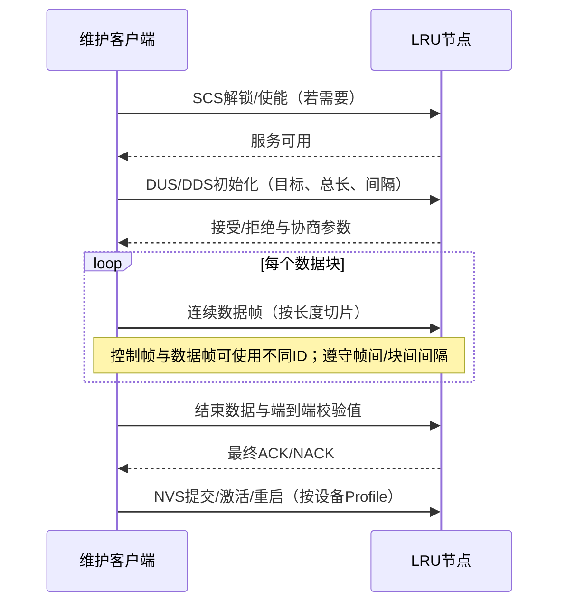

# ARINC 825 总线协议：从 29-bit 仲裁到应用与管理

> 适用基线：**ARINC 825-4（2018）**。它在 ISO CAN 的物理层/数据链路层之上，补充航空电子所需的逻辑通道、寻址、表示、节点服务、带宽和冗余管理。825-4 又引入 CAN FD（数据阶段最高 4 Mbit/s）。正式设计与符合性判定仍应以购买的规范和项目 Communication Profile 为准。

## 1. 一张图建立整体认识

把 ARINC 825 记成：**CAN 负责“帧可靠地抢到总线并发出去”，825 负责“这帧属于哪类业务、来自/去往哪个功能、数据怎样解释、节点怎样被管理”**。

| 协议模块 | 解决的问题 | 核心机制 |
|---|---|---|
| 物理层 / CAN DLL | 电气传输、成帧、差错隔离 | ISO 11898；Classic CAN 或 CAN FD；CRC、ACK、自动重发、TEC/REC、Bus-off |
| 29-bit 标识符与 LCC | 业务分类、仲裁优先级、对象或节点寻址 | 3-bit LCC + 随通信类型变化的字段布局 |
| 通信机制 | 广播数据、定向对话、服务调用 | ATM、DMC、PTP 三种模型 |
| 表示层 / Communication Profile | 字节怎样变成可互操作的工程量 | 大端序、标准数据类型/单位/坐标；FID+DOC 索引 Profile |
| 节点服务与传输 | 识别、配置、BIT、长数据块 | NSC/TMC 上的请求—响应服务；DUS/DDS 块传输 |
| 确定性与系统管理 | 时限、负载、冗余、网关、健康 | Major/Minor Frame、发送配额、RCI、LCL、PHSM |

CAN 是广播式、多主、半双工总线：所有节点都能看到帧，接收端通常用硬件 acceptance filter 只上送所需 ID。显性 `0` 覆盖隐性 `1`；标识符从高位开始逐位比较，因此**数值越小，优先级越高**。仲裁失败者不是产生碰撞，而是停止发送并在下一次总线空闲时重试。

> **重要边界：**CAN 的 ACK 只表示“至少一个节点收到了一帧格式正确的数据”，不表示目标应用已处理，也不表示长报文完成；后两者要靠 DMC/PTP 的响应、超时和最终状态完成。

## 2. 29-bit 仲裁标识符怎么拆

所谓“29-bit 仲裁”通常指扩展帧中的 **29-bit Identifier**，不是整个 Arbitration Field。Classic CAN 扩展帧的完整仲裁字段还含 `SRR`、`IDE`、`RTR`，共 `11+1+1+18+1=32 bit`；在 CAN FD 中相应位置使用固定显性的 RRS，且不支持 Remote Frame。ARINC 825 正常通信使用扩展数据帧。

29 位中最先发送的 3 位是 LCC，它既分流业务，又给出粗粒度优先级；其余字段继续参与仲裁。故 ARINC 825 **没有独立于 ID 的“Priority 字段”**，不能简单固定画成“Priority + Function + Source + Destination”。

| LCC[28:26] | 通道 | 用途 / 通信形态 |
|---:|---|---|
| `000` | EEC — Exception Event | 最高优先级的异常/紧急事件；ATM |
| `001` | Reserved | 保留，不作项目自定义 |
| `010` | NOC — Normal Operation | 周期或非周期正常参数；ATM |
| `011` | DMC — Directed Message | 地址+端口的定向消息/对话 |
| `100` | NSC — Node Service | 客户端/服务器节点服务；PTP |
| `101` | UDC — User Defined | 用户定义；优先采用标准通道 |
| `110` | TMC — Test & Maintenance | 测试、维护和健康；PTP |
| `111` | FMC — Base Frame Migration | 旧式 CAN 应用迁移；最低粗优先级 |

**A. ATM（一对多）标识符：EEC/NOC 为主**

| 位 | 宽度 | 字段 | 含义 |
|---|---:|---|---|
| 28:26 | 3 | LCC | 逻辑通信通道 |
| 25:19 | 7 | Source FID | 数据源所属的航空器功能；也参与优先级排序 |
| 18 | 1 | FSB | 指示载荷中数据的功能状态/有效性；旧资料可能把此位标成 RSD |
| 17 | 1 | LCL | `1` 表示仅本地网段，网关不应转发 |
| 16 | 1 | PVT | 私有/不透明定义，只供约定节点解释 |
| 15:2 | 14 | DOC | Data Object Code；在该 FID 的 Profile 中定位参数 |
| 1:0 | 2 | RCI | 冗余通道 A～D（0～3）；未使用时由 Profile 明确处理 |

**B. DMC（定向消息）标识符：像“节点地址 + 会话端口”**

| 位 | 宽度 | 字段 | 说明 |
|---|---:|---|---|
| 28:26 | 3 | LCC=`011` | DMC |
| 25:19 / 18:12 | 7+7 | Source / Destination Address | 节点地址；`0` 保留作多播，单播通常 1～127 |
| 11:6 / 5:0 | 6+6 | Source / Destination Port | 发起方用临时源端口并访问目标 WKP；响应时地址和端口方向互换 |

端口范围：`0–23` 临时端口，`24–31` 保留的 well-known port，`32–47` 为将来定义保留，`48–63` 用户定义。DMC 可让同一对节点并行维持多段对话，概念上接近子网内 UDP，但不是 IP，也不天然提供可靠字节流。

**C. PTP（点到点节点服务）标识符：NSC/TMC**

| 位 | 宽度 | 字段 | 说明 |
|---|---:|---|---|
| 28:26 | 3 | LCC | NSC=`100` 或 TMC=`110` |
| 25:19 | 7 | Client FID | 发起服务的功能 |
| 18 | 1 | SMT | 请求置 1，响应清 0 |
| 17 / 16 | 1+1 | LCL / PVT | 本地限制 / 私有或不透明数据 |
| 15:9 / 8:2 | 7+7 | Server FID / SID | 服务端功能与该功能内的节点实例；SID 0 可作多播 |
| 1:0 | 2 | RCI | 冗余通道；Server FID+SID(+RCI)构成目标节点身份 |

**仲裁例：**同一时刻 `NOC(010…)` 与 `NSC(100…)` 发送，第三个 LCC 位比较时 NOC 输出 `0`、NSC 输出 `1`，NOC 获胜；两个 NOC 帧则继续比较 FID、FSB/LCL/PVT、DOC、RCI。于是优先级是**整段 29-bit ID 的字典序结果**，LCC 只是最强的一层。

## 3. 核心通信场景

| 场景 | 选用机制 | 典型流程 | 应用确认 |
|---|---|---|---|
| 飞行控制量/液压压力周期发布 | NOC + ATM | 生产者按周期广播；消费者按 FID+DOC 过滤并查 Profile 解码 | 通常无逐帧应用响应，以 freshness/超时判定 |
| 故障降级或紧急告警 | EEC + ATM | 事件发生即发；低数值 LCC 优先抢占普通业务 | 按系统安全需求由状态机闭环，不能把 CAN ACK 当处置完成 |
| 给指定 LRU 发命令并收响应 | DMC | 发起者选临时端口→目标 WKP；目标返回自己的临时端口→双方继续对话 | 协议/应用自行定义响应、超时、重复抑制 |
| 查询身份、触发 BIT、写配置 | NSC/TMC + PTP | Client FID→Server FID/SID，SMT=1 请求；SMT=0 响应 | 节点服务响应码与超时 |
| 固件/数据库等长数据 | NSC 上 DUS/DDS | 建链协商→分块发送→端到端校验→最终状态 | 必须有传输级最终成功/失败 |

以“液压压力”为例：发送端选 `NOC + Source FID=48(Hydraulic Power) + DOC=项目Profile分配值 + RCI`，载荷按大端序编码。接收端并不是只看 DOC 就能知道单位，而是用 **FID+DOC** 查询双方共享的 Communication Profile，取得类型、单位、范围、比例、更新周期和有效性规则。

## 4. 长报文、表示与应用

ARINC 825 的长报文不要直接等同于 ISO-TP。标准通过 NSC 的 **Data Upload Service (DUS)** / **Data Download Service (DDS)** 组织连接型块传输；“upload/download”从哪一端观察在资料中容易混淆，工程上必须按采用的 825 版本、设备手册和 Communication Profile 确认方向。

实现时可把传输任务写成 `IDLE → ENABLED → NEGOTIATED → TRANSFERRING → VERIFY → DONE/ABORT`：

1. **保护与建链**：必要时先用 SCS 开放 DUS/DDS；初始化请求携带服务功能码、目标对象、总长度及帧间/块间间隔。服务端检查权限、空间和忙状态后接受或拒绝。
2. **切片与流控**：按 Classic CAN 的 0～8 byte 或 CAN FD 的更长载荷切片，维护 `remaining_length`、块计数和定时器；发送端严格服从协商间隔，避免长传输挤占周期关键报文。
3. **错误分层**：CAN CRC/错误帧/自动重发处理“单帧损坏”；传输层用消息超时、块超时和取消状态处理“对端失联/过程失败”。不要在没有 Profile 依据时自行假定 ISO-TP 式序号、流控帧、滑动窗口或乱序重排。
4. **完成与恢复**：接收端核对总长度和端到端 CRC/摘要，再回最终状态；失败则双方进入 ABORT、释放会话并由应用决定重试或回滚。固件场景还应采用 A/B 镜像、签名校验和断电安全激活策略——这些属于设备安全设计，不由 CAN ACK 提供。

一个公开的 825-4 兼容设备实现示例是：用 DUS 传固件，先协商消息/块间隔；Classic CAN 每帧携带 8 byte，单块最多 256 帧；固件末尾追加 4-byte IEEE CRC-32，完成后 LRU 返回最终结果并重启激活。**这些数字是实现示例，不应当作所有 ARINC 825 设备的规范常量。**

上层表示的记忆方式是“**ID 给索引，Profile 给语义**”：

- 字节序固定为 big-endian；规范统一布尔、整数、浮点等类型以及航空坐标/符号和物理单位。
- `Source FID + DOC` 只定位数据对象；Profile 还必须定义长度、类型、缩放、范围、单位、发送周期/截止期、有效性、数据源、冗余和网关策略。
- FSB 指向载荷状态/有效性，但具体载荷布局仍以 Profile 为准；不要从一个状态位臆造统一的多状态编码。

## 5. 管理功能、确定性与记忆清单

公开的 825-4 实现/验证资料列出下列 8 项标准 Node Service；有的资料称“9 个接口”，是把 **Node Service Concept** 本身也计为一个接口。

| 服务 | 管什么 | 实现要点 |
|---|---|---|
| IDS — Node Identification | 识别节点/Profile/LRU/能力 | NSC 请求目标 FID/SID；返回版本、Profile ID/Sub-ID 等，启动时做兼容性检查 |
| NSS — Node Synchronization | 协调同步动作/标记 | 发送指定同步请求；实际动作由设备 Profile 定义，不能自动理解成全网时钟同步 |
| DUS / DDS | 块数据上传/下载 | 连接型握手、长度与间隔协商、超时、完整性校验、最终状态 |
| BCS — BIT Control | 启动/控制 Built-In Test | 请求测试类型→节点执行→响应或维护状态报告结果；避免阻塞关键周期任务 |
| NVS — Non-Volatile Storage | 持久化配置/恢复 | 受控写入、原子提交、掉电保护；提交或重启语义由设备定义 |
| NIS — Node-ID Setting | 设置 SID/节点身份 | 检查冲突与地址 0 保留；明确临时还是掉电保存 |
| SCS — Service Control | 开/关受保护服务 | 授权后限时开放；维护活动刷新超时；失败即重新锁定，密钥/控制码由设备定义 |

**健康与错误管理：**TMC 可周期发送 PHSM（Periodic Health Status Message）；监督节点按 freshness、健康位和超时做告警、降级或隔离。底层同时监控 TEC/REC 及 Error Active→Error Passive→Bus-off。两个层次分别回答“链路是否健康”和“功能是否健康”。

**带宽与时限：**CAN 仲裁保证优先级，不单独保证 deadline。ARINC 825 的 Time Triggered Bus Scheduling 用共同的 Minor/Major Frame 周期，给每个节点规定每个 Minor Frame 的最大发送帧数及消息 Transmission Slot；节点不必在同一时刻启动周期，但必须守配额。公开教程建议设计负载不超过约 50%，为错误重发、维护和增长留余量。验证至少覆盖：最坏填充位、最高优先级干扰、长传输、错误帧风暴和 Bus-off 恢复。

**冗余与网关：**RCI 可标识最多四个冗余源/通道，但新鲜度比较、偏差门限、选择/投票规则由系统 Profile 决定；`LCL=1` 阻止网关跨网段转发，`PVT=1` 只说明语义私有，不等于加密或认证。

**与 CANopen 的有限类比（不可互通）：**NOC/ATM 类似 PDO 的实时发布，DMC/Node Service 部分类似 SDO/NMT，Communication Profile 部分类似对象字典/EDS；但 ARINC 825 以航空功能 FID、确定性预算、冗余和网关为中心，线格式与服务语义均不同。

最后用五句话复习：

1. **先看 LCC，再按通信类型解释其余 26 位。**
2. **整个 29-bit ID 决定优先级，数值越小越先发。**
3. **连续参数用 ATM，定向对话用 DMC，管理服务用 PTP。**
4. **CAN ACK 只到帧；长报文成功要等 DUS/DDS 最终状态。**
5. **FID+DOC 是索引，Communication Profile 才是应用语义与确定性合同。**

资料入口（由权威到易读）：[ARINC 825-4 官方页](https://saemobilus.sae.org/standards/arinc825-4-825-4-general-standardization-controller-area-network-bus-protocol-airborne-use)；[ISO 11898-1:2024 官方页](https://www.iso.org/standard/86384.html)；[CAN in Automation 技术论文](https://www.can-cia.org/fileadmin/cia/documents/proceedings/2012_knueppel.pdf)；[29-bit、通信与 Profile 教程](https://mil-std-1553.jp/825_p04.html)；[CAN 帧与错误管理教程](https://mil-std-1553.jp/825_p03.html)；[带宽管理教程](https://mil-std-1553.jp/825_p05.html)；[825-4 节点服务/CAN FD 验证资料](https://www.smartdvtech.com/products/arinc-825-vip/)；[长报文与固件更新实现示例](https://docs.hargravetechnologies.com/hargrave-arinc-protocol-1-1/arinc-advanced-guide)。
