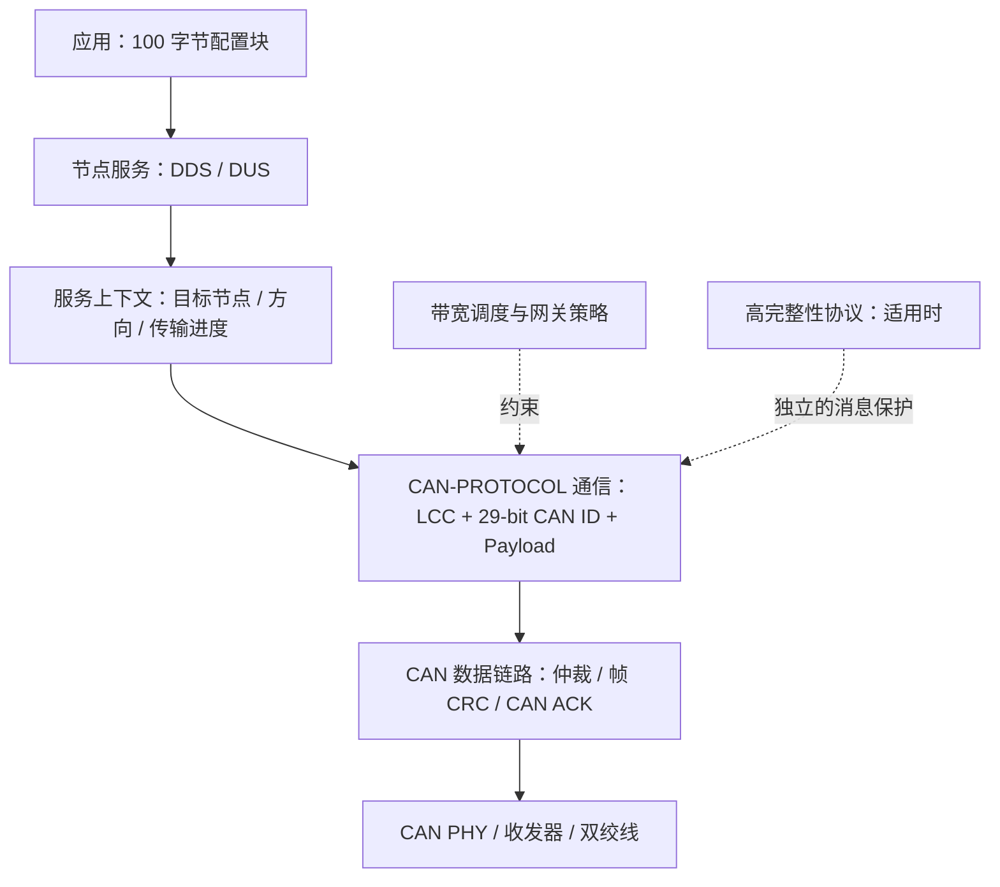
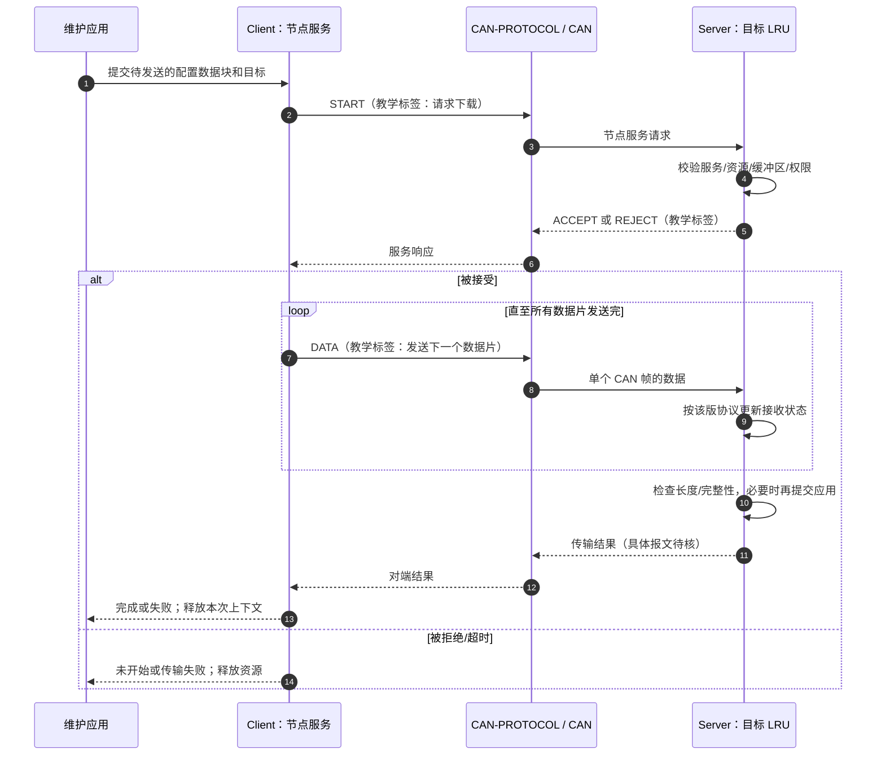
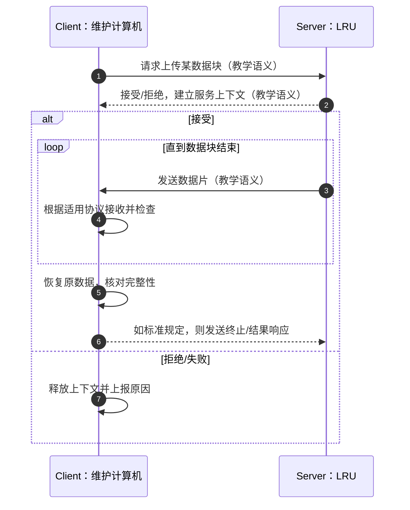
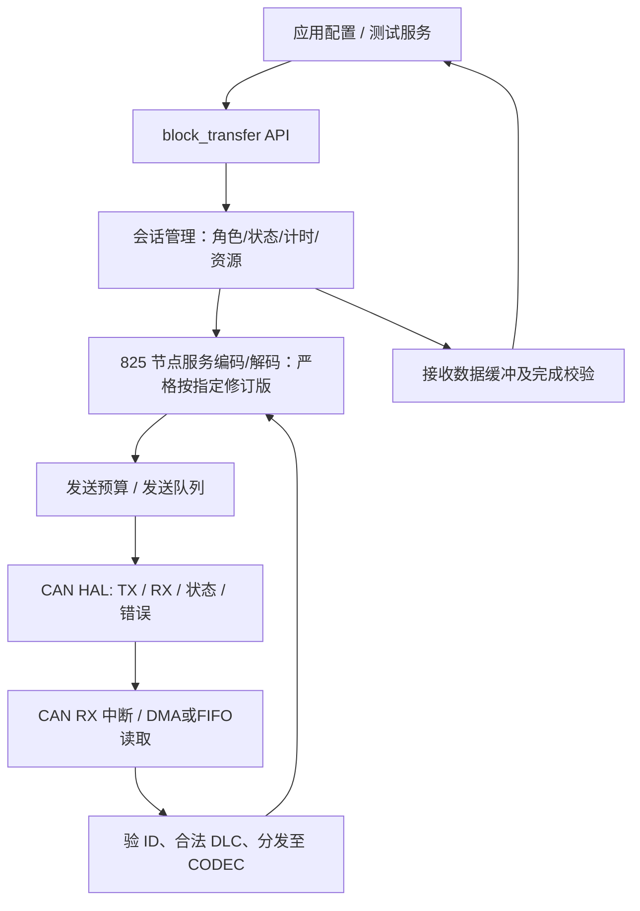
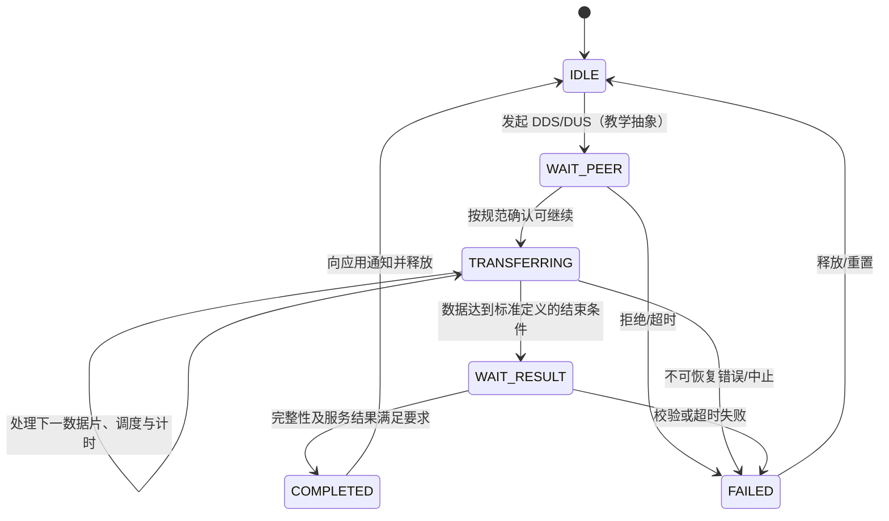

# CAN-PROTOCOL 长报文传输：从 8 字节 CAN 帧到完整数据块

> 学习路线：**问题 → 规范中的通信机制 → 一次完整传输 → 帧与状态 → 可靠性 → MCU 实现 → 验收**。  
> 资料核查日期：2026-09-17。对象为 CAN-PROTOCOL；重点是 **Node Service Interface 中的 Data Download Service（DDS）和 Data Upload Service（DUS）**，并说明 Directed Message Channel（DMC）、ARINC 826 和其他 CAN 传输协议的边界。  
> **证据等级**：本文用【已核实】表示公开标准目录、标准发布方说明或可查技术资料直接支持；用【工程推导／教学示例】表示为理解或实现而设计，**不代表 CAN-PROTOCOL 规定的线格式**；用【待原文核对】表示必须查授权的 CAN-PROTOCOL-4 正文才能确定。本文不是标准正文的替代品。

## 目录

- [1. 先把问题说清楚：究竟谁负责“长报文”](#1-先把问题说清楚究竟谁负责长报文)
- [2. 放在 CAN-PROTOCOL 哪个位置：寻址、通道和服务](#2-放在-arinc-825-哪个位置寻址通道和服务)
- [3. 从头到尾看一遍下载与上传](#3-从头到尾看一遍下载与上传)
- [4. 把一次传输拆成协议模块](#4-把一次传输拆成协议模块)
- [5. 帧格式、编号、重传：哪些能确证，哪些不能](#5-帧格式编号重传哪些能确证哪些不能)
- [6. MCU 实现：数据结构、状态机和排错](#6-mcu-实现数据结构状态机和排错)
- [7. 与 ISO-TP、J1939、CANopen、ARINC 826 对照](#7-与-iso-tpj1939canopenarinc-826-对照)
- [8. 最小验证清单与心智模型](#8-最小验证清单与心智模型)
- [References / Manuals](#references--manuals)

---

## 1. 先把问题说清楚：究竟谁负责“长报文”

### 1.1 一个实际任务

假设飞机上的维护计算机需要向远端 LRU 传送一段 **100 字节配置数据**，而 CAN Classical 扩展数据帧的数据区最多 **8 字节**。一帧显然装不下。因此，**先把一份应用数据变成多个 CAN 帧，再在远端恢复为同一份数据**，才是长报文问题。【已核实：CAN 帧限制见 [R2] §2 与 [R3]】

为了可靠地完成这个任务，不能只写 `for (...) can_send(frame)`。至少要回答：

| 设计问题 | 协议必须提供的答案 | 不解决会怎样 |
|---|---|---|
| 发给谁？ | 目标节点和服务 | 其他节点不知道该不该处理 |
| 对方准备好了吗？ | 请求、接受或拒绝机制 | 缓冲区未准备好便接收 |
| 哪几帧属于同一次传输？ | 会话/服务上下文 | 并发传输可能混包 |
| 一共有多少数据？ | 总量或终止条件 | 无法判定接收完成 |
| 帧有没有缺失、重复、错序？ | 编号、计数或等效检测机制 | 拼出错误内容 |
| 接收端处理不过来？ | 速率约束、暂停或分批发送 | 队列溢出 |
| 什么叫成功？ | 接收完成及应用级验证 | CAN ACK 被误认为数据已交付 |
| 超时怎么办？ | 退出、恢复和重试策略 | 死会话或无限重发 |

**最重要的边界：CAN 控制器处理的是“一帧”的仲裁、CRC、错误检测与 ACK；应用数据块的会话、分块和交付结果，需要上层协议/服务处理。** CAN ACK 只表示至少有接收节点正确收到物理链路上的该帧，不保证指定服务端已经解析、缓存或写入这一批数据。【已核实：[R2] §2；[R3] 数据链路层】

### 1.2 不能把其他协议的分包帧直接叫作 CAN-PROTOCOL

- 【已核实】CAN-PROTOCOL 的标准目录把 **Node Service Interface** 放在 §5.5，把 **Bandwidth Management** 放在 §5.6，把 **High Integrity Protocol** 放在 §5.7。这是三种不同职责，不等于一个叫“ISO-TP”的统一格式。[R1]
- 【已核实】可公开核对的 CAN-PROTOCOL 验证产品明确列出 **Data Download Service（DDS）**、**Data Upload Service（DUS）** 等节点服务。[R4] Airbus 技术论文也明确指出其节点服务支持数据下载及有连接/无连接请求。[R2] §3。
- 【待原文核对】公开资料**不足以完整核对 CAN-PROTOCOL-4 的 DDS/DUS 每个数据字节、服务码、序号含义、握手超时、最大块长、异常码和重传算法**；因此下文不会伪造一张“CAN-PROTOCOL 标准分包字段表”。做真正兼容性固件时，需要逐字核对授权标准的 §5.5 及适用修订版。
- 【已核实但属于**另一规范**】公开 CANaerospace v1.17 的 §4.3/§4.4 包含 DDS/DUS 的详细下载/上传实例，但其 4 字节消息头、服务码、1–1020 字节大小及计时值都是 **CANaerospace v1.17 的规定**，**不能未经核验移植成 CAN-PROTOCOL 的规定**。[R5]

一句话：**825 给你规范化的总线通信和节点服务框架；长数据块要沿 DDS/DUS 等服务路径理解，不能把 J1939 的 RTS/CTS、ISO-TP 的 FF/CF/FC 或 CANopen 的 SDO 报文冒充它。**

## 2. 放在 CAN-PROTOCOL 哪个位置：寻址、通道和服务

### 2.1 先建立架构位置



这是**职责图而不是 CAN-PROTOCOL 声称与 OSI 七层逐层一一对应的实现图**。CAN-PROTOCOL 在经典 CAN 之上增加 LCC、寻址、节点服务与数据表示等功能；某些功能可类比 OSI 第 3/4/6 层，但并不表示已有一个通用 TCP 式可靠字节流。[R2] §3；[R6]。

### 2.2 29-bit CAN Identifier 首先是“通信通道和优先级”，不等于长报文头

【已核实】29 bit ID 的**最高 3 位**划分 LCC。数值较小的 CAN ID 在仲裁中优先级较高。[R2] §2–§3。

| LCC | 名称/角色 | 对本题的意义 |
|---|---|---|
| `000` | EEC，紧急事件 | 不能被大数据传输无节制挤占 |
| `010` | NOC，正常运行，通常一对多 | 周期/状态数据应受到时延保护 |
| `011` | DMC，定向消息（见版本提示） | 通过源/目的节点和端口开展定向对话，**不因此自动具备长报文重组** |
| `100` | NSC，节点服务 | DDS/DUS 等客户端—服务器交互的重点通道 |
| `101` | UDC，用户定义 | 不能将自定义分包假称标准 DDS |
| `110` | TMC，测试与维护 | 维护服务相关通道；实际使用需按目标版本约束 |
| `111` | FMC，迁移通道 | 不是通用长包传输层 |

**版本提示（重要）**：Airbus 作者 2012 年发布的 CAN-PROTOCOL LCC 表把 `011` 标成 *Reserved*，而公开的另一份 CAN-PROTOCOL 教程将 `011` 描述为 *Directed Message Channel*。这表明**资料覆盖的修订版不一致**；目前不能仅凭这两份二手资料断言 DMC 究竟在哪次补充版引入。若你的系统写明 CAN-PROTOCOL-2、825-3 或 825-4，必须以**该版标准**的 LCC 表为准。[R2] p.10-11（PDF 第 5 页）；[R6] DMC 部分。

### 2.3 DMC 与 NSC 为什么不能混淆

**DMC 的问题是“发给哪个节点的哪个会话端口”；NSC 的问题是“调用什么节点服务，并按照它的服务流程完成操作”。** DMC 的源/目标端口类似 UDP 端口，是复用/分流标识，**不是 TCP 的序号或自动流控机制**。[R6]

根据公开的 DMC 教程，29-bit ID 的字段排列如下。这里只展示 **DMC ID**，不是 DDS/DUS 的分包格式：【二手技术资料支持，最终以所用修订版核对】

```text
位        28..26      25..19        18..12       11..6       5..0
宽度         3            7             7            6           6
          +-------+-------------+-------------+-----------+-----------+
DMC ID    | LCC   | Source Addr | Dest Addr   | Src Port  | Dst Port  |
          +-------+-------------+-------------+-----------+-----------+
              011       节点             节点       会话分流     目标服务/会话
```

- 节点地址 0 用于多播，普通单播节点地址为 1–127；不是“128 个普通单播节点”。
- 端口 `0–23` 为临时端口；`24–31` 是**为未来分配而保留的 well-known 范围**，**不能武断地说目前 24–31 都有已定义服务**；`32–47` 预留；`48–63` 用户定义。[R6]“Port Numbers”表。
- 首次访问通常以目标 well-known 端口说明服务用途；进入双方会话后，目标端口可能切到对端分配的临时端口。反向帧交换源/目的地址和相应端口字段。**端口负责区分对话，不负责报文分片。**[R6]

**NSC 的节点寻址机制不同于 DMC**：公开资料描述 NSC/TMC 的点对点 ID 由源/服务 FID、服务器 SID、SMT、LCL、RCI 等相关字段构成，`SMT=1` 表示服务请求，`SMT=0` 表示服务响应；PVT 在 DDS/DUS 情形可表示不透明数据传输。不能把上面的 DMC 地址/端口位图直接套用到 NSC 标识符上。[R6]“Peer-to-Peer Identifier Structure”。

## 3. 从头到尾看一遍下载与上传

### 3.1 先定义方向：不要被 Download/Upload 名称绕晕

以下以**维护计算机（Client）作为参照**，不是根据 CAN 仲裁方向命名：

- **DDS / Download**：维护计算机将配置数据送往目标 LRU。
- **DUS / Upload**：维护计算机请求目标 LRU 将数据回传。

这里的“维护计算机”和“目标 LRU”是**教学场景中的角色约定**。规范应以具体服务的 requester、respondent 和数据方向描述为准；不同设备软件界面可能以 LRU 视角把“上传/下载”反过来称呼。[R4][R5]

### 3.2 DDS：100 字节配置数据发送时，逻辑上发生了什么

下图是**教学用的服务阶段示意**：服务存在性、连接型节点服务方向可公开核实；消息名 `START/ACCEPT/DATA/COMPLETE` 是帮助理解的**语义标签，不是已核实的 CAN-PROTOCOL PDU 类型、服务码或逐字报文名**。真实是否有独立 `COMPLETE`、确认粒度及超时，应查 §5.5。【已核实基础：[R2] §3、[R4]；具体线格式【待原文核对】】



按认知顺序理解为 **“约好一次传输 → 对方许可 → 逐帧送达 → 对方确认这一份数据块完成 → 清理上下文”**。如果把“某一 CAN 帧的 ACK”当作倒数第二步，就会错误地把总线收帧确认等同于应用数据块成功。

### 3.3 DUS：反方向的数据由谁发？



**DDS 和 DUS 的核心区别是“谁拥有待发送的数据、谁执行分片发送、谁分配重组缓冲区”。** 它们不一定是简单地交换所有 CAN ID 字段：NSC 有自己的请求/响应标识与服务语义，具体按标准操作。【方向与服务名称来源：[R4][R5]；上图交互阶段为教学抽象】

### 3.4 一次传输至少有三种“成功”

1. **总线级**：控制器报告一帧发送成功，CAN CRC/ACK 等帧级机制发挥作用；但 ACK 可能来自其他节点。
2. **服务级**：目标节点服务判断此次传输完整且符合对应 DDS/DUS 的规则；是否有最终 ACK、校验类型/方式须按该版 §5.5 核对。
3. **应用级**：数据已通过类型/范围检查并完成指定操作（例如配置写入、持久化、校验读回）。**闪存写成功、掉电回滚等不能只凭 CAN ACK 推断。**

## 4. 把一次传输拆成协议模块

下面把问题拆成开发中真正需要的模块。每个模块的“职责”是工程分析；凡涉及**具体标准规定**而公开材料无法证明的地方，明确标为待核。

| 模块（标准/工程常用名称） | 为什么存在 | 实际处理内容 | 依据及边界 |
|---|---|---|---|
| 服务发现/寻址 | 确定调用谁的什么功能 | LCC、FID/SID 等节点服务地址、服务类型 | CAN-PROTOCOL 节点服务可核实；精确 ID 子字段查 §5.2/§5.5 [R2][R6] |
| 会话建立（Connection management） | 对端可能忙、无权限或没有内存 | 发送请求；响应接受/拒绝；建立上下文 | 节点服务支持握手型服务 [R2]；DDS 具体握手 PDU 待核 |
| 分段与重组（Segmentation/Reassembly） | 100 B 装不进 8 B | 数据切片、缓存、进度、结束判定 | 工程必需；825 的准确片头与最大值待核 |
| 传输排序与完整性 | CAN 单帧正确 ≠ 整块正确 | 使用标准规定的编号/长度/校验，阻止乱序混包 | 具体字段、算法待核；不能借用其他协议 |
| 流量控制（Flow control） | MCU RAM、FLASH 擦写速度可能不足 | 暂停、节流、分批或按规范给出接收容量 | 具体 DDS/DUS 指令及窗口形式待核 |
| 错误恢复（Error recovery） | 丢帧、超时、复位等可能中断操作 | 超时、重试、放弃、状态清理 | CAN 帧级重传已知；服务级策略待核 |
| 传输终结（Completion/Release） | 什么时候能交给应用并释放内存？ | 完整性验证、结果通知、释放资源 | 工程必需；准确最终握手待核 |
| 带宽控制（Bandwidth management） | 大流量可能推迟告警与周期数据 | 调度、每 minor time frame 的发帧预算 | 标准 §5.6 和 Airbus 说明 [R1][R2] |
| 高完整性（High Integrity Protocol） | 对关键消息增加端到端检测 | 适用时利用序号和 MIC 等 | 与“大报文分片”是**不同问题**；§5.7 [R1][R7] |
| 网关（Gateway） | 数据跨 CAN 网络边界 | 转发、缓冲、负载转换、故障隔离 | §6.0–§6.6 [R1][R2]；不保证透明保留会话 |

**注意：CAN-PROTOCOL 的节点服务接口提供的功能不等于“已证明存在 TCP 式滑动窗口、选择重传或逐帧 NACK”。** 没有 §5.5 原文，就不能把你的既有可靠传输项目中的这些机制写成该标准强制要求。

### 4.1 为什么“发送序号”不是万灵药

【工程推导】假设某实现的数据片编号为 `0,1,2,3`，收端见到 `0,1,3` 可以识别缺失 `2`；然而“该标准**究竟用编号、消息数、偏移还是其他机制**”必须查正文本身。若 8-bit 编号回绕，还要由会话标识、总长度和传输规则消除歧义。

【特别区分】CAN-PROTOCOL **High Integrity Protocol 的 SNo** 是用于高完整性消息序列监测的字段；公开论文展示其与 MIC 嵌在数据负载内，传统 8 字节 CAN 帧中会占用有效载荷。**不能据此推断每一帧 DDS 必须使用相同 SNo，或把该 SNo 直接当作数据块分片编号。**[R7] §2.1 附近。

### 4.2 为什么 CAN ACK 不等于 DDS 完成

```text
发送端 MCU -> CAN 控制器 -> CAN 总线 -> 任一正常接收的节点：CAN ACK
                                      |
                                      +-> 目标 LRU 驱动 RX 队列
                                                |
                                                +-> 节点服务协议解析、重组
                                                          |
                                                          +-> 应用校验/落盘
```

【已核实】CAN ACK 反映总线上**至少有节点确认帧级接收**，并不保证目标应用处理成功。[R3] ACK 机制。进一步，如果驱动 RX FIFO 溢出、软件重启或 LRU 在完整校验前掉电，即使先前所有帧都曾得到 CAN ACK，整块数据仍可能失败。【工程推导】

### 4.3 为什么流控和带宽预算要分开

- **流控（接收方视角）**：我现在的 RAM、FIFO、FLASH 操作能不能再接收？重点是 **接收资源**。
- **带宽预算（系统视角）**：整个 CAN 总线还能允许这条服务占多少帧/时间？重点是 **其他消息的时限**。

例如收端有 4 KB RAM，不代表可以无限速连续传输，因为发满总线可能推迟更高优先级业务。反之总线空闲也不代表目标 LRU 有能力立刻写闪存。【工程推导】

Airbus 作者公开说明，CAN-PROTOCOL 使用按 *minor time frame* 限制各节点发帧数量的调度理念，并以 **50% 负载作为文中推荐的设计裕量**；这是论文中的设计建议与场景，**不是对所有飞机、速率和 CAN-PROTOCOL-4 部署都自动成立的硬性 50% 法规**。[R2] pp.10-12 至 10-13。

## 5. 帧格式、编号、重传：哪些能确证，哪些不能

### 5.1 CAN 帧外形（确定）

```text
经典 CAN 2.0B 扩展数据帧（抽象图，并非精确逐 bit 线序）：
+------+-------------------+---------+---------------+----------+-----+
| SOF  | 29-bit identifier | 控制/DLC | Data: 0..8 B  | CAN CRC  | ACK |
+------+-------------------+---------+---------------+----------+-----+
                                                     后续还有 EOF、帧间隔等
```

【已核实】CAN-PROTOCOL 采用扩展 CAN ID 的通信方案。**29-bit ID 位于 CAN 仲裁字段，DLC 描述本帧数据长度；ID 本身不是 29 字节报文头。** 每一帧都有其自己的 CRC/ACK。[R2] §2；[R3] 数据帧结构。

【修订版差异】SAE 对 CAN-PROTOCOL-4 的官方介绍明确说明 Supplement 4 纳入 **CAN FD**。CAN FD 的数据区可以大于经典 CAN 的 8 字节，但**仅凭“硬件支持 CAN FD”不能推断目标节点的 DDS/DUS 就支持某一种 64 字节分段格式**：实际配置与协议均要按目标设备/标准确认。[R8]

### 5.2 DDS/DUS 的精确数据区：此处不编造

下表是实现者需要从 **CAN-PROTOCOL-4 §5.5** 摘取的“字段核对表”，不是声称这些字段在标准中逐项存在：

| 核对对象 | 必须从正版规范查出的信息 | 当前结论 |
|---|---|---|
| 请求报文 | 服务码、请求类型、字段位置/长度和合法值 | 【待原文核对】 |
| 响应报文 | 接受/拒绝、状态码、可选参数 | 【待原文核对】 |
| 数据报文 | 是否存在明确分片序号/块偏移、每帧最大业务数据量 | 【待原文核对】 |
| 传输长度 | 最大块长、总量字段、最后一帧判定 | 【待原文核对】 |
| 流控 | 是否规定暂停/恢复、节流或信用额度 | 【待原文核对】 |
| 超时/重传 | 响应计时、重试次数、续传/整块重传 | 【待原文核对】 |
| 收尾 | 末帧确认、校验、取消操作、释放上下文 | 【待原文核对】 |
| CAN FD 扩展 | 对经典帧和 FD 帧是否分别定义负载及服务规则 | 【待原文核对】 |

### 5.3 通过一份**明确标注的假设协议**学会算分片

以下只为证明分片算法，**不是 CAN-PROTOCOL、CANaerospace、ISO-TP 或 ARINC 826 的标准线格式**。

假设一个项目自定义传输，每个经典 CAN 数据区前 **3 字节为本项目内部控制信息**，剩余 5 字节承载原数据，则：

```text
整块应用数据 N = 100 B
CAN 单帧容量    = 8 B
示意控制开销 H  = 3 B  （仅假设）
每帧净数据 P    = 8 - 3 = 5 B
所需数据帧数    = ceil(100 / 5) = 20 帧
```

```text
应用数据 [0..99]
   |-- 片 0：原数据  0..4   --> [示意控制 3 B | 数据 5 B]
   |-- 片 1：原数据  5..9   --> [示意控制 3 B | 数据 5 B]
   |-- 片 2：原数据 10..14  --> [示意控制 3 B | 数据 5 B]
   |       ...
   `-- 片19：原数据 95..99  --> [示意控制 3 B | 数据 5 B]
                                                   ↓
                                             按序重组 100 B
```

这个例子只能教会 **长度、净负载、切片、重组和完整性** 之间的关系。真实 CAN-PROTOCOL 的 `H`、是否每帧都有该开销、最后一帧填充规则等 **不能从这里反推**。

### 5.4 带宽与传输时长的量级计算

Airbus 论文为了做通用估算，假定一个满载的经典 CAN 29-bit 数据帧计入约 19 个平均填充位及帧间隔后，按**约 150 bit/帧**估算。在 **1 Mbit/s** 下约为 **150 μs/帧**。[R2] p.10-12。

对上面的假设例子，20 个数据帧单纯占用约 `20 × 150 μs = 3 ms`。这只是**数据帧占用时间量级**：不含请求/响应、仲裁等待、错误重发、应用处理、网关排队、协议必须遵守的发帧预算。如果某系统实际只分配约一半总线时间给此类流量，3 ms 的总线占用不等于“精确 6 ms 就一定传完”。【估算基于 [R2]；后半为工程推导】

### 5.5 错误处理：必须区分“协议规定”与“工程建议”

| 故障注入 | 已确定的基础机制 | MCU 实现时要处理的结果【工程建议】 |
|---|---|---|
| 本帧 CRC 错误 | CAN 错帧处理、控制器相关自动重传机制 | 统计错误与重新发送造成的时延；勿重复向应用交付 |
| 目标 MCU 的 RX 队列丢帧 | CAN ACK 不保证应用接收 | 通过该版标准的进度/完整性机制检测，失败时不提交半块 |
| 接收节点重启 | 会话状态消失 | 清理旧上下文，按标准规定重新协商或报错 |
| 两个客户端同时下载 | 可能竞争目标服务/缓冲区 | 查标准的并发和拒绝规则；限额，不混合数据块 |
| 发送端超时 | 请求或数据在规定时间内无结果 | 仅按规范允许的重试粒度恢复，防止重复写操作 |
| 最后一帧后掉电 | 帧都可能 ACK，应用未持久化 | 应用提交与传输完成分离，必要时做完整性/掉电测试 |
| 总线过载 | 高优先级流量受影响 | 按 §5.6 的调度/负载分析控制数据块流量 |

特别地，不要擅自设定 **“丢第 3 帧就 NACK=3，按 8 帧窗口选择重传”** 为 CAN-PROTOCOL 行为；这是**可以自定义、但尚未得到标准证实**的方案。

## 6. MCU 实现：数据结构、状态机和排错

这一节是**实现架构建议，不是对标准 API 的复刻**。先把标准解析器独立出来，再绑定具体 CAN 驱动。这样拿到合法 §5.5 后，主要替换的是报文编解码与状态跃迁，而不是把各种“猜想服务码”散落在业务代码中。

### 6.1 推荐模块分层



**建议接口的职责，而非标准函数签名**：`open_session(target, service)` 建立内部上下文；`submit_block(buffer, len)` 交付待发数据；`on_can_rx(id, dlc, bytes)` 给协议层处理；`tick(now)` 检查计时和发帧预算；`cancel(handle)` 根据适用标准中止；`on_complete(result)` 通知应用。

设计时把“应用缓存”和“CAN 控制器发送完成”两个概念隔离。一次 `can_send()` 成功通常只证明帧进入驱动/硬件队列，不应据此将会话直接设为已完成。【工程建议】

### 6.2 内部会话建议保存什么

```c
/* 教学用内部状态，绝不是 CAN-PROTOCOL 标准规定的结构体/字段 */
typedef enum {
    BT_IDLE, BT_WAIT_PEER, BT_TRANSFERRING,
    BT_WAIT_RESULT, BT_COMPLETED, BT_FAILED
} bt_state_t;

typedef struct {
    bt_state_t state;
    uint32_t target_key;       /* 从实际 NSC 标识符提取的目标/服务上下文 */
    uint32_t total_len;        /* 应用数据总长 */
    uint32_t processed_len;    /* 已按协议确认/处理的数据量 */
    uint32_t deadline_ticks;   /* 本次状态的超时时刻 */
    uint8_t *buffer;
    uint32_t buffer_capacity;
    uint8_t direction;         /* DDS / DUS：工程内枚举 */
    uint8_t retry_count;       /* 仅在规范允许的规则下操作 */
} bt_session_t;
```

这里不放所谓“CAN-PROTOCOL 标准的 seq=8 bit、window=8、CRC32 必选”等断言。首先从规范拿到真实的状态变量和合法范围，再决定字段宽度。

### 6.3 通用状态机及失败路径



**代码审核关键**：每一条 `FAILED` 都必须有缓冲区释放、定时器注销、端口/会话句柄释放或隔离旧包的路径；“旧会话的迟到帧不得写入新会话”的具体判别键要按标准和系统设计落实。【工程建议】

### 6.4 调试时建议至少记录这些字段

```text
monotonic_timestamp, can_id_29, is_fd, dlc, data_hex,
can_tx_status, can_rx_overflow, bus_off, tx_error_counter,
rx_error_counter, session_key, service, state,
processed_bytes, expected_bytes, deadline, retry_count,
final_service_result, application_commit_result
```

至少保留**原始 ID 和原始 Data**，不要只打印“分片成功”。若抓包日志不能由规范重新解码，即使当前传输成功也难以定位跨厂家兼容性问题。esd 的 CAN-PROTOCOL Library 软件手册公开了控制器状态、发送/接收计数、丢帧及错误相关字段，可以作为**诊断指标参考**，但该厂商 API **不是规范规定的服务 PDU**。[R9] §§6.4、7。

## 7. 与 ISO-TP、J1939、CANopen、ARINC 826 对照

| 协议/机制 | 面向的问题 | 如何与你的任务对应 | 不能混用的关键点 |
|---|---|---|---|
| **CAN-PROTOCOL NSC / DDS / DUS** | 节点服务与数据上传/下载 | 本文研究对象 | 原版 §5.5 才能确定真正帧格式及异常规则 [R1][R4] |
| **CAN-PROTOCOL DMC** | 节点地址＋端口的定向消息/对话 | 可做定向消息，不等于 DDS 的分片协议 | DMC ID 字段不同于 NSC ID；DMC ≠ ISO-TP [R6] |
| **ISO 15765-2（ISO-TP）** | 在 CAN 上传超过一帧的网络层数据 | 通过 SF、FF、CF、FC 形成独立完整机制 | **FF/CF/FC 属于 ISO-TP，不是 CAN-PROTOCOL 默认帧类型** [R10] |
| **SAE J1939 TP** | J1939 长报文 | 另有会话控制及数据传输机制 | 不得将 RTS/CTS、BAM 直接写进 DDS 定义 |
| **CANopen SDO** | 对象字典访问，支持较长对象传输 | 用于参数读写的类比 | SDO 分段/块传输属于 CANopen，并非 NSC |
| **ARINC 826** | 航空 CAN 总线的软件装载 | 当“长数据”实际指**软件包下载**时，需额外研究这套规范 | 官方把它定义为独立软件装载标准，包含 §2 应用层、§4 传输层；不能把它误称“CAN-PROTOCOL 的内置升级协议” [R11] |

**如何选文档**：题目是“825 上读/写一段节点数据”，先看 **CAN-PROTOCOL-4 §5.5**；题目是“在 CAN 上传航空设备的软件部件”，还要看 **ARINC 826-1 §2–§4**；题目是“UDS over CAN 的长诊断报文”，看 **ISO 15765-2**，不应从 825 拼一套 ISO-TP。【依据：[R1][R10][R11]】

## 8. 最小验证清单与心智模型

**兼容性测试的前提是先取得目标修订版 §5.5 的字段和状态定义。** 在此之前可以完成 CAN 链路实验和内部示意分片实验，但不能宣称“CAN-PROTOCOL DDS/DUS 协议一致性测试通过”。

| 顺序 | 测试 | 合格条件 |
|---|---|---|
| 1 | 使用 29-bit 扩展 ID 发送/接收 | 原始 ID、DLC、数据字节和时间戳正确 |
| 2 | 按目标修订版解析 LCC/NSC | 能识别合法服务，拒绝错误通道/非法字段 |
| 3 | 一帧或最小数据块服务 | 完成服务级交付，而非仅 TX OK |
| 4 | 超过单帧容量的数据块 | 重组长度和原始字节完全一致 |
| 5 | 数据块最大值、最后一帧不满 | 遵循规范长度界限，绝不越界写 |
| 6 | 插入丢帧、错帧、重复帧 | 按规范报错/恢复；错误块不得交应用 |
| 7 | 目标忙、缓冲区不足、会话并发 | 按规范拒绝或节流，不发生混包 |
| 8 | 请求/响应超时与双方重启 | 会话有界清理，不无限重试、不误用旧帧 |
| 9 | 同时发送 EEC/NOC 周期数据 | 大数据服务符合系统总线预算和时限 |
| 10 | 软件升级/持久化场景（若适用） | 额外验证应用 CRC/签名、提交及掉电保护；依据产品需求和适用规范 |

### 一分钟心智模型

```text
        应用要传一整块数据
                 |
     1. 找到具体目标和节点服务
                 |
     2. 确认对方允许本次传输
                 |
     3. 按标准拆成逐帧可承载的内容
                 |
     4. 接收方按服务规则恢复、检查
                 |
     5. 取得真正的服务/应用完成结果
                 |
     6. 结束会话，释放资源

并行的两条约束：
  横向：带宽调度不能影响关键实时消息；
  纵向：CAN 帧级 ACK ≠ 节点服务完成 ≠ 应用落盘完成。
```

**记住四个不等式**：`DMC 端口 ≠ 分片序号`；`CAN ACK ≠ 应用成功`；`High Integrity SNo ≠ 已证明的 DDS 序号`；`ARINC 826 软件装载 ≠ CAN-PROTOCOL 内建的统一长报文线格式`。

---

## References / Manuals

以下可直接打开。出版者目录是**标准存在性与章节组织的权威依据**，但没有完整正文可供逐字验核；对应限制已在正文说明。

| ID | 资料与精确位置 | 本文用途 |
|---|---|---|
| [R1] | [CAN-PROTOCOL-3（2015）标准目录](https://shop.standards.ie/en-ie/standards/arinc-825-2015-98639_saig_arinc_arinc_207412/)：§4 Data Link；§5.2 Identifier；**§5.5 Node Service Interface**；**§5.6 Bandwidth Management**；**§5.7 High Integrity Protocol**；§6 Gateway | 确认标准章节与职责。注意该版本已被 825-4 取代 |
| [R2] | [R. Knueppel（Airbus）, *Standardization of CAN networks for airborne use through CAN-PROTOCOL*, iCC 2012 PDF](https://www.can-cia.org/fileadmin/cia/documents/proceedings/2012_knueppel.pdf)：PDF pp.3–6，纸本 pp.10-9–10-12；尤其 §3/表 2、§3 带宽讨论 | CAN 8 字节、PTP/ATM、NSC、LCC 早期版本及带宽实例 |
| [R3] | [CAN-PROTOCOL CAN data link tutorial](https://www.mil-std-1553.jp/825_p03.html)：Data Frame、DLC、ACK | 仅作公开二手技术解释，不能替代 ISO 11898-1 / ARINC 正文 |
| [R4] | [SmartDV, CAN-PROTOCOL Verification IP](https://www.smart-dv.com/vip/arinc_825.html)：Node Service Interface 服务清单 | 确认产品列出 DDS、DUS（其所声明的适用版本为 825-2） |
| [R5] | [*CANaerospace Interface Specification*, v1.17](https://studylib.net/doc/25879953/can-aerospace-v.1.17)：**§3.4、§4、§4.3 DDS、§4.4 DUS** | 仅用于对照：这份旧标准的具体字节、计时、块长**不能当作 CAN-PROTOCOL 的值** |
| [R6] | [CAN-PROTOCOL Communication tutorial](https://mil-std-1553.jp/825_p04.html)：LCC、Directed Message ID、Port Numbers、Peer-to-Peer ID | DMC/NSC 寻址差别及端口二手解释；必须与目标修订版校对 |
| [R7] | [McGill University, *A825-HWIL* thesis PDF](https://escholarship.mcgill.ca/downloads/x059cd56x)：§2.1，Fig.2.3（Regular vs High-Integrity Frames） | 区分高完整性消息 SNo/MIC 与传输分片，不作为规范全文 |
| [R8] | [SAE 官方 ARINC825-4 标准页](https://saemobilus.sae.org/standards/arinc825-4-825-4-general-standardization-controller-area-network-bus-protocol-airborne-use)：Scope、Supplement 4 | 确认现售版、2018 年 9 月 25 日及新增 CAN FD；**正版 §5.5 为兼容实现的最终裁决** |
| [R9] | [esd, *CAN-PROTOCOL Library Software Manual* Rev.1.6](https://esd.eu/fileadmin/esd/docs/manuals/ARINC825_Library_Manual_en_16.pdf)：§6.4（p.28–29）、§7 | CAN 控制器/驱动诊断指标；这是厂商库手册，不是 DDS 格式标准 |
| [R10] | [ISO 15765-2:2016 公开阅读副本](https://studylib.net/doc/27665798/iso-15765-2-2016)：§9.3 Multiple-frame transmission | 确认 FF/CF/FC 属于 ISO-TP；正式开发应另持有合法现行 ISO 版 |
| [R11] | [SAE ARINC826-1 官方标准页](https://saemobilus.sae.org/standards/arinc826-1-826-1-software-data-loader-using-interface)；[ARINC 826-1 目录](https://www.intertekinform.com/en-gb/standards/arinc-826-2013-98640_saig_arinc_arinc_207415/)：**§2 Application Layer、§3 CAN Bus、§4 Transport Layer、Appendix D Examples** | 区分“825 节点数据服务”与“826 软件加载” |

**原文核对优先级**：先拿到设备要求的 CAN-PROTOCOL 版本及正版 **§5.2/§5.5/§5.6/§5.7**；若实现涉及跨网段，再看 **§6**；软件装载场景继续查 **ARINC 826-1 §2–§4**。在此之前，本文只提供**真实可查的机制、完整的工程问题链及明确的待核字段**，不会凭空编造可互通的帧格式。
