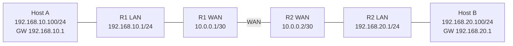
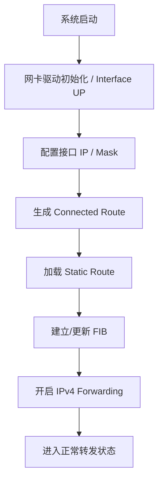
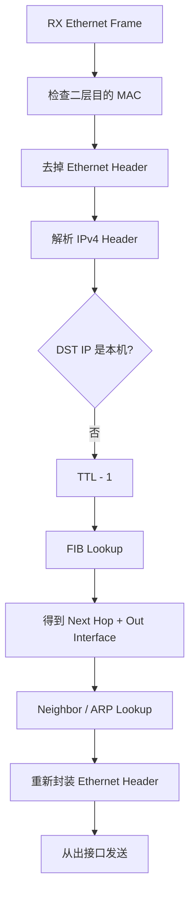
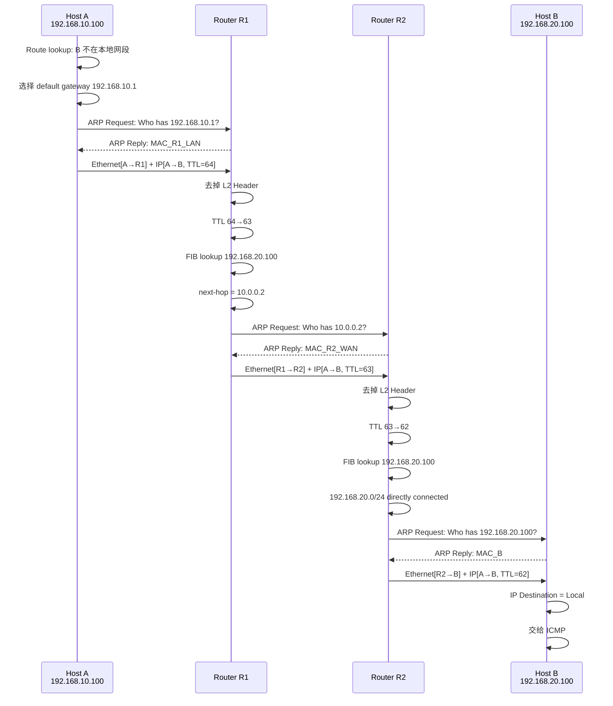
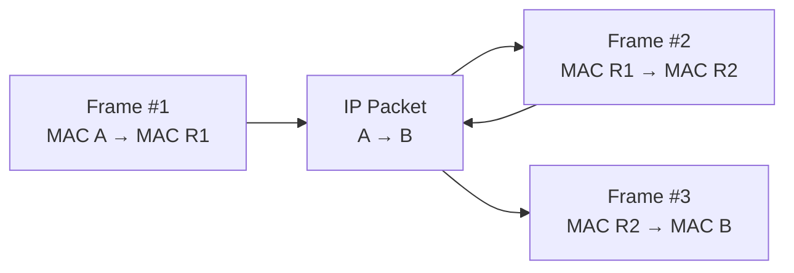
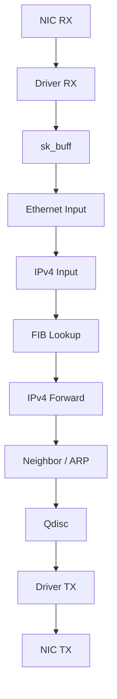

# RTing原理：从 LAN A 经 WAN 到 LAN B

> 面向对象：熟悉嵌入式、TCP/IP 基础、局域网广播域和 ARP，但对跨网段RTing过程不熟悉的工程师。  
> 核心问题：**Host A 发出的一个 IP 报文，如何经过RTing和 WAN，到达另一个局域网中的 Host B？**

---

## 1. 先建立唯一核心模型

先记住一句话：

> **IP 地址解决“最终要到哪台主机”，MAC 地址解决“这一跳先交给谁”。**

局域网内通信时，最终目标和下一跳通常是同一台主机，所以很容易把“IP 目标”和“MAC 目标”混在一起。

一旦跨RTing，这两个概念就必须分开。

例如 A 要访问 B：

```text
A: 192.168.10.100
B: 192.168.20.100
```

A 发送的数据在第一段 LAN 上实际上是：

```text
Ethernet:
    dst_mac = R1_LAN_MAC      ← 这一跳交给RTing R1

IPv4:
    dst_ip  = 192.168.20.100  ← 最终目标始终是 B
```

因此：

```text
MAC：逐跳变化
IP ：端到端基本不变
```

这就是RTing最核心的心智模型。

---

# 2. 实验拓扑：LAN A — WAN — LAN B

本文只研究纯RTing，不引入 NAT。



网络划分：

| 网络 | 地址段 | 作用 |
|---|---|---|
| LAN A | `192.168.10.0/24` | Host A 所在广播域 |
| WAN | `10.0.0.0/30` | R1 与 R2 之间的三层链路 |
| LAN B | `192.168.20.0/24` | Host B 所在广播域 |

主机配置：

```text
Host A
IP      192.168.10.100/24
Gateway 192.168.10.1

Host B
IP      192.168.20.100/24
Gateway 192.168.20.1
```

RTing接口：

```text
R1:
LAN = 192.168.10.1/24
WAN = 10.0.0.1/30

R2:
WAN = 10.0.0.2/30
LAN = 192.168.20.1/24
```

---

# 3. 为什么需要RTing

LAN A 和 LAN B 是两个不同广播域。

A 在 LAN A 中发送 ARP 广播：

```text
ff:ff:ff:ff:ff:ff
```

该广播只能存在于 LAN A。

RTing不会把普通二层广播继续转发到 LAN B。

所以：

```text
A 无法通过 ARP 直接找到 B 的 MAC。
```

这不是故障，而是 IP 网络设计本身。

如果目标不在本地网段，A 的正确行为不是找目标 B，而是找：

```text
Default Gateway
```

即：

```text
192.168.10.1
```

### 费曼式理解

把每个 LAN 想成一个封闭园区：

```text
LAN A = 园区 A
LAN B = 园区 B
Router = 园区出口
```

如果收件人在自己园区：

```text
直接找到对方房间。
```

如果收件人在其他园区：

```text
先把包交给园区出口。
```

你不需要知道远端园区里 B 的“房间门牌 MAC”，只需要知道本园区出口 R1 的 MAC。

---

# 4. RTing部署后，系统内部建立了什么

RTing的核心不是“两个网口”，而是：

```text
多个三层接口
+
RTing表
+
IP Forwarding
```

以 R1 为例。

接口配置完成后：

```text
eth0 = 192.168.10.1/24
eth1 = 10.0.0.1/30
```

内核会自动获得两个直连RTing：

```text
192.168.10.0/24 dev eth0
10.0.0.0/30     dev eth1
```

这种RTing称为：

```text
Connected Route
```

因为网络直接挂在本机接口上。

但 R1 此时仍然不知道：

```text
192.168.20.0/24
```

在哪里。

所以需要增加静态RTing：

```text
192.168.20.0/24 via 10.0.0.2
```

R2 同样需要：

```text
192.168.10.0/24 via 10.0.0.1
```

最终：

### R1 RTing表

```text
192.168.10.0/24  dev eth0
10.0.0.0/30      dev eth1
192.168.20.0/24  via 10.0.0.2 dev eth1
```

### R2 RTing表

```text
10.0.0.0/30      dev eth0
192.168.20.0/24  dev eth1
192.168.10.0/24  via 10.0.0.1 dev eth0
```

---

# 5. 一条RTing到底表达什么

看这一条：

```text
192.168.20.0/24 via 10.0.0.2 dev eth1
```

不要把它理解成复杂配置。

它只表达一句话：

> 如果目标 IP 属于 `192.168.20.0/24`，则把报文从 `eth1` 发出去，并先交给下一跳 `10.0.0.2`。

因此RTing的核心信息只有三个：

```text
Destination Prefix
Next Hop
Outgoing Interface
```

即：

```text
目标网络 → 下一跳 → 出接口
```

### 费曼式理解

RTing表就是一个“岔路口指示牌”：

```text
去 192.168.20.x
    ↓
先走 10.0.0.2
    ↓
从 eth1 出去
```

RTing并不需要提前知道整个网络的物理路径。

它只需要知道：

> **下一跳是谁。**

---

# 6. RIB、FIB、ARP/Neighbor Table 的关系

工程上建议区分三个表。

## 6.1 RIB：Routing Information Base

可以理解为“RTing知识库”。

来源可能包括：

```text
Connected Route
Static Route
OSPF
BGP
DHCP
其他RTing协议
```

## 6.2 FIB：Forwarding Information Base

FIB 是真正用于高速转发的数据结构。

可以近似理解为：

```text
RIB = 控制面的RTing知识
FIB = 数据面的快速查询表
```

收到 IP 报文后，真正进行转发决策的核心动作是：

```text
FIB Lookup(destination_ip)
```

## 6.3 ARP / Neighbor Table

RTing表解决：

```text
下一跳 IP 是谁？
```

ARP 表解决：

```text
下一跳 IP 对应什么 MAC？
```

例如 R1 已经通过RTing表知道：

```text
next_hop = 10.0.0.2
```

但如果 WAN 是 Ethernet，发送 Ethernet Frame 之前还必须知道：

```text
10.0.0.2 → R2_WAN_MAC
```

所以：

```text
Routing Table
    ↓
Next-Hop IP
    ↓
Neighbor/ARP Table
    ↓
Next-Hop MAC
```

---

# 7. RTing启动后的完整状态建立过程

以 R1 为例：



Linux 上对应的最小配置可以是：

```bash
# R1
ip addr add 192.168.10.1/24 dev eth0
ip addr add 10.0.0.1/30 dev eth1

ip link set eth0 up
ip link set eth1 up

ip route add 192.168.20.0/24 via 10.0.0.2

sysctl -w net.ipv4.ip_forward=1
```

R2：

```bash
ip addr add 10.0.0.2/30 dev eth0
ip addr add 192.168.20.1/24 dev eth1

ip link set eth0 up
ip link set eth1 up

ip route add 192.168.10.0/24 via 10.0.0.1

sysctl -w net.ipv4.ip_forward=1
```

---

# 8. 核心过程：A 向 B 发送一个完整 IP 报文

假设 A 执行：

```bash
ping 192.168.20.100
```

我们只分析第一个 ICMP Echo Request。

---

## 8.1 第一步：A 判断 B 是否在本地网段

A 已知：

```text
自己的 IP   = 192.168.10.100
自己的 Mask = 255.255.255.0
目标 IP     = 192.168.20.100
```

A 做RTing查询。

最直观地理解，就是比较网络号：

```text
192.168.10.100 & 255.255.255.0
= 192.168.10.0

192.168.20.100 & 255.255.255.0
= 192.168.20.0
```

结果不同。

因此：

```text
B 不属于本地链路。
```

A 不会去 ARP：

```text
Who has 192.168.20.100?
```

而是根据自己的RTing表：

```text
default via 192.168.10.1
```

选择默认网关 R1。

---

# 9. A 先解决第一跳：R1 的 MAC

如果 ARP Cache 中没有 R1：

A 发送：

```text
ARP Request
Who has 192.168.10.1?
Tell 192.168.10.100
```

二层目的地址：

```text
ff:ff:ff:ff:ff:ff
```

R1 回复：

```text
192.168.10.1 is at MAC_R1_LAN
```

于是 A 得到：

```text
192.168.10.1 → MAC_R1_LAN
```

---

# 10. A 构造第一跳 Ethernet Frame

A 生成 ICMP Echo Request，然后封装 IPv4：

```text
IPv4 Header
--------------------------------
SRC IP = 192.168.10.100
DST IP = 192.168.20.100
TTL    = 64
Proto  = ICMP
--------------------------------
ICMP Echo Request
```

注意：

```text
DST IP 仍然是 B
```

然后 A 在外面套 Ethernet：

```text
Ethernet Header
--------------------------------
SRC MAC = MAC_A
DST MAC = MAC_R1_LAN
Type    = IPv4
--------------------------------
IPv4 Packet
```

所以第一跳是：

```text
L2: A  → R1
L3: A  → B
```

这是理解RTing最关键的一步。

---

# 11. R1 收到报文后发生什么

R1 网卡发现：

```text
DST MAC = 自己
```

因此接收 Ethernet Frame。

内部逻辑可以抽象为：



R1 发现：

```text
DST IP = 192.168.20.100
```

并不是自己的 IP。

所以进入：

```text
Forwarding Path
```

---

# 12. R1 查询RTing表

R1 的 FIB 中有：

```text
192.168.20.0/24 via 10.0.0.2 dev eth1
```

目标：

```text
192.168.20.100
```

匹配：

```text
192.168.20.0/24
```

于是：

```text
next_hop = 10.0.0.2
out_if   = eth1
```

接下来RTing面对的已经不是：

```text
“B 的 MAC 是什么？”
```

而是：

```text
“下一跳 10.0.0.2 的 MAC 是什么？”
```

---

# 13. R1 通过 ARP 找到 R2

如果 Neighbor Table 中没有：

```text
10.0.0.2
```

则 R1 在 WAN 上发 ARP：

```text
Who has 10.0.0.2?
```

R2 回复：

```text
10.0.0.2 is at MAC_R2_WAN
```

R1 获得：

```text
10.0.0.2 → MAC_R2_WAN
```

---

# 14. R1 重新封装第二个 Ethernet Frame

这是RTing真正的本质动作。

R1 不会把 A 发来的 Ethernet Frame 原样传给 R2。

原来的二层头：

```text
SRC MAC = MAC_A
DST MAC = MAC_R1_LAN
```

已经结束使命。

R1 重新构造：

```text
SRC MAC = MAC_R1_WAN
DST MAC = MAC_R2_WAN
```

IPv4 部分仍然是：

```text
SRC IP = 192.168.10.100
DST IP = 192.168.20.100
```

但有一个重要变化：

```text
TTL: 64 → 63
```

IPv4 Header Checksum 也会随之更新。

于是第二跳：

```text
L2: R1 → R2
L3: A  → B
```

---

# 15. R2 收到报文

R2 收到后同样：

```text
去掉 Ethernet Header
    ↓
解析 IPv4 Header
    ↓
TTL 63 → 62
    ↓
FIB Lookup(192.168.20.100)
```

R2 RTing表：

```text
192.168.20.0/24 dev eth1
```

这是一条：

```text
Directly Connected Route
```

含义是：

> 目标主机就在 eth1 所连接的 LAN B 上，不需要再找第三台RTing。

因此：

```text
next-hop = 目标主机本身
```

即：

```text
192.168.20.100
```

---

# 16. R2 ARP Host B

如果 ARP Cache 没有 B：

R2 在 LAN B 广播：

```text
Who has 192.168.20.100?
```

B 回复：

```text
192.168.20.100 is at MAC_B
```

R2 获得：

```text
192.168.20.100 → MAC_B
```

然后构造第三个 Ethernet Frame：

```text
SRC MAC = MAC_R2_LAN
DST MAC = MAC_B
```

IPv4：

```text
SRC IP = 192.168.10.100
DST IP = 192.168.20.100
TTL    = 62
```

所以第三跳：

```text
L2: R2 → B
L3: A  → B
```

---

# 17. B 最终接收

B 网卡发现：

```text
DST MAC = MAC_B
```

接收帧。

IP 层发现：

```text
DST IP = 192.168.20.100
```

正是本机地址。

因此这次不再进行RTing转发，而是交给上层协议：

```text
IPv4
 ↓
ICMP
 ↓
Echo Request
```

至此 A → B 完成。

---

# 18. A → B 完整动态序列图



---

# 19. 三跳过程中，到底什么变、什么不变

假设纯RTing，无 NAT。

| 字段 | A→R1 | R1→R2 | R2→B |
|---|---|---|---|
| Src IP | A | A | A |
| Dst IP | B | B | B |
| Src MAC | A | R1-WAN | R2-LAN |
| Dst MAC | R1-LAN | R2-WAN | B |
| TTL | 64 | 63 | 62 |

核心规律：

```text
IP 地址：描述端到端通信
MAC 地址：描述当前链路的一跳通信
```

因此一个 IP Packet 跨越多个二层网络时，会经历：

```text
Frame #1
   ↓ 解封装
IP Packet
   ↓ 重新封装
Frame #2
   ↓ 解封装
IP Packet
   ↓ 重新封装
Frame #3
```

可以画成：



更准确地说，不是“同一个 Ethernet Frame 穿过了RTing”，而是：

> **同一个三层通信语义，被每一段链路重新封装。**

---

# 20. 为什么 A 不 ARP B

这是判断是否真正理解RTing的关键问题。

错误思路：

```text
我要给 192.168.20.100 发包
→ 我要先得到 B 的 MAC
```

正确思路：

```text
我要给 192.168.20.100 发包
    ↓
Route Lookup
    ↓
目标不在本地链路
    ↓
next-hop = 192.168.10.1
    ↓
ARP 的对象是 next-hop
```

所以真正统一的规则是：

> **ARP 的对象不是“最终 IP 目标”，而是“当前二层链路上的下一跳 IP”。**

如果目标就在本地网段：

```text
next-hop = destination
```

所以 ARP 目标主机。

如果目标在远端：

```text
next-hop = gateway
```

所以 ARP 网关。

这一条规则同时解释了 LAN 通信和RTing通信。

---

# 21. Longest Prefix Match：RTing表怎么选

假设RTing表里有：

```text
0.0.0.0/0         via R0
192.168.0.0/16    via R1
192.168.20.0/24   via R2
192.168.20.128/25 via R3
```

目标：

```text
192.168.20.130
```

四条RTing都可能匹配，但RTing选择：

```text
192.168.20.128/25
```

因为 `/25` 最具体。

这叫：

```text
Longest Prefix Match
```

费曼式理解：

```text
“中国”
“中国北京”
“中国北京市海淀区”
“中国北京市海淀区中关村”
```

地址越具体，优先级越高。

因此默认RTing：

```text
0.0.0.0/0
```

本质就是：

> 所有更具体规则都没命中时使用的兜底规则。

---

# 22. 回程路径为什么同样重要

A → B 能到，不代表 B → A 一定能回来。

B 收到 ICMP Echo Request 后，需要发送 Echo Reply：

```text
SRC IP = 192.168.20.100
DST IP = 192.168.10.100
```

B 判断 A 不在本地网段，因此发送给：

```text
Default Gateway = 192.168.20.1
```

R2 必须知道：

```text
192.168.10.0/24 via 10.0.0.1
```

否则请求能到 B，但回复回不去。

因此RTing通信必须建立：

```text
Forward Path
+
Return Path
```

工程调试中经常出现：

```text
A → B 正常
B → A 无RTing
```

最终表现就是应用层“超时”。

---

# 23. 第一次发包为什么比后续更复杂

第一次通信通常包含多个 ARP：

```text
A  ARP R1
R1 ARP R2
R2 ARP B
```

这些结果会进入 Neighbor Cache。

例如：

```text
A:
192.168.10.1 → MAC_R1

R1:
10.0.0.2 → MAC_R2

R2:
192.168.20.100 → MAC_B
```

所以第二个 IP Packet 通常变成：

```text
Route Lookup
→ Neighbor Cache Hit
→ 直接封装发送
```

这就是为什么抓包时经常看到：

```text
第一次 ping 前有 ARP
后面的 ping 没有 ARP
```

---

# 24. TTL 的作用

每经过一个三层RTing：

```text
TTL = TTL - 1
```

如果 TTL 变成 0，RTing丢弃报文，并通常返回：

```text
ICMP Time Exceeded
```

作用是防止RTing环路导致 IP Packet 永远在网络中转圈。

例如：

```text
R1 → R2 → R3 → R1 → R2 → ...
```

TTL 就相当于报文的“最大允许跳数”。

这也是 `traceroute` 能工作的基础之一。

---

# 25. RTing和交换机的本质区别

交换机主要回答：

```text
这个目标 MAC 应该从哪个端口出去？
```

典型查询对象：

```text
MAC Address Table / FDB
```

RTing主要回答：

```text
这个目标 IP 下一跳是谁，从哪个接口出去？
```

典型查询对象：

```text
FIB / Routing Table
```

因此：

```text
Switch:
DST MAC → Port

Router:
DST IP → Next Hop + Out Interface
```

---

# 26. 从嵌入式工程师视角理解 Linux RTing转发

在 Linux Router 中，可把数据路径简化为：

```text
NIC RX
 ↓
Driver
 ↓
sk_buff
 ↓
Ethernet / L2
 ↓
IPv4
 ↓
FIB Lookup
 ↓
Forwarding
 ↓
Neighbor Subsystem
 ↓
Qdisc
 ↓
Driver
 ↓
NIC TX
```

对应关系：



你可以把它和驱动中的“描述符 → 协议栈 → 查表 → 重新发送”联系起来理解。

RTing不是神秘设备，本质就是：

```text
RX packet
→ Parse IP
→ Lookup FIB
→ Resolve next-hop L2 address
→ TX packet
```

---

# 27. WAN 为什么也能工作

本文 WAN 使用：

```text
10.0.0.1/30 ↔ 10.0.0.2/30
```

并假设底层是 Ethernet，所以存在 ARP。

但实际 WAN 可能使用：

```text
Ethernet
VLAN
PPP
PPPoE
MPLS
运营商专线
其他链路技术
```

不同 WAN 技术会改变二层封装方式。

但RTing核心完全不变：

```text
收到 IP Packet
    ↓
查 FIB
    ↓
确定 Next Hop / Out Interface
    ↓
使用该链路对应的 L2 技术发送
```

所以：

> **RTing属于三层逻辑；Ethernet、PPP 等只是承载这一跳 IP Packet 的链路技术。**

---

# 28. 用一句算法描述整个RTing过程

主机和RTing都可以抽象成下面的逻辑：

```c
route = fib_lookup(dst_ip);

if (route.is_local) {
    deliver_to_local_stack();
} else {
    next_hop = route.next_hop;
    out_if   = route.out_if;

    l2_addr = neighbor_lookup(next_hop);

    if (!l2_addr)
        resolve_neighbor(next_hop);

    encapsulate_l2(out_if, l2_addr);
    transmit();
}
```

区别只是：

```text
普通 Host
通常只有：
本地RTing + 默认RTing

Router
通常拥有：
大量目标前缀 → Next Hop 的映射
并开启 IP Forwarding
```

---

# 29. 最终心智模型

理解RTing时，不要想象：

```text
A ---------------------------------> B
```

而应该同时看到两个视角。

## 三层视角

```text
             IP Packet

SRC = Host A
DST = Host B

A ---------------- R1 ---------------- R2 ---------------- B
```

这是：

```text
End-to-End
```

## 二层视角

```text
LAN A                WAN                 LAN B

A → R1              R1 → R2              R2 → B

Frame #1             Frame #2             Frame #3
```

这是：

```text
Hop-by-Hop
```

最终记忆成五句话：

```text
1. IP 地址描述最终目的地。

2. RTing表根据目标 IP 决定下一跳和出接口。

3. ARP/Neighbor 根据下一跳 IP 得到当前链路的二层地址。

4. 每经过一个RTing，旧二层帧结束，重新构造新的二层帧。

5. 在纯RTing场景中，源/目标 IP 端到端保持不变，而 MAC 逐跳改变、TTL 逐跳递减。
```

如果这五句话能从头解释一遍，LAN A → WAN → LAN B 的基本RTing原理就已经建立完整。

---

# 30. 自测：确认是否真正理解

不看答案，尝试回答：

1. A 为什么不能通过 ARP 获得 B 的 MAC？
2. A 发给远端 B 时，Ethernet 的目标 MAC 为什么是网关？
3. IP Header 中的目标 IP 为什么仍然是 B？
4. R1 收到 A 的报文后，根据哪个字段查RTing表？
5. `via 10.0.0.2` 中的 `10.0.0.2` 表示什么？
6. R1 为什么 ARP 10.0.0.2，而不是 ARP 192.168.20.100？
7. Router 每一跳一定会改变哪些字段？
8. 为什么 A→B 有RTing仍然可能 ping 不通？
9. Connected Route 和 Static Route 有什么区别？
10. Routing Table 和 ARP Table 分别解决什么问题？

如果能独立解释这 10 个问题，你已经掌握RTing最重要的基础心智模型。
