# FreeRTOS RTOS 内核完整组件图

  

下面以 **FreeRTOS** 为对象，使用 Mermaid 绘制 RTOS 内核的核心组件与数据结构关系图。图中重点体现：

  

- 调度器与上下文切换路径

- `TCB`（任务控制块）的关键字段

- 不同状态任务所在的链表/列表

- 信号量、互斥锁、队列、事件组等对象及其等待任务链表

- 超时阻塞、优先级继承、中断解阻塞、软件定时器等设计细节

```mermaid

flowchart TB

    subgraph CORE["内核控制平面"]

        SCH["调度器 Scheduler<br/>vTaskSwitchContext()<br/>根据 uxTopReadyPriority 选择可运行任务"]

        CUR["pxCurrentTCB<br/>当前运行任务"]

        TICK["SysTick / Tick 中断<br/>xTickCount++<br/>推进超时与时间片"]

        PEND["PendSV<br/>执行上下文保存/恢复"]

        IDLE["Idle Task<br/>空闲态运行<br/>清理待删除任务"]

        YP["xYieldPending<br/>需要在调度点切换"]

    end

  

    subgraph TASK["任务实体与 TCB"]

        TCB["TCB / tskTaskControlBlock<br/>pxTopOfStack<br/>uxPriority / uxBasePriority<br/>xStateListItem<br/>xEventListItem<br/>uxMutexesHeld<br/>ulNotifiedValue[] / ucNotifyState[]<br/>pxStack / pxEndOfStack"]

        STK["Task Stack<br/>任务上下文与局部变量"]

        LI["ListItem / MiniListItem<br/>任务进入状态表/事件表的挂接节点"]

    end

  

    subgraph READY["就绪态列表（按优先级分桶）"]

        R0["pxReadyTasksLists[0]<br/>最低优先级就绪链表"]

        R1["pxReadyTasksLists[1]"]

        RX["..."]

        RN["pxReadyTasksLists[n]<br/>n = configMAX_PRIORITIES - 1"]

        TOP["uxTopReadyPriority<br/>当前最高非空就绪优先级"]

    end

  

    subgraph BLOCK["阻塞/挂起/过渡列表"]

        D1["xDelayedTaskList1<br/>按唤醒 Tick 有序存放超时任务"]

        D2["xDelayedTaskList2<br/>Tick 回绕后的备用延时表"]

        SUS["xSuspendedTaskList<br/>被显式挂起的任务"]

        PREADY["xPendingReadyList<br/>ISR 解阻塞后暂存<br/>等待在调度点并回就绪表"]

        TERM["xTasksWaitingTermination<br/>等待 Idle Task 回收"]

    end

  

    subgraph IPC["同步与通信对象"]

        QUE["Queue / StreamBuffer / MessageBuffer<br/>数据容器 + 等待发送/接收任务链表"]

        QRX["xTasksWaitingToReceive<br/>等待数据/资源可用的任务"]

        QTX["xTasksWaitingToSend<br/>等待空间可用的任务"]

  

        SEM["Semaphore<br/>二值/计数信号量"]

        SEMW["等待信号量的任务链表<br/>任务通过 xEventListItem 挂入"]

  

        MUT["Mutex / Recursive Mutex<br/>具备所有权与优先级继承"]

        MUTW["等待互斥锁的任务链表<br/>block task list"]

  

        EVG["Event Group<br/>按位事件同步"]

        EVGW["等待事件位满足条件的任务链表"]

  

        NOTI["Task Notification<br/>每个 TCB 内建的轻量同步机制"]

    end

  

    subgraph TIMER["软件定时器子系统"]

        TMRD["Timer Service Task<br/>守护任务 / Daemon"]

        TQ["Timer Command Queue<br/>接收启动/停止/重装命令"]

        TA1["xActiveTimerList1<br/>活动定时器链表"]

        TA2["xActiveTimerList2<br/>Tick 回绕备用链表"]

    end

  

    subgraph ISR["中断与异步唤醒路径"]

        ISRAPI["FromISR API<br/>xQueueSendFromISR()<br/>xSemaphoreGiveFromISR()<br/>vTaskNotifyGiveFromISR()"]

        PYIELD["portYIELD_FROM_ISR()<br/>请求延后调度"]

    end

  

    NOTE1["说明 A<br/>一个阻塞任务通常会同时出现在两类结构中：<br/>1. xStateListItem 进入延时表/挂起表<br/>2. xEventListItem 进入对象等待表<br/>事件到来或超时后再移回就绪表"]

    NOTE2["说明 B<br/>就绪表采用多优先级分桶结构。<br/>调度器总是从最高非空桶取任务；同优先级任务可时间片轮转。"]

    NOTE3["说明 C<br/>Mutex 与 Semaphore 的关键区别：<br/>Mutex 记录持有者，并在高优先级任务阻塞时触发优先级继承；<br/>释放互斥锁后再恢复持有者优先级。"]

    NOTE4["说明 D<br/>Tick 递增会扫描延时表头部的到期任务；<br/>中断中解阻塞的任务通常先进入 xPendingReadyList，<br/>在安全的调度点统一并回 Ready List。"]

  

    CUR --> TCB

    TCB --> STK

    TCB --> LI

  

    SCH --> TOP

    R0 --> SCH

    R1 --> SCH

    RX --> SCH

    RN --> SCH

    TOP --> SCH

    SCH -->|选择最高优先级就绪任务| CUR

    SCH --> PEND

    PEND --> CUR

    YP --> SCH

  

    TICK --> D1

    TICK --> D2

    TICK --> SCH

    TICK --> TA1

    TICK --> TA2

  

    TCB -->|就绪态时以 xStateListItem 挂入| R0

    TCB -->|不同优先级进入不同桶| RN

    TCB -->|延时/超时阻塞| D1

    TCB -->|Tick 回绕场景| D2

    TCB -->|显式挂起| SUS

    TCB -->|删除后等待回收| TERM

    TERM --> IDLE

  

    QUE --> QRX

    QUE --> QTX

    SEM --> SEMW

    MUT --> MUTW

    EVG --> EVGW

    TCB -->|等待队列接收/对象可读| QRX

    TCB -->|等待队列可写/空间可用| QTX

    TCB -->|等待信号量| SEMW

    TCB -->|等待互斥锁| MUTW

    TCB -->|等待事件位| EVGW

    TCB -->|任务通知状态保存在 TCB 内| NOTI

  

    SEM -->|Give / 超时结束| PREADY

    MUT -->|Unlock / 继承恢复后| PREADY

    QUE -->|收发条件满足| PREADY

    EVG -->|事件位满足| PREADY

    NOTI -->|通知到达| PREADY

    PREADY -->|并回对应优先级 Ready List| R1

  

    ISRAPI --> PYIELD

    ISRAPI --> PREADY

    PYIELD --> YP

  

    TMRD --> TQ

    TMRD --> TA1

    TMRD --> TA2

    TQ --> TMRD

    TA1 -->|到期后在守护任务上下文执行回调| TMRD

    TA2 -->|Tick 回绕时切换活动表| TMRD

  

    NOTE1 -.-> TCB

    NOTE1 -.-> D1

    NOTE1 -.-> SEMW

    NOTE2 -.-> READY

    NOTE2 -.-> SCH

    NOTE3 -.-> MUT

    NOTE3 -.-> MUTW

    NOTE4 -.-> TICK

    NOTE4 -.-> PREADY

  

    classDef core fill:#D6EAF8,stroke:#2874A6,color:#154360,stroke-width:1.5px;

    classDef task fill:#D5F5E3,stroke:#1E8449,color:#145A32,stroke-width:1.5px;

    classDef list fill:#FCF3CF,stroke:#B7950B,color:#7D6608,stroke-width:1.5px;

    classDef sync fill:#FADBD8,stroke:#C0392B,color:#7B241C,stroke-width:1.5px;

    classDef timer fill:#E8DAEF,stroke:#8E44AD,color:#5B2C6F,stroke-width:1.5px;

    classDef note fill:#F4F6F7,stroke:#566573,color:#273746,stroke-dasharray: 5 3;

  

    class SCH,CUR,TICK,PEND,IDLE,YP core;

    class TCB,STK,LI task;

    class R0,R1,RX,RN,TOP,D1,D2,SUS,PREADY,TERM list;

    class QUE,QRX,QTX,SEM,SEMW,MUT,MUTW,EVG,EVGW,NOTI,ISRAPI,PYIELD sync;

    class TMRD,TQ,TA1,TA2 timer;

    class NOTE1,NOTE2,NOTE3,NOTE4 note;

```

  

  

## 设计细节说明

  

1. **TCB 是调度与阻塞管理的核心对象**

   `TCB` 不仅保存栈顶、优先级、通知值等运行态信息，还通过 `xStateListItem` 和 `xEventListItem` 同时参与“状态管理”和“事件等待管理”。

  

2. **Ready List 是 FreeRTOS 调度性能的关键**

   `pxReadyTasksLists[]` 以优先级为索引拆成多个链表，调度器结合 `uxTopReadyPriority` 可以快速定位最高优先级就绪任务，降低调度开销。

  

3. **阻塞等待通常是“双重挂接”**

   任务等待队列/信号量/互斥锁/事件组且带超时时，通常会：

   - 进入对象的等待链表

   - 同时进入延时表

   这样既能响应事件唤醒，也能在超时后被 Tick 机制移出阻塞态。

  

4. **Mutex 与 Semaphore 的内核语义不同**

   二值/计数信号量主要描述“资源可用计数”，而 `Mutex` 还要记录“谁持有锁”，并在高优先级任务阻塞时进行 **优先级继承**，以缓解优先级反转。

  

5. **ISR 中通常不直接做完整调度**

   `FromISR` API 更倾向于先把被唤醒任务放入 `xPendingReadyList`，再通过 `portYIELD_FROM_ISR()` 请求在安全点完成切换，从而降低中断处理复杂度。

  

6. **软件定时器并不直接在 Tick 中断里执行用户回调**

   Tick 只负责推进定时器列表；真正的回调通常由 `Timer Service Task` 在任务上下文执行，以避免在中断上下文中执行复杂逻辑。

  

## 可直接用于讲解的理解框架

  

- **运行态**：`pxCurrentTCB`

- **可运行但未运行**：`pxReadyTasksLists[]`

- **等待事件/超时**：对象等待表 + `xDelayedTaskList`

- **显式暂停**：`xSuspendedTaskList`

- **中断刚刚唤醒**：`xPendingReadyList`

- **已删除待回收**：`xTasksWaitingTermination`

  

这张图可以作为分析 FreeRTOS 内核调度、任务状态迁移、同步原语实现、优先级继承与中断解阻塞路径的总览图。

角色：你是 RTOS 内核设计专家。

  

需求：以 FreeRTOS 为对象，用 Mermaid 图方式绘制 RTOS 内核的完整组件图。图中必须能够体现调度器、任务 TCB、存储不同状态任务的列表（如就绪表/多优先级、等待表、信号量及等待其上的任务列表、Mutex 及 block 的任务表等）。

  

要求：Mermaid 图要加上必要说明，体现设计细节；不同组件对象要用不同颜色表示。