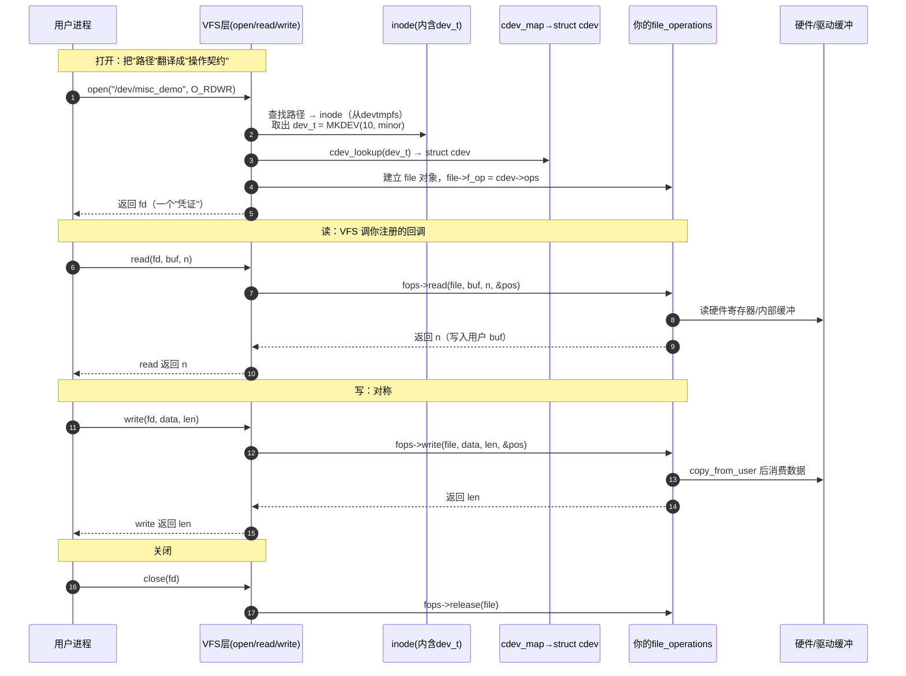
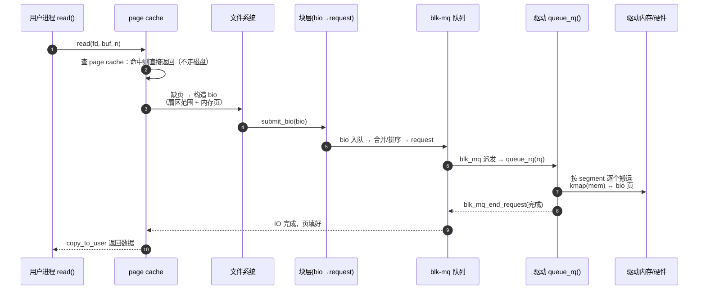
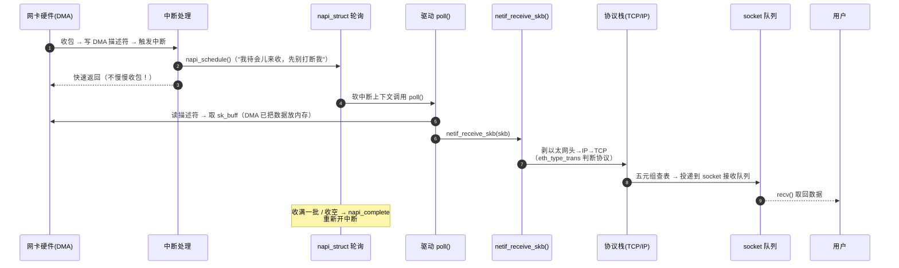
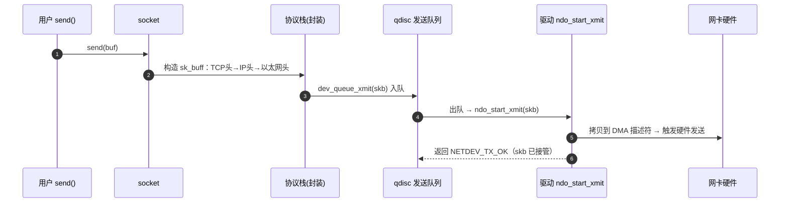

---
tags:
  - OS
  - Linux
  - 用户态
  - char
  - block
  - net
status: growing
related:
  - "OS/Linux/LDM"
---

# probe 之后的世界：用户态访问三分类（Char / Block / Net）

> **一句话**：LDM 把设备与驱动配对（match→probe）之后，probe 的业务场景只有两大类——**给用户态开"门"** 和 **接入内核子系统**。而给用户态开门，VFS 提供三种"文件语义"：**字符（char）／块（block）／网络（net）**。本笔记回答三个问题：**为什么是这三种？它们各自是什么、怎么组成？最小可执行 demo 怎么跑？**
>
> **配套 demo 代码**：`OS/Linux/3-practice/demo-char-block-net/`（三个完整工程：模块源码 + Makefile + 用户态测试/脚本）。
> **前置**：[[OS/Linux/LDM|LDM 金字塔教程]]（本文是它"第 5 层 probe 之后"的展开）。

---

## 目录

1. [先回答你的两个判断](#1-先回答你的两个判断)
2. [为什么是 char/block/net 三种？（第一性原理：三种"数据语义"）](#2-为什么是-charblocknet-三种第一性原理三种数据语义)
3. [Char 字符设备：门牌号 + 操作契约](#3-char-字符设备门牌号--操作契约)
4. [Block 块设备：仓库货架 + 搬运调度](#4-block-块设备仓库货架--搬运调度)
5. [Net 网络设备：邮政快递 + 邮局分拣](#5-net-网络设备邮政快递--邮局分拣)
6. [三分类对比总表 + 第一性原理归纳](#6-三分类对比总表--第一性原理归纳)
7. [附录：资料与源码索引](#7-附录资料与源码索引)

---

## 1. 先回答你的两个判断

### 判断一："match 后就是 user-space 访问 + 子系统集成"——✅ 对，但要精确化

probe 的业务场景不是一个二维选择，而是**三步**：

```
probe(dev) 被调用
 ├─ ① 拿资源/初始化硬件：ioremap、request_irq、clk、DMA 通道
 ├─ ② 接入"内核子系统"（可选）：net 栈 / watchdog / input / RTC / ALSA / DRM / gpiolib...
 └─ ③ 给用户态开"门"（可选）：char / block / net / sysfs / debugfs / procfs
```

关键认知：**②和③不是互斥的，而且 ② 的子系统最终也常通过 ③ 暴露给用户态**：

| 子系统集成（②） | 它的用户态门（③） |
|---|---|
| network 协议栈 | `socket()`（网络文件系统，本质是 net 类） |
| watchdog 框架 | `/dev/watchdog`（char） |
| input 框架 | `/dev/input/eventX`（char） |
| RTC 框架 | `/dev/rtc0`（char） |
| block 层 | `/dev/sda` + 文件系统（block） |

> 🧠 **费曼理解**：probe 的终极职责 = **把一块"裸硬件"变成内核世界里"可被消费的对象"**。消费方式只有两种：内核内部消费（子系统）或用户态消费（VFS 门）。你的判断是对的，只是别忘了"子系统集成"这条线最后也要开一扇门。

### 判断二："用户态访问 = char/block/net 三类"——✅ 对，这是 LDD3 的经典三分法

这是《Linux Device Drivers, 3rd Edition》整本书的组织方式（第 3 章 char、第 16-18 章 block、第 17 章 net），也是内核世界的标准心智模型。需要补的精确性：

- **char 是最大的"筐"**：串口、GPIO、framebuffer、misc、tty、input 都是 char 设备（只是它们内部再分小类）；
- **net 的用户态门是 socket**，不是普通文件读写——它走 `socket()` 系列系统调用，而不是 `open/read/write`（虽然 VFS 把 socket 也当成一种文件，见 `socketfs`）；
- **还有"第四类"虚拟文件系统**（procfs/sysfs/debugfs）——但它们不是"硬件设备访问"，是"内核状态访问"，所以不计入三分类。

---

## 2. 为什么是 char/block/net 三种？（第一性原理：三种"数据语义"）

### 2.1 费曼类比三连

| 类型 | 类比 | 数据特征 |
|---|---|---|
| **Char** | 🚰 **自来水管道** | 连续**字节流**：一个字节一个字节流过去，顺序访问，没有"第几段"的概念，随开随关 |
| **Block** | 🏬 **仓库货架** | 定长**块/扇区**：按"第几排第几格"（扇区号）随机存取，搬运工（调度器）决定顺序 |
| **Net** | 📮 **邮政快递** | **报文/数据包**：包裹异步到达，内容自包含（有收件地址），需要邮局（协议栈）分拣 |

### 2.2 为什么正好是这三种？（第一性原理推导）

因为**硬件输出数据的"形态"只有这三种基本契约**：

```
硬件的数据形态
 ├─ 流式/顺序/无结构  ──► char   （串口、传感器、触摸屏、音频）
 ├─ 随机/定长/可寻址  ──► block  （磁盘、SSD、eMMC、NAND）
 └─ 报文/异步/自描述  ──► net    （网卡、无线、CAN 也是报文但走专用协议）
```

而 VFS（虚拟文件系统）作为"所有 IO 的总入口"，为这三种形态提供了**三种文件语义**：

| 语义 | VFS 入口 | 内核路径 |
|---|---|---|
| 字节流文件 | `open/read/write/ioctl` | VFS → inode(dev_t) → cdev → `file_operations` |
| 块文件 | `open/read/write` + `mmap` | VFS → page cache → bio → block layer → gendisk → 驱动 |
| 报文文件 | `socket/recv/send` | socketfs → 协议栈 → `sk_buff` → net_device → 驱动 |

> **软件逻辑概念 1【数据语义驱动架构】**: 操作系统不是按"硬件类型"设计 IO 子系统，而是按**数据语义**设计。三种语义 → 三条完全不同的内核路径（缓存策略、调度、并发模型都不同）。这就是为什么必须分三类而不是一个"设备文件"通吃。

### 2.3 一句话记住

> **char = 流，block = 块，net = 包。** 记住这三个字，下面所有组成、序列图、demo 都是它们的展开。

---

## 3. Char 字符设备：门牌号 + 操作契约

### 3.1 是什么（费曼）

想象一栋楼（内核）里有一间办公室（设备）。用户态想访问它，需要两样东西：

1. **门牌号**：`dev_t`（主设备号 = 哪栋楼的哪类房间；次设备号 = 第几间）；
2. **开门规则**：`struct file_operations`（怎么开门/递东西：open/read/write/ioctl…）。

VFS 就是"前台"：你报门牌号（路径 `/dev/xxx`），前台查登记表（cdev_map）找到房间（cdev），按规则办事（fops）。

### 3.2 为什么是"字符"？

因为这类硬件的数据本质是**顺序字节流**：没有扇区、没有报文头，读写就是"往管道里灌水/放水"。read 返回多少是驱动说了算（可能小于你请求的长度——管道一次只能给你这么多）。

### 3.3 组成（四个零件）

| 零件 | 结构体/概念 | 作用 | 费曼 |
|---|---|---|---|
| 设备号 | `dev_t`（`MAJOR()/MINOR()`） | 全局唯一标识 | 门牌号 |
| 字符设备对象 | `struct cdev` | 内核里代表"这个字符设备" | 房间的登记卡 |
| 操作契约 | `struct file_operations` | open/read/write/release/ioctl 回调 | 开门规则 |
| 注册方式 | 三种 | 把 cdev 挂进内核 | 在房产局登记 |

**三种注册方式对比**：

| 方式 | API | 适用 | 说明 |
|---|---|---|---|
| 老式 | `register_chrdev(major, name, fops)` | 已废弃 | 内部就是 cdev，但不够灵活 |
| 标准 | `cdev_add()` | 通用 | 可多个次设备共享一个主设备 |
| **杂项** | `misc_register()` | **最小 demo 首选** | 动态分配主号(10)，`/dev/<name>` 自动创建，卸载即清理 |

> `misc_register` 之所以是"最小可执行 demo"首选：它封装了 cdev + devt + devtmpfs 自动建 `/dev` 节点三件事，你只需要写 fops。

### 3.4 完整读写序列图（为什么 read/write 会"自动到"你的驱动）



> **软件逻辑概念 2【回调即契约】**: 驱动从不"主动被调用"——它只**注册回调**。VFS 在用户进程发起系统调用时才来调你。这就是"控制反转"在设备访问层的体现（与 LDM 的 match/probe 同一哲学）。

### 3.5 最小可执行 demo（misc_demo）

完整工程在 `demo-char-block-net/char/`，核心只有 30 行：

```c
static ssize_t demo_read(struct file *f, char __user *buf, size_t len, loff_t *off)
{
    return simple_read_from_buffer(buf, len, off, demo_buf, strlen(demo_buf));
}
static ssize_t demo_write(struct file *f, const char __user *buf, size_t len, loff_t *off)
{
    if (len >= sizeof(demo_buf)) len = sizeof(demo_buf) - 1;
    if (copy_from_user(demo_buf, buf, len)) return -EFAULT;
    demo_buf[len] = '\0';
    return len;
}
static const struct file_operations demo_fops = {
    .owner = THIS_MODULE, .read = demo_read, .write = demo_write,
};
static struct miscdevice demo_misc = {
    .minor = MISC_DYNAMIC_MINOR, .name = "misc_demo", .fops = &demo_fops,
};
module_init(demo_init); module_exit(demo_exit);   // 内部是 misc_register/unregister
```

**执行步骤**（在装有内核头文件的 Linux 上）：

```sh
make                      # 编译出 misc_demo.ko
sudo insmod misc_demo.ko
ls -l /dev/misc_demo      # ★ devtmpfs 自动创建（misc 的福利）
sudo chmod 666 /dev/misc_demo
./test_misc               # 用户态测试：读→写→读
sudo rmmod misc_demo
```

**讲解**：
- `simple_read_from_buffer`：内核帮你做 `copy_to_user` + 偏移管理（教学用完美）；
- `copy_from_user`：把用户态缓冲拷进内核（**必须**用这个，不能直接 memcpy 用户指针——防恶意指针）；
- 用户态测试程序里你会看到"**读到的就是你刚写的**"——这就是 char 设备的全部本质：一个由驱动掌控的字节流。

---

## 4. Block 块设备：仓库货架 + 搬运调度

### 4.1 是什么（费曼）

把内存想象成**仓库**，磁盘就是货架：每一格是**扇区**（通常 512B 或 4K），你按"第几排第几格"（扇区号）存取。和 char 最大的不同：**你不能只拿半个扇区**——数据以块为单位流动，所以需要**搬运调度器**（IO 调度/合并）来提高效率。

### 4.2 为什么（第一性原理：磁盘的物理特性）

| 物理特性 | 后果 | 内核对策 |
|---|---|---|
| 扇区寻址、随机访问慢 | 不能像 char 一样"流式" | **page cache**（读过的块缓存住） |
| 顺序读快、随机读慢 | 乱序请求会"狂甩磁头" | **调度/合并**：相邻扇区请求合并成一个 |
| 一次 IO 开销大 | 小请求不划算 | **bio 批量**：一个请求携带多个段 |
| 宕机丢数据 | 写操作必须有序 | 屏障/刷盘（FLUSH/FUA） |

> **软件逻辑概念 3【缓存 + 调度 = 块的灵魂】**: block 层存在的全部意义就是"**把物理世界的慢随机访问，伪装成逻辑世界的快顺序访问**"。char 不需要这套，net 用的是另一套（NAPI 轮询）。

### 4.3 组成（从顶到底的栈）

```
用户态 read()/write()
   │
   ▼
VFS + page cache          ← 缓存层（读命中直接返回，不打扰磁盘）
   │
   ▼
文件系统 (ext4/xfs...)    ← 把"文件字节偏移"翻译成"设备扇区"
   │
   ▼
块层：bio                 ← 描述"一段扇区范围的 IO 请求"（数据在内存哪些页）
   │
   ▼
blk-mq：request_queue     ← 多队列调度，合并/排序，派发给硬件队列
   │
   ▼
驱动 queue_rq()           ← 你的代码：把 bio 的数据搬到/搬出硬件
   │
   ▼
硬件（磁盘/DMA）
```

| 零件 | 作用 | 费曼 |
|---|---|---|
| `struct gendisk` | 一个"整块磁盘"对象（含容量、分区） | 仓库的"总货架登记" |
| `struct request_queue` / blk-mq | IO 调度队列 | 搬运工排班表 |
| `struct bio` | 一次 IO 的"段列表"（内存页 + 扇区） | 一张取货单 |
| `struct request` | 一个可执行的 IO 单元（可由多个 bio 合并） | 一个搬运任务 |
| `block_device_operations` | 极少回调（open/release/ioctl…），**没有 read/write** | 仓库管理员 |

> 🧠 **关键认知**：块驱动**没有 read/write 回调**！数据搬运发生在 `queue_rq()`（blk-mq）里——上层把"取货单"（request/bio）派给驱动，驱动照单搬货。这就是"调度器驱动"模型：**驱动是搬运工，不是接待员**。

### 4.4 完整读序列图（read() 一路下钻到驱动）



### 4.5 最小可执行 demo（ramblk：4MB 内存"磁盘"）

完整工程在 `demo-char-block-net/block/`，核心思想：**内存数组当磁盘**，blk-mq 把读写请求搬运到数组里。

```c
static char *ram_data;   // "磁盘"本体：4MB 内存

static blk_status_t ramblk_queue_rq(struct blk_mq_hw_ctx *hctx,
                                    const struct blk_mq_queue_data *bd)
{
    struct request *rq = bd->rq;
    struct bio_vec bvec;
    struct req_iterator iter;
    loff_t pos;

    blk_mq_start_request(rq);
    pos = blk_rq_pos(rq) * RAMBLK_SECTOR_SIZE;      // 扇区 → 字节偏移
    rq_for_each_segment(bvec, rq, iter) {           // 遍历请求的每个内存段
        void *kaddr = kmap_local_page(bvec.bv_page) + bvec.bv_offset;
        if (rq_data_dir(rq) == READ)                // 读：磁盘→内存
            memcpy(kaddr, ram_data + pos, bvec.bv_len);
        else                                        // 写：内存→磁盘
            memcpy(ram_data + pos, kaddr, bvec.bv_len);
        kunmap_local(kaddr);
        pos += bvec.bv_len;
    }
    blk_mq_end_request(rq, BLK_STS_OK);             // 同步完成（简单驱动）
    return BLK_STS_OK;
}
```

**执行步骤**：

```sh
make
sudo insmod ramblk.ko
lsblk                 # 出现 ramblk (4M)
sudo mkfs.ext4 /dev/ramblk
sudo mount /dev/ramblk /mnt
echo hello > /mnt/f   # ★ 一个真正的文件系统跑在"你写的驱动"上
sudo umount /mnt
sudo rmmod ramblk
```

**讲解**：
- 上面 `mkfs + mount` 能成功 = 你的驱动**通过了内核最严苛的 IO 压力测试**（文件系统会发几百个随机/顺序请求，blk-mq 合并、FLUSH、屏障全走一遍）；
- `rq_for_each_segment`：驱动不直接碰 bio，而是遍历"请求的段"——这是现代块驱动的标准写法；
- 对比 char：**这里没有任何 read/write 回调**，一切靠 `queue_rq` 被动搬货。

---

## 5. Net 网络设备：邮政快递 + 邮局分拣

### 5.1 是什么（费曼）

网卡 = 一座**邮局**。用户态 `send()` = 寄包裹：包里有收件地址（IP/MAC），邮局（协议栈）负责分拣、路由；`recv()` = 收包裹：邮局把到达的包裹按地址投递到对应的"信箱"（socket）。包裹（`sk_buff`）**自包含**——不像 char 需要顺序，不像 block 需要扇区号，每个包独立。

### 5.2 为什么（第一性原理：异步 + 自描述）

| 网络特性 | 后果 | 内核对策 |
|---|---|---|
| 报文**异步到达**（不知道何时来） | 不能像 char 一样"随叫随到" | 收包中断 + **NAPI 轮询** |
| 每个包**自包含**（有协议头） | 内核要层层剥头 | 协议栈分层（L2→L3→L4） |
| 多路复用（一个网卡给很多应用用） | 包要投递到"对的 socket" | 五元组查表 |
| 突发流量大 | 中断风暴 | NAPI 收包合并、`gro` |

> **软件逻辑概念 4【中断转轮询（NAPI）】**: 网卡中断一进来，驱动不立刻在中断上下文慢慢收包，而是"登记一下（napi_schedule）→ 软中断里轮询收满一批 → 再开中断"。把"每个包一个中断"变成"一批包一次中断"。这是网络高性能的第一关键。

### 5.3 组成

```
用户态 socket()  ↔  VFS 的 socketfs
   │
   ▼
协议栈：TCP/UDP（L4）→ IP（L3）→ 邻居/ARP（L2.5）→ 链路层
   │
   ▼
net_device（struct net_device + net_device_ops）
   │  ndo_open / ndo_stop / ndo_start_xmit
   ▼
硬件（DMA 描述符环 / 寄存器）
```

| 零件 | 作用 | 费曼 |
|---|---|---|
| `struct net_device` | 一个网卡对象（名字、MAC、状态） | 邮局牌照 |
| `struct net_device_ops` | open/stop/start_xmit 回调 | 邮局营业规则 |
| `struct sk_buff` | 一个数据包（含协议头指针、数据、len） | 一个包裹 |
| NAPI（`napi_struct`） | 收包轮询机制 | 邮局的分拣流水线 |
| `netdev_priv()` | 驱动私有数据（挂在 net_device 后） | 邮局自己的仓库 |

### 5.4 两条序列图

**收包（NAPI 轮询）**：



**发包**：



### 5.5 最小可执行 demo（vnd0：会"自己回信"的虚拟网卡）

完整工程在 `demo-char-block-net/net/`。核心思路：**发包时把包"回环"成收包**（像 loopback 一样），这样你 ping 自己就能看到完整的"发→收"路径：

```c
static netdev_tx_t vnd_start_xmit(struct sk_buff *skb, struct net_device *dev)
{
    skb->protocol = eth_type_trans(skb, dev);   // 剥/填以太网头，交给收包路径
    netif_rx(skb);                              // ★ 把包重新投进协议栈（模拟收到）
    dev->stats.tx_packets++;                    // 统计
    dev->stats.rx_packets++;
    return NETDEV_TX_OK;                        // 表示"驱动已接管 skb"
}
```

**执行步骤**：

```sh
make
sudo insmod vnd0.ko
sudo ip link set vnd0 up
sudo ip addr add 10.0.0.1/24 dev vnd0
ping 10.0.0.1            # ★ 包发出 → 回环 → 收到 → ping 通
ip -s link               # 看 tx/rx 统计增长
sudo rmmod vnd0
```

**讲解**：
- `ndo_start_xmit` 是网卡驱动的**核心回调**：上层把 sk_buff 交给你，你负责"发出去"；
- `netif_rx()` 把包交回协议栈 = 模拟"对端回了包"——教学上让你用最少代码看到完整 TX→RX 回路；
- 真实网卡驱动在这里做的是：写 DMA 描述符、kick 硬件、在完成中断里回收 skb。

---

## 6. 三分类对比总表 + 第一性原理归纳

### 6.1 总表（背这张表 = 掌握本章）

| 维度 | Char 🚰 | Block 🏬 | Net 📮 |
|---|---|---|---|
| 数据语义 | 字节流 | 块/扇区 | 报文 |
| 访问粒度 | 任意字节 | 512B/4K 扇区 | 一个包 |
| 用户态入口 | `open/read/write/ioctl` | `open/read/write/mmap` | `socket/recv/send` |
| VFS 文件类型 | 字符设备文件 | 块设备文件 | 网络 socket 文件 |
| 核心对象 | `struct cdev` | `struct gendisk` + blk-mq | `struct net_device` + `sk_buff` |
| 数据路径 | VFS→cdev→fops | VFS→cache→bio→queue→queue_rq | socketfs→协议栈→netdev→xmit/rx |
| 调度 | 无（顺序流） | **blk-mq 调度/合并** | **NAPI 轮询** + qdisc |
| 缓存 | 驱动自己定 | **page cache** | 协议栈缓冲（skb） |
| 驱动回调 | fops.read/write | **无 read/write**，只有 queue_rq | ndo_start_xmit / NAPI poll |
| 典型硬件 | 串口/GPIO/触摸 | SSD/eMMC/NAND | 网卡/无线 |
| 最小 demo | misc_demo | ramblk | vnd0 |

### 6.2 第一性原理归纳

> **VFS 的三种文件语义 = 硬件的三种数据契约。**
> char/block/net 不是"三种设备分类"，而是**三种 IO 契约**：
> 流（顺序无界）、块（随机定长）、包（异步自描述）。
> 每种契约决定了它专属的内核路径（缓存、调度、并发模型），驱动要做的事就是**把硬件翻译成其中一种契约**，交给 VFS/子系统。

而**probe 的第一性原理职责**可以升级为：

> **probe = 把"裸硬件"注册成"内核可消费对象"**：
> ① 资源就绪 → ② 接入子系统（可选的内部消费）→ ③ 开一扇 VFS 门（char/block/net，面向用户态）。
> 三种门对应三种契约；选哪种，由**硬件数据形态**决定，不由喜好决定。

---

## 7. 附录：资料与源码索引

### 7.1 官方文档

| 主题 | 位置 |
|---|---|
| 字符设备 | 内核文档 `Documentation/core-api/` + LDD3 第 3 章 |
| 块设备 | `Documentation/block/`（含 blk-mq 说明）；LDD3 第 16-18 章 |
| 网络设备 | `Documentation/networking/netdevices.rst`（net_device_ops 权威说明）；LDD3 第 17 章 |
| 内核源码参考 | `drivers/char/`（真实 char 驱动）、`drivers/block/null_blk/`（**blk-mq 最小范本**）、`drivers/net/dummy.c`（**netdev 最小范本**）、`drivers/net/tun.c`（虚拟网卡范本） |

### 7.2 教程参考（来自网络检索）

- [Character and Misc Devices（kernel-internals）](https://kernel-internals.org/drivers/chardev/)——misc 设备最佳入门
- [Linux 块设备驱动：gendisk 与 blk-mq 机制深度解析](https://wenku.csdn.net/column/v5u464s2pwz)（中文）
- [探秘 Linux 块设备驱动程序（阿里云开发者）](https://developer.aliyun.com/article/1463831)
- [How to register block device with blk_mq（StackOverflow）](https://stackoverflow.com/questions/79526139/)
- Bootlin 内核驱动培训 `slides/kernel-driver-development*`（[github.com/bootlin/training-materials](https://github.com/bootlin/training-materials)）——char/block/net 全覆盖
- Linux 设备驱动开发中文书系列（[apachecn 镜像](https://raw.githubusercontent.com/apachecn/apachecn-linux-zh/master/docs/linux-device-driver-dev/13.md)）

### 7.3 本文相关笔记

- [[OS/Linux/LDM|LDM 金字塔教程]]（match/probe 的上半场）
- `OS/Linux/1-kernel/Linux-kernel/3.class subsystem(logic-device)/`（CDEV 深挖）
- `OS/Linux/1-kernel/Linux-kernel/2. LDM-notes(phy-device)/io device models/`（IO 设备模型）
