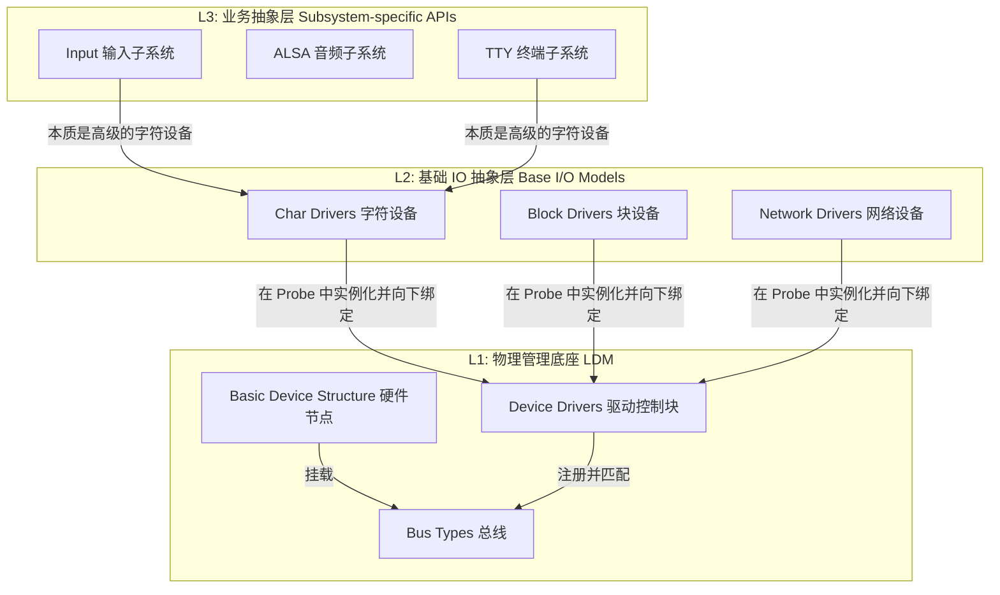

_**笔记：
1.LDM只包含我所谓的 bus-dev-drv,职责：总线管理、match /probe; 形成bus list
2.其他的如分层所示**_

## Q: kernel中设备抽象子系统（官方叫啥？）、三个IO设备模型及bus-dev-drv以及LDM是什么层级关系
![[Pasted image 20260514185731.png]]

## A:

### 一、 费曼图式导入：Linux 驱动帝国的“城市基建模型”

要搞懂这四个词的关系，请你把 Linux 驱动架构想象成一座极其庞大且规范的**“现代商业城市”**：

1. **bus-dev-drv（总线-设备-驱动）**：这是**“城市的物理地基与物业管理”**。街道怎么修（Bus）、商铺在哪块地上（Device）、由哪个物业经理来接管钥匙（Driver）。
2. **LDM（Linux Device Model）**：这是**“城市规划局的官方称呼”**。`bus-dev-drv` 就是这个规划局定下的核心管理体制。
3. **三大 IO 设备模型**：这是**“标准的水电煤气管道”**。不管你上面开什么店，数据只有三种流淌方式：按滴漏的自来水（字符）、按箱运的煤气罐（块）、按包裹发的快递（网络）。
4. **设备抽象子系统**：这是**“精装的连锁商业门店（如肯德基、万达影城）”**。顾客（应用层）不关心你的自来水管（IO 模型）是怎么接到底层地基（LDM）的，他们只想要标准化的汉堡（鼠标键盘事件）和电影（音频流）。

---

### 二、 官方正统命名与概念溯源

让我们翻开内核源码的“族谱”，为你核对这些概念的官方“大名”：

#### 1. LDM 与 bus-dev-drv 的关系

- **官方命名**：在内核文档和《Linux Device Drivers, Third Edition》第 14 章中，它的官方学名叫做 **The Linux Device Model (LDM)**。
- **包含关系**：`bus-dev-drv` 根本不是一个独立的层级，它是 **LDM 架构的三个核心物理基石**。官方文档明确将其拆解为 "Bus Types"（总线类型）、"The Basic Device Structure"（基础设备结构）和 "Device Drivers"（设备驱动程序）。

#### 2. 三大 IO 设备模型

- **官方命名**：在 LDD3 目录中，它们被称为 **Base I/O Drivers (基础 I/O 驱动)**。
- **具体分类**：包括第 3 章的 **Char Drivers (字符设备)**、第 16 章的 **Block Drivers (块设备)**、第 17 章的 **Network Drivers (网络设备)**。它们负责与 VFS（虚拟文件系统）或内核协议栈直接对接，提供最原始的字节流、块读写或数据包收发。

#### 3. 设备抽象子系统

- **官方命名**：在 Linux Kernel 官方文档的目录树中，它被称为 **Subsystem-specific APIs** (特定子系统 API) 或简称 **Subsystems / Classes**。
- **具体实例**：比如 Input 子系统、ALSA 音频子系统、TTY 驱动（LDD3 第 18 章）。

---

### 三、 宏观层级关系剖析：自底向上的堆叠

这三者的关系，是一个极其严格的**“自底向上、层层寄生与封装”**的架构（LDM 是底座，IO 模型是骨干，子系统是皮肉）。

- **L1 底层（物理管家）：LDM (bus-dev-drv)**
    - **职责**：纯粹负责硬件拓扑结构的探测、Match 匹配、以及 CPU 和设备的电源管理（Power Management）。
    - **特点**：LDM 根本不管“数据怎么读写”，它只负责在硬件插入时，把 `probe` 函数拉起来。
- **L2 中层（数据水管）：三大 IO 设备模型**
    - **职责**：在 `probe` 被触发后，驱动程序必须向系统申请一个 `cdev` (字符) 或 `gendisk` (块)。这一层确立了数据是以“流”还是以“块”的形式与 VFS 交互。
    - **特点**：它是连接底层物理硅片与上层逻辑的必经之路。
- **L3 顶层（业务精装房）：设备抽象子系统 (Subsystems)**
    - **职责**：在三大 IO 模型的基础之上，进一步抽象业务逻辑。
    - **咬合机制**：例如，Input 子系统在底层其实就是一个 **Char Driver**。但它把字符设备的 `read/write` 虚函数表自己藏起来了，转而向底层驱动提供 `input_report_key()` 等高度抽象的接口。应用程序打开的是 `/dev/input/event0`，读到的是标准的输入事件结构体，而不是杂乱的底层寄存器生肉数据。

---

### 四、 纯净版架构层级 UML 静态依赖图

为了让你在大脑中彻底固化这层关系，我为你绘制了极其严谨的层级堆叠图（已确保无特殊符号，保证云端完美渲染）。这张图展示了业务子系统是如何向下依赖 IO 模型，最终寄生在 LDM 物理驱动上的。

### 架构师总结

- **LDM (bus-dev-drv)**：解决的是硬件的“生死存亡”与“物理寻址”问题。
- **三大 IO 模型**：解决的是内核数据“如何高效流转到文件系统”的底层管道问题。
- **抽象子系统 (Subsystems)**：解决的是“怎么把乱七八糟的外设，统一成人类和应用层易于理解的标准业务”的问题。

它们在物理代码上是正交分离的，但在驱动的 `probe` 函数执行的那一瞬间，被开发者用指针缝合在了一起。这就是 Linux 驱动分层哲学的最高奥义！