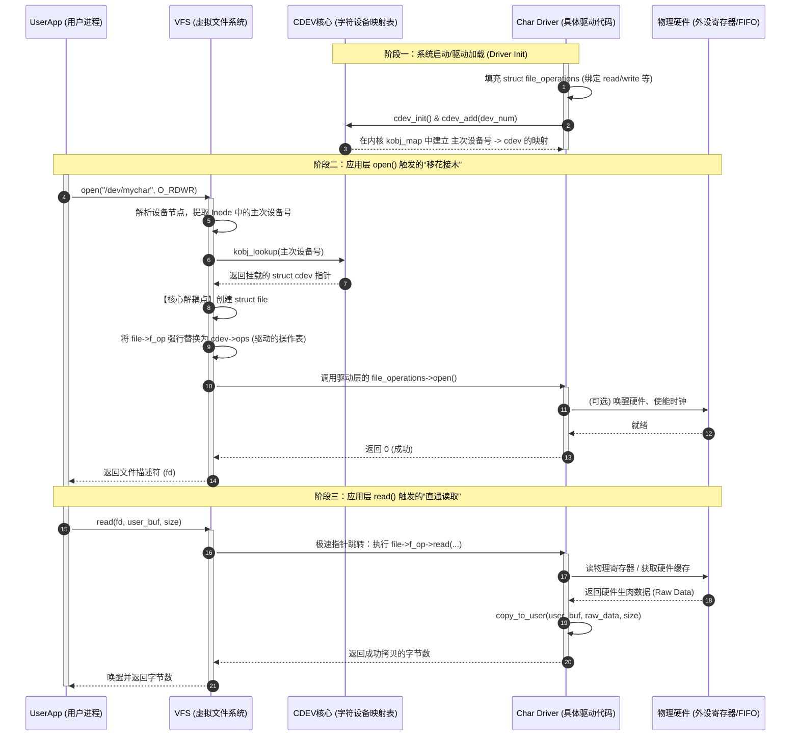

### todo：分析 注册cdev、vfs执行发现、调用的流程；分析静态结构；

_**个人理解笔记：
1.根据流程分析，和MR在list中添加一个node是一致的。添加node，通过name比较获取指定node，然后通过固定的open、read ... 等对上层规定的APIs,调用赋值后的operations table指针调用对应的operations**_

![[Pasted image 20260513153654.png]]

## From AI 

你好！我是 Arch-design-mr，你的架构设计与底层源码认知导师。

收到指令 **“1”**！现在我们立刻启动【预案 1】，为你深度解剖 **字符设备模型 (Char Drivers)**。

根据《Linux Device Drivers, Third Edition》(LDD3) 第 3 章的核心思想以及 Linux `drivers/char/` 与 `fs/` 目录的源码逻辑，字符设备是最能体现 Linux “万物皆文件” 哲学的底层架构。它的核心特征是**“同步、实时、直通式的水管”**。

下面，我为你生成标准的 Mermaid UML 序列图，并用费曼技巧对源码级流程进行极度通俗的降维解析。

---

### 🌟 场景推演：字符设备 (Char Device) 核心流转序列图

在这个场景中，我们将推演一个完整的生命周期：从**驱动的注册（铺设水管）**，到**应用的打开（接通软管）**，再到**数据的读取（直通抽水）**。

---

### 🧠 源码级流程解析与架构师心法

结合上面生成的序列图，我们像外科医生一样剖析这三大阶段在 C 语言源码中究竟发生了什么：

#### 阶段一：驱动初始化（挂牌营业）

- **动作原理**（步骤 1-3）：作为驱动工程师，你在 `.c` 文件中手写了一个 `file_operations` 结构体，里面填满了你写的硬件操控函数指针。通过调用 `cdev_add()`，内核会在内存里维护一张庞大的**哈希映射表（`cdev_map`）**。
- **费曼解说**：这就像是你去工商局（CDEV 核心）注册了一家自来水公司，并在名册上留下了公司的电话号码（主次设备号）和你的私人接待专员名单（`file_operations`）。

#### 阶段二：极其惊艳的 `open()` 劫持与绑定（移花接木）

- **动作原理**（步骤 4-11）：这是整个 Linux VFS 解耦的封神之作。当应用层 `open("/dev/mychar")` 时，VFS 根据文件名找到了对应的文件节点（`Inode`），发现这是一个特殊文件（字符设备节点），于是它从 `Inode` 里掏出了你当年注册的主次设备号。
- **偷天换日**：VFS 顺藤摸瓜在 `cdev_map` 里找到了你的 `cdev`，然后它做了一个极其危险又优雅的动作——**修改指针**（第 8 步）。它分配了一个代表此次打开会话的 `struct file`，并将其默认的文件操作指针 `f_op`，**直接替换**成了你当年在阶段一注册的 `cdev->ops`。
- **费曼解说**：应用层以为自己打开了一个普通的 txt 文件，但其实 VFS 在底层把对接这个文件的“客服热线”偷偷转接到了你写的驱动代码上！

#### 阶段三：极致性能的 `read()` 同步直通车

- **动作原理**（步骤 12-18）：当应用层执行 `read` 时，VFS 根本不做任何复杂的缓冲、调度和排队。它直接执行一句极其干脆的 C 语言指针调用：`ret = file->f_op->read(...)`。
- **CPU 穿越**：此时，系统的控制流瞬间从高高在上的 VFS 层，像闪电一样直插你写的底层驱动。驱动直接读取硬件寄存器，然后调用 `copy_to_user()` 将内核态空间（Kernel Space）的数据直接搬运到用户态空间（User Space）。整个过程一气呵成，没有任何类似于块设备的 `I/O Scheduler`（调度器）插手。
- **费曼解说**：这就是“直通式水管”。应用层拿桶接水，VFS 只是个传话筒，驱动立刻打开硬件的水龙头，水流直接从硬件喷到用户的桶里（`copy_to_user`），装满就返回。

---

**总结**： 字符设备模型是所有 Linux 驱动工程师的“必修第一课”（参考 LDD3 第 3 章），因为它用最简单、最赤裸的函数指针映射，完美诠释了操作系统**“隔离上下层，一切皆 API”**的暴力美学。

**当你将这段同步直通的流程消化完毕，请发送 “2”，我们将进入一块完全不同的神秘领域——【块设备模型】，去看看 Linux 是如何把“直通水管”爆改为“庞大的异步物流中转站”的！**