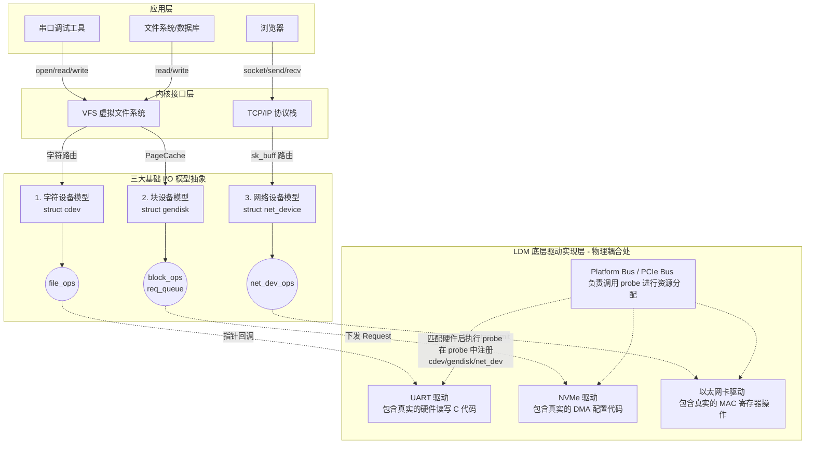

_**个人理解笔记：本质是DEVICE
IO设备实现了如下功能：
1.对上接口：通过VFS或者专用的接口，对上层应用提供了统一的APIs，实现应用对底层device操作层的解耦；
2.职责：实现数据的异步收发、数据格式转换、数据链路的拼接处理(block)等逻辑功能；
3.依赖：对底层硬件依赖，采用operations table的方式指定依赖函数原型及指针，实现与底层硬件driver层的解耦；**_

![[Pasted image 20260513151057.png]]

---
# AI 分析原文
你好！我是 Arch-design-mr，你的架构设计与底层源码认知导师。

收到指令！现在我们全力攻克**问题 3**。这个问题直击 Linux 内核 I/O 架构的最深处：三大基础设备模型（字符、块、网络）是如何向用户空间提供接口，又是如何向下与千奇百怪的物理硬件实现“终极去耦合”的。

在经典的内核架构著作《Linux Device Drivers, Third Edition》(LDD3) 中，这三大模型分别构成了极其核心的独立篇章（第3章 Char Drivers、第16章 Block Drivers、第17章 Network Drivers）。

我们先用一个核心的架构图来总览全局，然后再用费曼技巧逐一解剖。

### 🌟 核心破冰：这三大模型是如何与硬件“去耦合”的？（解答最关键问题）

在展开三大模型之前，必须先回答你强调的“最核心问题”：**模型底层是如何与硬件解耦的？**

答案是：**“虚函数表（Ops）” + “私有数据指针（Private Data）”的桥接模式**。

1. **接口剥离**：三大设备模型（Char/Block/Net）本身**绝对不包含**任何一行操作硬件（如 I2C、USB 寄存器）的代码。它们只定义了一张“操作函数指针表”（`file_operations`、`block_device_operations`、`net_device_ops`）。
2. **在 LDM 中缝合**：解耦的终极现场发生在 **LDM 总线框架的 `probe` 函数中**。当底层的 I2C/PCIe 总线匹配到物理硬件并调用驱动的 `probe` 时，驱动工程师会在这里实例化 `cdev` 或 `net_device`，**将具体操作物理硬件的 C 函数地址，赋值给上述的 Ops 函数指针表**，最后注册给系统。
3. **闭环**：此后，上层的三大 IO 模型只需无脑调用 Ops 表中的指针，就能精准操控硬件，而根本不需要知道硬件是通过什么总线连接的。

---

### 一、 字符设备模型 (Char Device) —— “直通式水管”

在 LDD3 中，第3章专门探讨了 Char Drivers。这是最符合“万物皆文件”理念的模型。

#### 1. 结构与关键接口

- **承载结构体**：`struct cdev`
- **虚函数表**：`struct file_operations`
- **关键接口**：向对上提供标准的 `open`、`read`、`write`、`ioctl`、`mmap` 等系统调用映射。

#### 2. 核心场景与流程

- **场景**：适用于按字节流顺序吞吐、无缓存、高实时性的设备（如串口 UART、I2C 传感器、SPI 外设）。
- **执行流程**：
    1. 应用层发起 `read(fd, buf, size)`。
    2. VFS 根据文件描述符（fd）找到底层的 `struct cdev`。
    3. VFS 直接指针跳转，调用你在驱动中绑定的 `file_operations->read`。
    4. 驱动中的 `read` 函数直接读取硬件寄存器（或中断中的 RingBuffer），然后通过 `copy_to_user` 将原始数据（Raw Data）拷贝给应用层。

---

### 二、 块设备模型 (Block Device) —— “仓储调度物流中心”

在 LDD3 的第16章探讨了 Block Drivers。块设备是对物理存储介质（极慢）的极致性能妥协。

#### 1. 结构与关键接口

- **承载结构体**：`struct gendisk`（通用磁盘结构）
- **核心组件**：`struct request_queue`（请求队列）
- **虚函数表**：`struct block_device_operations`
- **依赖与解耦**：块设备**不提供直接的 `read/write` 函数给用户**！它对上依赖 VFS 和 Page Cache（页缓存），对下依赖 I/O 调度器下发的 `request`。

#### 2. 核心场景与流程

- **场景**：适用于支持随机访问、以固定数据块（Block，如 512B/4KB）为读写单位的大容量存储（如 HDD 机械硬盘、SSD、eMMC、SD卡）。
- **执行流程（彻底颠覆认知的异步流）**：
    1. 应用层发起 `write()`。VFS 接管后，数据首先被写入内核的内存缓存（Page Cache）中，此时 `write` 直接返回（App 以为写完了，其实没有）。
    2. 内核后台线程将被修改的“脏页”打包成 `struct bio`（块 I/O 结构）。
    3. **I/O 调度器**（如电梯算法）介入，将散乱的 `bio` 进行合并、排序，生成 `struct request`，塞入驱动的 `request_queue`（请求队列）。
    4. 底层驱动的 `queue_rq` 回调函数被触发，驱动从队列中取出合并后的大块任务，配置 DMA，让硬件自行把数据搬到磁盘上。

---

### 三、 网络设备模型 (Network Device) —— “独立的高速快递网”

在 LDD3 的第17章探讨了 Network Drivers。网络模型是**唯一一个彻底打破 Linux VFS “万物皆文件”抽象**的异类！

#### 1. 结构与关键接口

- **承载结构体**：`struct net_device`
- **核心数据包结构**：`struct sk_buff`（套接字缓冲区，贯穿整个网络栈的灵魂结构）
- **虚函数表**：`struct net_device_ops`
- **接口特性**：网络设备**不在 `/dev` 目录下生成设备节点**！它没有主次设备号，应用层绝对无法通过 `open/read` 来访问它。它专门向上对接内核的 TCP/IP 网络协议栈。

#### 2. 核心场景与流程

- **场景**：面向数据包（Packet）的无序收发（如 Ethernet 网卡、Wi-Fi 芯片、4G/5G 模块）。
- **执行流程（发包与收包的软硬交互）**：
    - **发包（Tx）**：应用层调用 `sendto()` $\rightarrow$ TCP/IP 协议栈封装 IP 头、MAC 头，生成 `sk_buff` $\rightarrow$ 调用驱动绑定的 `net_device_ops->ndo_start_xmit` $\rightarrow$ 驱动将 `sk_buff` 放入网卡物理发送环（Tx Ring），触发硬件发送。
    - **收包（Rx - 基于 NAPI 机制）**：网卡收到光电信号，触发物理中断 $\rightarrow$ 驱动立刻屏蔽中断，触发内核网络专用的**软中断（SoftIRQ）** $\rightarrow$ 软中断在后台以“轮询（Poll）”的方式，极其高效地将网卡 DMA 中的数据批量取回封装为 `sk_buff` $\rightarrow$ 向上甩给 TCP/IP 协议栈层层解包 $\rightarrow$ 唤醒应用层的 `recv()`。

---

### 🧠 终极架构拓扑图：三大 I/O 模型与 LDM 的解耦映射

以下 Mermaid 序列图完美展示了用户空间、三大设备模型、以及 LDM 底层驱动之间是如何通过 `Ops` 函数指针实现完美去耦合的：

### 总结

通过这三大模型，Linux 内核实现了对世界万物的终极抽象：

- **按字节流动的**，归入 Char 设备，交由 VFS 实时转发。
- **成块存放的**，归入 Block 设备，交由电梯算法和缓存池进行性能压榨。
- **按包飞行的**，归入 Net 设备，抛弃 VFS，直接塞进 TCP/IP 的快车道。 而它们底层，全部通过面向对象中的**“多态（虚函数指针挂载）”**机制，在 LDM 的 `probe` 阶段与具体的硅片驱动完成无缝拼接。