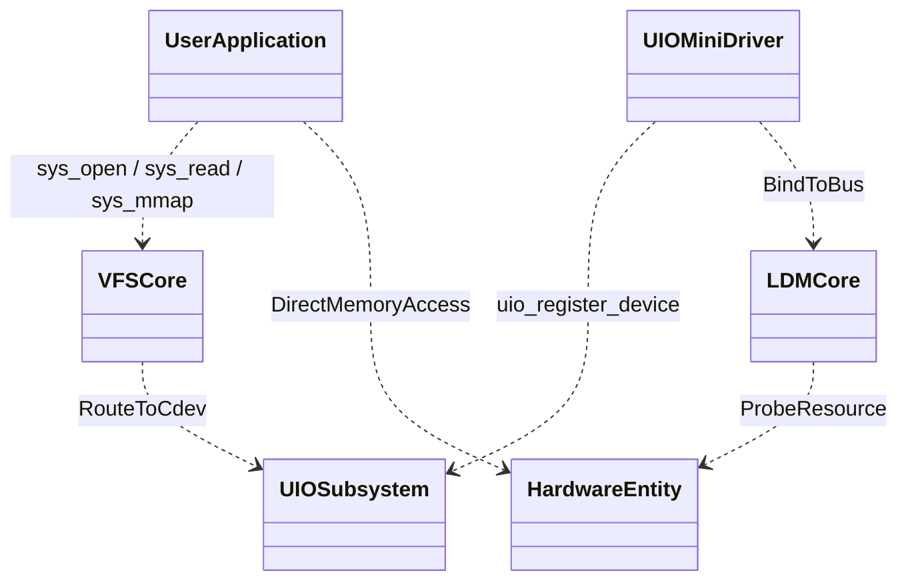

你好！我是 Arch-design-mr，你的架构设计与底层源码认知导师。

在此为你奉上高度提炼、可直接作为你的个人知识库架构核心的 **《UIO 子系统与多路复用 (Poll/Select) 核心架构笔记》**。本笔记严格基于《Linux Device Drivers, Third Edition》（LDD3，）及内核源码哲学，采用费曼技巧为你扫除底层盲点。所有的 Mermaid 图表均已采用最纯净的语法，确保在任何云端解析器中 100% 渲染成功！

---

### 第一部分：UIO (User-space I/O) 架构与核心机制笔记

#### 1. 费曼认知模型：“自助外带与后厨直达通道”

- **传统驱动**：后厨（内核态）包揽切菜、炒菜、端盘子。数据必须通过 `read/write` 经过服务员（内核拷贝）端给顾客。
- **UIO 驱动**：内核只给你一块案板（**`mmap` 内存直通映射**）和一个叫号器（**`read` 阻塞等待中断**）。复杂的寄存器时序编解码，全部由顾客自己在用户态（App）完成。实现机制在内核，策略在用户！

#### 2. UIO 静态组件依赖图 (Static View)

UIO 巧妙地借用了 VFS 和 Char Device 的躯壳，实现了绕过内核业务逻辑的降维打击。

#### 3. UIO 动态执行序列图 (Dynamic View)

本图清晰展示了 UIO 中的三种数据流：`mmap` 建立通道，`read` 挂起睡眠，`write` 控制中断。
![[Pasted image 20260515164411.png]]
---

### 第二部分：Select / Poll (I/O 多路复用) 架构笔记

#### 1. 费曼认知模型：“前台多屏幕震动叫号器”

- **痛点**：如果你（线程）同时操作键盘（`/dev/input0`）和网络，你不能在键盘的 `read` 上死等，否则网络数据来了你完全不知道。
- **Poll 机制**：你把所有等待的单据交给一个**“前台多屏幕叫号器 (sys_poll)”**。然后你去大厅沙发上睡觉。只要其中**任何一个**外设做好了菜（发生中断），都会触发叫号器震动将你唤醒。这就是高并发服务器能用极少线程处理千万并发的底层基石！

#### 2. Poll 静态组件依赖图 (Static View)
_**个人理解笔记：
**_
基于 LDD3 第 6 章，`poll` 本质上是 `file_operations` 接口中暴露给底层驱动的一个标准填空题。
![[Pasted image 20260515164632.png]]

#### 3. Poll 动态执行序列图 (Dynamic View)

此图揭示了 Linux 内核如何利用 `poll_wait` 将**同一个线程**同时挂载到**多个独立设备的等待队列**上。
![[Pasted image 20260515165322.png]]

---

### 第三部分：内核架构极易踩坑的“反直觉”认知清单（避坑指南）

在从单片机/HAL库（如 `mr-library`）向 Linux 宏内核演进的过程中，以下四点是最容易导致认知崩溃的盲区：

#### ❌ 误区 1：“read/poll 阻塞会卡死整个应用程序（进程）”

- **真相**：Linux 调度器的最小单位是任务控制块（`task_struct`）。阻塞的**永远只是发起该系统调用的当前线程 (Thread)**！如果你的进程有多个线程（同属一个包厢），线程 A 在 `poll` 睡眠时，线程 B 和 C 依然在欢快地抢占 CPU 运行。

#### ❌ 误区 2：“UIO 驱动里的 write 是用来向硬件下发数据的”

- **真相**：在 UIO 架构中，数据下发绝不需要 `write`（避免内核拷贝导致性能下降），而是直接通过 `mmap` 的指针在用户态内存赋值！UIO 的 `write` 接口专门用于向框架发送一个 32 位的指令，用来**动态打开或屏蔽硬件的物理中断使能**，防止中断风暴。

#### ❌ 误区 3：“调用 poll/select 后，内核是用死循环不断轮询底层硬件状态的”

- **真相**：`poll` 的名字极具欺骗性！它绝对不是 `while(1) { check_hw(); }` 这种耗费 CPU 的轮询。它的本质是**挂起/休眠等待 (Sleep-Wait)**。只有当底层的物理硬件真的产生中断，并主动执行 `wake_up` 时，线程才会被唤醒并重新获得 CPU 时间片。

#### ❌ 误区 4：“mmap 是 UIO 发明的高级接口，普通驱动用不了”

- **真相**：`mmap` 只是 VFS 提供在 `file_operations` 接口（插排）上的一个普通“孔位”。无论是写 LCD 屏幕的 Framebuffer 驱动、显卡 DRM 驱动、还是你自己的普通字符设备，只要你在底层实现了将“物理页帧（Page Frame）转化为虚拟页表（VMA）”的逻辑，任何驱动都可以享受内存直通的高速性能！