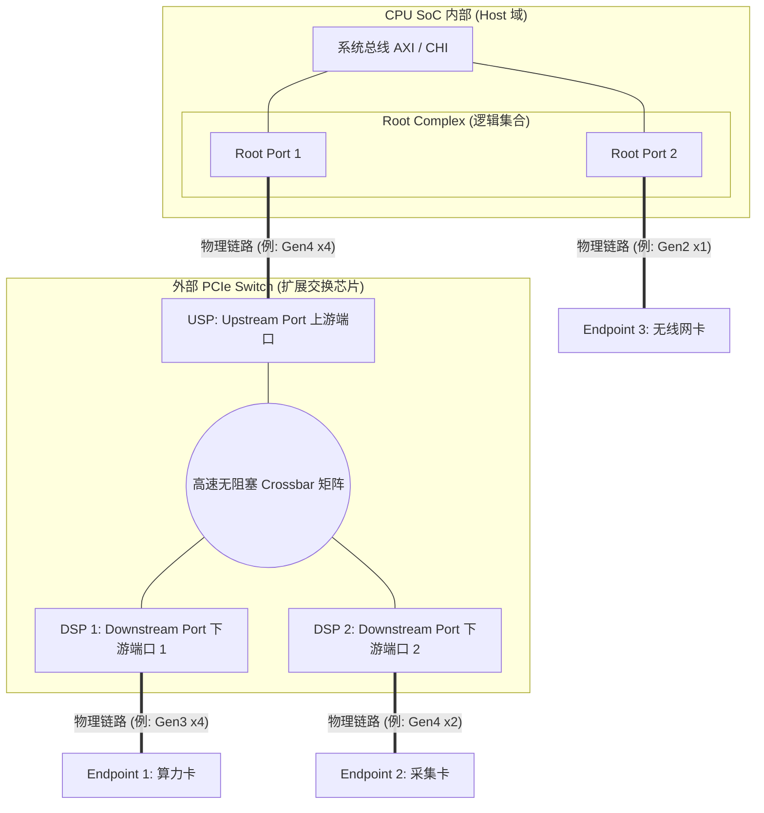

![[Pasted image 20260812150055.png]]

这份笔记为您梳理 PCIe 最核心的物理连接拓扑与硬件层级架构，剥离软件抽象，直击硅片原理。

  

# 💻 架构笔记：PCIe 物理连接拓扑与硬件协议栈

## 一、 全景宏观拓扑图：节点与端口

在硬件图纸上，PCIe 是一张严格由点对点独立链路（Point-to-Point Link）构建的树状交换网络。请务必抛弃“总线共享”的旧观念。

  

代码段

### 核心端口名词界定

- **RC (Root Complex)**：SoC 内部 PCIe 域的总指挥，负责把 CPU 的内存读写指令翻译成 PCIe 报文。它是一个**逻辑集合**。
- **RP (Root Port, 根端口)**：RC 向外伸出的物理“触手”。SoC 向外引出几个独立的 PCIe 接口，内部就有几个 RP。它们各自独立，互不干扰。
    
- **USP (Upstream Port, 上游端口)**：**仅存在于 Switch 上**。指 Switch 内部那个永远指向 Host (CPU) 方向的物理端口。
- **DSP (Downstream Port, 下游端口)**：**仅存在于 Switch 上**。指 Switch 内部那些指向各个最终外设（EP）方向的物理端口。

- **EP (Endpoint, 端点设备)**：业务链路的终点，如 NPU、NVMe 固态硬盘、网卡。它只有上游链路，不能再往下级联其他设备。
    
    
## 二、 微观 IP 架构：硬件三层电路逻辑

在上述拓扑图中，**任何一个物理端口（每一个 RP、每一个 USP、每一个 DSP、每一个 EP）的硅片内部，都绝对完整且独立地包含以下“三层硬件逻辑”**。它们完全由 RTL 数字电路硬件实现。

  

### 1. 事务层 (Transaction Layer) —— 业务大脑 & 物流打包处

- **核心功能**：处理最上层的业务指令，负责组装和解析 **TLP (Transaction Layer Packet, 事务层包)**。
    
      
    
- **关键机制 (Credit-based Flow Control)**：纯硬件的“信用流控”。发送端在发射 TLP 前，必须检查接收端对应缓冲区的 Credit（额度）。如果对方快满了（额度为 0），硬件直接暂停发送，从根本上杜绝了网络拥塞导致的丢包。
    
      
    
- **数据形态**：TLP（包含 Header、Data Payload、ECRC）。
    
      
    

### 2. 数据链路层 (Data Link Layer) —— 质量管家 & 纠错重传机制

- **核心功能**：保障两个相邻端口之间（比如 RP 到 USP 之间）的数据绝对完整性。
    
      
    
- **关键机制 (ACK/NAK & Replay)**：
    
      
    - 给事务层交下来的 TLP 加上 **序列号 (Sequence Number)** 和 **链路循环冗余校验 (LCRC)**，封装成 DLLP。
        
          
        
    - **独立重传缓存 (Replay Buffer)**：发出去的包会留一个备份在重传 FIFO 里。如果收到对端发来的 NAK 信号（说明发生电磁干扰误码），该层硬件会自动把备份重发一次，**CPU 软件对此毫无感知**。
        
          
        

### 3. 物理层 (Physical Layer) —— 苦力司机 & 电气接口

- **MAC 子层 (逻辑层)**：负责 LTSSM（链路训练状态机）。开机时全自动握手，探测对方支持的 Gen 速度和 Lane 宽度；负责 8b/10b 或 128b/130b 的编码与加解扰（Scrambling），防止链路上出现长串的 0 或 1 导致时钟失锁。
    
      
    
- **PHY 子层 (电气层)**：SerDes（串行/解串器）。把并行数据全部打碎，变成最高 64GT/s 的差分微波电平，通过 TX/RX 差分铜线射向远端。
    
      
    

## 三、 综合架构心智模型 (Feynman 总结)

如果要把 PCIe 硬件连线图刻在脑子里，请牢记以下三句话定论：

  

1. **没有总线，只有网线**：两颗芯片之间那几根孤零零的差分线，本质上是一根“双向网线”。线上跑的不是地址和数据信号，而是封装好的“快递包裹”（TLP）。
    
      
    
2. **没有共享，只有路由**：Switch 不是一个接线板，它是一台带有高性能独立背板的路由器。它切断了端到端的物理连接，把一条长路变成了 `RP<->USP` 和 `DSP<->EP` 两条独立的短路。
    
      
    
3. **绝对自治的端口**：Switch 上的每一个 DSP，都是一个**自给自足的独立收发小天地**。它有自己的 LCRC 校验器，自己的重传 Buffer，自己的流控计分板，绝不和别的端口混用。

---
### 1. 简短心智模型：边界与透传

**关于 RC 与 RP 的边界模型：“物流中心与出货道”**
- **RC (Root Complex)**：是连接 CPU 与 PCIe 世界的“逻辑枢纽”。它负责把 CPU 出来的 AXI 内存读写指令，翻译打包成 PCIe 的标准包裹（TLP）。
- **RP (Root Port)**：是 RC 伸向外部世界的“物理实体接口”。它是出货道口，里面包含了实打实的物理层（PHY）、链路层（DLL）和事务层，负责把 TLP 变成电信号发出去。
    
**关于 Switch 的双重视角模型：“测绘员与狙击手”**
- **枚举阶段 (OS PCI 子系统 = 测绘员)**：测绘员走遍全网，把 Switch 的每个端口都标记为“桥”，为后面的设备分配物理内存地址，画出一张全景地图。
- **业务通信阶段 (EP 业务驱动 = 狙击手)**：地图画好后，狙击手开枪（执行 `writel/readl`）。此时的 Switch 就是一块**完全透明的玻璃**。子弹（TLP 包）在底层硬件地址路由（Address Routing）的引导下直接击中目标（EP）。狙击手（业务驱动）不需要，也感知不到玻璃的存在。
    
### 2. RC 与 RP 的从属关系与 SoC 定制

**你的结论 100% 正确：RC 和 RP 是逻辑管理与物理实例的关系，一个 RC 通常管理多个独立的 RP，且数量在芯片流片前就已经彻底固化。**
深入到 SoC 芯片原厂（如 NXP、瑞芯微、高通）的设计流程中，这个机制是这样落地的：
1. **IP 采购与拼图**：芯片架构师在设计 SoC 时，会向 IP 供应商（如 Synopsys DesignWare）购买控制器 IP。架构师评估了这颗芯片的定位，决定需要提供 3 个对外的 PCIe 接口。
2. **RTL 固化连线**：在硅片布线阶段，架构师会在芯片内部的高速总线（如 ARM CHI 或 AXI 总线）上，挂载一个**总的地址解码和转发逻辑（这部分构成了 RC 的核心）**，然后从这个逻辑向下，**物理连接并实例化 3 个独立的 Root Port IP (RP0, RP1, RP2)**。
3. **软件视角的呈现**：当这颗 SoC 制造出来后，硬件资源就已经焊死了。当你跑起 Linux 并且不插任何外设时，通过 `lspci` 也能看到系统里挂着 3 个 `PCI bridge`，这对应的就是那 3 个硬连线的 RP。
    
**总结**：RC 是一个抽象的“总司令”，负责对接 CPU 总线；RP 是“前线指挥所”，负责对接具体的物理外设。一个 SoC 有几个 RP，完全取决于芯片厂商在画电路图时的刀法，流片后即成物理真理，不可更改。