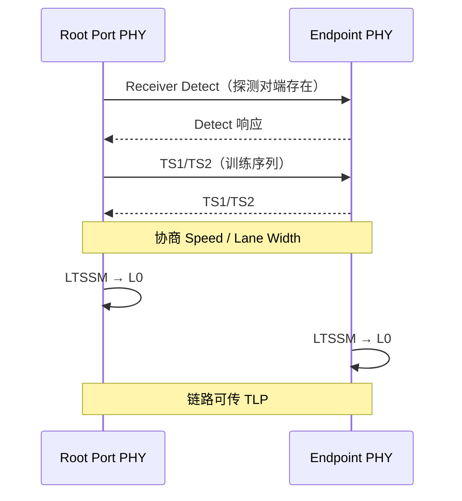
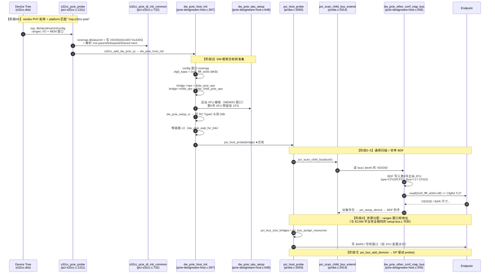

---
tags:
  - OS
  - Linux
---

# PCIe 枚举：从物理层到 BAR 分配，一路贴代码讲清楚

> **本文定位**：`rc-ep-thories.md` 原版是 GPT 生成的纯理论回答——**方向对，但隔靴搔痒，一个代码都没贴**。本文在原版骨架基础上重写，**每一句论断都给出本仓库 Linux 6.6.99 的实际代码落点**，回答你原来的两个问题：
>
> 1. **校正理解**：BDF 不是"枚举时生成的"；BAR 也不是"分配 DDR"。
> 2. **核心困惑**：他妈的没有基础访问地址，CPU 到底怎么通过 BDF 找到 Config Space？
>
> **两个真实平台实例贯穿全文**：
>
> | 实例 | 控制器内核 | 配置访问机制 | 代码 |
> |---|---|---|---|
> | Xilinx AXI PCIe（通用演示） | 自研 AXI 桥 | **ECAM**（BDF 编码进内存地址位） | `pcie-xilinx.c` |
> | **S32G399（NXP，主实例）** | **Synopsys DesignWare** | **iATU 型**（BDF 写进 ATU 寄存器，窗口地址固定） | `pci-s32cc.c` + `pcie-designware-*.c` |
>
> 为什么用 S32G399？因为它是**与本仓库 git 历史强相关的真实 SoC**（最近提交都是 `s32cc-serdes`/`s32cc-xpcs`），其设备树 `s32cc.dtsi` 和驱动 `pci-s32cc.c` 就在仓库里，且它的配置访问机制与 Xilinx 的 ECAM **本质不同**——对照看，你就能彻底明白"**BDF → 配置空间地址**"这件事没有唯一答案，全靠 RC 硬件和驱动的配合。
>
> **代码事实源**（本仓库，git `810f39637552`，Linux 6.6.99）：
>
> | 文件 | 角色 |
> |---|---|
> | `drivers/pci/controller/pcie-xilinx.c` | Xilinx AXI PCIe **RC 驱动**（ECAM 型，寄存器操作 + ops） |
> | `drivers/pci/controller/dwc/pci-s32cc.c` | **NXP S32CC/S32G PCIe RC 驱动**（主实例） |
> | `drivers/pci/controller/dwc/pcie-designware-host.c` | DesignWare 通用 host 框架（ops/ATU/交权） |
> | `drivers/pci/controller/dwc/pcie-designware.c` | DesignWare 核心（ATU 编程、DBI 读写） |
> | `arch/arm64/boot/dts/freescale/s32cc.dtsi` | **S32CC/S32G 基础设备树**（pcie0/pcie1 节点） |
> | `arch/arm64/boot/dts/freescale/s32g3.dtsi` / `s32g399a-*.dts` | S32G3 平台覆盖 / 板级使能 |
> | `drivers/pci/probe.c` | **PCI Core 扫描/枚举**核心（平台无关） |
> | `drivers/pci/access.c` | 配置空间通用读写 |
> | `include/linux/pci-ecam.h` | **ECAM 地址公式** |
> | `drivers/pci/setup-bus.c` / `setup-res.c` | 资源分配（BAR/桥窗口） |
> | `drivers/pci/bus.c` | 设备加入总线、绑定驱动 |
>
> **建议对照阅读**：`rc_to_PCI_core.md`（RC 驱动如何交权）、`pci_scan_analysis.md`（扫描算法）、`pci_resource_analysis.md`（资源分配）。

---

## 目录

1. [先校正你的两个理解](#0-先校正你的两个理解)
2. [第一性问题：没有基础地址，怎么找到 Config Space？](#1-第一性问题没有基础地址怎么找到-config-space)
3. [1.5 对照实例：ECAM 型（Xilinx） vs iATU 型（S32G399）](#15-对照实例ecam-型xilinx-vs-iatu-型s32g399)
4. [阶段一：物理层建链（LTSSM → L0）](#2-阶段一物理层建链ltssm--l0)
5. [阶段二：RC 驱动准备好"入口"](#3-阶段二rc-驱动准备好入口)
6. [阶段三：交权给 PCI Core](#4-阶段三交权给-pci-core)
7. [阶段四：扫描 = 穷举 BDF 发现设备](#5-阶段四扫描--穷举-bdf-发现设备)
8. [阶段五：解析配置头 + 量 BAR](#6-阶段五解析配置头--量-bar)
9. [阶段六：桥递归 = Bus Number 分配](#7-阶段六桥递归--bus-number-分配)
10. [阶段七：资源分配 = 发地址牌照](#8-阶段七资源分配--发地址牌照)
11. [阶段八：绑定驱动](#9-阶段八绑定驱动)
12. [代码级完整序列图](#10-代码级完整序列图)
13. [有 Switch 时呢？](#11-有-switch-时呢)
14. [傻瓜复读机：找一个笨蛋先读一遍](#12-傻瓜复读机找一个笨蛋先读一遍)
15. [心智图：三套地址空间 + 一句话](#13-心智图三套地址空间--一句话)
16. [源码核对清单](#14-源码核对清单)

---

## 0. 先校正你的两个理解

你原话：

> "按照枚举顺序，为每个 function 生成了 BDF……读取 bar 的期望 data memory，然后分配内存到 ddr，再把物理 base address 写入到 bar"

两个点需要修正：

### 0.1 不是"枚举时给每个 Function 生成 BDF"

BDF 三个部分的来源**完全不同**，没有一个环节叫"生成 BDF"：

| BDF 部分 | 谁给的 | 依据 |
|---|---|---|
| **Bus Number** | 枚举软件给每条总线/每座桥**分配** | `probe.c` 的 `pci_scan_bridge_extend()` 里 `next_busnr = max + 1` |
| **Device Number** | **拓扑位置**决定：PCIe 点对点链路上直连下游通常就是 Device 0 | `probe.c` 的 `only_one_child()` 只扫 Device 0 |
| **Function Number** | **设备自身**实现几个 function | `probe.c` 的 `next_fn()` 逐个探测 fn0~fn7 |

> **一句话**：BDF 是"总线编号 × 槽位扫描 × 设备功能"三者**拼**出来的坐标，不是"发"给设备的。

### 0.2 不是"给 BAR 分配 DDR"

BAR 声明的是 EP 想要的 **PCIe MMIO 地址窗口大小**（如 64KB），Host 从 **Host Bridge 提供的 MMIO 窗口**里分配地址写进 BAR。**DDR 是以后数据搬运时另外分配的 DMA buffer**，两者不是一个东西：

```text
ECAM 地址      → 找 Function 的 Configuration Space（枚举用）
BAR/MMIO 地址  → 找设备内部业务寄存器（数据用）
DMA 地址       → 找 Host DDR 内存（搬运用）
```

### 0.3 你卡住的真正问题

> "他妈的没有一个基础访问地址，怎么通过 BDF 找到配置 space 的？"

这是全文要解决的核心。答案提前说：**ECAM Base 不是枚举出来的，是平台/固件预先告诉 RC 驱动的**。在本仓库的代码里，它来自 Device Tree 的 `reg` 属性，被 `xilinx_pcie_probe()` 映射成 `pcie->reg_base`，然后所有 BDF 访问都从这一个基址出发。

下面第 1 节用代码给你把这个"鸡生蛋"问题焊死。

---

## 1. 第一性问题：没有基础地址，怎么找到 Config Space？

### 1.1 ECAM Base 到底从哪来？（代码证据链）

**DT 里已经写死了**。板级 dts 中这个节点带一个 `reg`：

```text
pcie: pcie@50000000 {
    compatible = "xlnx,axi-pcie-host-1.00.a";
    reg = <0x0 0x50000000 0x0 0x2000000>;   /* 这就是 ECAM 窗口的 CPU 物理地址 */
    ...
};
```

RC 驱动 `xilinx_pcie_probe()`（pcie-xilinx.c:566）里调用 `xilinx_pcie_parse_dt()`（pcie-xilinx.c:530），其中的关键一行：

```c
// pcie-xilinx.c:544
pcie->reg_base = devm_pci_remap_cfg_resource(dev, &regs);
```

`regs` 就是从 DT `reg` 属性读出来的**物理地址资源**，`devm_pci_remap_cfg_resource()` 把它 ioremap 成内核虚拟地址 `pcie->reg_base`。

> **所以 "ECAM Base" 在代码里就是 `pcie->reg_base`，它的值不是从任何 EP 枚举来的，而是固件写在 DT 里的平台事实。** 这就是那个"基础访问地址"。

### 1.2 BDF → 物理地址：ECAM 公式的代码

PCIe 标准规定 ECAM 窗口内地址编码（本仓库直接写着，include/linux/pci-ecam.h:23-37）：

```c
#define PCIE_ECAM_BUS_SHIFT     20   /* Bus number */
#define PCIE_ECAM_DEVFN_SHIFT   12   /* Device and Function number */
#define PCIE_ECAM_REG_MASK      0xfff /* Limit offset to a maximum of 4K */

#define PCIE_ECAM_OFFSET(bus, devfn, where) \
	(PCIE_ECAM_BUS(bus) | PCIE_ECAM_DEVFN(devfn) | PCIE_ECAM_REG(where))
```

翻译成图：

```text
ECAM 地址 = reg_base + (bus << 20) | (devfn << 12) | (where & 0xfff)

   bit 27:20   = Bus Number        (0~255)
   bit 19:15   = Device Number     (0~31)
   bit 14:12   = Function Number   (0~7)
   bit 11:0    = 寄存器偏移         (每个 Function 固定 4KB = 0x1000)
```

注意 `devfn` 是一个字节：高 5 位是 Device，低 3 位是 Function（`devfn = device << 3 | function`），`PCIE_ECAM_DEVFN_SHIFT = 12` 正好把它放到 `[19:12]`。

**Xilinx RC 驱动把公式落进 `map_bus`**（pcie-xilinx.c:177-186）：

```c
static void __iomem *xilinx_pcie_map_bus(struct pci_bus *bus,
					 unsigned int devfn, int where)
{
	struct xilinx_pcie *pcie = bus->sysdata;

	if (!xilinx_pcie_valid_device(bus, devfn))
		return NULL;

	return pcie->reg_base + PCIE_ECAM_OFFSET(bus->number, devfn, where);
}
```

> **这就是"BDF → 配置空间地址"的全部秘密**：`bus->number`（总线号）+ `devfn`（设备+功能号）拼成偏移，加到 `reg_base`（DT 给的基址）上。

### 1.3 一次 CfgRd 的完整代码调用链

内核里所有配置空间读写都走同一个模板（access.c:34-51 的 `PCI_OP_READ` 宏）：

```c
pci_bus_read_config_dword(bus, devfn, PCI_VENDOR_ID, &l);
    → bus->ops->read(bus, devfn, where, 4, &l)      // access.c:44
    → pci_generic_config_read()                     // access.c:80
        → addr = bus->ops->map_bus(bus, devfn, where)  // access.c:85
                → xilinx_pcie_map_bus()              // pcie-xilinx.c:177 ★ 厂商私有
                    → pcie->reg_base + PCIE_ECAM_OFFSET(bus->number, devfn, where)
        → readl(addr)                                // access.c:94 ← 就一条内存读
```

> **精髓**：RC 的 ECAM 机制把"发一个 CfgRd TLP"简化为"CPU 读一段内存"。CPU 执行 `readl`，RC 硬件发现该地址落在 ECAM 窗口，自动拆出 B/D/F/offset，打包成配置读 TLP 发到 PCIe 链路；EP 返回后，RC 把数据填回这次内存读的结果。**软件全程只见内存读写，不见 TLP。**

### 1.4 回答"鸡生蛋"问题

```text
你担心的死循环：  不知道 BDF → 找不到 Config Space → 不知道 BDF...
实际流程：        平台已知 reg_base（DT）
                     ↓
                  用"可能的 BDF"去撞 reg_base 这个窗口
                     ↓
                  撞到有效 VID → 该 BDF 存在 → 记下来
                     ↓
                  继续撞下一个 BDF
```

**配置空间从来不是"先知道设备再找地址"；而是"地址窗口固定，拿 BDF 去试探"。** BDF 只是一个"房间号"，`reg_base` 是"整栋楼的门牌"，楼是平台早就盖好的。这就是枚举（enumeration）：**穷举房间号，看哪间有人。**

---

## 1.5 对照实例：ECAM 型（Xilinx） vs iATU 型（S32G399）

"BDF → 配置空间地址"这件事**没有唯一解**。PCIe 标准规定了 BDF 的语义和配置空间布局，但**"CPU 地址 → BDF"的翻译机制由 RC 硬件决定**，Linux 用 `pci_ops` 抽象屏蔽差异。本仓库里恰好有两个活例子：

### 1.5.1 S32G399 的 PCIe 设备树（`s32cc.dtsi`）

S32G399 的 PCIe 控制器是 **Synopsys DesignWare 核心**（S32CC 通用底盘 SoC 家族，S32G2/G3/S32R 共用）。基础 dtsi 里定义了两个控制器（`arch/arm64/boot/dts/freescale/s32cc.dtsi`）：

```dts
// s32cc.dtsi:982-1039
pcie0: pcie@40400000 {
	compatible = "nxp,s32cc-pcie";
	dma-coherent;
	reg = <0x00 0x40400000 0x0 0x00001000>,   /* dbi registers */
	       <0x00 0x40420000 0x0 0x00001000>,   /* dbi2 registers */
	       <0x00 0x40460000 0x0 0x00001000>,   /* atu registers */
	       <0x00 0x40470000 0x0 0x00001000>,   /* dma registers */
	       <0x00 0x40481000 0x0 0x000000f8>,   /* ctrl registers */
	       /* RC configuration space, 4KB each for cfg0 and cfg1
		* at the end of the outbound memory map
		*/
	       <0x5f 0xffffe000 0x0 0x00002000>,      // ← "config" 窗口只有 8KB！
	       <0x58 0x00000000 0x0 0x40000000>;      /* 1GB EP addr space */
	reg-names = "dbi", "dbi2", "atu", "dma", "ctrl",
		    "config", "addr_space";
	#address-cells = <3>;
	#size-cells = <2>;
	device_type = "pci";
	device_id = <0>;
	ranges =
		/* I/O 窗口：PCI bus 地址 0x0~0xffff ↔ CPU 0x5f fffe0000~+64KB */
		<0x81000000 0x0 0x00000000 0x5f 0xfffe0000 0x0 0x00010000>,
		/* 非预取内存窗口：PCI bus 地址 0x0~ ↔ CPU 0x58 00000000~ */
		<0x82000000 0x0 0x00000000 0x58 0x00000000 0x7 0xfffe0000>;
	nxp,phy-mode = "crns";
	num-lanes = <2>;
	bus-range = <0x0 0xff>;
	msi-parent = <&gic>;
	shared-mem = <&pci_shared_memory0>;
	nvmem-cell-names = "serdes_presence", "pcie_dev_id";
	nvmem-cells = <&serdes_presence>, <&pcie_dev_id>;
	status = "disabled";          // 板级 dts 里置 "okay" 使能
};
```

**注意第 6 段 `reg`**：`"config"` 窗口只有 **8KB**（注释明说"4KB each for cfg0 and cfg1"）。对比一下：

| 项目 | Xilinx（ECAM 型） | S32G399（DW/iATU 型） |
|---|---|---|
| 配置窗口大小 | 每个 bus 1MB，整个窗口 256MB | 仅 8KB（cfg0 4KB + cfg1 4KB） |
| BDF 放在哪 | **内存地址位**：`reg_base + bus<<20 + devfn<<12 + reg` | **ATU 寄存器**：CPU 每次访问前把 BDF 写进出站 iATU |
| 物理页大小 | 标准 ECAM：每 Function 固定 4KB | cfg0/cfg1 各一页 4KB，**与 ECAM 页布局一致** |
| 窗口地址 | 256MB 连续窗口 | 固定两个 4KB 页 |

> **为什么 S32G 只需要 8KB？** 因为 DesignWare 不是"一个 bus 占 1MB"，而是**"每次访问前重新定向"**：软件把想访问的 BDF 写进 ATU 寄存器，ATU 硬件把随后的一次窗口访问翻译成去该 BDF 的配置 TLP。窗口本身不需要按 BDF 编址，所以 8KB 足够。

### 1.5.2 S32G399 的两种 `pci_ops`（`pcie-designware-host.c`）

DW 框架给 PCI Core 提供了**两套 ops**（`dw_pcie_host_init`，pcie-designware-host.c:442-443）：

```c
	/* Set default bus ops */
	bridge->ops = &dw_pcie_ops;           // 根总线（bus 0）用
	bridge->child_ops = &dw_child_pcie_ops; // 所有子总线用
```

**根总线专用**：RC 自己的 Type-0 配置头**就住在 DBI 寄存器空间**（`0x40400000`），所以 map 直接返回 DBI：

```c
// pcie-designware-host.c:630-640
void __iomem *dw_pcie_own_conf_map_bus(struct pci_bus *bus, unsigned int devfn, int where)
{
	struct dw_pcie_rp *pp = bus->sysdata;
	struct dw_pcie *pci = to_dw_pcie_from_pp(pp);

	if (PCI_SLOT(devfn) > 0)
		return NULL;
	return pci->dbi_base + where;    // ← 根总线的配置空间 = DBI 寄存器！
}
```

**下游总线专用**：每次访问前，把 BDF 写进第 0 号出站 iATU，再读固定窗口：

```c
// pcie-designware-host.c:545-578
static void __iomem *dw_pcie_other_conf_map_bus(struct pci_bus *bus,
						unsigned int devfn, int where)
{
	...
	if (!dw_pcie_link_up(pci))          // 链路 DOWN 时拒绝访问
		return NULL;

	/* ① BDF 不是放进地址位，而是拼进 ATU 寄存器值 */
	busdev = PCIE_ATU_BUS(bus->number) | PCIE_ATU_DEV(PCI_SLOT(devfn)) |
		 PCIE_ATU_FUNC(PCI_FUNC(devfn));

	/* ② 目标在桥的直接下游选 Type-0，更深的总线选 Type-1 */
	if (pci_is_root_bus(bus->parent))
		type = PCIE_ATU_TYPE_CFG0;
	else
		type = PCIE_ATU_TYPE_CFG1;

	/* ③ 重新编程第 0 号出站 iATU：把 cfg0 窗口"定向"到目标 BDF */
	ret = dw_pcie_prog_outbound_atu(pci, 0, type, pp->cfg0_base, busdev,
					pp->cfg0_size);
	...
	return pp->va_cfg0_base + where;    // ← 窗口地址固定（0x5f ffffe000）
}
```

其中 `PCIE_ATU_BUS/DEV/FUNC` 是把 BDF 拆进 ATU 目标地址寄存器的位段；`dw_pcie_prog_outbound_atu`（pcie-designware.c:528）真正写 ATU 的 `PCIE_ATU_LOWER/UPPER_BASE`、`PCIE_ATU_LIMIT`、`PCIE_ATU_LOWER/UPPER_TARGET`、`PCIE_ATU_REGION_CTRL` 等寄存器。

> **一句话区分两种机制**：
> - **ECAM 型**（Xilinx）：`readl(reg_base + BDF<<12 + reg)` —— BDF 是**地址的一部分**；
> - **iATU 型**（S32G399/DW）：先把 `BDF 写进 ATU 寄存器`，再 `readl(0x5f_ffff_e000 + reg)` —— BDF 是**ATU 的配置值**，窗口地址恒定。
>
> 两者的共同点（也是 PCIe 标准唯一强制的东西）：**每个 Function 4KB 配置空间、offset 0x00 是 VID/DID、配置 TLP 的 Type0/Type1 语义**。这层差异被 Linux `pci_ops` 完美屏蔽，所以第 5 节以后的扫描代码对两个平台**完全一样**。

---

## 2. 阶段一：物理层建链（LTSSM → L0）

### 2.1 这一阶段软件还没参与

EP 上电后，先由硬件做链路训练（LTSSM：Detect → Polling → Configuration → L0），完成收发检测、速率/宽度协商。**这阶段完全在 PHY 层，不涉及任何配置空间**——注意"LTSSM 的 Configuration 状态"和"PCI 配置空间枚举"是两个名字像但毫无关系的东西。



### 2.2 代码对应：RC 驱动检查这条链

Xilinx RC 驱动在 `probe` 时读 PHY 状态寄存器（pcie-xilinx.c:123-127）：

```c
#define XILINX_PCIE_REG_PSCR_LNKUP  BIT(11)   // Phy Status/Control Register 的链路UP位

static inline bool xilinx_pcie_link_up(struct xilinx_pcie *pcie)
{
	return (pcie_read(pcie, XILINX_PCIE_REG_PSCR) &
		XILINX_PCIE_REG_PSCR_LNKUP) ? 1 : 0;
}
```

在 `xilinx_pcie_init_port()`（pcie-xilinx.c:497）里打印 `"PCIe Link is UP/DOWN"`（501-504）。同时 `xilinx_pcie_valid_device()`（pcie-xilinx.c:153）在访问**下游**总线前还会再检查一次链路：**链路 DOWN 时对下游的配置访问直接返回 `false`，`map_bus` 返回 NULL，读出来的就是"设备不存在"**：

```c
static bool xilinx_pcie_valid_device(struct pci_bus *bus, unsigned int devfn)
{
	struct xilinx_pcie *pcie = bus->sysdata;

	/* Check if link is up when trying to access downstream pcie ports */
	if (!pci_is_root_bus(bus)) {
		if (!xilinx_pcie_link_up(pcie))
			return false;
	} else if (devfn > 0) {
		/* Only one device down on each root port */
		return false;
	}
	return true;
}
```

> **心智锚点**：链路没起来，后面一切配置访问都无效——所以链路训练是"0 号阶段"。

### 2.3 S32G399 实例：serdes PHY 驱动链路训练

S32G399 的 PCIe 链路不是直连引脚的，而是**经由 SerDes（串行器/解串器）**。设备树里每个 PCIe 控制器都配一个 `serdes` 节点（`s32cc.dtsi:1041-1059`）：

```dts
serdes0: serdes@40480000 {
	compatible = "nxp,s32cc-serdes";
	clocks = <&clks S32CC_SCMI_CLK_SERDES_AXI>, <&clks S32CC_SCMI_CLK_SERDES_AUX>,
		 <&clks S32CC_SCMI_CLK_SERDES_APB>, <&clks S32CC_SCMI_CLK_SERDES_REF>;
	clock-names = "axi", "aux", "apb", "ref";
	resets = <&reset S32CC_SCMI_RST_SERDES0>, <&reset S32CC_SCMI_RST_PCIE0>;
	reset-names = "serdes", "pcie";
	nxp,sys-mode = <XPCSX2_MODE>;   /* pcie0 走 xPCS，pcie1 用 PCIE_XPCS0_MODE */
	reg = <0x0 0x40480000 0x0 0x108>, <0x0 0x40483008 0x0 0x10>,
	      <0x0 0x40482000 0x0 0x800>, <0x0 0x40482800 0x0 0x800>;
	reg-names = "ss_pcie", "pcie_phy", "xpcs0", "xpcs1";
	status = "disabled";
};
```

本仓库最近几个提交（`phy: s32cc-serdes: call PCIe reset after XPCS one` 等）就是在修这个 PHY 的时序。驱动侧，S32CC RC 在 `s32cc_pcie_init_controller()`（pci-s32cc.c:1194）里显式做了"**先 PHY 后链路**"三步：

```c
static int s32cc_pcie_init_controller(struct s32cc_pcie *s32cc_pp)
{
	struct dw_pcie *pcie = &s32cc_pp->pcie;
	...
	s32cc_pcie_disable_ltssm(s32cc_pp);       // ① 先关 LTSSM
	ret = init_pcie_phy(s32cc_pp);            // ② 初始化 SerDes PHY
	...
	ret = init_pcie(s32cc_pp);                // ③ 写 DW 核心寄存器
	...
	if (is_s32cc_pcie_rc(s32cc_pp->mode)) {
		ret = wait_phy_data_link(s32cc_pp); // ④ 等 PHY 层 data link 起来
		...
	}
	...
}
```

而 `dw_pcie_host_init`（pcie-designware-host.c:491-498）在交权前还会走 DW 通用链路检查：

```c
	if (!dw_pcie_link_up(pci)) {
		ret = dw_pcie_start_link(pci);   // 使能 LTSSM，开始训练
		...
	}
	dw_pcie_wait_for_link(pci);              // 等 L0
```

> **S32G 链路训练全景**：SerDes PHY 驱动（`nxp,s32cc-serdes`）先让 xPCS 物理层就绪 → RC 驱动写 DW 核心寄存器、开 LTSSM → LTSSM 走完 Detect/Polling/Config/L0 → `dw_pcie_link_up()` 返回 true → 配置访问才可能成功。**链路 DOWN 时 `dw_pcie_other_conf_map_bus` 直接返回 NULL**（pcie-designware-host.c:561），和 Xilinx 的 `xilinx_pcie_valid_device` 是同一个道理。

---

## 3. 阶段二：RC 驱动准备好"入口"

### 3.1 发生地点：`xilinx_pcie_probe()`（pcie-xilinx.c:566）

这是 Xilinx RC 作为 `platform_driver` 被 Device Tree 匹配后调用的入口。它干了四件事：

```c
static int xilinx_pcie_probe(struct platform_device *pdev)
{
	struct device *dev = &pdev->dev;
	struct xilinx_pcie *pcie;
	struct pci_host_bridge *bridge;
	int err;

	bridge = devm_pci_alloc_host_bridge(dev, sizeof(*pcie));   // ① 建"桥"容器
	...
	pcie = pci_host_bridge_priv(bridge);                       // ② 私有数据挂上去
	...
	err = xilinx_pcie_parse_dt(pcie);                          // ③ 读 DT → reg_base / IRQ
	...
	xilinx_pcie_init_port(pcie);                               // ④ 开硬件（link 检查/中断/桥使能）
	...
	bridge->sysdata = pcie;                                    // ★ 私有数据指针
	bridge->ops = &xilinx_pcie_ops;                            // ★ 操作接口指针
	err = pci_host_probe(bridge);                              // ★ 交权给 PCI Core
	...
}
```

### 3.2 关键：`bridge->ops` 长什么样（pcie-xilinx.c:189-193）

```c
static struct pci_ops xilinx_pcie_ops = {
	.map_bus = xilinx_pcie_map_bus,       // 把 (bus, devfn, where) 算成内存地址
	.read    = pci_generic_config_read,   // 从地址 readl/readw/readb
	.write   = pci_generic_config_write,  // 往地址 writel/writew/writeb
};
```

> **到这一步，RC 驱动已经完整回答了第 1 节的问题**：`reg_base`（ECAM Base）有了、BDF→地址的公式有了。剩下的就是把这个"入口"交给 PCI Core 去用。

### 3.3 S32G399 实例：S32CC 的 probe 链与 DT 解析

S32G399 的 RC 驱动是 `pci-s32cc.c`，`compatible = "nxp,s32cc-pcie"` 命中它（pci-s32cc.c:1458-1461）。probe 入口 `s32cc_pcie_probe`（pci-s32cc.c:1311）的调用链比 Xilinx 多一层——它先做厂商私有的控制器配置，再进 DW 框架：

```c
static int s32cc_pcie_probe(struct platform_device *pdev)          // pci-s32cc.c:1311
{
	...
	ret = s32cc_check_serdes(dev);               // 检查 SerDes 配置/存在性
	...
	s32cc_pp = devm_kzalloc(dev, sizeof(*s32cc_pp), GFP_KERNEL);
	pcie = &s32cc_pp->pcie;
	pcie->ops = &s32cc_pcie_ops;                 // DW 私有 ops（link_up/start_link/...）
	...
	ret = s32cc_pcie_dt_init_common(pdev, s32cc_pp);   // ① 解析 DT 全部资源
	...
	ret = s32cc_pcie_config_host(s32cc_pp, pdev);      // ② 配置 RC 并最终交权
	...
	dw_pcie_dbi_ro_wr_dis(pcie);
	...
}
```

`DW 私有 ops`（pci-s32cc.c:416-421）提供给 DW 框架的回调，注意它**不是 `pci_ops`**（后者由 DW 框架统一提供）：

```c
static struct dw_pcie_ops s32cc_pcie_ops = {
	.link_up = s32cc_pcie_link_is_up,      // 读 DW 核心 link 状态寄存器
	.start_link = s32cc_pcie_start_link,   // 开 LTSSM
	.stop_link = s32cc_pcie_stop_link,     // 关 LTSSM
	.write_dbi = s32cc_pcie_write,         // 写 DBI（带 S32CC 特有保护）
};
```

`DT 解析`（`s32cc_pcie_dt_init_common`，pci-s32cc.c:732）把 `s32cc.dtsi` 里的 `reg` 段一一映射，与 1.5 节的 dts 一一对应：

```c
	pcie->dbi_base   = devm_platform_ioremap_resource_byname(pdev, "dbi");    // 0x40400000
	pcie->dbi_base2  = devm_platform_ioremap_resource_byname(pdev, "dbi2");   // 0x40420000
	pcie->atu_base   = devm_platform_ioremap_resource_byname(pdev, "atu");    // 0x40460000
	s32cc_pp->dma.dma_base = ...resource_byname(pdev, "dma");                 // 0x40470000
	s32cc_pp->ctrl_base = ...resource_byname(pdev, "ctrl");                   // 0x40481000
	...
	s32cc_pp->linkspeed = of_pci_get_max_link_speed(np);                      // 限速
	...
	if (is_s32cc_pcie_rc(s32cc_pp->mode) && of_parse_phandle(np, "msi-parent", 0))
		s32cc_pp->has_msi_parent = true;   // msi-parent=<&gic> → MSI 交给 GIC
	...
	/* 写 RC 自己的 VID/DID 到 DBI（见第 6.4 节） */
```

注意这里**没有**直接映射 `"config"` 窗口——那是 `dw_pcie_host_init` 在 DW 框架里统一干的（见下一节）。S32CC 驱动只管 `dbi/atu/dma/ctrl` 等厂商寄存器，`config` 归 DW 框架管。**职责分层清晰**。

---

## 4. 阶段三：交权给 PCI Core

### 4.1 `pci_host_probe()`（probe.c:3093）是真正的枚举起点

```c
int pci_host_probe(struct pci_host_bridge *bridge)
{
	struct pci_bus *bus, *child;
	int ret;

	ret = pci_scan_root_bus_bridge(bridge);      // ① 建根总线 + 递归扫描全部设备
	if (ret < 0) { ... }

	bus = bridge->bus;
	if (pci_has_flag(PCI_PROBE_ONLY)) {
		pci_bus_claim_resources(bus);          // ②固件已配好：只认领
	} else {
		pci_bus_size_bridges(bus);             // ②'量需求
		pci_bus_assign_resources(bus);         // ②"发地址
		...
	}
	pci_bus_add_devices(bus);                    // ③ 绑定驱动
	return 0;
}
```

### 4.2 指针传播：`bus->ops = bridge->ops`（probe.c:880-901）

根总线诞生时，PCI Core 把 RC 的接口指针抄到总线上：

```c
static int pci_register_host_bridge(struct pci_host_bridge *bridge)
{
	bus = pci_alloc_bus(NULL);
	bridge->bus = bus;

	bus->sysdata = bridge->sysdata;   // probe.c:899  ← pcie（私有数据）
	bus->ops = bridge->ops;           // probe.c:900  ← xilinx_pcie_ops（接口）
	bus->number = bus->busn_res.start = bridge->busnr;
	...
}
```

以后**每一条子总线**也继承同一套指针（`pci_alloc_child_bus()`，probe.c:1087）：

```c
	child->sysdata = parent->sysdata;   // probe.c:1101
	...
	child->ops = parent->ops;           // probe.c:1108
```

> **这就是"一次交权，全树可用"**：整棵 PCI 树上任意节点的配置访问，最终都会经由对应的 `map_bus` 落到平台给定的"基础地址"上。

### 4.3 S32G399 实例：`dw_pcie_host_init()` 里的交权

S32CC 的交权点在 DW 框架里。`s32cc_add_dw_pcie_rp`（pci-s32cc.c:673-685）调用 `dw_pcie_host_init(pp)`（pcie-designware-host.c:397），后者做了与 Xilinx `probe` 里同样性质的事，但多一步"映射 config 窗口 + 配 ATU"：

```c
int dw_pcie_host_init(struct dw_pcie_rp *pp)                          // pcie-designware-host.c:397
{
	...
	ret = dw_pcie_get_resources(pci);              // dbi/atu 等基础资源
	...
	/* ① 映射 "config" 窗口：S32CC 的 0x5f ffffe000（8KB） */
	res = platform_get_resource_byname(pdev, IORESOURCE_MEM, "config");
	if (res) {
		pp->cfg0_size = resource_size(res);      // 0x2000 = 8KB
		pp->cfg0_base = res->start;              // 0x5f ffffe000 ← 平台给的"基础地址"
		pp->va_cfg0_base = devm_pci_remap_cfg_resource(dev, res);
		...
	}
	...
	/* ② 交权：填 pci_ops（根总线一套、子总线一套） */
	bridge->ops = &dw_pcie_ops;                    // dw_pcie_own_conf_map_bus
	bridge->child_ops = &dw_child_pcie_ops;        // dw_pcie_other_conf_map_bus
	...
	/* ③ 平台 host_init → s32cc_pcie_host_init → start_link（开 LTSSM） */
	if (pp->ops->host_init) { ret = pp->ops->host_init(pp); ... }
	...
	/* ④ 写 RC 的配置头到 DBI + 配置出站 ATU 窗口 */
	dw_pcie_setup_rc(pp);                          // 见 §8.5
	...
	/* ⑤ 链路必须 UP，否则扫描毫无意义 */
	if (!dw_pcie_link_up(pci)) { ret = dw_pcie_start_link(pci); ... }
	dw_pcie_wait_for_link(pci);
	...
	/* ⑥ 指针路由：sysdata = DW RC 私有数据 */
	bridge->sysdata = pp;                          // ← 对应 Xilinx 的 pcie

	/* ⑦ 交权！与 Xilinx 完全相同的入口 */
	ret = pci_host_probe(bridge);                  // ← 从这以后全是通用 PCI Core 代码
	...
}
```

> **对照结论**：Xilinx 的 `reg_base` 就是"基础地址"；S32G399 的 `cfg0_base`（`0x5f_ffff_e000`）也是"基础地址"——**两者都来自设备树 `reg`，都不是枚举出来的**。差别只在"BDF 怎么编址"（ECAM 地址位 vs ATU 寄存器），而 `pci_host_probe()` 之后的扫描代码对两者一字不差。

---

## 5. 阶段四：扫描 = 穷举 BDF 发现设备

### 5.1 扫描循环：`pci_scan_child_bus_extend()`（probe.c:2914）

`pci_scan_root_bus_bridge()`（probe.c:3187）调用 `pci_scan_child_bus(b)`（probe.c:3038），真正的核心循环在这里：

```c
static unsigned int pci_scan_child_bus_extend(struct pci_bus *bus,
					      unsigned int available_buses)
{
	...
	/* ① 扫本总线的所有设备：devfn 0..255，步长 8 → 每次只换 Device 号，fn 留待下一层 */
	for (devfn = 0; devfn < 256; devfn += 8)
		pci_scan_slot(bus, devfn);
	...
}
```

> `devfn` 步长 8 = 只换 Device 号（`device << 3`），Function 号在 `pci_scan_slot` 里单独遍历。

### 5.2 槽位与 Function 遍历：`pci_scan_slot()`（probe.c:2698）

```c
int pci_scan_slot(struct pci_bus *bus, int devfn)
{
	struct pci_dev *dev;
	int fn = 0, nr = 0;

	if (only_one_child(bus) && (devfn > 0))
		return 0; /* PCIe 点对点下游只有 Device 0，跳过其余槽位 */

	do {
		dev = pci_scan_single_device(bus, devfn + fn);  // 试 fn0、fn1...
		if (dev) {
			if (fn > 0)
				dev->multifunction = 1;
		} else if (fn == 0) {
			/* Function 0 必须存在；fn0 都是空的槽位直接放弃 */
			break;
		}
		fn = next_fn(bus, dev, fn);   // 非多功能设备 fn0 之后直接停
	} while (fn >= 0);
	...
}
```

`only_one_child()`（probe.c:2665）就是 0.1 说的"**Device Number 由拓扑决定**"的代码：PCIe Downstream Port 后面的链路上按规范只有 Device 0（probe.c:2676-2682 注释直接引用了 PCIe spec r3.1 sec 7.3.1）。

### 5.3 空槽判定：读 Vendor ID，0xFFFFFFFF = 没人（probe.c:2407-2422）

```c
bool pci_bus_generic_read_dev_vendor_id(struct pci_bus *bus, int devfn, u32 *l,
					int timeout)
{
	if (pci_bus_read_config_dword(bus, devfn, PCI_VENDOR_ID, l))
		return false;

	/* 空槽会返回 0 或 ~0（PCI_ERROR_RESPONSE）： */
	if (PCI_POSSIBLE_ERROR(*l) || *l == 0x00000000 ||
	    *l == 0x0000ffff || *l == 0xffff0000)
		return false;
	...
	return true;
}
```

`pci_scan_device()`（probe.c:2447）用它做"敲门"：

```c
	if (!pci_bus_read_dev_vendor_id(bus, devfn, &l, 60*1000))
		return NULL;                       // 空槽 → 放弃

	dev = pci_alloc_dev(bus);
	dev->devfn = devfn;                        // ★ BDF 的 Device+Function 就是这行给的
	dev->vendor = l & 0xffff;
	dev->device = (l >> 16) & 0xffff;
	...
```

### 5.4 BDF 三部分各自的来源（答案区）

| 成分 | 代码来源 |
|---|---|
| **Device+Function**（`devfn`） | 扫描器从 0 开始穷举：`for (devfn = 0; devfn < 256; devfn += 8)`；`pci_scan_device` 里 `dev->devfn = devfn`（probe.c:2459） |
| **Bus Number** | 总线的 `bus->number`，由桥分配器决定（`pci_scan_bridge_extend` 的 `next_busnr = max + 1`，probe.c:1378，见第 7 节） |
| **完整 BDF 字符串** | `pci_setup_device()` 里 `dev_set_name(&dev->dev, "%04x:%02x:%02x.%d", pci_domain_nr(dev->bus), dev->bus->number, PCI_SLOT(dev->devfn), PCI_FUNC(dev->devfn))`（probe.c:1885） |

> **"BDF 怎么来的"的代码真相**：Bus Number 是分配器定的，`devfn` 是扫描循环试出来的，设备只要在 fn0 有响应就拿到了这个身份。**设备不"领"BDF，它是被穷举"撞"出来的。**

### 5.5 S32G399 实例：扫描时 RC 自己的配置头住在 DBI

扫描是平台无关的通用代码，但 S32G399 上有一个**特殊设备**会被扫到——RC 自己（bus 0, device 0）。由于 S32CC 的根总线 map 直接指向 DBI（`dw_pcie_own_conf_map_bus`，见 1.5.2），扫描 bus 0 读 VID/DID 时，读到的其实是**软件在 probe 阶段写进 DBI 的值**。

S32CC 在 `s32cc_pcie_dt_init_common`（pci-s32cc.c:825-846）里干了这件事：

```c
	/* pcie_device_id 来自 s32g3.dtsi：&pcie0 { pcie_device_id = <0x4300>; } */
	ret = of_property_read_u32(np, "pcie_device_id", &pcie_variant_bits);
	if (ret) { /* 或从 NVMEM 读 fuse 里的 Device ID */ }
	...
	pcie_vendor_id = PCI_VENDOR_ID_FREESCALE;          // 0x1957 (NXP/Freescale)
	pcie_vendor_id |= pcie_variant_bits << PCI_DEVICE_ID_SHIFT;   // 拼成 DID=0x4300

	/* 把 VID/DID 写进 DBI 的配置头寄存器 */
	dw_pcie_dbi_ro_wr_en(pcie);                        // 解锁只读保护
	dw_pcie_writel_dbi(pcie, PCI_VENDOR_ID, pcie_vendor_id);
	dw_pcie_dbi_ro_wr_dis(pcie);
```

所以 S32G399 的 RC 在扫描中上报的身份就是 `1957:4300`（NXP 设备 ID 0x4300，S32G3 平台在 `s32g3.dtsi:251-257` 给 pcie0/pcie1 都设了）。`s32g3.dtsi` 相关片段：

```dts
// s32g3.dtsi:251-257
&pcie0 {
	pcie_device_id = <0x4300>;
};
&pcie1 {
	pcie_device_id = <0x4300>;
};
```

> **对照**：Xilinx RC 的 VID/DID 是 IP 固化/FPGA 配置的；S32G399 的 VID/DID 是**软件在 probe 时写进 DBI 的**。但无论哪种，扫描代码都一视同仁：读 offset 0x00 → 非 0xFFFFFFFF 就收下。**RC 自己也是总线上的一个"设备"，这正好印证了"配置空间 = 标准 4KB 布局"这件事与硬件怎么实现无关。**

---

## 6. 阶段五：解析配置头 + 量 BAR

### 6.1 `pci_setup_device()`（probe.c:1853）：给设备上户口

发现设备后，`pci_scan_device` 调用 `pci_setup_device`，它读配置头、按 `hdr_type` 分支：

```c
int pci_setup_device(struct pci_dev *dev)
{
	...
	dev->sysdata = dev->bus->sysdata;                     // 继承 RC 私有数据
	dev->dev.bus = &pci_bus_type;
	dev->hdr_type = hdr_type & 0x7f;
	dev->multifunction = !!(hdr_type & 0x80);
	...
	dev_set_name(&dev->dev, "%04x:%02x:%02x.%d",          // ★ BDF 名字（如 0000:01:00.0）
		     pci_domain_nr(dev->bus),
		     dev->bus->number, PCI_SLOT(dev->devfn),
		     PCI_FUNC(dev->devfn));
	...
	switch (dev->hdr_type) {
	case PCI_HEADER_TYPE_NORMAL:                          // ★ EP 走这里
		...
		pci_read_irq(dev);
		pci_read_bases(dev, 6, PCI_ROM_ADDRESS);      // ★ 读 6 个 BAR + ROM 并量尺寸
		break;
	case PCI_HEADER_TYPE_BRIDGE:                          // ★ 桥走这里
		...
		pci_read_bases(dev, 2, PCI_ROM_ADDRESS1);     // 桥自己的 2 个 BAR
		pci_read_bridge_windows(dev);                 // 读桥窗口基址/上限
		...
		break;
	...
	}
}
```

### 6.2 量 BAR 的"写 1 读回"：`__pci_read_base()`（probe.c:176）

这就是你原话里"读取 bar 的期望 data memory"的真实过程——**不是读期望值，而是"写全 1 → 读回 → 恢复"，从读回值里反推尺寸**：

```c
	pci_read_config_dword(dev, pos, &l);        // ① 记住当前 BAR 值
	pci_write_config_dword(dev, pos, l | mask); // ② 写入全 1（除类型位）
	pci_read_config_dword(dev, pos, &sz);       // ③ 读回：只有"可写 1"的位保持 1
	pci_write_config_dword(dev, pos, l);        // ④ 恢复原值
	...
	sz64 = pci_size(l64, sz64, mask64);          // ⑤ 反推尺寸（见下）
	...
	region.start = l64;
	region.end = l64 + sz64 - 1;                 // ⑥ 记录地址窗口需求
	pcibios_bus_to_resource(dev->bus, res, &region);
```

**原理**：BAR 硬件里地址位是可写的、低位固定位（如 bit0/1 是类型位）不可写。写全 1 后读回，可写位全为 1、固定位还是 0，**低位第一个 0 出现的位置就是 BAR 尺寸**。

### 6.3 `pci_size()`（probe.c:110）：取最低有效位

```c
static u64 pci_size(u64 base, u64 maxbase, u64 mask)
{
	u64 size = mask & maxbase;      /* 只留有效位 */
	if (!size)
		return 0;
	size = size & ~(size-1);        /* 取最低的 1，即最小可寻址尺寸 */
	...
	return size;
}
```

**举例**：一个 64KB 的 BAR，写全 1 读回 `sz` 低 16 位是 0（`0xFFFF0000`），`0xFFFF0000 & ~(0xFFFF0000-1)` → 提取最低位 → `0x00010000` = **64KB**。扫描期就把尺寸量好存进 `dev->resource[]`，分配期直接用（见第 8 节）。

> **心智锚点**：BAR 量尺寸 = "把尺子怼满再读刻度"。尺子是硬件做的（固定位不可写），读回来的刻度就是尺寸。

### 6.4 S32G399 实例：量 BAR 也走 DBI / ATU

量 BAR 用的 `__pci_read_base`（probe.c:176）对两个平台**完全相同**，只是底层的"读配置"分别落到：

- **S32G399 根总线（RC 自己）**：`dw_pcie_own_conf_map_bus` → 读 DBI（`0x40400000 + offset`）。RC 自己通常没有业务 BAR，量出来为 0 属正常。
- **S32G399 下游（真实 EP，如 M.2 NVMe）**：`dw_pcie_other_conf_map_bus` → 先 ATU 定向到该 BDF，再读 `0x5f_ffff_e000 + offset`。EP 的 BAR 量尺寸与标准完全一致。

换句话说：**"量 BAR"的算法（写全 1 读回）是 PCI 标准给所有设备立的规矩，由通用 `probe.c` 执行；S32G399 的 RC 驱动只负责把"读配置寄存器"这个动作翻译成 ATU+窗口访问。** 这也再次印证 1.5 节的结论：平台差异全部被 `pci_ops` 这层皮隔离了。

另外注意 DW 的 `write_dbi` 钩子（`s32cc_pcie_ops.write_dbi = s32cc_pcie_write`）：S32CC 对 DBI 写有厂商特定的时序要求（写 DBI2 等），通过这个钩子注入，通用 DW 框架无需感知。

---

## 7. 阶段六：桥递归 = Bus Number 分配

### 7.1 三总线号：`pci_scan_bridge_extend()`（probe.c:1260）

EP 扫完以后，扫描器处理总线上的**桥**（Type-1 头）。桥的配置空间里有三个字节号（probe.c:1280-1283）：

```c
	pci_read_config_dword(dev, PCI_PRIMARY_BUS, &buses);   // 0x18 寄存器
	primary = buses & 0xFF;            // 我上面是哪条 Bus
	secondary = (buses >> 8) & 0xFF;   // 我下面直接是哪条 Bus
	subordinate = (buses >> 16) & 0xFF;// 我下游最深允许到哪条 Bus
```

### 7.2 两轮扫描：第一轮认固件的，第二轮自己分号

`pci_scan_bridge_extend` 带一个 `pass` 参数（0 或 1），`pci_scan_child_bus_extend` 对每座桥各跑一遍（probe.c:2914 的两段 `for_each_pci_bridge`）：

```c
	/* 第一轮 pass=0：桥已被固件配好号，直接按号扫下游 */
	if ((secondary || subordinate) && !pcibios_assign_all_busses() && ...) {
		if (pass)
			goto out;
		child = pci_add_new_bus(bus, dev, secondary);   // 按固件给的 secondary 建子总线
		...
		cmax = pci_scan_child_bus_extend(child, buses);  // 递归扫下游
		...
	} else {
		/* 第二轮 pass=1：分配新的总线号 */
		if (!pass) {
			pci_write_config_dword(dev, PCI_PRIMARY_BUS, buses & ~0xffffff);
			goto out;   // 第一轮先"暂时禁用转发"，避免和固件号冲突
		}
		...
		next_busnr = max + 1;                                // ★ 新总线号 = 已用最大号 + 1
		child = pci_add_new_bus(bus, dev, next_busnr);
		...
		pci_write_config_dword(dev, PCI_PRIMARY_BUS,
				       primary | (child->number << 8) |
				       (child->busn_res.end << 16));  // 写回三总线号
		max++;
		max = pci_scan_child_bus_extend(child, available_buses); // 递归
		pci_write_config_byte(dev, PCI_SUBORDINATE_BUS, max);
		...
	}
```

> **这就是 Bus Number 的"出生"**：不是有人"发"号，而是分配器沿树 DFS，**每条新子总线拿 `max + 1`**，并写回桥的 Primary/Secondary/Subordinate。Root Port 就是最上面的那座"桥"，所以它的下游 Bus 1 也是这么产生的。

### 7.3 子总线继承 ops：`pci_alloc_child_bus()`（probe.c:1087）

```c
	child->sysdata = parent->sysdata;   // probe.c:1101  私有数据跟着走
	...
	child->ops = parent->ops;           // probe.c:1108  同一套 map_bus 生效于全树
```

> **子总线一出生就带着父总线的 `ops/sysdata`**，所以对 Bus 1 上的 EP 做配置访问，照样走到对应的 `map_bus`。**这正是"先有总线号，才谈得上 BDF"的机制。**

### 7.4 S32G399 实例：`bus-range` 与桥

S32CC 的 pcie0 节点声明了 `bus-range = <0x0 0xff>`（s32cc.dtsi:1013），含义是"这个 Host Bridge 允许管理 bus 0 ~ bus 255"——Linux 枚举时会在这一范围内为每座桥 `max + 1` 分配总线号。

在 S32G399 的典型拓扑里：

```text
CPU
 └─ DW PCIe 控制器（pcie0）
     └─ bus 0:  RC 自己(00:00.0, Type-1 Root Port, 配置头在 DBI)
          └─ Secondary bus = 1  ← pci_scan_bridge_extend 分配
              └─ bus 1: 直连 EP（如 M.2 NVMe / 网卡）→ 01:00.0
                └─ 若挂 Switch：递归产生 bus 2/3/...（见第 11 节）
```

注意 Root Port 本身是 **Type-1 桥**（它的配置头在 DBI，由 `dw_pcie_setup_rc` 写好），扫描时 `pci_scan_bridge_extend` 读它的 Primary/Secondary/Subordinate 并递归。**这一整套逻辑（第 7 节全部代码）与平台无关**，S32G399 只是把"写桥配置头"变成"写 DBI"而已。

> **注意一个细节**：对 S32G399 的 DW 核心来说，bus 1 及以上都属于"下游总线"，`dw_pcie_other_conf_map_bus` 会在**每次访问前**把目标 `bus->number + devfn` 编程进第 0 号出站 ATU（1.5.2 节）。所以 bus 号不仅在软件里决定 BDF，还直接变成 ATU 寄存器里的目标地址——**BDF 的 Bus 部分对 DW 硬件同样意义重大**。

---

## 8. 阶段七：资源分配 = 发地址牌照

### 8.1 从哪分配：Host Bridge 的 MMIO 窗口（不是 DDR）

扫描结束后回到 `pci_host_probe`（probe.c:3114-3115），执行：

```c
		pci_bus_size_bridges(bus);         // setup-bus.c:1323  每座桥统计下游需求
		pci_bus_assign_resources(bus);     // setup-bus.c:1404  从父窗口挖地址填 BAR
```

**BAR 地址的"钱袋子"是 Host Bridge 的窗口**：`bridge->windows`（含 IORESOURCE_MEM/IO/BUS）在 `pci_register_host_bridge` 时挂到根总线的 `resources`，成为分配时的父窗口。这些窗口的 CPU 物理地址范围同样来自 DT（例如 `ranges = <... 0x60000000 0x0 0x20000000 ...>`），**不是 DDR**。

> **再次纠正你的表述**："分配内存到 ddr，再把物理 base address 写入 bar"——不对。
> - 写入 BAR 的是 **PCIe 总线地址**，从 Host Bridge 的 MMIO 窗口里分，用于 CPU 访问 EP 业务空间；
> - DDR 里的 DMA buffer 是以后驱动调 `dma_alloc_coherent()` 另外分配的，跟 BAR 是两码事。

### 8.2 量（size）与分（assign）两步走

- **size**：`pbus_size_io()` / `pbus_size_mem()` 汇总桥下游所有 BAR 的"对齐 + 大小"，记成桥的窗口需求（`b_res->start = 对齐；end = 大小`）。
- **assign**：`__pci_assign_resource()` 按 size 从大到小贪心，在父窗口资源树里找空洞，把地址填进 `dev->resource[i].start/end`，然后 **`pci_assign_resource` 写回 BAR 寄存器**。

### 8.3 写桥窗口：`pci_setup_bridge_mmio()`（setup-bus.c:608）

分配完 BAR 后，递归回程对每座桥把窗口基址/上限写进桥配置空间：

```c
static void pci_setup_bridge_mmio(struct pci_dev *bridge)
{
	...
	res = &bridge->resource[PCI_BRIDGE_MEM_WINDOW];
	pcibios_resource_to_bus(bridge->bus, &region, res);
	if (res->flags & IORESOURCE_MEM) {
		l = (region.start >> 16) & 0xfff0;
		l |= region.end & 0xfff00000;
		...
	} else {
		l = 0x0000fff0;             // base > limit → 关闭窗口
	}
	pci_write_config_dword(bridge, PCI_MEMORY_BASE, l);
}
```

> **写 BAR、写桥窗口，本质都是配置写 TLP**，也就是又走一遍 `pci_generic_config_write` → `map_bus` → `writel`。**枚举时"读"出来的那 4KB 空间，现在反过来用"写"去配置它。**

### 8.4 写给 EP 的 BAR0 也是同一套机制

EP 的 BAR0（offset 0x10）由 `pci_assign_resource` 写入分配的地址；写完它，EP 的地址译码器从此认这块 MMIO，CPU `readl/writel` 这个地址就能访问 EP 内部寄存器。

```text
CPU 地址 0x8100_0000
   ↓ CPU load/store
Root Complex 地址翻译（DT ranges 描述）
   ↓ PCIe Memory 地址 0x8100_0000
EP BAR0 命中 → 内部寄存器（CONTROL/STATUS/DOORBELL...）
```

### 8.5 S32G399 实例：`ranges` 与出站 ATU 编程

S32CC 的 `ranges` 是资源分配的"钱袋子"，它定义了两个窗口（s32cc.dtsi:1001-1009）：

```text
ranges =
  <0x81000000 0 0x00000000   0x5f 0xfffe0000   0 0x00010000>,   // I/O：PCI addr 0x0~64KB ↔ CPU 0x5f fffe0000
  <0x82000000 0 0x00000000   0x58 0x00000000   0x7 0xfffe0000>;  // MEM：PCI addr 0x0~≈2GB   ↔ CPU 0x58 00000000
   └ 类型      └ PCI 总线地址 └ CPU 物理地址 └ 大小
```

- `0x81000000` = PCIe I/O 空间类型；`0x82000000` = 非预取 64 位内存空间（PCI DT binding 的标准 cell，遵循 `Documentation/devicetree/bindings/pci/pci.txt`）。
- Linux 把这两个窗口挂到 `bridge->windows`，**BAR 分配就是从 `0x82000000` 窗口里挖空洞**（setup-bus.c 的 `pci_bus_assign_resources`）。

但**光在软件里记账还不够**：CPU 访问 `0x58_0000_0000` 时，必须由 DW 的 **出站 iATU** 把它翻译成 PCIe MEM TLP。这件事在 `dw_pcie_iatu_setup()`（pcie-designware-host.c:648-703）里做：

```c
static int dw_pcie_iatu_setup(struct dw_pcie_rp *pp)
{
	...
	/* Note the very first outbound ATU is used for CFG IOs */
	...
	for (i = 0; i < pci->num_ob_windows; i++)
		dw_pcie_disable_atu(pci, PCIE_ATU_REGION_DIR_OB, i);   // 先全部关掉

	i = 0;
	resource_list_for_each_entry(entry, &pp->bridge->windows) {
		if (resource_type(entry->res) != IORESOURCE_MEM)
			continue;
		...
		/* 把每个 MEM 窗口编进一个出站 ATU：CPU 地址 → PCI 地址 */
		ret = dw_pcie_prog_outbound_atu(pci, i, PCIE_ATU_TYPE_MEM,
						entry->res->start,               // CPU 地址
						entry->res->start - entry->offset, // PCI 地址
						resource_size(entry->res));
		...
	}
	if (pp->io_size) { /* I/O 窗口再占一个出站 ATU */ }
	...
}
```

> **完整地址关系（S32G399）**：
> ```text
> CPU 访问 0x58_0000_0000 + off
>    ↓ 命中第 N 号出站 ATU（CPU 地址窗口）
>    ↓ DW 核心把访问翻译成 PCIe MEM TLP，目标地址 = PCI 地址 0x00000000 + off
>    ↓ 沿链路路由
> EP BAR0 命中 → 内部寄存器
> ```
>
> 而**入站方向**（EP 通过 DMA 读 S32G 的 DDR）由 `bridge->dma_ranges` + **入站 iATU**（`dw_pcie_prog_inbound_atu`，pcie-designware-host.c:717）负责——这就是第 8.1 节说的"DMA 是另一套地址"，S32G 上它的硬件载体是入站 ATU。

---

## 9. 阶段八：绑定驱动

`pci_host_probe` 最后调用 `pci_bus_add_devices(bus)`（probe.c:3121 → bus.c:366），递归到每个设备执行 `pci_bus_add_device()`（bus.c:334）：

```c
void pci_bus_add_device(struct pci_dev *dev)
{
	...
	dev->match_driver = !dn || of_device_is_available(dn);
	retval = device_attach(&dev->dev);      // ★ 触发 pci_bus_type 的 match → probe
	...
}
```

## 10. 代码级完整序列图

把第 2~9 节串成一张图，**每个气泡都标了函数**。下面是 **Xilinx（ECAM 型）** 版本的完整流程（S32G399 的版本见 10.1）：

```mermaid
sequenceDiagram
    autonumber
    participant DT as Device Tree
    participant RC as xilinx_pcie_probe<br/>(pcie-xilinx.c)
    participant HP as pci_host_probe<br/>(probe.c:3093)
    participant RB as pci_register_host_bridge<br/>(probe.c:880)
    participant SCAN as pci_scan_child_bus_extend<br/>(probe.c:2914)
    participant SLOT as pci_scan_slot<br/>(probe.c:2698)
    participant RD as pci_bus_read_dev_vendor_id<br/>(probe.c:2424)
    participant OPS as xilinx_pcie_map_bus<br/>(pcie-xilinx.c:177)
    participant EP as Endpoint
    participant ALLOC as pci_bus_size/assign_resources<br/>(setup-bus.c)
    participant ADD as pci_bus_add_devices<br/>(bus.c:366)

    Note over DT,RC: 【阶段0】物理层链路训练 → L0（纯硬件，软件未参与）

    Note over DT,RC: 【阶段1】RC 驱动被 platform 匹配并 probe
    DT->>RC: reg 属性（ECAM 窗口物理地址）
    RC->>RC: pcie->reg_base = ioremap(reg)   (pcie-xilinx.c:544)
    RC->>RC: bridge->sysdata = pcie / bridge->ops = &xilinx_pcie_ops

    Note over RC,HP: 【阶段2】交权
    RC->>HP: pci_host_probe(bridge)

    HP->>RB: pci_scan_root_bus_bridge()
    RB->>RB: bus->sysdata = bridge->sysdata
    RB->>RB: bus->ops = bridge->ops          (probe.c:899-900)
    RB-->>HP: 根总线诞生（bus 0）

    Note over HP,EP: 【阶段3】递归扫描 = 穷举 BDF
    HP->>SCAN: pci_scan_child_bus(bus0)
    SCAN->>SLOT: for devfn = 0; devfn < 256; devfn += 8
    SLOT->>RD: pci_scan_device(bus, devfn)
    RD->>OPS: pci_bus_read_config_dword(PCI_VENDOR_ID)
    OPS->>OPS: reg_base + PCIE_ECAM_OFFSET(bus->number, devfn, 0)
    OPS->>EP: readl() == CfgRd Type0 TLP → 返回 VID/DID
    RD-->>SLOT: 非 0xFFFFFFFF → 设备存在
    SLOT->>SLOT: dev->devfn = devfn  ★BDF 的 D/F 到手

    Note over SLOT,EP: 【阶段4】解析配置头 + 量 BAR
    SLOT->>SLOT: pci_setup_device()<br/>dev_set_name → "0000:01:00.0"
    SLOT->>EP: pci_read_bases() → 写全1/读回/恢复<br/>(__pci_read_base, probe.c:176)
    EP-->>SLOT: BAR0 = 64KB 需求（dev->resource[0]）

    Note over SCAN,EP: 【阶段5】桥递归 = Bus Number 分配
    SCAN->>SCAN: 发现 Bridge → pci_scan_bridge_extend(pass=1)
    SCAN->>SCAN: next_busnr = max + 1  (probe.c:1378)
    SCAN->>EP: 写桥 PCI_PRIMARY_BUS = primary|secondary|subordinate
    SCAN->>SCAN: pci_scan_child_bus_extend(child) 递归

    Note over HP,EP: 【阶段6】资源分配（写 BAR / 写桥窗口）
    HP->>ALLOC: pci_bus_size_bridges() → 统计需求
    ALLOC->>ALLOC: pci_bus_assign_resources() → 挖空洞填地址
    ALLOC->>EP: pci_assign_resource → CfgWr BAR0 = 分配的 MMIO 地址
    ALLOC->>EP: pci_setup_bridge_mmio → CfgWr PCI_MEMORY_BASE (setup-bus.c:608)

    Note over HP,EP: 【阶段7】绑定驱动
    HP->>ADD: pci_bus_add_devices()
    ADD->>ADD: device_attach() → pci_bus_type match → 驱动 probe()
    Note over HP,EP: EP 驱动上线：BAR / IRQ / DMA 全部可用
```

### 10.1 S32G399 专属序列图（DesignWare/iATU 型）

同样的事件流，换成 S32G399 的代码路径——**注意交权前多了一层 DW 框架，配置访问走 ATU**：



**对照两张图看**：唯一的差别集中在「交权前」和「`map_bus` 内部」；从 `pci_host_probe` 往后的每一行都是同一份 `probe.c`/`setup-bus.c`/`bus.c` 代码。

---

## 11. 有 Switch 时呢？

枚举天然是**递归**的，Switch 就是多级桥，完全复用第 7 节机制：

```text
Bus0 (根)
 └─ Root Port（Type-1 桥）──── Secondary=1
      Bus1
       └─ Switch Upstream Port（Type-1 桥）──── Secondary=2
            Bus2
             ├─ Downstream Port A（桥）──── Secondary=3
             │    Bus3 ── [EP]
             └─ Downstream Port B（桥）──── Secondary=4
                  Bus4 ── [EP]
```

每过一座桥，`pci_scan_bridge_extend` 就 `max + 1` 分一个新总线号并写回桥的三总线号寄存器，然后递归扫下游。**BDF 就随着这条递归链一层层编号**，EP 的 BDF 形如 `03:00.0` / `04:00.0`。

**S32G399 下这条链同样成立**：挂一个 PCIe Switch 到 pcie0 下游，bus 1 上会发现 Switch 的 Upstream Port（Type-1 桥），随后递归出 bus 2/3/4。对 S32CC 来说唯一的变化是：`dw_pcie_other_conf_map_bus` 里 `pci_is_root_bus(bus->parent)` 判定——**只有 bus 1（RP 直接下游）用 Type-0，bus 2 及更深都用 Type-1**（pcie-designware-host.c:567-570），这正是"配置 TLP 要穿桥换 Type"的代码落点。

---

## 12. 傻瓜复读机：找一个笨蛋先读一遍

> 按你的要求，写完后"找个傻逼先读一遍，他读懂了再回答你"。下面模拟一个没看过源码的笨蛋，把整件事用大白话复述一遍——**他若能复述，就说明这份文档读得懂**。

---

**笨蛋的复述（口语版）**：

> 哦，我懂了。原来是这么回事——
>
> 那个 EP（就是插上去的设备）肚子里有一块 4K 的"户口本"，写着自己是谁（VID/DID）、有几个门（BAR）。但这块户口本不是 CPU 随便想看就能看的，得通过 RC（CPU 门口那个桥）去查。
>
> CPU 想看户口本，先要有一个"查户口的地方"。**这个查户口的地方（配置访问窗口）不是查出来的，是厂家直接把地址写进设备树（DT）里的**——Xilinx 上叫 ECAM 窗口，S32G399 上叫 `config` 窗口（`0x5f_ffff_e000`）。驱动启动时把这地址记下来。
>
> 有了这个基地，接下来就是**挨家挨户敲门**：从 bus0 的第一个门牌号（device 0, function 0）开始读一下。**敲门的方式各家 RC 不一样**：Xilinx 是把门牌号（BDF）直接编进内存地址（`reg_base + BDF<<12`）；S32G399 是先拿门牌号设置一下 ATU 翻译器，再读同一个固定地址（`config + reg`）。**但都是"读一下，不是 0xFFFFFFFF 就说明有人"**，把门牌号记下来，这就是 BDF。没人就换下一个门牌，32 个设备 × 8 个功能挨个试。
>
> 找到人以后，还得量一下他家门有多大——往 BAR 里写满 1 再读回来，看哪几位是 1，就能算出他想要多大的地址窗口（比如 64KB）。
>
> 然后 CPU 从自己预留的 MMIO 地址池子里（S32G 上就是 dts 里 `ranges` 说的 `0x58_0000_0000` 那一片），给他家分一块 64KB 的地址，写回 BAR。**注意！这块地址不是从内存 DDR 里分的，是从 PCIe 专用的地址窗口里分的**。DDR 是以后搬数据时才用的。
>
> 如果中间有交换机（Switch），那就是多了一层"桥"，桥后面还有一片房子。CPU 给桥后面的新街（新 bus）编个新号，再继续敲那边的门，一层层递归下去。
>
> 最后所有门牌号、地址都安排好了，才把设备驱动叫醒，让它开始干活。

---

**验证**：这个笨蛋没有卡在"没有基础地址"上，因为他已经理解两件事：
1. **基础地址是设备树给的**（Xilinx 的 `reg_base`、S32G 的 `cfg0_base` 都是），BDF 是拿它"敲门"敲出来的，不是先有 BDF 再找地址；
2. **敲门方式因 RC 而异**（ECAM 地址位 vs ATU 寄存器），但"读 offset 0 判 VID"这套流程是通用的。

他读懂了，回答完毕。

---

## 13. 心智图：三套地址空间 + 一句话

**ECAM 型（Xilinx）**：

```text
              【平台预先已知】             ← 不是枚举出来的
        DT: reg（ECAM 窗口物理地址）
              │
              ▼
    pcie->reg_base（xilinx_pcie.c:544）
              │
              ▼
    xilinx_pcie_map_bus（pcie-xilinx.c:177）
    reg_base + PCIE_ECAM_OFFSET(bus, devfn, where)
              │
              ▼
    readl/writel ──→ RC 硬件 ──→ CfgRd/CfgWr TLP
              │
              ▼
        EP 配置空间（4KB/Function）
```

**iATU 型（S32G399 / DesignWare）**：

```text
              【平台预先已知】
        DT: reg-names="config"（8KB 窗口）
              │
              ▼
    cfg0_base = 0x5f_ffff_e000（pcie-designware-host.c:417）
              │
              ▼
    dw_pcie_other_conf_map_bus（:545）
    ① BDF → ATU 寄存器（busdev）
    ② 选 Type0/Type1
    ③ dw_pcie_prog_outbound_atu()   ← 第0号出站 iATU
              │
              ▼
    readl(va_cfg0_base + where) ──→ ATU 硬件 ──→ CfgRd/CfgWr TLP
              │
              ▼
        EP 配置空间（4KB/Function）
```

两个版本的共同骨架：

```text
  读 → 发现设备 / 量 BAR 尺寸
  写 → 分配 Bus 号 / 写 BAR 地址 / 开桥窗口
```

**三套地址空间，永远别混**：

```text
ECAM/配置地址  → 找 Configuration Space（枚举期；Xilinx=reg_base+BDF<<12，S32G=config窗口+ATU）
BAR/MMIO 地址  → 从 Host Bridge 窗口分配（S32G 的 ranges 0x58_0000_0000）→ 找 EP 业务寄存器
DMA 地址       → dma_alloc_coherent 从 DDR 分配（S32G 上由入站 iATU 承接）→ 找内存 buffer
```

**一句话总结**：

> **配置访问的"基础地址"是平台给的（DT→Xilinx `reg_base` / S32G `cfg0_base`），BDF 是拿它穷举出来的坐标，配置 TLP 是敲门的请求（经 ECAM 地址位或 ATU 寄存器），BAR 是敲开门之后从 MMIO 窗口给它发的地址牌照，DDR 从来不在这个故事里。**


---

## 14. 源码核对清单

> 以下行号对应本仓库 Linux 6.6.99（git `810f39637552`）。**建议你亲手打开每个文件核对一遍**，比看文档有用得多。

| 论断 | 代码位置 |
|---|---|
| ECAM Base 来自 DT reg → ioremap | `pcie-xilinx.c:544`（`devm_pci_remap_cfg_resource`） |
| BDF→地址公式 | `include/linux/pci-ecam.h:23-37`（`PCIE_ECAM_OFFSET`） |
| map_bus 落地址 | `pcie-xilinx.c:177-186`（`xilinx_pcie_map_bus`） |
| ops 三件套 | `pcie-xilinx.c:189-193`（`xilinx_pcie_ops`） |
| 链路检查 | `pcie-xilinx.c:123-127 / 153-166` |
| probe 组装桥并交权 | `pcie-xilinx.c:566-606` |
| 配置读模板 | `access.c:34-51`（`PCI_OP_READ`）、`access.c:80-97`（`pci_generic_config_read`） |
| 枚举起点 | `probe.c:3093`（`pci_host_probe`） |
| 根总线 + 指针传播 | `probe.c:880-901`（`bus->ops = bridge->ops`） |
| 子总线继承 | `probe.c:1087-1108`（`pci_alloc_child_bus`） |
| 扫描主循环 | `probe.c:2914`（`pci_scan_child_bus_extend`） |
| 槽位/Fn 遍历 | `probe.c:2698`（`pci_scan_slot`）、`probe.c:2651`（`next_fn`） |
| 空槽判定 | `probe.c:2407-2422`（`pci_bus_generic_read_dev_vendor_id`） |
| devfn 落定 | `probe.c:2447-2470`（`pci_scan_device`） |
| BDF 命名 | `probe.c:1885`（`dev_set_name`） |
| 配置头解析/量 BAR | `probe.c:1853`（`pci_setup_device`）、`probe.c:321`（`pci_read_bases`）、`probe.c:176`（`__pci_read_base`）、`probe.c:110`（`pci_size`） |
| Bus 号分配（两轮扫描） | `probe.c:1260-1395`（`pci_scan_bridge_extend`，`next_busnr = max + 1` 在 1378） |
| 资源分配 | `setup-bus.c:1323`（`pci_bus_size_bridges`）、`setup-bus.c:1404`（`pci_bus_assign_resources`） |
| 写桥窗口 | `setup-bus.c:571/608/627`（`pci_setup_bridge_io/mmio/mmio_pref`） |
| 绑定驱动 | `bus.c:334`（`pci_bus_add_device`）、`bus.c:366`（`pci_bus_add_devices`） |
| **S32G399 实例：PCIe 节点 dts** | `arch/arm64/boot/dts/freescale/s32cc.dtsi:982-1039`（pcie0）、`:1061-1100`（pcie1） |
| **S32G399 实例：serdes 节点 dts** | `s32cc.dtsi:1041-1059` / `:1102-1120`；板级 `s32g399a-rdb3.dtsi:42-48` 使能 |
| **S32G399 实例：平台 DID 覆盖** | `s32g3.dtsi:251-257`（`pcie_device_id = <0x4300>`） |
| **S32G399 实例：板级使能** | `s32g399a-vc-base.dts:293-299`（`status = "okay"`） |
| **S32G399 实例：probe 链** | `pci-s32cc.c:1311`（`s32cc_pcie_probe`）→ `:732`（`s32cc_pcie_dt_init_common`）→ `:1263`（`s32cc_pcie_config_host`）→ `:673`（`s32cc_add_dw_pcie_rp`） |
| **S32G399 实例：DW 私有 ops** | `pci-s32cc.c:416-421`（`s32cc_pcie_ops`：link_up/start_link/stop_link/write_dbi） |
| **S32G399 实例：VID/DID 写 DBI** | `pci-s32cc.c:825-846`（`PCI_VENDOR_ID_FREESCALE` | `0x4300`<<16 写 `PCI_VENDOR_ID`） |
| **S32G399 实例：PHY/链路初始化** | `pci-s32cc.c:1194`（`s32cc_pcie_init_controller`：init_pcie_phy → init_pcie → wait_phy_data_link） |
| **S32G399 实例：config 窗口映射** | `pcie-designware-host.c:414-421`（`cfg0_base`/`va_cfg0_base`） |
| **S32G399 实例：交权** | `pcie-designware-host.c:442-443`（`bridge->ops/child_ops`）、`:500-502`（`sysdata=pp` + `pci_host_probe`） |
| **S32G399 实例：根总线 map（DBI）** | `pcie-designware-host.c:630-640`（`dw_pcie_own_conf_map_bus`） |
| **S32G399 实例：下游 map（ATU）** | `pcie-designware-host.c:545-578`（`dw_pcie_other_conf_map_bus`）、`pcie-designware.c:528`（`dw_pcie_prog_outbound_atu`） |
| **S32G399 实例：Type0/Type1 判定** | `pcie-designware-host.c:567-570`（`pci_is_root_bus(bus->parent)`） |
| **S32G399 实例：出站 ATU 窗口** | `pcie-designware-host.c:648-707`（`dw_pcie_iatu_setup`，第 0 号 ATU 预留给 CFG） |

---

### 参考（理论出处 + S32G 相关）

- [AMD Documentation: PCIe Subsystem](https://docs.amd.com/r/en-US/am026-versal-ai-edge-prime-gen2-trm/PCIe-Subsystem)
- [Linux Kernel Documentation: ACPI considerations for PCI host bridges](https://docs.kernel.org/PCI/acpi-info.html)
- [AMD PG347: Root Port Enumeration](https://docs.amd.com/r/en-US/pg347-cpm-dma-bridge/Root-Port-Enumeration)
- [AMD PG055: Root Port Configuration Read](https://docs.amd.com/r/en-US/pg055-axi-bridge-pcie/Root-Port-Configuration-Read)
- [PCIe Base Specification Rev 5.0, §7.2.2 (ECAM)](https://pcisig.com/)
- [Linux DT binding：pci.txt（ranges/类型 cell 编码）](Documentation/devicetree/bindings/pci/pci.txt)（仓库内）
- 仓库内 S32G 材料：`arch/arm64/boot/dts/freescale/s32cc.dtsi`、`drivers/pci/controller/dwc/pci-s32cc.c`、`drivers/phy/freescale/phy-nxp-s32cc-serdes.c`


---
