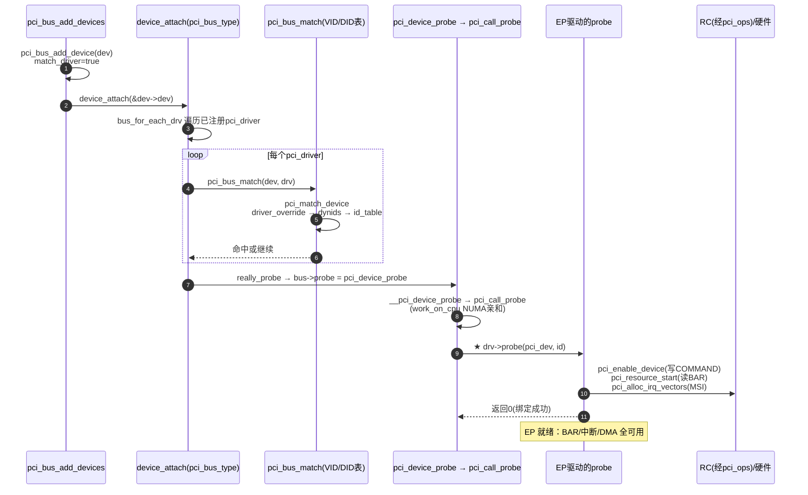

---
tags:
  - OS
  - Linux
---

# PCI Endpoint 驱动绑定与使用深度剖析（阶段 2·主线 C）

> **目的**: 主线 A 扫描产出 `pci_dev`、主线 B 分配好 BAR，本文件讲最后一步：`pci_dev` 如何匹配到 `pci_driver` 并 probe，以及 EP 驱动如何用 BAR/中断/DMA。
> **对象**: `drivers/pci/pci-driver.c` + `drivers/pci/bus.c`（Linux 6.6.99）。
> **前置**: 主线 A（扫描）、主线 B（资源）。

---

## 目录

1. [C1 总览：三步走（登记→匹配→probe）](#c1-总览三步走登记匹配probe)
2. [C2 绑定触发：pci_bus_add_devices](#c2-绑定触发pci_bus_add_devices)
3. [C3 匹配机制：pci_bus_match](#c3-匹配机制pci_bus_match)
4. [C4 probe 链：pci_device_probe](#c4-probe-链pci_device_probe)
5. [C5 EP 驱动如何使用设备](#c5-ep-驱动如何使用设备)
6. [C6 序列图](#c6-序列图)
7. [C7 心智模型](#c7-心智模型)
8. [C8 与 RC/主线A/B 的完整闭环](#c8-与-rc主线ab-的完整闭环)
9. [C9 验收清单](#c9-验收清单)

---

## C1 总览：三步走（登记→匹配→probe）

```
主线A扫描: pci_scan_device → pci_device_add (match_driver=false, 不绑定)
主线B资源: pci_bus_assign_resources (BAR地址写进配置空间)
主线C绑定: pci_bus_add_devices
              └─ pci_bus_add_device
                   └─ device_attach(dev)  ← LDM 通用通道
                        ├─ pci_bus_match (匹配ID表)
                        └─ pci_device_probe → drv->probe(pci_dev, id)
```

**与 platform 的对比**：

| | platform 绑定 | pci 绑定 |
|---|---|---|
| 匹配 | `platform_match`（compatible/name） | `pci_bus_match`（VID/DID/class） |
| probe 入口 | `platform_probe` → `drv->probe(pdev)` | `pci_device_probe` → `drv->probe(pdev, id)` |
| 触发 | device_add 时 | `pci_bus_add_devices`（显式） |

---

## C2 绑定触发：pci_bus_add_devices

### bus.c:366 / 334

```c
void pci_bus_add_devices(const struct pci_bus *bus)
{
	struct pci_dev *dev;
	struct pci_bus *child;

	list_for_each_entry(dev, &bus->devices, bus_list) {
		if (pci_dev_is_added(dev))
			continue;
		pci_bus_add_device(dev);       /* ① 先加本总线设备 */
	}
	list_for_each_entry(dev, &bus->devices, bus_list) {
		if (!pci_dev_is_added(dev))
			continue;
		child = dev->subordinate;      /* ② 再递归子总线 */
		if (child)
			pci_bus_add_devices(child);
	}
}

static void pci_bus_add_device(struct pci_dev *dev)
{
	...
	pci_create_sysfs_dev_files(dev);   /* /sys/bus/pci/devices 属性 */
	pci_proc_attach_device(dev);

	dev->match_driver = true;          /* ★ 之前扫描时是 false，现在放行匹配 */
	retval = device_attach(&dev->dev); /* ★★ 进入 LDM 通用绑定通道 */
	if (retval < 0 && retval != -EPROBE_DEFER)
		pci_warn(dev, "device attach failed (%d)\n", retval);
	pci_dev_assign_added(dev, true);
}
```

**要点**：`match_driver = true` 是"闸门"——扫描时不匹配，资源分配完才放行。

---

## C3 匹配机制：pci_bus_match

### pci-driver.c:1518

```c
static int pci_bus_match(struct device *dev, struct device_driver *drv)
{
	struct pci_dev *pci_dev = to_pci_dev(dev);
	struct pci_driver *pci_drv;
	const struct pci_device_id *found_id;

	if (!pci_dev->match_driver)
		return 0;                    /* 闸门关闭：不匹配 */

	pci_drv = to_pci_driver(drv);
	found_id = pci_match_device(pci_drv, pci_dev);
	return found_id ? 1 : 0;
}
```

### pci_match_device 优先级（pci-driver.c:136）

```c
static const struct pci_device_id *pci_match_device(struct pci_driver *drv,
						    struct pci_dev *dev)
{
	/* ① driver_override：强制指定驱动名 */
	if (dev->driver_override && strcmp(dev->driver_override, drv->name))
		return NULL;

	/* ② dynids：sysfs new_id 热加的动态 ID 优先 */
	spin_lock(&drv->dynids.lock);
	list_for_each_entry(dynid, &drv->dynids.list, node)
		if (pci_match_one_device(&dynid->id, dev)) { found_id = &dynid->id; break; }
	spin_unlock(&drv->dynids.lock);
	if (found_id)
		return found_id;

	/* ③ id_table：静态 ID 表逐个比较 */
	for (ids = drv->id_table; (found_id = pci_match_id(ids, dev)); ids = found_id + 1)
		...
	return NULL;
}
```

### pci_match_one_device：字段比较

```c
static inline const struct pci_device_id *
pci_match_one_device(const struct pci_device_id *id, const struct pci_dev *dev)
{
	if ((id->vendor == PCI_ANY_ID || id->vendor == dev->vendor) &&
	    (id->device == PCI_ANY_ID || id->device == dev->device) &&
	    (id->subvendor == PCI_ANY_ID || id->subvendor == dev->subsystem_vendor) &&
	    (id->subdevice == PCI_ANY_ID || id->subdevice == dev->subsystem_device) &&
	    !((id->class ^ dev->class) & id->class_mask))
		return id;
	return NULL;
}
```

> **与硬件模型（阶段0.3）印证**：匹配用的 `vendor/device/class` 正是主线 A 的 `pci_setup_device` 从配置空间读出来的。
---

## C4 probe 链：pci_device_probe

### 完整调用链（pci-driver.c）

```
device_attach(dev)                     [drivers/base/dd.c:1071]
 └─ __device_attach_driver
      └─ driver_probe_device → really_probe
           └─ bus->probe = pci_device_probe    [pci-driver.c:444]
                ├─ pci_assign_irq(pci_dev)      分配 INTx/路由
                ├─ __pci_device_probe(drv, pci_dev)  [pci-driver.c:407]
                │    ├─ id = pci_match_device(drv, pci_dev)  再次确认
                │    └─ pci_call_probe(drv, dev, id)   [pci-driver.c:350]
                │         ├─ 计算设备所在 NUMA node/cpu
                │         ├─ work_on_cpu(cpu, local_pci_probe, &ddi)  ★ NUMA亲和
                │         │    └─ local_pci_probe  [pci-driver.c:305]
                │         │         ├─ pm_runtime_get_sync(dev)
                │         │         ├─ pci_dev->driver = pci_drv
                │         │         └─ rc = pci_drv->probe(pci_dev, ddi->id)  ★★ 用户驱动
                │         └─ cpu_hotplug_disable/enable
                └─ pcibios_alloc_irq
```

### pci_call_probe 的 NUMA 亲和（pci-driver.c:350）

```c
static int pci_call_probe(struct pci_driver *drv, struct pci_dev *dev,
			  const struct pci_device_id *id)
{
	int error, node, cpu;
	struct drv_dev_and_id ddi = { drv, dev, id };

	node = dev_to_node(&dev->dev);   /* 设备所在 NUMA 节点 */
	dev->is_probed = 1;
	cpu_hotplug_disable();

	/* 选择节点上的 CPU 执行 probe（内存就近分配） */
	if (node >= 0 && node < MAX_NUMNODES && node_online(node) &&
	    !pci_physfn_is_probed(dev))
		cpu = cpumask_any_and(cpumask_of_node(node), wq_domain_mask);
	else
		cpu = nr_cpu_ids;

	if (cpu < nr_cpu_ids)
		error = work_on_cpu(cpu, local_pci_probe, &ddi);  /* ★ 在目标CPU上执行 */
	else
		error = local_pci_probe(&ddi);
	...
}
```

### local_pci_probe（pci-driver.c:305）

```c
static long local_pci_probe(void *_ddi)
{
	struct drv_dev_and_id *ddi = _ddi;
	struct pci_dev *pci_dev = ddi->dev;
	struct pci_driver *pci_drv = ddi->drv;

	pm_runtime_get_sync(dev);          /* 运行时PM 引用 +1 */
	pci_dev->driver = pci_drv;         /* ★ 先记账：dev->driver 指向驱动 */
	rc = pci_drv->probe(pci_dev, ddi->id);   /* ★★ 调用 EP 驱动 */
	if (!rc)
		return rc;
	if (rc < 0) {
		pci_dev->driver = NULL;      /* 失败回滚 */
		pm_runtime_put_sync(dev);
	}
	return rc;
}
```

> **要点**：`probe` 收到**两个参数**——`pci_dev`（设备）和 `id`（匹配到的 `pci_device_id`，可用 `id->driver_data` 区分同系列变体）。

---

## C5 EP 驱动如何使用设备

### 一个 EP 驱动的典型 probe（基于真实 API）

```c
static int my_ep_probe(struct pci_dev *pdev, const struct pci_device_id *id)
{
	/* ① 使能设备：写 PCI_COMMAND 打开 MEM/IO/总线主控 */
	ret = pci_enable_device(pdev);
	/*  → do_pci_enable_device → pcibios_enable_device
	 *     写 PCI_COMMAND |= MEMORY|MASTER （经 RC 的 pci_ops 配置写） */

	/* ② 取 BAR 资源（主线 B 分配好的地址） */
	bar0 = pci_resource_start(pdev, 0);   /* 返回 CPU 可访问地址 */
	len  = pci_resource_len(pdev, 0);

	/* ③ 申请中断：MSI 优先 */
	nvec = pci_alloc_irq_vectors(pdev, 1, 1, PCI_IRQ_MSI);
	irq  = pci_irq_vector(pdev, 0);
	ret  = request_irq(irq, my_isr, 0, "my_ep", priv);

	/* ④ 设置 DMA 掩码 */
	ret = dma_set_mask_and_coherent(&pdev->dev, DMA_BIT_MASK(64));

	/* ⑤ 注册子系统接口（如 netdev/block/char） */
	...
	return 0;
}
```

### 各 API 背后的硬件动作

| API | 硬件动作 | 前置（主线） |
|---|---|---|
| `pci_enable_device` | 写 `PCI_COMMAND`（0x04）MEM/MASTER 位 | A：配置访问经 pci_ops |
| `pci_resource_start` | 读主线 B 写入 BAR 的地址 | B：BAR 已分配 |
| `pci_alloc_irq_vectors` | 配置 MSI capability + 目标地址/数据 | RC：msi_domain + MSIBASE |
| `dma_set_mask` | 设置设备 DMA 能力位宽 | RC：DMA 域 |

---

## C6 序列图


---

## C7 心智模型

> **EP 绑定 = "扫描登记 + 资源就绪 + LDM 匹配"三步闭合**：
> 1. 扫描产出 `pci_dev` 但先不匹配（`match_driver=false`）；
> 2. 资源分配完成后 `pci_bus_add_devices` 放行匹配（`match_driver=true`）；
> 3. `device_attach` 走 LDM 通用通道：`pci_bus_match` 找驱动 → `pci_device_probe` → EP 驱动的 `probe(pci_dev, id)`。

### 一句话

> **"扫描造出设备，资源配上地址，LDM 牵线驱动；probe 里 EP 才真正开始用硬件。"**

---

## C8 与 RC/主线A/B 的完整闭环

把整个 RC → EP 链路串起来：

```
[RC] xilinx_pcie_probe → bridge->ops/sysdata → pci_host_probe
   │
   ▼
[主线A] pci_scan_child_bus（借 pci_ops 读VID）→ pci_dev 诞生（不匹配）
   │
   ▼
[主线B] pci_bus_size/assign（BAR 地址写入配置空间，经 pci_ops）
   │
   ▼
[主线C] pci_bus_add_devices → device_attach → pci_bus_match →
   │        pci_device_probe → EP驱动 probe()
   │
   ▼
[EP运行] EP 用 BAR（主线B给的地址）+ MSI（RC给的域）+ DMA
```

**贯穿全链的两根指针**（来自 RC 驱动注入）：
- `bus->ops`：配置空间读写（扫描/使能/MSI 配置都靠它）；
- `bus->sysdata`：每次 `map_bus` 找回 RC 私有数据（reg_base 等）。

---

## C9 验收清单

| # | 能力 | 自评 |
|---|---|---|
| 1 | 讲清 `match_driver` 闸门机制 | |
| 2 | 讲清匹配优先级（override→dynids→id_table） | |
| 3 | 讲清 `pci_call_probe` 的 NUMA 亲和 | |
| 4 | 讲清 probe 收到 (pci_dev, id) 两个参数 | |
| 5 | 讲清 `pci_enable_device`/`pci_resource_start`/`pci_alloc_irq_vectors` 的硬件动作 | |
| 6 | 画出 RC→A→B→C→EP 的完整闭环图 | |

---

## 阶段 2 三主线汇总对照

| 主线 | 文件 | 回答的问题 | 心智锚点 |
|---|---|---|---|
| A 扫描 | probe.c | 树上有什么、总线号怎么编 | 两轮扫描 + fn0 约束 + match_driver=false |
| B 资源 | setup-bus.c / setup-res.c | 地址从哪来、怎么不冲突 | size记账→assign贪心→写桥窗口 |
| C 绑定 | pci-driver.c | 设备怎么交给驱动 | match闸门→device_attach→probe |

> **下一步（可选支线）**：MSI/irq_domain 传递（`pci_set_msi_domain` → EP 的 MSI 申请）、PCIe 服务层（AER/PME/热插拔）、移除流程（`pci_stop_and_remove_bus_device`）。