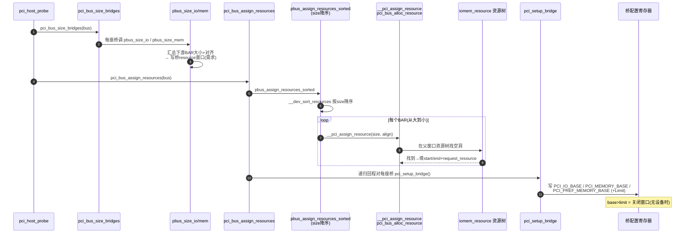

---
tags:
  - OS
  - Linux
---

# PCI 资源分配深度剖析（阶段 2·主线 B）

> **目的**: 硬件心智模型说"BAR=申请单，量尺寸后分配地址"，本文件剖析 Linux 的 size（量）/ assign（分）/ claim（认领）三阶段，并追踪地址如何写进桥窗口。
> **对象**: `drivers/pci/setup-bus.c` + `drivers/pci/setup-res.c`（Linux 6.6.99）。
> **前置**: 阶段0.4（BAR/地址空间）+ 主线 A（扫描产出的 `pci_bus`/`pci_dev` 与 BAR 尺寸）。

---

## 目录

1. [B1 总览：三种资源模式](#b1-总览三种资源模式)
2. [B2 size 阶段：算窗口需求](#b2-size-阶段算窗口需求)
3. [B3 assign 阶段：分配地址](#b3-assign-阶段分配地址)
4. [B4 写桥窗口：pci_setup_bridge](#b4-写桥窗口pci_setup_bridge)
5. [B5 claim 模式：认领固件配置](#b5-claim-模式认领固件配置)
6. [B6 序列图](#b6-序列图)
7. [B7 心智模型](#b7-心智模型)
8. [B8 与阶段0/主线A/RC 的联动](#b8-与阶段0主线arc-的联动)
9. [B9 验收清单](#b9-验收清单)

---

## B1 总览：三种资源模式

`pci_host_probe` 里按是否 `PCI_PROBE_ONLY` 二选一（probe.c:3111）：

| 模式 | 触发条件 | 流程 | 适用 |
|---|---|---|---|
| **Size + Assign** | 未设 PROBE_ONLY | `pci_bus_size_bridges()` → `pci_bus_assign_resources()` | 内核自主分配（主流） |
| **Claim** | 设了 PROBE_ONLY | `pci_bus_claim_resources()` | 固件已配好，内核只登记 |
| **Rescan**（补充） | 热插拔新设备 | `pci_assign_unassigned_bus_resources()` | 给新插入设备补分配 |

### 三条路径的关系

```
pci_host_probe()
  ├─ PROBE_ONLY → pci_bus_claim_resources(bus)      [B5]
  └─ 否则       → pci_bus_size_bridges(bus)          [B2]
                  → pci_bus_assign_resources(bus)     [B3]
                       └─ 递归时 pci_setup_bridge()   [B4] 写桥窗口
```

---

## B2 size 阶段：算窗口需求

### pci_bus_size_bridges → __pci_bus_size_bridges

递归遍历总线树，对每座桥计算"下游所有设备 BAR 之和"作为窗口需求，记到桥的 `resource[PCI_BRIDGE_*_WINDOW]`。

```c
// setup-bus.c:1323
void pci_bus_size_bridges(struct pci_bus *bus)
{
	__pci_bus_size_bridges(bus, NULL);   /* 递归 */
}
```

`__pci_bus_size_bridges` 对每座桥分别调三个窗口函数：

| 窗口 | 函数 | 计算什么 |
|---|---|---|
| I/O 窗口 | `pbus_size_io()` setup-bus.c:870 | 下游所有 I/O BAR 大小之和 |
| 非预取 MEM | `pbus_size_mem()` setup-bus.c:980 | 下游非预取内存 BAR 之和 |
| 预取 MEM | `pbus_size_mem()`（不同 type 参数） | 下游预取/64 位 BAR 之和 |

### pbus_size_io 要点（setup-bus.c:870）

```c
static void pbus_size_io(struct pci_bus *bus, ...)
{
	struct resource *b_res = find_bus_resource_of_type(bus, IORESOURCE_IO, IORESOURCE_IO);
	...
	list_for_each_entry(dev, &bus->devices, bus_list) {
		pci_dev_for_each_resource(dev, r) {
			if (r->parent || !(r->flags & IORESOURCE_IO))
				continue;
			r_size = resource_size(r);
			if (r_size < 0x400)
				size += r_size;      /* 小窗口（ISA 可能重对齐） */
			else
				size1 += r_size;
			align = pci_resource_alignment(dev, r);
			if (align > min_align)
				min_align = align;   /* 取最大对齐 */
		}
	}
	size0 = calculate_iosize(size, min_size, size1, ...);
	b_res->start = min_align;
	b_res->end = b_res->start + size0 - 1;   /* 记录"需求"：start=对齐, end=需求大小 */
	b_res->flags |= IORESOURCE_STARTALIGN;   /* 标记按 start 对齐 */
}
```

### pbus_size_mem 要点（setup-bus.c:980）

```c
static int pbus_size_mem(struct pci_bus *bus, unsigned long mask,
			 unsigned long type, unsigned long type2, unsigned long type3, ...)
{
	struct resource *b_res = find_bus_resource_of_type(bus, mask | IORESOURCE_PREFETCH, type);
	...
	list_for_each_entry(dev, &bus->devices, bus_list) {
		pci_dev_for_each_resource(dev, r, i) {
			if (r->parent || (r->flags & IORESOURCE_PCI_FIXED) || ...)
				continue;
			r_size = resource_size(r);
			align = pci_resource_alignment(dev, r);
			order = __ffs(align) - 20;   /* 按对齐分级：1MB/2MB/... */
			size += max(r_size, align);
			aligns[order] += ...;          /* 记录各级对齐的需求 */
		}
	}
	min_align = calculate_mem_align(aligns, max_order);   /* 最小对齐保证全放下 */
	b_res->start = min_align;
	b_res->end = b_res->start + size0 - 1;
}
```

> **心智锚点（size 阶段）**：只"记账"不"分钱"——把下游需求汇总成一个"起始对齐 + 大小"，写进桥的 `resource` 窗口。`IORESOURCE_STARTALIGN` 标记告诉分配器"按 start 对齐"。
---

## B3 assign 阶段：分配地址

### 入口链

```
pci_bus_assign_resources(bus)                [setup-bus.c:1404]
 └─ __pci_bus_assign_resources(bus, NULL, NULL)  [setup-bus.c:1368]
      └─ pbus_assign_resources_sorted(bus, ...)   [setup-bus.c:490]
           ├─ __dev_sort_resources()  把所有 BAR 收集并排序
           └─ __assign_resources_sorted(&head, ...)
                └─ 逐个 __pci_assign_resource()   [setup-res.c]
                     └─ _pci_assign_resource()    [setup-res.c:309]
                          └─ __pci_assign_resource(bus, dev, resno, size, align)
                               └─ pci_bus_alloc_resource()  ← 真正从资源树找空洞
      └─ 递归子总线 + 每座桥 pci_setup_bridge()   [B4]
```

### 为什么排序：贪心（size 降序）

```c
// __dev_sort_resources 用 list_sort 按大小降序；__assign_resources_sorted 按序分配
```

**理由**：大 BAR 先分配能减少碎片。假设两个 BAR：1MB 和 4KB，若先放 4KB，1MB 可能因对齐被挤到更远处，浪费中间空洞；先放大块更紧凑。

### __pci_assign_resource（setup-res.c:261）

```c
static int __pci_assign_resource(struct pci_bus *bus, struct pci_dev *dev,
		int resno, resource_size_t size, resource_size_t align)
{
	struct resource *res = dev->resource + resno;
	resource_size_t min;
	int ret;

	min = (res->flags & IORESOURCE_IO) ? PCIBIOS_MIN_IO : PCIBIOS_MIN_MEM;

	/* ① 先试精确的"预取"窗口 */
	ret = pci_bus_alloc_resource(bus, res, size, align, min,
				     IORESOURCE_PREFETCH | IORESOURCE_MEM_64,
				     pcibios_align_resource, dev);
	if (ret == 0)
		return 0;

	/* ② 32 位预取窗口可容纳 64 位预取 */
	if ((res->flags & (IORESOURCE_PREFETCH | IORESOURCE_MEM_64)) ==
	     (IORESOURCE_PREFETCH | IORESOURCE_MEM_64)) {
		ret = pci_bus_alloc_resource(bus, res, size, align, min,
					     IORESOURCE_PREFETCH, ...);
		if (ret == 0)
			return 0;
	}

	/* ③ 兜底：任意内存窗口 */
	if (res->flags & (IORESOURCE_PREFETCH | IORESOURCE_MEM_64))
		ret = pci_bus_alloc_resource(bus, res, size, align, min, 0, ...);
	return ret;
}
```

**要点**：`pci_bus_alloc_resource` 在父窗口（桥窗口或 `iomem_resource`）资源树里找一段空闲地址，找到后把 `res->start/end` 填好并 `request_resource` 挂进树（互斥保证不冲突）。

### _pci_assign_resource 的上溯（setup-res.c:309）

```c
static int _pci_assign_resource(struct pci_dev *dev, int resno,
				resource_size_t size, resource_size_t min_align)
{
	struct pci_bus *bus;
	int ret;

	bus = dev->bus;
	while ((ret = __pci_assign_resource(bus, dev, resno, size, min_align))) {
		if (!bus->parent || !bus->self->transparent)
			break;
		bus = bus->parent;   /* 对透明桥（subtractive decode）向上重试 */
	}
	return ret;
}
```

---

## B4 写桥窗口：pci_setup_bridge

### 入口（setup-bus.c:685）

```c
static void pci_setup_bridge(struct pci_bus *bus)
{
	pci_setup_bridge_io(bus);        /* 571: PCI_IO_BASE/LIMIT */
	pci_setup_bridge_mmio(bus);      /* 608: PCI_MEMORY_BASE/LIMIT */
	pci_setup_bridge_mmio_pref(bus); /* 627: PCI_PREF_MEMORY_BASE/LIMIT */
}
```

### 各窗口写入（摘核心）

```c
// pci_setup_bridge_mmio：写 PCI_MEMORY_BASE（0x20）
res = &bridge->resource[PCI_BRIDGE_MEM_WINDOW];
pcibios_resource_to_bus(bridge->bus, &region, res);   /* CPU地址→总线地址 */
if (res->flags & IORESOURCE_MEM) {
	l = (region.start >> 16) & 0xfff0;
	l |= region.end & 0xfff00000;
} else {
	l = 0x0000fff0;   /* 无窗口：base > limit，关闭 */
}
pci_write_config_dword(bridge, PCI_MEMORY_BASE, l);
```

**要点**：
- Base/Limit 寄存器位宽有限（如 MEMORY_BASE 只有高 16 位 + 低 4 位固定 0），所以 base/limit 都要右移/掩码后再写；
- **无窗口时写 `base > limit`（0x0000fff0）**——这是 PCI 规范要求的"关闭窗口"方式（setup-bus.c 注释明确说明）。

---

## B5 claim 模式：认领固件配置

### 适用场景

固件（BIOS/UBoot）已经把 BAR 和桥窗口配好，内核 `PCI_PROBE_ONLY` 时只做"登记"，不重新分配。

### pci_claim_resource（setup-res.c:135）

```c
int pci_claim_resource(struct pci_dev *dev, int resource)
{
	struct resource *res = &dev->resource[resource];
	struct resource *root, *conflict;

	if (res->flags & IORESOURCE_UNSET) {
		... return -EINVAL;   /* 没分配地址，无法认领 */
	}
	if (res->flags & IORESOURCE_ROM_SHADOW)
		return 0;

	root = pci_find_parent_resource(dev, res);   /* 找父窗口 */
	if (!root) { ... return -EINVAL; }

	conflict = request_resource_conflict(root, res);  /* ★ 挂进资源树，检测冲突 */
	if (conflict) { ... return -EBUSY; }
	return 0;
}
```

**要点**：`request_resource_conflict` 把固件给定的地址挂进 `iomem_resource`/`ioport_resource` 树——**认领 = 让内核"承认"这块地址被占用**，避免后续分配撞车。

> **心智锚点**：claim 与 assign 的区别 = "登记固件给的" vs "自己从树里挖"；两者都通过资源树保证全局互斥。
---

## B6 序列图



---

## B7 心智模型

> **资源分配 = 给设备树"发地址牌照"**：
> 1. **size**（量）：每座桥统计下游需求，写成"对齐 + 大小"的窗口需求；
> 2. **assign**（分）：按 size 降序，从资源树挖空洞填进每个 BAR，挂树互斥；
> 3. **写桥窗口**（开）：把窗口基址/上限写进桥的 Base/Limit 寄存器，桥才能转发。

### 一句话

> **"先量后分，从大到小；分配写 BAR，窗口写桥；资源树保证不撞车。"**

---

## B8 与阶段0/主线A/RC 的联动

| 关联 | 说明 |
|---|---|
| 阶段0.4（BAR） | BAR 尺寸在主线 A 扫描时已量好（`pci_read_bases`），这里直接使用 |
| 主线 A（扫描） | 扫描建立 `pci_bus` 树与 `bus->resources`（桥窗口），size/assign 就在这棵树上做 |
| RC（pcie-xilinx） | `bridge->windows`（IO/MEM/BUS 窗口）在 `pci_register_host_bridge` 时挂到根总线 `resources`，成为分配时的父窗口 |
| 地址翻译 | 写桥窗口前 `pcibios_resource_to_bus()` 做 CPU地址→总线地址换算（host-bridge.c:51） |

---

## B9 验收清单

| # | 能力 | 自评 |
|---|---|---|
| 1 | 讲清 size/assign/claim 三种模式的区别 | |
| 2 | 讲清 size 阶段"记账"（对齐+大小）而非分配 | |
| 3 | 讲清为什么按 size 降序贪心分配 | |
| 4 | 讲清 `__pci_assign_resource` 的三级窗口尝试 | |
| 5 | 讲清写桥窗口的 base>limit=关闭 | |
| 6 | 讲清 claim 用 `request_resource_conflict` 登记并防冲突 | |