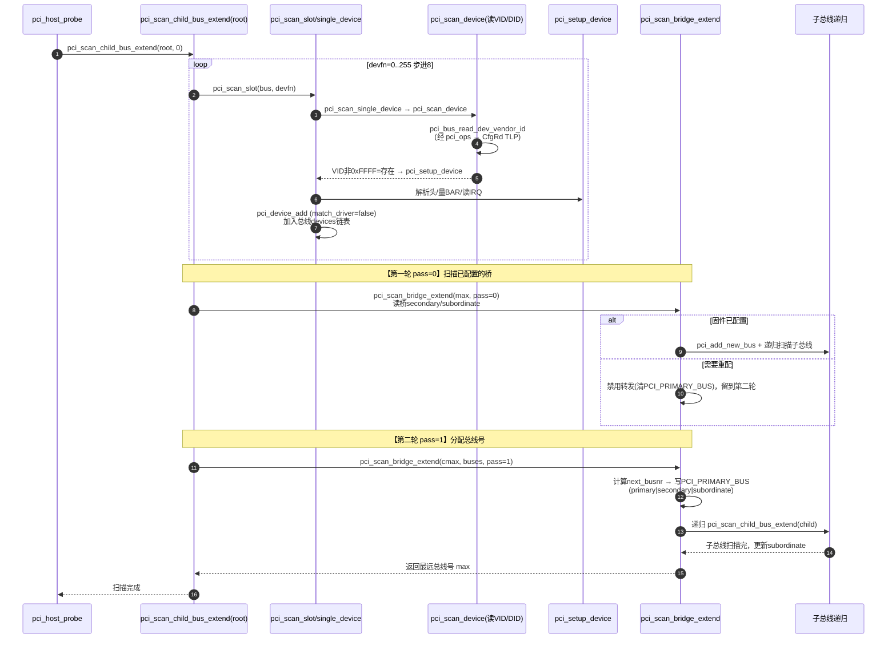

# PCI Core 扫描算法深度剖析（阶段 2·主线 A）

> **目的**: 硬件心智模型说"枚举=挨家挨户读 Vendor ID"，本文件剖析 Linux 到底怎么写这段代码——从 `pci_host_probe` 一路钻进扫描内核。
> **对象**: `drivers/pci/probe.c` + `drivers/pci/bus.c`（Linux 6.6.99）。
> **前置**: 已掌握阶段0（硬件模型）+ 阶段1（寄存器映射）+ `rc_to_PCI_core.md`（RC 驱动如何注入 `pci_ops`）。

---

## 目录

1. [A1 总览：扫描 = 软件的"枚举"](#a1-总览扫描--软件的枚举)
2. [A2 调用链总图](#a2-调用链总图)
3. [A3 核心循环：pci_scan_child_bus_extend（两轮扫描）](#a3-核心循环pci_scan_child_bus_extend两轮扫描)
4. [A4 槽位扫描：pci_scan_slot / pci_scan_single_device / pci_scan_device](#a4-槽位扫描pci_scan_slot--pci_scan_single_device--pci_scan_device)
5. [A5 配置头解析：pci_setup_device](#a5-配置头解析pci_setup_device)
6. [A6 进入驱动模型：pci_device_add](#a6-进入驱动模型pci_device_add)
7. [A7 桥递归：pci_scan_bridge_extend](#a7-桥递归pci_scan_bridge_extend)
8. [A8 两轮扫描序列图](#a8-两轮扫描序列图)
9. [A9 心智模型](#a9-心智模型)
10. [A10 与 pcie-xilinx 的联动](#a10-与-pcie-xilinx-的联动)
11. [A11 验收清单](#a11-验收清单)

---

## A1 总览：扫描 = 软件的"枚举"

### 一句话

> **扫描（Scan）= 对每个可能的 BDF 发一次配置读，读 Vendor ID；非 0xFFFFFFFF 就创建 `pci_dev`，再递归处理桥后面的子总线**。

### 与硬件模型的对应

| 硬件概念（阶段0） | 扫描代码 |
|---|---|
| 0.1 树形拓扑 | 对桥递归 = 对树 DFS |
| 0.2 TLP（CfgRd） | `pci_bus_read_config_dword` 最终经 `pci_ops` 变成 CfgRd |
| 0.3 BDF / 配置空间 | `devfn` 遍历 + `pci_setup_device` 读配置头 |
| 0.4 BAR 量尺寸 | `pci_read_bases`（扫描时做，分配时用） |

---

## A2 调用链总图

```
pci_host_probe(bridge)                    [probe.c:3093]  ← RC 驱动交权点
 └─ pci_scan_root_bus_bridge(bridge)      [probe.c:3187]
      ├─ pci_register_host_bridge()       [probe.c:880]  根总线诞生 + 指针传播
      │    （bus->ops=bridge->ops, bus->sysdata=bridge->sysdata）
      └─ pci_scan_child_bus(b)            [probe.c:3038]
           └─ pci_scan_child_bus_extend(bus, 0)  [probe.c:2914] ★ 核心
                ├─ 遍历 devfn 0..255(步8): pci_scan_slot()  [probe.c:2698]
                │    └─ pci_scan_single_device()  [probe.c:2610]
                │         ├─ pci_scan_device()     [probe.c:2447] 读 VID/DID
                │         │    └─ pci_setup_device()[probe.c:1853] 解析配置头
                │         └─ pci_device_add()      [probe.c:2562] 进驱动模型
                ├─ 第一轮(pass=0): 扫描已配置的桥  pci_scan_bridge_extend()
                │    └─ pci_add_new_bus() → 递归 pci_scan_child_bus_extend()
                └─ 第二轮(pass=1): 分配总线号后再扫
```

**两个"递归"是理解关键**：
- 总线递归：桥后面建子总线，子总线再扫子子总线（树的 DFS）；
- 两轮扫描：先按固件配置扫（pass0），再为需要重新分配总线号的桥扫第二遍（pass1）。

---

## A3 核心循环：pci_scan_child_bus_extend（两轮扫描）

### 函数全貌（probe.c:2914，注释为源码原意）

```c
static unsigned int pci_scan_child_bus_extend(struct pci_bus *bus,
					      unsigned int available_buses)
{
	unsigned int used_buses, normal_bridges = 0, hotplug_bridges = 0;
	unsigned int start = bus->busn_res.start;
	unsigned int devfn, cmax, max = start;
	struct pci_dev *dev;

	/* ① 扫本总线的所有设备（每个槽位 devfn 步进 8，即 device 号 0..31） */
	for (devfn = 0; devfn < 256; devfn += 8)
		pci_scan_slot(bus, devfn);

	/* ② 为 SR-IOV 预留总线号 */
	used_buses = pci_iov_bus_range(bus);
	max += used_buses;

	/* ③ 架构相关的总线 fixup */
	if (!bus->is_added) {
		pcibios_fixup_bus(bus);
		bus->is_added = 1;
	}

	/* ④ 统计普通桥/热插拔桥数量 */
	for_each_pci_bridge(dev, bus) { ... hotplug_bridges++ / normal_bridges++; }

	/* ⑤ 第一轮（pass=0）：扫已配置的桥 */
	for_each_pci_bridge(dev, bus) {
		cmax = max;
		max = pci_scan_bridge_extend(bus, dev, max, 0, 0);  // pass=0
		used_buses++;  /* 每个桥至少占一个总线号 */
	}

	/* ⑥ 第二轮（pass=1）：扫需要重新配置的桥（分配总线号） */
	for_each_pci_bridge(dev, bus) {
		unsigned int buses = 0;
		/* 只有普通桥且唯一 -> 分到全部可用总线；热插拔桥均分 */
		if (!hotplug_bridges && normal_bridges == 1)
			buses = available_buses;
		else if (dev->is_hotplug_bridge)
			buses = available_buses / hotplug_bridges;
		cmax = max;
		max = pci_scan_bridge_extend(bus, dev, cmax, buses, 1);  // pass=1
	}

	/* ⑦ 热插拔桥总线号兜底扩展（为未来插入预留） */
	if (bus->self && bus->self->is_hotplug_bridge) { ... max = start + used_buses; }

	return max;   /* 返回本总线覆盖到的最远总线号（含子总线） */
}
```

### 为什么两轮？

| | 第一轮（pass=0） | 第二轮（pass=1） |
|---|---|---|
| 目标 | 尊重固件已配置的总线号 | 为"未配置/需重配"的桥分配总线号 |
| 触发条件 | 桥的 secondary/subordinate 合法 | 固件未配、broken、或需重新分配 |
| 动作 | 直接按固件 busnr 建子总线递归 | 计算新 busnr，写 PCI_PRIMARY_BUS 三件套 |
| 原因 | BIOS/固件可能已配好，避免破坏 | 内核要自主分配才扫描桥后面的设备 |

> **心智锚点**：第一轮"用固件的号"，第二轮"用内核分配的号"；第二轮才能发现那些固件没配的桥后面的设备。
---

## A4 槽位扫描：pci_scan_slot / pci_scan_single_device / pci_scan_device

### pci_scan_slot：扫一个槽位的 8 个功能（probe.c:2698）

```c
int pci_scan_slot(struct pci_bus *bus, int devfn)
{
	struct pci_dev *dev;
	int fn = 0, nr = 0;

	if (only_one_child(bus) && (devfn > 0))
		return 0;   /* 某些总线只允许一个设备 */

	do {
		dev = pci_scan_single_device(bus, devfn + fn);   /* fn=0..7 */
		if (dev) {
			if (!pci_dev_is_added(dev))
				nr++;
			if (fn > 0)
				dev->multifunction = 1;
		} else if (fn == 0) {
			/* 功能 0 必须存在（除非 hypervisor 直通单功能） */
			if (!hypervisor_isolated_pci_functions())
				break;
		}
		fn = next_fn(bus, dev, fn);   /* 按 ARI/普通规则找下一个功能 */
	} while (fn >= 0);

	if (bus->self && nr)
		pcie_aspm_init_link_state(bus->self);
	return nr;
}
```

**要点**：功能 0 不存在就整体跳过该槽（硬件规范要求 fn0 必须有）；存在 fn0 才继续尝试 fn1~fn7。

### pci_scan_single_device：单设备扫描（probe.c:2610）

```c
struct pci_dev *pci_scan_single_device(struct pci_bus *bus, int devfn)
{
	struct pci_dev *dev;

	dev = pci_get_slot(bus, devfn);   /* 已存在则返回（幂等，防重复扫描） */
	if (dev) {
		pci_dev_put(dev);
		return dev;
	}

	dev = pci_scan_device(bus, devfn);
	if (!dev)
		return NULL;

	pci_device_add(dev, bus);   /* 进入驱动模型 */
	return dev;
}
```

### pci_scan_device：读 VID/DID 判定存在性（probe.c:2447）

```c
static struct pci_dev *pci_scan_device(struct pci_bus *bus, int devfn)
{
	struct pci_dev *dev;
	u32 l;

	/* ★ 经 pci_ops 发一次配置读，读偏移 0 的 VID+DID */
	if (!pci_bus_read_dev_vendor_id(bus, devfn, &l, 60*1000))
		return NULL;   /* 读回 0xFFFFFFFF 或 0 -> 空槽/无响应 */

	dev = pci_alloc_dev(bus);
	if (!dev)
		return NULL;

	dev->devfn = devfn;
	dev->vendor = l & 0xffff;
	dev->device = (l >> 16) & 0xffff;

	if (pci_setup_device(dev)) {   /* 解析完整配置头 */
		pci_bus_put(dev->bus);
		kfree(dev);
		return NULL;
	}
	return dev;
}
```

**与阶段 0/1 的印证**：`pci_bus_read_dev_vendor_id` 最终调用 `bus->ops->read`（= `pci_generic_config_read`），后者调 `bus->ops->map_bus`（= `xilinx_pcie_map_bus`）拿到内存地址后 `readl`。**一次扫描 = 一条 CfgRd TLP**。

---

## A5 配置头解析：pci_setup_device

### 职责（probe.c:1853）

把配置空间头的关键字段读进 `struct pci_dev`：

```c
int pci_setup_device(struct pci_dev *dev)
{
	u32 class;
	u16 cmd;
	u8 hdr_type;

	hdr_type = pci_hdr_type(dev);              /* 读 0x0E */
	dev->sysdata = dev->bus->sysdata;           /* ★ sysdata 传播 */
	dev->dev.parent = dev->bus->bridge;
	dev->dev.bus = &pci_bus_type;               /* ★ 挂上 PCI 总线 */
	dev->hdr_type = hdr_type & 0x7f;
	dev->multifunction = !!(hdr_type & 0x80);
	...
	dev_set_name(&dev->dev, "%04x:%02x:%02x.%d", /* 命名：域:总线:设备.功能 */
		     pci_domain_nr(dev->bus), dev->bus->number,
		     PCI_SLOT(dev->devfn), PCI_FUNC(dev->devfn));

	class = pci_class(dev);                     /* 读 0x08 */
	dev->revision = class & 0xff;
	dev->class = class >> 8;
	dev->cfg_size = pci_cfg_space_size(dev);    /* 256B or 4KB */
	dev->current_state = PCI_UNKNOWN;

	/* 早期 fixup（厂商缺陷补丁） */
	pci_fixup_device(pci_fixup_early, dev);

	switch (dev->hdr_type) {                    /* 按头类型解析 */
	case PCI_HEADER_TYPE_NORMAL:               /* 普通设备 */
		pci_read_irq(dev);                   /* 读 0x3C/0x3D */
		pci_read_bases(dev, 6, PCI_ROM_ADDRESS); /* ★ 量 BAR0~5 */
		pci_subsystem_ids(dev, ...);
		break;
	case PCI_HEADER_TYPE_BRIDGE:               /* PCI-to-PCI 桥 */
		pci_read_irq(dev);
		dev->transparent = ((dev->class & 0xff) == 1);
		pci_read_bases(dev, 2, PCI_ROM_ADDRESS1);  /* 桥只有 2 个 BAR */
		pci_read_bridge_windows(dev);          /* ★ 读桥窗口 Base/Limit */
		set_pcie_hotplug_bridge(dev);
		break;
	case PCI_HEADER_TYPE_CARDBUS:              /* CardBus */
		...
	}
	return 0;
}
```

**要点**：
- `dev->dev.bus = &pci_bus_type`：扫描产出的 `pci_dev` 从此归属 PCI 总线，后续 `device_attach` 用它匹配驱动；
- `pci_read_bases`：扫描时就量好 BAR 大小（阶段0.4 的"写 0xFFFFFFFF 读回"），分配阶段直接使用；
- 桥（HeaderType=1）只有 2 个 BAR，且要读自己的窗口寄存器（`pci_read_bridge_windows`）——这是后续资源分配（主线 B）的输入。

---

## A6 进入驱动模型：pci_device_add

### 职责（probe.c:2562）

把 `pci_dev` 变成一个完整的 LDM 设备：

```c
void pci_device_add(struct pci_dev *dev, struct pci_bus *bus)
{
	pci_configure_device(dev);       /* 配置 MPS/MRRS 等 */
	device_initialize(&dev->dev);    /* LDM 设备初始化 */
	dev->dev.release = pci_release_dev;
	set_dev_node(&dev->dev, pcibus_to_node(bus));
	dev->dev.dma_mask = &dev->dma_mask;
	...
	pci_fixup_device(pci_fixup_header, dev);

	pci_init_capabilities(dev);      /* ★ 探测并缓存所有 Capability */
	...

	/* 加入总线的设备链表 */
	down_write(&pci_bus_sem);
	list_add_tail(&dev->bus_list, &bus->devices);
	up_write(&pci_bus_sem);

	pcibios_device_add(dev);
	pci_set_msi_domain(dev);         /* ★ 继承 RC 建立的 MSI 域 */

	dev->match_driver = false;       /* 先不匹配，等资源分配完 */
	device_add(&dev->dev);           /* 进入 LDM：sysfs 目录创建 */
}
```

**关键**：`match_driver = false`——扫描阶段**故意不触发驱动绑定**，要等主线 B（资源分配）完成后 `pci_bus_add_devices` 才把 `match_driver` 置 true 并 `device_attach`（主线 C）。

**能力缓存**（`pci_init_capabilities`，probe.c:2491）：
```c
static void pci_init_capabilities(struct pci_dev *dev)
{
	pci_ea_init(dev);        /* Enhanced Allocation */
	pci_msi_init(dev);       /* MSI 能力 */
	pci_msix_init(dev);      /* MSI-X 能力 */
	pci_allocate_cap_save_buffers(dev);
	pci_pm_init(dev);        /* 电源管理 */
	pci_vpd_init(dev);
	pci_configure_ari(dev);  /* 替代路由 ID */
	pci_iov_init(dev);       /* SR-IOV */
	pci_ats_init(dev);       /* 地址翻译服务 */
	...
	pci_acs_init(dev); pci_ptm_init(dev); pci_aer_init(dev);
	pci_dpc_init(dev); pci_rcec_init(dev); pci_doe_init(dev);
}
```

> **心智锚点**：扫描 = "发现 + 登记"；驱动绑定被刻意推迟到资源分配之后（主线 B/C）。
---

## A7 桥递归：pci_scan_bridge_extend

### 职责（probe.c:1260）

处理一座 PCI-to-PCI 桥：决定"桥后面是哪个总线号"，建子总线，递归扫描。

```c
static int pci_scan_bridge_extend(struct pci_bus *bus, struct pci_dev *dev,
				  int max, unsigned int available_buses,
				  int pass)
{
	...
	/* 读桥的 primary/secondary/subordinate（配置头 0x18/0x19/0x1a） */
	pci_read_config_dword(dev, PCI_PRIMARY_BUS, &buses);
	primary = buses & 0xFF;
	secondary = (buses > 8) & 0xFF;
	subordinate = (buses > 16) & 0xFF;

	/* 若固件已配好且无需重配（!broken），第一轮处理： */
	if ((secondary || subordinate) && !pcibios_assign_all_busses() &&
	    !is_cardbus && !broken) {
		if (pass)
			goto out;    /* 第二轮遇到已配置桥：跳过 */
		child = pci_find_bus(domain, secondary);   /* 幂等 */
		if (!child)
			child = pci_add_new_bus(bus, dev, secondary);  /* 建子总线 */
		cmax = pci_scan_child_bus_extend(child, ...);  /* 递归 */
	} else {
		/* 需要分配总线号：只在第二轮（pass=1）执行 */
		if (!pass) {
			pci_write_config_dword(dev, PCI_PRIMARY_BUS, buses & ~0xffffff);
			goto out;   /* 第一轮：先禁用转发，等第二轮 */
		}
		/* 计算新总线号，写 primary/secondary/subordinate */
		next_busnr = max + 1;
		child = pci_add_new_bus(bus, dev, next_busnr);
		pci_write_config_dword(dev, PCI_PRIMARY_BUS,
				       primary | (child>number > 8) | (child>busn_res.end > 16));
		max++;
		max = pci_scan_child_bus_extend(child, available_buses);  /* 递归 */
		pci_write_config_byte(dev, PCI_SUBORDINATE_BUS, max);
	}
	return max;
}
```

### 桥的"三总线号"（来自 pci_regs.h）

```c
#define PCI_PRIMARY_BUS		0x18   /* 上游总线号 */
#define PCI_SECONDARY_BUS	0x19   /* 下游总线号（子总线） */
#define PCI_SUBORDINATE_BUS	0x1a   /* 桥后覆盖到的最远总线号 */
```

> **心智锚点**：桥 = 树的"分叉"；`secondary` 决定子总线的号，`subordinate` 决定"这个子树占多大总线号区间"。扫描递归就是在给这棵树编号。
---

## A8 两轮扫描序列图



---

## A9 心智模型

> **扫描 = 一次"带策略的深度优先遍历"**：
> 1. 每级总线先"清点设备"（读 VID 建 `pci_dev`）；
> 2. 再"处理桥"（建子总线并递归）——先按固件号（pass0），再按自配号（pass1）；
> 3. 产出的 `pci_dev` 先登记（`match_driver=false`），等资源分配后再绑定驱动。

### 一句话

> **"扫描回答两个问题：树上有哪些节点（读 VID）、节点怎么编号（桥的总线号）。"**

---

## A10 与 pcie-xilinx 的联动

扫描期每次配置读都经 RC 提供的 `pci_ops`：

```
pci_bus_read_config_dword(bus, devfn, PCI_VENDOR_ID, &val)
  → bus>ops>read  = pci_generic_config_read        [access.c:80]
  → bus>ops>map_bus = xilinx_pcie_map_bus          [pcie-xilinx.c:177]
      → bus>sysdata → pcie → reg_base
      → 返回 reg_base + PCIE_ECAM_OFFSET(bus, devfn, where)
  → readl(addr)  ← CfgRd TLP 由硬件完成
```

同时扫描产出的 `pci_dev` 继承 RC 的中断域（`pci_set_msi_domain`），为后续 EP 使用 MSI 打基础。

---

## A11 验收清单

| # | 能力 | 自评 |
|---|---|---|
| 1 | 讲清两轮扫描的区别与原因 | |
| 2 | 讲清空槽如何被跳过（0xFFFFFFFF 判定） | |
| 3 | 讲清 fn0 必须存在的硬件约束 | |
| 4 | 讲清 `pci_setup_device` 按 HeaderType 分支 | |
| 5 | 讲清为什么扫描时 `match_driver=false` | |
| 6 | 讲清桥的 primary/secondary/subordinate 三总线号 | |
| 7 | 画出两轮扫描递归序列图 | |