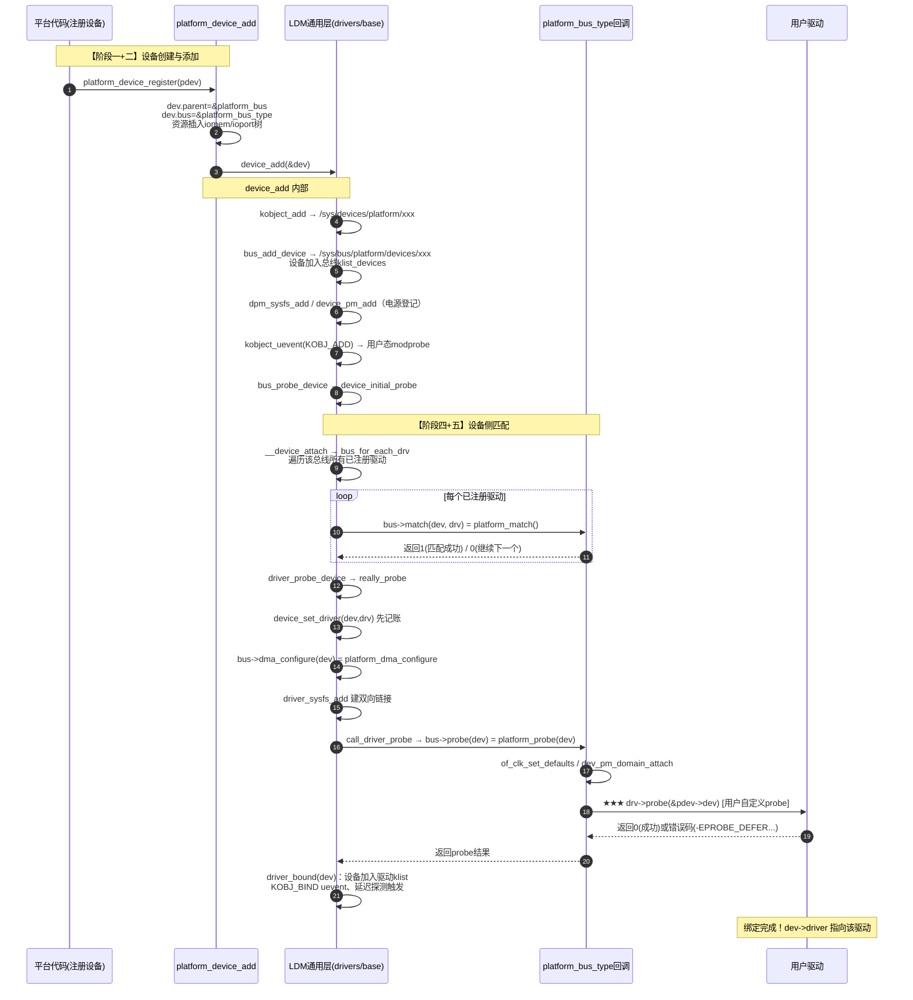
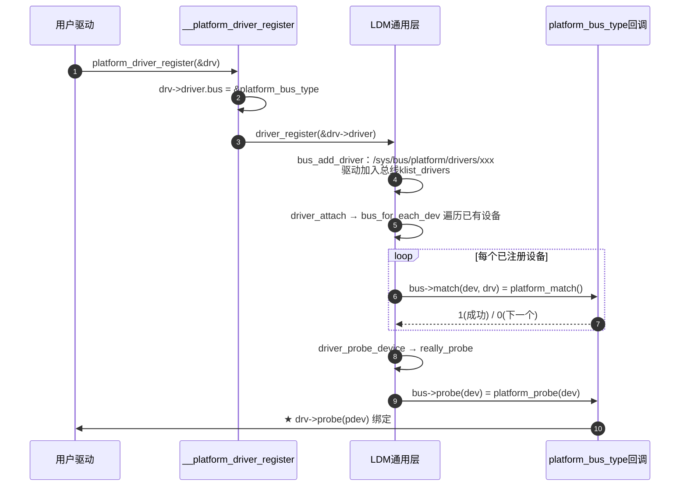

# Linux LDM（Device Driver Model）最顶层设计与 Platform Bus 分析

> **分析对象**: Linux 6.6.99 内核源码
> **核心文件**: `drivers/base/init.c`、`drivers/base/bus.c`、`drivers/base/dd.c`、`drivers/base/core.c`、`drivers/base/driver.c`、`drivers/base/platform.c`
> **头文件**: `include/linux/device.h`、`include/linux/device/bus.h`、`include/linux/device/driver.h`、`include/linux/platform_device.h`
> **分析依据**: 内核官方文档 `Documentation/driver-api/driver-model/`（overview / platform / binding）+ 当前版本源码逐行核对
> **需求对应**: 需求1——以 platform bus 为例子讲"创建 → 添加 → 触发 match → 调用用户 probe"的完整流程序列并画序列图；需求2——评估并修正"driver 与 LDM 的边界与功能认知"。

---

## 目录

1. [LDM 是什么：设计目标与统一抽象](#1-ldm-是什么设计目标与统一抽象)
2. [LDM 顶层初始化流程（driver_init）](#2-ldm-顶层初始化流程driver_init)
3. [platform bus 的两个核心对象：platform_bus 与 platform_bus_type](#3-platform-bus-的两个核心对象platform_bus-与-platform_bus_type)
4. [LDM 四大核心结构体及"继承"关系](#4-ldm-四大核心结构体及继承关系)
5. [需求1：完整流程序列——创建、添加、匹配、probe](#5-需求1完整流程序列创建添加匹配probe)
6. [需求2：driver 与 LDM 的边界与功能认知评估与修正](#6-需求2driver-与-ldm-的边界与功能认知评估与修正)
7. [实际驱动代码解剖：s3c2410_wdt](#7-实际驱动代码解剖s3c2410_wdt)
8. [结论与核对清单](#8-结论与核对清单)

---

## 1. LDM 是什么：设计目标与统一抽象

### 1.1 官方定义（来自内核文档 overview）

> "The Linux Kernel Driver Model is a unification of all the disparate driver models that were previously used in the kernel. It is intended to augment the bus-specific drivers for bridges and devices by consolidating a set of data and operations into globally accessible data structures."
>
> —— 统一了过去分散在各类总线里的驱动模型，把"数据 + 操作"集中到**全局可访问的数据结构**中。

LDM 的三大核心目标（文档原文要点）：

| 目标 | 说明 |
|---|---|
| **统一的设备表达** | 所有总线（platform/pci/usb/...)的设备都内嵌 `struct device`，共用一个通用抽象层 |
| **设备即插即用 / 电源管理 / 热插拔** | `struct device` 内嵌 `struct dev_pm_info power`，统一承载电源管理；总线注册/注销机制天然支持热插拔 |
| **用户态可视化** | 通过 kobject/kset 机制导出**完整的系统设备层级树**到 sysfs，用户态可查看和操作 |

### 1.2 关键设计决策：总线内嵌 device，设备内嵌 device

```c
// 摘自内核文档 overview，以 PCI 为例：
struct pci_dev {
	...
	struct device dev;   /* Generic device interface —— 注意不在结构体最前面 */
	...
};
```

**核心机制**：`struct device` **不一定**位于外层结构体（如 `pci_dev`/`platform_device`）的开头，而是通过 `container_of()` 完成"外层 ↔ 内嵌"双向转换：

```c
#define to_platform_device(x) container_of((x), struct platform_device, dev)   // platform_device.h:50
#define to_pci_dev(n)         container_of(n, struct pci_dev, dev)             // pci.h
#define to_platform_driver(drv) container_of((drv), struct platform_driver, driver) // platform_device.h:266
```

> **软件逻辑概念 A【继承（Inheritance）与向上/向下转型】**: `struct device` 是"基类"，`platform_device`/`pci_dev` 是"派生类"。LDM（驱动模型核心，即 drivers/base）只操作"基类指针" `struct device*`；总线子系统用 `container_of` 还原出"派生类指针"。这样 LDM 的通用代码（生命周期、sysfs、电源、DMA、devres）与总线特定代码（枚举、匹配、资源）**解耦**。

### 1.3 统一的总线抽象：bus_type

```c
// include/linux/device/bus.h:80-110
struct bus_type {
	const char			*name;
	const char			*dev_name;
	const struct attribute_group **bus_groups;   // 总线自身的 sysfs 属性
	const struct attribute_group **dev_groups;   // 总线上每个设备的默认属性
	const struct attribute_group **drv_groups;   // 总线上每个驱动的默认属性

	int (*match)(struct device *dev, struct device_driver *drv);   // ★ 匹配仲裁
	int (*uevent)(const struct device *dev, struct kobj_uevent_env *env);
	int (*probe)(struct device *dev);            // ★ 绑定入口（内部调用驱动 probe）
	void (*sync_state)(struct device *dev);
	void (*remove)(struct device *dev);
	void (*shutdown)(struct device *dev);

	int (*online)(struct device *dev);
	int (*offline)(struct device *dev);

	int (*suspend)(struct device *dev, pm_message_t state);
	int (*resume)(struct device *dev);

	int (*num_vf)(struct device *dev);
	int (*dma_configure)(struct device *dev);
	void (*dma_cleanup)(struct device *dev);

	const struct dev_pm_ops *pm;
	const struct iommu_ops *iommu_ops;
	bool need_parent_lock;
};
```

> **软件逻辑概念 B【策略模式（Strategy）】**: `bus_type` 是每种总线的"行为契约"。LDM 的 `drivers/base` 只提供**通用骨架流程**（kobject/sysfs、klist 链表、加锁、遍历、延迟探测队列）；"设备与驱动怎么匹配、匹配后怎么探测、DMA 怎么配置"这些**策略**由每条总线（platform/pci/usb...）通过 `match`/`probe`/`dma_configure` 等函数指针注入。这是典型且彻底的策略模式。

### 1.4 全局对象树：三个 kset 顶层容器

LDM 在 sysfs 中维护三个顶级集合（kset），它们构成系统的"世界观"：

| sysfs 路径 | kset | 含义 | 创建者 |
|---|---|---|---|
| `/sys/devices` | `devices_kset` | 所有设备的物理层级树 | `devices_init()` core.c:4168 |
| `/sys/bus` | `bus_kset` | 所有已注册的总线，其下每个总线又有 `devices/` 和 `drivers/` 两个子集合 | `buses_init()` bus.c:1387 |
| `/sys/class` | `class_kset` | 按"设备功能"分类的视图（同一设备可按多个 class 出现） | `classes_init()` |

**关系**：
```
/sys/bus/platform/
├── devices/           # 符号链接 → /sys/devices/platform/<name>[.id]
└── drivers/           # 每个平台驱动一个目录
     └── <drv>/        #   bind / unbind / uevent / 已绑定设备符号链接
```
`/sys/bus/platform/devices/xxx` 和 `/sys/bus/platform/drivers/yyy` 里的条目本质是**符号链接**，真实对象在 `/sys/devices/...`。这正体现了"设备是物理存在的对象、总线只是分类视图"的模型。


---

## 2. LDM 顶层初始化流程（driver_init）

### 2.1 调用入口

`driver_init()` 在 `init/main.c` 的 `kernel_init_freeable()` → `do_basic_setup()` 中很早被调用。

```c
// drivers/base/init.c:21-42
void __init driver_init(void)
{
	/* These are the core pieces */
	bdi_init(&noop_backing_dev_info);
	devtmpfs_init();
	devices_init();          // ★ 创建 /sys/devices 顶层 kset
	buses_init();            // ★ 创建 /sys/bus   顶层 kset
	classes_init();          // ★ 创建 /sys/class 顶层 kset
	firmware_init();
	hypervisor_init();

	/* These are also core pieces, but must come after the core core pieces. */
	of_core_init();
	platform_bus_init();     // ★★ 注册 platform_bus 设备 + platform_bus_type 总线
	auxiliary_bus_init();
	cpu_dev_init();
	memory_dev_init();
	node_dev_init();
	container_dev_init();
}
```

### 2.2 关键初始化函数

```c
// drivers/base/core.c:4166  —— 设备树顶层
int __init devices_init(void)
{
	devices_kset = kset_create_and_add("devices", &device_uevent_ops, NULL);
	dev_kobj = kobject_create_and_add("dev", NULL);        // /sys/dev
	...
}

// drivers/base/bus.c:1385  —— 总线顶层
int __init buses_init(void)
{
	bus_kset = kset_create_and_add("bus", &bus_uevent_ops, NULL);
	system_kset = kset_create_and_add("system", NULL, &devices_kset->kobj);
	...
}

// drivers/base/platform.c:1517 —— platform 子系统（platform bus 由此诞生）
int __init platform_bus_init(void)
{
	int error;

	early_platform_cleanup();

	error = device_register(&platform_bus);     // ★ ① 先注册 platform_bus 设备
	if (error) {
		put_device(&platform_bus);
		return error;
	}
	error = bus_register(&platform_bus_type);   // ★ ② 再注册 platform 总线
	if (error)
		device_unregister(&platform_bus);
	return error;
}
```

### 2.3 初始化时序逻辑

```
init/main.c
 └─ do_basic_setup()
     └─ driver_init()
         ├─ devices_init()   ──→ /sys/devices  kset 就绪
         ├─ buses_init()     ──→ /sys/bus      kset 就绪
         ├─ classes_init()   ──→ /sys/class    kset 就绪
         └─ platform_bus_init()
             ├─ device_register(&platform_bus)   ──→ 注册 "platform" 父设备
             └─ bus_register(&platform_bus_type) ──→ 注册 "platform" 总线
```

> **软件逻辑概念 C【先有父、后有子；先有设备、后有总线关联】**: `device_register(&platform_bus)` 时 `platform_bus` 的 `bus` 字段为 NULL（它自己不属于任何总线）；随后 `bus_register(&platform_bus_type)` 把"platform 总线"登记到 `/sys/bus/platform`。从这一刻起，任何 `dev.bus = &platform_bus_type` 且 `dev.parent` 缺省指向 `&platform_bus` 的设备，都会自动挂到 platform 总线下并参与匹配。

### 2.4 bus_register 做了什么（platform_bus_type 的登记）

```c
// drivers/base/bus.c:853
int bus_register(const struct bus_type *bus)
{
	priv = kzalloc(sizeof(struct subsys_private), GFP_KERNEL);
	priv->bus = bus;
	BLOCKING_INIT_NOTIFIER_HEAD(&priv->bus_notifier);

	kobject_set_name(bus_kobj, "%s", bus->name);      // "platform"
	bus_kobj->kset = bus_kset;                         // /sys/bus 之下
	priv->drivers_autoprobe = 1;                       // ★ 默认自动探测

	kset_register(&priv->subsys);                      // /sys/bus/platform
	bus_create_file(bus, &bus_attr_uevent);

	priv->devices_kset = kset_create_and_add("devices", NULL, bus_kobj);  // /sys/bus/platform/devices
	priv->drivers_kset = kset_create_and_add("drivers", NULL, bus_kobj);  // /sys/bus/platform/drivers

	klist_init(&priv->klist_devices, ...);   // 该总线上的设备链表（运行期）
	klist_init(&priv->klist_drivers, ...);   // 该总线上的驱动链表（运行期）

	add_probe_files(bus);                    // drivers_probe / drivers_autoprobe 控制文件
	sysfs_create_groups(bus_kobj, bus->bus_groups);
}
```

**总线登记后，LDM 为每条总线维护两个"台账"**：
- `klist_devices`：总线上所有设备的链表；
- `klist_drivers`：总线上所有驱动的链表。

这两个链表正是后续"设备侧匹配驱动 / 驱动侧匹配设备"双向遍历的数据源。


---

## 3. platform bus 的两个核心对象：platform_bus 与 platform_bus_type

### 3.1 `platform_bus` —— 虚拟父设备

```c
// drivers/base/platform.c:42-45
/* For automatically allocated device IDs */
static DEFINE_IDA(platform_devid_ida);

struct device platform_bus = {
	.init_name	= "platform",
};
EXPORT_SYMBOL_GPL(platform_bus);
```

- 这是一个**静态分配**的 `struct device`，名字为 `"platform"`，注册后出现在 `/sys/devices/platform`。
- 它是所有没有显式指定 `parent` 的 platform 设备的**默认父设备**（见 `platform_device_add()`：`if (!pdev->dev.parent) pdev->dev.parent = &platform_bus;`）。
- 它本身 `dev.bus == NULL`，不参与任何总线匹配 —— 它只是**层级树的锚点**。

### 3.2 `platform_bus_type` —— platform 总线的行为定义

```c
// drivers/base/platform.c:1482-1494
struct bus_type platform_bus_type = {
	.name		= "platform",
	.dev_groups	= platform_dev_groups,      // 每个平台设备默认 sysfs 属性
	.match		= platform_match,           // ★ 匹配策略
	.uevent		= platform_uevent,          // MODALIAS 环境变量
	.probe		= platform_probe,           // ★ 绑定入口（内部调用用户 probe）
	.remove		= platform_remove,
	.shutdown	= platform_shutdown,
	.dma_configure	= platform_dma_configure,
	.dma_cleanup	= platform_dma_cleanup,
	.pm		= &platform_dev_pm_ops,     // 总线级电源管理 ops
};
EXPORT_SYMBOL_GPL(platform_bus_type);
```

**platform 总线与其它总线（如 PCI）的对比**：

| | platform bus | pci bus |
|---|---|---|
| 设备来源 | 内核手工注册 / DT / ACPI（**不可枚举**） | 总线扫描硬件自动发现（**可枚举**） |
| 匹配依据 | name / of_match_table / ACPI / id_table | Vendor/Device/Class ID 表 |
| 设备类型 | `struct platform_device` | `struct pci_dev` |
| 驱动类型 | `struct platform_driver` | `struct pci_driver` |
| 默认父设备 | `&platform_bus` | host bridge 对应的 device |

### 3.3 匹配策略 `platform_match`（platform.c:1335）

```c
static int platform_match(struct device *dev, struct device_driver *drv)
{
	struct platform_device *pdev = to_platform_device(dev);
	struct platform_driver *pdrv = to_platform_driver(drv);

	/* When driver_override is set, only bind to the matching driver */
	if (pdev->driver_override)
		return !strcmp(pdev->driver_override, drv->name);

	/* Attempt an OF style match first */
	if (of_driver_match_device(dev, drv))
		return 1;

	/* Then try ACPI style match */
	if (acpi_driver_match_device(dev, drv))
		return 1;

	/* Then try to match against the id table */
	if (pdrv->id_table)
		return platform_match_id(pdrv->id_table, pdev) != NULL;

	/* fall-back to driver name match */
	return (strcmp(pdev->name, drv->name) == 0);
}
```

**匹配优先级（4 级）**：
1. `driver_override`：用户强制指定驱动名（最高优先，绕过其它匹配）；
2. OF（设备树）`compatible` 匹配：`of_driver_match_device()` 用 `dev->of_node` 的 `compatible` 属性 对照 `drv->of_match_table`；
3. ACPI `_HID` 匹配：`acpi_driver_match_device()` 对照 `drv->acpi_match_table`；
4. `id_table` 名字匹配：`platform_match_id()` 逐个比较 `platform_device_id.name` 与 `pdev->name`；
5. 兜底：直接比较 `pdev->name` 与 `drv->name`。

> **软件逻辑概念 D【可插拔匹配链（match chain）】**: 匹配策略被组织成一条"优先级链"，固件描述方式（DT/ACPI）优先于传统的名字/id_table，最后由驱动名兜底。这种设计让同一套 LDM 同时服务"老式静态注册设备"与"新式固件描述设备"。

### 3.4 绑定入口 `platform_probe`（platform.c:1379）

```c
static int platform_probe(struct device *_dev)
{
	struct platform_driver *drv = to_platform_driver(_dev->driver);
	struct platform_device *dev = to_platform_device(_dev);
	int ret;

	/* platform_driver_probe() 注册的驱动 probe 已在 __init 区，禁止再次绑定 */
	if (unlikely(drv->probe == platform_probe_fail))
		return -ENXIO;

	ret = of_clk_set_defaults(_dev->of_node, false);   // 设备树时钟默认值
	if (ret < 0)
		return ret;

	ret = dev_pm_domain_attach(_dev, true);            // 电源域挂载
	if (ret)
		goto out;

	if (drv->probe) {                                  // ★★★ 调用用户自定义 probe
		ret = drv->probe(dev);
		if (ret)
			dev_pm_domain_detach(_dev, true);
	}
out:
	if (drv->prevent_deferred_probe && ret == -EPROBE_DEFER) {
		dev_warn(_dev, "probe deferral not supported\n");
		ret = -ENXIO;
	}
	return ret;
}
```

**关键观察**：`platform_probe` 是 **bus_type 级回调**，它只做三件事——准备（时钟/电源域）、调用 **用户驱动的 `probe`**、善后（失败回滚/延迟探测策略）。**设备驱动自身的 probe 才是最终干活的代码**。


---

## 4. LDM 四大核心结构体及"继承"关系

### 4.1 结构体总览与继承关系图

```
┌───────────────────────────────────────────────────────────────┐
│                  LDM 通用层 (drivers/base)                      │
│                                                               │
│   struct kobject      ──  sysfs 节点（一切可见对象的基础）      │
│      ▲                                                        │
│   struct device ────────  "基类"：parent/bus/driver/           │
│      │                     power/pf.dma_mask/release/...       │
│      │  内嵌(embedding)                                        │
│      ├──► struct platform_device  (platform 派生类)             │
│      ├──► struct pci_dev          (pci 派生类)                 │
│      └──► struct usb_device       (usb 派生类)                 │
│                                                               │
│   struct device_driver ── "驱动基类"：name/bus/probe/remove/pm │
│      │  内嵌(embedding)                                        │
│      └──► struct platform_driver  (platform 驱动派生类)         │
│                                                               │
│   struct bus_type ────── "总线策略类"：match/probe/uevent/pm   │
│      └──► platform_bus_type / pci_bus_type / usb_bus_type ...  │
└───────────────────────────────────────────────────────────────┘
```

### 4.2 `struct platform_device`（platform_device.h:23）

```c
struct platform_device {
	const char	*name;              // 匹配用设备名（如 "s3c2410-wdt"）
	int		id;                 // 实例号（-1=NONE, -2=AUTO）
	bool		id_auto;
	struct device	dev;                // ★ 内嵌基类
	u64		platform_dma_mask;
	struct device_dma_parameters dma_parms;
	u32		num_resources;
	struct resource	*resource;          // ★ 资源数组：IO/MEM 基址、IRQ
	const struct platform_device_id	*id_entry;  // 匹配命中的 id_table 项
	const char *driver_override;        // 强制驱动名
	struct mfd_cell *mfd_cell;
	struct pdev_archdata archdata;
};
```

### 4.3 `struct platform_driver`（platform_device.h:236）

```c
struct platform_driver {
	int (*probe)(struct platform_device *);       // ★ 用户自定义探测
	int (*remove)(struct platform_device *);
	void (*remove_new)(struct platform_device *);
	void (*shutdown)(struct platform_device *);
	int (*suspend)(struct platform_device *, pm_message_t state);
	int (*resume)(struct platform_device *);
	struct device_driver driver;                 // ★ 内嵌驱动基类
	const struct platform_device_id *id_table;   // 匹配表（name + driver_data）
	bool prevent_deferred_probe;
	bool driver_managed_dma;
};
```

### 4.4 `struct device`（include/linux/device.h:705）关键字段

```c
struct device {
	struct kobject kobj;             // sysfs 表达
	struct device *parent;           // 父设备（形成设备树）
	struct device_private *p;        // LDM 私有运行态（含 klist 节点、async_driver...）
	const char *init_name;
	const struct device_type *type;
	const struct bus_type *bus;      // ★ 所属总线
	struct device_driver *driver;    // ★ 绑定到的驱动
	void *platform_data;             // 平台数据（LDM 不解释，驱动使用）
	void *driver_data;               // 驱动私有数据
	struct mutex mutex;
	struct dev_links_info links;     // 设备依赖链（supplier/consumer）
	struct dev_pm_info power;        // ★ 电源管理状态
	struct dev_pm_domain *pm_domain;
	...
	u64 *dma_mask;
	u64 coherent_dma_mask;
	...
	struct device_node *of_node;     // 设备树节点
	struct fwnode_handle *fwnode;    // 固件抽象节点
	...
	dev_t devt;                      // 设备号（字符/块设备，用户态接口基础）
	struct list_head devres_head;    // devres 资源链表
	const struct class *class;
	void (*release)(struct device *dev);  // ★ 引用归零时的释放回调
	...
};
```

> **软件逻辑概念 E【职责内聚】**: `struct device` 把"与总线无关"的通用职责全部收拢：**层级（parent）、归属（bus/driver）、身份（name/devt/kobj）、资源（devres/platform_data/driver_data）、电源（power/pm_domain）、DMA（dma_mask...）、固件描述（of_node/fwnode）**。而"这个设备有什么寄存器、什么 IRQ"这类**总线特有信息**由派生结构体（`platform_device` 的 `resource`）承担。这正是"设备信息分离"的硬件支撑。


---

## 5. 需求1：完整流程序列——创建、添加、匹配、probe

### 5.0 总览：两个入口对称触发绑定

LDM 的绑定存在**两个对称入口**（内核文档 binding.rst 称之为 "two events which trigger driver binding"）：

| 触发方向 | 时机 | 入口 |
|---|---|---|
| **设备侧** | `device_add()` 一个新设备 | `bus_probe_device()` → `device_initial_probe()` → `__device_attach()`（遍历该总线所有**已注册驱动**） |
| **驱动侧** | `driver_register()` 一个新驱动 | `bus_add_driver()` → `driver_attach()`（遍历该总线所有**已注册设备**） |

两条路径最终**殊途同归**：都汇聚到 `driver_probe_device()` → `really_probe()` → 调用 `bus->probe()`。下面以最典型的"先注册驱动、后添加设备"顺序，串起完整流程。

### 5.1 阶段一：设备创建（platform_device_alloc）

平台设备有三种创建方式，最终都汇到 `platform_device_add()`：

| 方式 | 适用 | 关键点 |
|---|---|---|
| `platform_device_alloc()` + `platform_device_add()` | 手工拼装设备 | 灵活，可再 `add_resources`/`add_data` |
| `platform_device_register()` | 简单注册 | 就是 `device_initialize + platform_device_add` |
| `platform_device_register_full()` / `_simple` / `_resndata` | 带资源/数据/属性 | 内部也是 alloc + add |

```c
// platform.c:576 —— 分配
struct platform_device *platform_device_alloc(const char *name, int id)
{
	struct platform_object *pa;

	pa = kzalloc(sizeof(*pa) + strlen(name) + 1, GFP_KERNEL);  // 设备对象 + 名字
	if (pa) {
		strcpy(pa->name, name);
		pa->pdev.name = pa->name;
		pa->pdev.id = id;
		device_initialize(&pa->pdev.dev);        // ★ 基类初始化（kobject、kref、mutex、devres）
		pa->pdev.dev.release = platform_device_release;  // ★ 释放回调
		setup_pdev_dma_masks(&pa->pdev);
	}
	return pa ? &pa->pdev : NULL;
}
```

> `struct platform_object` 是 `platform_device` 的"带名字的包裹体"，`kzalloc` 一次性分配对象与名字，`platform_device_release()` 负责最终 `kfree` —— 这就是"一次分配、天然配对释放"。

### 5.2 阶段二：设备添加（platform_device_add → device_add）

```c
// platform.c:656
int platform_device_add(struct platform_device *pdev)
{
	...
	if (!pdev->dev.parent)
		pdev->dev.parent = &platform_bus;     // ★ 默认父设备 = platform_bus

	pdev->dev.bus = &platform_bus_type;        // ★ 登记到 platform 总线

	switch (pdev->id) {                        // 命名：<name>.N / <name> / <name>.N.auto
	default:          dev_set_name(&pdev->dev, "%s.%d", pdev->name, pdev->id); break;
	case PLATFORM_DEVID_NONE: dev_set_name(&pdev->dev, "%s", pdev->name); break;
	case PLATFORM_DEVID_AUTO: ... /* ida_alloc 自动分配 */ ...; break;
	}

	for (i = 0; i < pdev->num_resources; i++) {   // ★ 资源插入系统资源树
		...
		if (resource_type(r) == IORESOURCE_MEM) p = &iomem_resource;
		else if (resource_type(r) == IORESOURCE_IO) p = &ioport_resource;
		if (p) { ret = insert_resource(p, r); ... }  // IO/MEM 资源树互斥登记
	}

	ret = device_add(&pdev->dev);              // ★★ 关键：进入 LDM 通用层
	...
}
```

`device_add()`（core.c:3565）内部执行序列（按源码顺序）：

```
device_add(dev)
 ├─ device_private_init(dev)                 // 分配 dev->p（klist 节点、锁、async_driver）
 ├─ 命名（init_name / bus->dev_name + id）
 ├─ get_device_parent(dev, parent)           // 决定 sysfs 挂点
 ├─ kobject_add(&dev->kobj, parent, NULL)    // ★ /sys/devices/platform/<name> 目录诞生
 ├─ device_platform_notify(dev)
 ├─ device_create_file(dev, &dev_attr_uevent)
 ├─ device_add_class_symlinks(dev)
 ├─ device_add_attrs(dev)
 ├─ bus_add_device(dev)                      // ★★★ 挂上 platform 总线台账
 │    ├─ device_add_groups(dev, bus->dev_groups)   // modalias/numa_node/driver_override
 │    └─ sysfs_create_link(&sp->devices_kset->kobj, &dev->kobj, dev_name(dev))
 │         // /sys/bus/platform/devices/<name> → 符号链接
 │    └─ klist_add_tail(&dev->p->knode_bus, &sp->klist_devices)   // ★ 设备加入总线链表
 ├─ dpm_sysfs_add(dev); device_pm_add(dev)   // ★ 电源管理框架登记（LDM 统一管理电源）
 ├─ bus_notify(dev, BUS_NOTIFY_ADD_DEVICE)
 ├─ kobject_uevent(&dev->kobj, KOBJ_ADD)     // ★ 通知用户态 udev（MODALIAS → modprobe）
 ├─ fw_devlink_link_device(dev)              // 固件依赖链建立
 ├─ bus_probe_device(dev)                    // ★★★ 触发设备侧匹配（见 5.4）
 └─ klist_add_tail(&dev->p->knode_parent, &parent->p->klist_children)
```

### 5.3 阶段三：驱动注册（platform_driver_register）

用户驱动用 `module_platform_driver()` 或直接 `platform_driver_register()` 注册：

```c
// platform_device.h:302
#define module_platform_driver(__platform_driver) \
	module_driver(__platform_driver, platform_driver_register, platform_driver_unregister)

// platform_device.h:272
#define platform_driver_register(drv) __platform_driver_register(drv, THIS_MODULE)

// platform.c:861
int __platform_driver_register(struct platform_driver *drv, struct module *owner)
{
	drv->driver.owner = owner;
	drv->driver.bus = &platform_bus_type;   // ★ 把驱动挂到 platform 总线名下
	return driver_register(&drv->driver);   // 进入 LDM 通用层
}
```

```c
// driver.c:222 —— LDM 通用注册
int driver_register(struct device_driver *drv)
{
	if (!bus_is_registered(drv->bus)) { ... return -EINVAL; }  // 总线必须先注册
	...
	other = driver_find(drv->name, drv->bus);   // 同名驱动查重
	if (other) { ... return -EBUSY; }

	ret = bus_add_driver(drv);                  // ★ 挂上总线台账 + 触发驱动侧匹配
	...
	kobject_uevent(&drv->p->kobj, KOBJ_ADD);
	deferred_probe_extend_timeout();
	return ret;
}
```

```c
// bus.c:644 —— 总线台账登记
int bus_add_driver(struct device_driver *drv)
{
	priv = kzalloc(sizeof(*priv), GFP_KERNEL);       // driver_private 运行态
	priv->driver = drv;
	drv->p = priv;
	kobject_init_and_add(&priv->kobj, &driver_ktype, NULL, "%s", drv->name);
		// /sys/bus/platform/drivers/<drvname>
	klist_add_tail(&priv->knode_bus, &sp->klist_drivers);   // ★ 驱动加入总线链表

	if (sp->drivers_autoprobe) {                   // ★★ 自动探测开启
		error = driver_attach(drv);                //    触发驱动侧匹配（见 5.5）
		...
	}
	module_add_driver(...);
	driver_create_file(drv, &driver_attr_uevent);
	driver_add_groups(drv, sp->bus->drv_groups);
	add_bind_files(drv);                           // bind/unbind sysfs 接口
	return 0;
}
```

### 5.4 阶段四：匹配触发（设备侧 / 驱动侧双通道）

**通道 A：设备侧** —— `device_add()` 尾部调用 `bus_probe_device()`：

```c
// bus.c:525
void bus_probe_device(struct device *dev)
{
	struct subsys_private *sp = bus_to_subsys(dev->bus);
	...
	if (sp->drivers_autoprobe)          // 默认开启（bus_register 时置 1）
		device_initial_probe(dev);      // → __device_attach(dev, true)
	...
}
```

```c
// dd.c:1077
void device_initial_probe(struct device *dev)
{
	__device_attach(dev, true);
}
```

**通道 B：驱动侧** —— `bus_add_driver()` 内部调用 `driver_attach()`：

```c
// dd.c:1231
int driver_attach(struct device_driver *drv)
{
	return bus_for_each_dev(drv->bus, NULL, drv, __driver_attach);
	// 遍历总线 klist_devices 上的每个设备，逐个 __driver_attach()
}
```

### 5.5 阶段五：match 判定与最终绑定（核心）

设备侧 `__device_attach()`（dd.c:1000）执行 `bus_for_each_drv()` 遍历总线驱动链表，对每个驱动调用 `__device_attach_driver()`：

```c
// dd.c:921 —— 对一个驱动做匹配 + 探测
static int __device_attach_driver(struct device_driver *drv, void *_data)
{
	...
	ret = driver_match_device(drv, dev);          // ★★ → bus->match() = platform_match()
	if (ret == 0) return 0;                       // 不匹配，试下一个驱动
	else if (ret == -EPROBE_DEFER) { ... driver_deferred_probe_add(dev); return ret; }
	else if (ret < 0) return ret;                 // match 失败
	/* ret > 0 表示匹配成功 */
	...
	ret = driver_probe_device(drv, dev);          // ★★ 匹配成功 → 探测绑定
	...
}
```

驱动侧 `__driver_attach()`（dd.c:1156）结构对称：`driver_match_device()` 后同样进入 `driver_probe_device()`。

`driver_match_device()` 内部就是调用总线的 match 回调：

```c
// dd.c（driver_match_device 精简逻辑）
static int driver_match_device(struct device_driver *drv, struct device *dev)
{
	// ① 先检查 driver_override
	// ② 然后调用 dev->bus->match(dev, drv)
	return dev->bus->match(dev, drv);   // = platform_match(dev, drv)
}
```

**驱动侧 vs 设备侧差异**：驱动侧 `__driver_attach` 遇到 `-EPROBE_DEFER` 时**跳过该设备继续遍历**（"这个设备现在不行，但驱动还要去试别的设备"）；设备侧 `__device_attach_driver` 遇到 `-EPROBE_DEFER` 时**停止遍历**（"这个设备现在没合适的驱动，等延迟队列重试"）。

绑定执行（`really_probe`，dd.c:603，按源码顺序）：

```
driver_probe_device(drv, dev)
 └─ __driver_probe_device(drv, dev)
     ├─ 检查：dev->p->dead / 未注册 / 已有 driver → 返回
     ├─ pm_runtime_get_suppliers(dev)
     ├─ pm_runtime_get_sync(dev->parent)      // 确保父设备可用
     └─ really_probe(dev, drv)
         ├─ defer_all_probes 检查
         ├─ device_links_check_suppliers(dev) // 依赖链未就绪 → -EPROBE_DEFER
         ├─ device_set_driver(dev, drv)       // ★ dev->driver = drv（先记账）
         ├─ pinctrl_bind_pins(dev)
         ├─ if (dev->bus->dma_configure)      // platform_dma_configure()
         │     ret = dev->bus->dma_configure(dev);
         ├─ driver_sysfs_add(dev)             // ★ 创建双向 sysfs 链接：
         │     //   /sys/bus/platform/drivers/<drv>/<devname>
         │     //   /sys/devices/platform/<devname>/driver → 驱动
         ├─ pm_domain->activate(dev)
         ├─ call_driver_probe(dev, drv)       // ★★★ 关键一跳（见下）
         ├─ device_add_groups(dev, drv->dev_groups)
         ├─ driver_bound(dev)                 // ★ 绑定完成
         │     ├─ klist_add_tail(&dev->p->knode_driver, &drv->p->klist_devices)
         │     │     // 设备加入"该驱动名下已绑定设备"链表
         │     ├─ device_links_driver_bound(dev)
         │     ├─ driver_deferred_probe_del(dev)
         │     ├─ driver_deferred_probe_trigger()   // 触发延迟队列重试
         │     ├─ bus_notify(dev, BUS_NOTIFY_BOUND_DRIVER)
         │     └─ kobject_uevent(&dev->kobj, KOBJ_BIND)
         └─ 返回 0
```

**关键一跳 `call_driver_probe`**（dd.c:572）：

```c
static int call_driver_probe(struct device *dev, struct device_driver *drv)
{
	...
	if (dev->bus->probe)                 // bus_type 提供 probe
		ret = dev->bus->probe(dev);      // = platform_probe(dev)
	else if (drv->probe)
		ret = drv->probe(dev);
	...
	return ret;
}
```

`platform_probe()`（见 3.4 节）随即调用**用户自定义的** `drv->probe(dev)`，也就是 `platform_driver->probe(struct platform_device *)`。至此，从"创建/注册"到"用户 probe 被执行"的完整链路闭合。


### 5.6 完整序列图（带注释）

**设备侧触发**（新设备添加 → 最终绑定）：



**驱动侧触发**（新驱动注册 → 绑定已有设备，对称结构）：




---

## 6. 需求2：driver 与 LDM 的边界与功能认知评估与修正

### 6.1 你的原认知（待评估）

> 你认为：**LDM（管理 device+driver 的系统）核心是实现电源管理、设备信息和 driver 的分离等功能；driver 本身主要实现具体的 device information 的使用，和基于 VFS 的 user 接口实现等。**

### 6.2 评估结论

| 判断 | 你的观点 | 评估 | 说明 |
|---|---|---|---|
| ✔️ 正确 | LDM 实现"设备信息与 driver 分离" | **正确且是关键** | `struct device` 承载通用设备信息；`struct platform_device` 承载总线特有信息（resource）；驱动通过 `dev_get_drvdata`/`platform_get_resource` 等 API 读取，而**不直接拥有**这些信息。内核文档 overview 明确把"common data fields 移出总线层、集中到统一结构"列为核心。 |
| ⚠️ 不完整 | LDM 核心只是"电源管理 + 分离" | **不完整** | 电源管理只是 LDM 众多通用能力之一。LDM 的核心其实是：**① 统一对象模型（kobject/sysfs 表达）；② 生命周期管理（引用计数 + 注册/注销）；③ 设备-驱动自动匹配绑定机制（bus 台账 + match + probe）；④ devres 资源管理；⑤ 电源/DMA/依赖链等子系统接入点**。详见 6.3。 |
| ⚠️ 片面 | driver 主要做"VFS 用户接口" | **不准确** | driver 在 probe 中的职责远不止 VFS：它要**验证硬件存在 → 初始化硬件 → 申请资源 → 注册子系统/内核接口（而非只有 VFS）→ 设置中断**。VFS 接口只是"设备功能对外开放"的一种方式（通过 char/block 设备、misc device、procfs/sysfs/debugfs 或子系统框架如 watchdog/rtc/input）。详见 6.4 与第 7 章实例。 |
| ✔️ 基本正确 | driver 使用 device information | 正确 | 但注意：**LDM 替 driver 保管信息，driver 通过 API 取用**，这是"控制反转"的体现，而非 driver 自行收集。 |

### 6.3 修正一：LDM 的完整核心职责（依据源码）

LDM = `drivers/base/` 全部代码。它的核心职责可分为 **7 大板块**：

**① 统一对象模型（kobject/kset/sysfs）**
- 一切 device/driver/bus 都派生自 `struct kobject`，sysfs 目录即内核对象图（overview 文档："exporting a complete hierarchical view to userspace ... sysfs"）。
- 顶层 `/sys/devices`、`/sys/bus`、`/sys/class` 三棵树由 `devices_init/buses_init/classes_init` 建立。

**② 生命周期管理（引用计数 + 注册/注销对）**
- `device_initialize` / `device_add` / `device_del` / `put_device`；`driver_register` / `driver_unregister`。
- 引用归零 → `release()` 回调（如 `platform_device_release`）→ 释放内存。
- 注册与注销**成对、可逆**，保证热插拔一致性。

**③ 设备-驱动自动匹配与绑定（LDM 的灵魂）**
- 每条总线的 `klist_devices` / `klist_drivers` 两本台账；
- 设备侧 `bus_probe_device → __device_attach`、驱动侧 `driver_attach` 双向触发；
- `bus->match()` 仲裁匹配、`really_probe()` 统一绑定骨架、`driver_bound()` 收尾；
- `-EPROBE_DEFER` 延迟队列（`driver_deferred_probe_add/trigger`）解决依赖次序。

**④ devres 资源管理**
- `devres_head` 链表 + `devm_*` 系列 API（`devm_kzalloc`/`devm_platform_ioremap_resource`/`devm_request_irq`...）。
- 设备释放时**自动**释放所有 devres 资源（driver remove 时无需手工逐一释放）。

**⑤ 电源管理（PM）子系统**
- `struct dev_pm_info power` + `dpm_sysfs_add/device_pm_add` 把设备登记进电源管理框架；
- 系统睡眠（suspend/resume/freeze/thaw/poweroff/restore）与运行时 PM（runtime_suspend/resume/idle）；
- `bus->pm`（platform_dev_pm_ops）→ 驱动 `dev_pm_ops` 的逐级回调链。

**⑥ DMA 与 IOMMU 配置**
- `bus->dma_configure/dma_cleanup`（platform 的 `platform_dma_configure` 处理 OF/ACPI + IOMMU 默认域）；
- `dev->dma_mask/coherent_dma_mask` 管理。

**⑦ 设备依赖链（device links）与固件节点**
- `dev_links_info`（supplier/consumer）在 `device_add` 时由 `fw_devlink_link_device` 建立；
- `of_node`/`fwnode` 统一固件描述（DT + ACPI）。

> **修正后的总结**：LDM 的职责是"**为所有总线提供一个统一的、自洽的、可扩展的设备/驱动对象管理框架**"。电源管理是它的能力之一（且很重要），但**匹配绑定机制和生命周期管理才是它的骨架**。内核文档 overview 的表述也印证了这一点："provide a common, uniform data model for describing a bus and the devices that can appear under the bus"，以及即插即用/电源/热插拔三大目标。

### 6.4 修正二：driver 的真实职责（依据源码）

**driver 不"拥有"设备信息，而是"消费"设备信息**。看 `really_probe` 里 LDM 为 driver 准备的上下文即可明白：在 `call_driver_probe` 之前，LDM 已做好 DMA 配置、电源域激活、pinctrl 绑定、sysfs 链接；driver 的 probe 只要**专注于自己这类型设备的事**：

1. **验证/初始化硬件**：读寄存器确认设备存在且工作正常；
2. **获取并使用设备信息**：通过 `platform_get_resource()` / `devm_platform_ioremap_resource()` / `platform_get_irq()` 取 IO/MEM/IRQ，通过 `dev_get_platdata()` 取 platform_data，通过 `dev->of_node` 读设备树属性；
3. **申请并登记资源**：`devm_request_irq()`、`devm_clk_get()`、注册 sub-device 或接入子系统；
4. **向内核其它子系统注册"能力"**：
   - **VFS 用户接口只是其中一种**：misc device / char device / block device / sysfs 属性 / debugfs / procfs；
   - **更多是内核内部接口**：watchdog 框架（`devm_watchdog_register_device`）、RTC 框架（`rtc_device_register`）、input 框架、net 框架、i2c/spi 客户端注册等；
   - 还有 IRQ 处理例程、DMA 通道请求等。
5. **善后/移除**：`remove()` 逆序释放，配合 devres 自动清理。

**driver 的另一重要职责——匹配元数据**：driver 声明自己的"能力描述"（`of_match_table`、`id_table`、`name`），这些是 LDM 匹配引擎的数据源。因此 driver 参与了"被匹配"的完整闭环。

> **修正后的总结**：driver 是"**某种具体硬件的知识与控制逻辑**"。它被 LDM 调度（被动等待 match/probe），使用 LDM 提供的上下文与设备信息，通过子系统/框架 API 把设备能力"登记"到内核，最终通过（但不限于）VFS 接口暴露给用户态。


---

## 7. 实际驱动代码解剖：s3c2410_wdt

以 `drivers/watchdog/s3c2410_wdt.c` 为例，验证第 6 章的边界结论。这个驱动是**平台驱动**，完美展示"driver 使用设备信息 + 注册子系统接口（而非直接搞 VFS）"。

### 7.1 驱动声明（匹配元数据）

```c
// s3c2410_wdt.c:266 / 286 / 794
static const struct of_device_id s3c2410_wdt_match[] = {
	{ .compatible = "samsung,s3c2410-wdt", .data = &drv_data_s3c2410 },
	{ .compatible = "samsung,s3c6410-wdt", .data = &drv_data_s3c6410 },
	{ .compatible = "samsung,exynos5250-wdt", .data = &drv_data_exynos5250 },
	...  // 每种 SoC 变体绑定自己的 driver_data（寄存器偏移/quirk 标志）
};
MODULE_DEVICE_TABLE(of, s3c2410_wdt_match);          // 生成模块别名，udev 可自动加载

static const struct platform_device_id s3c2410_wdt_ids[] = {
	{ "s3c2410-wdt", (kernel_ulong_t)&drv_data_s3c2410 },
	...
};
MODULE_DEVICE_TABLE(platform, s3c2410_wdt_ids);

static struct platform_driver s3c2410wdt_driver = {
	.probe		= s3c2410wdt_probe,
	.shutdown	= s3c2410wdt_shutdown,
	.id_table	= s3c2410_wdt_ids,
	.driver		= {
		.name		= "s3c2410-wdt",
		.pm		= pm_sleep_ptr(&s3c2410wdt_pm_ops),   // ★ 电源管理回调
		.of_match_table	= of_match_ptr(s3c2410_wdt_match),
	},
};

module_platform_driver(s3c2410wdt_driver);   // 等价于 platform_driver_register
```

> 注意 `platform_match` 第 4 级 `id_table` 匹配命中后，会把 `id_entry` 填进 `pdev->id_entry`；OF 匹配命中后通过 `of_device_get_match_data()` 取得 `.data`。**driver_data 承载"同系列硬件变体的差异知识"** —— 这正是 driver 的领域知识。

### 7.2 probe 函数解剖（s3c2410_wdt.c:622）

```c
static int s3c2410wdt_probe(struct platform_device *pdev)
{
	struct device *dev = &pdev->dev;
	struct s3c2410_wdt *wdt;
	...
	/* ① 分配并初始化驱动私有数据结构（devm 托管，remove 时自动释放） */
	wdt = devm_kzalloc(dev, sizeof(*wdt), GFP_KERNEL);

	/* ② 使用设备信息：从 id_table / of_match 取硬件变体知识 */
	ret = s3c2410_get_wdt_drv_data(pdev, wdt);

	/* ③ 使用设备信息：OF 属性 → syscon 寄存器映射 */
	if (wdt->drv_data->quirks & QUIRKS_HAVE_PMUREG)
		wdt->pmureg = syscon_regmap_lookup_by_phandle(dev->of_node,
							"samsung,syscon-phandle");

	/* ④ 使用设备信息：平台资源 → IRQ 和寄存器基址（LDM 早已从 resource 登记） */
	wdt_irq = platform_get_irq(pdev, 0);
	wdt->reg_base = devm_platform_ioremap_resource(pdev, 0);

	/* ⑤ 使用设备信息：设备树时钟资源 */
	wdt->bus_clk = devm_clk_get_enabled(dev, "watchdog");
	wdt->src_clk = devm_clk_get_optional_enabled(dev, "watchdog_src");

	/* ⑥ 初始化硬件寄存器（读写 MMIO） */
	ret = s3c2410wdt_set_heartbeat(&wdt->wdt_device, ...);
	...

	/* ⑦ 申请中断（devm 托管） */
	ret = devm_request_irq(dev, wdt_irq, s3c2410wdt_irq, 0, pdev->name, pdev);

	/* ⑧ ★ 注册到 watchdog 子系统框架（watchdog_dev 内部会创建 /dev/watchdog） */
	ret = devm_watchdog_register_device(dev, &wdt->wdt_device);

	/* ⑨ 记录私有数据指针，供 remove/pm 使用 */
	platform_set_drvdata(pdev, wdt);
	...
}
```

### 7.3 该驱动验证的边界结论

| 观察 | 结论 |
|---|---|
| probe 全部用 `platform_get_*` / `devm_*` 系列 API | driver **消费** LDM/总线提供的设备信息，不自己持有设备全局信息 |
| 大量 `devm_*`（kzalloc/ioremap/request_irq/clk/watchdog） | LDM 的 **devres 资源管理**接管了 driver 的资源生命周期 |
| `devm_watchdog_register_device` 注册 watchdog 框架 | 用户接口 `/dev/watchdog` 由 **watchdog 子系统**（`drivers/watchdog/watchdog_dev.c`）提供，driver 只提供操作回调 —— 说明 **VFS 用户接口往往是子系统/框架层的事，而非 driver 直接实现** |
| `pm = &s3c2410wdt_pm_ops` | 电源管理回调由 LDM 的 PM 框架逐级调用，driver 只实现"怎么睡/怎么醒" |
| `of_match_table` / `id_table` | driver 声明匹配元数据，LDM 的 `platform_match` 据此决策 |

> **重要修正**：用户以为"driver 实现 VFS 用户接口"，实际上现代内核大量驱动**通过子系统框架**暴露接口：看门狗暴露 `/dev/watchdog`（watchdog 框架）、RTC 暴露 `/dev/rtc`（RTC 框架）、GPIO 暴露 `/sys/class/gpio` 和 cdev（gpiolib）、输入设备暴露 `/dev/input`（input 框架）。driver 提供的是"硬件操作能力"（`struct watchdog_ops`/`struct rtc_class_ops`/`struct gpio_chip` 等），**VFS 层由框架统一实现**。driver 直接实现 VFS 的情况（`misc_register` + `file_operations`）多见于无现成框架的设备。


---

## 8. 结论与核对清单

### 8.1 需求1 结论：一条链看懂 platform bus

```
platform_bus_init() 创建总线
   │
   ▼
platform_device_alloc() → platform_device_add() → device_add()
   │                                                    │
   │   bus_add_device()：设备进入总线台账               │
   │   bus_probe_device() ──────────────┐               │
   │                                     │ (设备侧)     │
   ▼                                     ▼              │
platform_driver_register() → driver_register()          │
   │                     → bus_add_driver()             │
   │                     → driver_attach() ──────┐      │
   │                                             │(驱动侧)│
   ▼                                             ▼      ▼
                         __device_attach / __driver_attach
                                     │
                                     ▼
                         bus->match() = platform_match()   ← 匹配仲裁
                                     │ 命中
                                     ▼
                         driver_probe_device() → really_probe()
                                     │
                                     ▼
                         call_driver_probe() → bus->probe() = platform_probe()
                                     │
                                     ▼
                         ★ drv->probe(struct platform_device *)  ← 用户驱动代码
```

关键事实（全部与 6.6.99 源码一致）：
- `driver_init()` 在引导早期调用，`platform_bus_init()` 是其中一环（init.c:36）；
- `bus_register()` 默认 `drivers_autoprobe = 1`（bus.c:875）；
- `device_add()` 在尾部调用 `bus_probe_device()`（core.c:3683）；
- `bus_add_driver()` 在 `drivers_autoprobe` 时调用 `driver_attach()`（bus.c:674-675）；
- 两条通道最终都汇入 `really_probe()`，由 `call_driver_probe()` 优先调 `bus->probe()`（dd.c:572-600）；
- `platform_probe()` 内部调 `drv->probe(dev)`（platform.c:1403-1407）。

### 8.2 需求2 结论一句话

> **你的方向对，但"核心"与"全部"需要修正**：LDM 的核心是"**统一对象模型 + 生命周期 + 自动匹配绑定**"三件套，电源管理和信息分离是其能力而非其全部；driver 的职责是"**具体硬件的知识与控制**"，它消费设备信息、初始化硬件、向子系统注册能力，VFS 用户接口只是其多种出口之一（且现代驱动多由子系统框架代劳）。

### 8.3 源码核对清单

| 核对项 | 源码位置 | 本文引用 |
|---|---|---|
| driver_init 顺序 | drivers/base/init.c:21-42 | 2.1 |
| platform_bus_init | drivers/base/platform.c:1517-1533 | 2.2 |
| platform_bus 设备 | drivers/base/platform.c:42-45 | 3.1 |
| platform_bus_type | drivers/base/platform.c:1482-1494 | 3.2 |
| platform_match | drivers/base/platform.c:1335-1358 | 3.3 |
| platform_probe | drivers/base/platform.c:1379-1416 | 3.4 |
| bus_register | drivers/base/bus.c:853-930 | 2.4 |
| bus_add_device | drivers/base/bus.c:474 | 5.2 |
| bus_probe_device | drivers/base/bus.c:525-542 | 5.4 |
| bus_add_driver | drivers/base/bus.c:644-720 | 5.3 |
| device_add | drivers/base/core.c:3565-3742 | 5.2 |
| driver_register | drivers/base/driver.c:222-258 | 5.3 |
| platform_device_alloc/add | drivers/base/platform.c:576/656 | 5.1/5.2 |
| __platform_driver_register | drivers/base/platform.c:861-869 | 5.3 |
| __device_attach | drivers/base/dd.c:1000-1055 | 5.5 |
| __device_attach_driver | drivers/base/dd.c:921-962 | 5.5 |
| driver_attach/__driver_attach | drivers/base/dd.c:1231/1156 | 5.4/5.5 |
| really_probe | drivers/base/dd.c:603-727 | 5.5 |
| call_driver_probe | drivers/base/dd.c:572-600 | 5.5 |
| driver_bound | drivers/base/dd.c:397-422 | 5.5 |
| struct device | include/linux/device.h:705 | 4.4 |
| struct bus_type | include/linux/device/bus.h:80-110 | 1.3 |
| struct device_driver | include/linux/device/driver.h:96-122 | 4.x |
| struct platform_device/driver | include/linux/platform_device.h:23/236 | 4.2/4.3 |
| 驱动实例 s3c2410_wdt | drivers/watchdog/s3c2410_wdt.c:622/794 | 7 |

### 8.4 参考教程与官方文档

- 内核官方：`Documentation/driver-api/driver-model/overview.rst`（LDM 设计目标）
- 内核官方：`Documentation/driver-api/driver-model/platform.rst`（平台设备与驱动）
- 内核官方：`Documentation/driver-api/driver-model/binding.rst`（绑定两入口、match、driver_override）
- 本仓库文档目录：`linux/Documentation/driver-api/driver-model/`
