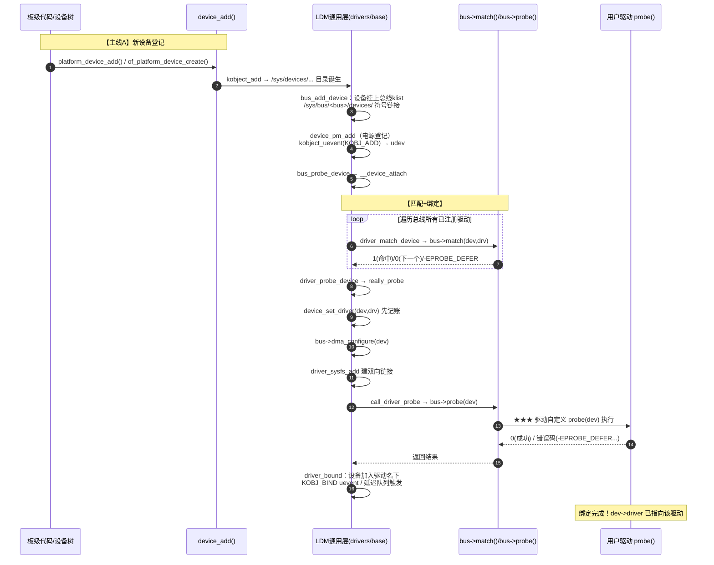
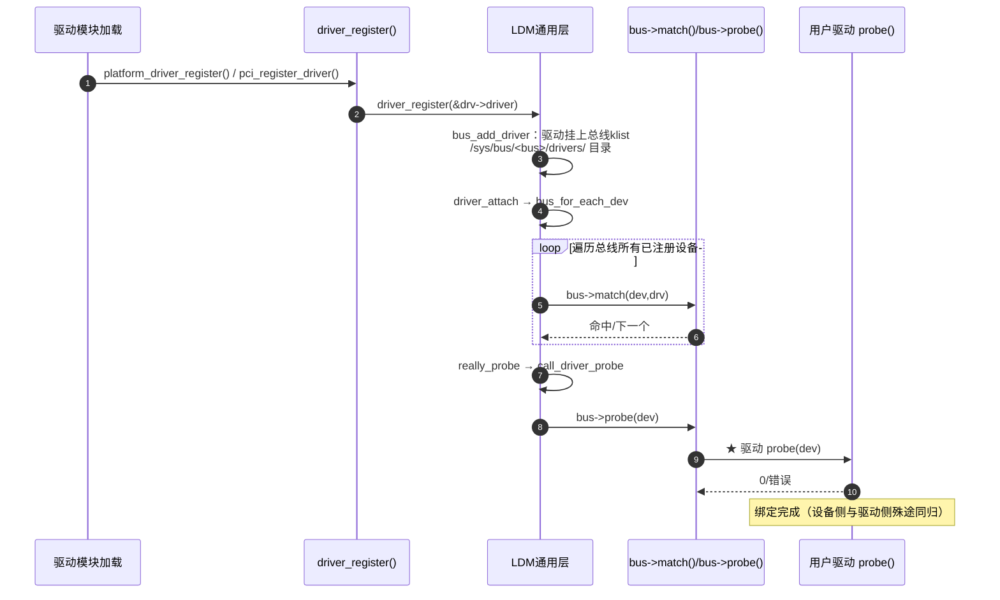
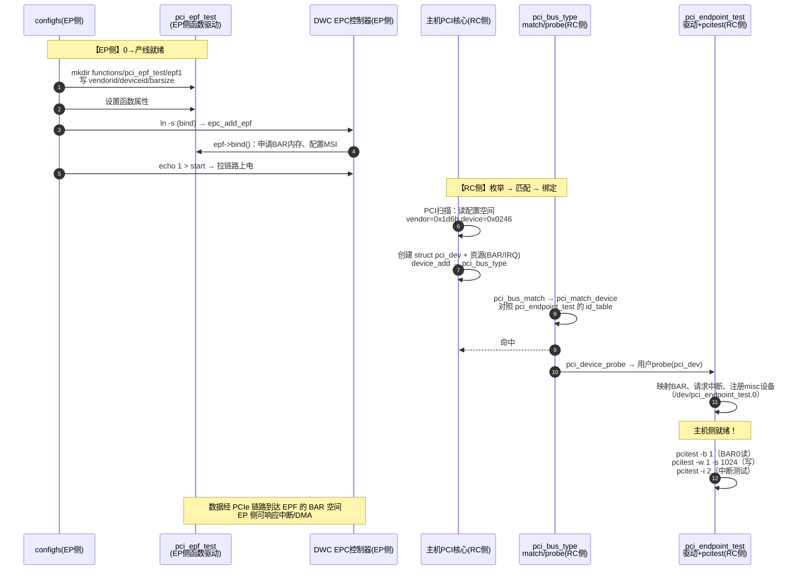

---
tags:
  - OS
  - Linux
  - LDM
status: growing
related:
  - "5-driver大统一场理论/platform_bus_analysis"
  - "1-kernel/Linux-kernel/2. LDM-notes(phy-device)/00-bus-device-driver flow"
---

# 🏛️ LDM 从 0 帧到金字塔：Linux 设备驱动模型完整教程

> **一句话**：LDM（Linux Device Model，设备驱动模型）是内核里**一套统一管理"设备、驱动、总线"的登记-匹配-绑定系统**。本教程从"没有它的世界"开始，一层层搭起金字塔认知模型，最后落到第一性原理，并附一个"从 0 到 PCIe EP 跑起来"的完整 Demo。
>
> **目标**：学完你脑中应有一张金字塔图——塔尖是顶层世界观，塔身是总线与它们的 match/probe/PM，塔基是第一性原理。

---

## 目录

1. [帧 0：没有 LDM 的世界（费曼入场）](#帧-0没有-ldm-的世界费曼入场)
2. [金字塔全景图（先给地图）](#金字塔全景图先给地图)
3. [第 1 层（塔尖）：LDM 的世界观——三个顶层容器](#第-1-层塔尖ldm-的世界观三个顶层容器)
4. [第 2 层：四个基类与"继承"（身份证、档案、中介）](#第-2-层四个基类与继承身份证档案中介)
5. [第 3 层：生命周期两条主线——登记、匹配、绑定](#第-3-层生命周期两条主线登记匹配绑定)
6. [第 4 层（金字塔的腰）：bus_type = 策略注入点](#第-4-层金字塔的腰bus_type--策略注入点)
7. [第 5 层（塔身）：常用总线逐个解剖](#第-5-层塔身常用总线逐个解剖)
8. [第 6 层：电源管理在 LDM 中的位置](#第-6-层电源管理在-ldm-中的位置)
9. [第 7 层（塔基）：第一性原理本质](#第-7-层塔基第一性原理本质)
10. [Demo：从 0 到 PCIe EP 跑起来](#demo从-0-到-pcie-ep-跑起来)
11. [附录 A：优秀教程与代码仓库清单](#附录-a优秀教程与代码仓库清单)
12. [附录 B：源码对照速查](#附录-b源码对照速查)
13. [附录 C：术语表](#附录-c术语表)

---

## 帧 0：没有 LDM 的世界（费曼入场）

### 0.1 费曼类比：从"十字路口"到"交通管理局"

想象远古内核时代，每个总线的驱动都是**各管各的十字路口**：

- **PCI 路口**：PCI 代码自己维护"哪张卡接哪个驱动"的名单，自己管电源、自己出 sysfs；
- **USB 路口**：USB 代码再写一套，只是对象换成了 `usb_device`；
- **platform 路口**：SoC 上那些"焊死在板子上的外设"（UART、看门狗）没有枚举机制，得靠另一套"点名册"。

三套代码长得像、干的事一样，但**互相不认识**。于是内核里出现了一个严重问题：

> **同一个"设备"概念被复制了三份**——`pci_dev`、`usb_device`、`platform_device` 各有各的生命周期、匹配逻辑、电源管理、sysfs 导出。驱动作者要为每个路口写一遍轮子。

> 🧠 **费曼理解**：没有 LDM 的世界 = 一个城市里每个十字路口自己装红绿灯、自己雇交警、自己画标线，但**没有交通管理局**。红绿灯厂商（驱动）只能一次对接一个路口（总线），换个路口就得重写。

### 0.2 局长的解决方案：统一抽象

内核的"交通管理局"就是 **LDM（drivers/base/）**。它的核心思想只有一句话：

> **把"设备/驱动/总线"抽象成三种通用对象，由一套统一代码管理；每种总线只提供"差异策略"（怎么匹配、怎么探测）。**

从此：

| 以前（没有 LDM） | 现在（有 LDM） |
|---|---|
| 每种总线各写一套设备管理 | `struct device` 统一表达所有设备 |
| 每种总线各写一套匹配逻辑 | 统一遍历 + 总线只提供 `match()` 回调 |
| 每种总线各写一套 sysfs | kobject/kset 统一导出，`/sys` 一棵树 |
| 每种总线各写一套电源管理 | `struct dev_pm_info` + 统一 PM 框架 |
| 驱动只能绑死一种总线 | 驱动声明"我属于哪条总线"即可被统一调度 |

> **软件逻辑概念 0【接口抽象 + 策略模式】**: LDM 提供"骨架"（对象模型、链表、加锁、生命周期、sysfs、延迟探测），各总线注入"血肉"（match/probe/pm 等函数指针）。这就是**好莱坞原则：Don't call us, we'll call you**——驱动不是主动去"找设备"，而是**登记在总线上，等 LDM 来调用**。

### 0.3 帧 0 的三个前置直觉（记住它们，后面全是推导）

1. **设备是"物理存在"，驱动是"知识"**：设备在总线上被枚举/登记，驱动是"怎么操作这类硬件的说明书"；两者必须**配对**才能干活。
2. **配对 = 匹配（match）+ 绑定（bind/probe）**：LDM 负责"让对的人遇见对的设备"。
3. **一切对象最终都要能被用户态看到**：通过 sysfs（`/sys`）—— 内核对象树的"窗口"。

---

## 金字塔全景图（先给地图）

这是整篇教程的**最终认知模型**，先记住形状，每一层对应正文的一章：

```
                        ┌─────────────────────────────┐
                        │   第1层 顶层世界观（塔尖）     │
                        │  /sys/devices /sys/bus /sys/class│
                        │   kset × 3 = "内核的三大台账"  │
                        └──────────────┬──────────────┘
                        ┌──────────────┴──────────────┐
                        │   第2层 四个基类              │
                        │  kobject ─► device            │
                        │  device_driver  bus_type      │
                        │  "身份证/档案/中介"           │
                        └──────────────┬──────────────┘
                        ┌──────────────┴──────────────┐
                        │   第3层 生命周期 + 匹配引擎    │
                        │  device_add / driver_register │
                        │  双通道 match ─► really_probe │
                        │  -EPROBE_DEFER 延迟队列       │
                        └──────────────┬──────────────┘
          ┌────────────────────────────┴────────────────────────────┐
          │       第4层 bus_type = 策略注入点（金字塔的腰）           │
          │   match / probe / remove / pm / dma_configure / uevent   │
          └───────┬───────┬───────┬───────┬───────┬───────┬─────────┘
                  │       │       │       │       │       │
            ┌─────▼──┐┌───▼────┐┌──▼───┐┌──▼────┐┌──▼───┐┌──▼────┐
            │platform││  PCI   ││ I2C  ││  SPI  ││ USB  ││ ...   │  第5层 总线
            │match:  ││ match: ││match:││match: ││match:││       │  各自的
            │OF/name ││vendor/ ││id表/ ││id表/  ││VID/  ││       │  match/probe
            │        ││device  ││OF    ││OF     ││PID/  ││       │  /PM 特性
            └────────┘└────────┘└──────┘└───────┘└──────┘└───────┘
          ┌────────────────────────────┬────────────────────────────┐
          │       第6层 通用能力层：电源管理 / devres / 设备依赖链 / DMA │
          └────────────────────────────┴────────────────────────────┘
          ┌────────────────────────────┬────────────────────────────┐
          │       第7层 塔基：第一性原理（为什么必须这样设计）          │
          └────────────────────────────┴────────────────────────────┘
```

> 🧠 **读图法**：塔尖到塔身是"设计→实现"的推导；塔身到塔基是"实现→本质"的归纳。你顺着读一遍 = 建立 LDM 的完整心智地图；以后任何新总线（virtio、faux bus…）来了，你只要把它**塞进第 5 层的格子**即可。

---

## 第 1 层（塔尖）：LDM 的世界观——三个顶层容器

### 1.1 费曼类比：三大台账

想象内核是一个**政务大厅**，LDM 开局（`driver_init()`）先立起三本台账：

| sysfs 路径 | 台账 | 费曼类比 | 创建者 |
|---|---|---|---|
| `/sys/devices` | `devices_kset` | **户籍册**：所有设备按"物理父子关系"登记（CPU 下挂总线桥，桥下挂设备…） | `devices_init()` |
| `/sys/bus` | `bus_kset` | **中介名录**：所有总线的"职业介绍所"，每个总线名下有 `devices/`（求职者）和 `drivers/`（招聘岗位） | `buses_init()` |
| `/sys/class` | `class_kset` | **功能分类册**：按"这设备是干什么的"重新索引（同一个小硬盘既在 PCI 下、又在 block 类下） | `classes_init()` |

```c
// drivers/base/init.c:21 —— 一切从这里开始（内核启动早期 do_basic_setup → driver_init）
void __init driver_init(void)
{
	devtmpfs_init();
	devices_init();          // ★ /sys/devices
	buses_init();            // ★ /sys/bus
	classes_init();          // ★ /sys/class
	of_core_init();
	platform_bus_init();     // ★★ 第一个"总线实例"诞生（platform）
	auxiliary_bus_init();
	cpu_dev_init();
	memory_dev_init();
	...
}
```

> **软件逻辑概念 1【三视图 = 一棵对象树的三张投影】**: 设备在**物理层级**（devices）、**总线归属**（bus）、**功能类别**（class）三个维度被索引。这是"一个对象，多种视图"的经典建模——`/sys/bus/xxx/devices/yyy` 里的条目其实都是**符号链接**，真实对象永远在 `/sys/devices/...`。

### 1.2 sysfs 是什么：内核对象树的"窗口"

- sysfs 里的**每个目录 = 一个 `struct kobject`**；
- 目录里的**每个文件 = 一个 attribute**（读写它 = 调内核里的 show/store 回调）；
- 于是用户态 `cat /sys/bus/platform/devices` 就能"看见"内核对象图——**LDM 的第一个交付物：用户态可视化**。

### 1.3 底层机制：kobject / kset / kref

| 机制 | 作用 | 费曼类比 |
|---|---|---|
| `struct kobject` | sysfs 里"可见对象"的基座：名字、parent、kset、引用计数 | 身份证 |
| `struct kset` | 一类 kobject 的集合（目录 + 链表） | 户口本 |
| `struct kref` | 引用计数，归零触发 release | 用多少人签名才能注销 |
| `kobject_uevent()` | 向用户态发事件（udev 据此自动加载驱动） | 广播喇叭 |

> **第一性原理预告**：LDM 的一切（device/driver/bus）最终都"是一个 kobject"——所以**注册/注销、引用计数、sysfs、uevent 这些能力是全体共享的**，不需要每种总线重写。这就是塔尖为什么只有三本台账就够。

---

## 第 2 层：四个基类与"继承"（身份证、档案、中介）

### 2.1 四个结构体（费曼角色扮演）

| 结构体 | 费曼角色 | 职责 |
|---|---|---|
| `struct kobject` | 身份证 | 可见性、名字、父节点、引用计数 |
| `struct device` | **公民档案**（通用） | 设备是谁：parent（父设备）、bus（所属总线）、driver（绑定的驱动）、power（电源状态）、of_node（设备树节点）、dma_mask、devt（设备号）、release（注销回调） |
| `struct device_driver` | **岗位说明书**（通用） | 驱动是谁：name、bus（属于哪条总线）、probe/remove（上岗/离职流程）、pm、of_match_table/id_table（招人条件） |
| `struct bus_type` | **中介规则** | 总线怎么运作：match（怎么撮合）、probe（上岗流程）、pm、dma_configure、uevent |

```c
// include/linux/device.h —— struct device（精简）
struct device {
	struct kobject kobj;              // 身份证（一切可见对象的基础）
	struct device *parent;            // 父设备 → 形成物理层级树
	const struct bus_type *bus;       // ★ 我属于哪条总线
	struct device_driver *driver;     // ★ 我被哪个驱动接管了
	void *driver_data;                // 驱动私有数据
	struct dev_links_info links;      // 设备依赖链（供应商/消费者）
	struct dev_pm_info power;         // ★ 电源管理状态（睡眠/运行时PM）
	u64 *dma_mask;                    // DMA 地址范围
	struct device_node *of_node;      // 设备树节点
	struct fwnode_handle *fwnode;     // 固件抽象（DT/ACPI 统一）
	dev_t devt;                       // 设备号（用户态接口基础）
	const struct class *class;        // 功能分类
	void (*release)(struct device *); // ★ 引用归零时的"身后事"
	...
};
```

### 2.2 "继承"是怎么实现的：内嵌 + container_of（关键认知）

LDM 不用 C++ 继承，而是**结构体内嵌**：

```c
struct platform_device {          // "派生类"
	const char *name;
	int id;
	struct device dev;            // ★ 内嵌"基类"
	struct resource *resource;    // 总线特有：IO/MEM/IRQ 资源
	u32 num_resources;
	...
};

struct pci_dev {                  // 另一个"派生类"
	struct list_head bus_list;
	struct pci_bus *bus;
	...
	struct device dev;            // ★ 同样内嵌基类
	...
};
```

LDM 通用层**只认 `struct device *`**；总线代码要用"派生类"时，用 `container_of` 从内嵌的 `dev` 反推外层结构体首地址：

```c
#define to_platform_device(x) container_of((x), struct platform_device, dev)
#define to_pci_dev(n)         container_of(n, struct pci_dev, dev)
#define to_i2c_client(d)      container_of(d, struct i2c_client, dev)
```

> 🧠 **费曼理解**：`struct device` 像"公民身份证"，`platform_device` 像"身份证 + 房产证 + 驾驶证"——LDM 只管验身份证，不关心你口袋里还有什么。需要看驾驶证时（总线代码），`container_of` 就是"从身份证找到本人"的指针魔法。

> **软件逻辑概念 2【向上转型/向下转型】**: LDM = 只操作基类指针的**多态框架**；总线子系统负责向上转型（把 `device*` 变回 `pci_dev*`）。**解耦的代价**：双方必须遵守"内嵌在哪、偏移多少"的约定——这就是 `container_of` 需要成员名参数的由来。

### 2.3 一图看继承关系

```
struct kobject（身份证）
   ▲
   │ 内嵌
struct device ◄───────────── 内嵌于 ────────────────┐
   ▲ device_driver（岗位说明书）                       │
   │    ▲ 内嵌                                        │
   │    │         platform_device / pci_dev /         │
   │    │         i2c_client / spi_device /           │
   │    │         usb_device / usb_interface / ...    │
   │    │                                            │
   └────┴─────────────────────────────────────────────┘
       platform_driver / pci_driver / i2c_driver / ...
                       spi_driver / usb_driver / ...

struct bus_type（中介规则）── 每总线一个实例，不"继承"，是"策略对象"
```

---

## 第 3 层：生命周期两条主线——登记、匹配、绑定

这一层是 LDM 的**灵魂**。两条主线对称且殊途同归：

| 主线 | 触发时机 | 入口 | 做什么 |
|---|---|---|---|
| **A 设备线** | 新设备诞生（`device_add`） | `bus_probe_device()` | 遍历总线上**所有已注册驱动**，逐个 match |
| **B 驱动线** | 新驱动登记（`driver_register`） | `driver_attach()` | 遍历总线上**所有已注册设备**，逐个 match |

两条线最终都汇入 `driver_probe_device() → really_probe()`。

### 3.1 主线 A：设备登记（device_add 内部干的事）

```c
// drivers/base/core.c —— device_add() 内部序列（精简）
device_add(dev)
 ├─ device_private_init(dev)                // 分配运行态（链表节点、锁）
 ├─ get_device_parent(dev, parent)          // 决定挂在哪个父设备下
 ├─ kobject_add(&dev->kobj, ...)            // ★ /sys/devices/... 目录诞生
 ├─ bus_add_device(dev)                     // ★★ 登记进总线台账
 │    ├─ sysfs_create_link(...)             //   /sys/bus/<bus>/devices/<name> 符号链接
 │    └─ klist_add_tail(&dev->p->knode_bus,
 │                     &sp->klist_devices)  //   ★ 设备挂上总线链表
 ├─ device_pm_add(dev)                      // ★ 电源管理框架登记
 ├─ kobject_uevent(KOBJ_ADD)                // ★ 通知用户态（MODALIAS → modprobe）
 ├─ fw_devlink_link_device(dev)             // 建立设备依赖链
 └─ bus_probe_device(dev)                   // ★★★ 触发"设备侧匹配"（主线A的末端）
```

### 3.2 主线 B：驱动登记（driver_register 内部干的事）

```c
// drivers/base/driver.c + bus.c —— driver_register() 内部序列（精简）
driver_register(drv)
 ├─ 总线必须已注册 / 同名驱动查重
 └─ bus_add_driver(drv)
      ├─ kobject_init_and_add(...)          // /sys/bus/<bus>/drivers/<name> 目录
      ├─ klist_add_tail(&priv->knode_bus,
      │                &sp->klist_drivers)  // ★ 驱动挂上总线链表
      └─ if (sp->drivers_autoprobe)         // 默认开启
           driver_attach(drv)               // ★★★ 触发"驱动侧匹配"
            └─ bus_for_each_dev(...)        // 遍历总线所有设备，逐个 __driver_attach
```

### 3.3 匹配（match）与绑定（probe）核心

```c
// drivers/base/dd.c —— 匹配 + 探测的骨架（无论从哪条线进来都一样）
__device_attach_driver(drv, dev)  /  __driver_attach(drv, dev)
 ├─ ret = driver_match_device(drv, dev)     // ★★★ → dev->bus->match(dev, drv)
 │    ret==0      → 不匹配，试下一个
 │    ret==-EPROBE_DEFER → 加入延迟队列，稍后重试
 │    ret>0       → 匹配成功！
 ├─ ret = driver_probe_device(drv, dev)
 │    └─ __driver_probe_device → really_probe(dev, drv)
 │         ├─ device_links_check_suppliers()   // 依赖链未就绪 → -EPROBE_DEFER
 │         ├─ device_set_driver(dev, drv)      // 先"记账"：dev->driver = drv
 │         ├─ bus->dma_configure(dev)          // DMA 配置（总线策略）
 │         ├─ driver_sysfs_add(dev)            // 建双向符号链接
 │         ├─ call_driver_probe(dev, drv)      // ★★★ 关键一跳：
 │         │    ├─ if (dev->bus->probe)        //   优先调总线 probe
 │         │    │     ret = dev->bus->probe(dev)
 │         │    └─ else if (drv->probe)        //   否则直接调驱动 probe
 │         │          ret = drv->probe(dev)
 │         └─ driver_bound(dev)                // 绑定完成：KOBJ_BIND 事件、延迟队列触发
```

> 🧠 **费曼理解**：match 是"相亲条件是否满足"，probe 是"正式上岗"。LDM 管"安排相亲 + 办入职手续"，**具体的上岗培训内容（probe 函数体）由驱动作者写**——但"什么时候叫你去、给你什么材料（设备信息）"是 LDM 说了算。

### 3.4 -EPROBE_DEFER：延迟队列（解决"鸡生蛋"问题）

设备 A 的驱动依赖设备 B（如 MMC 控制器依赖电源管理芯片），而 B 还没就绪：

```c
return -EPROBE_DEFER;   // 驱动在 probe 里说："现在材料不够，把我放回候选区"
```

内核把该设备挂进**延迟队列**，当有新驱动/新设备注册成功时触发重试（`driver_deferred_probe_trigger()`），直到材料齐了 probe 成功，或反复失败后打印"probe deferred 超时"。

> **软件逻辑概念 3【依赖图 + 重试队列】**: LDM 用"先记账再重试"而不是"递归等待"，把依赖问题从"同步死锁"变成"异步收敛"。这是操作系统里处理无序初始化的经典手法。

### 3.5 核心序列图一：设备侧绑定全流程



### 3.6 核心序列图二：驱动侧绑定全流程（对称结构）



---

## 第 4 层（金字塔的腰）：bus_type = 策略注入点

### 4.1 bus_type 是一份"中介规则合同"

```c
// include/linux/device/bus.h —— struct bus_type（核心字段）
struct bus_type {
	const char *name;                          // 总线名："platform"/"pci"/"i2c"/"spi"/"usb"...
	const struct attribute_group **bus_groups; // 总线自身 sysfs 属性
	const struct attribute_group **dev_groups; // 该总线设备的默认属性
	const struct attribute_group **drv_groups; // 该总线驱动的默认属性

	int (*match)(struct device *dev, struct device_driver *drv);  // ★ 撮合规则
	int (*uevent)(const struct device *dev, struct kobj_uevent_env *env);
	int (*probe)(struct device *dev);          // ★ 上岗流程（内部调用驱动 probe）
	void (*sync_state)(struct device *dev);
	void (*remove)(struct device *dev);        // 离职流程
	void (*shutdown)(struct device *dev);

	int (*suspend)(struct device *dev, pm_message_t state);  // 旧式 PM
	int (*resume)(struct device *dev);

	int (*num_vf)(struct device *dev);
	int (*dma_configure)(struct device *dev);  // DMA 配置策略
	void (*dma_cleanup)(struct device *dev);

	const struct dev_pm_ops *pm;               // ★ 总线级电源管理 ops
	...
	bool need_parent_lock;
};
```

> 🧠 **费曼理解**：`bus_type` 就是中介的**合同模板**——每条总线填自己的"撮合规则（match）、上岗流程（probe）、离职流程（remove）、停电预案（pm）"。LDM 通用代码只照着合同调用，不关心合同内容。

### 4.2 三个必须吃透的函数指针

| 回调 | 职责 | 费曼类比 |
|---|---|---|
| `match(dev, drv)` | 判定"这个驱动能不能带这个设备" | 看简历和岗位要求是否匹配 |
| `probe(dev)` | 匹配成功后，总线级"办入职"（准备时钟/电源域，再调驱动自己的 probe） | 人事部办手续后，部门主管（驱动）接手 |
| `pm`（dev_pm_ops） | 总线级电源管理策略（睡/醒流程） | 整栋楼的总闸控制 |

### 4.3 总线内部维护的两本台账

每条总线注册时（`bus_register`）会建：

```
/sys/bus/<name>/
├── devices/        ← klist_devices：该总线上所有设备（求职者名单）
└── drivers/        ← klist_drivers：该总线上所有驱动（岗位名单）
```

**match 就是拿两本台账互相"对表"**——设备线遍历驱动台账，驱动线遍历设备台账。这就是第 3 层双通道的物理基础。

---

## 第 5 层（塔身）：常用总线逐个解剖

> 阅读法：每个总线看五个点——**①设备从哪来 ②按什么匹配 ③match 实现 ④probe 入口 ⑤PM**。看完你就掌握了"金字塔的腰以下全是同一个套路"的真相。

### 5.1 platform bus（平台总线）——"焊死的外设"

- **设备来源**：不可枚举。由 BSP 代码手工注册（`platform_device_register`）或设备树/ACPI 自动创建（`of_platform_default_populate`）。
- **匹配依据（platform_match 优先级链）**：
  1. `driver_override`（用户强制指定驱动名）
  2. **OF**：`compatible` 属性 对照 `drv->of_match_table`
  3. **ACPI**：`_HID` 对照 `drv->acpi_match_table`
  4. `id_table`：`platform_device_id.name` 逐一比较
  5. 兜底：`pdev->name` 与 `drv->name` 直接比较
- **probe 入口**：`platform_probe` → 先 `of_clk_set_defaults`、`dev_pm_domain_attach`，再调用户 `platform_driver->probe`。
- **PM**：`bus->pm = &platform_dev_pm_ops`（最终落到驱动 `dev_pm_ops`）。
- **典型对象**：SoC 上的 UART/看门狗/网卡/SPI 控制器。

> 深挖见你的 [[5-driver大统一场理论/platform_bus_analysis|platform_bus_analysis]]（1073 行源码级分析），本篇不再重复。

### 5.2 PCI bus——"能自己数数的大巴"

- **设备来源**：**可枚举**。开机 PCI 扫描（`pci_scan_bus`）读每个插槽的**配置空间**（vendor ID、device ID、class、BAR、IRQ），逐个创建 `struct pci_dev`。
- **匹配依据**：`pci_bus_match` → `pci_match_device` → `pci_match_id`：

```c
// drivers/pci/pci-driver.c —— pci_match_id 逻辑（精简）
// 依次比较：class / vendor / device / subvendor / subdevice
// 支持通配：PCI_ANY_ID（0xFFFF）表示"不挑"
static inline bool pci_match_one_device(const struct pci_device_id *id,
					const struct pci_dev *dev)
{
	if ((id->vendor == PCI_ANY_ID || id->vendor == dev->vendor) &&
	    (id->device == PCI_ANY_ID || id->device == dev->device) &&
	    (id->subvendor == PCI_ANY_ID || id->subvendor == dev->subsystem_vendor) &&
	    (id->subdevice == PCI_ANY_ID || id->subdevice == dev->subsystem_device) &&
	    !((id->class ^ dev->class) & id->class_mask))
		return true;
	return false;
}
```

- **probe 入口**：`pci_device_probe` → 保存资源、设置 power state，再调用户 `pci_driver->probe(pci_dev)`。
- **PM**：`bus->pm = &pci_pm_ops`（标准 PCI 电源管理：D0-D3 状态、`pci_set_power_state`）。
- **典型对象**：显卡、网卡、NVMe、PCIe EP 端卡。
- **驱动写法**：声明 `pci_device_id[]` 表 + `pci_driver`，`pci_register_driver`。

### 5.3 I2C bus——"两根线的居委会"

- **设备来源**：**半枚举**。控制器（adapter）注册后扫描总线地址（`i2c_detect`），或由设备树/`i2c_new_client_device` 显式实例化。
- **匹配依据**：`i2c_device_match` → 先 OF `compatible`，再 `i2c_match_id`（`i2c_device_id.name` 对照 `client->name`）。
- **probe 入口**：`i2c_device_probe` → 调用户 `i2c_driver->probe(client)`；驱动声明 `i2c_device_id` + `of_match_table`。
- **PM**：`bus->pm = &i2c_device_pm_ops`（挂起时先把总线操作串行化）。
- **典型对象**：EEPROM、温度传感器、触摸屏、PMIC。

### 5.4 SPI bus——"四根线的高速公路"

- **设备来源**：半枚举。`spi_register_board_info` / `spi_new_device` / 设备树 `of_register_spi_devices`。
- **匹配依据**：`spi_match_device` → OF `compatible` 或 `spi_match_id`（`spi_device_id.name`）。
- **probe 入口**：`spi_device_probe` → 调用户 `spi_driver->probe(spi)`。
- **PM**：`bus->pm = &spi_pm_ops`。
- **典型对象**：Flash、屏幕、ADC、无线模块。

### 5.5 USB bus——"热插拔的集市"

- **设备来源**：**可枚举 + 热插拔**。hub 驱动扫描端口，创建 `usb_device`（设备）和 `usb_interface`（接口，即"功能单元"）。
- **匹配依据**：`usb_device_match` 在**接口层**匹配——`usb_match_id` 对照 `usb_device_id`：

```c
// drivers/usb/core/driver.c —— usb_device_id 关键字段
struct usb_device_id {
	__u16 idVendor, idProduct;          // 厂商/产品号（PCI_ANY 风格通配）
	__u8  bInterfaceClass,             // 接口类：HID/Audio/CDC...
	      bInterfaceSubClass,
	      bInterfaceProtocol;
	...
};
// 匹配顺序：精确 ID → 接口类 → 厂商 → 通用
```

- **probe 入口**：`usb_device_probe` → 调用户 `usb_driver->probe(iface)`。
- **PM**：`bus->pm = &usb_device_pm_ops`（含自动挂起 autosuspend、远程唤醒）。
- **典型对象**：键鼠（HID）、U 盘、网卡（CDC/ECM）、摄像头（UVC）。
- **关键差异**：USB 是**分层设备**（device → interface），驱动绑定的是 interface 而非整个 device——这是 USB 的"每个功能一个驱动"模型。

### 5.6 常用总线对照总表（背这张表 = 掌握第 5 层）

| 总线 | 设备来源 | 匹配依据（match） | probe 入口 | PM (bus->pm) | 典型对象 |
|---|---|---|---|---|---|
| **platform** | 不可枚举（BSP/DT/ACPI） | OF compatible → ACPI → id_table → name | `platform_probe`→drv->probe | `platform_dev_pm_ops` | SoC 外设 |
| **PCI** | 可枚举（配置空间扫描） | class/vendor/device/subvendor/subdevice | `pci_device_probe`→drv->probe | `pci_pm_ops`（D0-D3） | 显卡/NVMe/网卡 |
| **I2C** | 半枚举（扫描+DT+实例化） | OF compatible → id_table | `i2c_device_probe`→drv->probe | `i2c_device_pm_ops` | 传感器/PMIC |
| **SPI** | 半枚举（board info+DT） | OF compatible → id_table | `spi_device_probe`→drv->probe | `spi_pm_ops` | Flash/屏幕 |
| **USB** | 可枚举+热插拔（hub 扫描） | idVendor/idProduct/接口类 | `usb_device_probe`→drv->probe | `usb_device_pm_ops`（autosuspend） | 键鼠/U盘/网卡 |

> 🧠 **费曼总结第 5 层**：五条总线 = 同一个 LDM 骨架 + 五份不同的"合同"（bus_type）。区别只在：
> ① **设备从哪来**（可枚举 vs 不可枚举——决定了"谁来创建 device"）；
> ② **match 看什么**（名字/厂商ID/接口类/DT compatible）；
> ③ **probe 拿到什么**（platform 拿 resource、PCI 拿配置空间+BAR、I2C/SPI 拿 client/spi、USB 拿 interface）。
> 其余（生命周期、sysfs、电源登记、延迟探测）**全是 LDM 统一干的**。

---

## 第 6 层：电源管理在 LDM 中的位置

### 6.1 费曼类比：楼宇电力系统

`struct device` 里的 `struct dev_pm_info power` 是**每户的电表**；LDM 的 PM 框架（`drivers/base/power/`）是**整栋楼的配电房**。当大楼"停电检修"（系统睡眠）时，配电房按楼层顺序逐户通知；每户的"关灯流程"由**户主（驱动）自己写**，但"什么时候通知、按什么顺序"是 LDM 说了算。

### 6.2 两类 PM

| 类型 | 触发 | 回调 | 用途 |
|---|---|---|---|
| **系统睡眠 PM** | 按下电源键 / `echo mem > /sys/power/state` | `suspend`/`resume`（+ freeze/thaw/poweroff/restore） | 整机休眠/唤醒 |
| **运行时 PM（Runtime PM）** | 设备空闲 / 主动请求 | `runtime_suspend`/`runtime_resume`/`runtime_idle` | 单设备节电（USB autosuspend、GPU 降频） |

### 6.3 回调解析链（重要！）

设备睡眠时，内核按**优先级从高到低**找"谁来处理"：

```
dev->pm_domain->ops  （电源域，最优先）
   → dev->type->pm   （设备类型）
   → dev->class->pm  （类，如 block/net）
   → dev->bus->pm    （总线，如 pci_pm_ops）← 第 5 层表格里那个
   → drv->pm         （驱动自己，最具体）
```

> **软件逻辑概念 4【职责链 + 默认值下沉】**: 越外层越通用、越内层越具体。总线 PM（如 PCI 的 D0-D3 状态机）做"通用活"，驱动 PM 做"本设备怎么关灯"。每层都可选择"不处理，把机会让给内层"（`pm` 为 NULL 就跳下一级）。

### 6.4 LDM 对 PM 的支撑点

- `device_pm_add()`：设备登记时挂进全局 PM 链表（`dpm_list`）——睡眠时按依赖顺序遍历；
- `dpm_sysfs_add()`：`/sys/devices/.../power/` 目录（`control`、`runtime_status`、`autosuspend_delay_ms`…）；
- `bus->pm` + `drv->pm`：回调链的数据源；
- 配套：`dev_pm_domain_attach()`（platform_probe 里见过）、`pm_runtime_*` API。

---

## 第 7 层（塔基）：第一性原理本质

### 7.1 一句话本质

> **LDM = 一张"登记表" + 一个"匹配器" + 一套"生命周期" + 一堆"策略注入点"，让"设备/驱动/总线"三者以最小耦合的方式自由配对。**

展开成四条本质：

| # | 本质 | 为什么必须这样 |
|---|---|---|
| 1 | **一切皆 kobject，一切可见** | 统一 sysfs/引用计数/uevent → 用户态可诊断、udev 可自动加载驱动 |
| 2 | **设备与驱动分离，靠 match 撮合** | 硬件是可枚举的、驱动是可插拔的——两者必须独立演进，接口只留 `match()` |
| 3 | **总线只留"差异策略"，共性归 LDM** | 消灭"每种总线重写一遍框架"的重复；新增总线只需填一份 bus_type 合同 |
| 4 | **生命周期统一（注册/注销成对、引用计数、devres）** | 热插拔、模块卸载、错误路径都能安全收尾，不泄漏、不悬空 |

### 7.2 费曼一句话复述

> 想象一家**人才中介**：设备是"求职者"（有身份证 `device`），驱动是"岗位"（有招聘条件 `driver`），中介的规则是"撮合 + 办入职"（`bus_type`）。任何新行业（新总线）加入，只要告诉中介"你们这行怎么挑人（match）、入职怎么培训（probe）"——**中介的流程一概不变**。这就是 LDM 的第一性原理：**用"统一骨架 + 差异策略"换掉"每行一套系统"。**

### 7.3 从第一性原理能推出的所有"现象"

- 为什么 `-EPROBE_DEFER` 存在？→ 因为本质 2/4：设备驱动独立演进，依赖必须异步收敛。
- 为什么要有 `devm_*`（devres）？→ 本质 4：生命周期统一 → 资源跟着设备走，probe 失败/remove 自动清理。
- 为什么 `driver_override` 优先级最高？→ 本质 2：match 是"撮合"，但**人（管理员）的意志最大**。
- 为什么 sysfs 里全是符号链接？→ 本质 1：对象只有一个（在 /sys/devices），bus/class 只是视图。
- 为什么新总线（faux bus、auxiliary bus）层出不穷还能无缝融入？→ 本质 3：只需填合同。

---

## Demo：从 0 到 PCIe EP 跑起来

### 8.0 场景与"0 帧"前提

- **硬件假设**：一块带 **DWC（DesignWare）PCIe EP 控制器**的 SoC 板（EP 侧，如 rockchip/imx/dwc-pcie 支持的平台）+ 一台 x86 主机（RC 侧）。
- **0 帧问题**：PCIe 的 **EP（Endpoint）不会自己出现在总线上**——RC 才有"数数"能力（枚举）。EP 侧要想被主机发现，必须：
  1. 把自己配置成"EP 模式"（而不是 RC 模式）；
  2. 提供 vendor/device ID、BAR 空间、中断能力；
  3. 等链路 up 后由 RC 枚举。
- 这正好展示 LDM 的**两个世界**：EP 侧（configfs + pci_epf 框架）与 RC 侧（pci_bus_type 枚举 + match + probe）。

### 8.1 认识 Linux PCIe EP 框架（两个核心对象）

| 对象 | 结构体 | 角色 | 费曼类比 |
|---|---|---|---|
| **EPC**（Endpoint Controller） | `struct pci_epc` | PCIe 控制器硬件抽象（寄存器、DMA、MSI） | 厂房本身 |
| **EPF**（Endpoint Function） | `struct pci_epf` | 一个"虚拟 PCI 设备/功能"（ID、BAR、回调） | 厂房里的一条产线 |

框架路径：`drivers/pci/endpoint/`（`pci-epc-core.c` / `pci-epf-core.c` / `functions/pci-epf-test.c` / `pci-epf-vntb.c`…）

官方文档：`Documentation/PCI/endpoint/pci-test-howto.rst`（PCI Test User Guide）。

### 8.2 从 0 的完整步骤（EP 侧）

**Step 0：内核配置（EP 侧）**
```
CONFIG_PCI_ENDPOINT=y            # EP 框架
CONFIG_PCI_ENDPOINT_CONFIGFS=y   # configfs 接口
CONFIG_PCI_ENDPOINT_TEST=y       # pci_epf_test 函数驱动
CONFIG_PCIE_DW_PLAT_EP=y         # DWC 平台 EP 控制器（按你的硬件选）
```

**Step 1：加载并实例化一个 EP 函数（EPF）**
```sh
modprobe pci_epf_test            # 加载函数驱动（仅注册"产线类型"）

# 用 configfs 创建一条"产线"（function 实例）
mkdir -p /configfs/pci_ep/functions/pci_epf_test/epf1
echo 0x1d6b > /configfs/pci_ep/functions/pci_epf_test/epf1/vendorid    # Linux 基金会 vendor
echo 0x0246 > /configfs/pci_ep/functions/pci_epf_test/epf1/deviceid    # pci_epf_test 的 device id
echo 0x0001 > /configfs/pci_ep/functions/pci_epf_test/epf1/bar_size_0  # BAR0 大小(单位4KB) → 4KB
```

**Step 2：把产线挂到控制器上（bind）**
```sh
# 控制器目录（EPC 驱动注册后出现）
ls /configfs/pci_ep/controllers/            # 例如 1f000000.pcie_ep

# 符号链接 = 绑定：这条产线接入厂房
ln -s /configfs/pci_ep/functions/pci_epf_test/epf1 \
      /configfs/pci_ep/controllers/1f000000.pcie_ep/

# 启动链路（部分平台需显式拉高）
echo 1 > /configfs/pci_ep/controllers/1f000000.pcie_ep/start
```

**Step 3：主机（RC 侧）看到新设备**
```sh
# 主机上
lspci                      # 出现 1d6b:0246 的 PCI 设备
# 主机加载测试驱动 + 测试工具
modprobe pci_endpoint_test
pcitest -i 1               # 初始化 BAR
pcitest -b 1               # BAR0 读
pcitest -w 1 -s 1024       # 写入 1KB
pcitest -r 1 -s 1024       # 读取 1KB
pcitest -i 2 -I 1          # 使能中断，测 MSI/INTx
```

> 若想从"空板子"开始，最小路径是：**内核开 CONFIG → 编进 pci_epf_test → configfs 三步 → 主机 lspci → pcitest**。详见官方 [PCI Test HOWTO](https://docs.kernel.org/PCI/endpoint/pci-test-howto.html)。

### 8.3 写一个自己的 EPF 驱动骨架（从 0 写代码）

```c
// drivers/pci/endpoint/functions/my-epf-demo.c（示意，非完整可编译）
#include <linux/pci-epf.h>

struct my_epf {
	struct pci_epf *epf;
	void __iomem *bar0;
};

/* 产线开工：EPC 把 BAR 等资源配好后回调 */
static int my_epf_bind(struct pci_epf *epf)
{
	struct pci_epc *epc = epf->epc;
	struct my_epf *d = epf_get_drvdata(epf);

	/* 申请并映射 BAR0 */
	d->bar0 = pci_epc_mem_alloc_addr(epc, &epf->bar[0].phys_addr,
					 epf->bar[0].size);
	if (!d->bar0)
		return -ENOMEM;
	/* 配置 EP 中断（MSI）能力 */
	pci_epc_set_msi(epc, epf->func_no, 1);
	return 0;
}

static void my_epf_unbind(struct pci_epf *epf)
{
	struct pci_epc *epc = epf->epc;
	struct my_epf *d = epf_get_drvdata(epf);
	pci_epc_mem_free_addr(epc, epf->bar[0].phys_addr, d->bar0, epf->bar[0].size);
}

static struct pci_epf_ops my_epf_ops = {
	.bind   = my_epf_bind,
	.unbind = my_epf_unbind,
};

static int my_epf_probe(struct pci_epf *epf)
{
	struct my_epf *d = devm_kzalloc(&epf->dev, sizeof(*d), GFP_KERNEL);
	if (!d)
		return -ENOMEM;
	epf_set_drvdata(epf, d);
	return 0;
}

static const struct pci_epf_device_id my_epf_ids[] = {
	{ .name = "my_epf_demo", .driver_data = 0 },
	{ },
};

static struct pci_epf_driver my_epf_drv = {
	.probe    = my_epf_probe,
	.remove   = my_epf_remove,
	.ops      = &my_epf_ops,
	.id_table = my_epf_ids,
};
module_pci_epf_driver(my_epf_drv);
```

配套：在 RC 侧写一个普通 `pci_driver`（`pci_device_id` = {vendor=0x1d6b, device=你的ID}），主机枚举时就会走第 5.2 节的 PCI 匹配流程进你的 probe——**LDM 的 RC 侧流程你已经在第 3 层学会了**。

### 8.4 Demo 全流程 UML 序列图（EP 侧 + RC 侧）



---

## 附录 A：优秀教程与代码仓库清单

### 官方文档（最权威，先读这些）

| 资源 | 地址 | 内容 |
|---|---|---|
| 内核文档：Driver model | [docs.kernel.org/driver-api/driver_model.html](https://docs.kernel.org/driver-api/driver_model.html) | overview / binding / platform / bus / class / driver 全集 |
| 内核文档：PCI Endpoint | [docs.kernel.org/PCI/endpoint/pci-test-howto.html](https://docs.kernel.org/PCI/endpoint/pci-test-howto.html) | EP 测试 Demo 官方步骤 |
| 内核源码 | [github.com/torvalds/linux](https://github.com/torvalds/linux) | `drivers/base/`（LDM）、`drivers/pci/endpoint/`（EPF）、`include/linux/device*.h` |

### 精品教程

| 资源 | 地址 | 特点 |
|---|---|---|
| Bootlin（原 Free Electrons）内核驱动培训 | [github.com/bootlin/training-materials](https://github.com/bootlin/training-materials)（slides/kernel-driver-development*、slides/kernel-frameworks） | 业界公认最佳 PPT，含 LDM/设备模型章节 |
| LWN 设备模型系列 | [lwn.net](https://lwn.net/)（搜 "Linux device model" / "driver core"；如 [Driver core: faux bus](https://lwn.net/Articles/1007664/)） | 内核维护者视角，适合进阶 |
| Linux 设备驱动开发（中文书籍系列） | [apachecn 镜像](https://raw.githubusercontent.com/apachecn/apachecn-linux-zh/master/docs/linux-device-driver-dev/13.md) | 中文友好，第 13 章讲设备模型 |
| juejin 设备模型详解 | [juejin.cn/post/7369443752552005659](https://juejin.cn/post/7369443752552005659) | 中文，讲 bus_type->match 触发链 |
| CSDN 设备模型深度解析 | [blog.csdn.net/qq_38061020/article/details/150473093](https://blog.csdn.net/qq_38061020/article/details/150473093) | 中文深度解析 |

### 代码实现仓库（可跑可改）

| 仓库 | 地址 | 用途 |
|---|---|---|
| **linux-kernel-module-cheat** | [github.com/cirosantilli/linux-kernel-module-cheat](https://github.com/cirosantilli/linux-kernel-module-cheat) | QEMU 一键跑内核+模块，含 platform/PCI 驱动 Demo，最适合"从 0 跑起来" |
| pci-epf-test 官方实现 | `drivers/pci/endpoint/functions/pci-epf-test.c` | 读 EPF 驱动的范本 |
| pcitest 工具 | `tools/pci/pcitest.c`（内核源码树） | RC 侧测试工具源码 |
| 你的仓库 5-driver大统一场理论 | `OS/Linux/5-driver大统一场理论/` | 你的 platform 深挖笔记（本文姊妹篇） |

---

## 附录 B：源码对照速查

| 想看什么 | 看哪 |
|---|---|
| LDM 入口初始化 | `drivers/base/init.c`（driver_init） |
| 设备通用层 | `drivers/base/core.c`（device_add/device_register） |
| 总线通用层 | `drivers/base/bus.c`（bus_register/bus_add_device/bus_add_driver） |
| 匹配/绑定核心 | `drivers/base/dd.c`（__device_attach/__driver_attach/really_probe/driver_bound） |
| 驱动通用层 | `drivers/base/driver.c`（driver_register） |
| platform 总线 | `drivers/base/platform.c`（platform_match/platform_probe/platform_bus_type） |
| PCI 总线 | `drivers/pci/pci-driver.c`（pci_bus_match/pci_device_probe/pci_bus_type） |
| I2C 总线 | `drivers/i2c/i2c-core-base.c`（i2c_bus_type/i2c_device_match/i2c_device_probe） |
| SPI 总线 | `drivers/spi/spi.c`（spi_bus_type/spi_match_device/spi_device_probe） |
| USB 总线 | `drivers/usb/core/driver.c`（usb_bus_type/usb_device_match/usb_device_probe） |
| PM 框架 | `drivers/base/power/`（dpm_*、runtime.c） |
| PCIe EP 框架 | `drivers/pci/endpoint/`（pci-epc-core/pci-epf-core/functions/） |
| 核心头文件 | `include/linux/device.h`、`include/linux/device/bus.h`、`include/linux/device/driver.h`、`include/linux/platform_device.h`、`include/linux/pci.h`、`include/linux/pci-epf.h` |

---

## 附录 C：术语表

| 术语 | 含义 |
|---|---|
| LDM | Linux Device Model，drivers/base 统一设备/驱动/总线框架 |
| kobject/kset/kref | sysfs 可见对象基座 / 对象集合 / 引用计数 |
| device | 通用设备对象（"公民档案"） |
| device_driver | 通用驱动对象（"岗位说明书"） |
| bus_type | 总线策略合同（match/probe/pm...） |
| match | 总线撮合：判定驱动能否带设备 |
| probe | 绑定后执行的上岗流程（总线级→驱动级） |
| really_probe | LDM 统一绑定骨架函数 |
| -EPROBE_DEFER | 依赖未就绪，挂延迟队列稍后重试 |
| container_of | 从内嵌成员反推外层结构体的指针魔法 |
| sysfs | /sys 下的内核对象树（"窗口"） |
| devres / devm_* | 资源随设备生命周期自动管理的机制 |
| EPC / EPF | PCIe 端点控制器 / 端点功能（EP 框架两大对象） |
| RC / EP | Root Complex（根节点，主机侧）/ Endpoint（端点设备） |

---

*本文结构：金字塔第 1→7 层 + PCIe EP Demo。配合 [[5-driver大统一场理论/platform_bus_analysis|platform 源码级深挖]] 与 [[1-kernel/Linux-kernel/2. LDM-notes(phy-device)/00-bus-device-driver flow|LDM 极简 flow]] 一起食用，效果最佳。*
