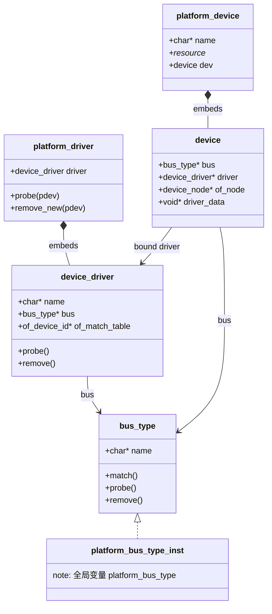
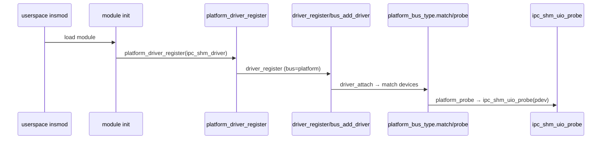
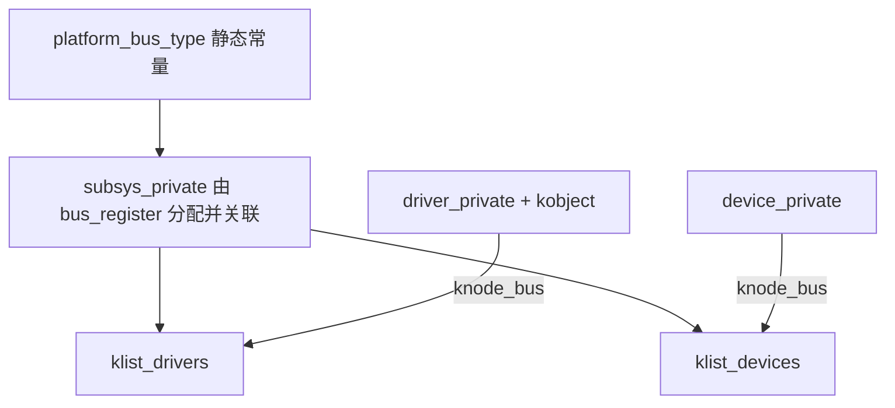

# Session 1 — Task 1（platform LDM 心智模型）

## 第一部分：原始问题与分析理解

**原始 prompt（摘自 prompts_for_read_LDM.md Task 1）**

从 `ipc-shm/os_kernel/ipc-uio.c` 第 405 行 `module_platform_driver(ipc_shm_driver);` 入手，进行平台总线–设备–驱动静态与动态分析，形成 LDM 初步心智模型：说明三者关系；列举结构体及核心成员并画 UML；费曼讲述平台驱动与设备注册；以 Title 2 为锚点扩展「何谓总线」、内核数据格式、链式管理、静态/动态与初始化时机。

_*分析理解：本任务要把一行宏展开成「谁挂在谁下面、何时 probe」的可叙述模型；静态上以 `struct platform_driver` / `platform_device` / `bus_type` 嵌套关系为主；动态上以 module 加载→注册驱动→与已有 platform 设备匹配→调用 `ipc_shm_uio_probe` 为主线；并与 MR-Lite 中「根设备 + `mr_list` 子链表」做认知锚点迁移。*_

---

## 第二部分：回答（面向 MCU HAL / MR-Lite 背景的软件架构视角）

### 0. 知识锚点：MR-Lite vs Linux platform

在 MR-Lite（`mr-lite-dev-drv-framework/source/device.c`）里，设备是一棵以 `root_dev` 为根的树，`mr_dev` 用 `clist`/`list` 串起父子关系，路径查找决定挂载点。

Linux LDM 把「谁能驱动谁」抽象成：**总线类型（`bus_type`）提供匹配规则；设备（`struct device`，常嵌在 `platform_device` 里）挂在该总线上；驱动（`struct platform_driver` 内嵌 `device_driver`）也挂在同一总线上**。platform 总线是**虚拟总线**：硬件未必真有「platform 线缆」，但内核仍用同一套「注册–匹配–probe」管线，便于统一管理电源、sysfs、DMA 等。

---

### 1. 三者关系 + 核心结构体（静态）

**关系一句话**：`platform_bus_type` 定义「匹配 / probe / remove」等行为；每个 `platform_device.dev.bus` 指向它；每个 `platform_driver.driver.bus` 也指向它；匹配成功后 `dev->driver` 指向该驱动的 `device_driver`，内核调用 `platform_driver.probe`。

本仓库 `ipc-uio.c` 中的驱动侧静态定义：

```396:405:c:\tangyapeng\repos\about_linux\ipc-shm-and-kernel\ipc-shm\os_kernel\ipc-uio.c
static struct platform_driver ipc_shm_driver = {
	.driver = {
		.name = IPC_UIO_NAME,
		.of_match_table = ipc_shm_ids,
	},
	.probe = ipc_shm_uio_probe,
	.remove_new = ipc_shm_uio_remove,
};

module_platform_driver(ipc_shm_driver);
```

内核对 platform 设备 / 总线的定义（节选）：

```23:55:c:\tangyapeng\repos\about_linux\ipc-shm-and-kernel\linux\include\linux\platform_device.h
struct platform_device {
	const char	*name;
	int		id;
	bool		id_auto;
	struct device	dev;
	/* ... resource, of_node 通过 dev 关联 ... */
};

#define dev_is_platform(dev) ((dev)->bus == &platform_bus_type)
extern struct bus_type platform_bus_type;
extern struct device platform_bus;
```

```236:264:c:\tangyapeng\repos\about_linux\ipc-shm-and-kernel\linux\include\linux\platform_device.h
struct platform_driver {
	int (*probe)(struct platform_device *);
	void (*remove_new)(struct platform_device *);
	struct device_driver driver;
	const struct platform_device_id *id_table;
	bool prevent_deferred_probe;
	bool driver_managed_dma;
};
```

```80:110:c:\tangyapeng\repos\about_linux\ipc-shm-and-kernel\linux\include\linux\device\bus.h
struct bus_type {
	const char		*name;
	int (*match)(struct device *dev, struct device_driver *drv);
	int (*uevent)(const struct device *dev, struct kobj_uevent_env *env);
	int (*probe)(struct device *dev);
	void (*remove)(struct device *dev);
	/* ... pm、dma_configure ... */
};
```

```705:720:c:\tangyapeng\repos\about_linux\ipc-shm-and-kernel\linux\include\linux\device.h
struct device {
	struct kobject kobj;
	struct device		*parent;
	struct device_private	*p;
	const struct bus_type	*bus;
	struct device_driver *driver;
	void		*driver_data;
	struct device_node	*of_node;
	/* ... */
};
```

**UML（类图 — 组合 / 关联）**



**自顶向下说明**

1. **`bus_type`**：policy 层——名字、`match`、何时调总线级 `probe/remove`。
2. **`platform_driver`**：芯片厂商写的「控制器驱动模板」，真正干活的是 `probe`（本文件里即映射寄存器、申请 chrdev）。
3. **`platform_device`**：描述一块「SoC 上的逻辑设备实例」，内存/IRQ 等资源在 `resource[]`，DT 场景下 `dev.of_node` 指向 OpenFirmware 节点。
4. **绑定结果**：`device.driver` 非空表示已绑定；`driver_data` 常被 `platform_set_drvdata` 用作私有上下文（本驱动把 `uio_id` 指针塞进 `pdev`）。

---

### 2. 费曼：`module_platform_driver` 与「驱动 / 设备注册」各做了什么？

把 **`module_platform_driver`** 想成：**替你写好 module 的「开机自我介绍」和「退场 cleanup」**。

展开在工作区内核头文件：

```297:304:c:\tangyapeng\repos\about_linux\ipc-shm-and-kernel\linux\include\linux\platform_device.h
#define module_platform_driver(__platform_driver) \
	module_driver(__platform_driver, platform_driver_register, \
			platform_driver_unregister)
```

```257:267:c:\tangyapeng\repos\about_linux\ipc-shm-and-kernel\linux\include\linux\device\driver.h
#define module_driver(__driver, __register, __unregister, ...) \
static int __init __driver##_init(void) \
{ \
	return __register(&(__driver) , ##__VA_ARGS__); \
} \
module_init(__driver##_init); \
static void __exit __driver##_exit(void) \
{ \
	__unregister(&(__driver) , ##__VA_ARGS__); \
} \
module_exit(__driver##_exit);
```

**因此：`insmod` 到达内核后**，会调用 `platform_driver_register` → 内部设置总线并进入通用驱动注册：

```861:867:c:\tangyapeng\repos\about_linux\ipc-shm-and-kernel\linux\drivers\base\platform.c
int __platform_driver_register(struct platform_driver *drv,
				struct module *owner)
{
	drv->driver.owner = owner;
	drv->driver.bus = &platform_bus_type;

	return driver_register(&drv->driver);
}
```

**设备从哪里来？** 对本 IPC MSCM 场景：通常 **设备更早** 由 **设备树 + OF core** 展开成 `platform_device`（启动阶段），驱动模块只是「后来者」去 **匹配** 已有设备。驱动 `probe` 收到的是 kernel 已经构造好的 `platform_device *`：

```285:297:c:\tangyapeng\repos\about_linux\ipc-shm-and-kernel\ipc-shm\os_kernel\ipc-uio.c
static int ipc_shm_uio_probe(struct platform_device *pdev)
{
	/* ... */
	platform_set_drvdata(pdev, ipc_pdev_priv.uio_id);
	ipc_pdev_priv.ipc_pdev = pdev;
	res = platform_get_resource(ipc_pdev_priv.ipc_pdev, IORESOURCE_MEM, 0);
	ipc_pdev_priv.pdev_reg = devm_ioremap_resource(
					&ipc_pdev_priv.ipc_pdev->dev, res);
```

**动态流程（简化）**



---

### 3. 何谓「总线」？数据格式、链式管理、静态/动态、初始化时机

**费曼一句话**：总线是内核里的 **「相亲角规则」**：左边登记设备，右边登记驱动，`match` 决定谁和谁是一对；platform 总线是 **CPU 片内 SoC 专用的相亲角**。

**在内核里的数据格式**

- 对外可见的类型是 **`struct bus_type`**（上文摘录）；全局 **`platform_bus_type`** 常量初始化在 `platform.c`：

```1482:1493:c:\tangyapeng\repos\about_linux\ipc-shm-and-kernel\linux\drivers\base\platform.c
struct bus_type platform_bus_type = {
	.name		= "platform",
	.dev_groups	= platform_dev_groups,
	.match		= platform_match,
	.uevent		= platform_uevent,
	.probe		= platform_probe,
	.remove		= platform_remove,
	.shutdown	= platform_shutdown,
	.dma_configure	= platform_dma_configure,
	.dma_cleanup	= platform_dma_cleanup,
	.pm		= &platform_dev_pm_ops,
};
```

**链式管理（不是裸露的 `list_head` 这么简单）**

驱动 core 用 **`subsys_private`** 挂在 sysfs/kobject 体系下，并用 **`klist`** 维护设备链表与驱动链表（便于安全遍历）。定义在 `drivers/base/base.h`：

```42:50:c:\tangyapeng\repos\about_linux\ipc-shm-and-kernel\linux\drivers\base\base.h
struct subsys_private {
	struct kset subsys;
	struct kset *devices_kset;
	/* ... */
	struct kset *drivers_kset;
	struct klist klist_devices;
	struct klist klist_drivers;
	const struct bus_type *bus;
```

```79:85:c:\tangyapeng\repos\about_linux\ipc-shm-and-kernel\linux\drivers\base\base.h
struct driver_private {
	struct kobject kobj;
	struct klist klist_devices;
	struct klist_node knode_bus;
	struct device_driver *driver;
};
```

```109:118:c:\tangyapeng\repos\about_linux\ipc-shm-and-kernel\linux\drivers\base\base.h
struct device_private {
	/* ... */
	struct klist_node knode_driver;
	struct klist_node knode_bus;
	struct device *device;
```

**依赖示意图**



**静态还是动态？**

| 对象 | 典型存储期 |
|------|------------|
| `platform_bus_type`、`platform_bus` | **静态**（内核镜像 .bss/.data） |
| `subsys_private`、`driver_private`、`device_private` | **动态**（`bus_register` / `bus_add_driver` / `device_add` 内分配） |

**初始化时机（核心动作）**

在 **`driver_init()`** 早期初始化驱动模型子系统，其中包含 **`platform_bus_init()`**：

```21:41:c:\tangyapeng\repos\about_linux\ipc-shm-and-kernel\linux\drivers\base\init.c
void __init driver_init(void)
{
	devices_init();
	buses_init();
	classes_init();
	of_core_init();
	platform_bus_init();
	/* ... */
}
```

```1517:1532:c:\tangyapeng\repos\about_linux\ipc-shm-and-kernel\linux\drivers\base\platform.c
int __init platform_bus_init(void)
{
	int error;

	early_platform_cleanup();

	error = device_register(&platform_bus);
	if (error) {
		put_device(&platform_bus);
		return error;
	}
	error =  bus_register(&platform_bus_type);
	if (error)
		device_unregister(&platform_bus);

	return error;
}
```

**核心动作**：注册 **`platform_bus` 这个顶层 device**（parent 语义），再 **`bus_register`** 创建 `/sys/bus/platform`、初始化该总线下的设备/驱动 kset 与 klist——此后才有 **`platform_driver_register` / `platform_device_add`** 的挂接意义。

---

### 心智模型一句记

**platform =「片上设备的相亲角」**：`platform_bus_type` 是规则书；`platform_device` 是「我已占用哪些寄存器/IRQ」的告示；`platform_driver` 是「我会初始化哪种告示对应的硬件」；`module_platform_driver` 只是把这张告示牌在模块装卸时自动挂上/摘下相亲角。
