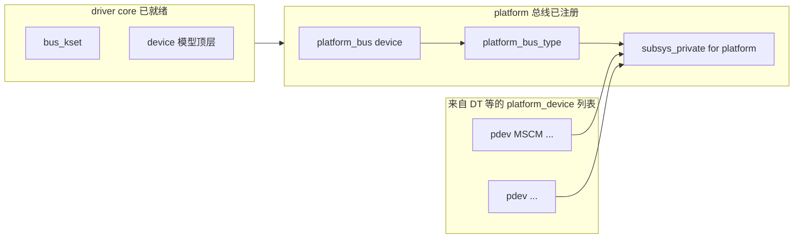
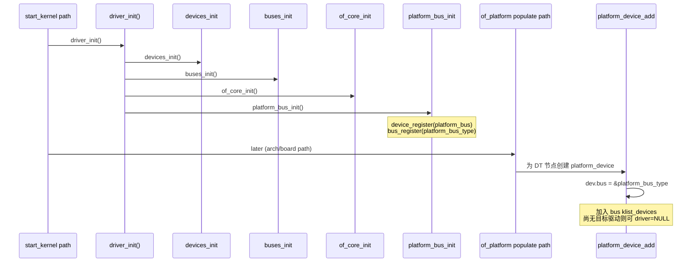
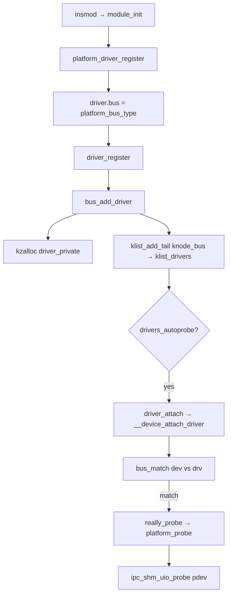

# Session 2 — Task 2（启动后到 insmod 之前 / insmod 之后）

## 第一部分：原始问题与分析理解

**原始 prompt（摘自 prompts_for_read_LDM.md Task 2）**

1）Linux 启动后至用户 `insmod` 某 platform 驱动前，内核已有哪些总线–设备–驱动相关类型与结构体变量？画图说明；并用序列图说明此阶段的初始化。2）`insmod` 之后 platform 驱动注册过程，费曼 + 流程图。3）先用费曼讲核心问题，再用结构体与变量具体分析。

_*分析理解：需把时间轴拆开——early boot 的 `driver_init()` 建立 core bus、kobject、klist；随后 DT/`of_platform` 等把 firmware 描述转成 `platform_device`；此时驱动链表侧通常尚无你的 Ko；`insmod` 后才向 `klist_drivers` 挂结点并触发 `driver_attach`。与工作区内核源码路径对齐。*_

---

## 第二部分：回答

### 费曼总览（先讲故事）

把内核启动想象成 **先搭「车管所大堂」（driver core）**，再 **根据户口本（DT）打印一车一车档案卡片（platform_device）**，但这些车暂时还没有对应的「专修技工」（driver module）。你 **`insmod`** 等于 **雇用一支专修团队并在告示板上登记**；大堂系统自动翻看档案柜里有没有匹配的车型——有就立刻 **`probe`** 开工。

---

### 1. `insmod` 之前：已有类型、代表性的全局/静态对象、初始化序列

#### 1.1 已在内存中的「类型」与典型全局变量（概念分层）

**层 A — 基础设施（所有总线共用）**

- **`struct kset *bus_kset`**：`drivers/base/bus.c` 静态变量——`/sys/bus` 的根。
- **`devices_init()`**：建立设备模型的顶层层次（与 `device_kset` 等相关）。
- **`buses_init()`**：准备好注册多条 bus 的 sysfs 容器。

**层 B — platform 专用**

- **`struct device platform_bus`**：`drivers/base/platform.c` 静态实例，`init_name = "platform"`。
- **`struct bus_type platform_bus_type`**：同上文件静态常量，`.name = "platform"`，挂 `platform_match/probe/...`。

**层 C — 已由 firmware 产生的「设备实例」（典型 DT SoC）**

- 多个 **`struct platform_device`**（及内嵌 **`struct device`**）：DT `compatible` 节点经 **`of_platform_populate`** 路径转换为 platform device，`pdev->dev.bus == &platform_bus_type`，`dev.parent` 常为某容器 device，`of_node` 指向解析树节点。
- 这些对象的 **`device_private`**、`knode_bus` 已把它们链入 **`subsys_private::klist_devices`**。

**层 D — 驱动侧（你的 `.ko` 加载前）**

- **`klist_drivers`** 里可能已有 **别的内置或已加载模块** 的驱动；若讨论「仅讨论将要 insmod 的这一驱动」，则该 **`platform_driver`/`device_driver` 实例尚未注册**。

#### 1.2 关系示意图（启动后、特定 Ko 加载前）



#### 1.3 初始化序列（UML 序列图）

参与者选取 **内核主线中与 platform LDM 强相关** 的步骤（源码锚点：`drivers/base/init.c`、`drivers/base/platform.c`）。



**要点**：在 **`platform_bus_init` 完成前**，调用 `platform_driver_register` 会因 **`bus_is_registered`** 失败（见 `driver_register` 开头检查）；因此 **「总线先于任意 platform 驱动注册」** 是硬约束。

---

### 2. `insmod` 之后：platform 驱动注册路径（费曼 + 流程）

**故事**：模块入口调用 `platform_driver_register` → 填写 **`driver.bus = &platform_bus_type`** → **`driver_register`** → **`bus_add_driver`**：分配 **`driver_private`**，把驱动挂进 **`klist_drivers`**；若 **`drivers_autoprobe`** 为真则 **`driver_attach`**，对每个设备跑 **`bus_match`**；platform 侧匹配 OF 表项成功后走 **`platform_probe`** → 你的 **`ipc_shm_uio_probe`**。

**源码锚点**

```861:867:c:\tangyapeng\repos\about_linux\ipc-shm-and-kernel\linux\drivers\base\platform.c
int __platform_driver_register(struct platform_driver *drv,
				struct module *owner)
{
	drv->driver.owner = owner;
	drv->driver.bus = &platform_bus_type;

	return driver_register(&drv->driver);
}
```

```222:257:c:\tangyapeng\repos\about_linux\ipc-shm-and-kernel\linux\drivers\base\driver.c
int driver_register(struct device_driver *drv)
{
	if (!bus_is_registered(drv->bus)) {
		return -EINVAL;
	}
	other = driver_find(drv->name, drv->bus);
	if (other) {
		return -EBUSY;
	}

	ret = bus_add_driver(drv);
	if (ret)
		return ret;
	ret = driver_add_groups(drv, drv->groups);
	/* ... */
	return ret;
}
```

```644:678:c:\tangyapeng\repos\about_linux\ipc-shm-and-kernel\linux\drivers\base\bus.c
int bus_add_driver(struct device_driver *drv)
{
	struct subsys_private *sp = bus_to_subsys(drv->bus);
	/* ... */
	priv = kzalloc(sizeof(*priv), GFP_KERNEL);
	klist_init(&priv->klist_devices, NULL, NULL);
	priv->driver = drv;
	drv->p = priv;
	priv->kobj.kset = sp->drivers_kset;
	error = kobject_init_and_add(&priv->kobj, &driver_ktype, NULL,
				     "%s", drv->name);
	klist_add_tail(&priv->knode_bus, &sp->klist_drivers);
	if (sp->drivers_autoprobe) {
		error = driver_attach(drv);
```



---

### 3. 与 MR-Lite 对照（加深记忆）

| MR-Lite | Linux platform LDM |
|---------|---------------------|
| `root_dev` + `clist` 手工建树 | `device.parent` + sysfs + OF 生成层次 |
| `dev_register_child` 插入链表 | `device_add` → `knode_bus` / parent klist |
| 无「总线类型」抽象 | `bus_type` 统一 match/probe/remove |
| 驱动常以静态表绑定 | `of_match_table` + `platform_match` |

---

### 心智模型一句记

**insmod 前**：车管所（core + `platform_bus_type`）和车辆档案（`platform_device`）往往已经就位。**insmod 后**：你的驱动名字登上 **`klist_drivers`**，内核按 **`match`** 规则帮你 **`probe`**——无需手工遍历 MR-Lite 式子设备链表。
