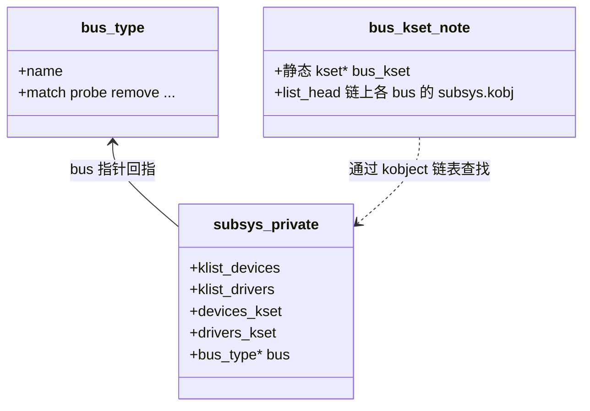
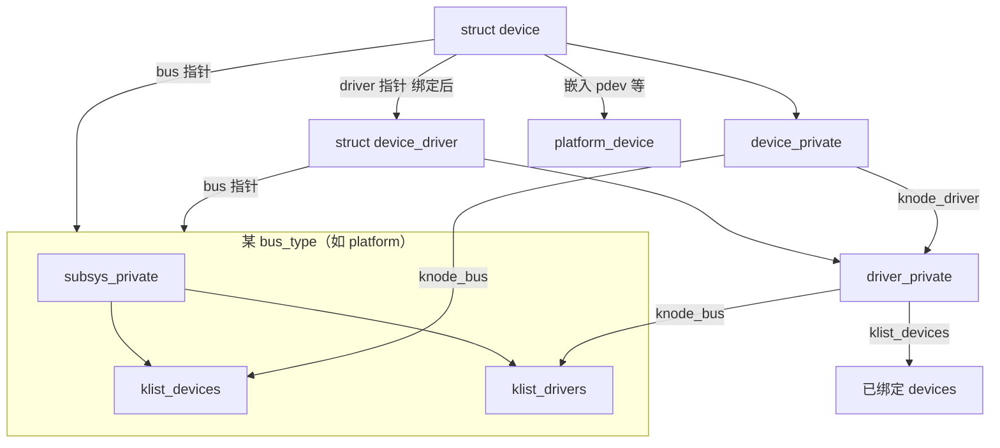

# Session 3 — Task 3（bus / dev / drv 链接结构梳理）

## 第一部分：原始问题与分析理解

**原始 prompt（摘自 prompts_for_read_LDM.md Task 3）**

分层梳理 bus 在内核中的存储与管理是否链表 + UML；同理说明 dev；不同 bus 的 dev 如何分类；drv 是否有独立链表还是 dev 的成员；综合费曼 + 图 + 易记心智模型。

_*分析理解：答案必须落到 `subsys_private`、`klist`、`klist_node`、`driver_private`、`device_private` 以及 sysfs `kset` 的关系上；澄清「设备链表按总线分桶」「驱动链表按总线分桶」，绑定后另有 `knode_driver` 链接；避免误认为 drv 嵌在 dev 结构体内。*_

---

## 第二部分：回答

### 费曼导语

把内核想成一个 **多层索引图书馆**：

- **每种 bus（`bus_type`）** 是一间 **阅览室**；阅览室内部有两本 **花名册**：一本登记 **所有挂在该总线上的设备**，一本登记 **所有声称能服务该总线的驱动**。
- **`struct device` / `struct platform_device`** 是 **读者证件**，证件上写着你在哪间阅览室（`dev->bus`）。
- **`struct device_driver`** 是 **服务商执照**，同样标明所属阅览室（`drv->bus`）。
- **绑定**以后，证件上还会手写「当前服务商是谁」（`dev->driver`），并在两边私有结构里打上 **双向索引结点**，便于卸载与电源管理遍历。

这与 MR-Lite 的差异：MR-Lite 主要在 **`mr_dev` 树上用 `list`/`clist`**；Linux 额外引入 **`bus_type` + kobject/sysfs + klist** 三层叠加。

---

### 1. Bus：内存形态与管理结构

**对外接口**：`struct bus_type`（常量模板，见 `linux/include/linux/device/bus.h`）。

**对内实现**：每注册一条 bus，`bus_register()` 创建 **`struct subsys_private`**（`drivers/base/base.h`），持有：

- **`devices_kset` / `drivers_kset`**：sysfs 目录语义；
- **`klist_devices` / `klist_drivers`**：**串联该总线上所有 device / driver 的核心链表结构**（类型为 `struct klist`，支持引用计数安全的迭代）。

```42:54:c:\tangyapeng\repos\about_linux\ipc-shm-and-kernel\linux\drivers\base\base.h
struct subsys_private {
	struct kset subsys;
	struct kset *devices_kset;
	struct mutex mutex;

	struct kset *drivers_kset;
	struct klist klist_devices;
	struct klist klist_drivers;
	/* ... */
	const struct bus_type *bus;
```

**全局 bus 索引**：`drivers/base/bus.c` 里 **`bus_kset`** 持有多个 **bus 子系统的 kobject**，`bus_to_subsys()` 通过遍历 **`bus_kset->list`** 找到对应 `subsys_private`。



**小结**：bus 本身常被静态分配；**动态的「管理容器」是 `subsys_private`**；**成员遍历主要靠 `klist`**（不是裸 `list_head` 直连 `bus_type`）。

---

### 2. Dev：静态说明与「按 bus 分类」

**对象**：绝大多数子系统 **嵌入 `struct device`**（platform 则在 `platform_device.dev`）。

关键字段（节选）：

```705:720:c:\tangyapeng\repos\about_linux\ipc-shm-and-kernel\linux\include\linux\device.h
struct device {
	struct device_private	*p;
	const struct bus_type	*bus;
	struct device_driver *driver;
	void		*driver_data;
	struct device_node	*of_node;
```

**私有附着**：`device_private`（动态分配）包含 **`knode_bus`**：

```109:114:c:\tangyapeng\repos\about_linux\ipc-shm-and-kernel\linux\drivers\base\base.h
struct device_private {
	struct klist_node knode_driver;
	struct klist_node knode_bus;
```

**分类方式**

1. **第一维：`dev->bus` 指针**——同一物理芯片可同时出现在不同抽象里，但 **每个 `struct device` 实例只属于一条总线类型**（platform、PCI、USB…）。
2. **第二维：该总线下的 `klist_devices`**——同一 bus 的所有设备通过 **`knode_bus`** 串在同一 **klist**；**不是**「一个大全局 device 链表再在运行时过滤」为主体模型。
3. **物理/逻辑父子**：另有 **`device.parent`** 与 **`knode_parent`**（层次结构，常与 sysfs 路径对应）。

**回答「不同 bus 的不同 dev 是否在不同 bus 链表上？」——是。** 每种 bus 的 **`subsys_private.klist_devices`** 各自独立；platform MSCM 设备不会在 PCI 的 `klist_devices` 里。

---

### 3. Drv：静态说明；是否有独立链表？

**对象**：`struct device_driver`（platform 则嵌在 `platform_driver.driver`）。

```96:120:c:\tangyapeng\repos\about_linux\ipc-shm-and-kernel\linux\include\linux\device\driver.h
struct device_driver {
	const char		*name;
	const struct bus_type	*bus;
	const struct of_device_id	*of_match_table;
	int (*probe) (struct device *dev);
	/* ... */
```

**私有附着**：`driver_private`：

```79:84:c:\tangyapeng\repos\about_linux\ipc-shm-and-kernel\linux\drivers\base\base.h
struct driver_private {
	struct kobject kobj;
	struct klist klist_devices;
	struct klist_node knode_bus;
	struct device_driver *driver;
};
```

**`bus_add_driver` 行为摘要**：分配 `driver_private`，**`klist_add_tail(&priv->knode_bus, &sp->klist_drivers)`**。

**结论**

- **驱动有独立于「设备链表」之外的一条总线级链表：`klist_drivers`。**
- **驱动不是 `struct device` 的一个成员**；相反，绑定后 **`device.driver` 指针指向 `device_driver`**。
- **`driver_private.klist_devices`**：记录 **当前绑定到此驱动的 device**（从驱动视角的设备列表），与 **`device_private.knode_driver`** 配对。

---

### 4. 三者总体静态关系 + 速记口诀



**便于记忆的短文**

> **Bus** 像阅览室招牌（`bus_type`）+ 柜台里的两本册子（`klist_devices` / `klist_drivers`）。  
> **Device** 像读者证：`bus` 决定进哪间阅览室，`knode_bus` 把你的名字记在册子里；`probe` 成功后 **`driver` 字段**写上服务商。  
> **Driver** 像服务商执照：`knode_bus` 登上驱动名册；它自己还有一本 **「我手头正在服务的客户列表」**（`driver_private.klist_devices`）。  

与 MR-Lite 对齐记忆：**MR-Lite 一棵树串一切；Linux 先按「阅览室」分桶，再在桶内用 klist/kobject 维护秩序。**

---

### 与本仓库示例的落点

`ipc-uio.c` 中的 **`ipc_shm_driver`** 注册后：

- 出现在 **`platform_bus_type` → subsys_private → `klist_drivers`**；
- 匹配成功后目标 **`platform_device.dev`** 出现在同一 subsys 的 **`klist_devices`**，且 **`dev->driver == &ipc_shm_driver.driver`**，`probe` 收到 `pdev`。
