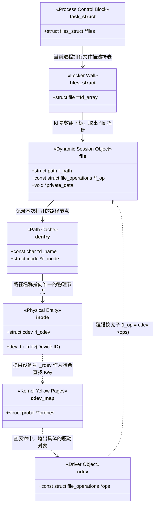

### 核心目标 结构体 及其周边扩展（file及其数据下标 FD）

---
## From AI
### 第一性原理 1：字符串如何变成物理节点？( `file-path` -> `inode` )

**第一性原理：树形遍历与高速缓存 (Tree Traversal & Caching)。** 内核是不可能“瞬间”理解 `"/dev/ipc-shm"` 是什么的。它必须从根目录 `/` 开始，一层层去磁盘或内存文件系统中解析。

**费曼隐喻：送快递与导航缓存 (`dentry`)** 假设你要给“广东省/深圳市/南山区/某大楼”送信（`open` 文件）。

- 如果每次都要从全国地图查到省、再查到市，这太慢了。
- Linux 为了加速，发明了 **目录项高速缓存 (`dentry` & `dcache`)**。
- 内核在内存里建了一棵导航树。当它第一次费劲查到 `ipc-shm` 时，会生成一个 `dentry` 对象，里面写着：“名字叫 `ipc-shm` 的路径，它的物理实体是内存地址为 0xFFFF... 的那个 `inode`”。
- 下次再 `open` 时，VFS 直接从 `dcache` 缓存里**秒出** `inode`！

---

### 第一性原理 2：整数如何变成会话对象？( `fd` -> `struct file` )

**第一性原理：O(1) 复杂度的数组寻址 (Array Indexing)。** `fd` 为什么是个极简的整数（比如 3, 4, 5）？因为在计算机科学的第一性原理中，**最快的查找方式就是“查数组”！** `fd` 本质上就是内核空间里一个数组的**下标（Index）**。

**费曼隐喻：澡堂的专属储物柜墙**

- 用户进程去洗澡，前台（内核）给你建了一个专属的**储物柜墙（`files_struct`）**。
- 你每打开一个文件，内核就在墙上找个空柜子（比如 3 号柜），把这次会话的记录本（`struct file *` 指针）放进去。
- 内核交给你一个手牌，上面写着数字 3（这就是 `fd`）。
- 以后你调用 `read(3, ...)`，内核只做一件事：去你的专属储物柜墙，打开 3 号柜子，拿出 `file` 指针，开始读写。

---

### 第一视角：静态架构与指针的连环跳跃 (UML 类图)

下面这张静态组件图，展示了从用户进程（`task_struct`）出发，通过数组下标 `fd`，一路跳跃到物理设备驱动的完整静态内存网。
![[Pasted image 20260525140809.png]]


---

### 终极解析：`open` -> `sys_open` -> `driver->open` 的映射原理

现在，我们在时间线上推演 `fd = open("/dev/ipc-shm", O_RDWR);` 这一行代码引发的**物理级突变**。整个过程分为三个阶段：分配资源、解析替换、引爆驱动。

#### 动态映射流程 (UML 序列图)

请死死盯住图中的 **第 8 步（延迟绑定）** 和 **第 10 步（多态击穿）**！

```
sequenceDiagram
    autonumber
    participant App as 用户态 (User Space)
    participant VFS as VFS (sys_open)
    participant Dcache as 路径缓存 (dentry)
    participant CdevMap as 内核黄页 (cdev_map)
    participant Drv as 底层驱动 (driver->open)

    App->>VFS: open("/dev/ipc-shm", O_RDWR)
    activate VFS

    Note over VFS: 阶段一：分配 fd 与空白会话
    VFS->>VFS: 在当前进程 files_struct 中寻找空闲下标 (获取 fd=3)
    VFS->>VFS: kmalloc 分配空白的 struct file 对象

    Note over VFS, Dcache: 阶段二：字符串到物理节点的映射
    VFS->>Dcache: 解析路径 "/dev/ipc-shm"
    Dcache-->>VFS: 缓存命中，返回对应的 inode 实体
    VFS->>VFS: 将 inode 与 file 绑定 (file->f_inode = inode)

    Note over VFS: 此时 VFS 发现这是字符设备，启用兜底的 def_chr_fops
    VFS->>VFS: 默认调用 def_chr_fops->open()，即 chrdev_open(inode, file)

    Note over VFS, CdevMap: 阶段三：设备号路由与狸猫换太子 (核心魔法)
    VFS->>VFS: 提取 inode->i_rdev (例如拿到设备号 244:0)
    VFS->>CdevMap: kobj_lookup(244:0) 极速哈希查表
    activate CdevMap
    CdevMap-->>VFS: 返回匹配的驱动对象 struct cdev *
    deactivate CdevMap

    Note over VFS: 【物理突变】: file->f_op = cdev->ops
    VFS->>VFS: VFS 将会话的操作契约，替换为您驱动提供的 operations！

    Note over VFS, Drv: 阶段四：跨越边界，直达驱动
    VFS->>Drv: 执行替换后的 file->f_op->open(inode, file)
    activate Drv
    Note right of Drv: 您的驱动开始执行（如留存上下文等硬件初始化动作）
    Drv-->>VFS: 返回 0 (成功)
    deactivate Drv

    VFS->>VFS: fd_install(fd, file): 将组装好的 file 指针放入 fd 对应的储物柜
    VFS-->>App: 返回 fd = 3
    deactivate VFS
```

### 架构师心智总结：伟大在于极简

看完了这惊心动魄的转换，你会深刻理解为什么 UNIX/Linux 被称为人类软件工程的奇迹：

1. **屏蔽复杂（String to ID）**：用户态的代码不需要知道哈希表、`cdev`、甚至驱动长什么样。用户传一个直观的字符串，VFS 替用户把它翻译成底层认得的“机器编码（设备 ID）”。
2. **极限解耦（Late Binding）**：`VFS` 在 `open` 被触发的那一微秒前，根本不知道 `/dev/ipc-shm` 对应的代码在哪。它纯靠临场查字典（`cdev_map`），完成了 `file->f_op` 的替换。
3. **大智若愚（Integer FD）**：当一切复杂的组装、路由、替换完成后，内核只给用户层丢回去一个普普通通的整数（`fd`）。用户层只需要握着这个数字索引，就能像扣动扳机一样，让内核深处千万行代码为你精准干活！