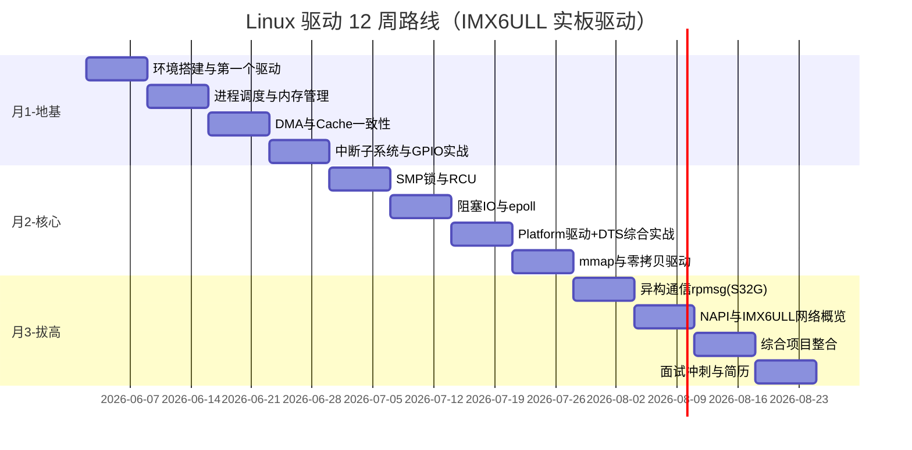

# Linux 内核/驱动开发 · 三个月求职导向学习规划

> **规划版本**：v1.1  
> **规划周期**：12 周（2026-06-02 ~ 2026-08-24）  
> **硬件平台**：正点原子 IMX6ULL Mini 开发板（ARM Cortex-A7 + Linux）  
> **背景**：5 年 MCU HAL / RTOS / ARM 内核 · NXP S32G 异构多核 · 自研 MR 驱动框架  
> **目标**：具备 Linux 驱动工程师岗位面试竞争力 + 可展示的真实项目

---

## 〇、马斯克式第一性原理：这份规划为什么存在

> *"Don't reason by analogy. Reason from first principles."*  
> — 不要类比着学，要从物理事实出发。

### 0.1 求职的本质是什么？

剥离所有「应该学内核」「应该看 500 页书」的类比思维，面试的本质只有三件事：

```
1. 你能不能让硬件在 Linux 下正常工作？        → 动手能力
2. 你能不能说清「用户 write 到寄存器」的路径？ → 原理深度
3. 你的经验是否比「只看过视频的人」更可信？    → 可验证产出
```

**结论**：一切不服务于这三件事的学习，都是噪音。删掉它。

### 0.2 你的起点，用物理事实描述

| 事实 | 推论 |
|------|------|
| 你写了 5 年代码，直接碰过寄存器和中断 | 不需要从「什么是 GPIO」学起 |
| 你自研了 MR 框架，笔记已穿透 LDM/CDEV/VFS | 不需要从「什么是驱动」学起 |
| 你有 IMX6ULL 实板 | 不需要 QEMU 模拟——**真硬件 > 仿真，永远** |
| 你在 S32G 上做 IPC | rpmsg 是差异化武器，但不是第 1 周的任务 |
| 笔记 TOP 标了 TODO：内存/调度/DMA | 这才是真正的瓶颈，不是 VFS |

### 0.3 第一性原理决策树

```
问：这个模块要不要学？
  ├─ 面试会直接问？ ──否──→ 删掉（U-Boot 源码、I2C 基础、全 TCP/IP 栈）
  ├─ 写驱动绕不开？ ──是──→ 必须学，且必须在 IMX6ULL 上跑通
  └─ 能形成简历差异化？ ──是──→ 第 3 月做（rpmsg 对标 S32G 经验）
```

### 0.4 马斯克式执行法则（本规划的操作系统）

| 法则 | 在本规划中的体现 |
|------|------------------|
| **Delete** | 砍掉 U-Boot 深挖、简单总线驱动、全内核漫游 |
| **Simplify** | 每模块固定四步：静态图 → 费曼 → 序列图 → 实板验证 |
| **Accelerate** | Week 1 就上板写驱动，不等「学完再动手」 |
| **Automate** | 用 NotebookLM + 自研笔记体系批量啃源码，不手抄 |
| **Iterate** | 每周五复盘：能跑了吗？能讲了吗？不能 → 下周只补这个 |

---

## 一、个人画像与现状评估

### 1.1 核心优势（面试可直接变现）

| 维度 | 积累 | Linux 迁移价值 |
|------|------|----------------|
| 硬件直觉 | 5 年寄存器级 HAL、中断、DMA | probe 里 ioremap/request_irq 零成本 |
| RTOS 并发 | TCB、事件组、就绪链表 | wait_queue/poll/spin_lock 快速锚定 |
| MR 自研框架 | 三层脱壳 + ops 虚表 | 与 LDM + Subsystem + fops 同构 |
| S32G 实战 | A+M 异构、共享内存 IPC | 汽车域控 / rpmsg 差异化 |
| 学习方法 | UML + 费曼 + 源码追踪 | 比视频学习效率高一个数量级 |

### 1.2 笔记体系诊断（工作区 60+ 篇）

**已掌握（可进面试）**

```
用户态 open/read/write
    ↓ 系统调用
VFS 漏斗：inode → chrdev_open → cdev_map → fops
    ↓
CDEV 六阶段：alloc_chrdev_region → cdev_add → device_create → udev/mknod → open 路由
    ↓
LDM：bus match → probe → 子系统注册
    ↓
DTS：dtb → device_node → platform_device → devm_* 资源提取
```

**辅助理解已到位**

- MR → Linux 三权分立（device / subsystem / driver）
- wait_queue 多队列挂载 + 唤醒清理
- poll 两遍遍历 + poll_freewait
- 软中断三级跳 + spin_lock_bh 选型
- ioremap vs mmap 职责边界
- MMU Lazy Allocation 基本概念

**明确缺口（必须补）**

| 优先级 | 模块                     | 面试风险     |
| --- | ---------------------- | -------- |
| P0  | DMA + Cache 一致性        | ★★★★★    |
| P0  | 进程调度 + 内存管理            | ★★★★★    |
| P0  | SMP 锁 + RCU            | ★★★★     |
| P1  | 中断完整链路（GIC/IRQ domain） | ★★★★     |
| P1  | select/poll/epoll 深度   | ★★★★     |
| P1  | 可展示驱动项目                | ★★★★★    |
| P2  | NAPI / 网络驱动            | ★★★      |
| P2  | remoteproc / rpmsg     | ★★★      |
| P3  | U-Boot 深度              | ★★ 懂流程即可 |

### 1.3 竞争力定位

```
当前：架构理解 Top 20%，动手 + 硬核子系统 Top 50% 以下
目标：可独立交付 Platform/Char 驱动 + 能讲清 DMA/并发/内存
方向：汽车电子 / 工业网关 / 异构 SoC（S32G 经验加分）
```

---

## 二、硬件平台：IMX6ULL Mini 的战略定位

### 2.1 为什么 IMX6ULL 是你的最佳实验台

> 第一性原理：学习驱动的最小闭环 = **改 DTS → 编译内核/模块 → 上板 → dmesg 验证**

正点原子 IMX6ULL Mini 完美满足：

| 能力 | IMX6ULL 提供 | 对应学习模块 |
|------|-------------|-------------|
| ARM Cortex-A7 32-bit | 真实 MMU + Cache | 内存管理、DMA 一致性 |
| 成熟 BSP | 原厂内核 + 设备树 + 交叉编译链 | 零环境阻力，Week 1 就上板 |
| 丰富外设 | UART / I2C / SPI / GPIO / ECSPI / PWM / ADC | Platform 驱动实战 |
| 网络 | ENET | NAPI / 网络驱动概览 |
| 社区资料 | 正点原子教程 + 论坛 | 仅作参考，以内核源码为准 |
| 调试手段 | 串口 + NFS + gdb（可选） | printk / ftrace 调试 |

### 2.2 IMX6ULL 与 S32G 的分工

```
IMX6ULL  ──→  主力训练场：驱动写法、DMA、中断、DTS、面试通用技能
S32G     ──→  差异化战场：rpmsg/异构 IPC、汽车域控项目包装（第 9 周起）
```

**不要**在 IMX6ULL 上硬做 rpmsg——它没有 A+M 异构。把 rpmsg 留到 S32G 或理论+源码阅读。

### 2.3 开发环境清单（Week 1 Day 1 完成）

- [ ] 正点原子 IMX6ULL 开发板 + 串口线 + 网线
- [ ] Ubuntu 20.04/22.04 虚拟机或物理机
- [ ] 正点原子提供的：`linux-imx` 内核源码 + 交叉编译工具链
- [ ] 板子能正常启动 Linux，串口登录 OK
- [ ] NFS 或 SD 卡部署 `.ko` 模块
- [ ] （可选）QEMU 作为离线调试补充，**不以 QEMU 为主**

### 2.4 IMX6ULL 内核源码关键路径速查

```
arch/arm/boot/dts/imx6ull-*.dts          # 设备树
drivers/char/                             # 字符设备参考
drivers/gpio/gpio-mxc.c                  # GPIO 子系统（i.MX 原生）
drivers/tty/serial/imx.c                 # UART 驱动（经典 Platform 驱动）
drivers/spi/spi-imx.c                    # SPI 控制器
Documentation/devicetree/bindings/       # DTS 规范
```

---

## 三、学习战略

### 3.1 每模块固定四步（不跳步）

1. **静态轮廓**：是什么 / 核心结构体 / 对上接口 / 对下依赖 → Mermaid 组件图
2. **费曼讲解**：用 MR 框架 / RTOS 概念做锚点，30 分钟口述录音
3. **动态流程**：1 个核心场景 → Mermaid 序列图 + 源码 call stack
4. **IMX6ULL 验证**：写 `.ko` 上板，dmesg 截图入库

### 3.2 时间分配（每周 25–30 小时）

| 类型 | 占比 |
|------|------|
| 源码阅读 + UML 笔记 | 35% |
| IMX6ULL 动手编码 | 40% |
| 面试题口述 | 15% |
| 简历/项目包装 | 10%（第 6 周起） |

### 3.3 刻意不做的事

- ❌ 深挖 U-Boot / TF-A 源码
- ❌ 系统学 TCP/IP 协议栈
- ❌ 以 I2C/SPI 基础驱动为主线
- ❌ 全内核漫游
- ❌ 只看视频不动手

---

## 四、十二周路线图



---

## 五、逐周详细计划

---

### Week 1（6/2–6/8）：IMX6ULL 上板 + Char 驱动闭环

> **马斯克检验**：Week 1 结束时，板上必须有一个你自己写的 `.ko` 在跑。否则规划失败。

**Day 1–2：环境**

- 板子启动验证，串口登录
- 编译正点原子内核，理解 `ARCH=arm CROSS_COMPILE=arm-linux-gnueabihf- make zImage dtbs modules`
- 编写 `hello.ko`，NFS 加载，dmesg 看到输出

**Day 3–4：Char 驱动**

- 对照笔记复习 CDEV 六阶段
- 在 IMX6ULL 上实现 misc/char 驱动：`open/read/write/ioctl`
- userspace 测试程序 + `strace` 跟踪系统调用

**Day 5–6：VFS 路径验证**

- 追踪 `def_chr_fops` → `chrdev_open` → `replace_fops` 源码
- 在驱动里 printk 每个 fops 回调，对照 strace 输出
- 补全笔记 TODO：`module_init / Kbuild / Kconfig`

**Day 7：复盘**

- 整理 call stack 笔记
- 10 道自测题口述

**产出物**

```
repo: linux-driver-lab/
  week01-hello/
  week01-char-dev/
  notes/01-char-open-callstack.md
```

**面试自检**

- [ ] open("/dev/xxx") 到驱动 read 的完整路径
- [ ] cdev_add 和 device_create 的区别
- [ ] struct file 与 struct inode 的关系

---

### Week 2（6/9–6/15）：进程调度 + 虚拟内存

> **第一性原理**：MCU 平坦内存 → Linux MMU 页表。搞不清这个，DMA 永远学不透。

**理论**

| RTOS/MCU | Linux |
|----------|-------|
| TCB | task_struct |
| 就绪链表 | CFS runqueue |
| 平坦物理地址 | MMU 四级页表 |
| 静态 heap | kmalloc / vmalloc |

**IMX6ULL 实践**

- 写模块：`kmalloc(GFP_KERNEL)` vs `kmalloc(GFP_ATOMIC)` 对比实验
- 观察 `/proc/meminfo`、`/proc/buddyinfo`
- 结合已有 MMU Lazy Allocation 笔记，追踪 `handle_mm_fault()` 大致流程
- 阅读 `arch/arm/mm/` 中 ARM32 页表相关代码（IMX6ULL 是 32-bit）

**产出物**

- 笔记：`Linux 内存管理 —— 从 MR 平坦内存到 MMU 页表`
- Mermaid：进程创建 → exec → 缺页 → 物理页分配

**面试自检**

- [ ] kmalloc 和 vmalloc 区别？驱动何时用哪个？
- [ ] 用户态 malloc 第一次访问时发生了什么？
- [ ] GFP_KERNEL 和 GFP_ATOMIC 边界？

---

### Week 3（6/16–6/22）：DMA + Cache 一致性 ★最关键一周

> **马斯克判断**：这是 MCU 工程师 → Linux 驱动工程师的「物理墙」。不推掉它，后面全是空中楼阁。

**理论**

- Coherent DMA vs Streaming DMA
- `dma_alloc_coherent` / `dma_map_single` / `dma_sync_*`
- Cache Flush / Invalidate
- ARM32 上 DMA 与 Cache 一致性（IMX6ULL 无 IOMMU，比 ARM64 简单——先在这里搞懂原理）

**IMX6ULL 实践**

- 阅读 `Documentation/core-api/dma-api.rst`
- 参考 `drivers/dma/imx-sdma.c` 或 `drivers/spi/spi-imx.c` 中的 DMA 用法
- 写一个 Platform 驱动：用 `dma_alloc_coherent` 分配 buffer，read 时 DMA 传输数据到 userspace
- dmesg 验证 + 逻辑分析仪（可选）

**NotebookLM 提示词**

> 使用 `ing🗒️.md` 中「内存与 DMA」提示词，输出 Mermaid 组件图 + `dma_map_single` 序列图

**产出物**

- 笔记：`DMA 一致性 —— 从 MCU 裸机 DMA 到 Linux dma-mapping`
- 代码：`week03-dma-demo/`

**面试自检**

- [ ] DMA 前为什么 sync？方向？
- [ ] dma_alloc_coherent vs dma_map_single 场景？
- [ ] CPU 和 DMA 同时访问同一块 buffer 会怎样？

---

### Week 4（6/23–6/29）：中断子系统 + GPIO 实战

**理论**

- ARM GIC 基础（IMX6ULL 使用 GIC-400）
- IRQ Domain / `irq_of_parse_and_map`
- hardirq → softirq/tasklet → workqueue → threaded IRQ
- 复习 spin_lock 层级口诀，扩展完整矩阵

**IMX6ULL 实践**

- **项目**：GPIO 按键中断驱动
  - DTS 添加 gpio-keys 或自定义节点
  - `devm_request_irq` + tasklet/workqueue 下半部
  - 对比 top half 直接处理 vs 下半部延迟处理
- 阅读 `drivers/gpio/gpio-mxc.c` 理解 i.MX GPIO 控制器
- 用 `cat /proc/interrupts` 观察中断计数

**产出物**

- 代码：`week04-gpio-irq/`
- 笔记：`中断从硬件到驱动 ISR 的完整链路（ARM + GIC）`
- Mermaid 序列图：硬件中断 → GIC → handle_irq_event → 驱动 handler

**面试自检**

- [ ] 硬中断里能 sleep 吗？
- [ ] tasklet vs workqueue 选型？
- [ ] threaded IRQ 解决什么问题？

---

### Week 5（6/30–7/6）：SMP 并发与 RCU

> IMX6ULL 是单核 A7，但面试必问 SMP/RCU。在单核板上写代码，在笔记里推演多核场景。

**理论**

- Spinlock / Mutex / RWLock / Seqlock 完整选型矩阵
- 内存屏障：smp_mb / smp_wmb / smp_rmb
- RCU 基本原理与 grace period
- PREEMPT_RT 概念（了解）

**实践**

- 写模块：故意制造竞态 + spinlock 修复
- 阅读 `include/linux/rcupdate.h` 注释
- 完善 spin_lock_bh / spin_lock_irqsave 笔记为完整决策树

**产出物**

- 笔记：`Linux 锁机制选型决策树`（一图流）

**面试自检**

- [ ] 为什么中断上下文不能用 mutex？
- [ ] RCU 适用场景？
- [ ] spin_lock_bh vs spin_lock_irqsave？

---

### Week 6（7/7–7/13）：阻塞 IO —— wait_queue → poll → epoll

**理论**

- 补全 wait_queue / poll / epoll 笔记 TODO
- epoll 红黑树 + 就绪链表（对比 RTOS 就绪链表）
- 非阻塞 IO + O_NONBLOCK

**IMX6ULL 实践**

- 改造 Week1 char 驱动：加入 wait_queue
  - 模拟「数据未就绪阻塞 / 中断唤醒」
  - 可用 kernel timer 模拟数据到达
- userspace 程序对比 select / poll / epoll
- 追踪 `fs/select.c` 和 `fs/eventpoll.c`

**产出物**

- 代码：`week06-blocking-char-dev/`
- 笔记：`从 wait_queue 到 epoll —— 完整 IO 多路复用链路`

**面试自检**

- [ ] epoll 比 select 高效在哪？
- [ ] poll 唤醒后为什么 second pass？
- [ ] wait_queue 在哪个结构体上？

---

### Week 7（7/14–7/20）：Platform 驱动 + DTS 综合实战 ★核心项目周

> **马斯克原则**：这是第一个「能写进简历」的完整驱动。质量 > 数量。

**IMX6ULL 实践：完整 Platform 驱动**

```
mydevice.dts 描述硬件
    ↓
platform_driver probe
    ↓
devm_ioremap_resource + devm_request_irq
    ↓
cdev/misc 注册 → /dev/mydevice
    ↓
read/write/ioctl + wait_queue 阻塞
    ↓
remove 自动清理（devm_*）
```

**推荐选题（三选一）**

| 选题 | IMX6ULL 硬件 | 亮点 |
|------|-------------|------|
| A. 自定义 LED/GPIO 控制器 | GPIO | 简单可靠，快速闭环 |
| B. ECSPI 外设驱动 | SPI 接口 | 覆盖总线 + 中断 + 阻塞 IO |
| C. ADC 采样驱动 | I.MX ADC | DMA + 阻塞 read |

**DTS 要求**

- 严格遵循 `Documentation/devicetree/bindings/`
- 使用 pinctrl 节点（IMX6ULL 引脚复用）
- `status = "disabled"` → `okay` 覆盖模式

**产出物**

- 代码：`platform-driver-template/`（简历项目雏形）
- 笔记：补全 bus-device-driver flow

**面试自检**

- [ ] probe 函数标准步骤？
- [ ] compatible 匹配原理？
- [ ] devm_ioremap_resource vs ioremap？

---

### Week 8（7/21–7/27）：mmap / 零拷贝 / UIO

**理论**

- 深入 ioremap vs mmap 笔记
- `remap_pfn_range` / `dma_mmap_coherent`
- UIO 框架与用户态驱动

**IMX6ULL 实践**

- 给 Week7 驱动添加 mmap：将 DMA buffer 映射到 userspace
- 或实现简化版 shared memory 驱动
- 阅读 `drivers/uio/uio.c`，补全 UIO 笔记 TODO

**产出物**

- 代码：`week08-mmap-demo/`
- 笔记：`mmap 零拷贝 —— 从 ioremap 到用户态直达`

**面试自检**

- [ ] mmap 和 read 拷贝的区别？
- [ ] 为什么寄存器映射通常 uncached？
- [ ] UIO 适用场景？

---

### Week 9（7/28–8/3）：remoteproc + rpmsg（S32G 差异化）

> IMX6ULL 上无法跑 rpmsg。本周在 S32G 实板或源码级学习。

**理论**

- 对比自研共享内存 IPC vs Linux rpmsg 框架
- remoteproc 生命周期
- rpmsg：virtio ring → channel → endpoint

**实践**

- S32G 上跑通 rpmsg echo（如有条件）
- 或 QEMU + 源码阅读：`drivers/rpmsg/` + `drivers/remoteproc/`
- 写对比笔记：MR IPC vs rpmsg 架构

**产出物**

- 笔记：`异构多核通信 —— 从裸机共享内存到 rpmsg`

**面试自检**

- [ ] rpmsg 和 socket 的相似性？
- [ ] remoteproc 管理什么？
- [ ] virtio ring 基本原理？

---

### Week 10（8/4–8/10）：NAPI + IMX6ULL 网络概览

**理论**

- NAPI：硬中断 → softirq → poll 批量收包
- net_device / net_device_ops / sk_buff
- 关联 Week4 软中断笔记

**IMX6ULL 实践**

- 板子 ping 通，理解网络已工作
- 阅读 `drivers/net/ethernet/freescale/fec.c`（i.MX 原生以太网驱动）
- 追踪 NAPI 收包路径，不必写完整网驱

**产出物**

- 笔记：`NAPI 收包路径 —— 从中断到协议栈`

---

### Week 11（8/11–8/17）：综合项目整合 ★简历级交付

**马斯克标准**：一个 repo，clone 下来能编译、能跑、README 能看懂。

**推荐项目：IMX6ULL 多功能 Platform 驱动**

整合前 10 周成果：

```
✅ 设备树描述硬件（DTS）
✅ Platform driver probe/remove
✅ ioremap + 寄存器操作
✅ 中断 + tasklet/workqueue 下半部
✅ 阻塞 read（wait_queue）
✅ mmap 零拷贝（可选）
✅ 正确的锁使用
✅ README：架构 Mermaid 图 + 编译/测试步骤
✅ dmesg 截图 + userspace 测试输出
```

**本周任务**

- 整合代码到 `imx6ull-driver-project/`
- 写 README（中文 + 关键英文术语）
- 录制 3 分钟项目讲解视频（面试口述练习）

---

### Week 12（8/18–8/24）：面试冲刺

**必须能口述的 10 条路径**

1. 用户 open 到驱动 read 完整路径
2. LDM match/probe 流程
3. 设备树 → platform_device 转化
4. 中断上下文的限制
5. 锁选型矩阵
6. DMA 一致性
7. kmalloc vs vmalloc
8. mmap 原理
9. poll/epoll 机制
10. 模块加载/卸载流程

**刷题计划**

| 类别 | 数量 | 方式 |
|------|------|------|
| 概念题 | 50 题 | 限时 2 分钟/题口述 |
| 源码追踪 | 10 题 | 白板画 call stack |
| 场景设计 | 5 题 | 「设计一个 XXX 驱动」 |
| 排查题 | 5 题 | 「驱动导致 kernel panic 怎么查」 |

**简历关键词**

```
Linux Kernel Driver | Device Tree | Platform Driver | Char Device
Interrupt | DMA | mmap | ARM | IMX6ULL | Buildroot/Yocto
rpmsg（S32G 经验）| 汽车电子
```

**投递方向**

- 第一梯队：NXP / 地平线 / 黑芝麻 / 华为车 BU / 博世 / 大陆
- 第二梯队：瑞芯微 / 全志 / 飞思卡尔系 IMX 方案商
- 第三梯队：通用嵌入式 Linux 岗位

---

## 六、知识体系全景图

```
                    ┌─────────────────────────────────┐
                    │         User Space App          │
                    │  open/read/mmap/poll/epoll      │
                    └──────────────┬──────────────────┘
                                   │ 系统调用
                    ┌──────────────▼──────────────────┐
                    │              VFS                 │
                    │  inode → file → f_op 路由        │
                    └──────────────┬──────────────────┘
                                   │
          ┌────────────────────────┼────────────────────────┐
          │                        │                        │
    ┌─────▼─────┐          ┌──────▼──────┐         ┌───────▼───────┐
    │   CDEV    │          │  Subsystem  │         │  mmap/poll    │
    │ cdev_map  │          │  TTY/GPIO/  │         │  wait_queue   │
    └─────┬─────┘          │  Input/UIO  │         └───────────────┘
          │                └──────┬──────┘
          │                       │
    ┌─────▼───────────────────────▼──────────────────────────┐
    │                    LDM (kobject/device/bus)             │
    │         match → probe → devm_* → sysfs/devtmpfs       │
    └─────┬──────────────────────────────────────────────────┘
          │
    ┌─────▼─────┐    ┌──────────┐    ┌──────────┐    ┌──────────┐
    │    DTS    │    │   IRQ    │    │   DMA    │    │  MM/调度  │
    │ device_node│   │ GIC/domain│   │ cache sync│   │ kmalloc  │
    └───────────┘    └──────────┘    └──────────┘    └──────────┘
          │                │               │               │
    ┌─────▼────────────────▼───────────────▼───────────────▼─────┐
    │         IMX6ULL Mini (Cortex-A7 / i.MX6ULL SoC)           │
    └─────────────────────────────────────────────────────────────┘
```

**图例**

- 🟢 已掌握：VFS 漏斗、CDEV 流程、LDM 框架、DTS 基础、wait_queue、软中断
- 🟡 第 1–2 月补齐：DMA、内存管理、SMP 锁、完整中断链、epoll
- 🔴 第 3 月拔高：rpmsg(S32G)、NAPI、综合项目

---

## 七、推荐资源

| 类型 | 资源 | 用途 |
|------|------|------|
| 硬件 | 正点原子 IMX6ULL Mini | 主力实验台 |
| 硬件 | NXP S32G（工作板） | rpmsg 差异化 |
| 源码 | 正点原子 linux-imx + NotebookLM | 主线学习 |
| 书 | 《Linux 设备驱动程序》LDD3 | API 参考 |
| 书 | 《深入理解 Linux 内核》 | 内存/调度/中断 |
| 文档 | kernel.org Documentation/driver-api/ | 官方权威 |
| 文档 | Documentation/devicetree/bindings/ | DTS 规范 |
| 调试 | 串口 printk / ftrace / （可选 gdb） | 实板调试 |

---

## 八、里程碑验收

| 时间 | 里程碑 | 验收标准 |
|------|--------|----------|
| **Week 1 末** | 上板成功 | IMX6ULL 运行自写 `.ko`，char 驱动 read/write OK |
| **Week 4 末** | 地基完成 | GPIO 中断驱动 + 能讲清 DMA 和锁 |
| **Week 7 末** | 核心项目 | 完整 Platform 驱动在 IMX6ULL 上运行 |
| **Week 8 末** | IO 完备 | 阻塞 read + mmap 可用 |
| **Week 11 末** | 简历项目 | GitHub repo + README + 架构图 + 实机截图 |
| **Week 12 末** | 面试就绪 | 50 道概念题口述流畅 + 3 分钟项目讲解 |

---

## 九、缺口追踪表（来自笔记 TODO 汇总）

| 状态 | 模块 | 来源笔记 | 计划周 |
|------|------|----------|--------|
| ⬜ | 进程调度 / 任务通信 | 0-TOP-kernel | W2 |
| ⬜ | 内存管理 | 0-TOP-kernel | W2 |
| ⬜ | DMA + Cache | ing🗒️.md | W3 |
| ⬜ | GIC / IRQ domain | 100. etc | W4 |
| ⬜ | SMP / RCU | ing🗒️.md | W5 |
| ⬜ | select / poll / epoll | 5.APIs | W6 |
| ⬜ | Platform bus 之外的总线 | 1.2 Bus Type | W7 |
| ⬜ | glue 层实现 | 1.5 双层框架 2 | W7 |
| ⬜ | module_init / Kbuild | 1.3 | W1 |
| ⬜ | kobject → sysfs 展示 | 1：kobject多list | W7 |
| ⬜ | 子系统架构 | sub-systems | W7-8 |
| ⬜ | UIO 子设备分配路由 | UIO todo | W8 |
| ⬜ | VFS inode i_fop 由来 | VFS-todo | W1 |
| ⬜ | rpmsg / remoteproc | ing🗒️.md | W9 |
| ⬜ | NAPI | — | W10 |
| ✅ | LDM / CDEV / VFS 主线 | 已有笔记 | — |
| ✅ | DTS 基础 | DTS 笔记 | — |
| ✅ | wait_queue / poll 基础 | 5.APIs / poll | — |
| ✅ | 软中断 / spin_lock_bh | 100. etc | — |
| ✅ | ioremap vs mmap 概念 | 100. etc | — |

---

## 十、马斯克式每周复盘模板

> 每周五晚 30 分钟，诚实回答。有一个「否」就下周只补那个。

```
□ 本周代码在 IMX6ULL 上跑通了吗？
□ 我能不看笔记，2 分钟口述本周核心原理吗？
□ 我写了 Mermaid 组件图 + 序列图吗？
□ 笔记里有 dmesg / 终端截图作为证据吗？
□ 有没有在学「面试不考的东西」？→ 有就删掉
```

---

## 十一、最后一句

> *"When something is important enough, you do it even if the odds are not in your favor."*

你有 5 年硬件直觉、一套自研框架的方法论、60 篇高质量笔记、一块 IMX6ULL 实板、一个 S32G 差异化故事。

**缺的不是智商，是 DMA 一致性、一个跑在板子上的驱动、和 12 周不加修饰的执行。**

Week 1，Day 1：插电，编译，加载 hello.ko。

现在就开始。

---

*规划生成日期：2026-06-02 · 基于工作区笔记深度分析 · 硬件：正点原子 IMX6ULL Mini*
