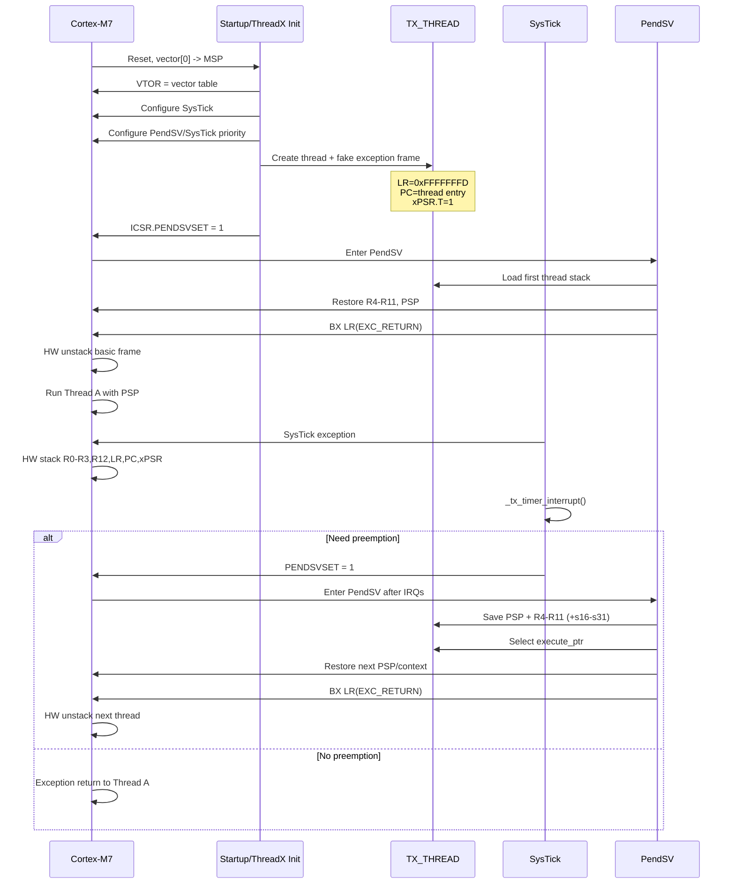

# Cortex-M7 RTOS Core Registers and ThreadX Porting Notes

> 目标：只保留 **Cortex-M7 / Armv7-M 中与 RTOS 调度、上下文切换、临界区、tick、异常入口和 FPU 上下文直接相关的寄存器**。  
> 校验基线：Eclipse ThreadX `eclipse-threadx/threadx`，`master`，`ports/cortex_m7/gnu/`。

## 1. 总：RTOS 看 Cortex-M7，只需要先抓住这四组

| 组 | 关键寄存器/异常 | RTOS 作用 |
|---|---|---|
| 线程上下文 | `R0-R12`、`PSP`、`LR`、`PC`、`xPSR` | 保存/恢复线程执行现场 |
| 临界区 | `PRIMASK`、`BASEPRI`、`IPSR` | 保护内核数据，区分 Thread/ISR |
| 调度 | `ICSR.PENDSVSET`、PendSV priority | 请求并真正执行线程切换 |
| 时基/入口 | `SysTick`、`VTOR`、`MSP` | tick、异常入口、系统栈 |

核心运行模型：

```text
Thread A(PSP)
  |
  | IRQ / SysTick / ThreadX API 请求调度
  v
硬件异常入栈：R0-R3,R12,LR,PC,xPSR
  |
  v
== PendSV ==
ThreadX再保存：R4-R11 (+必要时s16-s31)
  |
  v
TCB保存PSP -> 选择Thread B -> 恢复B的PSP/R4-R11
  |
  v
BX LR(EXC_RETURN)
  |
  v
硬件自动恢复R0-R3,R12,LR,PC,xPSR
  |
  v
Thread B继续运行
```

因此 Cortex-M7 RTOS 移植的本质是：

> ==**异常机制 + PSP/MSP + EXC_RETURN + PendSV + 中断屏蔽**==

---

## 2. 分：与 RTOS 直接相关的核心寄存器

### `R0-R12`

Cortex-M 异常入口硬件自动保存：

```text
R0 R1 R2 R3 R12 LR PC xPSR
```

而 ThreadX PendSV 中：

```asm
MRS   r12, PSP
STMDB r12!, {r4-r11}
```

所以：

> ==**R0-R3/R12 由硬件保存；R4-R11 由 ThreadX 保存。**==

这与 AAPCS 的 caller-saved / callee-saved 划分吻合。ThreadX `readme_threadx.txt` 给出的 stack frame 也完全一致。

### ==**MSP / PSP**==

- **MSP**：异常/Handler mode 的栈。
- **PSP**：RTOS 线程栈。
- Handler mode 始终使用 MSP；Thread mode 可使用 MSP/PSP。

ThreadX context switch 直接操作 PSP：

```asm
MRS r12, PSP
STR r12, [r1, #8]      // TCB->tx_thread_stack_ptr
...
LDR r12, [r1, #8]
MSR PSP, r12
```

所以移植调试时：

> ==**PSP 是否跟随当前线程切换，是判断 context switch 是否真正工作的第一证据。**==

`_tx_initialize_low_level()` 还会从 vector table 第一个 word 取得 reset MSP，并保存为 ThreadX system stack。

### ==**LR / EXC_RETURN**==

普通函数中 `LR=R14` 是返回地址；异常中 LR 还携带 **EXC_RETURN**。

ThreadX 创建新线程时伪造：

```asm
LDR r3, =0xFFFFFFFD
```

其关键含义：

> ==**异常返回到 Thread mode，并使用 PSP。**==

PendSV 最后：

```asm
BX lr
```

此时不是普通函数返回，而是触发 exception return，让硬件完成剩余寄存器出栈。

因此：

> ==**ThreadX 首线程启动，本质上是一次“伪造好的异常返回”。**==

ThreadX 还用：

```asm
TST LR, #0x10
```

判断 EXC_RETURN bit[4]，从而判断是否存在 FPU extended frame。

### ==**PC / xPSR**==

`_tx_thread_stack_build()` 为新线程伪造硬件 frame，其中：

```asm
STR r1, [r2, #60]      // PC = function_ptr
MOV r3, #0x01000000
STR r3, [r2, #64]      // xPSR.T = 1
```

Cortex-M7 只执行 Thumb，因此：

> ==**初始 xPSR bit24(T) 必须为 1。**==

首线程启动后 HardFault/UsageFault，优先检查：

1. stacked `PC`；
2. stacked `xPSR.T`；
3. `PSP` 8-byte alignment；
4. `LR=EXC_RETURN`。

`APSR` 不需要 ThreadX 单独保存，它包含在硬件保存/恢复的 `xPSR` 中。

### ==**IPSR**==

- `IPSR == 0`：Thread mode；
- `IPSR != 0`：Handler mode。

ThreadX `_tx_thread_system_return()`：

```asm
MRS r0, IPSR
CMP r0, #0
BNE _isr_context
```

`tx_port.h` 的 `TX_THREAD_GET_SYSTEM_STATE()` 也读取 IPSR。

因此 ISR 内 API 行为异常时，IPSR 是判断执行上下文的直接证据。

### ==**PRIMASK / BASEPRI**==

ThreadX Cortex-M7 port **默认使用 PRIMASK**：

```asm
MRS   ..., PRIMASK
CPSID i
...
MSR   PRIMASK, ...
```

初始化阶段也是：

```asm
CPSID i
```

如果定义：

```c
TX_PORT_USE_BASEPRI
TX_PORT_BASEPRI
```

才改用 BASEPRI。

ThreadX `tx_port.h` 明确要求：

```text
TX_PORT_BASEPRI =
    priority_mask << (8 - number_priority_bits)
```

所以高频错误是把“逻辑优先级 5/6/7”直接写入 BASEPRI，而没有按 `__NVIC_PRIO_BITS` 左移。

> ==**先记住：ThreadX 默认 PRIMASK；BASEPRI 是可选增强方案。**==

### `FAULTMASK`

FAULTMASK 屏蔽能力比普通 RTOS critical section 更强。

ThreadX Cortex-M7 标准 port 不用它做 scheduler lock。

> 普通移植重点掌握 PRIMASK/BASEPRI，不要用 FAULTMASK 代替普通临界区。

### ==**CONTROL**==

Cortex-M7 重点字段：

| bit | 字段 | RTOS 含义 |
|---|---|---|
| 0 | `nPRIV` | Thread privileged/unprivileged |
| 1 | `SPSEL` | Thread mode 选择 MSP/PSP |
| 2 | `FPCA` | 当前 Thread 是否存在 FP context |

标准 ThreadX 调度主要依靠 **PSP + EXC_RETURN**，不是每次切换都改 `CONTROL.SPSEL`。

FPU 场景中 ThreadX 明确操作 `CONTROL.FPCA`。首次调度前：

```asm
MRS r0, CONTROL
BIC r0, r0, #4
MSR CONTROL, r0
```

目的是清 FPCA，避免不必要的 VFP stack frame。

---

## 3. 比 Table H-1 更重要的 RTOS 系统寄存器

### ==**ICSR.PENDSVSET**==

```text
ICSR         = 0xE000ED04
PENDSVSET    = bit 28
PENDSVCLR    = bit 27
```

ThreadX `_tx_thread_system_return()` 和 time-slice 路径都会：

```asm
STR 0x10000000, [0xE000ED04]
DSB
ISB
```

因此必须建立这个模型：

> ==**`_tx_thread_execute_ptr` 决定“应该运行谁”；PendSV 真正完成 context switch。**==

### ==**SHPR3：PendSV / SysTick priority**==

ThreadX Cortex-M7 GNU example：

```asm
LDR r1, =0x40FF0000
STR r1, [0xE000ED20]
```

得到：

- PendSV priority = `0xFF`；
- SysTick priority = `0x40`。

关键要求：

> ==**PendSV 保持最低/接近最低优先级，让普通 IRQ 结束后再切线程。**==

实际 MCU 只实现若干高位 priority bits，因此最终有效值受 `__NVIC_PRIO_BITS` 限制。

### ==**SysTick**==

```text
CTRL = 0xE000E010
LOAD = 0xE000E014
VAL  = 0xE000E018
```

ThreadX example：

```asm
STR SYSTICK_CYCLES, [0xE000E014]
STR 0x7,            [0xE000E010]
```

`SysTick_Handler -> _tx_timer_interrupt()`，后者处理：

- system tick；
- time slice；
- timer expiration；
- 必要时 pend PendSV。

ThreadX 并不强制必须用 SysTick，本质要求是周期性驱动 `_tx_timer_interrupt()`；官方 Cortex-M7 GNU example 使用 SysTick。

### ==**VTOR**==

```text
VTOR = 0xE000ED08
```

ThreadX example：

```asm
LDR r1, =_vectors
STR r1, [0xE000ED08]
```

vector table 中必须正确连接：

```text
PendSV  -> __tx_PendSVHandler
SysTick -> __tx_SysTickHandler
```

若出现 SysTick/PendSV 不进、bootloader 跳 APP 后异常，第一批检查项就是 `VTOR`。

### FPU：`CONTROL.FPCA + FPCCR.LSPACT + EXC_RETURN[4]`

ThreadX PendSV：

```asm
TST    LR, #0x10
BNE    skip
VSTMDB r12!, {s16-s31}
```

ThreadX readme 对应的 FPU frame：

```text
hardware : s0-s15 + FPSCR
ThreadX  : s16-s31
```

这与整数上下文模式一致：

> hardware 保存 caller-saved；RTOS 保存 callee-saved。

若工程启用 FPU，BSP 仍需正确配置 FPU access/lazy stacking；ThreadX scheduler 不是 CPACR 初始化的替代品。

---

## 4. 基于 ThreadX 源码校验后的移植结论

| 场景 | Cortex-M7机制 | ThreadX证据 |
|---|---|---|
| 创建线程 | fake exception frame | `tx_thread_stack_build.S` |
| 首线程启动 | `EXC_RETURN=0xFFFFFFFD` | `tx_thread_stack_build.S` |
| 请求重调度 | `ICSR.PENDSVSET=1` | `tx_thread_system_return.S` / `tx_port.h` |
| 保存线程 | `PSP + R4-R11` | `tx_thread_schedule.S` |
| 硬件上下文 | `R0-R3,R12,LR,PC,xPSR` | Arm exception model + ThreadX readme |
| FPU上下文 | EXC_RETURN[4] + `s16-s31` | `tx_thread_schedule.S` |
| 临界区 | PRIMASK / 可选 BASEPRI | `tx_port.h` |
| ISR判断 | IPSR | `tx_thread_system_return.S` |
| tick | SysTick -> `_tx_timer_interrupt` | `tx_initialize_low_level.S` |
| 真正切线程 | PendSV handler | `tx_thread_schedule.S` |

一个源码校验后必须修正的认知：

`cortexm7_vectors.S` 的 SVC vector 旁边有“used by Threadx scheduler”的注释，但当前 GNU port 的真正调度路径是 **PendSV**；example 的 `__tx_SVCallHandler` 本身只是 trap loop。

> ==**不要把 SVC 当成当前 Cortex-M7 ThreadX 的核心 context-switch exception。**==

移植建议顺序：

1. **Startup**：vector[0]、Reset、VTOR、Thumb 地址正确。
2. **Low-level**：实现 `_tx_initialize_low_level()`，配置 system stack、tick、system handler priority。
3. **Thread frame**：8-byte align，`0xFFFFFFFD`、PC、`xPSR=0x01000000`。
4. **Scheduler**：确认 `execute_ptr` 改变、PendSV 能进入、PSP 能保存/恢复。
5. **Critical section**：先用默认 PRIMASK 跑通；之后再切 BASEPRI。
6. **FPU**：先验证纯整数切换，再验证 extended frame/lazy stacking。

现场调试建议直接看：

```gdb
p/x $msp
p/x $psp
p/x $lr
p/x $xpsr
p/x $control
p/x $primask
p/x $basepri
p/x $faultmask

x/wx 0xE000ED04   # ICSR
x/wx 0xE000ED08   # VTOR
x/wx 0xE000ED20   # SHPR3
x/wx 0xE000E010   # SysTick CTRL
x/wx 0xE000E014   # SysTick LOAD
x/wx 0xE000E018   # SysTick VAL
```

| 现象 | 第一检查点 |
|---|---|
| `PENDSVSET=1` 但不进 PendSV | PRIMASK/BASEPRI、SHPR3、VTOR/vector |
| 首线程 `BX LR` 后 HardFault | EXC_RETURN、PSP、frame、xPSR.T |
| 切换后变量/寄存器坏 | R4-R11 save/restore、TCB stack ptr |
| FPU 线程切换后数据坏 | EXC_RETURN[4]、s16-s31、FPCCR |
| SysTick 正常但不切线程 | execute_ptr、preempt-disable、PendSVSET |
| ISR 内 API 异常 | IPSR、ISR API约束、interrupt masking |

---

## 5. 移植与运行核心序列



最终记忆：

> ==**MSP 管异常，PSP 管线程；SysTick 提供时间，PendSV 执行切换；硬件存 R0-R3/R12/LR/PC/xPSR，ThreadX 存 R4-R11；PRIMASK/BASEPRI 保护内核；EXC_RETURN 把整个切换机制串起来。**==

## References

Arm official:
- Cortex-M7: https://www.arm.com/products/silicon-ip-cpu/cortex-m/cortex-m7
- Cortex-M7 TRM: https://documentation-service.arm.com/static/5e906b038259fe2368e2a7bb
- Cortex-M7 Devices Generic User Guide r1p2: https://developer.arm.com/documentation/dui0646/c/
- ARMv7-M Architecture Reference Manual: https://developer.arm.com/documentation/ddi0403/latest/
- MSP/PSP stack model: https://developer.arm.com/community/arm-community-blogs/b/architectures-and-processors-blog/posts/how-much-stack-memory-do-i-need-for-my-arm-cortex--m-applications
- PRIMASK/BASEPRI and interrupt priority: https://developer.arm.com/community/arm-community-blogs/b/embedded-and-microcontrollers-blog/posts/cutting-through-the-confusion-with-arm-cortex-m-interrupt-priorities

Eclipse ThreadX:
- https://github.com/eclipse-threadx/threadx
- `ports/cortex_m7/gnu/inc/tx_port.h`
- `ports/cortex_m7/gnu/src/tx_thread_schedule.S`
- `ports/cortex_m7/gnu/src/tx_thread_stack_build.S`
- `ports/cortex_m7/gnu/src/tx_thread_system_return.S`
- `ports/cortex_m7/gnu/src/tx_timer_interrupt.S`
- `ports/cortex_m7/gnu/example_build/tx_initialize_low_level.S`
- `ports/cortex_m7/gnu/example_build/cortexm7_vectors.S`
- `ports/cortex_m7/gnu/readme_threadx.txt`
