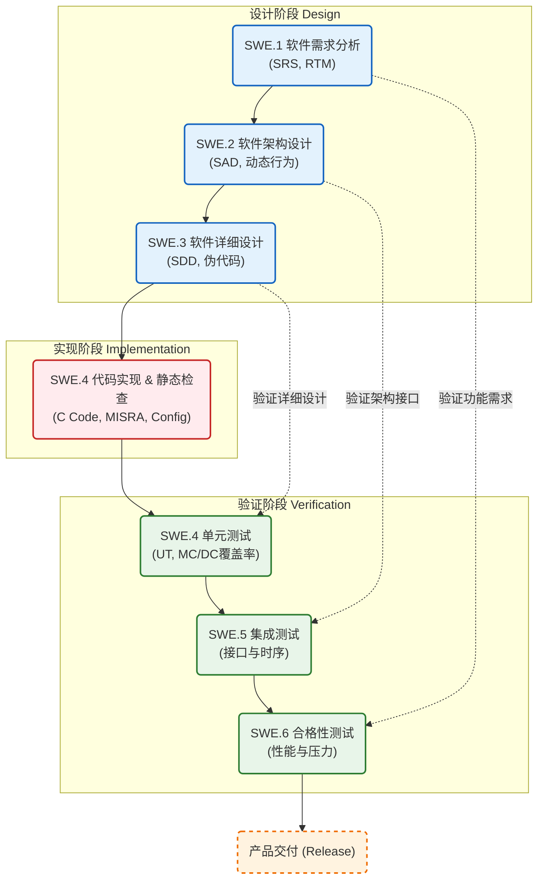

**如何在一个严苛的质量管理体系（如ASPICE CL2/CL3, ISO 26262 ASIL-B/D）下，将代码从“能跑”变成“量产级交付物”**。

在汽车行业，代码只是交付物的一部分，**过程资产（Process Assets）**和**可追溯性（Traceability）**才是质量的灵魂。

基于ARM Cortex-M核（通常用于SoC内的Safety Island或独立MCU），结合ASPICE V模型，我将为你梳理从0到1的完整产品化流程。

---

### 车载MCAL驱动开发全生命周期流程 (Based on ASPICE & ISO 26262)

我们将整个过程分为五个核心阶段：**需求与规划** -> **架构与设计** -> **实现与单元验证** -> **集成与确认** -> **发布与维护**。

#### 第一阶段：需求工程与计划 (Requirements & Planning)

**核心目标**：明确做什么，不仅仅是功能，还有性能、安全机制和接口标准。

|**细分流程 (Process)**|**关键动作描述**|**输入信息 (Input)**|**输出信息 (Output)**|
|---|---|---|---|
|**P1. 需求分析 (SWE.1)**|1. 解析芯片手册（Register Map, Electrical Spec）。      2. 解析AUTOSAR SWS标准（标准接口定义）。      3. 识别功能安全需求（Safety Goal -> FSR -> TSR）。|1. SoC Reference Manual (RM)      2. AUTOSAR SWS (e.g., SWS_Mcu, SWS_Spi)      3. Customer SOR (Statement of Requirements)      4. Safety Manual (SoC级)|1. 软件需求规格说明书 (SRS)      2. 需求追溯矩阵 (RTM: Customer Req -> SW Req)|
|**P2. 开发计划制定 (MAN.3)**|1. 确定Delivery Roadmap（A样, B样, SOP）。      2. 制定配置管理计划（Git Flow, Branch策略）。      3. 选定工具链（Compiler, Debugger, Static Tools）。|1. 项目里程碑 (Milestones)      2. 资源评估|1. 软件开发计划 (SDP)      2. 配置管理计划 (CMP)|

#### 第二阶段：软件架构与详细设计 (Architecture & Design)

**核心目标**：将需求转化为可实现的逻辑，确保模块化和解耦。

|**细分流程 (Process)**|**关键动作描述**|**输入信息 (Input)**|**输出信息 (Output)**|
|---|---|---|---|
|**D1. 软件架构设计 (SWE.2)**|1. 定义MCAL与硬件的边界（Memory Map, Interrupts）。      2. **Cortex-M特性设计**：MPU配置, NVIC优先级分组, SysTick, Cache策略。      3. 定义动态行为（启动时序, 休眠唤醒流程）。|1. SRS      2. Cortex-M Arch Reference|1. 软件架构设计文档 (SAD)      2. 接口定义文件 (.h skeletons)      3. 动态视图 (Sequence Diagrams)|
|**D2. 软件详细设计 (SWE.3)**|1. 细化每个API的控制流（Flowchart）。      2. 定义临界区保护（Critical Section）。      3. 寄存器操作宏定义策略。      4. 配置参数的数据结构设计（Config Structure）。|1. SAD      2. Register Map|1. 软件详细设计文档 (SDD)      2. 单元测试计划|

#### 第三阶段：软件实现与单元验证 (Implementation & Unit Verification)

**核心目标**：编写高质量、符合规范的代码，并证明代码逻辑无误。

|**细分流程 (Process)**|**关键动作描述**|**输入信息 (Input)**|**输出信息 (Output)**|
|---|---|---|---|
|**I1. 代码实现 (SWE.4)**|1. 基于ARM CMSIS标准编写底层操作。      2. 实现AUTOSAR规定的API（Init, DeInit, Read, Write）。      3. **配置工具开发**：编写插件（如EB tresos/DaVinci的.xdm/.bmd文件），实现GUI配置生成.c/.h代码。|1. SDD      2. Coding Guidelines (MISRA C:2012)      3. SVD文件 (System View Description)|1. 源代码 (.c/.h)      2. 配置文件生成脚本/插件|
|**I2. 静态分析 (Static Analysis)**|1. MISRA C 规则扫描（如QAC/Coverity）。      2. 运行时错误检查（除0，数组越界）。      3. 代码复杂度检查（Cyclomatic Complexity）。|1. 源代码|1. 静态分析报告 (需清零或Justification)|
|**I3. 代码评审 (Code Review)**|1. 同行评审（Peer Review）。      2. 检查逻辑、注释、规范性。|1. 源代码      2. 静态分析报告|1. Review Record (Reviewer意见及修改记录)|
|**I4. 单元测试 (Unit Test)**|1. 编写测试用例（基于Tessy/C++Test/GTest）。      2. 故障注入测试（Fault Injection）。      3. **覆盖率分析**：Statement, Branch, **MC/DC** (ASIL-B以上必须)。|1. SDD      2. 源代码|1. 单元测试报告      2. 覆盖率报告 (100% MC/DC)|

#### 第四阶段：集成与系统测试 (Integration & Qualification)

**核心目标**：证明模块在一起能工作，且在真实硬件上符合性能指标。

|**细分流程 (Process)**|**关键动作描述**|**输入信息 (Input)**|**输出信息 (Output)**|
|---|---|---|---|
|**T1. 软件集成测试 (SWE.5)**|1. 模块间接口测试（如SPI驱动调用DMA驱动）。      2. 调度性测试（Task Scheduling）。      3. 内存与堆栈使用量分析。|1. 集成测试计划      2. 所有模块Object文件|1. 集成测试报告      2. 内存使用报告 (Map file analysis)|
|**T2. 软件合格性测试 (SWE.6)**|1. 在真实开发板/ECU上运行。      2. 性能测试（API执行时间，中断延迟）。      3. 压力测试（满负载通信）。      4. 边界测试（电压、温度边界下的驱动稳定性）。|1. 软硬件系统      2. 示波器/逻辑分析仪/总线工具 (Vector/Intrepid)|1. 软件合格性测试报告 (Qualification Report)      2. 缺陷追踪单 (Jira Ticket)|

#### 第五阶段：发布与验收 (Release & Delivery)

**核心目标**：交付客户可用的软件包，包含代码、工具和文档。

|**细分流程 (Process)**|**关键动作描述**|**输入信息 (Input)**|**输出信息 (Output)**|
|---|---|---|---|
|**R1. 交付包打包**|1. 代码冻结（Code Freeze）。      2. 生成Release Note。      3. 打包Demo工程和集成指南。|1. 所有测试通过的代码库|1. MCAL Delivery Package (.zip)|
|**R2. 验收测试**|1. 客户现场冒烟测试（Smoke Test）。      2. Q&A支持。|1. 交付包|1. 验收通过邮件/签署文件|

---

### 综合说明：从“手搓代码”到“工业级交付”的跨越

作为同行，我想强调在ARM Cortex-M MCAL开发中，除了上述流程外，还有三个维度的“隐形工作”决定了产品的成败：

#### 1. 双向追溯性 (Bi-directional Traceability)

这是ASPICE审核的重灾区。你必须建立一条完整的证据链：

- **Customer Req <-> System Req <-> SW Arch <-> SW Detail Design <-> Source Code <-> Unit Test Case**
    
- **意义**：当客户变更一个需求（例如SPI波特率精度），你能立刻知道需要修改哪行代码，以及需要重新运行哪个测试用例。这通常需要工具支持（如DOORS, Polarion, 或者基于Git/Markdown的轻量级方案）。
    

#### 2. ARM Cortex-M 的特异性处理

MCAL虽然叫“抽象层”，但作为驱动开发者，我们必须处理硬件细节：

- **原子操作**：在Cortex-M上，Bit-Banding或LDREX/STREX指令的使用，确保在中断嵌套时不出现数据竞争。
    
- **Memory Barrier**：在配置DMA描述符或切换MPU region后，必须正确使用 `__DSB()`, `__ISB()` 指令，这在详细设计阶段就必须定义好。
    
- **中断延迟**：需要量化ISR的进入和退出时间，确保符合实时性要求。
    

#### 3. 配置工具链 (Configuration Tooling)

现在的MCAL不只是C代码，更是一套**生成代码的代码**。

- 你需要不仅交付`.c/.h`，还要交付配置插件。
    
- **难点**：如何保证配置工具生成的代码（Generated Code）与静态代码（Static Code）的无缝配合，以及配置参数的校验逻辑（例如：PLL分频不能配出超过主频的参数）。
    