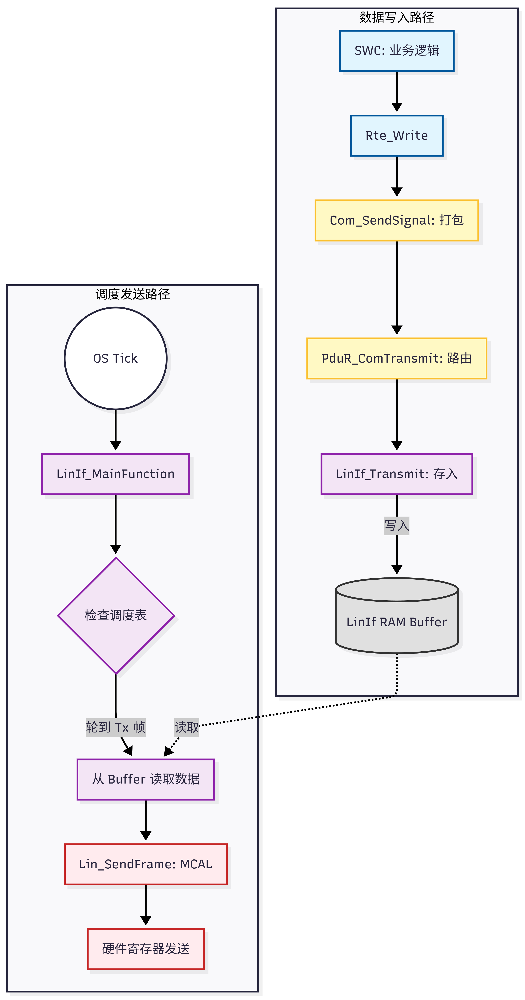

# C Lin 通信栈调用路径

这是一个非常经典的 AUTOSAR 通信栈调用路径。针对 LIN 总线（Local Interconnect Network），其最大的特点是 **主从结构（Master-Slave）** 和 **调度表驱动（Schedule Table Driven）**。

这意味着，虽然应用层看起来是“发送”了一个数据，但在底层，实际上往往是更新了缓存，等待调度表轮询到该帧时才真正发出（除非是偶发帧 Sporadic Frame）。

以下是基于实际工程代码逻辑，对从 `Rte_Write` 到 `Lin_SendFrame` 这一过程的详细展开说明：

---

### 1. 应用层：`Rte_Write__` (数据产生与隔离)

**逻辑位置：** Software Component (SWC) -> RTE
**核心动作：** 接口调用，数据解耦。

在实际工程代码中，应用层 SWC 并不关心底层也是 LIN、CAN 还是 Ethernet。SWC 只是通过 RTE 提供的 Port Interface 发送数据。

* **代码逻辑：**
SWC 调用类似 `Rte_Write_PpDoorStatus_u8DoorState(0x01)` 的接口。
* **RTE 的工作：**
RTE 生成的代码（`Rte.c`）会将这个函数映射到配置好的 COM 信号接口上。如果配置了 **I-Write** (Implicit Write)，RTE 会先写入内部缓存，在 Runnable 结束时再调用 COM；如果是 **E-Write** (Explicit Write)，则直接调用 COM 接口。

> **工程视角：** 这一步实现了“业务逻辑”与“通信实现”的完全剥离。

---

### 2. 服务层：`Com_SendSignal()` (信号打包)

**逻辑位置：** RTE -> COM (Communication)
**核心动作：** 信号打包 (Packing)，字节序处理，Update Bit 处理。

RTE 将数据传给 COM 模块。COM 的核心任务是将**信号（Signal）**映射到 **IPDU（Interaction PDU）** 中。

* **代码逻辑：**
1. **查找配置：** COM 根据传入的 Signal ID，在配置结构体中找到它所属的 IPDU ID 以及在 PDU 中的具体位置（Start Bit, Length）。
2. **打包 (Packing)：** 将信号值写入 IPDU 的影子缓存（Shadow Buffer）。
* *例如：* 车速信号占第 2 字节的后 4 位和第 3 字节的前 4 位，COM 负责移位和掩码操作。


3. **字节序转换：** 处理 Big Endian (Motorola) 或 Little Endian (Intel) 转换。
4. **触发判定：**
* 如果是 **LIN**，通常数据是周期性发送的。`Com_SendSignal` 只是更新了缓存。
* 如果配置了 `Transfer Property = TRIGGERED`，COM 可能会立即调用 `PduR_ComTransmit` 通知下层有新数据（但这在 LIN 中主要用于更新标志位，实际发送仍依赖调度）。


---

### 3. 服务层：`PduR_ComTransmit()` (PDU 路由)

**逻辑位置：** COM -> PduR (PDU Router)
**核心动作：** 模块间路由，ID 转换。

PduR 是一个静态的“交换机”。它不处理数据内容，只负责根据路由表（Routing Table）将上层的请求转发给正确的下层模块。

* **代码逻辑：**
1. **ID 查表：** PduR 接收到 `Com_PduId`。
2. **目标定位：** 查表发现该 PDU 的目标是 `LinIf`（而不是 CanIf 或 FrIf）。
3. **接口转发：** 将 `Com_PduId` 转换为 `LinIf_TxPduId`，然后调用 `LinIf_Transmit(LinIf_TxPduId, &PduInfo)`.


> **工程视角：** PduR 的存在使得 COM 模块不需要知道底层是用 LIN 还是 CAN，它只管发给 PduR。

---

### 4. ECU 抽象层：`LinIf_Transmit()` (协议管理与调度关联)

**逻辑位置：** PduR -> LinIf (LIN Interface)
**核心动作：** 关联 PID，缓存数据，等待调度。

这是 LIN 通信最关键的一层。与 CAN 不同（CAN 是想发就发），LIN 是**Master** 控制总线。

* **实际工程逻辑差异：**
虽然调用链是 `LinIf_Transmit`，但在 LIN 协议栈中，这个函数通常**不会**直接触发硬件发送（除非是 Event Triggered 帧触发了冲突解决，或者 Sporadic 帧）。
**常规流程如下：**
1. **数据更新：** `LinIf_Transmit` 将来自 PduR 的数据拷贝到 LinIf 内部维护的 Driver Buffer 中，该 Buffer 对应某个特定的 **LIN Frame (PID)**。
2. **标记脏位：** 标记该 PDU 数据已更新。
3. **真正的发送触发者 —— 调度表 (Schedule Table)：**
* `LinIf` 有一个周期性运行的主函数 `LinIf_MainFunction()`。
* 该函数根据当前激活的 **Schedule Table** 计时。
* 当时间槽（Time Slot）到达某个发送帧的时刻，`LinIf` 会取出之前 `LinIf_Transmit` 更新好的数据。


* **关键动作：**
当调度表指针指向一个发送帧时，LinIf 准备好 ID (PID)、Checksum 类型（Classic/Enhanced）和数据长度，准备调用驱动。

---

### 5. MCAL 层：`Lin_SendFrame()` (硬件操作)

**逻辑位置：** LinIf -> Lin Driver (MCAL)
**核心动作：** 操作寄存器，发送 Header 和 Response。

这是直接与硬件交互的驱动层（Microcontroller Abstraction Layer）。

* **代码逻辑 (基于 AUTOSAR 标准定义)：**
函数原型通常为：`Std_ReturnType Lin_SendFrame(uint8 Channel, const Lin_PduType* PduInfoPtr)`
**执行步骤：**
1. **硬件检查：** 检查 LIN 硬件通道状态是否为空闲（Idle）。
2. **发送 Header (如果是 Master 节点)：**
* **Break Field:** 发送同步间隔场（至少13个显性位）。
* **Sync Byte:** 发送 0x55 同步字节。
* **Protected Identifier (PID):** 根据 `PduInfoPtr->Pid` 写入 PID。


3. **处理 Response (数据场)：**
* **如果是发送方向 (Tx)：** 驱动程序将 `PduInfoPtr->Sdu` 指向的数据写入硬件的发送寄存器（FIFO 或 Buffer），并计算/写入 Checksum。硬件随后将比特流推送到物理总线。
* **如果是接收方向 (Rx)：** (虽然这里讨论的是发送过程，但如果是 Master 请求 Slave 数据，这里只发 Header，然后配置硬件为接收模式)。


4. **状态更新：** 将通道状态更新为 `LIN_TX_BUSY`。


### 总结：数据流 vs 控制流

在理解这个过程时，必须区分 **数据流** 和 **控制流**：

| 层级 | 动作 | 实际意义 |
| --- | --- | --- |
| **App/Rte** | `Rte_Write` | **我要发数据** (更新业务意图) |
| **Com/PduR** | `PduR_ComTransmit` | **数据已打包** (准备好载荷) |
| **LinIf** | `LinIf_Transmit` | **数据已暂存** (关联到 PID，等待调度) |
| **LinIf** | `LinIf_MainFunction` | **时间到了** (调度表触发发送时刻) |
| **MCAL** | `Lin_SendFrame` | **硬件执行** (Break -> Sync -> PID -> Data) |

### 下一步建议

为了更深入地结合您的实际代码进行调试或理解，我可以为您做以下事情：

**您是否希望我提供一个基于 C 伪代码的 `LinIf_MainFunction` 处理逻辑示例，来展示调度表是如何触发 `Lin_SendFrame` 的？这通常是理解 LIN 通信栈最难的部分。**

---

# C 语言风格伪代码实现

为了让你彻底理解 **“数据是怎么缓存的”** 以及 **“数据是怎么发出去的”** 这两个核心逻辑的分离，我将代码分为三个关键部分：

1. **数据结构定义**：构建调度表和 PDU 的内存模型。
2. **上层接口 (`LinIf_Transmit`)**：展示数据如何从 PduR 进来并“静止”在 LinIf 中。
3. **核心调度引擎 (`LinIf_MainFunction`)**：展示时间片如何驱动 `Lin_SendFrame` 的调用。

---

### 1. 核心数据结构定义 (Context)

在看代码前，必须先定义“调度表”长什么样。这是 Autosar 配置工具生成的静态代码 (`LinIf_Lcfg.c`) 的逻辑模型。

```c
// 定义帧类型
typedef enum {
    LINIF_MASTER_REQUEST,  // 主节点发数据 (Tx)
    LINIF_SLAVE_RESPONSE,  // 主节点索要数据 (Rx)
    LINIF_SPORADIC_FRAME   // 偶发帧 (有数据才发)
} LinIf_FrameTypeType;

// 1. 调度表中的每一个“条目” (Entry)
typedef struct {
    uint8 Pid;                 // LIN ID (0x00 - 0x3F)
    uint8 Length;              // 数据长度 (1-8)
    uint16 DelayTicks;         // 该时间片持续的时间 (如 10ms)
    LinIf_FrameTypeType Type;  // 帧类型
    uint8 TxPduId;             // 对应 PDU 的 ID (用于查找缓存)
    boolean IsEnhancedChecksum;// 是否使用增强校验和
} LinIf_ScheduleEntryType;

// 2. 调度表本身
typedef struct {
    const LinIf_ScheduleEntryType* Entries; // 指向条目数组
    uint8 EntryCount;                       // 条目总数
} LinIf_ScheduleTableType;

// 3. LinIf 内部的运行时状态 (RAM)
typedef struct {
    uint8 CurrentEntryIndex;   // 当前走到调度表的哪一行了
    uint16 FrameTimer;         // 当前时间片的倒计时
    uint8 TxBuffer[8];         // 发送数据缓存 (Shadow Buffer)
    boolean IsDataDirty;       // 数据更新标志位 (用于偶发帧或触发逻辑)
} LinIf_ChannelControlType;

// 全局变量模拟
LinIf_ChannelControlType LinIf_ChannelData; // 运行时状态
const LinIf_ScheduleTableType* CurrentScheduleTable; // 当前激活的调度表

```

---

### 2. 数据的入口：`LinIf_Transmit`

**场景**：COM 层计算完车速信号，通过 PduR 丢给了 LinIf。
**关键点**：这里**绝不**调用 `Lin_SendFrame`（除非是极其特殊的偶发帧逻辑），它只负责“填坑”。

```c
/* * 接口：LinIf_Transmit
 * 来源：PduR_ComTransmit 调用
 * 作用：将上层数据拷贝到 LinIf 的内部缓存区
 */
Std_ReturnType LinIf_Transmit(PduIdType TxPduId, const PduInfoType* PduInfoPtr) {
    
    // 1. 进入临界区 (防止此时 MainFunction 正好在读取数据)
    SchM_Enter_LinIf_Buffer();

    // 2. 找到该 PDU 对应的内部缓存位置
    // (实际代码中会通过 TxPduId 查表找到对应的 Buffer 指针，这里简化为直接操作全局 Buffer)
    
    // 3. 数据拷贝 (MemCpy)
    // 将 COM 传来的 SduDataPtr 里的数据，拷贝到 LinIf 维护的 RAM 中
    for(int i = 0; i < PduInfoPtr->SduLength; i++) {
        LinIf_ChannelData.TxBuffer[i] = PduInfoPtr->SduDataPtr[i];
    }

    // 4. 标记数据已更新 (Dirty Flag)
    // 对于偶发帧 (Sporadic)，这个标志位决定了下一轮调度是否发送该帧
    LinIf_ChannelData.IsDataDirty = TRUE;

    // 5. 退出临界区
    SchM_Exit_LinIf_Buffer();

    return E_OK;
}

```
---

### 3. 核心引擎：`LinIf_MainFunction`

**场景**：OS 每 5ms 或 10ms 周期性调用一次。
**关键点**：这是真正触发 `Lin_SendFrame` 的地方。它像一个节拍器，推动调度表指针移动。

```c
/* * 接口：LinIf_MainFunction_<ChannelId>
 * 来源：BSW Scheduler / OS 周期调用
 * 作用：管理调度表时间，触发驱动发送
 */
void LinIf_MainFunction(void) {
    
    // 1. 检查定时器：当前时间片是否结束？
    if (LinIf_ChannelData.FrameTimer > 0) {
        LinIf_ChannelData.FrameTimer--; // 倒计时
        return; // 时间没到，什么都不做，直接返回
    }

    // --- 此时意味着：上一个 Frame 的时间片已结束，准备发送下一个 Frame ---

    // 2. 切换到调度表的下一个条目 (Entry)
    LinIf_ChannelData.CurrentEntryIndex++;
    
    // 处理调度表循环 (Wrap around)
    if (LinIf_ChannelData.CurrentEntryIndex >= CurrentScheduleTable->EntryCount) {
        LinIf_ChannelData.CurrentEntryIndex = 0;
    }

    // 3. 获取当前要发送的条目配置
    const LinIf_ScheduleEntryType* CurrentEntry = 
        &CurrentScheduleTable->Entries[LinIf_ChannelData.CurrentEntryIndex];

    // 4. 重置定时器 (为当前帧预留时间槽，例如 10 ticks)
    LinIf_ChannelData.FrameTimer = CurrentEntry->DelayTicks;

    // 5. 准备调用 MCAL 的参数结构体
    Lin_PduType LinPdu;
    LinPdu.Pid = CurrentEntry->Pid;         // 设置 PID (如 0x3A)
    LinPdu.Cs = CurrentEntry->IsEnhancedChecksum ? LIN_ENHANCED_CS : LIN_CLASSIC_CS;
    LinPdu.Dl = CurrentEntry->Length;       // 数据长度
    LinPdu.Drc = LIN_MASTER_RESPONSE;       // 默认方向

    // 6. 根据帧类型决定如何处理数据
    switch (CurrentEntry->Type) {
        
        case LINIF_MASTER_REQUEST: // 主机发送数据给从机 (Tx)
            // 指向之前 LinIf_Transmit 填好的缓存
            LinPdu.SduPtr = LinIf_ChannelData.TxBuffer; 
            LinPdu.Drc = LIN_MASTER_RESPONSE; // 对 Driver 来说，这叫“提供响应数据”
            
            // 真正调用 MCAL 驱动！
            Lin_SendFrame(CHANNEL_0, &LinPdu); 
            break;

        case LINIF_SLAVE_RESPONSE: // 主机向从机索要数据 (Rx)
            // 此时 Buffer 用于接收，先不用填数据
            LinPdu.SduPtr = NULL; 
            LinPdu.Drc = LIN_SLAVE_RESPONSE;  // 对 Driver 来说，这叫“等待响应数据”
            
            // 真正调用 MCAL 驱动！(此时只发帧头 Header)
            Lin_SendFrame(CHANNEL_0, &LinPdu);
            break;
            
        case LINIF_SPORADIC_FRAME: // 偶发帧
            if (LinIf_ChannelData.IsDataDirty == TRUE) {
                // 有新数据才发，逻辑同 Master Request
                LinPdu.SduPtr = LinIf_ChannelData.TxBuffer;
                Lin_SendFrame(CHANNEL_0, &LinPdu);
                LinIf_ChannelData.IsDataDirty = FALSE; // 清除脏位
            } else {
                // 没数据更新，这一轮空转，什么都不发，总线保持静默
            }
            break;
    }
}

```

---

### 4. 硬件执行：`Lin_SendFrame` (MCAL)

**场景**：直接操作寄存器。
**关键点**：这通常是芯片厂商提供的代码（如 NXP, Infineon）。

```c
/* * 接口：Lin_SendFrame
 * 来源：LinIf_MainFunction 调用
 * 作用：操作硬件寄存器，发起物理传输
 */
Std_ReturnType Lin_SendFrame(uint8 Channel, const Lin_PduType* PduInfoPtr) {
    
    // 1. 检查硬件是否忙 (Busy Check)
    if (LIN_HW_STATUS_IDLE != HW_REG_READ(LIN_STATUS)) {
        return E_NOT_OK;
    }

    // 2. 发送 Break 场 (同步间隔)
    // 设置寄存器触发 Break 发送 (通常硬件自动生成 13bit+ 显性电平)
    HW_REG_WRITE(LIN_CTRL, START_BREAK);

    // 3. 发送 Sync Byte (0x55)
    // 多数现代 MCU 硬件会自动发送 Sync，不需要软件干预
    
    // 4. 发送 PID (Protected Identifier)
    // 硬件通常会自动计算 Parity (P0, P1)，软件只需写入原始 ID
    HW_REG_WRITE(LIN_ID_REG, PduInfoPtr->Pid);

    // 5. 处理数据场 (Data Field)
    if (PduInfoPtr->Drc == LIN_MASTER_RESPONSE) {
        // --- 发送模式 (Tx) ---
        // 将缓存数据写入硬件 FIFO
        for (int i=0; i < PduInfoPtr->Dl; i++) {
            HW_REG_WRITE(LIN_DATA_FIFO, PduInfoPtr->SduPtr[i]);
        }
        // 触发发送
        HW_REG_WRITE(LIN_CMD, TX_DATA);
        
    } else {
        // --- 接收模式 (Rx) ---
        // 配置硬件等待接收长度为 Dl 的数据
        HW_REG_WRITE(LIN_DATA_LEN, PduInfoPtr->Dl);
        HW_REG_WRITE(LIN_CMD, RX_DATA);
    }

    return E_OK;
}

```

### 总结整个过程的“接力棒”

1. **Rte -> Com**: "车速是 100km/h" (业务数据产生)。
2. **Com -> PduR -> LinIf_Transmit**: "把车速数据放到 ID 为 0x3A 的**缓存箱子**里" (数据入库，动作结束)。
3. **OS -> LinIf_MainFunction**: "嘀嗒...嘀嗒...时间到！调度表指到了 0x3A 这一行" (调度触发)。
4. **LinIf -> Lin_SendFrame**: "把 0x3A 箱子里的数据取出来，立刻发到总线上" (硬件执行)。

**这就是为什么你在 Debug 时会发现：调用了 `Rte_Write` 后，总线上并没有马上出现波形，而是有几十毫秒的延迟，因为他在等 `MainFunction` 的调度“公交车”到站。**

# flow chart

## ========================================================
                           AUTOSAR LIN 通信栈调用逻辑
## ========================================================

 [ 路径 1: 数据更新流 (Event Triggered) ]        [ 路径 2: 调度控制流 (Time Triggered) ]
 ----------------------------------------        ----------------------------------------
 动作: 此时此刻，应用层想发数据                    动作: 时间到了，总线该发帧了
 ----------------------------------------        ----------------------------------------

      +-------------+                                     (OS Cyclic Task)
      |  SWC (App)  |                                            |
      +-------------+                                            v
             | Rte_Write_xx()                            +--------------------+
             v                                           | LinIf_MainFunction |
      +-------------+                                    +--------------------+
      |     RTE     |                                            |
      +-------------+                                            | 1. 检查 Schedule Table
             |                                                   v
             v                                           +--------------------+
      +-------------+                                    |  判断当前时间片     |
      |     COM     | <--- 信号打包/字节序处理             |  (Schedule Entry)  |
      +-------------+                                    +--------------------+
             | PduR_ComTransmit()                                |
             v                                                   | 2. 指针指向 PID: 0x3A
      +-------------+                                            v
      |    PduR     |                                    /--------------------\
      +-------------+                                    |    如果是发送帧     |
             | LinIf_Transmit()                          |   (Master Request) |
             v                                           \--------------------/
      +-------------+                                            |
      |    LinIf    |                                            | 3. 从缓存取数据
      | (Interface) |                                            v
      +-------------+                                  /========================\
             |                                         | 核心结合点: 此时才读取   |
             +==========> [ LinIf RAM Buffer ] =======>| (MemCpy from Buffer)   |
                          [ (Shadow Buffer)  ]         \========================/
                                 ^                               |
                                 |                               | 4. 组装 Lin_PduType
                                 |                               v
                            (数据暂存)                    +--------------------+
                            (不立即发)                    |   Lin_SendFrame    |
                                                         |      (MCAL)        |
                                                         +--------------------+
                                                                 |
                                                                 | 5. 写寄存器
                                                                 v
                                                       [HW: Break -> Sync -> PID -> Data]
                                                                 |
                                                                 v
                                                          -------------------
                                                            LIN BUS (物理层)
                                                          -------------------

<!--  -->


# next study direction

一、 哪些是一样的？（标准化的上层）
无论你用什么总线，以下流程在 95% 的情况下是通用的：

RTE (Runtime Environment): SWC 永远只看到 Port 接口（Rte_Write）。它根本不知道底层是 CAN 还是 LIN，甚至不知道数据是发给车外的还是发给同一个芯片内的另一个 SWC。

COM (Communication): 永远负责信号的打包/解包（Packing/Unpacking）、字节序转换、过滤机制（如 mask）。它处理的是“信号（Signal）”。

PduR (PDU Router): 永远是“交通枢纽”。它只看 PDU ID，查表决定把数据丢给 LinIf、CanIf 还是 SoAd（以太网）。

学习价值：掌握了这一段，你就能看懂绝大多数应用层与底层交互的代码架构。

二、 哪些是不一样的？（总线特性的差异）
从 PduR 往下，每一条总线遵循其物理特性，逻辑发生分叉：

1. CAN 总线：事件驱动 (Event Triggered)
差异点：CAN 是“想发就发”（只要总线空闲且优先级够高）。

流程对比：

LIN: LinIf_Transmit -> 存缓存 -> 等调度表 -> Lin_SendFrame。

CAN: CanIf_Transmit -> 直接调用 Can_Write (如果硬件 Mailbox 空闲) -> 立即仲裁发送。

复杂点：CAN 涉及 HTH (Hardware Transmit Handle) 映射、邮箱竞争、发送确认中断 (TxConfirmation) 的处理。

2. Ethernet (车载以太网)：面向连接/Socket
差异点：以太网基于 TCP/IP 协议栈，数据量大，机制复杂。

流程对比：

PduR 不直接给驱动，而是给 SoAd (Socket Adaptor)。

SoAd: 将 PDU 映射到 Socket 连接上。

TcpIp Stack: 处理分片、握手、IP 头、MAC 头。

EthIf / Eth: 最后才到底层驱动。

3. FlexRay / CAN FD
FlexRay: 和 LIN 类似，也是基于时间片（Time Triggered），但它是微秒级的，配置极度复杂（静态段/动态段）。

三、 想要全面理解 AUTOSAR，还需要补全哪些拼图？
你现在理解了**“一条数据如何跑通”**（Data Path），但这只是 AUTOSAR 的冰山一角。要达到“系统级理解”，你需要掌握以下三个维度的知识：

1. 状态管理 (Mode Management) —— "谁控制通信的开关？"
你现在的理解是：只要调度表在跑，数据就能发。但是谁启动了调度表？是谁唤醒了 ECU？

核心模块：

EcuM (ECU Manager): 负责芯片上电初始化，把 ECU 从 Sleep 叫醒到 Up 状态。

ComM (Communication Manager): 负责仲裁用户的通信需求（User Request）。例如，App 请求“我要通信”，ComM 就会告诉 LinSM/CanSM 去开启总线。

BswM (BSW Manager): 规则引擎，根据状态切模式（例如：电压过低 -> 关通信）。

学习重点：理解 ECU 从 Sleep -> Wakeup -> Startup -> Run -> Shutdown 的全生命周期。

2. 网络管理 (Network Management, NM) —— "大家一起醒，大家一起睡"
汽车上的 ECU 都是联动的。

场景：如果你的 ECU 想睡了，但总线上别的 ECU 还需要和你说话，你就不能睡。

机制：AUTOSAR NM 协议（发建环帧或特定 NM 报文）来维持网络唤醒状态。

学习重点：理解 CanNm 或 LinNm 如何协同工作。

3. 诊断栈 (Diagnostics, UDS) —— "怎么修车？"
这是通信栈之外最大的模块。

DCM (Diagnostic Comm Manager): 处理 UDS 协议（如 0x10 服务切模式，0x22 读 ID）。

DEM (Diagnostic Event Manager): 记故障（DTC）。

TP 层 (Transport Protocol): CanTp / LinTp。

关键点：当数据超过一帧（CAN 8字节，LIN 8字节）发不完怎么办？TP 层负责拆包和组包（分段传输）。这是 PduR 的另一个重要下家。

4. 内存栈 (Memory Stack) —— "数据怎么存？"
NvM (Non-volatile Memory): 应用层调用 NvM_WriteBlock，底层怎么经过 MemIf -> Fee/Ea -> Fls/Eep 最终写到 Flash 或 EEPROM 里。

四、 总结与建议的学习路径
AUTOSAR 像是一个巨大的乐高城堡，你已经看懂了“窗户”是怎么拼的（LIN Data Path）。

建议的下一步学习顺序：

横向扩展（通信协议）：

对比学习 CAN 通信栈。重点看 CanIf 是如何通过 HTH 映射硬件邮箱的。这能让你理解“事件驱动”与“时间驱动”的本质区别。

纵向深入（诊断与长帧）：

学习 CanTp（传输层协议）。理解当你要发送 100 字节的诊断报文时，ISO-15765 协议是如何把数据切成一帧帧发送的。这会完善你对 PduR 另一半功能的理解。

顶层控制（状态机）：

学习 ComM 和 EcuM。不要陷入代码细节，先看状态机流转图。理解“Full Communication”和“No Communication”是如何切换的。
