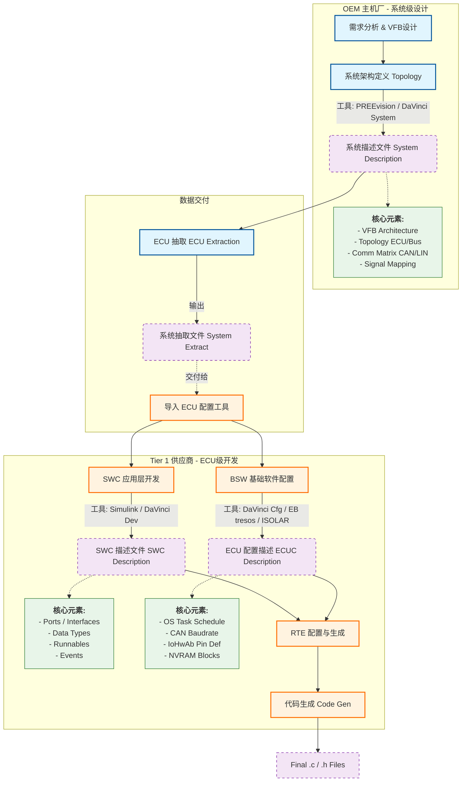

# 1. system_design_flow
这是为您整理的关于 ARXML 在 AUTOSAR 开发流程（Methodology）中的详细应用笔记。这份笔记涵盖了从 OEM 系统设计到 Tier 1 代码生成的完整链路，并附带了详细的 Mermaid 流程图。

---

### 📊 AUTOSAR 开发流程与 ARXML 数据流 (Mermaid 视图)

此图展示了 OEM 与 Tier 1 之间的协作流程，以及各个阶段产生的 ARXML 文件、核心数据元素和常用工具链。

代码段
==ECU描述文件并行分成SWC（OEM work）和ECUC（tier 1）两部分？==

---

### 📝 AUTOSAR ARXML 应用流程详解笔记

#### 1. 系统设计阶段 (System Configuration)

- **责任方:** OEM (主机厂) / 整车架构团队
    
- **主要任务:** * 定义整车的电子电气架构（E/E 架构）。
    
    - 设计虚拟功能总线（VFB），定义不同软件组件（SWC）之间的逻辑连接，而不考虑具体的硬件分布。
        
    - 定义物理拓扑（Topology），包括有哪些 ECU，它们通过什么总线（CAN, LIN, Ethernet）连接。
        
- **ARXML 产物:** **System Description (.arxml)**
    
- **核心元素:**
    
    - `System`: 顶层容器。
        
    - `RootSwComposition`: 顶层软件组合。
        
    - `Fibex/Communication`: 通信矩阵（DBC/LDF 转换而来的信号定义）。
        
- **常用工具链:** Vector PREEvision, DaVinci System.
    

#### 2. ECU 抽取阶段 (ECU Extraction)

- **责任方:** OEM (通常) 或 由 Tier 1 收到 System Description 后自行抽取
    
- **主要任务:** * 将庞大的整车数据库“扁平化”和“过滤”。
    
    - 针对某一个特定的 ECU（例如：==BCM 车身控制器==），保留与其相关的通信信号和 SWC，剔除发动机、底盘等无关 ECU 的信息。
        
- **ARXML 产物:** **System Extract / ECU Extract (.arxml)**
    
- **应用意义:** 这是 OEM 下发给 Tier 1 的标准“需求文档”的数据化形式。它规定了 ECU 必须实现==哪些接口==和收发==哪些报文==。
    

#### 3. 软件组件开发阶段 (SWC Implementation)

- **责任方:** Tier 1 (应用软件工程师)
    
- **主要任务:** * 设计==**应用层逻辑（Application Layer）**==。
    
    - 定义内部行为（Internal Behavior），如 Runnable（运行实体）是 10ms 触发还是事件触发。
        
- **ARXML 产物:** **SWC Description (.arxml)**
    
- **核心元素:**
    
    - `SenderReceiverInterface`: 数据传输接口。
        
    - `ClientServerInterface`: 函数调用接口。
        
    - `RunnableEntity`: 实际执行 C 代码的最小单元。
        
- **常用工具链:** * **建模:** MathWorks MATLAB/Simulink (自动生成 ARXML)。
    
    - **架构设计:** Vector DaVinci Developer, ETAS ISOLAR-A.
        

#### 4. ECU 配置阶段 (ECU Configuration)

- **责任方:** Tier 1 (基础软件/集成工程师)
    
- **主要任务:** * **==配置基础软件（BSW）的具体参数。==**
    
    - 将 SWC 的 Runnable 映射到操作系统的 Task 上（Task Mapping）。
        
    - 配置硬件相关的参数（如 MCU 时钟、DIO 引脚、CAN 控制器波特率）。
        
- **ARXML 产物:** **ECU Configuration Values (ECUC / .arxml)**
    
- **核心元素:**
    
    - `EcucModuleConfigurationValues`: 具体模块的配置值（如 `Can_Network_1`, `Baudrate=500k`）。
        
    - `OsTask`: 操作系统任务定义。
        
- **常用工具链:** Vector DaVinci Configurator Pro, EB tresos Studio, ETAS ISOLAR-B.
    

#### 5. 代码生成 (Code Generation)

- **责任方:** 工具链自动化完成
    
- **主要任务:** * **RTE 生成:** 读取 ==SWC Description（接口信息）==和 ==ECU Extract（通信信息）==，生成连接应用层和底层的“胶水代码” (`Rte.c`, `Rte.h`)。
    
    - **BSW 生成:** ==读取 ECUC（配置值）==，生成基础软件的配置代码（如 `Can_Cfg.c`, `Os_Cfg.h`）。
        
- **最终产物:** 可编译的 `.c` 和 `.h` 源文件。
    

---

### 💡 关键点总结

1. **从抽象到具体:** 流程是从 **System Description** (我要这辆车做什么) 到 **ECU Extract** (我要这个 ECU 做什么) 再到 **ECUC** (这个 ECU 的具体参数是多少) 的过程。
    
2. **工具强依赖:** 手写 ARXML 几乎是不可能的，必须依赖上述提到的专业工具链。
    
3. **一致性校验:** ==工具链在加载 ARXML 时，会根据 `.xsd` (Schema) 校验文件格式==，确保 OEM 和 Tier 1 的数据交互无误。
    

### 建议的下一步（TODO）

您已经了解了 ARXML 的整个流转过程。为了更深入理解，**您是否需要我为您解析一段具体的 ARXML 代码片段，例如“一个 CAN 信号是如何在 ARXML 中被逐层定义的”？** 这有助于将理论与实际代码对应起来。