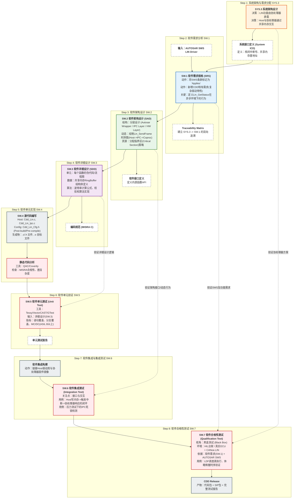

```mermaid
graph TD
    %% ==========================================================
    %% 样式定义 (Style Definitions)
    %% ==========================================================
    classDef sysPhase fill:#FFF3E0,stroke:#E65100,stroke-width:2px;
    classDef swReqPhase fill:#E3F2FD,stroke:#1565C0,stroke-width:2px;
    classDef swArchPhase fill:#E8F5E9,stroke:#2E7D32,stroke-width:2px;
    classDef swDetPhase fill:#F3E5F5,stroke:#7B1FA2,stroke-width:2px;
    classDef implPhase fill:#ECEFF1,stroke:#455A64,stroke-width:2px;
    classDef testPhase fill:#FFEBEE,stroke:#C62828,stroke-width:2px;
    classDef doc fill:#FFFFFF,stroke:#333,stroke-dasharray: 5 5;

    %% ==========================================================
    %% 左侧：系统与需求分析 (System & Requirements)
    %% ==========================================================
    subgraph Phase1 [Step 1: 系统架构与需求分配 SYS.3]
        direction TB
        SYS_ARCH["<b>SYS.3 系统架构设计</b><br/>决策：LIN功能由协处理器承载<br/>决策：Host与协处理器通过共享内存交互"]:::sysPhase
        SYS_ICD["<b>系统接口定义 (System ICD)</b><br/>定义：核间中断号、共享内存基地址"]:::doc
        SYS_ARCH --> SYS_ICD
    end

    subgraph Phase2 [Step 2: 软件需求分析 SW.1]
        direction TB
        INPUT_SWS["<b>输入：AUTOSAR SWS LIN Driver</b>"]:::doc
        SW_REQ["<b>SW.1 软件需求规格 (SRS)</b><br/>动作：将SWS条款标记为 'Applies'<br/>动作：新增CDD特有需求(复杂驱动特性)<br/>关键：定义Lin_GetStatus在异步环境下的行为"]:::swReqPhase
        TRACE_MATRIX["<b>Traceability Matrix</b><br/>建立 SYS.3 -> SW.1 的双向追溯"]:::doc
        
        INPUT_SWS --> SW_REQ
        SYS_ICD --> SW_REQ
        SW_REQ --> TRACE_MATRIX
    end

    %% ==========================================================
    %% 左侧：软件架构与设计 (Architecture & Design)
    %% ==========================================================
    subgraph Phase3 [Step 3: 软件架构设计 SW.2]
        direction TB
        SW_ARCH["<b>SW.2 软件架构设计 (SAD)</b><br/>结构：分层设计 (Autosar Wrapper / IPC Layer / HW Layer)<br/>动态：绘制Lin_SendFrame时序图(Host->IPC->Coproc)<br/>资源：分配临界区(Critical Section)策略"]:::swArchPhase
        IF_DEF["<b>软件接口定义</b><br/>定义内部函数API"]:::doc
        
        SW_REQ --> SW_ARCH
        SW_ARCH --> IF_DEF
    end

    subgraph Phase4 [Step 4: 软件详细设计 SW.3]
        direction TB
        SW_DET["<b>SW.3 软件详细设计 (SDD)</b><br/>单元：每个函数的伪代码/流程图<br/>数据：共享内存RingBuffer结构体定义<br/>算法：波特率计算公式、校验和算法实现"]:::swDetPhase
        MISRA["<b>编码规范 (MISRA C)</b>"]:::doc
        
        SW_ARCH --> SW_DET
        SW_DET --> MISRA
    end

    %% ==========================================================
    %% 底部：实现 (Implementation)
    %% ==========================================================
    subgraph Phase5 [Step 5: 软件单元实现 SW.4]
        direction TB
        CODE["<b>SW.4 源代码编写</b><br/>Host: Cdd_Lin.c, Cdd_Lin_Ipc.c<br/>Config: Cdd_Lin_Cfg.h (Post-build/Pre-compile)<br/>生成物：.c/.h 文件, .o 目标文件"]:::implPhase
        STATIC_ANA["<b>静态代码分析</b><br/>工具：QAC/Coverity<br/>检查：MISRA合规性、圈复杂度"]:::testPhase
        
        SW_DET --> CODE
        CODE --> STATIC_ANA
    end

    %% ==========================================================
    %% 右侧：验证与测试 (Verification & Validation)
    %% ==========================================================
    subgraph Phase6 [Step 6: 软件单元验证 SW.5]
        direction TB
        UNIT_TEST["<b>SW.5 软件单元测试 (Unit Test)</b><br/>工具：Tessy/VectorCAST/GTest<br/>输入：详细设计(SW.3)<br/>指标：语句覆盖、分支覆盖、MC/DC(ASIL B以上)"]:::testPhase
        UT_REPORT["<b>单元测试报告</b>"]:::doc
        
        STATIC_ANA --> UNIT_TEST
        UNIT_TEST --> UT_REPORT
    end

    subgraph Phase7 [Step 7: 软件集成与集成测试 SW.6]
        direction TB
        SW_INT["<b>软件集成构建</b><br/>动作：链接Host驱动库与协处理器固件镜像"]:::implPhase
        INT_TEST["<b>SW.6 软件集成测试 (Integration Test)</b><br/>关注点：接口与交互<br/>用例：Host写内存->触发中断->协处理器响应的闭环<br/>用例：压力测试下的IPC死锁检测"]:::testPhase
        
        UT_REPORT --> SW_INT
        SW_INT --> INT_TEST
    end

    subgraph Phase8 [Step 8: 软件合格性测试 SW.7]
        direction TB
        QUAL_TEST["<b>SW.7 软件合格性测试 (Qualification Test)</b><br/>视角：黑盒测试 (Black Box)<br/>环境：HIL台架 / 真实ECU + CANoe.LIN<br/>依据：软件需求(SW.1) + AUTOSAR SWS<br/>用例：LDF调度表执行、休眠唤醒时序验证"]:::testPhase
        FINAL_REL["<b>CDD Release</b><br/>产物：代码包 + SIP包 + 完整测试报告"]:::implPhase
        
        INT_TEST --> QUAL_TEST
        QUAL_TEST --> FINAL_REL
    end

    %% ==========================================================
    %% V模型验证对应关系 (Verification Links)
    %% ==========================================================
    
    %% 使用具体的连线样式，而不是 linkStyle default
    SW_DET -.->|验证详细设计逻辑| UNIT_TEST
    SW_ARCH -.->|验证架构接口/动态行为| INT_TEST
    SW_REQ -.->|验证SWS及功能需求| QUAL_TEST
    SYS_ARCH -.->|验证协处理器方案| QUAL_TEST
```