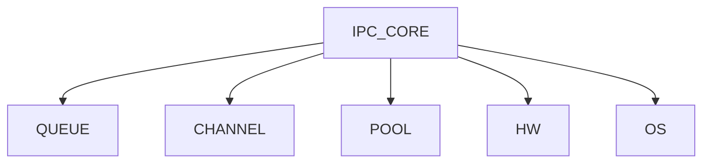
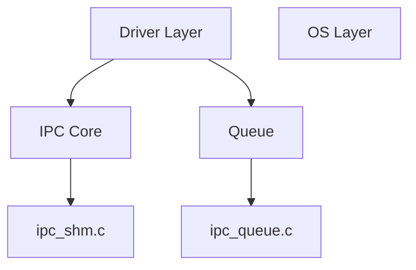

# Description: 在架构设计定义中，对比说明框架图、组件图、模块区分，以及对component的详细剖析

----

你问的是**架构文档里最容易混乱的三个点**：  
1）“总览图 vs 组件图”  
2）“组件 / 分层 / 模块怎么区分”  
3）“粒度到底画到哪一层”

我直接给你工程级答案，不绕。

---

# 一、架构总览图 ≠ 组件结构图（但有重叠）

## ✔ 1️⃣ 架构总览图（Architecture Overview）

### 本质是什么

> **给人快速建立系统整体认知的“导航图”**

### 它强调的是：

- 系统边界（System Boundary）
    
- 外部交互（外设 / 用户 / 其他系统）
    
- 核心子系统（大块）
    
- 关键数据流 / 控制流
    

---

### ✔ 特点

- 抽象程度：**最高**
    
- 读者：**所有人（包括非技术）**
    
- 粒度：**子系统级**
    

---

### ✔ MCU IPC系统示例


👉 这个图不是给你写代码的，是给你“理解系统”的。

---

## ✔ 2️⃣ 组件结构图（Component Diagram）

### 本质是什么

> **描述系统内部是如何被拆解成组件的**

### 它强调的是：

- 模块划分
    
- 接口关系
    
- 依赖关系
    

---

### ✔ 特点

- 抽象程度：中等
    
- 面向：开发人员
    
- 粒度：模块级
    

---

### ✔ IPC例子（你刚分析的）



---

## ✔ 一句话结论（很关键）

👉 **总览图 = 对外看系统**  
👉 **组件图 = 对内拆系统**

---

# 二、组件 vs 分层 vs 模块 —— 不区分会直接废

你必须建立一个**分层认知模型**：

---

## 1️⃣ 分层（Layer）——“纵向切”

### ✔ 本质

> **按抽象级别划分**

### ✔ 特点

- 上层依赖下层
    
- 不允许反向依赖（理想情况）
    

---

### ✔ 典型分层（MCU）

```text
Application Layer
↓
Service Layer
↓
Driver Layer
↓
Hardware
```

---

👉 分层解决的是：

👉 **“代码在什么抽象级别”**

---

## 2️⃣ 组件（Component）——“横向切”

### ✔ 本质

> **一个可替换、可独立演进的功能单元**

---

### ✔ 特点

- 有明确接口
    
- 有职责边界
    
- 可复用
    

---

### ✔ 例子（IPC）

- Queue组件
    
- Channel组件
    
- Buffer Pool组件
    

---

👉 组件解决的是：

👉 **“系统由哪些功能块组成”**

---

## 3️⃣ 模块（Module）——“实现单元”

### ✔ 本质

> **代码组织单位（文件/目录级）**

---

### ✔ 特点

- 偏实现
    
- 不一定是架构概念
    

---

### ✔ 例子

```text
ipc_queue.c
ipc_shm.c
ipc_hw.c
```

---

👉 模块解决的是：

👉 **“代码怎么组织”**

---

# 三、三者关系（必须记住这个图）



---

## ✔ 总结一句话：

- Layer：**抽象高度**
    
- Component：**功能划分**
    
- Module：**代码落地**
    

---

# 四、大模块包含小模块 —— 怎么画？

你这个问题问得很好，很多架构图死在这里。

---

## ✔ 原则：**分层分视图（C4模型思想）**

参考 C4 model：

---

## 1️⃣ 不要一个图画完所有层级 ❌

👉 这是新手最大错误：

```text
一个图里：
- Layer
- Component
- Module
全塞进去
```

👉 结果：**不可读**

---

## 2️⃣ 正确做法：分层画图 ✅

---

### ✔ Level 1：系统总览

👉 只画子系统

---

### ✔ Level 2：组件图

👉 拆组件

---

### ✔ Level 3：子组件图（可选）

👉 拆组件内部

---

### ✔ Level 4：模块/代码结构（可选）

👉 文件级

---

---

## ✔ 示例（IPC Driver）

### Level 1（总览）

```text
APP → IPC → SHM → Remote Core
```

---

### Level 2（组件）

```text
IPC =
    Core
    Queue
    Pool
    Channel
```

---

### Level 3（Queue内部）

```text
Queue =
    push_ring
    pop_ring
```

---

👉 每一层一个图，不混。

---

# 五、最关键问题：组件图要画到最小粒度吗？

👉 直接说结论：

## ❌ 不要画到最小粒度

## ✅ 画到“职责清晰”为止

---

## ✔ 判断标准（非常实用）

如果一个单元：

- 有独立职责 ✅
    
- 有清晰接口 ✅
    
- 可以单独修改而不影响其他模块 ✅
    

👉 才值得画成组件

---

## ✔ 举例（你这个IPC）

### 应该画：

- Queue ✔
    
- Channel ✔
    
- Pool ✔
    

---

### 不应该画：

- `read index` ❌
    
- `write index` ❌
    
- `memcpy` ❌
    

---

👉 否则你画的不是架构图，是**源码图**

---

# 六、给你一个工程级建议（很关键）

你现在已经能分析driver了，下一步要升级：

---

## ✔ 你的架构图应该做到三点：

### 1️⃣ 一图一层

- 总览图
    
- 组件图
    
- 子系统图
    

---

### 2️⃣ 每个组件必须有：

- 职责
    
- 接口
    
- 依赖
    

---

### 3️⃣ 图必须能回答一个问题：

👉 “如果我要改这个系统，我该动哪里？”

---

# 七、最后一句“狠话”

如果你的架构图：

- 不能指导开发
    
- 不能指导修改
    
- 不能让新人快速理解
    

👉 那它就是“装饰图”，不是架构设计。

---

如果你愿意，我可以帮你做一件很有价值的事：

👉 把你这个 IPC driver **整理成完整工业级架构文档（含：4层图 + SDD结构）**，你可以直接作为模板用在项目里。