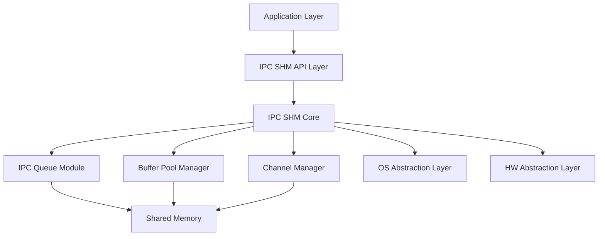
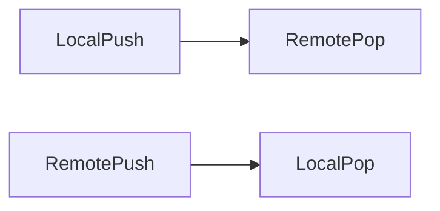
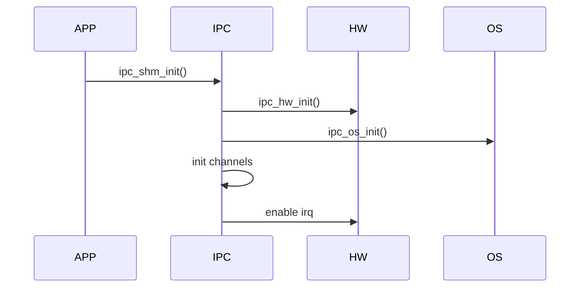
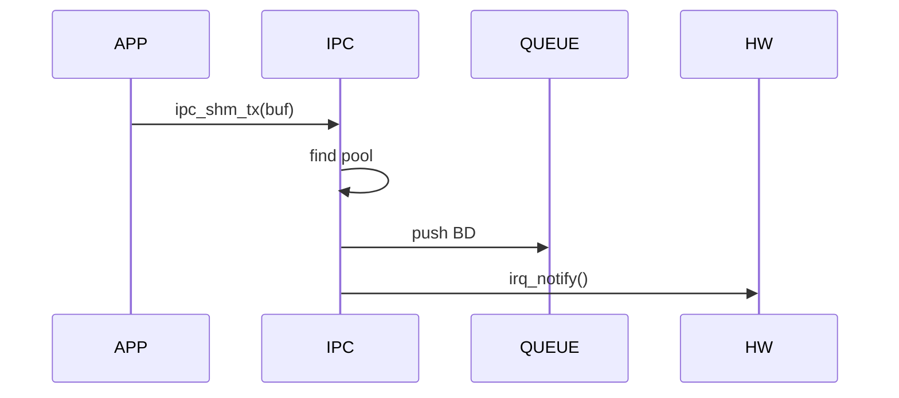
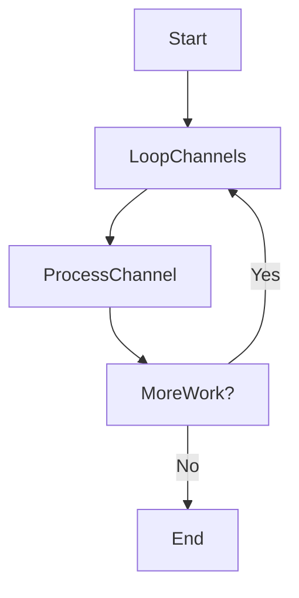
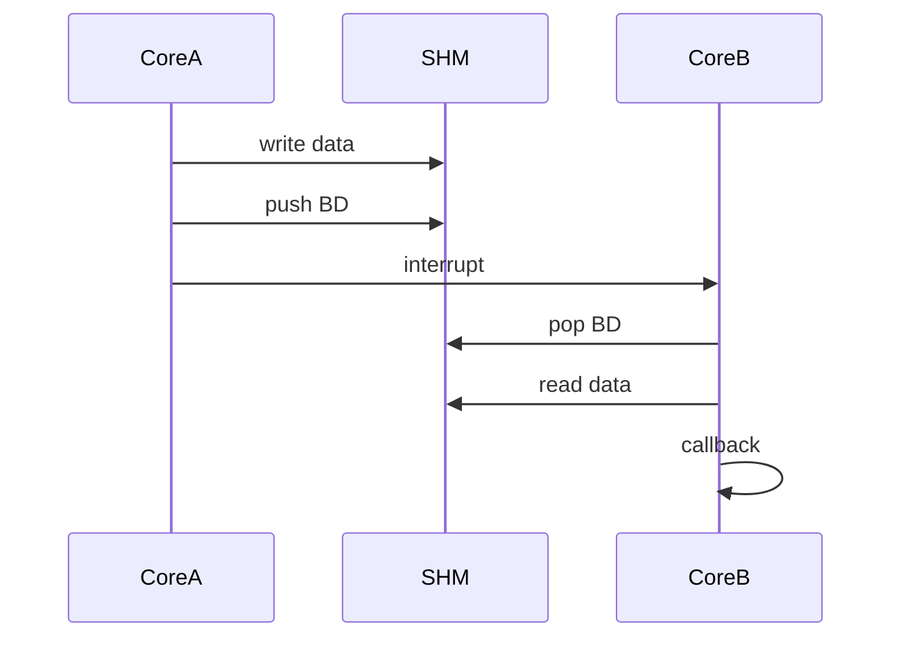

# 用IPCS驱动代码作为demo，分析架构设计中的一些概念、界定方法
---


很好，这一段源码质量是**典型工业级IPC驱动实现（NXP IPCF SHM）**，非常适合按标准化架构文档来拆。

我直接按**软件架构规范（IEEE 1016 / AUTOSAR风格）**给你产出两部分：

---

# 一、Description of Software —— Component（组件描述）

## 1️⃣ 本节目标（符合规范定义）

依据 IEEE 1016：

> 描述系统的**结构分解（Decomposition）**，包括组件、接口、依赖关系。

---

## 2️⃣ IPC SHM Driver 架构分层

### 📊 总体组件结构（核心图）



---

## 3️⃣ 组件拆解（工程级定义）

### 3.1 IPC SHM API 层

📍来源：（ipc-shm.h）

#### 职责：

- 提供对外接口（driver API）
    
- 封装底层通信机制
    

#### 关键接口：

- `ipc_shm_init()`
    
- `ipc_shm_tx()`
    
- `ipc_shm_acquire_buf()`
    
- `ipc_shm_release_buf()`
    
- `ipc_shm_poll_channels()`
    

---

### 3.2 IPC SHM Core（核心调度层）

📍来源：ipc-shm.c

#### 职责：

- 通道管理（managed / unmanaged）
    
- 调度收发逻辑
    
- 共享内存布局管理
    
- 多实例管理
    

#### 核心数据结构：

- `ipc_shm_priv`
    
- `ipc_shm_channel`
    
- `ipc_managed_channel`
    
- `ipc_unmanaged_channel`
    

---

### 3.3 Channel Manager（通道管理）

#### 职责：

- 管理逻辑通信通道
    
- 支持两类通道：
    
    - Managed（带buffer管理）
        
    - Unmanaged（裸共享内存）
        

#### 特点：

- 每个channel独立
    
- 支持多channel并行通信
    

---

### 3.4 Buffer Pool Manager（缓冲池管理）

#### 职责：

- 管理共享内存buffer池
    
- 支持多pool（不同size）
    

#### 关键结构：

- `ipc_shm_pool`
    
- `ipc_shm_bd`（buffer descriptor）
    

#### 特点：

- 多尺寸buffer优化
    
- 零拷贝设计（通过BD）
    

---

### 3.5 IPC Queue（核心数据结构）

📍来源：ipc-queue.c

#### 职责：

- 提供**无锁环形队列**
    
- 实现核间数据同步
    

#### 特点：

- 双Ring结构：
    
    - push_ring（本地写）
        
    - pop_ring（远端读）
        



#### 核心能力：

- `ipc_queue_push()`
    
- `ipc_queue_pop()`
    

👉 本质：**Single Producer / Single Consumer lock-free FIFO**

---

### 3.6 OS Abstraction Layer

📍来源：ipc-os（未展开）

#### 职责：

- 中断注册
    
- 内存映射
    
- polling机制
    

---

### 3.7 HW Abstraction Layer

📍来源：ipc-hw.c

#### 职责：

- 核间中断（MSCM）
    
- IRQ控制
    
- 跨核通知
    

#### 核心接口：

- `ipc_hw_irq_notify()`
    
- `ipc_hw_irq_enable()`
    

---

## 4️⃣ 组件关系总结（标准写法）

|组件|依赖|
|---|---|
|IPC API|IPC Core|
|IPC Core|Queue / Pool / Channel / OS / HW|
|Queue|Shared Memory|
|Pool|Queue + Shared Memory|
|Channel|Pool / Queue|
|HW|MCU寄存器|
|OS|RTOS|

---

👉 到这里，这一节是**完全符合标准的 Component Description**

---

# 二、Description of Software —— Functional（功能描述）

---

## 1️⃣ 本节目标（标准定义）

依据 IEEE 1016：

> 描述系统的**行为（Behavior）与功能能力（Functionality）**

---

## 2️⃣ IPC Driver 核心功能划分

我帮你抽象成**6大功能域**（工业级拆法）：

---

# 功能1：系统初始化

### ✔ 功能描述

初始化IPC实例、共享内存布局、通道及中断机制。

### ✔ 关键流程



---

### ✔ 核心行为

- 校验配置
    
- 初始化共享内存结构
    
- 构建channel/pool/queue
    
- 启动中断
    

---

# 功能2：Buffer管理（Managed Channel）

---

## 2.1 Buffer获取

### ✔ 描述

从buffer pool中分配可用buffer

### ✔ 逻辑

- 遍历pool（按size匹配）
    
- 从queue pop BD
    
- 返回buffer地址
    

📍代码依据：（ipc_shm_acquire_buf）

---

## 2.2 Buffer释放

### ✔ 描述

将buffer归还到远端

### ✔ 逻辑

- 查找所属pool
    
- 构造BD
    
- push到queue
    

---

# 功能3：数据发送（TX）

---

### ✔ 描述

将数据发送到远端核

---

### ✔ 核心流程



---

### ✔ 行为

- 构造 buffer descriptor
    
- 入队（共享内存）
    
- 触发中断
    

---

# 功能4：数据接收（RX）

---

### ✔ 描述

处理来自远端的数据

---

### ✔ 核心机制

📍函数：`ipc_shm_rx()`

---

### ✔ 调度策略

👉 **公平调度算法（重点）**



---

### ✔ 行为

- 遍历channel
    
- 从queue pop BD
    
- 调用回调函数
    

---

# 功能5：Unmanaged Channel通信

---

### ✔ 描述

直接共享内存通信（无buffer管理）

---

### ✔ 机制

- 写共享内存
    
- 增加tx_count
    
- 通知远端
    

---

### ✔ RX触发条件

```c
if (remote_tx_count != last_tx_count)
    trigger callback
```

---

👉 特点：

- 无队列
    
- 无buffer pool
    
- 极低开销
    

---

# 功能6：核间同步与通知

---

### ✔ 描述

通过硬件中断实现核间同步

---

### ✔ 行为

- TX：触发中断
    
- RX：中断 or polling
    
- 清中断状态
    

---

### ✔ 关键接口

- `ipc_hw_irq_notify()`
    
- `ipc_hw_irq_clear()`
    

---

# 三、功能整体视角（系统级）

## 📊 完整通信流程



---

# 四、关键设计特性（架构亮点）

这个你必须理解，这是面试/架构设计加分点：

---

## 1️⃣ Lock-Free设计

- 单生产者 / 单消费者
    
- 无锁
    
- 依赖ring buffer
    

---

## 2️⃣ 双Ring解耦

- 避免跨核写冲突
    
- 本地只写本地内存
    

---

## 3️⃣ 零拷贝通信

- 通过BD传递buffer
    
- 避免数据复制
    

---

## 4️⃣ 多Pool优化

- 小数据 → 小buffer
    
- 大数据 → 大buffer
    

---

## 5️⃣ 可扩展架构

- 多实例
    
- 多channel
    
- 多核支持
    

---

# 五、最终总结（标准化一句话）

### Component Description：

👉 描述了IPC驱动由**API层、核心调度层、Queue、Channel、Buffer Pool、OS/HW抽象层**组成的分层架构

---

### Functional Description：

👉 描述了IPC驱动提供的**初始化、buffer管理、数据收发、核间同步、两类通信模型（managed/unmanaged）**等核心能力

---

# 六、给你一个直接建议（非常重要）

你现在这个水平，可以做一件更狠的事：

👉 把这个IPC驱动“反向建模”为：

- UML组件图
    
- 时序图
    
- 状态机图
    

然后：

👉 **做一个你自己的“嵌入式IPC框架（精简版）”**

这会直接把你从“工程师”拉到“架构师级别”。

---

如果你要，我下一步可以帮你做：

👉 **把这个驱动抽象成“最小可实现IPC框架（你可以自己重写）”**