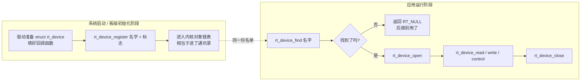
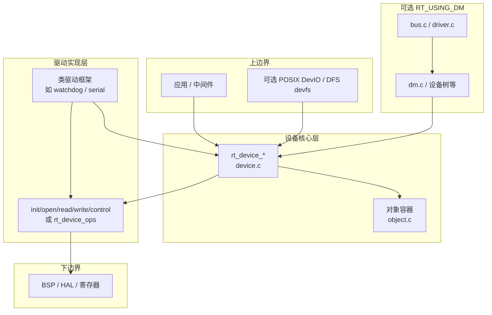
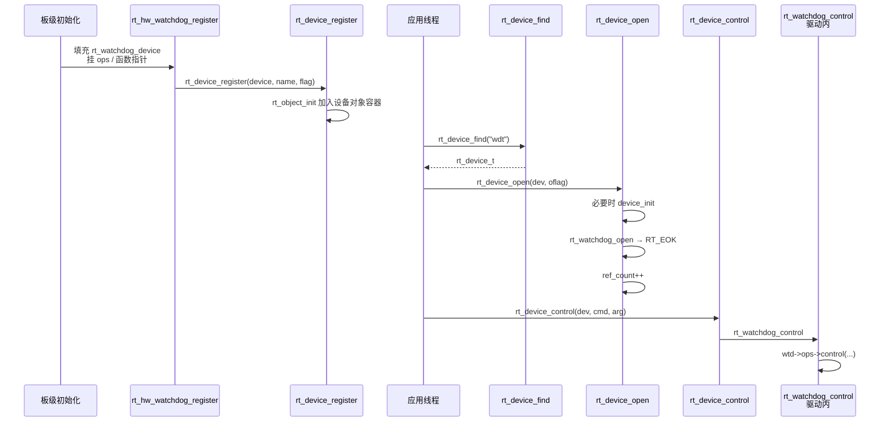
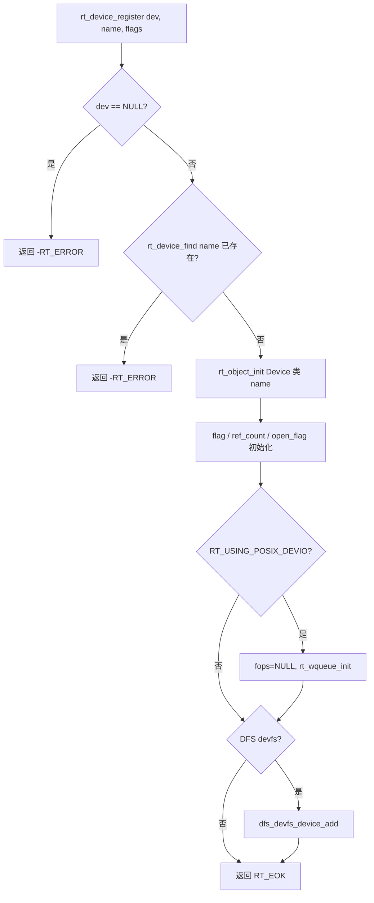
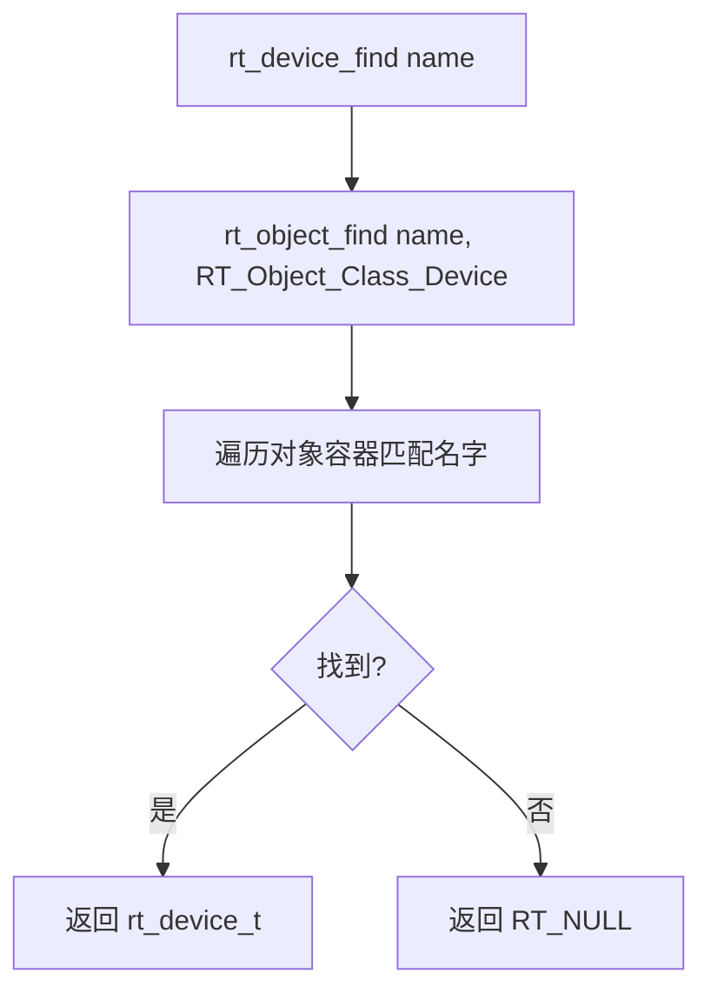
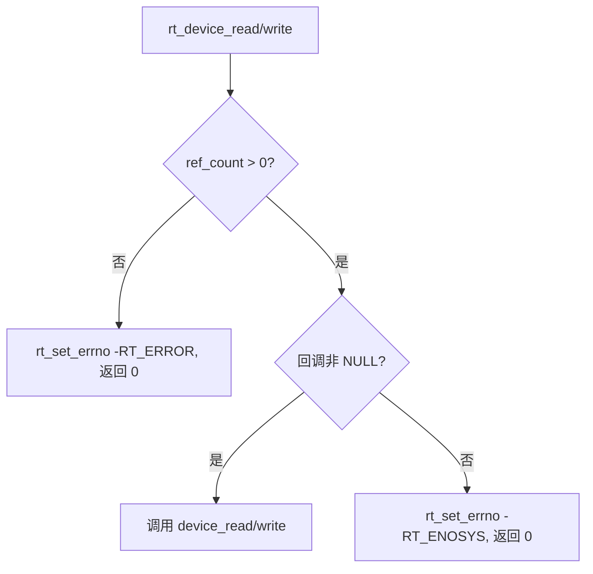
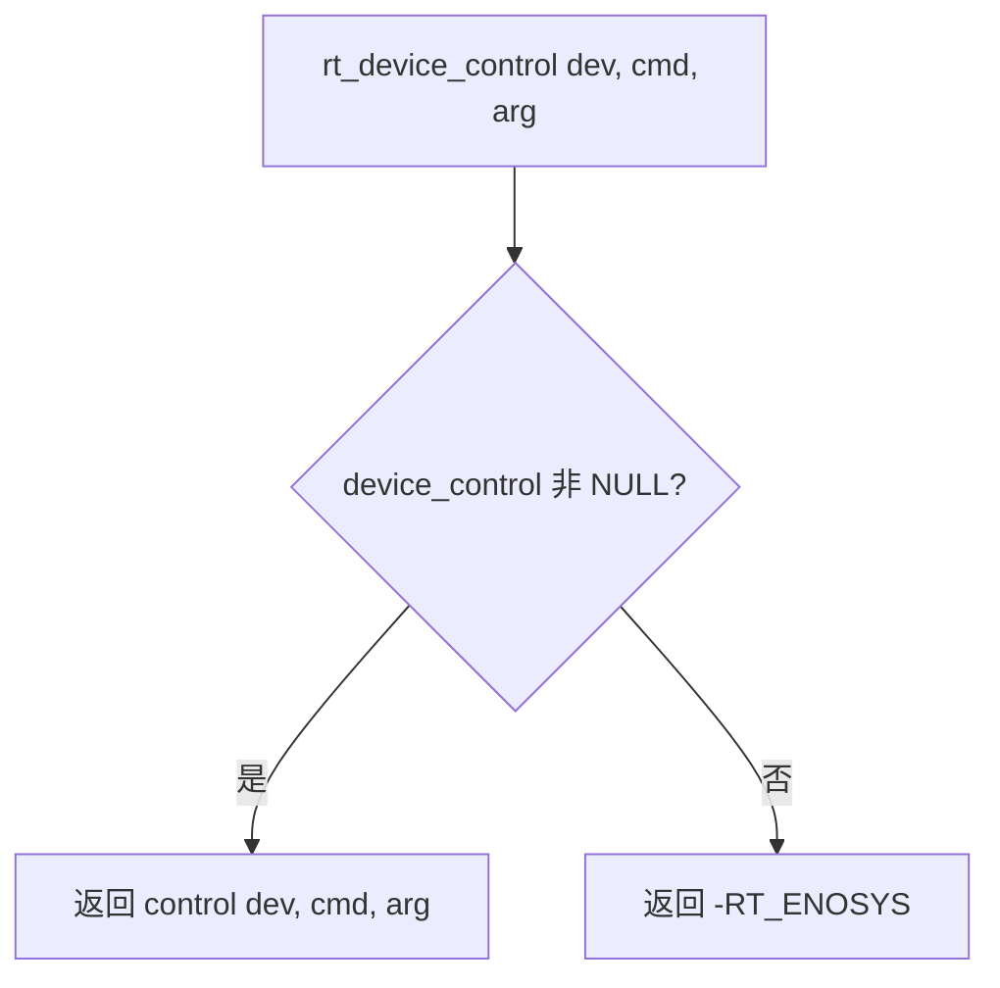
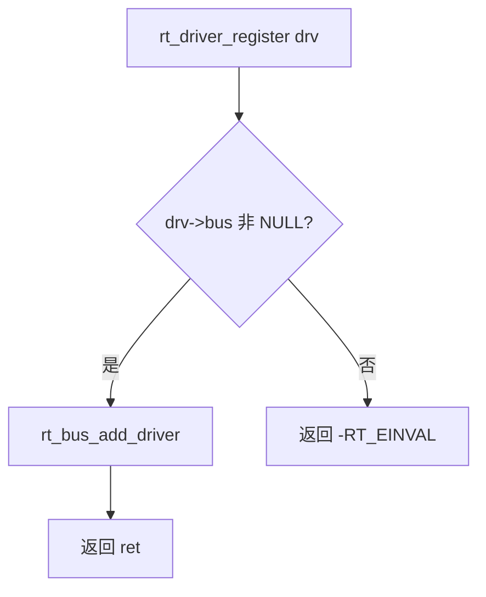

# RT-Thread 设备驱动框架说明（零基础优先 + 进阶手册）

  

**版本**：1.1  

**日期**：2026-04-04  

**依据源码**：本仓库 `components/drivers/core/device.c`、`src/object.c`、`include/rtdef.h` 等（进阶部分与附录有完整索引）。

  

**怎么读本文**：**请先读第一大部分**（故事、对照表、流程图、手把手写驱动）。第二大部分才是偏「手册」的细设计，名词多，适合你已经建立直觉后再查。

  

---

  

# 第一大部分：零基础 —— 先把框架当成「一件事」搞懂

  

## 这封信写给你

  

如果你已经会写 MCAL、会玩 RTOS 线程，但**从来没碰过 RT-Thread 的「设备」这一套**，这一节按**尽量不说黑话**的方式写。遇到必须出现的英文/术语，会用**一句话说人话**补上。

  

**你只要先记住一句话**：

  

> RT-Thread 把每个外设（或虚拟设备）做成系统里**有名字的一块控制块**，大家**按名字找人**，再用**同一套动作名字**（打开、读、写、控制等）去用，**具体芯片细节藏在回调函数里**。

  

下面用类比把「框架是什么、由什么组成」说清楚，再对照到真实源码模块。

  

---

  

## 用生活类比：小区物业 + 通讯录 + 标准窗口

  

想象一个小区：

  

1. **物业办公室有一本「设备通讯录」**  

   每一行记录：**名字**（例如 `"uart1"`、`"hello"`）+ **这张设备能办哪些业务**（谁负责接通电源、谁负责收发数据……）。  

   → 在代码里，这本通讯录就是内核里的**对象容器**；每一行对应一个 **`struct rt_device`**（设备控制块）。

  

2. **你要用 UART，不能直接去翻芯片手册乱摸寄存器（在规范工程里）**  

   你先报设备名：「我要找 `uart1`」。物业从通讯录里查到这一行，把「这一行的钥匙」给你。  

   → 这就是 **`rt_device_find("uart1")`**，也叫**按名查找 / 设备发现**。  

   钥匙 = 返回的指针 **`rt_device_t`**（你可以理解成「指向那块控制块的句柄」）。

  

3. **真正办事要走「标准窗口」**  

   窗口只提供固定几种业务：先**开户**（open）、再**读/写**、有特殊事情走**控制**（control）、不用了**销户**（close）。  

   → 对应 **`rt_device_open` / `rt_device_read` / `rt_device_write` / `rt_device_control` / `rt_device_close`**。  

   窗口背后具体找谁干活？—— 每个设备在注册时已经**绑好了自己的一套函数**（驱动写的回调）。

  

4. **驱动工程师在干什么？**  

   就是：**造好控制块**、**把回调函数填好**、**把这一行登记进通讯录**。  

   → **`rt_device_register`**，也叫**设备注册**。

  

**为什么需要这一套？**  

没有它，A 线程写 `uart1`、B 线程也写，可能各写各的函数名；应用和驱动绑死。有了统一名字 + 统一接口，**中间件、shell、文件系统**都可以用同一套方式「找人、打开、用」。

  

---

  

## 故事里的角色 ↔ 代码里是谁（对照表）

  

| 故事里怎么说 | 代码里叫什么（大概在哪） | 一句话解释 |

|--------------|---------------------------|------------|

| 通讯录里的一行 | `struct rt_device`（`include/rtdef.h`） | 存设备类型、标志、打开次数、**指向驱动回调的指针**（或 `ops` 表） |

| 把一行写进通讯录 | `rt_device_register()`（`components/drivers/core/device.c`） | **注册**：挂名字、初始化内核对象 |

| 按名字翻通讯录 | `rt_device_find()` → 内部 `rt_object_find()`（`src/object.c`） | **发现/查找**：找不到返回空指针 |

| 标准窗口「开户」 | `rt_device_open()` | 可能**第一次**帮你调 `init`（初始化硬件），并记录「有人在用」 |

| 几个人同时在用 | `ref_count` 字段 | 引用计数：`close` 减到 0 才真正关 |

| 窗口背后干活的师傅 | `init` / `open` / `read` / `write` / `control` / `close` 或 `struct rt_device_ops` | **驱动实现**；框架只负责**转调** |

| 可选：更高级的「总线、设备树」 | `RT_USING_DM` 下的 `bus.c`、`driver.c`、`dm.c` 等 | **进阶**：自动 probe、多设备挂总线；新手可先忽略 |

  

---

  

## 有没有「设备注册」和「设备发现」？有

  

**注册**：启动阶段（或模块加载时），驱动把设备控制块交给内核，**名字不能和已有设备重复**。  

**发现**：运行阶段，应用或别的模块用**字符串名字**去要指针，再去 `open/read/write/...`。

  



  

**人话串讲一遍**：

  

1. 上电后，板子初始化里会注册一串设备（串口、GPIO、你自写的 `hello` 等）。  

2. 你的线程想用时：**先 find（查通讯录）→ 再 open（开户）→ 再读写控制 → 最后 close**。  

3. 若 `find` 得到空指针，说明**没注册**或**名字写错**（和拨错电话号码一样）。

  

---

  

## 手把手：新建一个「最小虚拟设备」驱动（可抄作业）

  

下面示例**不操作真实寄存器**，只在内存里假装读写，目的是让你看清**注册 → 查找 → 打开 → 用 → 关**整条链。适合贴进你自己的 BSP 工程里试（需已开启 `RT_USING_DEVICE`）。

  

### 步骤清单（按顺序做）

  

1. **定一个全局唯一的字符串名字**（例如 `"hello"`），不要和板上已有设备重名。  

2. **准备一个 `static struct rt_device`**（或你自己的结构体，但第一个成员必须是 `struct rt_device parent` 的用法在进阶里讲，这里先用最简单形态）。  

3. **写 6 个函数**：`init`、`open`、`close`、`read`、`write`、`control`。暂时用不到的可以把指针设为 `RT_NULL`（本 demo 全写满，便于你改）。  

4. **在 `hello_dev_register` 里**：`rt_memset` 设备结构 → 设置 `type` → 绑定函数指针（或 `ops` 表）→ 调用 **`rt_device_register(&dev, "hello", RT_DEVICE_FLAG_RDWR)`**。  

5. **在板级初始化末尾**调用一次 `hello_dev_register()`（或用 `INIT_BOARD_EXPORT(hello_dev_register)`，视你工程习惯）。  

6. **在线程或 `main` 里**：`find` → `open` → `read`/`write`/`control` → `close`。

  

### 教学用源码：`minimal_hello_dev.c`（整文件可拷贝）

  

> **说明**：若工程开启了 `RT_USING_DEVICE_OPS`，下面 `#else` 分支与 `hello_ops` 二选一，与仓库中 `dev_watchdog.c` 写法一致。

  

```c

/*

 * 教学用最小设备：无真实硬件。加入 BSP 工程编译，并在板级 init 调用 hello_dev_register()。

 */

#include <rtthread.h>

  

#define HELLO_CMD_GET_MAGIC  0x100  /* 自定义 ioctl 类命令：读出魔数 */

  

static struct rt_device s_hello_dev;

static rt_uint32_t s_counter;

  

static rt_err_t hello_init(rt_device_t dev)

{

    RT_UNUSED(dev);

    s_counter = 0;

    return RT_EOK;

}

  

static rt_err_t hello_open(rt_device_t dev, rt_uint16_t oflag)

{

    RT_UNUSED(dev);

    RT_UNUSED(oflag);

    return RT_EOK;

}

  

static rt_err_t hello_close(rt_device_t dev)

{

    RT_UNUSED(dev);

    return RT_EOK;

}

  

static rt_ssize_t hello_read(rt_device_t dev, rt_off_t pos, void *buffer, rt_size_t size)

{

    char *buf = (char *)buffer;

    RT_UNUSED(dev);

    RT_UNUSED(pos);

    if (size >= 6 && buf)

    {

        const char *msg = "HELLO";

        rt_memcpy(buf, msg, 6);

        return 6;

    }

    return 0;

}

  

static rt_ssize_t hello_write(rt_device_t dev, rt_off_t pos, const void *buffer, rt_size_t size)

{

    RT_UNUSED(dev);

    RT_UNUSED(pos);

    RT_UNUSED(buffer);

    s_counter += size;

    return (rt_ssize_t)size;

}

  

static rt_err_t hello_control(rt_device_t dev, int cmd, void *args)

{

    RT_UNUSED(dev);

    if (cmd == HELLO_CMD_GET_MAGIC && args)

    {

        *(rt_uint32_t *)args = 0x504F454D; /* 教学用魔数 */

        return RT_EOK;

    }

    return -RT_ENOSYS;

}

  

void hello_dev_register(void)

{

    rt_memset(&s_hello_dev, 0, sizeof(s_hello_dev));

    s_hello_dev.type = RT_Device_Class_Miscellaneous;

    s_hello_dev.rx_indicate = RT_NULL;

    s_hello_dev.tx_complete = RT_NULL;

  

#ifdef RT_USING_DEVICE_OPS

    static const struct rt_device_ops hello_ops =

    {

        hello_init,

        hello_open,

        hello_close,

        hello_read,

        hello_write,

        hello_control,

    };

    s_hello_dev.ops = &hello_ops;

#else

    s_hello_dev.init    = hello_init;

    s_hello_dev.open    = hello_open;

    s_hello_dev.close   = hello_close;

    s_hello_dev.read    = hello_read;

    s_hello_dev.write   = hello_write;

    s_hello_dev.control = hello_control;

#endif

    s_hello_dev.user_data = RT_NULL;

  

    if (rt_device_register(&s_hello_dev, "hello", RT_DEVICE_FLAG_RDWR) != RT_EOK)

        rt_kprintf("hello dev register failed\n");

}

```

  

### 应用侧怎么用（示例片段）

  

```c

static void hello_demo_thread(void *p)

{

    rt_device_t dev;

    char buf[16];

    rt_uint32_t magic = 0;

  

    RT_UNUSED(p);

    dev = rt_device_find("hello");

    if (!dev)

    {

        rt_kprintf("find hello failed\n");

        return;

    }

    if (rt_device_open(dev, RT_DEVICE_OFLAG_RDWR) != RT_EOK)

    {

        rt_kprintf("open hello failed\n");

        return;

    }

  

    rt_memset(buf, 0, sizeof(buf));

    if (rt_device_read(dev, 0, buf, sizeof(buf)) > 0)

        rt_kprintf("read: %s\n", buf);

  

    rt_device_write(dev, 0, "abc", 3);

  

    if (rt_device_control(dev, HELLO_CMD_GET_MAGIC, &magic) == RT_EOK)

        rt_kprintf("magic = 0x%08x\n", magic);

  

    rt_device_close(dev);

}

```

  

**小结**：真实外设驱动只是把 `read`/`write`/`control` 里改成「操作寄存器 / DMA / 中断」，**骨架不变**：仍是 **register → find → open → 用 → close**。

  

---

  

# 第二大部分：进阶阅读 —— 详细设计说明（偏工程师手册）

  

以下章节**名词密度高**，适合对照源码阅读。结构与 `learn_prompt.md` 原始要求一致。

  

**计划引用的主要源码目录与文件**：`components/drivers/core/device.c`、`components/drivers/core/driver.c`、`components/drivers/core/bus.c` / `dm.c`、`include/rtdef.h`、`components/drivers/watchdog/dev_watchdog.c`、`src/object.c`。

  

---

  

## 1. 为何需要该框架

  

在 RT-Thread 中，外设数量多、类型杂（字符设备、块设备、网络等）。若每个应用直接调用板级寄存器或零散 BSP 函数，会出现：**命名与发现方式不统一**、**重复打开/关闭语义混乱**、**难以在多线程间共享设备**。

  

设备框架做三件事（可对照裸机或“仅 BSP 封装”的差异）：

  

| 对比维度 | 裸机 / 仅 BSP | RT-Thread 设备框架 |

|----------|----------------|---------------------|

| 发现设备 | 链接符号、硬编码地址 | 按**名字**在系统对象容器中查找（`rt_device_find`） |

| 生命周期 | 无统一 open/close 语义 | `ref_count` + `open_flag`，支持独占（`STANDALONE`）等 |

| 操作入口 | 各驱动自有 C API | 统一 **`init/open/close/read/write/control`**（或 `rt_device_ops`） |

  

直觉理解：**设备 = 挂在内核对象系统里的“命名服务” + 一组标准操作回调**；应用只认名字和标准调用，不认具体芯片。

  

---

  

## 2. 上下文与边界

  

### 2.1 上边界：应用与中间件如何使用设备

  

典型路径：

  

1. `rt_device_find("uart1")` 取得 `rt_device_t`。

2. `rt_device_open(dev, RT_DEVICE_OFLAG_RDWR)`（必要时先隐式 `init`）。

3. `rt_device_read` / `rt_device_write` / `rt_device_control`。

4. `rt_device_close(dev)`。

  

若开启 **POSIX 设备 I/O**（`RT_USING_POSIX_DEVIO`），同一设备还可挂 `fops`，走 `open/read/write/ioctl` 与 `select/poll` 路径（`device.c` 中初始化 `wait_queue`）。若开启 **DFS devfs**（`RT_USING_DFS_V2` + `RT_USING_DFS_DEVFS`），注册时会 `dfs_devfs_device_add`。这些属于**框架对上提供的扩展出口**，核心仍是 `struct rt_device` 与 `rt_device_*` API。

  

### 2.2 下边界：框架依赖什么

  

- **内核对象子系统**：设备继承 `struct rt_object`，注册进对象容器；查找走 `rt_object_find`（实现见 `src/object.c`）。

- **具体硬件**：框架**不**实现寄存器操作；由各类驱动在 `control`/`read`/`write` 或板级 `ops` 中调用 HAL/BSP。

- **可选设备模型（DM）**：`RT_USING_DM` 时，`struct rt_device` 扩展 `bus`、`drv`、设备树节点等，与 `components/drivers/core/bus.c`、`dm.c` 协同；未开启时仍可仅用“注册 + 查找 + 标准 ops”的经典模型。

  

---

  

## 3. 对外 API 与底层依赖

  

### 3.1 核心公共 API（`components/drivers/core/device.c`）

  

| API | 作用 |

|-----|------|

| `rt_device_register` | 名字查重、`rt_object_init`、初始化标志与引用计数；可选 POSIX/DFS 挂钩 |

| `rt_device_unregister` | 从对象容器摘除 |

| `rt_device_find` | 按名查找设备对象 |

| `rt_device_create` / `rt_device_destroy` | 堆上创建设备对象（需 `RT_USING_HEAP`） |

| `rt_device_init` | 显式调用 `init` 回调并置 `ACTIVATED` |

| `rt_device_open` / `close` | 懒初始化、`ref_count`、调用 `open`/`close` |

| `rt_device_read` / `write` | 检查已打开，转调驱动回调 |

| `rt_device_control` | 转调 `control` |

| `rt_device_set_rx_indicate` / `set_tx_complete` | 设置异步收发完成通知（常用于串口、网络等） |

  

### 3.2 典型调用链（文字）

  

- **注册**：板级 `xxx_register` → 填 `struct rt_device`（或子类首域嵌入 `parent`）→ `rt_device_register` → `rt_object_init(..., RT_Object_Class_Device, name)`。

- **查找**：`rt_device_find(name)` → `rt_object_find(name, RT_Object_Class_Device)` → 遍历对象容器链表（带自旋锁保护）。

- **打开**：`rt_device_open` →（若未激活则）`device_init` → 处理 `STANDALONE` 与 `oflag` → `device_open` → `ref_count++`。

- **读/写**：`rt_device_read`/`write` → 若 `ref_count==0` 则失败 → 否则调用驱动 `read`/`write`。

  

### 3.3 与中断 / DMA 的关系

  

框架层**不**强制中断模型：中断服务程序通常在驱动内部实现，通过 `rx_indicate` / `tx_complete` 或信号量、邮箱等 IPC 与线程协作。DMA 同理，多出现在具体驱动与 `RT_USING_DM` + `dma_ops` 扩展路径中，属于**下边界能力**，而非 `device.c` 中央逻辑。

  

### 3.4 总线侧驱动注册（`components/drivers/core/driver.c`）

  

`rt_driver_register` 将 `struct rt_driver` 挂到其 `bus` 上（`rt_bus_add_driver`）。这是 **DM/总线模型** 的一条支线：与“直接 `rt_device_register` 的经典板级驱动”并存。

  

### 3.5（类比，非 Linux 子系统）与“文件操作表”的相似性

  

仅作认知类比：**`struct rt_device` + `read/write/control`（或 `rt_device_ops`）** 与通用 OS 里“字符设备 + file_operations”的**思想**相近：都是 **vtable + 生命周期**。实现细节、错误码、调度与权限模型均不同；本仓库实现以 `rt_device_*` 与 `rt_object` 为准。

  

---

  

## 4. 组件分层与依赖

  



  

**职责简述**：

  

- **设备核心层**：命名、引用计数、打开语义、统一转调。

- **驱动实现层**：实现 `ops`，可嵌入更大结构体（如 `rt_watchdog_t` 首成员为 `struct rt_device parent`）。

- **可选 DM**：总线、probe、设备树属性解析等，仍落到 `struct rt_device` 与驱动 `probe`。

  

---

  

## 5. 最小驱动实例的动态流程（看门狗类）

  

选取 `components/drivers/watchdog/dev_watchdog.c`：`read`/`write` 为 `NULL`，主要路径为 **register → find → open → control**（喂狗/超时等由 `control` 与板级 `ops` 完成）。

  



  

**说明**：该示例无 `read`/`write`；若调用 `rt_device_read` 且 `device_read` 为 `NULL`，核心层会置 `errno` 并返回 0（见 `device.c`）。

  

---

  

## 6. 关键函数流程图

  

### 6.1 `rt_device_register`

  



  

### 6.2 `rt_device_find`

  



  

### 6.3 `rt_device_open`

  

```mermaid

flowchart TD

    A[rt_device_open dev, oflag] --> B{已 ACTIVATED?}

    B -->|否| C{有 device_init?}

    C -->|是| D[调用 device_init]

    D --> E{成功?}

    E -->|否| Z1[返回错误]

    E -->|是| F[置 ACTIVATED]

    C -->|否| F

    B -->|是| G{STANDALONE 且已 OPEN?}

    F --> G

    G -->|是| Z2[返回 -RT_EBUSY]

    G -->|否| H{需调用 device_open?}

    H -->|是| I[device_open]

    H -->|否| J[仅更新 open_flag 字段]

    I --> K{result OK 或 -RT_ENOSYS?}

    J --> K

    K -->|是| L[open_flag |= OPEN, ref_count++]

    K -->|否| Z3[返回 result]

    L --> M[返回 RT_EOK]

```

  

### 6.4 `rt_device_read` / `rt_device_write`

  



  

### 6.5 `rt_device_control`

  



  

### 6.6 `rt_driver_register`（DM 支线）

  



  

---

  

## 7. 附录：源码索引表

  

| 路径 | 一句话职责 |

|------|------------|

| `components/drivers/core/device.c` | 设备注册/查找/open/close/read/write/control 及 POSIX 等待队列初始化 |

| `components/drivers/core/driver.c` | `rt_driver_register` / `unregister`，将驱动挂到总线 |

| `components/drivers/core/bus.c` | 虚拟总线设备、DM 下总线链表与驱动/设备挂载 |

| `components/drivers/core/dm.c` | 设备模型辅助（IDA、次 CPU 初始化导出、DM 相关逻辑） |

| `components/drivers/core/platform.c` / `platform_ofw.c` | 平台设备与 OFW 相关（随 Kconfig 启用） |

| `include/rtdef.h` | `struct rt_device`、`struct rt_device_ops`、设备类与 flag 定义 |

| `components/drivers/include/rtdevice.h` | 按宏聚合各类具体驱动头文件（SPI、I2C、WDT 等） |

| `src/object.c` | `rt_object_init` / `rt_object_find` / 对象容器迭代 |

| `components/drivers/watchdog/dev_watchdog.c` | 看门狗类设备：`rt_hw_watchdog_register` → `rt_device_register` 的最小闭环示例 |

  

---

  

## 验收自检

  

- [x] `design_lesson.md` 含零基础前置说明（类比、映射、注册/发现流程、手把手 demo）。

- [x] 进阶部分章节齐全，源码路径可核对。

- [x] 含最小驱动时序图（看门狗）及多个关键函数 Mermaid 流程图。