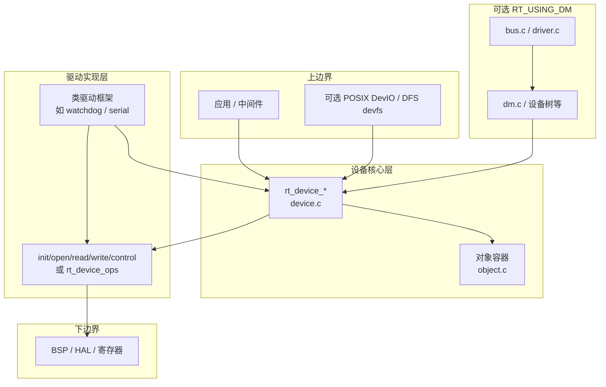
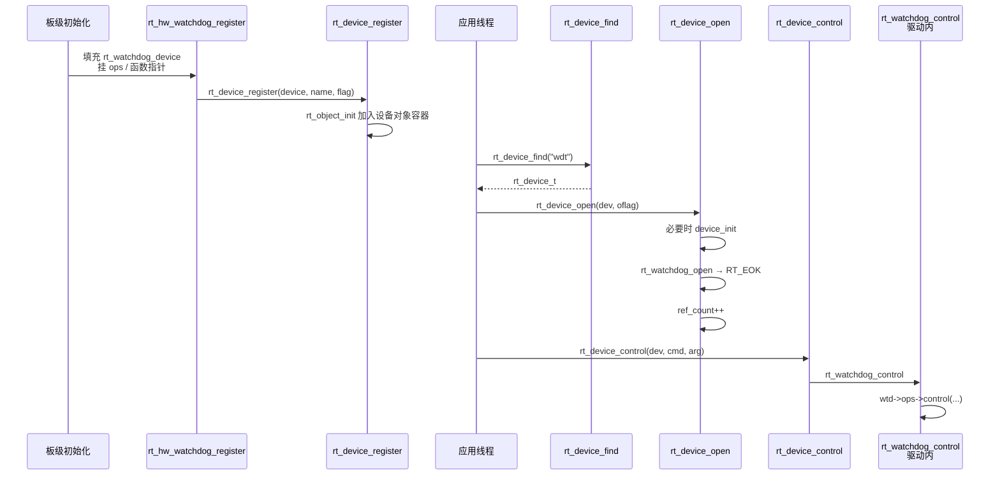
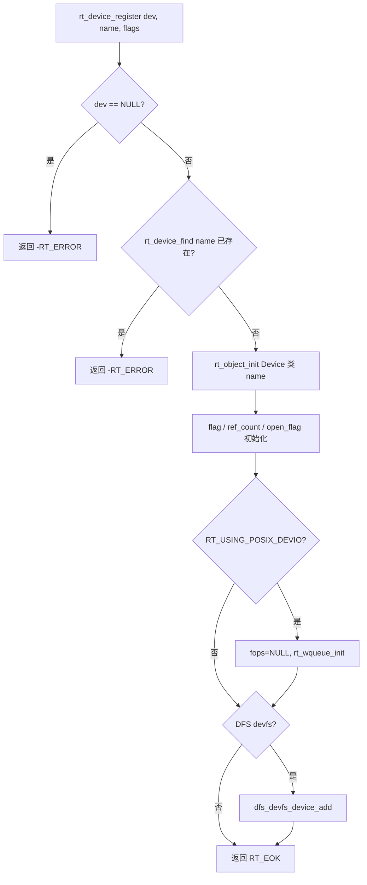
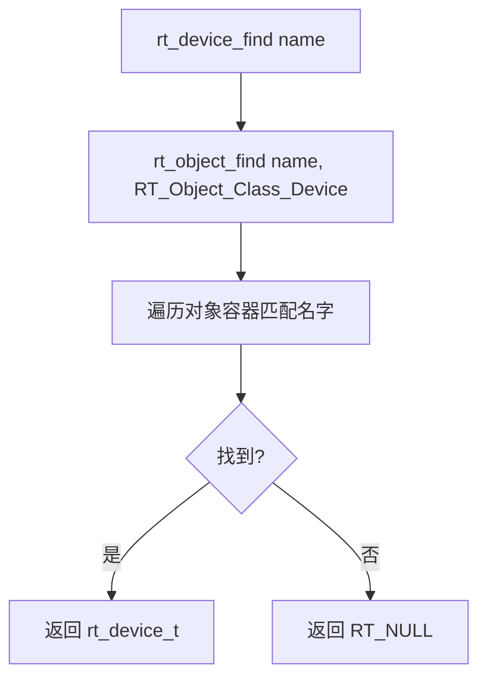
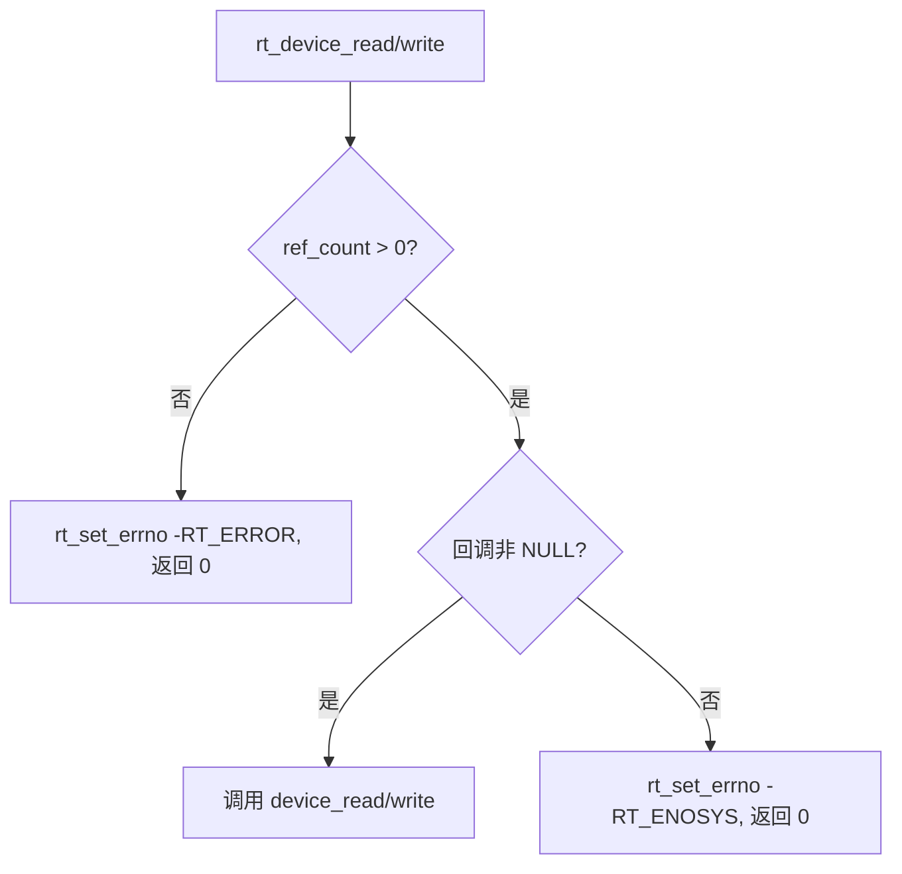
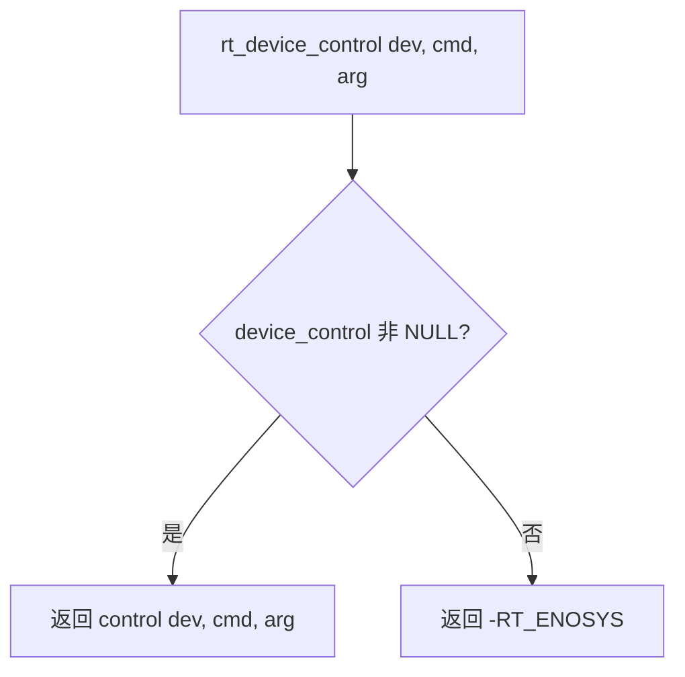
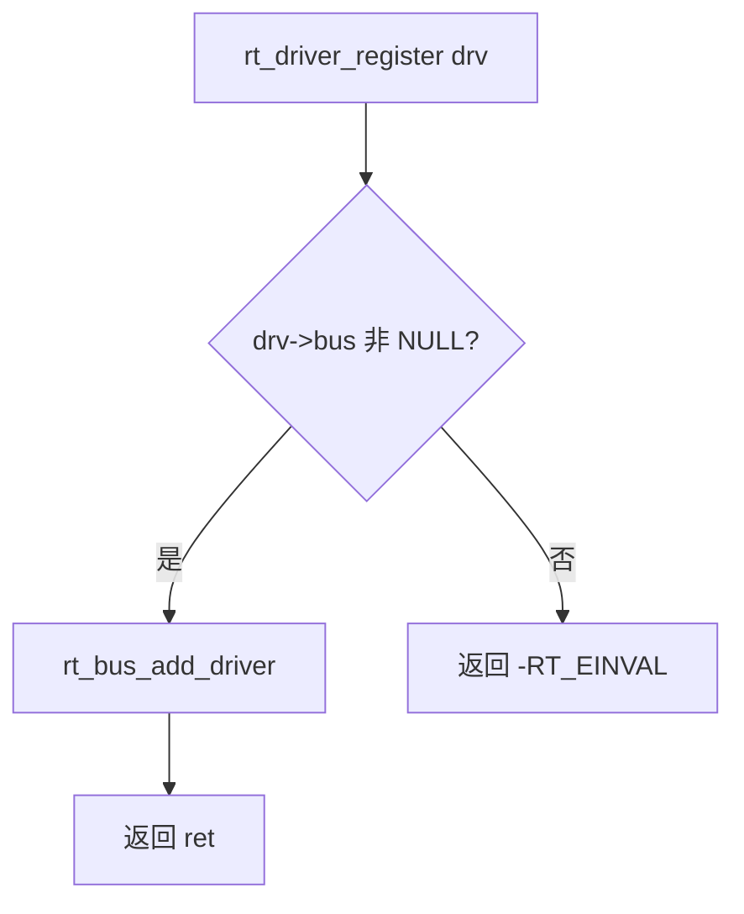

# RT-Thread 设备驱动框架详细设计说明

**版本**：1.0  
**日期**：2026-04-04  
**依据源码**：本仓库 `components/drivers/core/`、`src/object.c`、`include/rtdef.h` 等（见文末索引）。

**计划引用的主要源码目录与文件**：`components/drivers/core/device.c`（设备核心 API）、`components/drivers/core/driver.c`（总线侧驱动注册）、`components/drivers/core/bus.c` / `dm.c`（总线与设备模型，可选编译）、`include/rtdef.h`（`struct rt_device` 与标志位）、`components/drivers/watchdog/dev_watchdog.c`（最小类驱动示例）、`src/object.c`（对象容器与查找）。

---

## 1. 为何需要该框架

在 RT-Thread 中，外设数量多、类型杂（字符设备、块设备、网络等）。若每个应用直接调用板级寄存器或零散 BSP 函数，会出现：**命名与发现方式不统一**、**重复打开/关闭语义混乱**、**难以在多线程间共享设备**。

设备框架做三件事（可对照裸机或“仅 BSP 封装”的差异）：

| 对比维度 | 裸机 / 仅 BSP | RT-Thread 设备框架 |
|----------|----------------|---------------------|
| 发现设备 | 链接符号、硬编码地址 | 按**名字**在系统对象容器中查找（`rt_device_find`） |
| 生命周期 | 无统一 open/close 语义 | `ref_count` + `open_flag`，支持独占（`STANDALONE`）等 |
| 操作入口 | 各驱动自有 C API | 统一 **`init/open/close/read/write/control`**（或 `rt_device_ops`） |

直觉理解：**设备 = 挂在内核对象系统里的“命名服务” + 一组标准操作回调**；应用只认名字和标准调用，不认具体芯片。

---

## 2. 上下文与边界

### 2.1 上边界：应用与中间件如何使用设备

典型路径：

1. `rt_device_find("uart1")` 取得 `rt_device_t`。
2. `rt_device_open(dev, RT_DEVICE_OFLAG_RDWR)`（必要时先隐式 `init`）。
3. `rt_device_read` / `rt_device_write` / `rt_device_control`。
4. `rt_device_close(dev)`。

若开启 **POSIX 设备 I/O**（`RT_USING_POSIX_DEVIO`），同一设备还可挂 `fops`，走 `open/read/write/ioctl` 与 `select/poll` 路径（`device.c` 中初始化 `wait_queue`）。若开启 **DFS devfs**（`RT_USING_DFS_V2` + `RT_USING_DFS_DEVFS`），注册时会 `dfs_devfs_device_add`。这些属于**框架对上提供的扩展出口**，核心仍是 `struct rt_device` 与 `rt_device_*` API。

### 2.2 下边界：框架依赖什么

- **内核对象子系统**：设备继承 `struct rt_object`，注册进对象容器；查找走 `rt_object_find`（实现见 `src/object.c`）。
- **具体硬件**：框架**不**实现寄存器操作；由各类驱动在 `control`/`read`/`write` 或板级 `ops` 中调用 HAL/BSP。
- **可选设备模型（DM）**：`RT_USING_DM` 时，`struct rt_device` 扩展 `bus`、`drv`、设备树节点等，与 `components/drivers/core/bus.c`、`dm.c` 协同；未开启时仍可仅用“注册 + 查找 + 标准 ops”的经典模型。

---

## 3. 对外 API 与底层依赖

### 3.1 核心公共 API（`components/drivers/core/device.c`）

| API | 作用 |
|-----|------|
| `rt_device_register` | 名字查重、`rt_object_init`、初始化标志与引用计数；可选 POSIX/DFS 挂钩 |
| `rt_device_unregister` | 从对象容器摘除 |
| `rt_device_find` | 按名查找设备对象 |
| `rt_device_create` / `rt_device_destroy` | 堆上创建设备对象（需 `RT_USING_HEAP`） |
| `rt_device_init` | 显式调用 `init` 回调并置 `ACTIVATED` |
| `rt_device_open` / `close` | 懒初始化、`ref_count`、调用 `open`/`close` |
| `rt_device_read` / `write` | 检查已打开，转调驱动回调 |
| `rt_device_control` | 转调 `control` |
| `rt_device_set_rx_indicate` / `set_tx_complete` | 设置异步收发完成通知（常用于串口、网络等） |

### 3.2 典型调用链（文字）

- **注册**：板级 `xxx_register` → 填 `struct rt_device`（或子类首域嵌入 `parent`）→ `rt_device_register` → `rt_object_init(..., RT_Object_Class_Device, name)`。
- **查找**：`rt_device_find(name)` → `rt_object_find(name, RT_Object_Class_Device)` → 遍历对象容器链表（带自旋锁保护）。
- **打开**：`rt_device_open` →（若未激活则）`device_init` → 处理 `STANDALONE` 与 `oflag` → `device_open` → `ref_count++`。
- **读/写**：`rt_device_read`/`write` → 若 `ref_count==0` 则失败 → 否则调用驱动 `read`/`write`。

### 3.3 与中断 / DMA 的关系

框架层**不**强制中断模型：中断服务程序通常在驱动内部实现，通过 `rx_indicate` / `tx_complete` 或信号量、邮箱等 IPC 与线程协作。DMA 同理，多出现在具体驱动与 `RT_USING_DM` + `dma_ops` 扩展路径中，属于**下边界能力**，而非 `device.c` 中央逻辑。

### 3.4 总线侧驱动注册（`components/drivers/core/driver.c`）

`rt_driver_register` 将 `struct rt_driver` 挂到其 `bus` 上（`rt_bus_add_driver`）。这是 **DM/总线模型** 的一条支线：与“直接 `rt_device_register` 的经典板级驱动”并存。

### 3.5（类比，非 Linux 子系统）与“文件操作表”的相似性

仅作认知类比：**`struct rt_device` + `read/write/control`（或 `rt_device_ops`）** 与通用 OS 里“字符设备 + file_operations”的**思想**相近：都是 **vtable + 生命周期**。实现细节、错误码、调度与权限模型均不同；本仓库实现以 `rt_device_*` 与 `rt_object` 为准。

---

## 4. 组件分层与依赖



**职责简述**：

- **设备核心层**：命名、引用计数、打开语义、统一转调。
- **驱动实现层**：实现 `ops`，可嵌入更大结构体（如 `rt_watchdog_t` 首成员为 `struct rt_device parent`）。
- **可选 DM**：总线、probe、设备树属性解析等，仍落到 `struct rt_device` 与驱动 `probe`。

---

## 5. 最小驱动实例的动态流程（看门狗类）

选取 `components/drivers/watchdog/dev_watchdog.c`：`read`/`write` 为 `NULL`，主要路径为 **register → find → open → control**（喂狗/超时等由 `control` 与板级 `ops` 完成）。



**说明**：该示例无 `read`/`write`；若调用 `rt_device_read` 且 `device_read` 为 `NULL`，核心层会置 `errno` 并返回 0（见 `device.c`）。

---

## 6. 关键函数流程图

### 6.1 `rt_device_register`



### 6.2 `rt_device_find`



### 6.3 `rt_device_open`

```mermaid
flowchart TD
    A[rt_device_open dev, oflag] --> B{已 ACTIVATED?}
    B -->|否| C{有 device_init?}
    C -->|是| D[调用 device_init]
    D --> E{成功?}
    E -->|否| Z1[返回错误]
    E -->|是| F[置 ACTIVATED]
    C -->|否| F
    B -->|是| G{STANDALONE 且已 OPEN?}
    F --> G
    G -->|是| Z2[返回 -RT_EBUSY]
    G -->|否| H{需调用 device_open?}
    H -->|是| I[device_open]
    H -->|否| J[仅更新 open_flag 字段]
    I --> K{result OK 或 -RT_ENOSYS?}
    J --> K
    K -->|是| L[open_flag |= OPEN, ref_count++]
    K -->|否| Z3[返回 result]
    L --> M[返回 RT_EOK]
```

### 6.4 `rt_device_read` / `rt_device_write`



### 6.5 `rt_device_control`



### 6.6 `rt_driver_register`（DM 支线）



---

## 7. 附录：源码索引表

| 路径 | 一句话职责 |
|------|------------|
| `components/drivers/core/device.c` | 设备注册/查找/open/close/read/write/control 及 POSIX 等待队列初始化 |
| `components/drivers/core/driver.c` | `rt_driver_register` / `unregister`，将驱动挂到总线 |
| `components/drivers/core/bus.c` | 虚拟总线设备、DM 下总线链表与驱动/设备挂载 |
| `components/drivers/core/dm.c` | 设备模型辅助（IDA、次 CPU 初始化导出、DM 相关逻辑） |
| `components/drivers/core/platform.c` / `platform_ofw.c` | 平台设备与 OFW 相关（随 Kconfig 启用） |
| `include/rtdef.h` | `struct rt_device`、`struct rt_device_ops`、设备类与 flag 定义 |
| `components/drivers/include/rtdevice.h` | 按宏聚合各类具体驱动头文件（SPI、I2C、WDT 等） |
| `src/object.c` | `rt_object_init` / `rt_object_find` / 对象容器迭代 |
| `components/drivers/watchdog/dev_watchdog.c` | 看门狗类设备：`rt_hw_watchdog_register` → `rt_device_register` 的最小闭环示例 |

---

## 验收自检

- [x] `design_lesson.md` 已生成且章节齐全（对应 `learn_prompt.md` 第 1～7 节结构）。
- [x] 分层、API、依赖与所列源码路径一致，可打开文件核对。
- [x] 含 1 个最小驱动时序图（看门狗）及多个关键函数 Mermaid 流程图。
