# CAN-protocol-001 — ARINC 825：从“会拆 29-bit ID”到“理解整套航空 CAN 通信机制”

> 适用对象：已经理解 CAN 基础、TCP/IP 分层、ARINC 825 29-bit Identifier 基本寻址的人。  
> 学习目标：不再停留在“字段是什么”，而是能回答 **ARINC 825 为什么需要这些机制、它们各属于什么性质、如何协同形成可预测且可维护的航空 CAN 网络**。  
> 标准基线：以 **ARINC 825-4（2018，当前 SAE 页面仍标记 Current）** 为版本锚点；公开教程用于解释机制，不替代正式标准。

---

## 0. 先校正学习地图：ARINC 825 到底在 CAN 上补了什么？

### 0.1 费曼解释

先把 CAN 想成一个车间里的“公共喊话总线”。

CAN 已经帮你解决了：

- 电信号怎么传；
- 一帧怎么封装；
- 多个人同时说话谁先说；
- CRC、ACK、Error Frame；
- 29-bit Identifier 怎么参与仲裁。

但是裸 CAN **没有完整回答**：

- 这条数据是什么工程量？
- 我要广播，还是只找某个节点？
- 某个节点提供哪些服务？
- 整张网谁发什么、多久发一次？
- 高优先级节点一直发，别人怎么办？
- 节点活着还是死了？
- CAN CRC 通过以后，应用层数据就真的可信了吗？
- 双 CAN 总线怎么做冗余？
- CAN 网络怎么穿过 Gateway 去 AFDX/ARINC 664？

**ARINC 825 就是在 CAN L1/L2 上补齐这些航空系统级能力。**

### 0.2 用 TCP/IP 做锚点

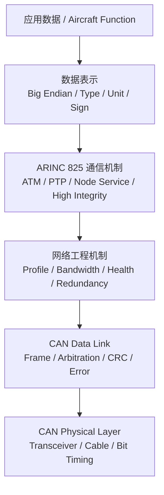

与 TCP/IP **只能类比，不能机械等同**：

| ARINC 825 主题 | 最接近的 TCP/IP 心智锚点 | 实际属性 |
|---|---|---|
| Identifier / LCC / FID / DOC / NID | IP + Port + Message Type 的混合 | 高层寻址/分类/优先级编码 |
| Payload Interoperability | 应用层协议 + XDR/数据表示 | 表示层/应用数据标准化 |
| ATM / PTP | UDP 广播 + Client/Server | 高层通信模型 |
| Node Service | RPC / 管理接口 | 网络服务/设备管理 |
| Communication Profile | DBC + ICD + 网络配置数据库 | 系统集成与配置 |
| Bandwidth Management | QoS + Traffic Shaping + RT Scheduling | 网络资源与实时调度 |
| CAN Error Handling | Ethernet MAC/链路错误处理 | 数据链路层 |
| High Integrity | TCP 序号 + E2E Protection | 端到端完整性 |
| Redundancy | 双链路/双网容错 | 系统可靠性 |
| Gateway | Router + Protocol Gateway | 网络域互联 |

### 0.3 一个必须先修正的认知

你之前的笔记把高位抽象成了“3-bit Priority + 4-bit LCC”。

根据 Stock Flight Systems / ICS / Wetzel 的 ARINC 825 教程，以及 Airbus/CiA 论文中的 Identifier 图，**LCC 本身是 3 bit，并且处在 Identifier 的高位，因此 LCC 的编码天然影响 CAN 仲裁优先级**。

也就是：

```text
不是：
[独立 Priority][独立 LCC][...]

而是更接近：
[LCC:3bit][FID/...][DOC/NID/...][RCI]
   ↑
   LCC 的数值本身已经参与 CAN 仲裁优先级
```

公开经典资料给出的 LCC 粗粒度顺序是：

```text
000 EEC  -> 最高
010 NOC
100 NSC
101 UDC
110 TMC
111 FMC  -> 最低
```

注意：不同 Supplement 的部分 Channel 定义存在演进。较早公开教程把某些值标为 Reserved，后续资料出现 Directed Message Channel 等扩展。**工程中必须以项目指定的 ARINC 825 Supplement + Communication Profile 为最终依据。**

### 0.4 本教程采用的人类学习顺序

不是照标准目录机械抄，而按“先会通信，再会管网，再会做可靠性”的认知顺序：

1. Payload / Interoperability —— 数据到底是什么  
2. Communication Model —— 谁跟谁怎么说  
3. Communication Profile —— 整张网怎么定义  
4. Bandwidth Management —— 怎么保证按时说  
5. Health + Node Service —— 怎么知道节点活着、怎么管理节点  
6. CAN Error Handling —— 链路坏了怎么隔离  
7. High Integrity —— 链路没报错，应用数据仍怎么做端到端保护  
8. Redundancy —— 一条总线坏了怎么继续  
9. Gateway —— 跨 CAN 域/ARINC 664 怎么转发  
10. CAN FD / Compliance —— 825-4 后续工程入口

---

# Topic 1 — Payload / Interoperability：收到 8 个字节以后，到底代表什么？

## 1.1 属性

**属性：数据表示 / 应用数据标准化。**

它不是网络管理，不是可靠传输，也不是路由。

它解决的是：

> 两个不同供应商的 LRU 收到相同 DATA 后，能不能得到相同的物理意义？

## 1.2 费曼解释

假设 CAN 帧是一个快递箱：

- Identifier = 快递单；
- DATA[0..7] = 箱子里的东西。

你已经会看“快递单”，但如果没有 Payload 规则：

```text
12 34 00 01
```

A 厂商可能理解成：

```text
0x1234 = 4660 rpm
```

B 厂商可能理解成：

```text
0x1234 = 46.60 °C
```

网络虽然 100% 无误传输，系统仍然是错的。

所以 ARINC 825 的 Interoperability 要统一：

- Endian；
- Data Type；
- Engineering Unit；
- Axis / Sign Convention；
- Aircraft Function；
- 参数范围/缩放等 Profile 信息。

公开 ARINC 825 教程明确指出使用 **Big Endian**，并定义 Boolean、Integer、Floating Point、工程单位、航空坐标轴和符号约定。

## 1.3 TCP/IP 锚点

TCP 只负责：

```text
把 byte stream 从 A 可靠送到 B
```

TCP 不知道：

```text
00 00 03 E8
```

是：

- 1000 rpm；
- 100.0 °C；
- 1.000 bar。

这件事由 Modbus、Protobuf、自定义协议负责。

ARINC 825 的 Payload Interoperability 就是这个角色。

## 1.4 Identifier 与 Payload 的关系

ATM / One-to-Many 下：

```text
Source FID + DOC
        │
        ▼
Communication Profile
        │
        ├── 数据类型
        ├── 单位
        ├── 范围
        ├── Scaling
        └── Transmission Interval
```

所以 DOC 不等于“数据本身”。

DOC 更像：

> **参数类型索引。**

真正完整的参数解释来自 Communication Profile。

## 1.5 教学示例：发动机转速

下面只是教学示例，不代表标准分配：

```text
FID = Engine Controls
DOC = ENGINE_SPEED
DATA = 00 00 27 10
```

Profile 定义：

```text
Type      = UINT32
Endian    = Big Endian
Unit      = rpm
Scale     = 1
Range     = 0..30000
```

接收端：

```text
00 00 27 10 -> 0x00002710 -> 10000 rpm
```

如果 MCU 是 Little Endian：

```c
uint32_t rpm =
    ((uint32_t)data[0] << 24) |
    ((uint32_t)data[1] << 16) |
    ((uint32_t)data[2] << 8)  |
    ((uint32_t)data[3]);
```

不要直接：

```c
rpm = *(uint32_t *)&data[0];
```

否则主机字节序和对齐都会把协议语义搞乱。

## 1.6 数据接收组件图


## 1.7 心智模型

> **Identifier 告诉你“这是什么信封”；Profile 告诉你“信封里的字节应该怎么解释”。**

记忆：

```text
CAN 负责“字节到了”
ARINC 825 Interoperability 负责“大家对这些字节理解一致”
```

---

# Topic 2 — Communication Model：广播、定向消息和节点服务到底有什么区别？

## 2.1 属性

**属性：高层通信模型。**

它部分承担了 TCP/IP 世界中 Network/Transport/Application Interaction 的功能，但不能简单叫“TCP 层”。

核心问题：

> 一条消息是“发布状态”，还是“找某个节点办事情”？

## 2.2 费曼解释

飞机里有两类非常不同的通信。

第一类：

> “发动机现在 10000 rpm，谁需要谁听。”

第二类：

> “维护计算机，请发动机控制器把你的软件版本告诉我。”

第一类适合广播。

第二类需要找到一个明确节点，并产生 Client/Server 交互。

这就是 ATM 与 PTP 的根本区别。

## 2.3 ATM — Anyone-To-Many

ATM 本质：

> **Producer 发布数据，不关心到底有几个 Consumer。**

TCP/IP 锚点：

```text
更接近 UDP multicast / Publish-Subscribe
```

典型场景：

- 转速；
- 温度；
- 位置；
- 开关状态；
- 周期状态；
- Exception Event。

### ATM 时序

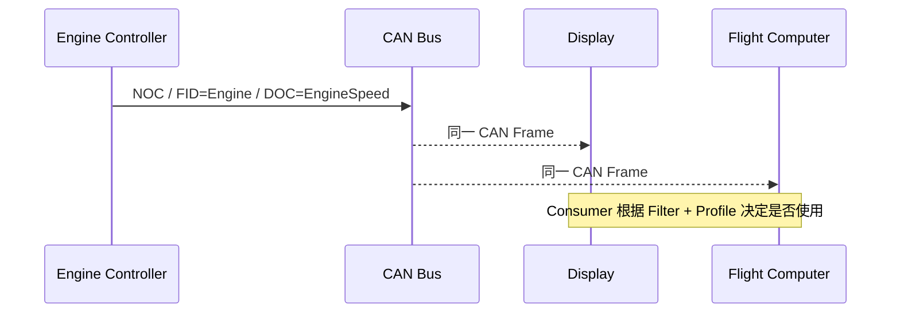

特点：

- 一帧服务多个接收者；
- 带宽效率高；
- 非目标节点可通过硬件 Filter 提前丢掉；
- 适合参数型数据。

## 2.4 PTP — Peer-To-Peer

PTP 本质：

> **Client 明确找一个 Server，调用某个服务。**

TCP/IP 锚点：

```text
Node ID ≈ IP/Host
Service ≈ Port/RPC Method
Request/Response ≈ Client/Server Transaction
```

典型：

- 查询节点身份；
- 时间同步；
- Data Upload；
- Data Download；
- BIT 控制；
- 非易失存储操作；
- Node ID 设置。

公开验证 IP 资料列出的 Node Service 包括 IDS、NSS、DUS、DDS、BCS、NVS、NIS、SCS 等。

### PTP 时序

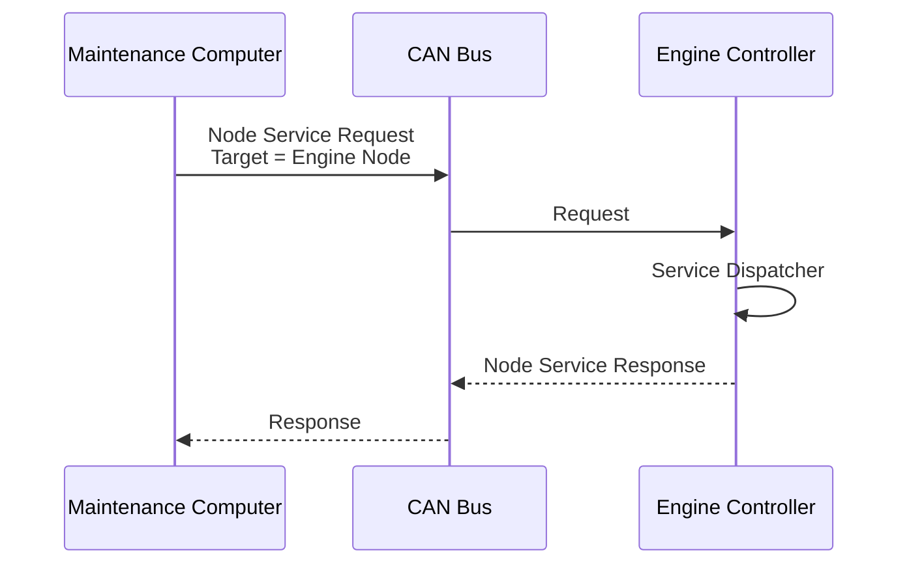

## 2.5 Connectionless 与 Connection-Oriented

公开 ARINC 825 教程直接用：

- UDP/IP；
- TCP/IP；

作为类比。

### Connectionless

```text
Client -> Server
```

不要求返回响应。

适合：

- 简单命令；
- 无需确认的控制；
- 某些通知。

### Connection-Oriented

```text
Client -> Server : Request
Server -> Client : Response
```

甚至可能形成持续 Dialogue。

这里的“connection-oriented”是 **ARINC 825 自己的节点服务/对话语义**，不要把它理解成真的运行了 TCP。

## 2.6 LCC 为什么存在？

LCC 不是简单“报文类型”。

它同时完成：

1. 通信语义隔离；
2. 业务分流；
3. 粗粒度优先级。

例如：

```text
EEC -> 紧急事件
NOC -> 正常周期/非周期参数
NSC -> 节点服务
TMC -> 测试维护
```

所以你可以把 LCC 理解成：

> **把一根 CAN 总线虚拟切成几个用途不同、优先级不同的逻辑通道。**

## 2.7 心智模型

```text
ATM：
“我有数据，大家听。”

PTP：
“Node X，我找你办事。”

LCC：
“这件事属于哪种逻辑通道，并获得什么粗粒度路权。”
```

---

# Topic 3 — Communication Profile：ARINC 825 网络的“合同”

## 3.1 属性

**属性：系统集成 / 网络配置 / 网络规格数据库。**

它不是运行时协议层。

## 3.2 费曼解释

假设公司里 20 个人同时使用一条 CAN 总线。

如果每个人自己决定：

- 我用哪个 DOC；
- 我多久发一次；
- 我是什么单位；
- 我发给谁；
- 优先级多高；

最后一定冲突。

所以必须有一份所有节点共同遵守的“网络合同”。

这就是 Communication Profile。

公开 ARINC 825 教程描述 Profile Database 用于描述整个网络流量，并可采用可读 XML，测试工具也可以读取 Profile 来解释网络数据。

## 3.3 TCP/IP 锚点

它不是一个纯 TCP/IP 组件，更像以下东西的合集：

```text
DBC
+ ICD
+ Port Allocation
+ QoS Policy
+ Message Schedule
+ Data Dictionary
```

## 3.4 一个 Profile 至少在回答什么？

对于每个参数/消息：

```text
谁发？
Source FID / Node

发什么？
DOC / Service

怎么解释？
Type / Endian / Unit / Scale / Range

多久发？
Transmission Interval

发到哪里？
LCC / ATM / PTP / Gateway policy

重要程度？
Identifier / Channel priority

谁消费？
Consumer List / Filter Design
```

## 3.5 Profile 驱动的软件架构

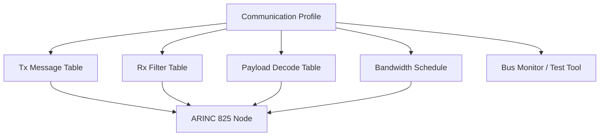

工程上最合理的实现往往不是：

```c
if (id == 0x12345678) ...
```

而是：

```text
Profile
   ↓
代码生成 / 配置生成
   ↓
Tx Table
Rx Table
Decode Table
Schedule Table
```

## 3.6 为什么它是系统工程核心？

因为 ARINC 825 的目标不是：

> “一块板能不能收发。”

而是：

> “几十个不同供应商设备装到一起以后，整个网络是否仍然一致、可分析、可测试。”

所以在真正项目里：

> **Communication Profile 比某一个驱动 API 更接近系统真相。**

## 3.7 心智模型

> **Profile = ARINC 825 网络的单一事实来源（Single Source of Truth）。**

你拿到一个工程，优先问：

```text
1. ARINC 825 版本？
2. Communication Profile？
3. Node/FID/SID 分配？
4. Message Schedule？
```

---

# Topic 4 — Bandwidth Management：CAN 能发出去，不代表航空网络设计正确

## 4.1 属性

**属性：网络资源管理 + 实时调度。**

它不是 TCP 那种“丢包重传”。

它解决的是：

> 高优先级消息和周期消息竞争时，如何证明关键数据在最坏情况下仍能及时发送？

## 4.2 费曼解释

CAN 仲裁规则是：

> ID 越小，越容易赢。

如果一个高优先级节点每 100 µs 就发一次：

```text
高优先级：
发 -> 赢
发 -> 赢
发 -> 赢
...
```

低优先级节点可能长期等待。

CAN 的仲裁本身没有错。

错误在于：

> **系统设计允许某个节点占用过多时间。**

所以 Bandwidth Management 不修改 CAN 仲裁，而是限制每个节点：

> 在一个时间窗口里最多允许发送多少消息。

## 4.3 TCP/IP 锚点

最像：

```text
QoS
+ Traffic Shaping
+ Rate Limiting
+ Real-Time Schedule
```

不是 TCP Flow Control。

TCP Flow Control 解决：

> Receiver 缓冲区吃不消。

ARINC 825 Bandwidth Management 解决：

> 整条共享总线不能被某些节点占满，而且关键消息的等待时间必须可预测。

## 4.4 Predictability 才是核心

Airbus/CiA 论文特别强调：

> 航空实时网络最关键的不是“微秒级固定时序”，而是 **行为能够被定义、分析和证明**。

这就是 predictability。

核心指标：

- Bus Load；
- Peak Load；
- Latency；
- Jitter；
- Transmission Interval；
- Worst-case blocking；
- Growth margin。

## 4.5 Minor Time Frame / Major Time Frame

### Minor Time Frame

> 网络中最快周期消息的基本调度时间尺度。

### Major Time Frame

> 足够长，使所有周期消息至少获得一次发送机会的周期。

例如：

```text
Minor = 15 ms

Message A -> 15 ms
Message B -> 30 ms
Message C -> 60 ms
Message D -> 120 ms
```

可以安排：

```text
Minor #0 : A B C D
Minor #1 : A
Minor #2 : A B
Minor #3 : A
Minor #4 : A B C
...
```

## 4.6 为什么这能降低峰值？

没有调度：

```text
t=0
Node1: A B C D
Node2: E F G H
Node3: I J K
        ↓
瞬间全部进入仲裁
```

有调度：

```text
Minor #0 : A E I
Minor #1 : B F
Minor #2 : A G J
Minor #3 : C H
```

总流量可能一样，但瞬时拥堵下降。

## 4.7 Bus Load 基本计算

基本思想：

```text
每秒需要发送的总 bit
--------------------  = Bus Load
CAN Bitrate
```

对消息 i：

```text
Load_i = FrameBits_i / TransmissionInterval_i / Bitrate
```

总负载：

```text
BusLoad = Σ Load_i
```

公开 ARINC 825 带宽教程给出的经典 CAN 最坏长度表中，8-byte payload 可按最多约 158 bit 估算（包含协议开销、最大 stuffing、IFS 的工程估算）。

教学例：

```text
Bitrate = 1 Mbit/s
8-byte message
Period = 10 ms = 100 Hz

158 bit × 100 / 1,000,000
≈ 1.58 %
```

十条这样的消息已经约：

```text
15.8 %
```

还没考虑其他 PTP、维护、错误帧和增长空间。

公开 Airbus/CiA 教程推荐保留显著余量，并展示了以约 50% 最大带宽作为可预测性设计示例。

## 4.8 调度组件图

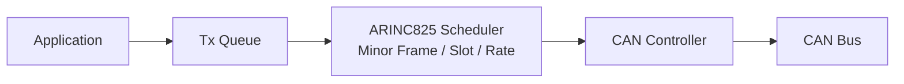

关键点：

> Application 不能想发几帧就立即全部塞给 CAN Controller。

## 4.9 心智模型

> **CAN Arbitration 决定“冲突发生以后谁赢”；Bandwidth Management 决定“系统设计上不要让冲突失控”。**

这是 ARINC 825 从“普通 CAN”迈向“可认证实时网络”的核心一步。

---

# Topic 5 — Health Status + Node Service：网络怎么知道设备活着，怎么管理设备？

## 5.1 属性

这里其实包含两个不同概念：

```text
Periodic Health Status -> 网络健康监视
Node Service            -> 节点管理 / RPC
```

都属于高层网络管理能力。

## 5.2 Periodic Health Status — 费曼解释

你部署了 20 个 LRU。

CAN 总线上某个节点突然 2 秒没说话。

问题是：

```text
它只是现在没业务数据？
还是 CPU 卡死？
还是 CAN Bus-Off？
还是它已经掉电？
```

所以系统需要一种标准化的周期健康报告。

这就是 PHSM（Periodic Health Status Message）。

较新的 ARINC 825 修订资料明确将 PHSM 纳入 interoperability/health 机制；实际 ARINC 825 产品也提供可配置 PHSM 发送速率。

## 5.3 TCP/IP 锚点

类似：

```text
Heartbeat
+ Link/Service Health
```

但不要把它简单当 TCP Keepalive。

TCP Keepalive 主要关心：

> 一个连接还在不在。

PHSM 更接近：

> 一个航空节点当前是否健康、其内部状态是否可接受。

### Health 时序

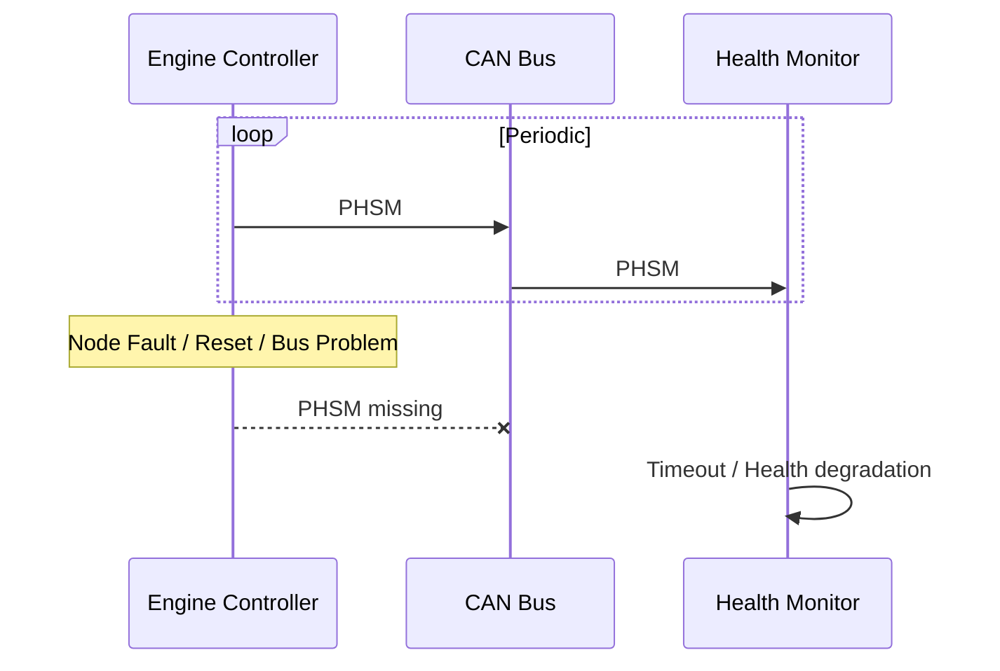

接收软件通常要维护：

```text
last_rx_time
health_state
timeout_threshold
error_counter
```

## 5.4 Node Service — 费曼解释

PHSM 是：

> “我主动告诉大家我活着。”

Node Service 是：

> “我明确找你，请你执行一个管理操作。”

例如维护计算机：

```text
“Engine Controller #2，你的软件版本是什么？”
```

Server 返回：

```text
“Version 3.4.1”
```

这已经明显是 RPC 思想。

## 5.5 Service Dispatcher

软件中推荐明确形成：

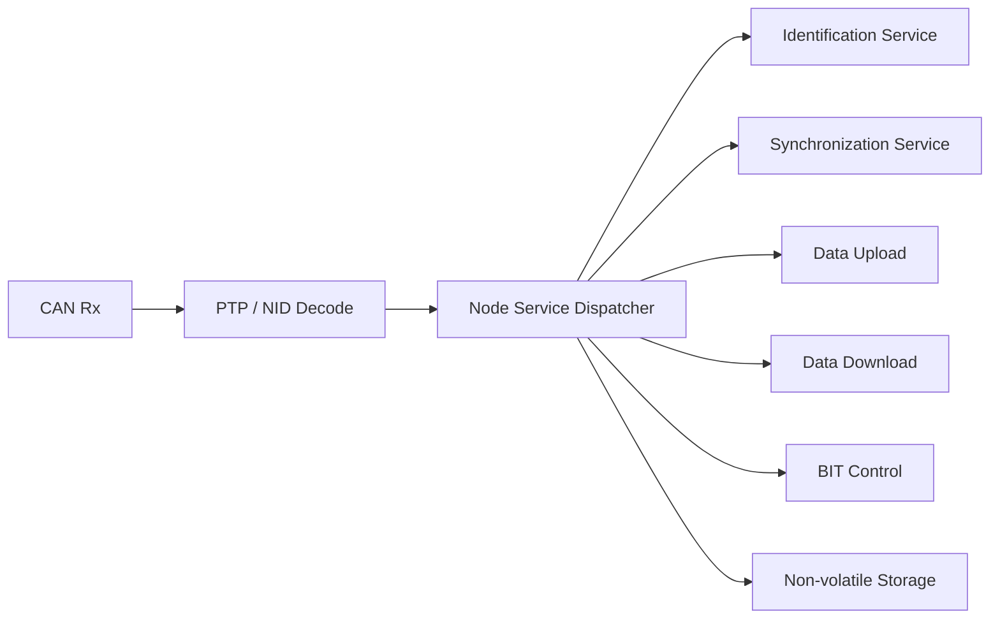

这和 TCP Server：

```text
socket -> port -> request handler
```

非常像。

## 5.6 为什么不能把 Health 和 Service 混成一个东西？

因为：

```text
Health:
周期发布
1 -> many
偏监控

Node Service:
按需请求
client -> server
偏控制/管理
```

## 5.7 心智模型

```text
PHSM = “我怎么样”

Node Service = “你帮我做什么”
```

---

# Topic 6 — CAN Error Handling：这里主要还是 CAN 数据链路层

## 6.1 属性

**属性：数据链路层 Fault Confinement。**

这一章主要是 CAN 本身，不是 ARINC 825 重新发明。

## 6.2 费曼解释

想象某个坏节点电气故障，开始不停制造错误。

如果总线没有故障隔离：

```text
一个坏节点
    ↓
不断 Error
    ↓
整条网络被拖死
```

CAN 的设计思想：

> **谁持续制造错误，谁逐步退出总线。**

所以有：

- Bit Error；
- Stuff Error；
- CRC Error；
- Form Error；
- ACK Error；
- TEC；
- REC；
- Error Active；
- Error Passive；
- Bus-Off。

## 6.3 TCP/IP 锚点

这不是 TCP Retransmission。

更接近：

```text
Ethernet MAC/PHY
+ NIC fault containment
```

因为它处理的是：

> 一跳 CAN Frame 是否正确完成。

## 6.4 状态演进

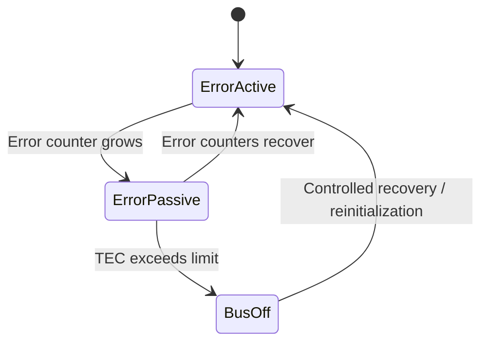

具体阈值属于 CAN 标准内容，协议栈应读取控制器状态而不是自己重新实现 CAN Error Counter。

## 6.5 在 ARINC 825 节点软件中的位置

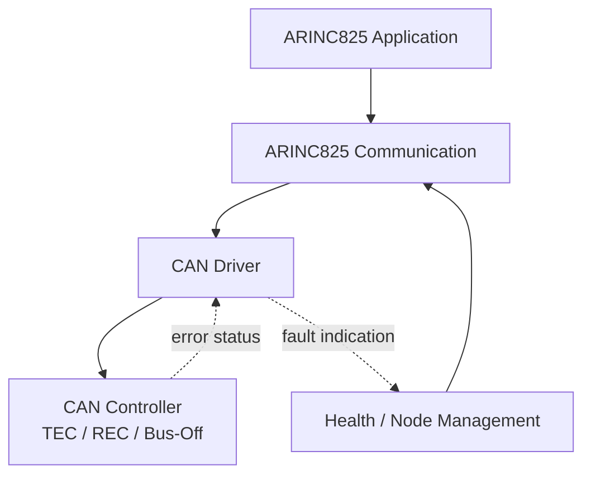

关键工程思想：

> CAN Controller 检测链路错误；ARINC 825 节点管理决定“这个错误对系统意味着什么”。

## 6.6 心智模型

```text
CAN Error Handling：
“这一帧在总线上有没有正确传完？”

ARINC 825 Health：
“这个节点现在是否仍能提供可信服务？”
```

---

# Topic 7 — High Integrity Protocol：CAN CRC 通过了，为什么还不够？

## 7.1 属性

**属性：端到端完整性保护（End-to-End Integrity）。**

这是高可靠通信主题。

它具有类似 Transport/E2E 层的一些能力，但不等于完整 TCP。

## 7.2 费曼解释

CAN CRC 保护的是：

```text
CAN Controller A
      ↓
   CAN Bus
      ↓
CAN Controller B
```

但是系统真正想保护的是：

```text
Application A
      ↓
Software / Driver / Buffer / CAN
      ↓
Application B
```

中间还有很多 CAN CRC 看不到的问题：

- 软件拿错了一块数据；
- 重复提交上一帧；
- 应用漏处理一帧；
- 接收端拿到旧帧；
- Identifier 与 Payload 组合不正确。

所以 ARINC 825 High Integrity 在应用可见数据中加入额外保护。

## 7.3 核心结构

公开 ARINC 825-4 研究资料中，高完整性消息包含：

```text
Payload Data
+ SNo
+ MIC
```

其中：

- SNo = Sequence Number；
- MIC = Message Integrity Check。

公开的 ARINC 825 High Integrity 资料显示 MIC 覆盖：

```text
CAN Identifier
+ Data Payload
+ Sequence Number
```

然后生成 16-bit MIC。

## 7.4 SNo 解决什么？

假设正常：

```text
100
101
102
103
```

接收：

```text
100
101
103
```

说明：

```text
102 missing
```

如果：

```text
100
101
101
102
```

说明：

```text
duplicate
```

因此 SNo 能发现 CAN CRC 发现不了的：

- Missing；
- Duplicate；
- Sequence anomaly。

## 7.5 MIC 解决什么？

普通 CRC 更像：

> “这个 CAN Frame 在线上是否被比特破坏。”

MIC 更像：

> “这个 Identifier + Payload + Sequence 的端到端组合是否仍然一致。”

## 7.6 接收流程

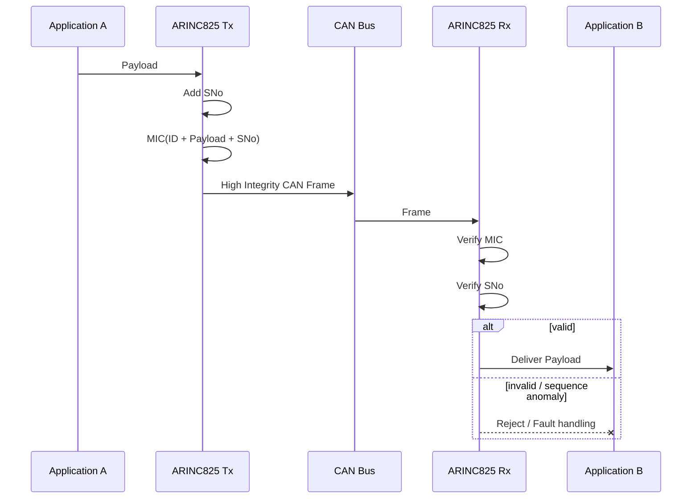

## 7.7 TCP/IP 锚点

最接近：

```text
TCP Sequence Number
+
Application E2E CRC
```

但 ARINC 825 High Integrity 的重点不是 TCP 那种流式可靠重传，而是：

> **检测端到端数据完整性异常。**

## 7.8 心智模型

> **CAN CRC 保护“链路帧”；High Integrity 保护“应用消息身份 + 内容 + 顺序”。**

---

# Topic 8 — Redundancy：双 CAN 不是“把同一帧发两遍”这么简单

## 8.1 属性

**属性：系统可靠性 / Fault Tolerance。**

## 8.2 费曼解释

飞机不能接受：

```text
CAN_H 一根线断
    ↓
整个功能失效
```

所以可能有：

```text
CAN A
CAN B
```

但双网马上产生新问题：

- 两路都正常时，收哪一路？
- 两路都有相同数据，怎么识别重复？
- 两路到达时间有 skew 怎么办？
- A 坏了什么时候切 B？
- A 恢复以后要不要切回来？
- 两路数据不一致时信谁？

所以 Redundancy 不是物理接两条线。

它是：

> **数据身份 + 通道身份 + 接收仲裁 + 故障切换策略。**

## 8.3 RCI

ARINC 825 Identifier 中定义了 Redundancy Channel Identifier（RCI）。

其目的：

> 接收者能够知道“这条消息来自哪个冗余通道/冗余源”。

公开经典资料描述最多可识别多个冗余来源。

## 8.4 双网组件图

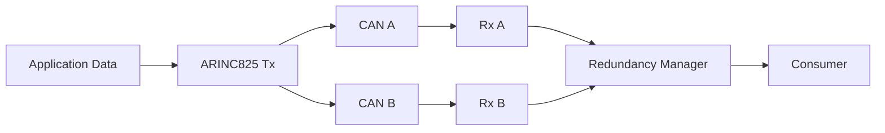

## 8.5 TCP/IP 锚点

最像：

```text
Dual NIC
+ Link Redundancy
+ Duplicate Elimination
+ Failover Manager
```

不是 TCP 自身能力。

## 8.6 冗余接收最核心的状态

```text
A valid, B valid  -> 按设计策略选择/去重
A valid, B failed -> A
A failed, B valid -> B
A failed, B failed -> Functional failure / degraded mode
```

实际系统还要考虑：

```text
skew
sequence
freshness
source identity
health
```

## 8.7 心智模型

> **RCI 告诉你“来自哪一路”；Redundancy Manager 决定“最终采用哪一路”。**

---

# Topic 9 — Gateway：ARINC 825 的“路由器”为什么又不完全是路由器？

## 9.1 属性

**属性：网络域互联 / Protocol Gateway。**

## 9.2 费曼解释

假设：

```text
Engine CAN
```

上的发动机转速，需要进入：

```text
ARINC 664 / AFDX
```

裸 CAN Frame 不可能直接穿进去。

因为两边不同：

- 地址体系；
- 带宽；
- MTU；
- 调度；
- 数据格式；
- 冗余；
- QoS。

所以中间需要 Gateway。

## 9.3 TCP/IP 锚点

IP Router 主要做：

```text
IP packet
   ↓
查路由
   ↓
继续转发 IP packet
```

ARINC 825 Gateway 往往需要做得更多：

```text
接收 CAN
↓
Filter
↓
解释 Identifier / Profile
↓
参数/消息 Mapping
↓
Buffer
↓
Rate Adaptation
↓
封装成另一网络格式
↓
发送
```

所以它更像：

> **Router + Protocol Converter + Traffic Shaper。**

## 9.4 跨网络组件图

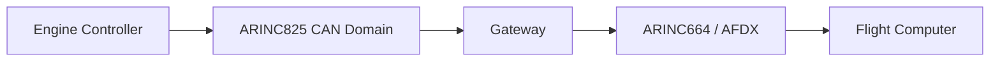

Gateway 内部：

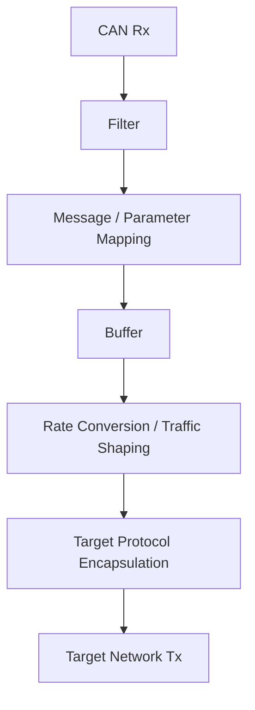

## 9.5 LCL 为什么重要？

ATM Identifier 中存在 Local（LCL）语义。

其目的之一就是：

> 告诉 Gateway 这条消息只属于本地 Bus Segment，不应继续跨域传播。

这和 IP 里的：

```text
scope / routing boundary
```

概念很接近。

## 9.6 为什么 Gateway 是后学主题？

因为 Gateway 同时依赖：

- Identifier；
- Profile；
- Payload；
- Bandwidth；
- Redundancy；
- Fault handling。

前面没懂，Gateway 只能学成“转发器”。

## 9.7 心智模型

> **Router 主要转包；ARINC 825 Gateway 经常需要“理解、映射、限速、转换、再发送”。**

---

# Topic 10 — CAN FD / Compliance：825-4 的后续工程入口

## 10.1 属性

**属性：协议演进 + 合规/验证。**

## 10.2 为什么放最后？

因为 CAN FD 改变：

- Payload 最大长度；
- Arbitration/Data phase；
- Bit Timing；
- Bus Load 计算；

但不会替你重新理解：

- ATM/PTP；
- Profile；
- Health；
- Node Service；
- High Integrity；
- Redundancy。

所以先把经典 ARINC 825 高层机制吃透，再进入 CAN FD。

## 10.3 ARINC 825-4 新增重点

SAE 对 ARINC 825-4 的官方描述明确：

- 纳入 CAN FD；
- 数据传输潜力最高约 4 Mbps；
- 增加 ARINC 825 Compliance；
- Configuration of Bit Timing；
- MIB Counters；
- CAN Bus Security Considerations。

因此工程上后续应继续学习：

```text
Classic CAN vs CAN FD
Bit Timing
MIB Counters
Conformance Test
Security Considerations
```

## 10.4 心智模型

> **CAN FD 是“更大的车和更快的路”；前面 1~9 Topic 决定的是“交通规则和系统管理”。**

---

# 11. 综合心智模型：ARINC 825 到底是一套什么东西？

## 11.1 一张总图

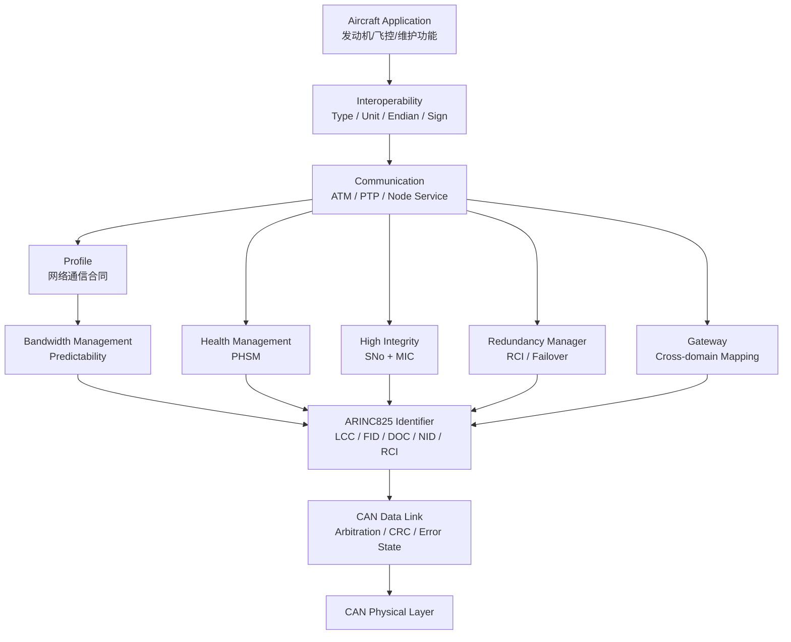

## 11.2 从一条数据看整个协议

发动机控制器产生：

```text
Engine Speed = 10000 rpm
```

完整过程：

```text
① Application
   产生 EngineSpeed

② Interoperability
   按 Profile 编码成 Big Endian 数据

③ Communication Profile
   查到：
   FID / DOC / LCC / Period / DLC

④ Bandwidth Manager
   判断当前 Minor Frame/Tx Slot 是否允许发送

⑤ Identifier Builder
   构造 ARINC825 29-bit Identifier

⑥ High Integrity（若该消息要求）
   加 SNo + MIC

⑦ CAN Controller
   仲裁 + CRC + 发送

⑧ Receiver CAN Controller
   Acceptance Filter

⑨ ARINC825 Decoder
   解析 LCC / FID / DOC

⑩ High Integrity Checker
   检查 MIC / SNo

⑪ Profile Decoder
   DATA -> 10000 rpm

⑫ Application
   使用参数
```

## 11.3 对照 TCP/IP 的最终映射

```text
TCP/IP 世界                         ARINC 825 世界

Ethernet PHY                 <->   CAN Physical Layer

Ethernet MAC                 <->   CAN Data Link

IP Address / Protocol        <->   LCC / FID / DOC / NID
                                   （仅认知类比，不是一一对应）

UDP Broadcast                <->   ATM

UDP/TCP Client-Server        <->   PTP / Node Service

Application Payload          <->   ARINC825 Interoperability

Service Config / ICD         <->   Communication Profile

QoS / Traffic Shaping        <->   Bandwidth Management

Heartbeat / Management       <->   PHSM / Node Service

E2E Protection               <->   High Integrity

Dual Network Failover        <->   Redundancy / RCI

Router + Protocol Gateway    <->   ARINC825 Gateway
```

## 11.4 最重要的三个认知升级

### 升级 1：ARINC 825 不是“29-bit ID 格式”

29-bit Identifier 只是入口。

真正复杂度在：

```text
数据语义
通信事务
调度
管理
完整性
冗余
```

### 升级 2：航空实时的核心词不是“快”，而是“可预测”

不是：

```text
平均 1 ms，很快。
```

而是：

```text
最坏情况下是否仍能证明不超过设计边界？
```

### 升级 3：单节点能通信，不等于网络设计完成

真正的 ARINC 825 工程对象是：

```text
整张网络
```

不是某一块 MCU。

---

# 12. 推荐的下一步学习顺序

你当前已经研究过 Identifier/寻址，因此建议按以下顺序继续：

```text
Lesson 1  Interoperability + Payload
Lesson 2  ATM / PTP / Node Service Transaction
Lesson 3  Communication Profile
Lesson 4  Bandwidth Management + Bus Load Calculation
Lesson 5  PHSM + Node State/Monitoring
Lesson 6  High Integrity Protocol
Lesson 7  Redundancy
Lesson 8  Gateway
Lesson 9  CAN FD + Compliance/Test
```

如果目标是“能够开发一个真实 ARINC 825 Node”，最关键的前三个工程模块是：

```text
1. Message Encode/Decode
2. Profile-driven Tx/Rx Table
3. Bandwidth Scheduler
```

然后再加：

```text
4. Node Service Dispatcher
5. PHSM
6. High Integrity Checker
7. Redundancy Manager
```

---

# 13. 研究资料与标准入口

## A. 正式标准基线

### ARINC 825-4 — SAE Mobilus
当前官方标准入口，页面标记 Current。

https://saemobilus.sae.org/standards/arinc825-4-825-4-general-standardization-controller-area-network-bus-protocol-airborne-use

重点对应：

```text
Physical Layer
Data Link Layer
CAN Communication
Periodic Health Status
Node Service Interface
Bandwidth Management
High Integrity Protocol
Gateway
Design Guidelines
CAN FD
Compliance
Bit Timing
MIB
Security
```

## B. 标准目录参考

### Intertek / ARINC 825:2015 TOC

https://www.intertekinform.com/en-au/standards/arinc-825-2015-98639_saig_arinc_arinc_207412/

用途：

> 用来验证 ARINC 825 核心章节结构，不作为最新版正文替代。

## C. 强烈推荐教程 1 — Airbus / CAN in Automation

### Ralph Knueppel, Airbus Operations — Standardization of CAN Networks for Airborne Use through ARINC 825

https://www.can-cia.org/fileadmin/cia/documents/proceedings/2012_knueppel.pdf

这篇是本教程最推荐的公开材料之一。

重点看：

```text
PTP / ATM
LCC
Hardware Acceptance Filtering
Interoperability
Profile
Predictability
Bandwidth Management
Minor Time Frame
50% bus-load design example
```

尤其适合你，因为原文直接拿 UDP/IP、TCP/IP 做 PTP 类比。

## D. 强烈推荐教程 2 — Stock Flight Systems / ICS / Wetzel

### ARINC825 Presentation

https://files.stockflightsystems.com/_5_Arinc_825/ARINC825_Presentation.pdf

重点看：

```text
p8   OSI layering
p9   LCC
p10  ATM Identifier
p11  PTP Identifier
p12  Payload Standardization
p13  Bandwidth Management
p14  Communication Profile
```

这份 PPT 非常适合作为 ARINC 825 第一份全局教程。

## E. ARINC 825 行业站点

### CAN Aviation Alliance

https://www.arinc-825.com/the-arinc825-standard/

用途：

- ARINC 825 定位；
- 标准历史；
- CAN 在飞机网络域中的角色；
- CAN 与 ARINC 664 的关系。

## F. High Integrity 深入

### Philip Koopman / CMU — ARINC 825 MIC Excerpts

https://users.ece.cmu.edu/~koopman/lectures/2013_faa_crc.pdf

重点：

```text
High Integrity Message
SNo
MIC
MIC coverage
CRC polynomial discussion
```

### McGill — A825-HWIL / ARINC-825-4 analysis

https://escholarship.mcgill.ca/downloads/x059cd56x

重点：

```text
ARINC825-4 Identifier
High Integrity Message
SNo
MIC
Security analysis
```

## G. 工程实现参考

### Hargrave ARINC 825-4 Device Protocol

https://docs.hargravetechnologies.com/hargrave-arinc-protocol-1-1

价值：

> 看一个实际产品怎样使用 ARINC 825-4、Big Endian、Node Addressing，而不是只读标准。

### SmartDV ARINC 825 Verification IP

https://www.smart-dv.com/vip/arinc_825.html

价值：

> 查看 Node Service 实际需要覆盖哪些服务，以及 ARINC 825 验证关注哪些错误状态/事务。

## H. 带宽管理辅助教程

https://mil-std-1553.jp/825_p05.html

价值：

- Frame Length；
- Bus Load；
- Minor/Major Frame；
- Transmission Slot；
- 具体带宽计算示例。

说明：

> 这是非官方二次整理网站，只适合辅助理解；发生冲突时以正式 ARINC 825 版本为准。

---

# 14. 本教程与现有“29-bit 寻址笔记”的衔接

你已有的寻址笔记已经建立了：

- 广播 vs P2P；
- DOC；
- Source；
- Acceptance Filter；
- 接收端按字段分流；

这些思路可以保留。

但后续继续写代码前，建议先把 Identifier 定义按 **项目使用的 ARINC 825 Supplement** 重新核对一次，尤其是：

```text
LCC 宽度
LCC channel assignment
FID
DOC
SID/NID
SMT
LCL
PVT
RCI
```

原因是公开标准资料表明，经典 ARINC 825 Identifier 与“独立 Priority + 4-bit LCC”的模型并不一致。

从这里以后，学习重点应从：

```text
“怎么拆 ID”
```

迁移到：

```text
“一个 Message 如何从系统定义 -> 调度 -> 发送 -> 验证 -> 消费”
```

这才是下一阶段的主线。
