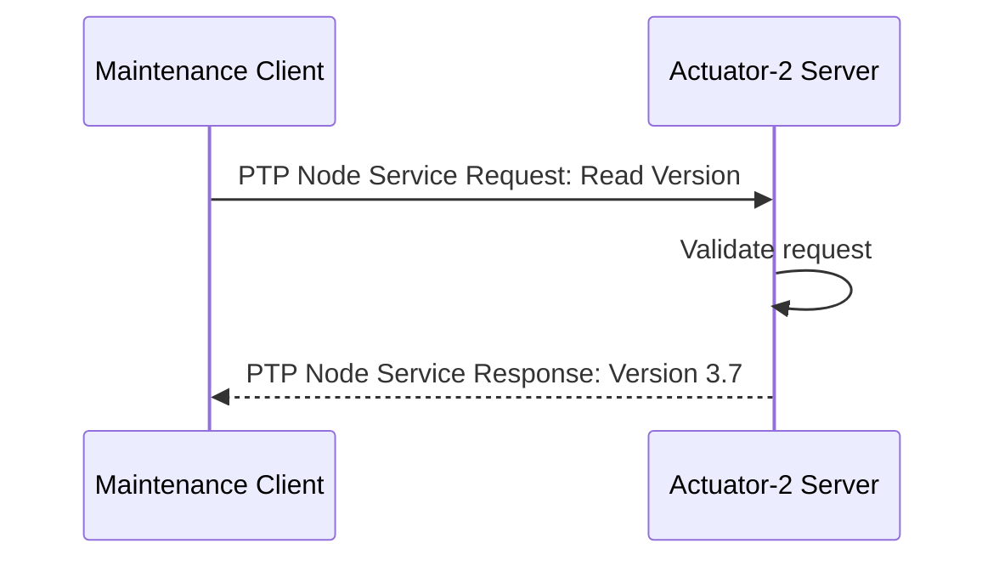
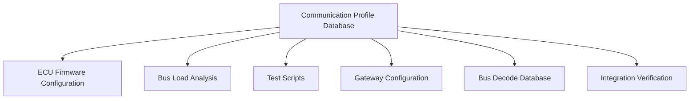
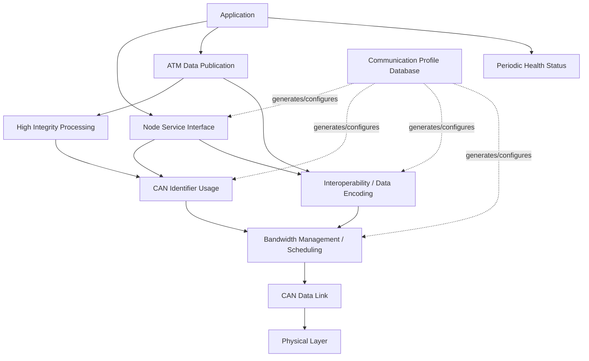

# 从一帧裸 CAN 到一套 ARINC 825 风格协议：CAN 高层协议设计实战教程

> 目标：不是背 ARINC 825 条款，而是亲手经历“一套 CAN 高层协议为什么会长成这样”的全过程。
>
> 主线：我们作为系统协议设计者，从只有 CAN 控制器和 `can_send(id, data, len)` 开始，逐步设计出一套可用于航电系统的协议。每出现一个真实工程问题，就新增一个协议机制；最终这些机制与 ARINC 825 的标准模块一一对应，并与 CANopen 做对照。

---

## 0. 项目场景：老板只给你一句话——“用 CAN 把这 5 个设备连起来”

我们要设计一条机载设备 CAN 网络，先不考虑具体飞机型号，只定义 5 类节点：

- **Sensor-A / Sensor-B**：两套冗余传感器，周期发布测量数据；
- **Controller**：控制计算机，接收 Sensor 数据并执行控制算法；
- **Actuator**：执行机构控制器，接收控制命令并反馈状态；
- **Maintenance Terminal**：维护设备，需要读取节点版本、参数、故障记录；
- **Gateway**：未来把该 CAN 网段中的部分数据转发到另一网络域。

系统工程师给我们的通信需求如下：

| 业务 | 通信关系 | 周期/触发 | 时限 | 特点 |
|---|---|---:|---:|---|
| Sensor 测量值 | Sensor → Controller/其他监听者 | 20 ms | < 10 ms | 周期、广播 |
| Actuator 状态 | Actuator → Controller | 50 ms | < 20 ms | 周期、广播 |
| 严重故障 | 任意节点 → 全网 | 事件触发 | 尽可能快 | 最高优先级 |
| 节点健康状态 | 每个节点 → 全网 | 1 s | 宽松 | 在线/故障监视 |
| 读取软件版本 | Maintenance → 指定节点 | 按需 | 100 ms 级 | 点对点请求/响应 |
| 修改配置参数 | Maintenance → 指定节点 | 按需 | 100 ms 级 | 点对点、有确认 |
| 大块维护数据 | Maintenance ↔ 指定节点 | 按需 | 秒级 | 可能超过 8 Byte |
| 关键控制数据 | Controller → Actuator | 20 ms | 严格 | 需要系统级完整性保护 |

项目先选择经典 CAN：

- CAN 2.0B Extended Frame；
- 29-bit Identifier；
- 500 kbit/s；
- 单帧最多 8 Byte 数据。

这里的 `500 kbit/s` 是本教程项目选择，不代表 ARINC 825 只支持该速率。ARINC 825-4 已扩展支持 CAN FD。

现在我们开始真正“造协议”。

---

# 第一阶段：我们已经有 CAN，为什么还需要一套协议？

## 1. 第一天：先让两个 MCU 发通一帧

Controller 写：

```c
uint8_t data[8] = {0x01, 0xF4, 0, 0, 0, 0, 0, 0};
can_send(0x123, data, 8);
```

Sensor/Controller 两端 CAN 控制器都工作正常，示波器也能看到正确差分波形。

你此时已经拥有 CAN 提供的核心能力：

1. 帧格式；
2. CRC；
3. ACK；
4. 位仲裁；
5. 错误检测；
6. 自动重发；
7. Error Active / Error Passive / Bus-Off 等错误约束机制。

也就是说，**帧可以可靠地在共享总线上被传过去**。

但 Controller 的软件工程师马上问：

> `0x123` 是谁定义的？
>
> `0x01F4` 是 500 rpm、50.0 °C，还是软件版本 1.500？
>
> 为什么这个报文比另一个报文优先？
>
> 这个报文是发给我的，还是所有节点都应该接收？
>
> 节点掉线以后我怎么知道？
>
> 如果数据超过 8 Byte 怎么办？

这就是设计 CAN 高层协议的起点。

Kvaser 对 Higher Layer Protocol 的概括非常直接：裸 CAN 不定义节点地址、大于单帧数据的传输、通信建立、数据内容解释、系统启动行为等。这些必须由更高层协议补齐。

### 本阶段产出模块

**模块名称：Physical Layer / Data Link Layer**

**核心功能：**

- Physical Layer：线缆、终端、电气特性、收发器、速率和位时序；
- Data Link Layer：CAN 帧、仲裁、CRC、ACK、错误处理、节点错误状态。

ARINC 825 对应标准章节就是 `PHYSICAL LAYER` 和 `DATA LINK LAYER`。

### 这一阶段的心智模型

> CAN 解决的是：**“一小帧数据怎样可靠地抢到总线并送到所有节点。”**
>
> 高层协议要解决的是：**“这帧是谁的、给谁、是什么、什么时候发、出了问题怎么办。”**

---

# 第二阶段：先不要设计字段，先给系统里的“通信行为”分类

## 2. 第二天：第一个错误设计——所有报文都用广播

我们最容易想到的第一版协议是：

```text
CAN ID 0x100 = Sensor 测量值
CAN ID 0x101 = Actuator 状态
CAN ID 0x102 = 软件版本
CAN ID 0x103 = 参数设置
...
```

所有节点看到自己关心的 ID 就处理。

周期数据非常舒服：

```text
Sensor-A ---- measurement ----> everyone
Sensor-B ---- measurement ----> everyone
Actuator ---- status ---------> everyone
```

这正是 CAN 天生擅长的广播模型。

但维护终端要执行：

> “读取 Actuator-2 的软件版本。”

问题出现了。

如果 `0x102 = READ_VERSION`，那么所有节点都会收到。我们不得不在 payload 再加：

```text
Byte0 = target_node
Byte1 = command
...
```

于是我们意识到：系统实际上存在两类完全不同的通信：

### 类型 A：一个生产者，多个消费者

例如：

```text
Sensor-A --> Air Data --> Controller
                      --> Display
                      --> Recorder
```

发送者只关心“我发布了什么数据”，不应该为每个接收节点单独发送一次。

### 类型 B：一个客户端，明确访问一个服务器

例如：

```text
Maintenance --> Actuator-2 : Read Version
Actuator-2  --> Maintenance : Version = 3.7
```

这里必须能够唯一定位某个服务节点。

ARINC 825 正好把两种模式正式定义为：

- **Anyone-to-Many (ATM)**：一对多；
- **Peer-to-Peer (PTP)**：点对点。

于是我们的协议不再是“一堆随便分配的 CAN ID”，而是先有**通信模型**。

### 我们把业务重新分类

| 业务 | 模型 | 原因 |
|---|---|---|
| 周期测量数据 | ATM | 多个节点可能同时消费 |
| 执行器状态 | ATM | 状态是发布型信息 |
| 严重故障 | ATM | 所有节点都应该立即知道 |
| 周期健康状态 | ATM | 网络监控节点统一监听 |
| 读软件版本 | PTP | 明确访问指定服务器 |
| 参数读写 | PTP | 明确访问指定服务器 |
| 数据下载 | PTP | 客户端/服务器事务 |

### 本阶段产出模块

**模块名称：CAN Communication / Communication Concept**

**核心功能：**

- 定义 ATM 与 PTP 两种通信关系；
- 决定哪些业务属于发布/订阅式数据流；
- 决定哪些业务属于 client/server 服务访问；
- 为后续 Identifier 设计提供语义基础。

### CANopen 对照

CANopen 也遇到了完全相同的问题，但解决方式不同：

- 实时过程数据：**PDO**；
- 参数/对象访问：**SDO**；
- 网络控制：**NMT**。

所以不要记“ARINC 825 有 ATM/PTP，CANopen 有 PDO/SDO”这几个名词。

真正应该记住的是：

> 一个完整 CAN 高层协议，通常必须区分 **实时数据流** 与 **服务/配置事务**。

---

# 第三阶段：CAN ID 不能只是编号，它必须成为协议头

## 3. 第三天：我们第一次被 CAN 仲裁机制反咬一口

假设第一版 ID 是：

```text
0x01000100  Sensor 数据
0x00000100  Maintenance log
```

CAN 仲裁规则是：**Identifier 数值越小，优先级越高。**

结果维护日志正在疯狂上传时，竟然不断抢赢实时测量数据。

这说明 CAN ID 同时承担两个角色：

1. 报文身份；
2. 仲裁优先级。

如果 ID 随便分配，协议的实时性就是随机的。

于是我们必须设计一套 **Identifier Architecture**。

ARINC 825 的做法不是简单地说“0x100~0x1FF 是实时消息”，而是在 29-bit Identifier 内直接编码通信语义。

---

## 4. 先设计 Logical Communication Channel：把优先级变成“业务类别”

ARINC 825 定义 Logical Communication Channel（LCC），高位直接参与仲裁。

经典的 LCC 分配为：

| LCC | 名称 | 通信类型 | 用途 | 相对优先级 |
|---:|---|---|---|---|
| 0 | EEC — Exception Event Channel | ATM | 异常/紧急事件 | 最高 |
| 1 | Reserved | - | 保留 | |
| 2 | NOC — Normal Operation Channel | ATM | 正常运行数据 | |
| 3 | Reserved | - | 保留 | |
| 4 | NSC — Node Service Channel | PTP | 节点服务 | |
| 5 | UDC — User-Defined Channel | ATM/PTP | 用户定义 | |
| 6 | TMC — Test and Maintenance Channel | PTP | 测试维护 | |
| 7 | FMC — CAN Base Frame Migration Channel | ATM/PTP | 迁移/兼容 | 最低 |

现在我们的业务自然落位：

```text
严重故障            -> EEC
Sensor 周期测量     -> NOC
Actuator 状态       -> NOC
节点服务            -> NSC
维护诊断            -> TMC
```

一个非常关键的设计原则出现了：

> **先按业务实时性/重要性分类，再设计 CAN ID；不能先拍 ID，再解释优先级。**

---

## 5. ATM Identifier：我们需要回答“谁发布了什么”

对周期测量值而言，我们真正需要的信息是：

```text
这是哪一类业务？
谁发布的？
发布的数据对象是什么？
是否只允许停留在本地网段？
是否为私有定义？
来自哪个冗余通道？
```

ARINC 825 的 ATM Identifier 因而具有类似下面的语义结构：

```text
+-----+------------+-----+-----+-----+--------------+-----+
| LCC | Source FID | ... | LCL | PVT |     DOC      | RCI |
+-----+------------+-----+-----+-----+--------------+-----+
```

其中：

- **LCC**：Logical Communication Channel；
- **Source FID**：发送源所属 Aircraft Function；
- **LCL**：Local，仅本地网络域使用；
- **PVT**：Private，私有数据定义；
- **DOC**：Data Object Code，指出 payload 表示哪个数据对象；
- **RCI**：Redundancy Channel Identifier，区分冗余来源。

注：不同 ARINC 825 Supplement 的公开资料中，中间一位会看到 `RSD` 或功能状态相关定义；工程实现必须以项目购买并冻结的 ARINC 825 revision 为准，不能拿旧版培训图直接当最新版位定义。

### 用我们的项目实际设计一条消息

需求：Sensor-A 每 20 ms 发布 AirData。

协议设计记录写成：

```text
Communication Type : ATM
LCC                : NOC
Source FID         : Sensor 所属标准 Function ID
DOC                : AIR_DATA_MEASUREMENT 对应 DOC
LCL                : 根据是否允许 Gateway 转发决定
PVT                : 0（若采用标准化对象）
RCI                : Sensor-A 对应冗余通道
Period             : 20 ms
DLC                : 8
```

注意：我们不是先得到一个十六进制 ID；我们先得到**语义字段**，最后工具再组合成 29-bit CAN ID。

这就是协议设计和“写死一堆宏”的区别。

---

## 6. PTP Identifier：我们需要回答“哪个客户端正在访问哪个服务器”

Maintenance Terminal 想访问 Actuator-2。

ATM 的 `Source FID + DOC` 不够，因为它只能说明“谁发布了什么”，不能唯一说明“我要找哪个具体节点”。

ARINC 825 的 PTP Identifier 因而使用 client/server 语义，公开资料中可看到如下字段结构：

```text
+-----+------------+-----+-----+-----+------------+-----+-----+
| LCC | Client FID | SMT | LCL | PVT | Server FID | SID | RCI |
+-----+------------+-----+-----+-----+------------+-----+-----+
```

核心不是死记字段，而是理解它解决的问题：

- `Client FID`：请求从哪类功能发起；
- `Server FID + SID + RCI`：唯一定位服务端节点/服务实例；
- `SMT`：Service Message Type；
- `LCC`：决定它属于 Node Service、Maintenance 等哪类业务。

于是：

```text
Maintenance Terminal
      |
      | PTP request: Read Software Version
      v
Actuator-2
      |
      | PTP response: Version 3.7
      v
Maintenance Terminal
```

### 本阶段产出模块

**模块名称：CAN Identifier Usage**

**核心功能：**

- 把 CAN Identifier 从“编号”提升成协议头；
- 编码业务优先级；
- 区分 ATM/PTP；
- 标识 Function、Data Object、Node/Server；
- 支持 Local/Private/Redundancy 等系统级属性；
- 让硬件 Acceptance Filter 能按协议语义过滤。

### CANopen 对照

CANopen 不是采用 ARINC 825 这种 `LCC/FID/DOC` Identifier 语义体系，而是通过标准 COB-ID 范围、Node-ID、Function Code，以及 PDO/SDO/NMT 等通信对象组织 CAN ID。

共同本质仍然是：

> **CAN ID 分配必须同时解决寻址、消息类型和仲裁优先级。**

---

# 第四阶段：ID 定义完了，payload 仍然可能“鸡同鸭讲”

## 7. 第四天：两个团队都说“温度是 100”，但一个认为是 100°C，另一个认为是 10.0°C

Sensor 团队定义：

```c
uint16_t temperature;   // 0.1 degC
```

Controller 团队却按：

```c
uint16_t temperature;   // 1 degC
```

CAN 帧完全正确，CRC 完全正确，程序也没有越界，但系统行为错了 10 倍。

这是一类非常重要的协议错误：

> **通信正确，但语义错误。**

因此协议必须定义 payload 的表示方式。

ARINC 825 在 `Interoperability` 中强调的正是这一层，包括公开资料中列出的：

- Endian；
- 数据类型；
- 工程单位；
- 轴系；
- 符号约定；
- Function/Data Object 的一致解释。

公开 ARINC 825 资料明确指出其使用 Big Endian，并定义数据类型、工程单位及航空轴系/符号约定。

---

## 8. 为我们的 AirData 消息做真正的“协议数据定义”

这里做一个**教学用项目对象**，不是声称它对应 ARINC 825 官方某个 DOC 数值：

```text
AIR_DATA_MEASUREMENT
DLC = 8
Byte Order = Big Endian

Byte 0..1 : airspeed
             uint16
             resolution = 0.1 unit

Byte 2..3 : pressure
             uint16
             resolution = project-defined

Byte 4..5 : temperature
             int16
             resolution = 0.1 degC

Byte 6    : validity/status
Byte 7    : reserved
```

然后规定：

```text
physical_value = raw * resolution + offset
```

再规定 invalid / unavailable / out-of-range 时怎么表达。

至此，一条消息终于完整到可以跨团队实现：

```text
谁发             -> Source FID
发什么           -> DOC
优先级           -> LCC
冗余来源         -> RCI
payload 字节布局 -> Data Definition
字节序           -> Big Endian
量纲/缩放        -> Engineering Unit / Scaling
发送周期         -> Communication Profile
```

### 本阶段产出模块

**模块名称：Interoperability**

**核心功能：**

- 统一数据类型；
- 统一字节序；
- 统一工程单位、比例和偏移；
- 统一轴系和符号；
- 确保不同供应商 LRU 对同一个 Data Object 得到相同物理意义。

### CANopen 对照：Object Dictionary 为什么这么重要

CANopen 选择了更强的“对象模型”路线。

CANopen 中所有参数/数据围绕 **Object Dictionary (OD)** 组织：

```text
Index : Sub-index -> Object
```

然后：

- PDO 把 OD 中的实时对象映射到 CAN 帧；
- SDO 按 Index/Sub-index 访问对象；
- EDS/DCF 描述设备对象和配置。

所以：

```text
ARINC 825：FID + DOC + Communication Profile + 数据标准化
CANopen  ：Object Dictionary + PDO/SDO Mapping + EDS/DCF
```

两者结构不同，但都在解决同一问题：

> **必须有一个正式的数据模型，否则 CAN 帧只有字节，没有工程语义。**

---

# 第五阶段：现在能通信了，但系统不知道“节点还活着没有”

## 9. 第五天：Controller 发现 200 ms 没收到 Sensor 数据，它该怎么判断？

可能性至少有：

1. Sensor 死机；
2. Sensor 主循环还活着，但采集任务死锁；
3. Sensor 主动停止发布；
4. CAN Bus-Off；
5. 数据无效，所以应用层禁止发送；
6. 总线拥塞导致延迟；
7. 接收节点过滤配置错误。

单纯做：

```c
if (now - last_rx > 100ms)
    sensor_dead = true;
```

只能判断“没有收到该消息”，不能判断节点整体状态。

因此网络需要一种统一的节点健康声明机制。

ARINC 825 对应标准模块就是：

**Periodic Health Status**。

我们的协议规定：每个节点周期发布 Health Status。

逻辑类似：

```text
Sensor-A ------ PHSM ------> Network Monitor
Sensor-B ------ PHSM ------> Network Monitor
Controller ---- PHSM ------> Network Monitor
Actuator ------ PHSM ------> Network Monitor
```

监控方建立：

```text
last_health[node]
health_state[node]
communication_state[node]
```

于是“业务消息超时”和“节点死亡”成为两种不同故障。

### 本阶段产出模块

**模块名称：Periodic Health Status**

**核心功能：**

- 周期报告节点健康/网络质量状态；
- 支持节点存活检测；
- 支持故障定位；
- 给维护、BIT、网络管理提供统一状态入口。

### CANopen 对照

CANopen 对应思路主要在 Error Control / Heartbeat：节点周期发送 heartbeat，消费者据此监控 NMT 状态和在线情况；另外还有 Emergency (EMCY) 用于异常事件。

这里第一次可以形成跨协议抽象：

```text
ARINC 825 PHSM       ┐
CANopen Heartbeat    ├──> Node Health / Liveness Monitoring
其他协议 Keepalive  ┘
```

---

# 第六阶段：状态广播解决不了“我要命令某一个节点做一件事”

## 10. 第六天：维护终端开始真正使用网络

维护工程师提出：

```text
1. 查询 Actuator-2 软件版本
2. 查询序列号
3. 读取故障记录
4. 执行 BIT
5. 修改某个维护参数
6. 下载一块数据
```

这些都不适合设计成永久周期广播。

如果每增加一个命令就再定义一对 CAN ID：

```text
READ_VERSION_REQ
READ_VERSION_RESP
READ_SERIAL_REQ
READ_SERIAL_RESP
RUN_BIT_REQ
RUN_BIT_RESP
...
```

很快 ID 空间和代码都会失控。

我们需要的不是“更多报文”，而是**服务机制**。

ARINC 825 对应标准模块：

**Node Service Interface**。

ARINC 825 的 PTP 机制就是为此服务。公开资料明确说明其 Node Service 支持 client/server interaction，并支持 connectionless 和 connection-oriented 两类交互。

### 设计一个服务调用流程



现在应用程序接口不再是：

```c
send_can_id(0x18xxxxxx, data);
```

而应该上升成：

```c
node_service_request(server_nid,
                     service,
                     request,
                     &response);
```

底层协议栈负责：

```text
service API
   ↓
PTP addressing
   ↓
ARINC 825 identifier construction
   ↓
CAN frame
```

这就是协议“栈”的第一次真正形成。

### 本阶段产出模块

**模块名称：Node Service Interface**

**核心功能：**

- 点对点节点寻址；
- client/server 服务；
- 请求/响应；
- connectionless service；
- connection-oriented service；
- 支撑 interrogation、maintenance、data load、time synchronization 等系统服务。

### CANopen 对照

这一层最容易类比 CANopen：

```text
ARINC 825 Node Service  <----功能类比----> CANopen SDO
```

但不能说两者协议格式相同。

CANopen SDO 的核心语义是：通过 OD 的 Index/Sub-index 访问对象。

ARINC 825 Node Service 的核心语义是：通过 PTP 和 Node ID 定位服务器并执行节点服务。

---

# 第七阶段：8 Byte 不够用了——什么时候必须出现 Transport Protocol？

## 11. 第七天：维护工程师要读取 512 Byte 故障记录

经典 CAN 一帧只有 8 Byte。

现在我们必须回答：

```text
512 Byte 怎么拆？
每片怎么编号？
丢了一片怎么办？
接收缓存满怎么办？
什么时候算整个事务结束？
超时怎么办？
```

这就是为什么很多 CAN 高层协议最终都会出现**分段/重组/传输控制**。

J1939 的 Transport Protocol、ISO-TP、CANopen SDO segmented/block transfer，都是这种问题被逼出来的结果。

ARINC 825 Node Service 提供 connection-oriented/connectionless 服务基础，并可承载数据下载等应用；具体项目如果要设计自己的大块数据传输机制，则必须在所选标准能力范围内明确：

- segmentation；
- sequence；
- reassembly；
- acknowledgment；
- timeout；
- flow control；
- abort/recovery。

这里有一个很重要的“通用协议设计判断”：

> **Transport/Segmentation 不是每套 CAN 应用层协议都必须有。**
>
> 如果系统永远只有 ≤8 Byte 的发布型信号，它完全可以没有独立 Transport Protocol。
>
> 一旦出现大块数据、固件下载、日志、复杂配置事务，这一层就从“可选”变成“必要”。

### CANopen 对照

CANopen 把这件事整合进 SDO 协议族，包括 expedited、segmented、block 等传输方式。

因此通用抽象不是“所有协议必须有 SDO”，而是：

**Transport / Segmentation & Reassembly（按需求出现）**。

---

# 第八阶段：功能全了，但 20 个节点一上总线系统开始抖

## 12. 第八天：实验室 3 个节点正常，整机 20 个节点后延迟突然变差

每个团队都说：

```text
我的数据很重要，我 10 ms 发一次。
```

最后得到：

```text
Node1  : 10 ms
Node2  : 10 ms
Node3  : 10 ms
...
Node20 : 10 ms
```

CAN 是共享总线，所有帧串行发送。

于是出现：

- 总线负载上升；
- 低优先级帧不断等待；
- 同周期消息在周期边界同时爆发；
- arbitration jitter 增大；
- 最坏响应时间失控。

这时再优化 C 代码没有意义，因为问题已经是**网络调度问题**。

ARINC 825 对应标准模块：

**Bandwidth Management**。

公开的 ARINC 825 技术资料明确指出，其带宽管理概念通过计算网络段上的消息负载、调整传输率，并减少 peak load 和由仲裁造成的 jitter，使网络行为可预测。

---

## 13. 我们真正做一次总线预算

最粗的第一步是为每类消息建立通信矩阵：

| Message | DLC | Period | Priority/LCC | Producer |
|---|---:|---:|---|---|
| AirData-A | 8 | 20 ms | NOC | Sensor-A |
| AirData-B | 8 | 20 ms | NOC | Sensor-B |
| ActuatorStatus | 8 | 50 ms | NOC | Actuator |
| Health-A | 8 | 1000 ms | status | Sensor-A |
| Health-B | 8 | 1000 ms | status | Sensor-B |
| Health-Actuator | 8 | 1000 ms | status | Actuator |
| Emergency | 8 | aperiodic | EEC | any |

对于周期消息，粗略负载思想是：

```text
Utilization ≈ Σ(frame transmission time / period)
```

真正工程分析还必须考虑：

- CAN bit stuffing；
- frame overhead；
- arbitration blocking；
- error/retransmission reserve；
- aperiodic traffic；
- gateway burst；
- 最坏情况下多个周期源同时释放。

然后我们发现 AirData-A 与 AirData-B 都在 `t=0,20,40... ms` 发，Actuator 又在 `t=0,50...` 发。

于是给周期消息安排相位：

```text
Sensor-A : 0, 20, 40, 60 ...
Sensor-B : 5, 25, 45, 65 ...
Actuator : 10, 60, 110 ...
```

目的不是让 CAN 变成纯 TDMA，而是**避免人为制造同步峰值**。

### 本阶段产出模块

**模块名称：Bandwidth Management**

**核心功能：**

- 总线负载预算；
- 消息周期设计；
- 优先级设计；
- peak load 控制；
- arbitration jitter 控制；
- 最坏时延分析；
- 为系统确定性提供证据。

### CANopen 对照

CANopen 有 SYNC、同步 PDO、event timer、inhibit time 等机制，但 CANopen 本身的网络调度哲学与 ARINC 825 面向航电确定性分析的 Bandwidth Management 并不完全相同。

真正应该迁移的知识是：

> **任何共享总线协议只要进入实时系统，都必须从“报文定义”升级到“流量工程”。**

---

# 第九阶段：CAN 自带 CRC，为什么安全关键数据还要再保护？

## 14. 第九天：一次“合法 CAN 帧”也可能是错误的应用数据

CAN CRC 能发现很多传输位错误，但系统级风险还包括：

- 旧帧被重复使用；
- 某帧丢失但接收端没有意识到；
- 顺序错误；
- 软件把错误 buffer 当成当前数据；
- gateway/软件路径导致数据关联错误。

也就是说：

> CAN CRC 保护的是 **CAN 帧传输正确性**，不等于保护 **端到端应用数据的新鲜性和序列完整性**。

ARINC 825 因而提供：

**High Integrity Protocol**。

公开研究资料显示 High Integrity Message 会在 payload 中增加序列号以及独立的 Message Integrity Check，用于增强接收端对丢失、重复等问题的检测。

### 我们的 Controller → Actuator 关键控制数据

普通设计：

```text
[command data]
```

高完整性思路：

```text
[command data] [sequence] [integrity check]
```

接收端不再只做：

```c
if (can_crc_ok)
    accept();
```

而是：

```text
CAN hardware validity
        ↓
identifier/source validity
        ↓
sequence/freshness check
        ↓
end-to-end integrity check
        ↓
application plausibility check
        ↓
accept
```

### 本阶段产出模块

**模块名称：High Integrity Protocol**

**核心功能：**

- 提高端到端数据完整性；
- 检测丢失/重复/顺序异常；
- 给安全关键通信增加应用级保护。

### 通用抽象注意

这个模块不能直接放进“所有总线协议都必须具备”的列表。

它属于：

**Safety / End-to-End Integrity（按系统安全需求启用）**。

---

# 第十阶段：有两套 Sensor，协议怎样知道它们其实代表同一个功能？

## 15. 第十天：冗余不是复制两根线这么简单

Sensor-A 与 Sensor-B 都发布 AirData。

Controller 必须知道：

```text
这两个值属于同一数据功能的不同冗余来源，
而不是两个完全不同的参数。
```

ARINC 825 在 Identifier 中提供 **RCI — Redundancy Channel Identifier**。

因此协议语义变成：

```text
Source Function = Air Data
DOC             = AirDataMeasurement
RCI             = channel A / channel B
```

Controller 才能建立：

```text
same logical data object
    ├── source redundancy A
    └── source redundancy B
```

随后应用层才能做 source selection、cross-check、failover。

### 本阶段产出

ARINC 825 中冗余设计同时出现在 Identifier 机制、Design Guidelines 和 Gateway Redundancy Management 等部分。

**核心功能：**

- 标识冗余来源；
- 避免把冗余源误认为不同数据对象；
- 支持系统级故障切换与网关冗余管理。

### 通用抽象注意

Redundancy / Fault Tolerance 也是**系统需求驱动的扩展功能**，不是最小总线协议必需组件。

---

# 第十一阶段：第二条 CAN 网出现以后，我们第一次碰到“网络层问题”

## 16. 第十一天：Gateway 不是 `rx -> tx` 就完了

现在系统增加 CAN-B：

```text
CAN-A                  CAN-B
Sensor ----\           /---- Recorder
Controller --- Gateway ----- Display
Actuator ---/           \---- Other LRU
```

最幼稚的 gateway：

```c
while (1) {
    canA_recv(&f);
    canB_send(&f);
}
```

很快出现问题：

1. 哪些消息允许跨域？
2. Local 数据怎么办？
3. 两侧速率不同怎么办？
4. 高速一侧 burst 会不会淹没低速一侧？
5. 是否需要改 Identifier？
6. 数据对象是否需要协议转换？
7. Gateway 故障会不会传播？
8. 两个冗余 Gateway 会不会重复转发？

于是 gateway 从“驱动转发函数”变成了独立网络设计问题。

ARINC 825 标准专门设置：

**CAN Gateway Considerations**

包括公开目录中的：

- Gateway Model；
- Primary Gateway Functions；
- Gateway Resources；
- Data Transfer via a Gateway；
- Gateway Redundancy Management。

### 本阶段产出模块

**模块名称：CAN Gateway Considerations**

**核心功能：**

- 网络域之间转发；
- filter；
- protocol/data conversion；
- buffering；
- bandwidth adaptation；
- fault isolation；
- redundancy management。

### 通用抽象

只有多网段/多协议系统才必须有：

**Gateway / Routing / Interworking**。

单 CAN 总线系统不应为了“架构完整”硬塞一个 Gateway 模块。

---

# 第十二阶段：协议终于能跑，但系统集成工程师问了一句致命问题

## 17. 第十二天：“把整条总线上会出现的所有消息给我。”

我们现在有：

- ATM；
- PTP；
- LCC；
- FID；
- DOC；
- Node ID；
- payload 数据定义；
- 周期；
- deadline；
- health；
- node service；
- high integrity；
- redundancy；
- gateway。

但这些定义散落在：

```text
Sensor team Excel
Controller header file
Actuator Word document
Gateway config
Maintenance software source code
```

此时虽然“协议功能齐全”，整个系统仍然不可集成。

因为系统工程师无法回答：

```text
29-bit ID 是否冲突？
DOC 是否重复？
两个供应商的 scale 是否一致？
总线总负载到底多少？
某个节点到底订阅哪些消息？
某条消息是否允许 Gateway 转发？
测试工具怎样自动解码？
```

因此协议最终需要一个**机器可读的网络契约**。

ARINC 825 的答案是：

**Communication Profile Database**。

公开 ARINC 825 技术资料明确说明 Communication Profile 用于描述整个网络流量，可用于网络规范、分析、验证以及测试工具解码。

---

## 18. Communication Profile 应该记录什么？

从工程角度，一条 message record 至少应该让工具知道：

```text
Message Name
Producer
Communication Type (ATM/PTP)
CAN Identifier fields
LCC
FID
DOC / Node identification
DLC
Payload layout
Data type
Unit / scale / offset
Period / refresh rate
Latency requirement
Redundancy channel
Local/private property
High integrity property
Consumer(s)
Gateway behavior
```

于是它不再是“文档”，而成为系统的 Single Source of Truth：



这一步对你以后设计任何总线协议都极其重要。

很多私有 CAN 协议最终失败，不是因为帧格式差，而是因为没有一个可治理的通信数据库。

### CANopen 对照

CANopen 世界中与此强相关的是：

- Object Dictionary；
- EDS；
- DCF；
- PDO mapping/configuration。

两边都在走向同一个工程终点：

> **协议不仅要能运行，还必须能被工具描述、配置、分析、验证。**

### 本阶段产出模块

**模块名称：Communication Profile Database**

**核心功能：**

- 全网通信定义；
- 接口契约；
- 配置基线；
- 总线负载分析输入；
- 测试与集成输入；
- 工具自动解码；
- 变更影响分析。

---

# 第十三阶段：最后不是“联调成功”，而是证明协议实现一致

## 19. 第十三天：供应商 A、B 都说“我支持 ARINC 825”

真正接起来却可能：

- 位时序不同；
- Identifier 字段解释不同；
- reserved bit 使用错误；
- payload endian 不同；
- health 行为不同；
- timeout 不同；
- gateway filter 不同。

所以最后一个工程阶段必须是：

**Compliance / Conformance / Integration Verification**。

ARINC 825-4 明确增加了 ARINC 825 Compliance 相关附录，同时规范中长期存在设计 checklist、通信 profile 示例等工程化内容。

测试至少分三层：

```text
CAN conformance
    ↓
ARINC 825 protocol conformance
    ↓
Project Communication Profile conformance
```

### 验收测试例子

1. 发一个合法 NOC ATM message，检查所有 subscriber 正确解析；
2. 改错 DOC，确认不被错误消费；
3. 断开 Sensor，检查 PHSM/timeout 处理；
4. 制造大量低优先级报文，验证 EEC 最大延迟；
5. 重复 High Integrity message，确认 sequence 检查拒绝；
6. PTP 访问错误 NID，确认目标节点不响应；
7. Gateway 对 LCL message 不转发；
8. Communication Profile 与抓包实际流量做自动比对。

---

# 第十四阶段：回头看——我们实际上“造”出了哪些软件模块？

如果现在在 MCU 上真正实现协议栈，我会建议把软件结构按协议职责拆成下面这样。

注意：下面左栏优先使用 ARINC 825 的标准功能名称；右栏是工程软件职责，不是随意给协议创造新标准术语。

| ARINC 825 标准功能 | 软件中承担的核心职责 |
|---|---|
| Physical Layer | CAN transceiver/bit timing/hardware config |
| Data Link Layer | CAN driver/controller state/error/bus-off |
| Communication Concept | ATM/PTP communication selection |
| CAN Identifier Usage | LCC/FID/DOC/NID/RCI 编解码与过滤 |
| Interoperability | payload serialization/deserialization/data conversion |
| Periodic Health Status | PHSM generation/monitoring/timeouts |
| Node Service Interface | PTP client/server service state machine |
| Bandwidth Management | periodic scheduling/traffic budget/timing constraints |
| High Integrity Protocol | sequence/integrity generation and verification |
| CAN Gateway Considerations | filtering/routing/buffering/domain conversion |
| Communication Profile Database | network configuration and generated tables |
| Compliance | protocol validation/integration tests |

软件调用关系可以理解为：



这里 `ATM Data Publication`、`Scheduling` 是软件实现职责描述，不是声称 ARINC 825 标准存在同名章节。

---

# 第十五阶段：ARINC 825 与 CANopen 到底哪里一样、哪里不同？

不要按名词比较，按“设计问题”比较。

| 设计问题 | ARINC 825 | CANopen |
|---|---|---|
| 底层承载 | CAN / CAN FD（当前 ARINC825-4 包含 CAN FD） | CAN，CANopen FD 有扩展规范 |
| 实时过程数据 | ATM + DOC/FID/LCC | PDO |
| 点对点参数/服务访问 | PTP + Node Service | SDO |
| 数据模型 | Data Object + Interoperability + Communication Profile | Object Dictionary |
| 节点寻址 | FID/SID/NID 等 | Node-ID + COB-ID 规则 |
| 网络控制 | 分散在 Node Service、health、设计机制中 | NMT 是明确核心机制 |
| 节点存活 | Periodic Health Status | Heartbeat / Error Control |
| 异常 | EEC/健康状态等机制 | EMCY |
| 实时调度 | LCC priority + Bandwidth Management | PDO transmission types、SYNC 等 |
| 冗余 | RCI、Redundancy Management | CiA 301 核心并不以航空冗余模型为中心 |
| Gateway | ARINC 825 专门给出系统性考虑 | CANopen 可有 gateway，但不是 CiA 301 的同等中心主题 |
| 工程配置描述 | Communication Profile Database | EDS/DCF + OD configuration |
| 设计哲学 | 航电网络系统级互操作、确定性、维护、冗余/完整性 | 设备对象模型、标准化设备通信与配置 |

最值得记住的是：

```text
ARINC 825 更像：
“怎样把 CAN 变成一张可集成、可分析、可维护的航空网络。”

CANopen 更像：
“怎样把 CAN 设备抽象成标准对象，并通过标准通信对象访问这些对象。”
```

---

# 第十六阶段：把 ARINC 825 剥掉以后，任何“总线协议”一般由什么组成？

这一章才是你最终要带走的心智模型。

不是所有协议都必须有 ARINC 825 的 PHSM、RCI、High Integrity Protocol，也不是所有协议都必须有 CANopen 的 PDO、SDO、Object Dictionary。

这些都是**具体标准对一般问题给出的具体答案**。

真正通用的是下面这些“问题域”。

---

## 20. 通用总线协议的核心模块

### 20.1 Physical / Media Access 基础

解决：

```text
电怎么传？
线怎么接？
速率多少？
多个节点怎样共享介质？
```

典型内容：

- physical signaling；
- topology；
- bit timing；
- media access/arbitration。

如果底座已经采用 CAN、Ethernet、RS-485，这部分通常大量继承底层标准，而不是自己重造。

---

### 20.2 Framing & Link Reliability

解决：

```text
一帧从哪里开始/结束？
怎么检测损坏？
怎么确认？
链路故障怎么约束？
```

典型内容：

- frame format；
- CRC/checksum；
- ACK；
- retransmission；
- link error state。

CAN 已经提供大量这类能力。

---

### 20.3 Naming / Addressing / Identifier Architecture

解决：

```text
谁在讲话？
发给谁？
这是什么消息？
优先级是什么？
```

典型内容：

- node address；
- function address；
- message/object identifier；
- priority/QoS encoding；
- multicast/broadcast identity。

ARINC 825：LCC/FID/DOC/NID/RCI。
CANopen：COB-ID/Function Code/Node-ID。
J1939：Priority/PGN/Source Address。

这是几乎所有高层总线协议的**核心必选模块**。

---

### 20.4 Communication Model / Service Model

解决：

```text
数据是广播发布？
请求/响应？
命令/确认？
client/server？
producer/consumer？
```

典型模型：

- publish/subscribe；
- producer/consumer；
- request/response；
- client/server；
- event notification。

ARINC 825：ATM/PTP。
CANopen：PDO/SDO/NMT 等通信对象。

这是**核心必选模块**。

---

### 20.5 Data Model / Serialization / Representation

解决：

```text
payload 中每一位是什么？
字节序是什么？
单位是什么？
scale/offset 是什么？
数据是否合法？
```

典型内容：

- data types；
- serialization；
- endian；
- unit；
- scaling；
- enum/state definitions；
- object/parameter definitions。

这是**核心必选模块**。

没有它，协议只是“把 byte 搬来搬去”。

---

### 20.6 Transport / Segmentation & Reassembly

解决：

```text
一条业务消息大于底层最大帧怎么办？
怎样分片？
怎样重组？
如何流控、超时和重传？
```

典型内容：

- segmentation；
- sequence number；
- reassembly；
- flow control；
- timeout；
- retransmission；
- abort。

这是**条件必选模块**：只有业务存在大数据或可靠事务时才需要。

---

### 20.7 Timing / Scheduling / QoS / Bandwidth Management

解决：

```text
什么时候发？
多久必须到？
谁可以先发？
总线会不会过载？
```

典型内容：

- periodic/event transmission；
- priority；
- deadline；
- bandwidth budget；
- synchronization；
- jitter control；
- worst-case latency。

实时系统中通常属于**核心模块**；非实时低负载系统可以简化。

---

### 20.8 Node / Network Management

解决：

```text
节点怎样启动？
什么时候允许进入正常通信？
如何复位？
如何切状态？
```

典型内容：

- initialization；
- state machine；
- start/stop/reset；
- discovery/configuration；
- operating state control。

CANopen 的 NMT 是典型实现。

ARINC 825 并不是照搬 CANopen NMT，而通过自己的 node service、health 和系统设计机制完成相应系统能力。

---

### 20.9 Diagnostics / Health / Error Management

解决：

```text
节点还活着吗？
它健康吗？
发生了什么故障？
通信错误如何上报？
```

典型内容：

- heartbeat/health status；
- emergency/event；
- diagnostic counters；
- timeout supervision；
- fault code；
- error recovery policy。

实际产品网络通常需要，是**高频核心模块**。

---

### 20.10 Configuration / Profile / Schema

解决：

```text
整张网的协议定义放在哪里？
工具怎么知道每条消息？
不同供应商怎样保持一致？
```

典型内容：

- communication matrix；
- profile/database；
- EDS/DCF/DBC/XML/schema；
- generated configuration；
- version control。

这是产品化总线非常重要但常被私有协议忽略的模块。

---

## 21. 按需求出现的扩展模块

这些不要错误地总结成“所有总线必备”。

### Gateway / Routing / Interworking

多网段、多协议、跨域才需要。

### Redundancy / Fault Tolerance

高可靠、双通道、多设备冗余才需要。

### Safety / End-to-End Integrity

安全关键数据才需要额外序号、freshness、E2E CRC/MIC 等。

### Security

存在恶意节点、非可信接入、联网威胁模型时，需要 authentication、authorization、integrity、anti-replay、key management 等。

### Time Synchronization

分布式同步采样、控制、日志时间关联等场景才成为核心需求。

### Conformance / Compatibility / Versioning

产品化、跨供应商、长期演进系统中必须认真设计。

---

# 22. 最终心智模型：以后拿到任何一套 CAN 高层协议，先问这 12 个问题

不要先背报文格式。

按下面顺序问：

```text
1. 底层承载是什么？
   CAN / CAN FD / RS-485 / Ethernet ...

2. 一个通信实体怎样被标识？
   Node-ID / FID / Address ...

3. 一个业务数据怎样被标识？
   DOC / PGN / Object Index / Message ID ...

4. 通信关系是什么？
   broadcast / pub-sub / P2P / client-server ...

5. payload 怎么解释？
   type / endian / unit / scaling / validity ...

6. 超过单帧怎么办？
   segmentation / transport / flow control ...

7. 实时性怎么保证？
   priority / period / schedule / bandwidth ...

8. 节点生命周期怎么管？
   init / operational / reset / stop ...

9. 怎么知道节点和网络是否健康？
   heartbeat / PHSM / diagnostics / timeout ...

10. 安全或完整性要求怎么实现？
    E2E / redundancy / security ...

11. 多网段怎么互联？
    gateway / routing / conversion ...

12. 整套定义怎么被机器和团队共同管理？
    profile / database / schema / conformance ...
```

只要这 12 个问题能回答，你基本就抓住了一套总线协议的骨架。

---

# 23. 用一句话重新理解 ARINC 825

ARINC 825 不是“CAN 加几个特殊字段”。

它更接近下面这个过程的标准答案：

```text
裸 CAN
  ↓
定义航空网络的物理/链路约束
  ↓
定义 ATM/PTP 通信模型
  ↓
把 29-bit ID 结构化为 LCC/FID/DOC/NID/RCI 等语义
  ↓
统一数据表示，保证供应商互操作
  ↓
增加 Health 与 Node Service
  ↓
进行 Bandwidth Management，证明确定性
  ↓
按安全需要加入 High Integrity
  ↓
解决冗余与 Gateway
  ↓
用 Communication Profile Database 管理整张网络
  ↓
做 Compliance / Integration Verification
```

这才是“设计一套 CAN 高层协议”的完整工程过程。

---

# 24. 需求审核

## 审核 1：是否以“设计 CAN 协议的过程”为主线？

**PASS。** 从第一条裸 CAN 帧开始，每个新模块都由上一阶段暴露出的真实工程问题引出，而不是按标准目录平铺。

## 审核 2：是否说明每个模块为什么必须存在？

**PASS。** 每一阶段都有明确的 failure/problem → design decision → standard function → module output 因果链。

## 审核 3：模块名称是否尽量采用标准术语，而非随意命名？

**PASS。** 主体使用 ARINC 825 标准目录中的 Physical Layer、Data Link Layer、Communication Concept、CAN Identifier Usage、Interoperability、Periodic Health Status、Node Service Interface、Bandwidth Management、High Integrity Protocol、CAN Gateway Considerations、Communication Profile Database 等名称。软件结构中额外术语明确标记为“实现职责”，没有冒充 ARINC 825 标准模块。

## 审核 4：是否贴合 ARINC 825，同时对比 CANopen？

**PASS。** 每个关键设计问题都解释 ARINC 825 的方案，并用 CANopen PDO/SDO/NMT/Heartbeat/Object Dictionary/EDS 等做功能对照，而不是硬套协议格式。

## 审核 5：最终总结是否抽象成“一般总线协议”而非 ARINC 825 特殊模块？

**PASS。** 最终通用模型使用 Naming/Addressing、Communication Model、Data Representation、Transport、Timing/QoS、Node Management、Diagnostics、Configuration/Profile 等一般功能域；High Integrity、Redundancy、Gateway、Security 等被明确标为按需求启用的扩展，而不是强行列为所有协议必备。

## 审核 6：是否符合 CAN 高层协议设计的一般工程认知？

**PASS。** Kvaser 对 HLP 的总结指出 CAN 本身不负责地址、启动行为、大于单帧的数据传输、数据内容解释和系统状态；CANopen CiA 301 明确定义 Object Dictionary、SDO、PDO、NMT、特殊功能和错误控制；J1939 进一步展示了 Identifier/PGN、Transport Protocol、Network Layer、Application Parameters 这些典型功能域。最终抽象与这些成熟 CAN HLP 的共同结构一致。

---

# 25. 参考资料

1. SAE / ARINC825-4 — General Standardization of CAN Bus Protocol for Airborne Use, status: Current. 825-4 includes CAN FD and additional appendices on compliance, bit timing, MIB counters and CAN bus security considerations.  
   https://saemobilus.sae.org/standards/arinc825-4-825-4-general-standardization-controller-area-network-bus-protocol-airborne-use

2. ARINC 825:2015 public table of contents, showing Physical Layer, Data Link Layer, CAN Communication, Communication Concept, CAN Identifier Usage, Interoperability, Periodic Health Status, Node Service Interface, Bandwidth Management, High Integrity Protocol, Gateway Considerations, Design Guidelines, Communication Profile Database.  
   https://shop.standards.ie/en-ie/standards/arinc-825-2015-98639_saig_arinc_arinc_207412/

3. CAN in Automation — CANopen / CiA 301. Official scope includes data types, encoding rules, Object Dictionary, communication services/protocols and network management; CANopen protocols include SDO, PDO, NMT, special function and error control protocols.  
   https://www.can-cia.org/can-knowledge/canopen

4. CAN in Automation — Technical documents, including CiA 301 and CiA 306 Electronic Data Sheet.  
   https://www.can-cia.org/cia-groups/technical-documents

5. Kvaser — CAN Protocol Tutorial / Higher Layer Protocols. Explains that bare CAN does not define flow control, long data transfer, node addressing, communication establishment, startup behavior or payload interpretation.  
   https://kvaser.com/about-can/can-education/

6. Kvaser — J1939 Standards Overview. Useful cross-check for general CAN HLP architecture: identifier semantics, PGN, transport protocol, network layer and application parameter definitions.  
   https://kvaser.com/about-can/higher-layer-protocols/j1939-standards-overview/

7. Stock Flight Systems / Innovative Control Systems — ARINC825 General Standardization presentation. Public technical material covering LCC, ATM/PTP identifier structures, data standardization, bandwidth management and Communication Profile.  
   https://files.stockflightsystems.com/_5_Arinc_825/ARINC825_Presentation.pdf

8. CiA International CAN Conference paper — ARINC 825 overview, covering ATM/PTP, Node Service Mechanism, health/error concepts and standardized higher-layer protocol design.  
   https://www.can-cia.org/fileadmin/cia/documents/proceedings/2012_knueppel.pdf

---

## 最后一条学习建议

下一步不要继续“读完整 ARINC 825 标准”。

最有效的方式是拿本教程中的 5 节点场景，真正做一个最小协议实现：

```text
V0：裸 CAN + NOC ATM 周期数据
V1：加入结构化 Identifier
V2：加入数据定义与 Communication Profile
V3：加入 PHSM
V4：加入 PTP Node Service
V5：加入 Bandwidth Analysis
V6：加入 High Integrity / Redundancy（可选）
```

每增加一个版本，你都会亲手感受到“为什么标准里会有这个东西”。那时再读 ARINC 825 条款，标准就不再是一堆名词，而是在回答你已经遇到过的问题。
