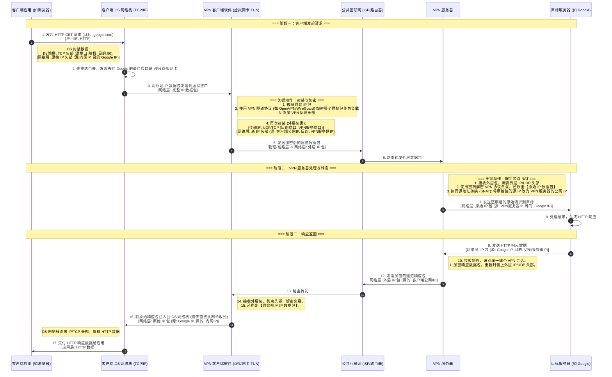
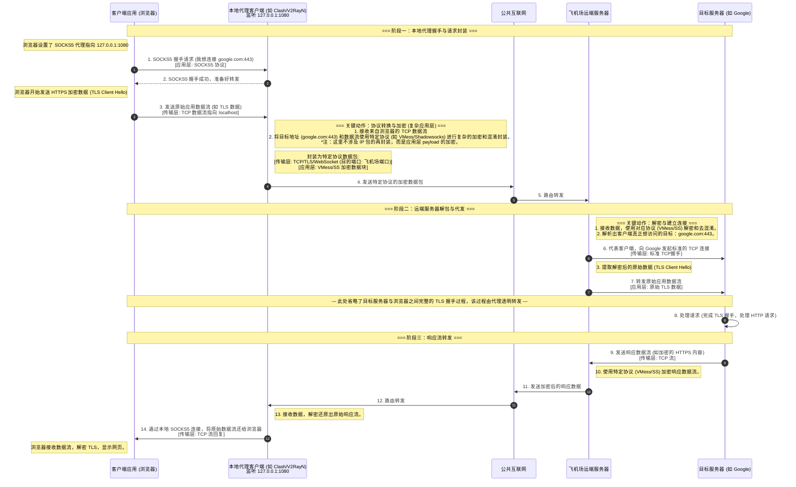

这是一个非常好的提问。要深刻理解网络通信，区分 VPN (Virtual Private Network) 和 “飞机场” (通常指代基于 Shadowsocks, V2Ray, Trojan 等技术的代理服务) 的工作原理至关重要。

它们最大的区别在于工作的网络层级不同：

- **VPN** 通常工作在 **OSI L3 (网络层)**，它封装的是完整的 IP 数据包。对应用程序几乎是透明的。
    
- **飞机场 (代理)** 通常工作在 **OSI L4 (传输层) 或 L7 (应用层)**，它代理的是 TCP/UDP 数据流。通常需要应用程序支持代理设置 (如 SOCKS5/HTTP 代理)。
    

下面我将分别用详细的 Mermaid 时序图展示这两种过程。

---

### 一、 VPN 通信过程 (以最常见的 L3 TUN 模式为例)

在这个场景中，VPN 客户端在操作系统中创建了一个虚拟网卡 (TUN接口)。操作系统路由表被修改，使得目标流量被路由到这个虚拟网卡，从而被 VPN 软件截获。

**核心特点：** “包裹中的包裹”。原始 IP 数据包被整个加密，然后放入一个新的 IP 数据包中发送。

代码段

---

### 二、“飞机场”通信过程 (代理模式，以 V2Ray/Shadowsocks 为例)

在这个场景中，客户端应用程序必须知道代理的存在 (或者通过透明代理技术强制重定向)。浏览器通常连接到本地的一个 SOCKS5 或 HTTP 代理端口 (例如 `127.0.0.1:1080`)。

**核心特点：** 不是封装 IP 包，而是“接力” TCP/UDP 数据流。本地代理客户端将应用层数据用特定的混淆/加密协议 (如 VMess, SS AEAD) 包装后发送给远程服务器，远程服务器解包后再发起真正的连接。

代码段

### 总结两个图的主要区别：

1. **处理对象：**
    
    - **VPN 图** 处理的是 **IP 数据包 (网络层)**。VPN 客户端是一个虚拟的“路由器”。
        
    - **飞机场图** 处理的是 **TCP/UDP 数据流 (传输层/应用层)**。本地代理是一个“中转站”。
        
2. **OS 参与度：**
    
    - **VPN** 深度依赖 OS 的网络栈和路由表来截获流量。
        
    - **飞机场** 通常只需应用程序指向本地端口即可 (除非使用 TUN 模式/透明代理技术将代理模拟成 VPN 的行为)。
        
3. **封装方式：**
    
    - **VPN** 是 IP over IP (或 IP over UDP)。
        
    - **飞机场** 是 App Data over Proxy Protocol (如 VMess) over TCP/TLS。
        

希望这两个详细的流程图能帮助你透彻理解这两种常见通信方式的区别。