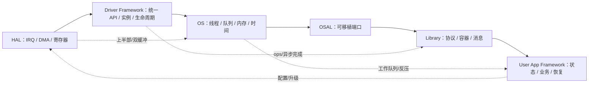

# 嵌入式代码模型学习地图

> [!abstract] 这套笔记解决什么问题
> 目标不是背诵 GoF 模式，而是看到工程问题时，能迅速认出它属于哪一种“约束组合”，然后拿出已经验证过的代码骨架。

## 1. 先记住这一条主线

嵌入式软件的模型，归根结底都在回答六个问题：

1. **谁拥有状态？** —— 状态机、主动对象、封装句柄。
2. **谁有权执行？** —— ISR/线程分层、工作队列、事件循环。
3. **数据放在哪里？** —— 环形缓冲、固定块池、双缓冲、侵入式容器。
4. **数据满了怎么办？** —— 有界队列、反压、丢弃/覆盖/降级策略。
5. **失败和断电怎么办？** —— 截止时间、退避、看门狗、提交记录、A/B 回滚。
6. **硬件或 OS 换了怎么办？** —— ops 函数表、端口/适配器、OSAL、静态注册表。

如果一个模型不能明确回答这些问题中的至少一个，它大概率只是代码写法，不是值得迁移的工程模型。

## 2. 排序方法

优先级是工程判断，不是网络热度统计：

- **P0 高频**：绝大多数 MCU/RTOS 项目都会直接用到，建议先形成肌肉记忆。
- **P1 常用**：中等以上规模、异步 I/O、通信/UI/多驱动项目很常见。
- **P2 进阶**：在高吞吐、复杂框架、可靠升级或读多写少并发中价值很高。

排序同时考虑四个因素：出现频率、跨层复用性、出错代价、学习收益。已有的“软件定时器”和“SPSC”不重复展开；本套笔记会在它们的上层继续讲超时策略、反压和工作调度。

## 3. 模型总表

| 顺序 | 优先级 | 模型 | 首要层次 | 一句话识别信号 | 教程 |
|---:|:---:|---|---|---|---|
| 1 | P0 | 有限状态机 FSM | App/Driver | `if` 嵌套开始描述“当前处于什么阶段” | [[01-控制流与状态模型#模型 1：有限状态机（FSM）]] |
| 2 | P0 | ISR 上半部 + 延后工作下半部 | HAL/OS | 中断里出现循环、解析、日志或阻塞调用 | [[02-并发时间与可靠性模型#模型 5：ISR 上半部 + 延后工作下半部]] |
| 3 | P0 | 有界队列 + 反压策略 | OS/App | 生产速度可能超过消费速度 | [[02-并发时间与可靠性模型#模型 6：有界队列 + 明确反压]] |
| 4 | P0 | 环形缓冲 | HAL/Driver | 连续字节流需要跨 ISR/线程暂存 | [[03-数据内存与所有权模型#模型 9：环形缓冲]] |
| 5 | P0 | 固定大小对象池 | OS/Library | 动态对象很多但类型/尺寸有限，不能接受碎片 | [[03-数据内存与所有权模型#模型 10：固定大小对象池]] |
| 6 | P0 | 驱动 ops/vtable + 实例上下文 | HAL/Driver | 同一类外设有多个芯片/实例，业务不应知道寄存器 | [[04-HAL与驱动框架模型#模型 14：ops 函数表 + 实例上下文]] |
| 7 | P0 | 截止时间 + 有界重试 + 退避抖动 | Driver/App | 外设/链路可能暂时失败，但不能永远等 | [[02-并发时间与可靠性模型#模型 7：截止时间 + 有界重试 + 退避抖动]] |
| 8 | P0 | OSAL 端口/适配器 + 不透明句柄 | OSAL/Library | 库要跨 FreeRTOS、ThreadX、Zephyr 或裸机 | [[05-OSAL库与应用框架模型#模型 18：OSAL 端口/适配器 + 不透明句柄]] |
| 9 | P1 | 事件循环 / run-to-completion | OS/App | 许多小事件需要串行修改同一份状态 | [[01-控制流与状态模型#模型 2：事件循环与 Run-to-Completion]] |
| 10 | P1 | 表驱动分派 | Driver/Library | `switch(opcode)` 很长且扩展频繁 | [[01-控制流与状态模型#模型 3：表驱动分派]] |
| 11 | P1 | 层次状态机 HSM | App | 多个状态重复处理超时、错误、停止事件 | [[01-控制流与状态模型#模型 4：层次状态机（HSM）]] |
| 12 | P1 | 零拷贝所有权 + 引用计数 | Driver/Stack | DMA/协议栈异步持有缓冲，复制成本高 | [[03-数据内存与所有权模型#模型 11：零拷贝所有权 + 引用计数]] |
| 13 | P1 | Ping-Pong 双缓冲 | HAL/DSP | DMA 采集和 CPU 处理必须重叠 | [[03-数据内存与所有权模型#模型 12：Ping-Pong 双缓冲]] |
| 14 | P1 | 静态注册表 + 分阶段初始化 | Driver/Framework | 驱动/命令很多，不想维护中心大表 | [[04-HAL与驱动框架模型#模型 15：静态注册表 + 分阶段初始化]] |
| 15 | P1 | 异步命令 + 完成事件 | Driver/OS | 启动 I/O 后结果稍后由 IRQ/DMA 返回 | [[04-HAL与驱动框架模型#模型 16：异步命令 + 完成事件]] |
| 16 | P1 | 观察者 / 发布订阅 | Library/App | 生产者不应知道所有消费者 | [[05-OSAL库与应用框架模型#模型 19：观察者 / 发布订阅]] |
| 17 | P1 | 任务心跳 + 总闸看门狗 | OS/App | 只喂硬件狗会掩盖单任务卡死 | [[02-并发时间与可靠性模型#模型 8：任务心跳 + 总闸看门狗]] |
| 18 | P1 | 断电安全提交记录 | Storage/App | 写配置时随时可能掉电 | [[06-持久化与升级模型#模型 21：断电安全提交记录]] |
| 19 | P1 | A/B 候选 + 确认/回滚 | Boot/App | 新固件/配置必须先试运行再永久生效 | [[06-持久化与升级模型#模型 22：A/B 候选 + 确认/回滚]] |
| 20 | P2 | 读多写少一致快照（sequence counter） | HAL/OS | 读者不能阻塞，多个字段必须来自同一版本 | [[03-数据内存与所有权模型#模型 13：读多写少一致快照]] |
| 21 | P2 | 侵入式容器 | OS/Library | 对象要进入多个队列且不能额外分配节点 | [[04-HAL与驱动框架模型#模型 17：侵入式容器]] |
| 22 | P2 | 主动对象 / 消息路由 | App/Framework | 模块应独占状态，只通过消息交互 | [[05-OSAL库与应用框架模型#模型 20：主动对象 / 消息路由]] |

## 4. 按知识栈阅读

- HAL / Driver 工程师：先读 [[04-HAL与驱动框架模型]]，再读 [[03-数据内存与所有权模型]]。
- RTOS / OSAL 工程师：先读 [[02-并发时间与可靠性模型]]，再读 [[05-OSAL库与应用框架模型]]。
- 协议栈 / Library 工程师：先读零拷贝、表驱动、OSAL、消息路由。
- App / 产品固件工程师：先读 [[01-控制流与状态模型]]、看门狗，再读 [[06-持久化与升级模型]]。

## 5. 每篇教程统一结构

每个模型必须包含：

- 第一性原理：从不可消除的约束推出结构；
- 费曼解释：能讲给刚入门的工程师听；
- 适用/不适用边界；
- 核心不变量与失败策略；
- 必要的 Mermaid 核心场景图；
- 最小 C Demo；
- 源码仓库或优秀教程的具体 URL；
- 逐项自检。

总体验收结果见 [[99-来源与逐模型验收矩阵]]。

## 6. 学习方法：不要“读完”，要做四次迁移

每学一个模型，按下面四问手写一次：

1. **删掉它会坏在哪里？** 先找到它消除的根因。
2. **不变量是什么？** 例如“写数据先于发布 head”“只有最后一个引用者释放”。
3. **过载怎么办？** 满、超时、掉电、重入时必须有显式策略。
4. **换平台还剩什么？** 把寄存器、RTOS API 拿掉后剩下的就是可迁移模型。

> [!tip] 推荐练习顺序
> 先把 Demo 在 PC 上跑通；再把时间、队列或临界区替换成目标 RTOS；最后注入队列满、掉电、重复事件和超时，观察不变量是否仍成立。

## 7. 源码阅读入口

- [Zephyr 主仓库](https://github.com/zephyrproject-rtos/zephyr)
- [FreeRTOS Kernel](https://github.com/FreeRTOS/FreeRTOS-Kernel)
- [Linux Kernel](https://github.com/torvalds/linux)
- [CMSIS 6](https://github.com/ARM-software/CMSIS_6)
- [CMSIS-Driver 实现](https://github.com/ARM-software/CMSIS-Driver)
- [lwIP](https://github.com/lwip-tcpip/lwip)
- [QP/C](https://github.com/QuantumLeaps/qpc)
- [Embedded Template Library](https://github.com/ETLCPP/etl)
- [LVGL](https://github.com/lvgl/lvgl)
- [MCUboot](https://github.com/mcu-tools/mcuboot)
