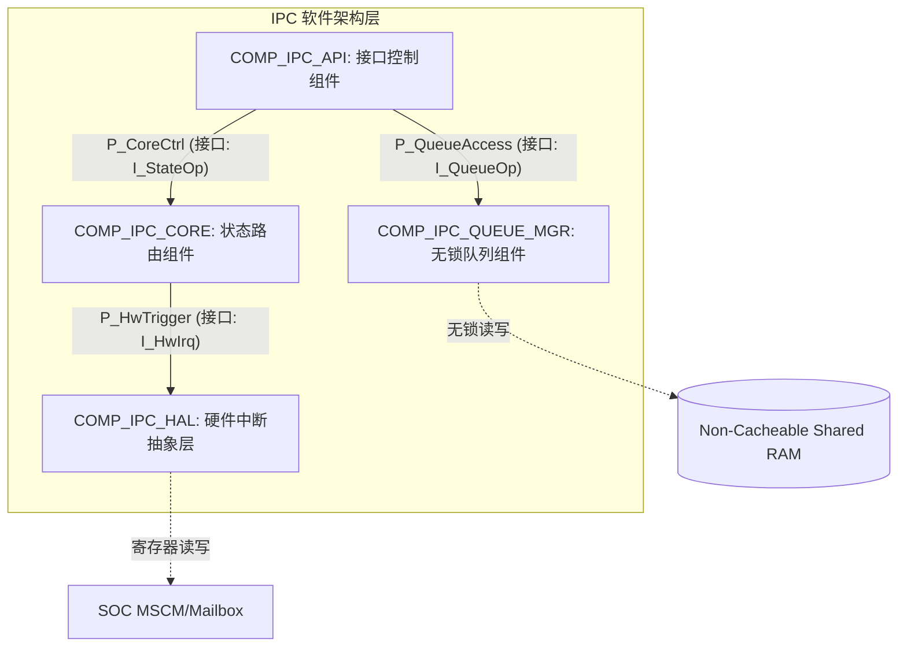
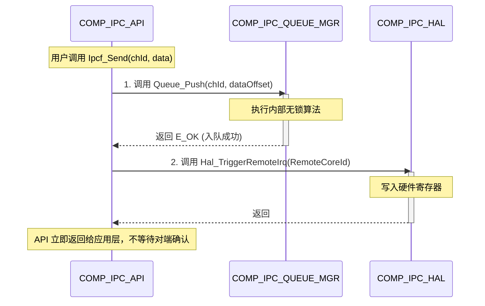

# 软件架构设计文档规范 (ASPICE 4.0 SWE.2)

> **💡 架构师使用指南：**
> 
> 1. 本模板基于 **ASPICE PAM 4.0** 最新架构（BP1~BP5）。
>     
> 2. `[BPx]` 标签直接对应 ASPICE 4.0 的 Base Practice，用于指引外审员阅读。
>     
> 3. 本文以 **NXP IPCF (跨平台通信框架)** 为实战 Demo 进行示范编写。
>     

---

## 1. 简介与架构范围 (Introduction & Scope)

### 1.1 架构设计目的

本文档描述 IPC（多核通信驱动）的软件架构设计。本架构承接软件需求 (SWE.1)，划分软件组件、定义组件间端口与 API 规约，并作为软件详细设计 (SWE.3) 的基线输入。

### 1.2 目标系统语境 (System Context)

本 IPC 架构运行于异构多核 SOC 硬件平台（Cortex-M 与 Cortex-A），利用物理共享内存（Shared RAM）和多核中断（MSCM/Mailbox）实现跨核通信。

---

## 2. 需求分配与双向追溯 (Allocation & Traceability)

_[`ASPICE 4.0 SWE.2 BP2`: Allocate software requirements]_

_[`ASPICE 4.0 SWE.2 BP4`: Ensure consistency and establish bidirectional traceability]_

> **📝 编制规范**：此处必须明确 SWE.1 需求是如何分配给架构组件的，并推导出需要强制下发给 SWE.3 (详细设计) 的技术约束。

|**软件需求 ID (SWE.1)**|**需求简述**|**承接的架构组件 (Component)**|**下发给 SWE.3 的强制架构约束**|
|---|---|---|---|
|`REQ_SW_IPC_001`|M核与A核间的通信必须是非阻塞且零拷贝的。|`COMP_IPC_QUEUE_MGR`      `COMP_IPC_API`|1. `QUEUE` 组件的数据结构仅允许存储偏移量，禁止值拷贝。      2. 队列更新必须采用无锁（Lock-free）算法，禁止在跨核并发中使用 OS Mutex。|
|`REQ_SW_IPC_002`|系统支持最少 4 个独立通道并发。|`COMP_IPC_CORE`|状态机必须支持多实例 (Multi-instance)，通过 Channel_ID 路由寻址。|

---

## 3. 静态架构设计：组件、端口与接口 (Static Architecture)

_[`ASPICE 4.0 SWE.2 BP1`: Develop software architectural design (Elements & Interfaces)]_

> **📝 编制规范**：这正是前序会话纠正的核心！架构不仅要画框图，必须深入到**组件级端口 (Ports)**，并细化表示提供/引用的**接口符号及具体操作 API**。

### 3.1 软件组件视图 (Component View)

_(使用 Mermaid.js 描述架构拓扑与数据流向)_

代码段

### 3.2 组件端口与接口规约细化 (Ports & Detailed Interfaces Specification)

_(解决前序问题：必须对组件间交互的 push/pop/init 等操作进行极其精确的 API 签名定义)_

#### 3.2.1 组件：`COMP_IPC_QUEUE_MGR` (队列管理器)

- **提供端口 (Provided Port)**: `P_QueueAccess`
    
- **接口名称 (Interface)**: `I_QueueOp`
    
- **细化操作与 API 签名 (Operations / API Signatures)**:
    
    此处定义的 API 是组件间交互的契约，**SWE.3 必须严格承接实现，不得自行修改参数**。
    

|**操作功能**|**细化的 API 接口签名 (C-Syntax)**|**参数与数据流说明**|**同步/并发机制**|
|---|---|---|---|
|**队列初始化**|`Std_ReturnType Queue_Init(uint8 chId, uint32 shmBase)`|`shmBase`: 共享内存物理基址。|同步，仅在上电时调用。|
|**数据入队 (Push)**|`Std_ReturnType Queue_Push(uint8 chId, uint32 dataOffset)`|`dataOffset`: 承载数据的偏移地址。      **(满足零拷贝需求)**|非阻塞调用，多 Task 抢占安全。|
|**数据出队 (Pop)**|`Std_ReturnType Queue_Pop(uint8 chId, uint32* pDataOffset)`|`pDataOffset`: 返回弹出的偏移量。|非阻塞调用，ISR 上下文安全。|

---

## 4. 动态行为与交互设计 (Dynamic Behavior & Interaction)

_[`ASPICE 4.0 SWE.2 BP1`: Develop software architectural design (Dynamic behavior)]_

> **📝 编制规范**：此处禁止画单元内部的算法流程图（如 if-else）。必须使用时序图描述**跨组件 (Cross-Component)** 的 API 交互，以此验证第 3 节定义的接口是可运行的。

### 4.1 核心链路时序：跨核异步数据发送交互

本时序图证明 `COMP_IPC_API` 如何利用 `P_QueueAccess` 端口的 `Queue_Push` 接口，以及 HAL 层接口，完成满足非阻塞要求的数据发送。

代码段

---

## 5. 架构分析、资源与安全约束 (Architecture Analysis & Justification)

_[`ASPICE 4.0 SWE.2 BP3`: Analyze software architecture]_

> **📝 编制规范**：ASPICE 4.0 的重头戏。必须证明你的架构在当前硬件约束下是可行的，并且对功能安全 (Safety) 或信息安全 (Security) 风险有防御机制。

### 5.1 资源消耗分析 (Resource Consumption)

- **内存布局约束 (Memory Constraints)**: `COMP_IPC_QUEUE_MGR` 所管理的控制块和数据区，必须被 Linker 脚本放置于 `Non-Cacheable` 内存段。否则在 A 核启用 Cache 的情况下会导致严重的跨核数据不一致。
    
- **执行时间预估 (WCET)**: 架构级约定，所有经由 `COMP_IPC_HAL` 触发的中断顶半部 (ISR Top-Half) 处理逻辑（包含 `Queue_Pop`）必须在 `< 15us` 内执行完毕，严禁发生阻塞等待。
    

### 5.2 并发与并发冲突分析 (Concurrency & Race Conditions)

- **跨核并发防御**: 架构层面利用一端单写（本核更新 Head）、另一端单读（远端核更新 Tail）的分离式无锁队列机制，彻底消解了跨核死锁的风险。
    
- **单核内抢占防御**: 架构要求 `COMP_IPC_API` 层在进入对 Queue 的非原子操作前，必须通过 OS 原语（或全局关中断）实施临界区保护，防御高优先级 Task 的抢占。
    

---

## 6. 术语与参考文档 (Terminology & References)

- ISO/IEC 33020:2015 / ASPICE PAM 4.0
    
- [其他公司内部规范引用...]
    

---

### 💡 架构模板迭代总结 (写给您的思考)

对比之前的方案，这份根据您的高优先级提问和 ASPICE 4.0 云端情报迭代出的模板，拥有极强的**工程穿透力**：

1. **它解决了“接口空洞”**：第 3.2 节的表格，直接把“提供端口 (P_QueueAccess)”和“具体 API 签名 (Queue_Push)”写死在架构中。这在基于 AUTOSAR 或 UML 的体系中是绝对合规且必须的。它成为了 SWE.3 无法篡改的圣旨。
    
2. **它解决了“架构假分析”**：迎合了 ASPICE 4.0 取消“强行评估替代方案”的务实作风，第 5 节直接切入“我的架构会不会把 RAM 爆掉？会不会被 Cache 污染坑死？”，这种基于风险的分析是最高效的防御。
    
3. **无缝对接 SWE.3**：当详细设计工程师拿到这份文档，他只需要建一个 `Ipcf_Queue.c`，把 3.2 节里的 API 抄过去，然后在 2 节的约束下写代码，SWE.2 到 SWE.3 的追溯就自然形成了。