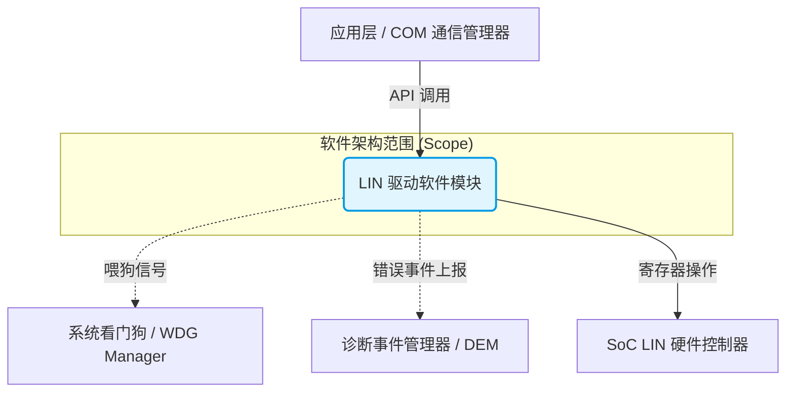
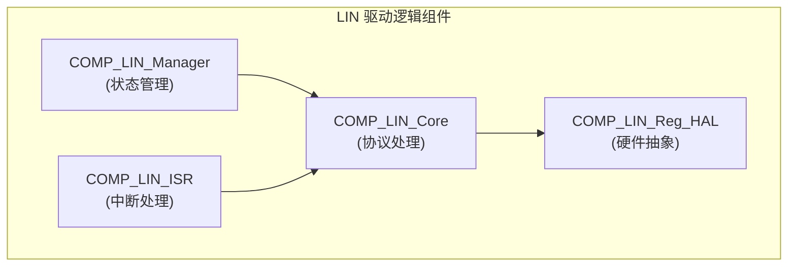
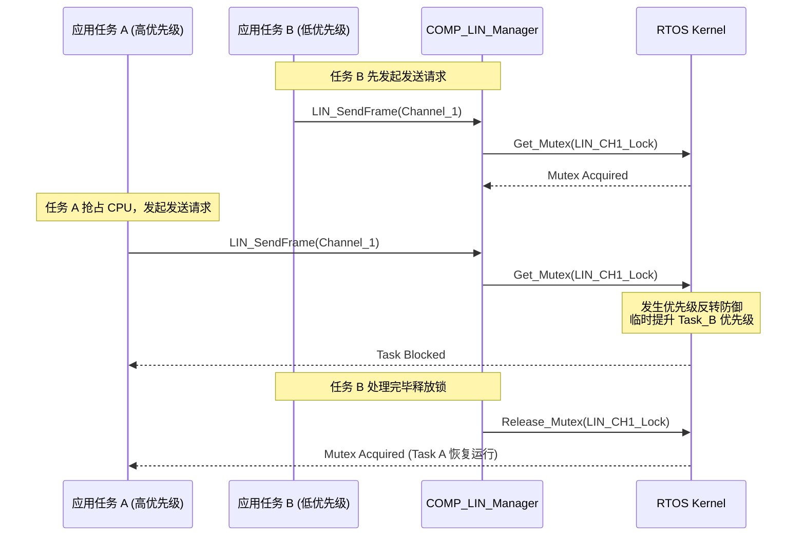
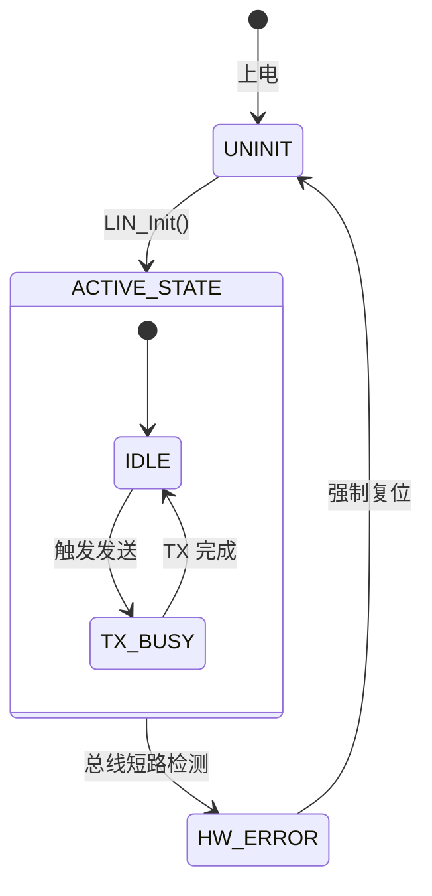

这真是一个极具系统工程深度的连环拷问。在上一版模板中，我们虽然补齐了“架构决策与约束（BP5）”，但如果我们用最高标准（如 VDA Scope 联合 ASPICE PAM 3.1/4.0 审核指南）来逐条审视 **SWE.2 (Software Architectural Design)** 的 Base Practices (BP)，当前的模板仍然存在**三个隐蔽但致命的缺失**。

### 深入分析：ASPICE SWE.2 的隐形要求与当前模板的 Gap

ASPICE 审核员在检查 SWE.2 时，不仅看图画得漂不漂亮，更看重架构能否在真实的嵌入式物理环境中落地。以下是缺失的三个核心维度：

#### 1. 缺失了“执行视图与任务映射” (对应 SWE.2.BP4 / BP1)

- **Gap 分析**：当前的静态组件图（划分了 Manager、Core、HAL）仅仅是**逻辑视图**。但在 RTOS 环境下，代码是怎么跑起来的？组件是映射到一个 Task、多个 Task，还是在中断上下文（ISR）中运行？
    
- **补充策略**：必须增加**执行架构（Execution Architecture）**章节，明确 Task 的优先级、调度策略（抢占/轮转）、周期，以及逻辑组件到 OS 任务的映射关系。
    

#### 2. 缺失了“全局错误处理与诊断策略” (隐含在 SWE.2 全局架构原则中)

- **Gap 分析**：虽然状态机里画了 `HW_ERROR`，但这远远不够。ASPICE 要求架构设计必须说明：当底层组件发生错误时，是原地死循环、返回错误码，还是上报给 DEM（Diagnostic Event Manager）？
    
- **补充策略**：增加**全局策略（Global Strategies）**小节，统一定义错误传播机制、看门狗策略和降级（Degradation）模式。
    

#### 3. 缺失了“架构沟通与基线状态” (对应 SWE.2.BP8 Communicate agreed software architectural design)

- **Gap 分析**：ASPICE 要求架构不仅要设计出来，还要被所有利益相关者（测试、开发、需求工程师）评审并达成一致。
    
- **补充策略**：在文档头部增加严格的**版本与评审控制（Document Control）**，确立基线（Baseline）。
    

---

基于以上深入分析，我为你重构了这套符合车规级审查最高标准的 **Ultimate 版 ASPICE SWE.2 架构模板**。你可以直接将其更新到你的 Obsidian 知识库中。

---

# 📂 模板：ASPICE SWE.2 软件架构设计说明书 (V2.0 终极版)

## 0. 文档控制与基线 (Document Control) 🌟[新增: 满足 BP8]

|**属性**|**说明**|
|---|---|
|**文档 ID**|`SAD_LIN_DRIVER_001`|
|**版本/状态**|`V2.0` / `已批准 (Approved Baseline)`|
|**评审记录**|链接至评审报告：`[[REV_SAD_202604_01]]`|
|**上游需求**|链接至需求基线：`[[SWE.1_Software_Requirements_Baseline_V1.5]]`|

## 1. 系统上下文与边界 (System Context) 🎯[BP1]

**🎯 编写指导**：界定架构边界，展示其与外部环境的物理/逻辑接口。将待设计的系统作为黑盒。

### 1.1 系统上下文视图

代码段

## 2. 架构约束与全局策略 (Constraints & Global Strategies) 🌟[强化: 满足 BP5]

**🎯 编写指导**：明确限制条件、设计选择的证明，以及跨组件的通用处理策略。

### 2.1 架构级系统约束 (Architecture Constraints)

- **硬件约束**：目标 SoC（如 NXP S32G）LIN 控制器的 FIFO 深度最大为 8 Bytes。
    
- **操作系统约束**：基于 AutoSAR OS（或 FreeRTOS），禁止动态内存分配。
    
- **合规性约束**：MISRA C:2012 覆盖率 100%，支持 ISO 26262 ASIL B。
    

### 2.2 设计决策与备选评估 (Design Decisions & Alternatives)

- **ASR (关键架构需求)**：中断响应需在 50us 内完成（`ASR-01`）。
    
- **方案评估**：对比“轮询模式”与“中断+信号量模式”。因轮询会导致 CPU 负载过高且无法满足 `ASR-01`，最终决策采用**中断驱动+优先级继承 Mutex 保护**机制。
    

### 2.3 全局错误与诊断策略 (Global Error Handling Strategy) 🌟[新增]

- **局部错误**：如入参越界，由 API 层直接拦截并返回 `E_NOT_OK`，不干扰系统状态。
    
- **硬件致命错误**：如 LIN 总线对地短路，底层 HAL 需隔离硬件，将通道状态机置为 `HW_ERROR`，并通过回调异步上报给 DEM 模块，触发系统降级。
    

## 3. 静态与执行架构设计 (Static & Execution Architecture) 🎯[BP1, BP2]

**🎯 编写指导**：不仅要展示逻辑划分，更要展示组件是如何分配到物理存储和 OS 任务中的。

### 3.1 静态逻辑组件视图

代码段

### 3.2 任务映射与执行视图 (Execution View) 🌟[新增: 满足 RTOS 调度审查]

> **编写指导**：说明逻辑组件在哪个 OS 上下文中运行，这是分析 CPU 负载和资源竞争的前提。

|**组件 ID**|**映射的 OS 上下文 (Task/ISR)**|**优先级 / 触发周期**|**执行域隔离级别**|
|---|---|---|---|
|`COMP_01`, `COMP_02`|`Task_COM_Cyclic`|优先级 10 / 5ms 周期调用|特权级 (Privileged)|
|`COMP_05` (ISR)|`ISR_LIN_RX_TX`|硬件中断级 / 异步事件触发|特权级 (Privileged)|

## 4. 动态行为设计 (Dynamic Behavior Design) 🎯[BP4]

**🎯 编写指导**：描述组件在运行时的交互逻辑、并发处理、状态跃迁。

### 4.1 核心业务流时序图 (并发与资源竞争场景)

> **编写指导**：展示高难度交互，如多 Task 竞争同一个硬件通道时的处理。

代码段

### 4.2 状态机视图 (State Machine)

代码段

## 5. 接口规约与资源评估 (Interfaces & Resources) 🎯[BP3, BP5]

### 5.1 模块间/对外接口规约 (API Specifications)

|**API 签名**|**前置条件 / 并发安全**|**同步/异步**|**错误返回代码定义**|
|---|---|---|---|
|`LIN_SendFrame(Ch, PduInfo)`|状态需为 `IDLE` / 受 Mutex 保护|同步写入，异步中断确认|`E_OK`, `E_NOT_OK`, `LIN_E_BUSY`|

### 5.2 资源消耗评估 (Resource Assessment)

- **ROM/RAM 预估**：ROM < 8KB；静态分配 RAM < 256 Bytes。
    
- **WCET (最坏执行时间)**：`ISR_LIN_RX_TX` 最坏执行时间评估为 12us，满足 `ASR-01`。
    

## 6. 双向追溯性与一致性 (Traceability & Consistency) 🎯[BP2, BP6, BP7]

**🎯 编写指导**：闭环审计。使用自动生成的工具或手动维护矩阵，确保需求与架构的 N:M 映射。

### 6.1 SWE.1 -> SWE.2 架构元素追溯矩阵

|**软件需求 ID (SWE.1)**|**对应的静态组件 ID**|**对应的动态视图/执行上下文**|**一致性状态**|
|---|---|---|---|
|`REQ_SW_LIN_06` (报文发送)|`COMP_01`, `COMP_02`|映射至 `Task_COM_Cyclic`|✅ Validated|
|`REQ_SW_LIN_30` (并发安全)|`COMP_01` (含 Mutex 逻辑)|动态时序图 `SEQ_01`|✅ Validated|
|`REQ_SW_LIN_45` (硬件故障隔离)|`COMP_04`, 全局错误策略|状态机 `HW_ERROR` 跃迁|✅ Validated|

> **一致性声明 (SWE.2.BP7)**：本架构设计已覆盖所有划定范围内的 SWE.1 需求，不存在未实现的需求，也不存在未定义需求的冗余架构组件。