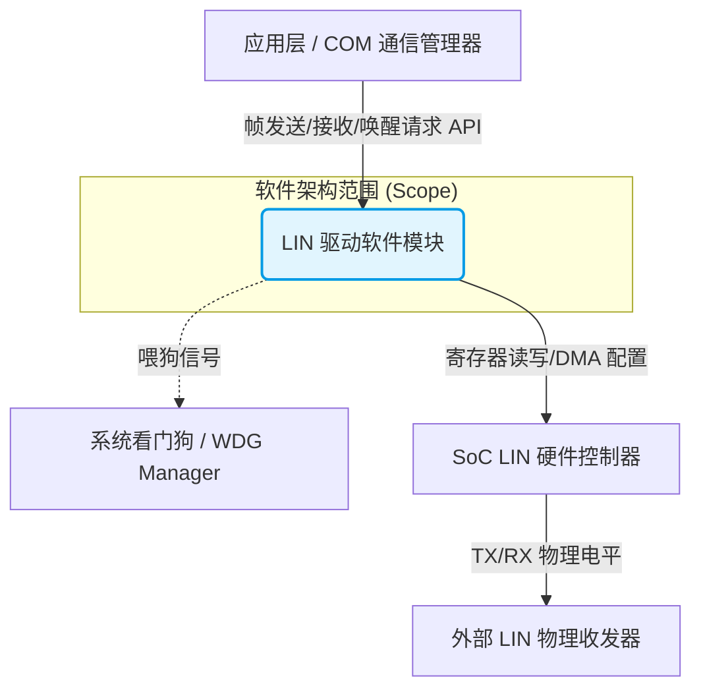
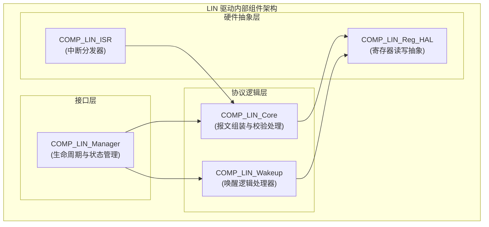
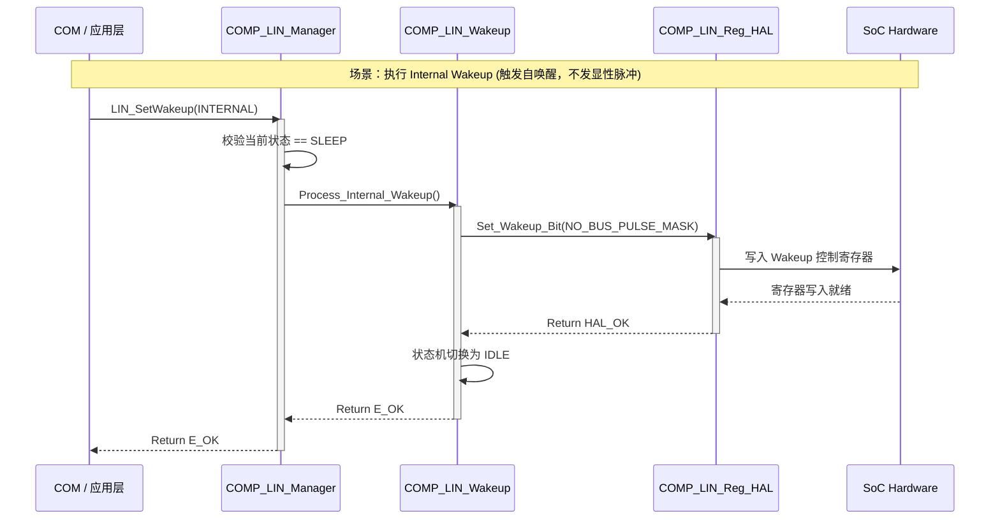
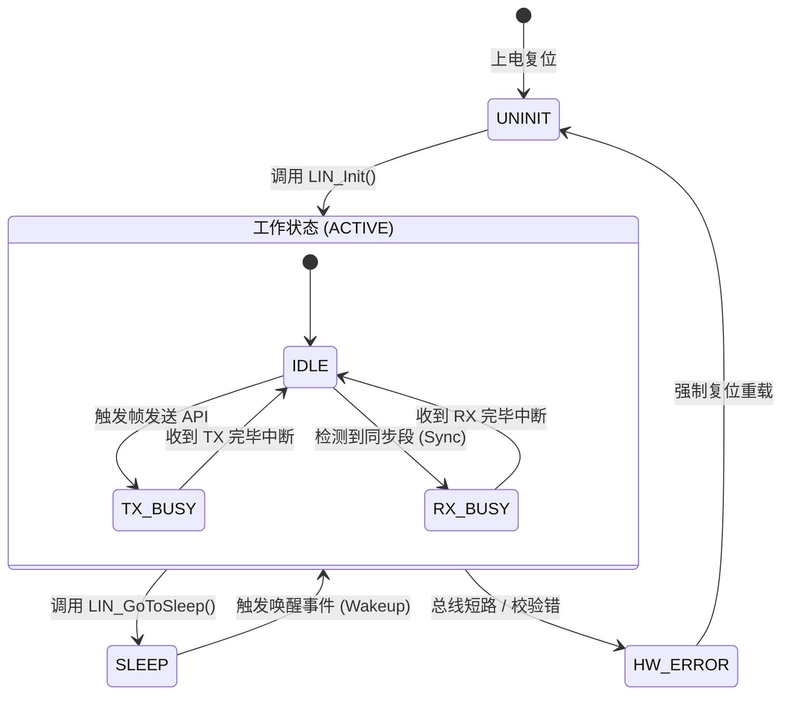

非常抱歉，上一版中状态机（State Diagram）的语法确实存在一个经典的 Mermaid 嵌套状态跳转错误（外部直接跳转到了内部的 `IDLE` 状态，且使用了包含中文字符的 ID），同时组件图中的 `<br/>` 换行如果没有加引号，在部分 Obsidian 版本中也会导致解析失败。

我已经修复了所有底层的 Mermaid 语法严谨性问题，并对标签进行了安全转义。你可以直接点击复制，将以下完整内容作为标准模板粘贴到你的 Obsidian 知识库中。

---

# 📂 模板：ASPICE SWE.2 软件架构设计说明书

> **文档元数据 (Frontmatter 建议)**
> 
> YAML
> 
> ```
> id: SAD_LIN_DRIVER_001
> version: 1.0.0
> status: Draft
> author: [你的名字]
> parent_req: [[SWE.1_Software_Requirements]]
> ```

## 1. 系统上下文与范围 (System Context)

**🎯 核心目的**：界定架构边界，明确本软件模块“管什么”和“不管什么”，展示其与外部环境的物理/逻辑接口。

### 1.1 系统上下文视图

> **编写指导**：将待设计的系统作为黑盒，仅展示其周边的交互实体。

代码段



## 2. 静态架构设计 (Static Architecture Design)

**🎯 核心目的**：打开黑盒，展示模块内部的子组件划分、层级结构（如服务层/逻辑层/硬件抽象层）以及静态依赖关系。

### 2.1 静态分层与组件视图

> **编写指导**：遵循高内聚低耦合原则，明确组件的单向依赖，绝对避免循环依赖。此处分配的 `COMP_ID` 是后续追踪的核心。

代码段



### 2.2 组件与需求追溯矩阵 (Component-to-Requirement Matrix)

> **编写指导**：证明架构中划分的每一个组件都有其存在的“合法性”。使用表格直接映射 SWE.1 需求。

|**组件 ID**|**组件名称**|**核心职责描述**|**追溯至软件需求 (SWE.1)**|
|---|---|---|---|
|`COMP_02`|`COMP_LIN_Core`|处理 LIN 报文头的发送、响应接收与 Checksum 校验。|`REQ_SW_LIN_05` (PID校验), `REQ_SW_LIN_06` (帧收发)|
|`COMP_03`|`COMP_LIN_Wakeup`|独立处理控制器级别的唤醒逻辑，隔离物理总线脉冲行为。|`REQ_SW_LIN_12` (内部唤醒), `REQ_SW_LIN_13` (标准唤醒)|
|`COMP_04`|`COMP_LIN_Reg_HAL`|封装底层硬件地址，提供平台无关的读写内联函数。|`REQ_SW_LIN_01` (硬件解耦), `REQ_SW_LIN_20` (地址保护)|

## 3. 动态行为设计 (Dynamic Behavior Design)

**🎯 核心目的**：描述组件在运行时的交互逻辑、并发处理、状态跃迁，特别是核心业务流和错误恢复机制。

### 3.1 核心业务流时序图 (Sequence View)

> **编写指导**：重点刻画复杂场景。以 LIN 驱动中易混淆的**唤醒机制**为例，展示组件间的微观交互。

代码段



### 3.2 组件内部状态机视图 (State Machine View)

> **编写指导**：对于通信驱动或具有严格生命周期的组件，必须提供状态跃迁图，防范未知状态导致的死锁。必须注意父子状态的明确进入与退出。

代码段



### 3.3 动态视图与需求追溯矩阵 (Dynamic-to-Requirement Matrix)

> **编写指导**：证明动态交互逻辑（如时序、状态流转）满足了 SWE.1 中的特定行为约束。

|**动态视图标识**|**视图类型**|**描述说明**|**追溯至软件需求 (SWE.1)**|
|---|---|---|---|
|`SEQ_01`|时序图|Internal Wakeup (无总线脉冲唤醒) 交互流转。|`REQ_SW_LIN_12`|
|`SEQ_02`|时序图|多任务并发访问 LIN 发送接口时的 Mutex 阻塞与优先级继承逻辑。|`REQ_SW_LIN_30` (并发安全)|
|`STM_01`|状态机|LIN 通道全局状态机跃迁控制，包含错误恢复路径。|`REQ_SW_LIN_45` (状态管理与容错)|

## 4. 接口规约与资源消耗 (Interfaces & Resource Assessment)

### 4.1 核心对外接口规约 (API Specifications)

|**函数名称**|**LIN_SetWakeup**|
|---|---|
|**原型**|`Std_ReturnType LIN_SetWakeup(uint8 Channel, WakeupType Type);`|
|**前置条件**|模块已初始化 (`UNINIT` -> `IDLE`)，且当前处于 `SLEEP` 状态。|
|**并发安全性**|是 (内部受 Spinlock 保护)。|
|**返回值**|`E_OK` / `E_NOT_OK` / `LIN_E_STATE_TRANSITION`|

### 4.2 硬件/软件接口约束 (HSI Assumptions)

- **中断优先级**：LIN RX/TX 中断必须配置为系统优先级 `N`，高于普通 OS 滴答定时器，低于致命错误异常（NMI）。
    
- **内存隔离**：所有硬件寄存器基址需配置在 MPU 的特权访问区域，应用层仅能通过系统调用进入 `Target_System`。