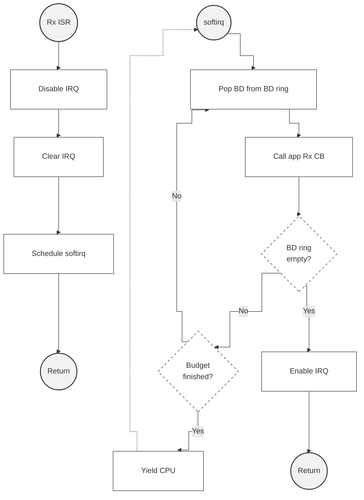

# 第八章 IPCS 共享内存驱动程序 API

## 8.1 IPCS 共享内存驱动程序 API

### 8.1.1 枚举 IPCS_SHM_CHANNEL_TYPE_E

`enum IPCS_SHM_CHANNEL_TYPE_E` 通道类型

**定义**

```
enum IPCS_SHM_CHANNEL_TYPE_E {
    IPCS_SHM_MANAGED,
    IPCS_SHM_UNMANAGED
};
```

**常量**

- `IPCS_SHM_MANAGED`：启用了缓冲区管理的通道
- `IPCS_SHM_UNMANAGED`：禁用缓冲区管理，应用程序拥有整个通道内存

**描述** 对于非托管通道，应用程序对通道内存拥有完全控制权，且 ipc-shm 设备不进行缓冲区管理。

### 8.1.2 枚举 IPCS_SHM_QUEUE_TYPE_E

`enum IPCS_SHM_QUEUE_TYPE_E` 队列类型

**定义**

```
enum IPCS_SHM_QUEUE_TYPE_E {
    IPCS_SHM_CHANNEL_QUEUE,
    IPCS_SHM_POOL_QUEUE
};
```

**常量**

- `IPCS_SHM_CHANNEL_QUEUE`：通道队列
- `IPCS_SHM_POOL_QUEUE`：缓冲池队列

### 8.1.3 枚举 IPCS_SHM_CORE_TYPE_E

`enum IPCS_SHM_CORE_TYPE_E` 核心类型

**定义**

```
enum IPCS_SHM_CORE_TYPE_E {
    IPCS_CORE_DEFAULT,
    IPCS_CORE_A53,
    IPCS_CORE_M7,
    IPCS_CORE_M4,
    IPCS_CORE_Z7,
    IPCS_CORE_Z4,
    IPCS_CORE_Z2,
    IPCS_CORE_R52,
    IPCS_CORE_M33,
    IPCS_CORE_BBE32
};
```

**常量**

- `IPCS_CORE_DEFAULT`：用于让驱动程序自动选择远程核心类型
- `IPCS_CORE_A53`：ARM Cortex-A53 核心
- `IPCS_CORE_M7`：ARM Cortex-M7 核心
- `IPCS_CORE_M4`：ARM Cortex-M4 核心
- `IPCS_CORE_Z7`：PowerPC e200z7 核心
- `IPCS_CORE_Z4`：PowerPC e200z4 核心
- `IPCS_CORE_Z2`：PowerPC e200z2 核心
- `IPCS_CORE_R52`：ARM Cortex-R52 核心
- `IPCS_CORE_M33`：ARM Cortex-M33 核心
- `IPCS_CORE_BBE32`：Tensilica ConnX BBE32EP 核心

### 8.1.4 枚举 IPCS_SHM_CORE_INDEX_E

`enum IPCS_SHM_CORE_INDEX_E` 核心索引

**定义**

```
enum IPCS_SHM_CORE_INDEX_E {
    IPCS_CORE_INDEX_0,
    IPCS_CORE_INDEX_1,
    IPCS_CORE_INDEX_2,
    IPCS_CORE_INDEX_3,
    IPCS_CORE_INDEX_4,
    IPCS_CORE_INDEX_5,
    IPCS_CORE_INDEX_6,
    IPCS_CORE_INDEX_7
};
```

**常量**

- `IPCS_CORE_INDEX_0` ... `IPCS_CORE_INDEX_7`：处理器索引 0 到 7

### 8.1.5 结构体 IPCS_SHM_POOL_CFG_TYPE

`struct IPCS_SHM_POOL_CFG_TYPE` 内存缓冲池参数

**定义**

```
struct IPCS_SHM_POOL_CFG_TYPE {
    uint16 num_bufs;
    uint32 buf_size;
};
```

**成员**

- `num_bufs`：缓冲区数量
- `buf_size`：缓冲区大小

### 8.1.6 结构体 IPCS_SHM_MANAGED_CFG_TYPE

`struct IPCS_SHM_MANAGED_CFG_TYPE` 托管通道参数

**定义**

```
struct IPCS_SHM_MANAGED_CFG_TYPE {
    uint8 num_pools;
    struct IPCS_SHM_POOL_CFG_TYPE *pools;
    void (*rx_cb)(void *cb_arg, const uint8 instance, uint8 chan_id, void *buf, uint32 size);
    void *cb_arg;
};
```

**成员**

- `num_pools`：缓冲池数量
- `pools`：内存缓冲池参数
- `rx_cb`：接收回调函数
- `cb_arg`：可选的接收回调参数

### 8.1.7 结构体 IPCS_SHM_UNMANAGED_CFG_TYPE

`struct IPCS_SHM_UNMANAGED_CFG_TYPE` 非托管通道参数

**定义**

```
struct IPCS_SHM_UNMANAGED_CFG_TYPE {
    uint32 size;
    void (*rx_cb)(void *cb_arg, const uint8 instance, uint8 chan_id, void *mem);
    void *cb_arg;
};
```

**成员**

- `size`：非托管通道内存大小
- `rx_cb`：接收回调函数
- `cb_arg`：可选的接收回调参数

### 8.1.8 结构体 IPCS_SHM_CHANNEL_CFG_TYPE

`struct IPCS_SHM_CHANNEL_CFG_TYPE` 通道参数

**定义**

```
struct IPCS_SHM_CHANNEL_CFG_TYPE {
    enum IPCS_SHM_CHANNEL_TYPE_E type;
    union {
        struct IPCS_SHM_MANAGED_CFG_TYPE managed;
        struct IPCS_SHM_UNMANAGED_CFG_TYPE unmanaged;
    } ch;
};
```

**成员**

- `type`：来自 `enum IPCS_SHM_CHANNEL_TYPE_E` 的通道类型
- `ch.managed`：托管通道参数
- `ch.unmanaged`：非托管通道参数

### 8.1.9 结构体 IPCS_SHM_REMOTE_CORE_TYPE

`struct IPCS_SHM_REMOTE_CORE_TYPE` 远程核心类型和索引

**定义**

```
struct IPCS_SHM_REMOTE_CORE_TYPE {
    enum IPCS_SHM_CORE_TYPE_E type;
    enum IPCS_SHM_CORE_INDEX_E index;
};
```

**成员**

- `type`：来自 `enum IPCS_SHM_CORE_TYPE_E` 的核心类型
- `index`：核心编号

**描述** 核心类型可以是 `IPCS_CORE_DEFAULT`，在这种情况下，核心索引并不重要，因为它由驱动程序自动选择。

### 8.1.10 结构体 IPCS_SHM_LOCAL_CORE_TYPE

`struct IPCS_SHM_LOCAL_CORE_TYPE` 本地核心类型、索引和受信任核心

**定义**

```
struct IPCS_SHM_LOCAL_CORE_TYPE {
    enum IPCS_SHM_CORE_TYPE_E type;
    enum IPCS_SHM_CORE_INDEX_E index;
    uint32 trusted;
};
```

**成员**

- `type`：来自 `enum IPCS_SHM_CORE_TYPE_E` 的核心类型
- `index`：被远程核心中断作为目标的核心编号
- `trusted`：受信任核心掩码

**描述** 核心类型可以是 `IPCS_CORE_DEFAULT`，在这种情况下，核心索引并不重要，因为它由驱动程序自动选择。 受信任核心掩码指定哪些核心（与本地核心类型相同）有权访问被作为目标的本地核心的核间中断状态寄存器。掩码可以由 `enum IPCS_SHM_CORE_INDEX_E` 组成。

### 8.1.11 结构体 IPCS_SHM_CFG_TYPE

`struct IPCS_SHM_CFG_TYPE` IPC 共享内存参数

**定义**

```
struct IPCS_SHM_CFG_TYPE {
    uintptr local_shm_addr;
    uintptr remote_shm_addr;
    uint32 shm_size;
    sint16 inter_core_tx_irq;
    sint16 inter_core_rx_irq;
    uint8 mru_tx_channel_id;
    uint8 mru_rx_channel_id;
    struct IPCS_SHM_LOCAL_CORE_TYPE local_core;
    struct IPCS_SHM_REMOTE_CORE_TYPE remote_core;
    uint8 num_channels;
    struct IPCS_SHM_CHANNEL_CFG_TYPE *channels;
#ifdef USING_OS_AUTOSAROS
    ISRType isr_id_handler;
#endif
};
```

**成员**

- `local_shm_addr`：本地共享内存物理地址
- `remote_shm_addr`：远程共享内存物理地址
- `shm_size`：本地/远程共享内存大小
- `inter_core_tx_irq`：为共享内存驱动程序 Tx 预留的核间中断
- `inter_core_rx_irq`：为共享内存驱动程序 Rx 预留的核间中断
- `mru_tx_channel_id`：用于共享内存驱动程序 Tx 的 MRU 通道索引
- `mru_rx_channel_id`：用于共享内存驱动程序 Rx 的 MRU 通道索引
- `local_core`：被远程核心中断作为目标的本地核心
- `remote_core`：触发中断的远程核心
- `num_channels`：共享内存通道数量
- `channels`：IPC 通道参数数组
- `isr_id_handler`：定义用于处理中断的 OsIsr 名称（仅在使用 AutosarOS 时）

**描述** 使用的 TX 和 RX 中断必须不同。对于 ARM 平台，可以使用 `IPCS_CORE_DEFAULT` 为本地和远程核心分配默认值。本地核心仅用于 Linux 可能运行在多个核心上的平台，对于 RTOS 和裸机实现将被忽略。 本地和远程通道及缓冲池配置必须对称。

### 8.1.12 结构体 IPCS_SHM_INSTANCES_CFG_TYPE

`struct IPCS_SHM_INSTANCES_CFG_TYPE` IPC 共享内存参数

**定义**

```
struct IPCS_SHM_INSTANCES_CFG_TYPE {
    uint8 num_instances;
    struct IPCS_SHM_CFG_TYPE *shm_cfg;
};
```

**成员**

- `num_instances`：共享内存实例数量
- `shm_cfg`：IPC 共享内存参数数组

### 8.1.13 函数 ipcsShmInitInstance

`sint8 ipcsShmInitInstance(uint8 instance, const struct IPCS_SHM_CFG_TYPE *cfg)` 初始化 IPC-Shm 驱动程序的指定实例

**参数**

- `instance (uint8)` – 实例 id
- `cfg (const struct IPCS_SHM_CFG_TYPE*)` – ipc-shm 实例配置

**描述** 成功时返回 `IPCS_SHM_E_OK`，否则返回错误代码。

### 8.1.14 函数 ipcsShmInit

`sint8 ipcsShmInit(const struct IPCS_SHM_INSTANCES_CFG_TYPE *cfg)` 初始化共享内存设备

**参数**

- `cfg (const struct IPCS_SHM_INSTANCES_CFG_TYPE*)` – 配置参数

**描述** 函数不可重入。

**返回** 成功时返回 0，否则返回错误代码。

### 8.1.15 函数 ipcsShmFreeInstance

`void ipcsShmFreeInstance(const uint8 instance)` 取消初始化 IPC-Shm 驱动程序的指定实例

**参数**

- `instance (const uint8)` – 实例 id

**描述** 函数不可重入。

### 8.1.16 函数 ipcsShmFree

`void ipcsShmFree(void)` 释放所有共享内存设备实例

**参数**

- `void` – 无参数

**描述** 函数不可重入。

### 8.1.17 函数 ipcsShmAcquireBuf

`void *ipcsShmAcquireBuf(const uint8 instance, uint8 chan_id, uint32 mem_size)` 为给定通道请求缓冲区

**参数**

- `instance (const uint8)` – 实例 id
- `chan_id (uint8)` – 通道索引
- `mem_size (uint32)` – 所需大小

**描述** 函数仅用于启用了缓冲区管理的托管通道。该函数对于不同通道是线程安全的，但对于同一通道不是。

**返回** 指向缓冲区基地址的指针，如果未找到缓冲区则返回 NULL。

### 8.1.18 函数 ipcsShmReleaseBuf

`sint8 ipcsShmReleaseBuf(const uint8 instance, uint8 chan_id, const void *buf)` 释放给定通道的缓冲区

**参数**

- `instance (const uint8)` – 实例 id
- `chan_id (uint8)` – 通道索引
- `buf (const void*)` – 缓冲区指针

**描述** 函数仅用于启用了缓冲区管理的托管通道。该函数对于不同通道是线程安全的，但对于同一通道不是。

**返回** 成功时返回 0，否则返回错误代码。

### 8.1.19 函数 ipcsShmTx

`sint8 ipcsShmTx(const uint8 instance, uint8 chan_id, void *buf, uint32 size)` 在给定通道上发送数据并通知远程

**参数**

- `instance (const uint8)` – 实例 id
- `chan_id (uint8)` – 通道索引
- `buf (void*)` – 缓冲区指针
- `size (uint32)` – 写入缓冲区的数据大小

**描述** 函数仅用于启用了缓冲区管理的托管通道。该函数对于不同通道是线程安全的，但对于同一通道不是。

**返回** 成功时返回 0，否则返回错误代码。

### 8.1.20 函数 ipcsShmUnmanagedAcquire

`void *ipcsShmUnmanagedAcquire(const uint8 instance, uint8 chan_id)` 获取非托管通道的本地内存

**参数**

- `instance (const uint8)` – 实例 id
- `chan_id (uint8)` – 通道索引

**描述** 函数仅用于非托管通道。内存必须在通道初始化后仅获取一次。不需要释放函数。该函数对于不同通道是线程安全的，但对于同一通道不是。

**返回** 指向通道内存的指针，如果是无效通道则返回 NULL。

### 8.1.21 函数 ipcsShmUnmanagedTx

`sint8 ipcsShmUnmanagedTx(const uint8 instance, uint8 chan_id)` 通知远程已在通道中写入数据

**参数**

- `instance (const uint8)` – 实例 id
- `chan_id (uint8)` – 通道索引

**描述** 函数仅用于非托管通道。它可以在通道内存获取后，在需要通知远程通道内存中有新数据可用时使用。该函数对于不同通道是线程安全的，但对于同一通道不是。

**返回** 成功时返回 0，否则返回错误代码。

### 8.1.22 函数 ipcsShmIsRemoteReady

`sint8 ipcsShmIsRemoteReady(const uint8 instance)` 检查远程是否已初始化

**参数**

- `instance (const uint8)` – 实例 id

**描述** 函数用于检查远程是否已初始化并准备好接收消息。它应至少在第一次传输操作之前被调用。该函数是线程安全的。

**返回** 如果远程已初始化返回 0，否则返回错误代码。

### 8.1.23 函数 ipcsShmPollChannels

`sint8 ipcsShmPollChannels(const uint8 instance)` 轮询通道以处理可用消息

**参数**

- `instance (const uint8)` – 实例 id

**描述** 此函数使用公平处理算法处理所有通道：所有通道被平等对待，没有通道会处于饥饿状态。该函数对于不同实例是线程安全的，但对于同一实例不是。

**返回** 处理的消息数量，否则返回错误代码。




---
```
ipcs/
├── ipcs_cores/
│   ├── mcu/
│   └── mpu/
├── mcu/
│   ├── example_cm7_0_3_a53_comm/
│   ├── example_cm7_0_ping_pong/
│   ├── hw/
│   ├── os/
│   └── ipc-shm-rtos.mk
├── mpu/
│   ├── hw/
│   ├── os_cdev/
│   ├── os_kernel/
│   └── os_uio/
├── test/
│   ├── ipcs_example_c1_a53_module/
│   ├── ipcs_example_c1_a53_user/
│   └── ipcs_example_c1_a53_with_cm7_0_3/
├── Makefile
└── makefile_samples
```
