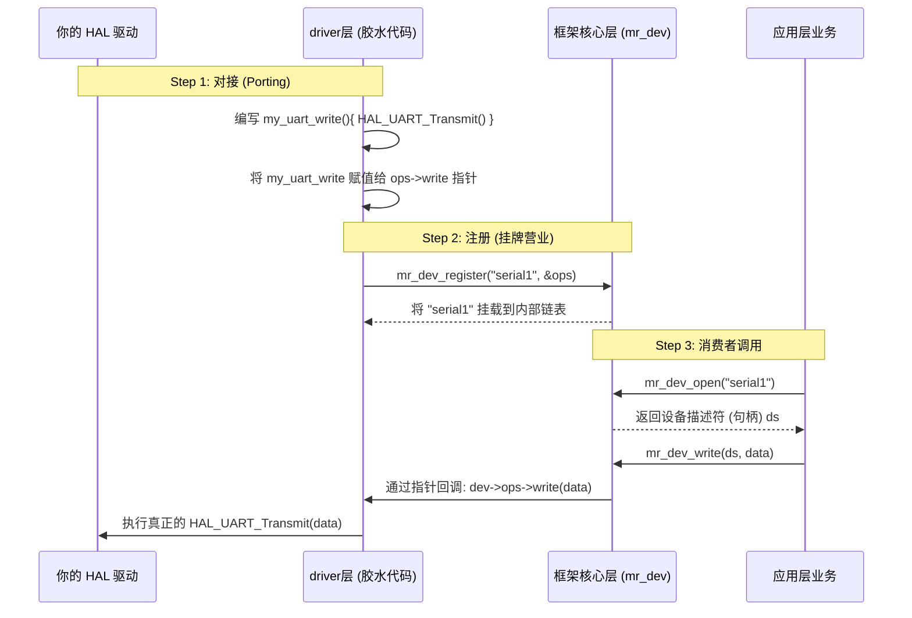

你好！我是 Rich OS，你的开源架构导师。很高兴能陪你一起打通从“底层驱动”到“全栈框架”的任督二脉。

面对 `mr-library`（MR 框架）这样具有分层架构的项目，很多习惯了直接操作寄存器或写 HAL 库的底层工程师，初看时会觉得仿佛陷入了“指针的迷宫”。但不用担心，只要我们转换一下认知视角，从你最熟悉的底层往上看，这层窗户纸一捅就破。

按照你的认知习惯，我们立刻开始这场“破盒之旅”。

---

### 一、 先做认知定位与破冰

**1. 设备驱动框架的本质到底是什么？**

**一句话解释**：设备驱动框架就是一个“沙漏型”的中间商，它向下强制收编所有五花八门的硬件驱动，向上提供统一的标准访问接口 。 **裸机痛点引出**：在裸机开发中，你想发串口数据，STM32 下写 `HAL_UART_Transmit`，换成 WCH 芯片就得改成 `USART_SendData` 。如果你的项目有一万行代码，换一次芯片意味着你要全局搜索并替换成百上千处 API。框架的本质使命，就是**把“硬件的易变性”隔离在底层，让应用层的代码实现跨芯片的“一次编写，到处运行”** 。

**2. 知识锚点映射** 你熟悉的 `HAL` 库，依然是这个系统中最坚实的基石。框架**绝对不会**取代 HAL 库去直接操作寄存器，它只是在 HAL 库上面盖了一层“标准化的大楼”。你可以把框架理解为一个**插线板**：应用层是各种电器（需要标准的三孔插座），而你写的 HAL 驱动，就是去实现符合这个插座标准的插头 。

---

### 二、 全局视野：分层架构与认知映射

为了建立空间感，我们来看看 MR 框架的经典分层。请注意看图中的“控制权反转”（IoC）：以前是你的应用主动去调 HAL；现在，应用只调框架，框架再通过指针“回调”你的底层驱动。

代码段

```mermaid
graph TD
    subgraph 应用层 (App)
        A[业务逻辑: 点亮LED, 发送数据]
    end

    subgraph MR 框架核心层 (mr-library source/include)
        B[mr_dev_open / read / write / ioctl]
        C[设备管理器: 查找表/设备树]
    end

    subgraph 抽象设备层 (mr-library device)
        D[Pin设备基类]
        E[Serial设备基类]
        F[SPI/I2C设备基类]
    end

    subgraph 移植/驱动层 (mr-library driver)
        G[stm32_pin_write]
        H[stm32_uart_read]
    end

    subgraph 底层硬件层 (BSP / HAL / MCU)
        I[HAL_GPIO_WritePin]
        J[HAL_UART_Receive]
    end

    A -- "调用标准API" --> B
    B -- "路由" --> C
    C -- "多态调用" --> D
    D -- "函数指针回调" --> G
    G -- "调用" --> I
    E -- "函数指针回调" --> H
    H -- "调用" --> J

    style A fill:#e1f5fe,stroke:#01579b
    style B fill:#fff3e0,stroke:#e65100
    style C fill:#fff3e0,stroke:#e65100
    style D fill:#e8f5e9,stroke:#1b5e20
    style E fill:#e8f5e9,stroke:#1b5e20
    style G fill:#fce4ec,stroke:#880e4f
    style I fill:#f3e5f5,stroke:#4a148c
```

**角色映射表：你的工作在哪？**

|**架构层级**|**所在目录**|**谁来负责？**|**你的主要工作 (Driver工程师视角)**|
|---|---|---|---|
|**应用层**|用户的 `main.c`|业务开发工程师|调用 `mr_dev_open` 和 `mr_dev_write` 实现业务功能 。|
|**框架核心**|`source/` & `include/`|MR 框架作者|**无需修改**。享受它提供的内存分配、链表管理等基础服务 。|
|**设备抽象**|`device/`|MR 框架作者|**无需修改**。这里定义了 SPI、UART 等外设应该具备哪些标准行为 。|
|**驱动/移植**|`driver/` & `bsp/`|**你（底层开发工程师）**|**核心战场**。在这里编写胶水代码，将框架的抽象函数指针指向你熟悉的 HAL 库函数 。|
|**硬件层**|芯片厂商 SDK|芯片原厂 (如 ST)|配置 CubeMX，生成底层 HAL 初始化代码。|

---

### 三、 核心解耦机制（框架的“内功”）

**1. 面向对象的 C 语言实现**

C 语言没有 `class` 和 `virtual` 关键字，MR 框架（以及 Linux、RT-Thread）是如何做到解耦的？

**秘诀是：包含函数指针的结构体（Struct）** 。

在框架看来，万物皆“设备”。每个设备都会绑定一个“操作方法集”结构体（类似于 C++ 的虚函数表）。在这个结构体里，装着 `read`、`write` 等指针。

**2. 为什么要包这层标准接口？** 因为只有通过统一的 `mr_dev_open`, `mr_dev_read`, `mr_dev_write`, `mr_dev_ioctl` ，应用层代码才能完全与底层的物理细节隔离。不管底层是 SPI 接口的传感器还是 I2C 接口的传感器，上层看到的都是一个文件描述符（句柄），像读写文件一样操作外设。

---

### 四、 最小使用心智模型（从注册到调用）

我们将视角切换为“自底向上”。看看一个设备是怎么从底层“挂牌营业”，最终被顶层“消费”的。

代码段


```mermaid
sequenceDiagram
    participant HAL as 你的 HAL 驱动
    participant Driver as driver层 (胶水代码)
    participant Core as 框架核心层 (mr_dev)
    participant App as 应用层业务

    Note over HAL, Driver: Step 1: 对接 (Porting)
    Driver->>Driver: 编写 my_uart_write(){ HAL_UART_Transmit() }
    Driver->>Driver: 将 my_uart_write 赋值给 ops->write 指针

    Note over Driver, Core: Step 2: 注册 (挂牌营业)
    Driver->>Core: mr_dev_register("serial1", &ops)
    Core-->>Driver: 将 "serial1" 挂载到内部链表

    Note over Core, App: Step 3: 消费者调用
    App->>Core: mr_dev_open("serial1")
    Core-->>App: 返回设备描述符 (句柄) ds
    App->>Core: mr_dev_write(ds, data)
    Core->>Driver: 通过指针回调: dev->ops->write(data)
    Driver->>HAL: 执行真正的 HAL_UART_Transmit(data)
```

**分步伪代码演示：**

**Step 1 & 2: 你的工作（底层对接与注册）**

C

```
// 1. 写一个符合框架胃口的函数，里面包着你熟悉的 HAL
ssize_t stm32_uart_write(struct mr_dev *dev, const void *buf, size_t size) {
    HAL_UART_Transmit(&huart1, (uint8_t*)buf, size, 100); 
    return size;
}

// 2. 把你的函数塞进框架提供的方法集结构体中
static struct mr_dev_ops uart_ops = {
    .write = stm32_uart_write,
    // ... 其他函数指针
};

// 3. 在系统初始化时，去框架那里挂牌营业（注册）
int stm32_hw_uart_init(void) {
    // 告诉框架：我叫 "serial1"，这是我的操作说明书 uart_ops
    mr_dev_register(&my_uart_dev, "serial1", &uart_ops); 
    return 0;
}
```

**Step 3: 应用层同事的工作（调用）**

C

```
// 应用层不再出现任何 HAL 库的字眼！
int main(void) {
    mr_auto_init(); // 框架自动初始化所有底层设备 [cite: 30]
    
    // 通过名字找到设备，获取句柄 [cite: 38]
    int ds = mr_dev_open("serial1", MR_O_RDWR); 
    
    // 通过句柄无脑发送数据 [cite: 39]
    mr_dev_write(ds, "Hello World\r\n", 13); 
    
    while(1);
}
```

---

### 五、 剖析：剥开一层黑盒

现在，我们拿应用层的 `mr_dev_write` 开刀，看看在框架内部，它是怎么跳跃到你的 HAL 层的。

**大白话调用链：**

1. 应用层调用 `mr_dev_write(ds, buf, size)`。
    
2. 框架拿着这个整数句柄 `ds`，去系统内部的一个大数组（或链表）里查表，找到了对应的设备结构体指针 `struct mr_dev *dev`。
    
3. 框架去查这个设备结构体里面的“操作说明书”：`dev->ops`。
    
4. 框架直接执行指针跳转：`return dev->ops->write(dev, buf, size);` 。
    
5. 因为你在注册时，已经把 `write` 指针指向了 `stm32_uart_write`，所以此时 CPU 欢快地跳到了你写的函数里，执行了那句熟悉的 `HAL_UART_Transmit`。
    

这就像是：老板（应用层）把文件（数据）交给秘书 `mr_dev_write`。秘书根据部门编号（`ds`）查到对应经理（底层驱动），然后打电话（函数指针跳转）让经理去干活（操作外设硬件）。老板根本不需要认识底层经理。

---

### 六、 常见误解与阵痛点预防

习惯了裸机直调的工程师，初用框架常踩这 3 个坑：

1. **“穿透框架”直接调底层**：明明项目引入了 MR 框架，为了图省事，偷偷在应用层直接 `#include "stm32f4xx_hal.h"` 然后调用 HAL 库。这破坏了解耦的初衷，后续换芯片时这里就会成为定时炸弹。**记住：业务层严禁出现与特定芯片相关的头文件和 API。**
    
2. **在回调函数里“睡死”**：由于框架底层的读写（如中断接收）往往在关键上下文中运行，如果你在驱动层的 `read` 或 `write` 适配函数中，加入死循环死等标志位，或者使用长时间的阻塞延时，极易导致整个系统卡死。
    
3. **未注册先打开**：应用层报错说找不到设备或返回异常。通常是因为底层的 `mr_dev_register` 还没执行（或者宏定义没开导致被裁剪掉），顶层应用就急着去 `mr_dev_open`。**排查崩溃首查：设备链表里到底有没有这个字符串名字。**
    

---

### 七、 第一周上手路线图

不要立刻去看全量的源码，不要去看复杂的树形结构。对于 Driver 工程师，用这 3 步来验证认知：

- **目标 1：看懂“菜单”**。打开 `include/mr_lib.h` 文件，只看里面带 `mr_dev_` 前缀的全局函数接口，认清框架对外的边界 。
    
- **目标 2：看透一个极简设备**。重点关注点灯（Pin 设备）。查看 `main.c` 里的点灯应用层代码 ，然后顺藤摸瓜找到 `driver/` 目录下对应的 `pin` 驱动实现，看看别人是怎么把 `HAL_GPIO_WritePin` 塞进框架的指针里的。
    
- **目标 3：让代码跑起来**。配置并运行 README 中的 "Hello World" (串口) Demo ，打个断点在你的 HAL 层发送函数里，看看 Call Stack (调用栈) 是怎么从 `mr_dev_write` 一步步跳进来的。