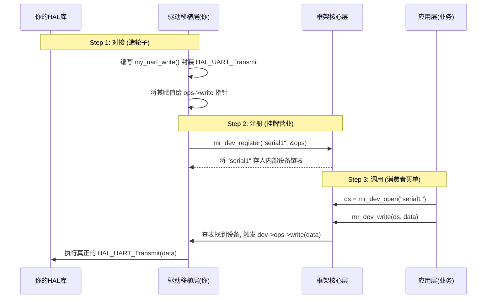

你好！我是 Rich OS。收到你的反馈了！在不同的 Markdown 解析器（特别是部分聊天窗口）中，Mermaid 语法的兼容性确实会有些差异，尤其是带有空格的节点、旧版的连线语法或者嵌套过深时容易渲染失败。

为了确保你这次能拥有完美的阅读和知识管理体验（完全适配 Obsidian），我**重构了 Mermaid 语法的标准性**（使用了兼容性最好的节点和连线声明）。同时，考虑到有些聊天软件原生不支持渲染，我在图表下方**额外补充了文本形态的架构结构**，保证你的认知不会因为显示问题而中断。

让我们重新开启这场“破盒之旅”：

---

### 一、 概念破冰：什么是设备驱动框架？

**1. 框架的本质到底是什么？**

**一句话解释**：设备驱动框架就是一个“沙漏型”的中间商，它向下强制收编所有五花八门的硬件驱动，向上提供统一的标准访问接口。

**裸机痛点引出**：在裸机开发中，你想发串口数据，STM32 下写 `HAL_UART_Transmit`，换成 WCH 芯片就得改成 `USART_SendData`。如果你的项目有一万行代码，换一次芯片意味着你要全局搜索并重写成百上千处业务逻辑。框架的本质使命，就是**把“硬件的易变性”隔离在底层，让应用层的代码实现跨芯片的“一次编写，到处编译”**。

**2. 知识锚点映射**

你最熟悉的 `HAL` 库，依然是这个系统中最坚实的基石。框架**绝对不会**取代 HAL 库去直接操作寄存器，它只是在 HAL 库上面盖了一层“标准化的大楼”。

你可以把框架理解为一个**国际标准插线板**：应用层是各种电器（只需要标准的三孔插座），而你写的底层代码，就是用特定芯片的 HAL 库去手工打磨一个符合这个插座标准的“插头”。

---

### 二、 全局视野：分层架构与认知映射

为了建立空间感，我们来看看 `mr-library`（MR 框架）的经典分层。

_注意：这里发生了“控制权反转”（IoC）。以前是你的业务逻辑主动去调 HAL；现在，业务只调框架，框架再通过指针“回头调用”你的底层驱动。_

代码段

![[Pasted image 20260411232345.png]]

> **🛠️ 纯文本备用架构图（防止插件未渲染）：**
> 
> [应用层: 业务代码]
> 
> 　└── (调用) `mr_dev_write()`
> 
> 　　　└── [框架核心: 查表与分发]
> 
> 　　　　　└── [抽象设备: Serial标准]
> 
> 　　　　　　　└── (函数指针跳转)
> 
> 　　　　　　　　　└── [移植层: 你写的 `my_uart_write`]
> 
> 　　　　　　　　　　　└── (调用) [HAL层: `HAL_UART_Transmit`]

**角色映射表：你的工作在哪？**

|**架构层级**|**代码位置**|**谁来负责？**|**你的主要工作 (Driver工程师视角)**|
|---|---|---|---|
|**应用层**|`main.c` / 业务线程|业务开发同事|调用 `mr_dev_open/write` 实现产品功能。|
|**框架核心**|`source/`, `include/`|框架作者|**无需修改**。享受它提供的查找、内存管理等服务。|
|**设备抽象**|`device/`|框架作者|**无需修改**。这里定义了 SPI/UART 等外设的标准行为。|
|**驱动/移植**|`driver/` 或 `bsp/`|**你（底层工程师）**|**核心战场**。编写胶水代码，将框架的“函数指针”指向你熟悉的 HAL 库函数。|
|**硬件层**|芯片厂商 SDK|芯片原厂 (如 ST)|配置 CubeMX，生成基础的系统时钟和底层初始化。|

---

### 三、 核心解耦机制（框架的“内功”）

**1. C 语言的面向对象与解耦**

C 语言没有 `class` 和 `virtual` 关键字，MR 框架是如何做到解耦的？

**秘诀是：包含函数指针的结构体（Struct）**。

在框架看来，万物皆“设备”。每个设备都会绑定一个“操作方法集”结构体（类似于 C++ 的虚函数表）。在这个结构体里，装着 `open`、`read`、`write` 等指针。

**2. 为什么要包这层标准接口？**

因为只有通过统一的 `mr_dev_open` 和 `mr_dev_read`，应用层才能完全与物理细节隔离。不管底层是 SPI 接口的温湿度传感器，还是 I2C 接口的 EEPROM，上层看到的都是一个设备描述符（句柄 `int fd`），像读写普通文件一样去操作外设。这就是经典的“一切皆文件”思想。

---

### 四、 最小使用心智模型（从注册到调用）

我们将视角切换为“自底向上”。看看一个设备是怎么从底层“挂牌营业”，最终被顶层“消费”的。

代码段


```mermaid
sequenceDiagram
    participant HAL as 你的HAL库
    participant Driver as 驱动移植层(你)
    participant Core as 框架核心层
    participant App as 应用层(业务)

    Note over HAL, Driver: Step 1: 对接 (造轮子)
    Driver->>Driver: 编写 my_uart_write() 封装 HAL_UART_Transmit
    Driver->>Driver: 将其赋值给 ops->write 指针

    Note over Driver, Core: Step 2: 注册 (挂牌营业)
    Driver->>Core: mr_dev_register("serial1", &ops)
    Core-->>Driver: 将 "serial1" 存入内部设备链表

    Note over Core, App: Step 3: 调用 (消费者买单)
    App->>Core: ds = mr_dev_open("serial1")
    App->>Core: mr_dev_write(ds, data)
    Core->>Driver: 查表找到设备, 触发 dev->ops->write(data)
    Driver->>HAL: 执行真正的 HAL_UART_Transmit(data)
```

**分步伪代码演示：**

**Step 1 & 2: 你的工作（底层对接与挂牌注册）**

C

```c
// 1. 写一个符合框架标准传参的函数，里面包着你熟悉的 HAL 库
ssize_t stm32_uart_write(struct mr_dev *dev, const void *buf, size_t size) {
    HAL_UART_Transmit(&huart1, (uint8_t*)buf, size, 100); 
    return size;
}

// 2. 把你的函数塞进框架提供的方法集(ops)结构体中
static struct mr_dev_ops uart_ops = {
    .write = stm32_uart_write,
    // ... 其他函数指针暂略
};

// 3. 在系统初始化时，去框架那里挂牌营业（注册）
int stm32_hw_uart_init(void) {
    // 告诉框架：我叫 "serial1"，这是我的操作说明书 uart_ops
    mr_dev_register(&my_uart_dev, "serial1", &uart_ops); 
    return 0;
}
```

**Step 3: 应用层同事的工作（纯粹的业务调用）**

C

```c
// 应用层的 .c 文件中不再出现任何 HAL 或 STM32 的字眼！
int main(void) {
    mr_auto_init(); // 框架自动初始化所有底层设备
    
    // 通过名字 "serial1" 找到设备，获取句柄
    int ds = mr_dev_open("serial1", MR_O_RDWR); 
    
    // 通过句柄无脑发送数据
    mr_dev_write(ds, "Hello World\r\n", 13); 
    
    while(1);
}
```

---

### 五、 剖析：剥开一层黑盒

现在，我们拿应用层最常用的 `mr_dev_write` 开刀，看看它到底经历了什么魔法，最终跳跃到你的寄存器/HAL层的。

**大白话调用链跟踪：**

1. 业务层执行 `mr_dev_write(ds, buf, size)`。
    
2. 框架拿到这个整数句柄 `ds`，去系统内部的一个对象池（链表）里查表，找到了当初你注册的那个设备结构体指针 `struct mr_dev *dev`。
    
3. 框架提取这个设备结构体里面的“操作说明书”：`dev->ops`。
    
4. 框架直接执行 C 语言函数指针跳转：`return dev->ops->write(dev, buf, size);`
    
5. 因为在 **Step 1** 中，你已经把 `write` 指针指向了 `stm32_uart_write`，所以此时 PC（程序计数器）指针直接欢快地跳进了你写的函数里，执行了那句底层的 `HAL_UART_Transmit`。
    

> **认知比喻：** 老板（应用层）把文件（数据）交给行政秘书 `mr_dev_write`。秘书根据部门编号（`ds`）查通讯录，找到对应经理（底层设备），然后拨通电话（函数指针跳转）让经理去干活（驱动外设）。老板根本不需要知道底下干活的是 ST 的经理还是 WCH 的经理。

---

### 六、 常见误解与阵痛点预防

习惯了单兵作战（裸机直调）的工程师，初入框架协作时最容易犯这 3 个错误：

1. **“穿透框架”直接硬调底层**：明明项目引入了 MR 框架，为了图自己省事，偷偷在应用层 `main.c` 里直接 `#include "stm32f4xx_hal.h"` 然后调 HAL 库发数据。这彻底破坏了解耦的初衷，后续换芯片时这里就会成为无法编译的“定时炸弹”。**记住：业务层严禁越权包含底层硬件头文件。**
    
2. **在回调函数里“睡死”**：框架底层的读写（如框架接收中断的回调）往往在中断上下文中运行。如果你在移植层的 `read` 或 `write` 适配函数中，使用 `HAL_Delay(1000)` 或 `while(flag==0)` 死等标志位，极易导致整个系统或 RTOS 卡死。
    
3. **未注册先打开**：应用层报错说找不到设备或引发 HardFault。通常是因为底层的 `mr_dev_register` 还没执行（或者宏定义开关没开导致代码被裁剪），顶层就急着去 `mr_dev_open`。**排查崩溃首查：底层挂牌成功了没？设备链表里到底有没有这个字符串名字？**
    

---

### 七、 第一周上手路线图

不要立刻去克隆仓库看全量的源码，不要一上来就看复杂的设备树树形结构。对于 Driver 工程师，请用这 3 步来验证认知：

- **🎯 目标 1：看懂“菜单”**。打开框架源码的 `include/mr_lib.h`，**只看**里面带 `mr_dev_` 前缀的全局函数声明。认清框架向上层暴露的边界长什么样。
    
- **🎯 目标 2：看透一个极简设备（Pin点灯）**。找到一个点灯的 Demo，查看它的应用层代码，然后顺藤摸瓜找到对应的 `driver/pin/` 驱动实现，看看别人是怎么把 `HAL_GPIO_WritePin` 塞进 `ops->write` 指针里的。这是最好的临摹对象。
    
- **🎯 目标 3：跑通并打断点**。配置并运行官方的串口 (Serial) Demo，打个断点在你的底层 HAL 发送函数里。触发断点后，查看 IDE 的 **Call Stack (调用栈)**，亲眼看着程序是怎么从 `main()` -> `mr_dev_write` -> 跨过指针 -> 来到你的 HAL 层的。看到这一幕，框架的黑盒就彻底碎了。