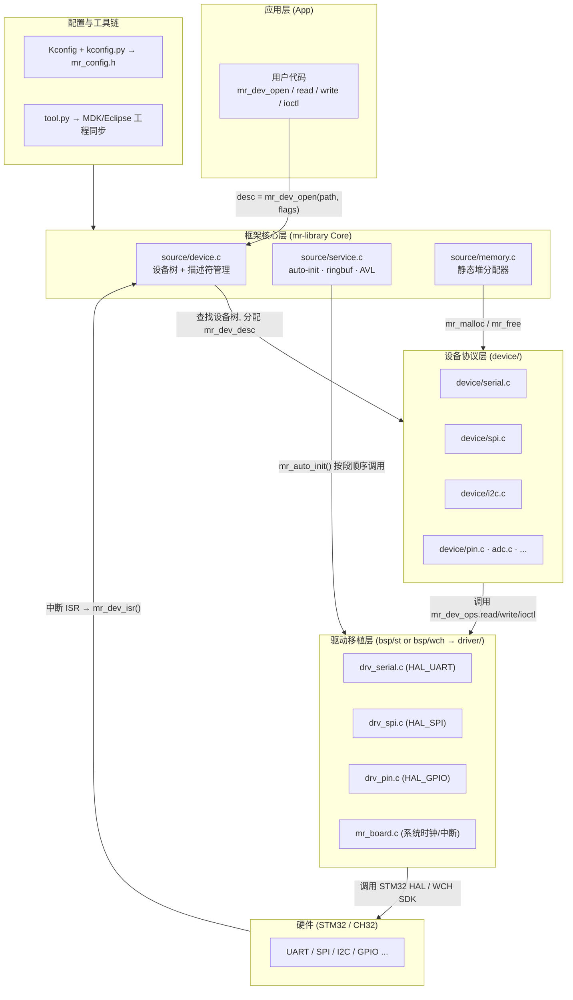
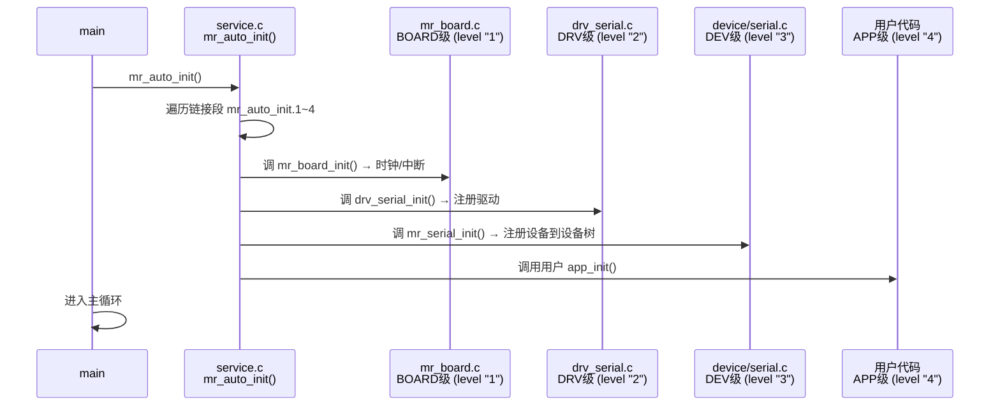
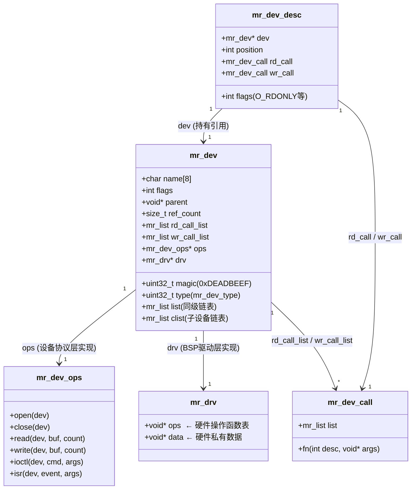
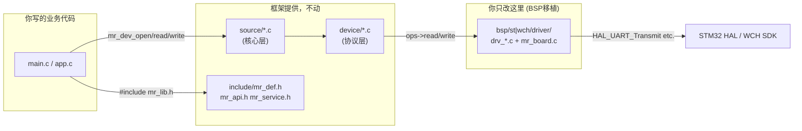

好，现在我已经把整个代码库扫描完毕，进入 **Phase 1**。

  

---

  

# Phase 1：全局心智模型 (Macro-Architecture)

  

## 1. 系统定位

  

**mr-library** 是一个面向 MCU 的**嵌入式设备抽象框架**（v0.0.9），它的核心野心是：把 Linux 那套 `open/read/write/ioctl/close` 的设备文件范式，搬到 Cortex-M / RISC-V 裸机或 RTOS 之上。

  

换句话说：**用户代码不再直接调 HAL，而是通过路径字符串（如 `"spi1/spi10"`）打开一个"设备描述符"，像操作文件一样操作硬件外设。**

  

---

  

## 2. 宏观架构图

  

```mermaid

graph TB

    subgraph APP["应用层 (App)"]

        A1["用户代码<br/>mr_dev_open / read / write / ioctl"]

    end

  

    subgraph FW["框架核心层 (mr-library Core)"]

        B1["source/device.c<br/>设备树 + 描述符管理"]

        B2["source/service.c<br/>auto-init · ringbuf · AVL"]

        B3["source/memory.c<br/>静态堆分配器"]

    end

  

    subgraph DEV["设备协议层 (device/)"]

        C1["device/serial.c"]

        C2["device/spi.c"]

        C3["device/i2c.c"]

        C4["device/pin.c · adc.c · ..."]

    end

  

    subgraph DRV["驱动移植层 (bsp/st or bsp/wch → driver/)"]

        D1["drv_serial.c (HAL_UART)"]

        D2["drv_spi.c (HAL_SPI)"]

        D3["drv_pin.c (HAL_GPIO)"]

        D4["mr_board.c (系统时钟/中断)"]

    end

  

    subgraph HW["硬件 (STM32 / CH32)"]

        E1["UART / SPI / I2C / GPIO ..."]

    end

  

    subgraph CFG["配置与工具链"]

        F1["Kconfig + kconfig.py → mr_config.h"]

        F2["tool.py → MDK/Eclipse 工程同步"]

    end

  

    A1 -->|"desc = mr_dev_open(path, flags)"| B1

    B1 -->|"查找设备树, 分配 mr_dev_desc"| DEV

    DEV -->|"调用 mr_dev_ops.read/write/ioctl"| DRV

    DRV -->|"调用 STM32 HAL / WCH SDK"| HW

    HW -->|"中断 ISR → mr_dev_isr()"| B1

    B2 -->|"mr_auto_init() 按段顺序调用"| DRV

    B3 -->|"mr_malloc / mr_free"| DEV

    CFG --> FW

```

  

---

  

## 3. 初始化时序：从上电到设备就绪

  

```mermaid

sequenceDiagram

    participant main

    participant service as service.c<br/>mr_auto_init()

    participant board as mr_board.c<br/>BOARD级 (level "1")

    participant drv as drv_serial.c<br/>DRV级 (level "2")

    participant dev as device/serial.c<br/>DEV级 (level "3")

    participant app as 用户代码<br/>APP级 (level "4")

  

    main->>service: mr_auto_init()

    service->>service: 遍历链接段 mr_auto_init.1~4

    service->>board: 调 mr_board_init() → 时钟/中断

    service->>drv: 调 drv_serial_init() → 注册驱动

    service->>dev: 调 mr_serial_init() → 注册设备到设备树

    service->>app: 调用用户 app_init()

    main->>main: 进入主循环

```

  

---

  

## 4. 设备访问的核心对象关系

  

```mermaid

classDiagram

    class mr_dev {

        +uint32_t magic (0xDEADBEEF)

        +char name[8]

        +uint32_t type (mr_dev_type)

        +int flags

        +void* parent

        +mr_list list (同级链表)

        +mr_list clist (子设备链表)

        +size_t ref_count

        +mr_list rd_call_list

        +mr_list wr_call_list

        +mr_dev_ops* ops

        +mr_drv* drv

    }

  

    class mr_dev_ops {

        +open(dev)

        +close(dev)

        +read(dev, buf, count)

        +write(dev, buf, count)

        +ioctl(dev, cmd, args)

        +isr(dev, event, args)

    }

  

    class mr_drv {

        +void* ops  ← 硬件操作函数表

        +void* data ← 硬件私有数据

    }

  

    class mr_dev_desc {

        +mr_dev* dev

        +int flags (O_RDONLY等)

        +int position

        +mr_dev_call rd_call

        +mr_dev_call wr_call

    }

  

    class mr_dev_call {

        +mr_list list

        +fn(int desc, void* args)

    }

  

    mr_dev "1" --> "1" mr_dev_ops : ops (设备协议层实现)

    mr_dev "1" --> "1" mr_drv     : drv (BSP驱动层实现)

    mr_dev_desc "1" --> "1" mr_dev : dev (持有引用)

    mr_dev_desc "1" --> "1" mr_dev_call : rd_call / wr_call

    mr_dev "1" --> "*" mr_dev_call : rd_call_list / wr_call_list

```

  

---

  

## 5. 五个最核心的源文件

  

| 优先级 | 文件路径 | 一句话职责 |

|--------|----------|------------|

| ⭐⭐⭐ | `include/mr_def.h` | **全局类型宪法**：定义 `mr_dev`、`mr_dev_ops`、`mr_drv`、ringbuf、AVL、错误码、ioctl 命令——整个框架的数据结构根基 |

| ⭐⭐⭐ | `source/device.c` | **设备树内核**：实现路径注册、查找、open/read/write/ioctl/close 和描述符表管理——类比 Linux VFS 的 `fs/file.c` |

| ⭐⭐⭐ | `source/service.c` | **系统服务引擎**：实现 `mr_auto_init()`（按链接段顺序启动）、ringbuf、AVL 树、`mr_printf` |

| ⭐⭐ | `source/memory.c` | **静态堆分配器**：在固定数组 `heap_mem[]` 上实现 malloc/free，无 OS 依赖 |

| ⭐⭐ | `device/serial.c` | **典型设备协议层**：展示"设备协议层"如何用 ringbuf 封装收发、挂载中断回调——读懂它就读懂了所有设备的范式 |

  

---

  

## 6. 层次依赖关系（一张图看清边界）

  

```mermaid

graph LR

    subgraph "你只改这里 (BSP移植)"

        L4["bsp/st|wch/driver/<br/>drv_*.c + mr_board.c"]

    end

    subgraph "框架提供，不动"

        L3["device/*.c<br/>(协议层)"]

        L2["source/*.c<br/>(核心层)"]

        L1["include/mr_def.h<br/>mr_api.h mr_service.h"]

    end

    subgraph "你写的业务代码"

        L5["main.c / app.c"]

    end

  

    L5 -->|"#include mr_lib.h"| L1

    L5 -->|"mr_dev_open/read/write"| L2

    L2 --> L3

    L3 -->|"ops->read/write"| L4

    L4 -->|"HAL_UART_Transmit etc."| HW["STM32 HAL / WCH SDK"]

```

  

---

  

## 认知确认

  

这张全景图揭示了 mr-library 的本质：**它是一个极简版的嵌入式 VFS（虚拟文件系统）**，用链接段 trick 实现零侵入自动初始化，用路径字符串 + 设备描述符把硬件操作统一成 POSIX 风格的文件 IO。

  

**请回答这个问题，再进入 Phase 2：**

  

> 在这个架构里，`mr_dev_ops`（设备协议层的操作函数表）和 `mr_drv.ops`（驱动层的操作函数表）分别由谁实现、分别承担什么不同的责任？你能用一句话描述这两层之间的"契约"是什么吗？

  

（这个问题将帮你在脑中真正锚定"协议层 vs 驱动层"的边界，这是理解整个框架最关键的一跳。）